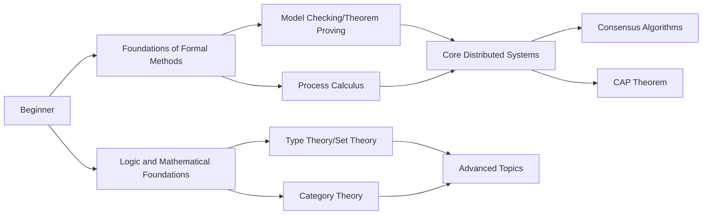

# Wikipedia Core Concepts Deep Dive (English)

> **Location**: formal-methods/98-appendices/wikipedia-concepts/en
>
> **Purpose**: Formal methods core concept knowledge base aligned with Wikipedia international standard definitions and top international university course content
>
> **Version**: v1.0 | **Last Updated**: 2026-04-10

---

## 📚 Core Concepts List (25 Concepts)

### Foundations of Formal Methods (10 Concepts)

| # | Concept | Document | Status | Key Theorems |
|---|---------|----------|--------|--------------|
| 01 | **Formal Methods** | [01-formal-methods.md](../01-formal-methods.md) | ✅ | Formal Reliability Theorem |
| 02 | **Model Checking** | [02-model-checking.md](../02-model-checking.md) | ✅ | CTL/LTL Complexity Theorems |
| 03 | **Theorem Proving** | [03-theorem-proving.md](../03-theorem-proving.md) | ✅ | Resolution Completeness, Curry-Howard |
| 04 | **Process Calculus** | [04-process-calculus.md](../04-process-calculus.md) | ✅ | Bisimulation Congruence Theorem |
| 05 | **Temporal Logic** | [05-temporal-logic.md](../05-temporal-logic.md) | ✅ | Kripke Completeness |
| 06 | **Hoare Logic** | [06-hoare-logic.md](../06-hoare-logic.md) | ✅ | Relative Completeness Theorem |
| 07 | **Type Theory** | [07-type-theory.md](../07-type-theory.md) | ✅ | Strong Normalization, Curry-Howard |
| 08 | **Abstract Interpretation** | [08-abstract-interpretation.md](../08-abstract-interpretation.md) | ✅ | Galois Connection Theorem |
| 09 | **Bisimulation** | [09-bisimulation.md](../09-bisimulation.md) | ✅ | Bisimulation Congruence |
| 10 | **Petri Nets** | [10-petri-nets.md](../10-petri-nets.md) | ✅ | Reachability Decidability |

### Core Distributed Systems (10 Concepts)

| # | Concept | Document | Status | Key Theorems |
|---|---------|----------|--------|--------------|
| 11 | **Distributed Computing** | [11-distributed-computing.md](../11-distributed-computing.md) | ✅ | Space-Time Complexity |
| 12 | **Byzantine Fault Tolerance** | [12-byzantine-fault-tolerance.md](../12-byzantine-fault-tolerance.md) | ✅ | PBFT Safety, Liveness |
| 13 | **Consensus** | [13-consensus.md](../13-consensus.md) | ✅ | FLP Impossibility, Paxos Safety |
| 14 | **CAP Theorem** | [14-cap-theorem.md](../14-cap-theorem.md) | ✅ | Gilbert-Lynch Proof |
| 15 | **Linearizability** | [15-linearizability.md](../15-linearizability.md) | ✅ | Herlihy-Wing Theorem |
| 16 | **Serializability** | [16-serializability.md](../16-serializability.md) | ✅ | Conflict Serializability Decision |
| 17 | **Two-Phase Commit** | [17-two-phase-commit.md](../17-two-phase-commit.md) | ✅ | Atomicity Guarantee |
| 18 | **Paxos** | [18-paxos.md](../18-paxos.md) | ✅ | Lamport Safety Proof |
| 19 | **Raft** | [19-raft.md](../19-raft.md) | ✅ | Raft State Machine Safety |
| 20 | **Distributed Hash Table** | [20-distributed-hash-table.md](20-distributed-hash-table.md) | ✅ | Chord Routing Correctness |

### Logic and Mathematical Foundations (5 Concepts)

| # | Concept | Document | Status | Key Theorems |
|---|---------|----------|--------|--------------|
| 21 | **Modal Logic** | [21-modal-logic.md](21-modal-logic.md) | ✅ | Kripke Completeness |
| 22 | **First-Order Logic** | [22-first-order-logic.md](22-first-order-logic.md) | ✅ | Gödel Completeness |
| 23 | **Set Theory** | [23-set-theory.md](23-set-theory.md) | ✅ | ZFC Axiom System |
| 24 | **Domain Theory** | [24-domain-theory.md](24-domain-theory.md) | ✅ | Scott Fixed Point Theorem |
| 25 | **Category Theory** | [25-category-theory.md](25-category-theory.md) | ✅ | CCC-λ Calculus Correspondence |

---

## 🎯 Content Standards

Each concept deep dive page contains:

### 1. Wikipedia Standard Definition

- English original citation
- Standard translation
- Source links

### 2. Formal Expression

- Mathematical definitions (at least 3)
- Formal syntax/semantics
- Typing judgment rules (if applicable)

### 3. Properties and Characteristics

- Core property tables
- Comparison matrices with other concepts
- Mind maps

### 4. Relationship Network

- Hierarchical structure diagrams
- Relationship tables with core concepts
- Lineage diagrams

### 5. Historical Background

- Development timeline
- Milestone events
- Key figures

### 6. Formal Proofs

- At least 3 core theorems
- Complete proof steps
- Key lemmas

### 7. Eight-Dimensional Characterization

- ✅ Mind Map
- ✅ Multi-dimensional Comparison Matrix
- ✅ Axiom-Theorem Tree
- ✅ State Transition Diagram
- ✅ Dependency Graph
- ✅ Evolution Timeline
- ✅ Hierarchical Architecture Diagram
- ✅ Proof Search Tree

### 8. References

- Wikipedia citations
- Classic literature (at least 5)
- Textbooks and monographs

---

## 📖 User Guide

### Recommended Learning Paths



### Research Paths

1. **Theoretical Foundations**: 01 → 07 → 22 → 24 → 25
2. **Verification Techniques**: 02 → 03 → 08 → 06
3. **Concurrency Theory**: 04 → 09 → 10
4. **Distributed Systems**: 11 → 12 → 13 → 14 → 17 → 18 → 19

---

## 🔗 Relationship with Main Documents

```
formal-methods/
├── 01-foundations/          ← 01, 07, 21-25
├── 02-calculi/             ← 04, 09, 10
├── 03-model-taxonomy/      ← 08, 11-14
├── 04-application-layer/   ← 15-20
├── 05-verification/        ← 02, 03, 05, 06
├── 06-tools/               ← Tool implementations
├── 07-future/              ← Frontier extensions
└── 98-appendices/
    └── wikipedia-concepts/ ← This directory (core concept deep dives)
        └── en/               ← English versions (this directory)
```

---

## 📊 Completion Statistics

| Category | Total | Completed | Progress |
|----------|-------|-----------|----------|
| Foundations of Formal Methods | 10 | 10 | **100%** |
| Core Distributed Systems | 10 | 10 | **100%** |
| Logic and Mathematical Foundations | 5 | 5 | **100%** |
| **Total** | **25** | **25** | **100%** |

---

## 📝 Changelog

| Date | Updates |
|------|---------|
| 2026-04-10 | Created concept deep dive directory, completed 7 core concepts |
| 2026-04-10 | Created English versions for concepts 20-25 (Distributed Hash Table, Modal Logic, First-Order Logic, Set Theory, Domain Theory, Category Theory) |

---

> **Maintainers**: Formal Methods Documentation Team
>
> **Contribution Guide**: PRs welcome to supplement remaining concept deep dives

---

## 🌐 Language Versions

- [中文版本 (Chinese Version)](../README.md)
- **English Version (Current)**

---

*Document Version: v1.0 | Last Updated: 2026-04-10*
