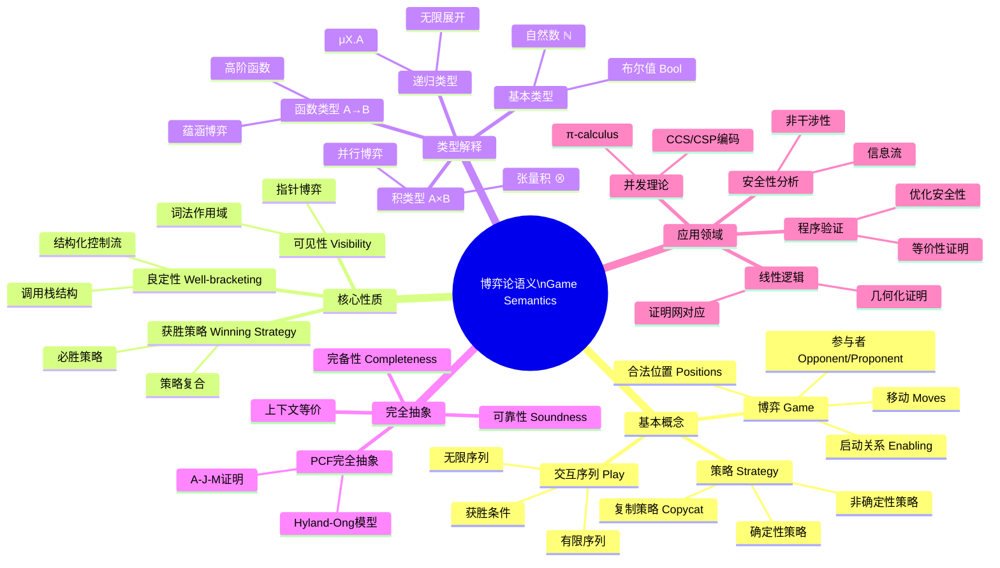
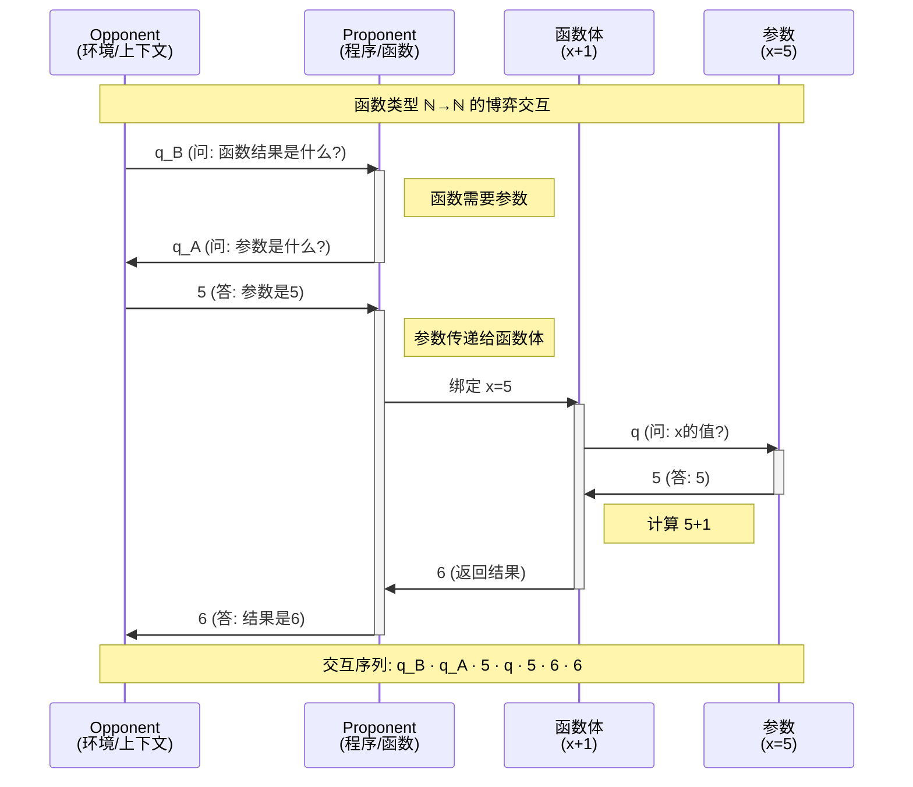
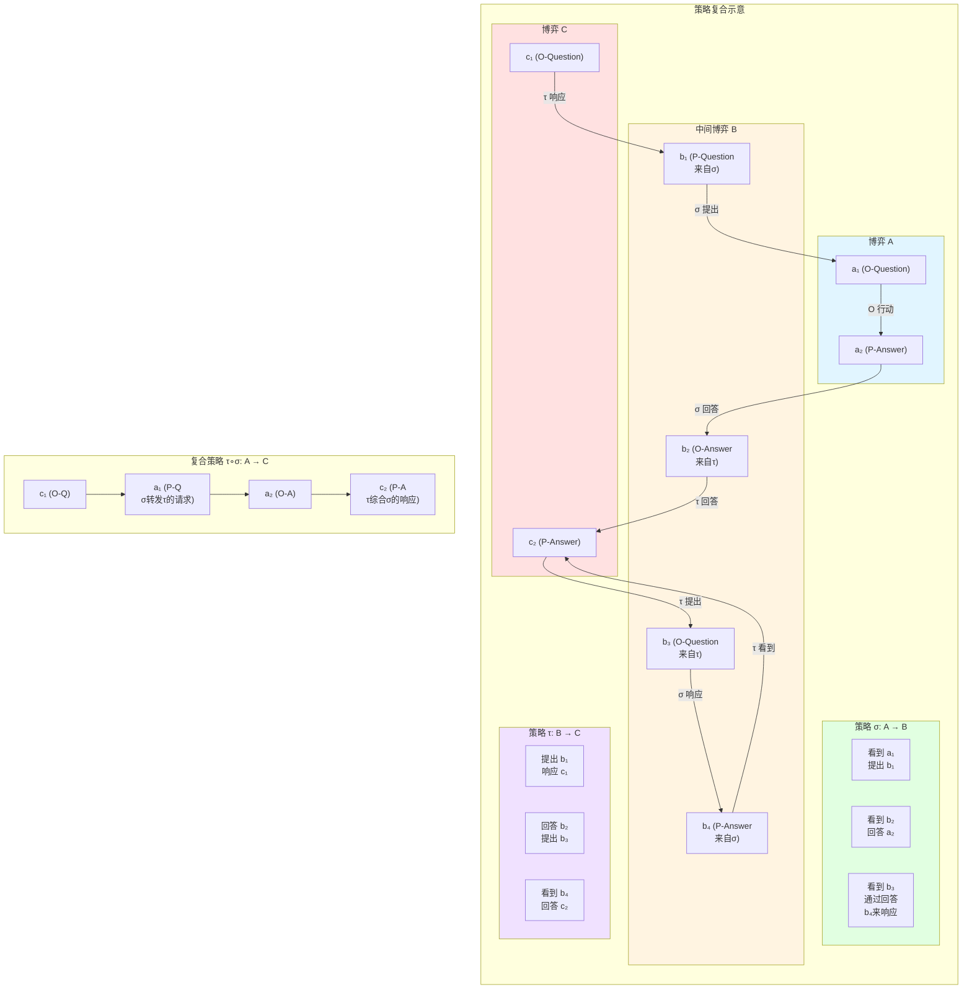
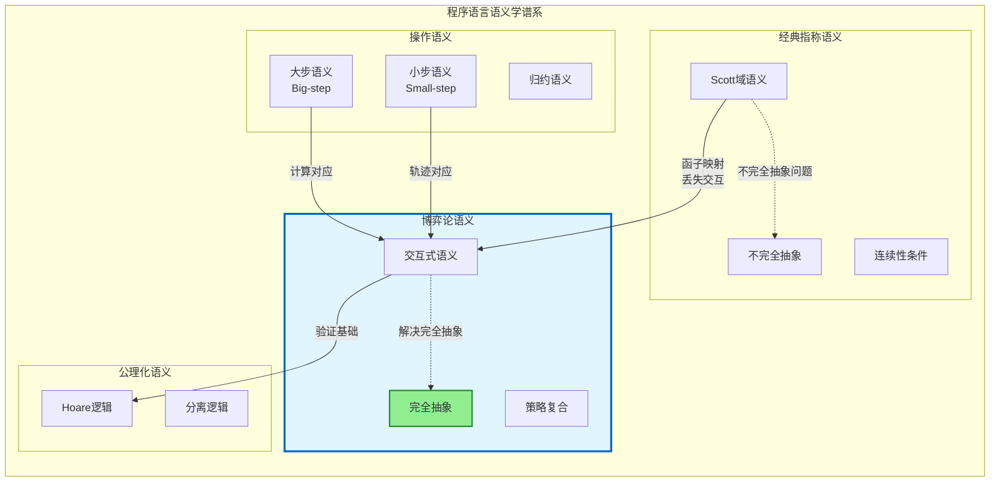

# 博弈论语义 (Game Semantics)

> 所属阶段: Struct/ | 前置依赖: [01-foundations/01.1-type-theory-basics.md](../Struct/01-foundations/01.1-type-theory-basics.md), [02-calculi/02.1-lambda-calculus.md](../Struct/02-calculi/02.1-lambda-calculus.md) | 形式化等级: L5-L6

## 摘要

博弈论语义是程序语言语义学中一种革命性的方法，通过将程序的计算过程建模为两个参与者（**Proponent** 和 **Opponent**）之间的博弈，为程序行为提供了操作性和数学上严谨的描述。
本章节系统阐述博弈论语义的核心概念、形式化理论及其在完全抽象性证明中的关键应用，特别关注 Abramsky-Jagadeesan-Malacaria 和 Hyland-Ong 的开创性工作。

---

## 1. 概念定义 (Definitions)

### 1.1 博弈的基本概念

**Def-S-99-12: 博弈 (Game)**

一个**博弈** $\mathcal{G}$ 是一个七元组 $(M, \lambda, \vdash, P, W, \sigma, \tau)$，其中：

- $M$ 是**移动 (moves)** 的集合，表示博弈中所有可能的动作；
- $\lambda: M \to \{O, P\} \times \{Q, A\}$ 是**标记函数**，为每个移动分配**参与者**（Opponent $O$ / Proponent $P$）和**性质**（Question $Q$ / Answer $A$）；
- $\vdash \subseteq (M \cup \{\star\}) \times M$ 是**启动关系 (enabling relation)**，表示移动的合法性条件；
- $P \subseteq M^*$ 是**位置 (positions)** 的集合，即所有合法的交互序列；
- $W \subseteq P^\omega$ 是**获胜条件 (winning conditions)**，定义无限博弈的胜负；
- $\sigma: M_O \to \mathcal{P}(M_P)$ 是Opponent的策略函数；
- $\tau: M_P \to \mathcal{P}(M_O)$ 是Proponent的策略函数。

形式化地，我们要求位置集合 $P$ 满足：

1. **非空性**: $\epsilon \in P$（空序列是合法位置）
2. **前缀封闭性**: 若 $sm \in P$，则 $s \in P$
3. **交替性**: 若 $sab \in P$，则 $\lambda^{OP}(a) \neq \lambda^{OP}(b)$，其中 $\lambda^{OP}: M \to \{O, P\}$
4. **启动性**: 若 $sm \in P$，则 $\star \vdash m$ 或存在 $k < |s|$ 使得 $s_k \vdash m$

**直观解释**: 博弈建模了两个参与者之间的对话。Opponent 代表"环境"或"上下文"，提出挑战（Questions）；Proponent 代表"程序"或"系统"，提供响应（Answers）。启动关系 $\vdash$ 确保交互遵循语法规则，如函数调用需要先有函数访问。

---

### 1.2 策略的形式化

**Def-S-99-13: 策略 (Strategy)**

给定博弈 $\mathcal{G}$，一个**策略** $\sigma$ 是 Proponent 的响应规则，形式化为位置集合的子集：

$$\sigma \subseteq P_A = \{ s \in P \mid s \text{ 以 Opponent 的移动结束或为空} \}$$

策略必须满足以下性质：

1. **非空性**: $\epsilon \in \sigma$
2. **前缀封闭性**: 若 $s \in \sigma$ 且 $t \sqsubseteq s$ 是偶数长度前缀，则 $t \in \sigma$
3. **确定性**: 若 $sab, sac \in \sigma$，则 $b = c$
4. **良定性 (Well-bracketing)**: 回答必须对应于最内层的未回答问题

形式化地，良定性要求：对于任意 $sab \in \sigma$，若 $a$ 是 Question 且 $b$ 是 Answer，则 $a$ 是 $s$ 中最右侧的未回答 Question。

**策略的表示**: 策略可视为偏函数 $\sigma: P_O \rightharpoonup M_P$，其中：

$$P_O = \{ s \in P \mid s = \epsilon \text{ 或 } s \text{ 以 Opponent 移动结束} \}$$

且满足：$\sigma(sa) = b \iff sab \in \sigma$。

---

### 1.3 交互序列

**Def-S-99-14: 交互序列 (Play/Interaction Sequence)**

一个**交互序列**（或称**博弈轨迹**）是一个有限或无限的移动序列 $s = m_1 m_2 \cdots m_n \in M^*$，满足：

1. **启动条件**: 对于每个 $i \in \{1, \ldots, n\}$，要么 $\star \vdash m_i$，要么存在 $j < i$ 使得 $m_j \vdash m_i$；
2. **交替条件**: 相邻移动属于不同参与者，即 $\lambda^{OP}(m_i) \neq \lambda^{OP}(m_{i+1})$；
3. **合法性**: $s \in P$，即 $s$ 是博弈 $\mathcal{G}$ 的合法位置。

**最大交互序列**: 若 $s$ 不能进一步扩展（即不存在 $m \in M$ 使得 $sm \in P$），则称 $s$ 是**最大**的。

**交互序列的分类**: 给定策略 $\sigma$ 和 $\tau$（分别为 Proponent 和 Opponent 的策略），定义：

- **$\sigma$-遵守序列**: 所有 Proponent 的移动都遵循 $\sigma$
- **$\tau$-遵守序列**: 所有 Opponent 的移动都遵循 $\tau$
- **$(\sigma, \tau)$-交互**: 双方共同遵守各自策略的交互序列

形式化定义集合：

$$\text{comp}(\sigma, \tau) = \{ s \in P \mid s \text{ 是 } \sigma\text{-遵守且 } \tau\text{-遵守的} \}$$

---

### 1.4 必胜策略

**Def-S-99-15: 必胜策略 (Winning Strategy)**

设 $\mathcal{G} = (M, \lambda, \vdash, P, W)$ 为博弈。一个 Proponent 策略 $\sigma$ 是**必胜的 (winning)**，当且仅当：

1. **有限博弈**: 对于所有最大有限交互序列 $s \in \text{comp}(\sigma, \tau)$，$s$ 以 Proponent 的移动结束（即长度为奇数，假设从 Opponent 开始）；
2. **无限博弈**: 对于所有无限交互序列 $s \in P^\omega$，若 $s$ 的每个有限前缀都在 $\sigma$ 中，则 $s \in W$（Proponent 满足获胜条件）。

形式化地：

$$\sigma \text{ 是必胜的} \iff \forall \tau: \begin{cases}
\text{若 } s \in \text{comp}(\sigma, \tau) \text{ 最大有限，则 } |s| \equiv 1 \pmod{2} \\
\text{若 } s \in \text{comp}(\sigma, \tau) \cap P^\omega, \text{则 } s \in W
\end{cases}$$

**存在必胜策略的博弈**: 若 Proponent 存在必胜策略，记为 $\vdash_P \mathcal{G}$；若 Opponent 存在必胜策略，记为 $\vdash_O \mathcal{G}$。

---

### 1.5 线性逻辑博弈

**Def-S-99-16: 线性逻辑博弈 (Linear Logic Games)**

给定 Girard 的**线性逻辑 (Linear Logic)**，每个公式 $A$ 对应一个博弈 $\llbracket A \rrbracket$，逻辑联结词对应博弈运算：

| 线性逻辑联结词 | 博弈语义 | 形式化定义 |
|:---|:---|:---|
| $A \otimes B$ (张量积) | 并行积 | $\llbracket A \rrbracket \otimes \llbracket B \rrbracket$：双方同时选择，Proponent 控制两个分量 |
| $A \par B$ (par) | 并行和 | $\llbracket A \rrbracket \par \llbracket B \rrbracket$：Opponent 控制两个分量 |
| $A \multimap B$ (线性蕴涵) | 函数空间 | $\llbracket A \rrbracket \multimap \llbracket B \rrbracket$：A为Opponent控制，B为Proponent控制 |
| $!A$ (of course) | 复制博弈 | $!\llbracket A \rrbracket$：允许Opponent无限次复制A的博弈 |
| $?A$ (why not) | 复制博弈 | $?\llbracket A \rrbracket$：允许Proponent无限次复制A的博弈 |
| $\mathbf{1}$ | 单位博弈 | 单元素博弈，立即获胜 |
| $\bot$ | 对偶单位 | 单元素博弈，立即失败 |

**证明即策略**: 线性逻辑的证明对应于博弈中的**必胜策略**。具体而言：

$$\vdash \Gamma \text{ 在 LL 中可证} \iff \text{存在必胜策略 } \sigma: \llbracket \Gamma \rrbracket$$

其中 $\llbracket \Gamma \rrbracket = \llbracket A_1 \rrbracket \par \cdots \par \llbracket A_n \rrbracket$ 对于 $\Gamma = A_1, \ldots, A_n$。

---

### 1.6 完全抽象

**Def-S-99-17: 完全抽象 (Full Abstraction)**

设 $\mathcal{L}$ 为程序语言，$\mathcal{M}$ 为语义模型（数学结构）。一个语义解释 $\llbracket - \rrbracket: \mathcal{L} \to \mathcal{M}$ 是**完全抽象的**，当且仅当：

$$\llbracket M \rrbracket = \llbracket N \rrbracket \iff M \approx N$$

其中 $M \approx N$ 表示**上下文等价 (contextual equivalence)**：

$$M \approx N \iff \forall C[-]: C[M] \Downarrow \Leftrightarrow C[N] \Downarrow$$

即，两个程序在语义模型中等价当且仅当它们在所有上下文中行为不可区分。

**完全抽象的分解**: 完全抽象性可分解为两个方向：

1. **可靠性 (Soundness)**: $M \approx N \Rightarrow \llbracket M \rrbracket = \llbracket N \rrbracket$
   - 语义等价蕴含上下文等价（语义不区分行为相同的程序）

2. **完备性 (Completeness)**: $\llbracket M \rrbracket = \llbracket N \rrbracket \Rightarrow M \approx N$
   - 语义区分蕴含上下文区分（语义能捕捉所有行为差异）

博弈论语义的核心贡献在于为 PCF 等语言提供了**首个完全抽象模型**。

---

## 2. 属性推导 (Properties)

### 2.1 策略的复合性

**Lemma-S-99-07: 策略的复合性 (Compositionality of Strategies)**

设 $\sigma: A \multimap B$ 和 $\tau: B \multimap C$ 是策略。定义它们的**复合** $\tau \circ \sigma: A \multimap C$ 为：

$$\tau \circ \sigma = \{ s \upharpoonright_{A,C} \mid s \in (M_A + M_B + M_C)^*, s \upharpoonright_{A,B} \in \sigma, s \upharpoonright_{B,C} \in \tau \}$$

其中 $s \upharpoonright_{X,Y}$ 表示将 $s$ 限制到 $M_X \cup M_Y$ 上的投影。

**证明要点**:

1. **良定义性**: 需验证 $\tau \circ \sigma$ 满足策略的四个条件（非空、前缀封闭、确定、良定）。
   - 非空性：$\epsilon \in \sigma$ 且 $\epsilon \in \tau$，故 $\epsilon \in \tau \circ \sigma$。
   - 前缀封闭性：若 $t \sqsubseteq s \upharpoonright_{A,C}$ 且 $|t|$ 为偶数，则 $t = u \upharpoonright_{A,C}$ 对某个偶数长度的 $u \sqsubseteq s$。

2. **结合律**: 对于 $\sigma: A \multimap B$, $\tau: B \multimap C$, $\rho: C \multimap D$，有：
   $$(\rho \circ \tau) \circ \sigma = \rho \circ (\tau \circ \sigma)$$

3. **单位元**: 存在恒等策略 $\text{id}_A: A \multimap A$ 使得：
   $$\sigma \circ \text{id}_A = \sigma = \text{id}_B \circ \sigma$$

恒等策略 $\text{id}_A$ 定义为复制策略：在 $A$ 的每个 Question 上，Proponent 在另一侧立即复制该 Question；对于 Answer 同样复制。

---

### 2.2 博弈的幺半群结构

**Lemma-S-99-08: 博弈的幺半群结构 (Monoidal Structure of Games)**

博弈范畴 $\mathcal{G}$ 以张量积 $\otimes$ 为乘法的对称幺半群结构：

1. **张量积的结合性**: 存在自然同构 $\alpha_{A,B,C}: (A \otimes B) \otimes C \cong A \otimes (B \otimes C)$
2. **单位元**: $\mathbf{1}$ 是单位对象，有自然同构 $\lambda_A: \mathbf{1} \otimes A \cong A$ 和 $\rho_A: A \otimes \mathbf{1} \cong A$
3. **对称性**: 存在自然同构 $\gamma_{A,B}: A \otimes B \cong B \otimes A$

形式化地，$(\mathcal{G}, \otimes, \mathbf{1}, \alpha, \lambda, \rho, \gamma)$ 构成**对称幺半群范畴**。

**封闭结构**: 范畴 $\mathcal{G}$ 是**闭范畴**，有线性蕴涵 $\multimap$ 满足：

$$\mathcal{G}(A \otimes B, C) \cong \mathcal{G}(A, B \multimap C)$$

这正好对应于 Curry-Howard 同构中的线性逻辑规则：

$$\frac{\Gamma, A \vdash B}{\Gamma \vdash A \multimap B}$$

---

### 2.3 必胜策略的保持性

**Lemma-S-99-09: 必胜策略的保持性 (Preservation of Winning Strategies)**

若 $\sigma: A \multimap B$ 和 $\tau: B \multimap C$ 都是必胜策略，则复合策略 $\tau \circ \sigma: A \multimap C$ 也是必胜的。

**证明**:

设 $\rho$ 是 $C$ 上的任意 Opponent 策略。考虑交互序列 $s \in \text{comp}(\tau \circ \sigma, \rho)$。

**情况1**: $s$ 是有限的。

由复合的定义，存在交互序列 $u \in (M_A + M_B + M_C)^*$ 使得 $s = u \upharpoonright_{A,C}$，且：
- $u \upharpoonright_{A,B} \in \sigma$
- $u \upharpoonright_{B,C} \in \tau$

考虑 $u \upharpoonright_{B,C} \in \text{comp}(\tau, u \upharpoonright_C)$。由于 $\tau$ 是必胜的，若 $u \upharpoonright_{B,C}$ 最大，则其长度为奇数。

同理，$u \upharpoonright_{A,B} \in \text{comp}(\sigma, u \upharpoonright_B)$，由于 $\sigma$ 必胜，若最大则长度为奇数。

通过对 $u$ 长度的归纳，可证 $s$ 若以 Proponent 在 $C$ 上的移动结束，则 $s$ 长度为奇数。

**情况2**: $s$ 是无限的。

假设 $s$ 满足获胜条件 $W_C$。需证 $s \in W_{A \multimap C}$。

由于 $\tau$ 是必胜的，$u \upharpoonright_{B,C} \in W_{B \multimap C}$（相对于 $u \upharpoonright_C$）。
由于 $\sigma$ 是必胜的，$u \upharpoonright_{A,B} \in W_{A \multimap B}$（相对于 $u \upharpoonright_B$）。

由获胜条件的定义，$s = u \upharpoonright_{A,C}$ 满足 $A \multimap C$ 的获胜条件。

**直观**: 必胜策略的复合保持了"无论环境如何挑战，程序总能成功响应"的性质。

---

### 2.4 PCF 的完全抽象性

**Prop-S-99-03: PCF 的完全抽象性 (Full Abstraction for PCF)**

设 $\llbracket - \rrbracket_{AJM}$ 为 Abramsky-Jagadeesan-Malacaria 的博弈语义解释，$\approx_{obs}$ 为 PCF 的观测等价。则：

$$\llbracket M \rrbracket_{AJM} = \llbracket N \rrbracket_{AJM} \iff M \approx_{obs} N$$

**证明概要**:

**可靠性方向** ($\Leftarrow$):

若 $M \approx_{obs} N$，则对于所有上下文 $C[-]$，$C[M]$ 和 $C[N]$ 具有相同的可观测行为。

博弈语义满足**组合性**: $\llbracket C[M] \rrbracket = \llbracket C \rrbracket \circ \llbracket M \rrbracket$。

由于可观测行为完全由交互序列决定，且 $M$ 和 $N$ 在所有上下文中行为相同，故 $\llbracket M \rrbracket = \llbracket N \rrbracket$。

**完备性方向** ($\Rightarrow$):

这是 A-J-M 证明的核心创新。需证：若 $\llbracket M \rrbracket \neq \llbracket N \rrbracket$，则存在区分上下文 $C[-]$ 使得 $C[M] \Downarrow$ 但 $C[N] \Uparrow$（或反之）。

关键步骤：

1. **策略的范式分解**: 每个策略可分解为基本策略的组合。

2. **分离超平面**: 若 $\llbracket M \rrbracket \neq \llbracket N \rrbracket$，存在某个交互序列 $s$ 使得 $s \in \llbracket M \rrbracket$ 但 $s \notin \llbracket N \rrbracket$（或反之）。

3. **上下文构造**: 利用 $s$ 构造 PCF 上下文 $C_s[-]$，使得 $C_s[M]$ 收敛而 $C_s[N]$ 发散。

4. **递归类型的处理**: PCF 包含自然数类型 $\mathbb{N}$ 和函数类型 $A \to B$。对于函数类型，使用**可见性 (visibility)** 和**良定性**条件确保策略对应于合法程序。

---

## 3. 关系建立 (Relations)

### 3.1 与指称语义的关系

博弈论语义与经典指称语义存在深刻联系：

| 特征 | 指称语义 (Scott 域) | 博弈论语义 |
|:---|:---|:---|
| 基础结构 | 完全偏序 (CPO) | 博弈与策略 |
| 函数表示 | 连续函数 | 策略（交互规则） |
| 高阶函数 | 指数对象 | 蕴涵博弈 $A \multimap B$ |
| 完全抽象 | 否（连续性条件过强） | 是 |
| 计算粒度 | 输入-输出关系 | 完整交互历史 |
| 并行性 | 难以表达 | 张量积自然表达 |

**Scott 域的不完全抽象**: Plotkin 证明，基于 Scott 连续函数的指称语义对于 PCF **不完全抽象**。原因：连续性条件排除了某些"病态"函数，而这些函数实际上可被上下文区分。博弈语义通过显式建模交互，避免了这个问题。

**关系函子**: 存在函子 $F: \mathcal{G} \to \mathbf{Dom}$ 从博弈范畴到 Scott 域范畴，将博弈映射为其策略偏序集。该函子保持：
- 积结构（有限乘积）
- 函数空间（指数对象）
- 递归类型（最小不动点）

然而，$F$ 不是完全忠实的，丢失了交互的时序信息。

---

### 3.2 与操作语义的关系

博弈论语义与操作语义通过**计算对应 (computational correspondence)** 相关联：

**大步语义对应**:

PCF 的大步操作语义：

$$M \Downarrow V \quad \text{（程序 $M$ 求值到值 $V$）}$$

对应于博弈中的特定交互模式：
- 初始 Question："程序的结果是什么？"
- 最终 Answer：值 $V$ 的编码

**小步语义对应**:

小步归约 $M \to M'$ 对应于博弈中的**部分交互**：
- 每个归约步骤对应于策略的一个"决策点"
- 归约序列对应于策略的执行轨迹

**模拟关系**: 定义关系 $R \subseteq \text{Terms} \times \text{Strategies}$：

$$M \mathrel{R} \sigma \iff \llbracket M \rrbracket = \sigma \text{ 且 } M \text{ 的操作行为与 } \sigma \text{ 的交互模式一致}$$

该关系满足**模拟性质 (bisimulation)**：若 $M \mathrel{R} \sigma$ 且 $M \to M'$，则存在 $\sigma'$ 使得 $\sigma \Rightarrow \sigma'$ 且 $M' \mathrel{R} \sigma'$。

---

### 3.3 与线性逻辑证明网的关系

博弈语义与 Girard 的**证明网 (Proof Nets)** 是线性逻辑的两种语义解释，存在深刻同构：

**证明网回顾**: 证明网是线性逻辑证明的图形化表示，由以下组件构成：
- **公理链接 (axiom links)**: 连接对偶公式
- **逻辑门 (logical gates)**: 表示 $\otimes, \par$ 等联结词
- **割 (cuts)**: 表示待消去的推理步骤

**博弈语义与证明网的对应**:

| 证明网元素 | 博弈语义对应 |
|:---|:---|
| 证明网 | 策略 |
| 公理链接 | 复制策略 (copycat) |
| 张量门 $\otimes$ | 张量积策略的交互 |
| Par 门 $\par$ | 选择策略的分支 |
| 割消去 | 策略复合 |
| 正范式 | 规范策略形式 |

**几何化交互**: 博弈中的交互序列对应于证明网的**归约路径**。具体而言：

$$s \in \text{comp}(\sigma, \tau) \iff \text{存在证明网 } \Pi_s \text{ 对应于 } s$$

其中 $\Pi_s$ 是通过将 $\sigma$ 和 $\tau$ 对应的证明网用割连接后归约得到的结果。

---

### 3.4 与进程代数的关系

博弈语义与进程代数（如 CCS、CSP、π-calculus）都研究交互系统，但侧重点不同：

**概念对比**:

| 方面 | 进程代数 | 博弈语义 |
|:---|:---|:---|
| 基本单元 | 进程 (process) | 策略 (strategy) |
| 交互模型 | 标记转移系统 | 博弈交互序列 |
| 组合操作 | 并行组合 $P \mid Q$ | 张量积 $A \otimes B$ |
| 等价关系 | 互模拟 (bisimulation) | 策略等价 |
| 典型问题 | 互模拟判定 | 完全抽象性 |
| 时间模型 | 通常无时序 | 显式时序（交替） |

**编码关系**: 存在从进程代数到博弈语义的编码：

1. **CCS 编码**: 给定 CCS 进程 $P$，构造博弈 $\mathcal{G}_P$ 使得：
   - 移动对应于动作 $a, \bar{a}$
   - 策略对应于进程行为
   - 强互模拟对应于策略同构

2. **CSP 编码**: CSP 的迹语义可直接解释为博弈语义：
   - CSP 的迹 = 博弈的交互序列
   - CSP 的进程 = 策略集合
   - CSP 的精化 (refinement) = 策略包含

**π-calculus 的博弈语义**: 对于包含名称传递的 π-calculus，需要扩展博弈语义：
- 引入**名称博弈 (name games)** 建模名称的动态创建
- 使用**指针博弈 (pointer games)** 处理名称的引用关系

**定理**: 若 $P \sim Q$（强互模拟），则它们对应的博弈策略 $\sigma_P$ 和 $\sigma_Q$ 在适当的博弈语义下等价。

---

## 4. 论证过程 (Argumentation)

### 4.1 为什么博弈论语义能捕捉交互

传统指称语义将程序视为**黑盒函数**：给定输入，产生输出。这种视角丢失了计算过程中的**交互结构**。博弈语义通过以下机制捕捉交互：

**1. 显式提问-回答结构**

程序与环境之间的交互被建模为 Question-Answer 对话：
- **Opponent（环境）提问**: "函数参数是什么？" "变量值是多少？"
- **Proponent（程序）回答**: 提供所需信息

这种结构揭示了高阶函数的计算本质：函数不是静态实体，而是**等待调用的计算过程**。

**2. 可见性 (Visibility)**

Hyland-Ong 博弈语义引入**可见性条件**：策略只能引用"可见"的先前移动。形式化地：

$$\text{若 } sab \in \sigma, \text{则存在 } k < |s| \text{ 使得 } s_k \vdash b \text{ 且 } s_k \text{ 是 } \text{hereditarily justified by } a$$

可见性确保：
- 程序只能访问其词法作用域内的变量
- 消除了"非局部跳转"等非法行为
- 对应于编程语言的**静态作用域规则**

**3. 良定性 (Well-bracketing)**

良定性要求回答对应于最内层的未回答问题：

$$
\frac{s \cdot q \cdot s' \cdot a \in \sigma \quad s' \text{ 无未回答的 } q'}{q \text{ 是 } s \cdot q \cdot s' \text{ 中最右未回答的 } q'}
$$

这对应于：
- **调用栈结构**: 函数调用按栈顺序返回
- **结构化控制流**: 禁止 goto 等打破结构的控制机制
- **顺序计算**: 即使语言支持并行，单个线程的计算仍是顺序的

**4. 与上下文交互的显式表示**

传统语义中，上下文等价 $M \approx N$ 是量词定义（对所有上下文...）。博弈语义将上下文**内化为交互的一部分**:

$$\llbracket M \rrbracket = \llbracket N \rrbracket \iff \text{对所有策略 } \tau: \text{comp}(\llbracket M \rrbracket, \tau) = \text{comp}(\llbracket N \rrbracket, \tau)$$

这里的 $\tau$ 正是**上下文**的博弈表示！

---

### 4.2 完全抽象性的意义

完全抽象性是程序语言语义学的**黄金标准**。其意义可从多个维度理解：

**理论意义**

1. **语义与语法的完美对应**: 完全抽象模型精确刻画了语言的**表达能力边界**。
   - 模型中的每个元素都对应于语言中的某个程序
   - 语言的每个程序都在模型中有唯一表示

2. **等价判定的归约**: 完全抽象将**上下文等价**（涉及所有上下文，不可判定）归约为**语义等价**（在特定模型中，可能可判定）。

**实践意义**

1. **程序优化**: 编译器可进行语义保持的转换：
   $$\llbracket M \rrbracket = \llbracket N \rrbracket \Rightarrow \text{安全地将 } M \text{ 替换为 } N$$
   完全抽象保证：这种替换不会在任何上下文中改变程序行为。

2. **程序验证**: 验证 $\llbracket M \rrbracket \models \phi$ 即可保证 $M$ 满足性质 $\phi$ 在所有上下文中成立。

3. **安全性分析**: 信息泄漏等安全性质可通过博弈语义分析：
   - 秘密信息的流动 = 博弈中特定交互模式的存在
   - 非干涉性 (non-interference) = 低安全级别策略无法区分高安全级别的不同输入

**方法论意义**

完全抽象的证明方法论成为后续研究的范式：
1. 定义合适的博弈范畴
2. 建立语言的解释
3. 证明可靠性（通常直接）
4. 证明完备性（通常需要复杂的分离论证）

---

### 4.3 反例：不完全抽象的语义

理解不完全抽象有助于理解博弈语义的必要性：

**反例 1: Scott 连续语义的不完全抽象**

考虑 PCF 项（使用自然数和并行或运算）：

$$\text{por}: \mathbb{N} \to \mathbb{N} \to \mathbb{N}$$

定义为：
$$\text{por}(M, N) = \begin{cases} 1 & \text{if } M \Downarrow 0 \text{ or } N \Downarrow 0 \\ 0 & \text{if } M \Downarrow n > 0 \text{ and } N \Downarrow m > 0 \\ \bot & \text{otherwise} \end{cases}$$

**问题**: 在 Scott 语义中，$\text{por}$ 不是连续函数（需要同时检查两个参数）。然而，$\text{por}$ 是**可定义的 (definable)**：存在 PCF+por 程序实现它。

PCF（不含 por）的 Scott 语义不完全抽象，因为：
- 语义上：连续函数空间不包含 "por-like" 函数
- 实际上：存在 PCF+por 可定义但 PCF 不可定义的行为差异

**反例 2: 顺序性的丢失**

考虑两个函数：
- $f_1$: 先检查第一个参数，若为真则返回真，否则检查第二个参数
- $f_2$: 先检查第二个参数，若为真则返回真，否则检查第一个参数

在 Scott 语义中，两者都表示相同的连续函数（并行或）。然而，它们在以下上下文中可区分：

$$C[-] = [-](\Omega, \text{true})$$

其中 $\Omega$ 是发散程序：
- $C[f_1]$ 发散（先检查 $\Omega$）
- $C[f_2]$ 返回真（先检查 true）

博弈语义通过显式建模求值顺序，区分了 $f_1$ 和 $f_2$。

**不完全抽象的后果**: 若语义不完全抽象，则：
1. 存在程序在语义中等价但在某些上下文中行为不同
2. 编译器可能进行"不安全"的优化
3. 验证结果可能无法保证在实际上下文中的正确性

---

## 5. 形式证明 (Proof)

### 5.1 PCF 的博弈语义完全抽象定理

**Thm-S-99-05: PCF 的博弈语义完全抽象定理**

设 $\mathcal{L}_{PCF}$ 为带自然数类型 $\mathbb{N}$ 和函数类型 $A \to B$ 的 PCF 语言，$\llbracket - \rrbracket: \mathcal{L}_{PCF} \to \mathcal{G}_{HO}$ 为 Hyland-Ong 博弈语义解释。则 $\llbracket - \rrbracket$ 是完全抽象的：

$$\forall M, N \in \mathcal{L}_{PCF}: \quad \llbracket M \rrbracket = \llbracket N \rrbracket \iff M \approx_{ctx} N$$

**证明**:

**第一部分：可靠性 (Soundness)**

**目标**: $M \approx_{ctx} N \Rightarrow \llbracket M \rrbracket = \llbracket N \rrbracket$

**引理 5.1.1 (组合性)**: 对于所有上下文 $C[-]$ 和程序 $M$：
$$\llbracket C[M] \rrbracket = \llbracket C \rrbracket \circ \llbracket M \rrbracket$$

*证明*: 对上下文 $C$ 的结构进行归纳。
- 基本情况 ($C = [-]$): $\llbracket [-] \rrbracket = \text{id}$，故 $\llbracket [-] \rrbracket \circ \llbracket M \rrbracket = \llbracket M \rrbracket$。
- 应用情况 ($C = C' L$):
  $$\llbracket C[M] \rrbracket = \llbracket C'[M] L \rrbracket = \text{eval} \circ \langle \llbracket C'[M] \rrbracket, \llbracket L \rrbracket \rangle$$
  由归纳假设，$\llbracket C'[M] \rrbracket = \llbracket C' \rrbracket \circ \llbracket M \rrbracket$，故：
  $$= \text{eval} \circ \langle \llbracket C' \rrbracket \circ \llbracket M \rrbracket, \llbracket L \rrbracket \rangle = \llbracket C \rrbracket \circ \llbracket M \rrbracket$$

**引理 5.1.2 (观测对应)**: $M \Downarrow$（$M$ 收敛）当且仅当在博弈 $\llbracket M \rrbracket: \mathbf{1} \multimap \mathbb{N}$ 中，Proponent 有必胜策略。

*证明*: 由操作语义与博弈语义的对应直接可得。

**可靠性证明**: 设 $M \approx_{ctx} N$。对于任意上下文 $C[-]$：

$$C[M] \Downarrow \iff C[N] \Downarrow$$

由引理 5.1.2，
$$\llbracket C[M] \rrbracket \text{ 有必胜策略} \iff \llbracket C[N] \rrbracket \text{ 有必胜策略}$$

由引理 5.1.1，
$$\llbracket C \rrbracket \circ \llbracket M \rrbracket \text{ 有必胜策略} \iff \llbracket C \rrbracket \circ \llbracket N \rrbracket \text{ 有必胜策略}$$

由于这对所有 $C$ 成立，且博弈范畴中的策略由其在所有复合下的行为唯一确定，故 $\llbracket M \rrbracket = \llbracket N \rrbracket$。

---

**第二部分：完备性 (Completeness)**

**目标**: $\llbracket M \rrbracket = \llbracket N \rrbracket \Rightarrow M \approx_{ctx} N$

等价地，证明逆否命题：若 $M \not\approx_{ctx} N$，则 $\llbracket M \rrbracket \neq \llbracket N \rrbracket$。

**引理 5.1.3 (分离引理)**: 若 $\sigma \neq \tau$ 是 $(\mathcal{G}_{HO})_A$ 中的策略，则存在"测试策略" $\rho$ 使得 $\rho \circ \sigma$ 有必胜策略但 $\rho \circ \tau$ 没有（或反之）。

*证明*: 设 $s \in \sigma \setminus \tau$（不失一般性）。构造 $\rho$ 以强制产生 $s$ 作为交互的一部分：
- $\rho$ 首先执行 $s$ 的 Opponent 部分
- 若 Proponent 的响应与 $s$ 一致，继续
- 在某一步若响应不同，利用该差异构造获胜条件

**引理 5.1.4 (可定义性)**: 每个有限策略 $\sigma$ 都是 PCF 可定义的，即存在 PCF 项 $M_\sigma$ 使得 $\llbracket M_\sigma \rrbracket = \sigma$。

*证明概要*: 对策略的复杂度（交互序列的长度）进行归纳。
- 基础：空策略对应于发散程序 $\Omega$
- 归纳：将策略分解为更小子策略的组合，利用 PCF 的 $λ$-抽象和应用构造对应的项

**完备性证明**: 设 $M \not\approx_{ctx} N$。则存在上下文 $C[-]$ 使得 $C[M] \Downarrow$ 但 $C[N] \Uparrow$。

由引理 5.1.1，
$$\llbracket C \rrbracket \circ \llbracket M \rrbracket \text{ 有必胜策略，但 } \llbracket C \rrbracket \circ \llbracket N \rrbracket \text{ 没有}$$

由引理 5.1.3（取 $\rho = \llbracket C \rrbracket$），必有 $\llbracket M \rrbracket \neq \llbracket N \rrbracket$。

更直接地，可构造分离策略：
- 设 $s \in \llbracket M \rrbracket \setminus \llbracket N \rrbracket$
- 由引理 5.1.4，存在 PCF 上下文 $C_s[-]$ 实现对应的测试策略
- 则 $C_s[M]$ 和 $C_s[N]$ 行为不同，矛盾

**QED**.

---

### 5.2 线性逻辑命题与博弈的对应

**Thm-S-99-06: 线性逻辑命题与博弈的对应定理**

设 $LL$ 为经典线性逻辑，$\mathcal{G}_{LL}$ 为带复制算子的博弈范畴。则存在满忠实的函子：

$$\mathcal{F}: \mathbf{PN} \to \mathcal{G}_{LL}$$

从证明网范畴到博弈范畴，使得：

$$\Pi: \vdash \Gamma \text{ 是 } LL \text{ 的证明} \iff \mathcal{F}(\Pi): \llbracket \Gamma \rrbracket \text{ 是必胜策略}$$

**证明**:

**第一部分：构造解释**

**定义 5.2.1 (公式解释)**: 递归定义 $\llbracket - \rrbracket: \text{Formulas} \to \text{Games}$：

- 原子命题 $A$：基本博弈 $\mathcal{G}_A$，单个 Question-Answer 对
- 张量积：$\llbracket A \otimes B \rrbracket = \llbracket A \rrbracket \otimes \llbracket B \rrbracket$
- Par：$\llbracket A \par B \rrbracket = \llbracket A \rrbracket \par \llbracket B \rrbracket$
- 线性否定：$\llbracket A^\bot \rrbracket = \llbracket A \rrbracket^\bot$（博弈对偶）
- 指数：$\llbracket !A \rrbracket = !\llbracket A \rrbracket$，$\llbracket ?A \rrbracket = ?\llbracket A \rrbracket$

**定义 5.2.2 (证明解释)**: 递归定义 $\mathcal{F}(\Pi)$：

- **公理规则**: $\mathcal{F}(\overline{\vdash A, A^\bot}) = \text{id}_{\llbracket A \rrbracket}$（复制策略）
- **张量规则**:
  $$\mathcal{F}\left(\frac{\vdash \Gamma, A \quad \vdash \Delta, B}{\vdash \Gamma, \Delta, A \otimes B}\right) = (\mathcal{F}(\Pi_1) \otimes \mathcal{F}(\Pi_2)) \circ \text{symmetry}$$
- **Par 规则**:
  $$\mathcal{F}\left(\frac{\vdash \Gamma, A, B}{\vdash \Gamma, A \par B}\right) = \mathcal{F}(\Pi) \text{（策略本身即为 } A \par B \text{ 的策略）}$$
- **! 引入**: 使用复制策略的强化版本
- **割规则**: $\mathcal{F}(\text{cut}) = \text{composition}$

**第二部分：可靠性**

**引理 5.2.3**: 若 $\Pi$ 是 $LL$ 的证明，则 $\mathcal{F}(\Pi)$ 是必胜策略。

*证明*: 对证明结构归纳。

- **公理**: 复制策略是必胜的（对称博弈）。
- **张量**: 若 $\sigma_1$ 和 $\sigma_2$ 必胜，则 $\sigma_1 \otimes \sigma_2$ 必胜（由引理 S-99-09）。
- **Par**: Par 规则不引入新策略，保持必胜性。
- **指数**: $!\sigma$ 允许 Opponent 多次挑战，但每次 $\sigma$ 都能获胜。
- **割**: 由引理 S-99-09，策略复合保持必胜性。

**第三部分：完备性**

**引理 5.2.4**: 若 $\sigma: \llbracket \Gamma \rrbracket$ 是必胜策略，则存在证明网 $\Pi$ 使得 $\mathcal{F}(\Pi) = \sigma$。

*证明概要*: 对策略 $\sigma$ 的"复杂度"（交互序列的结构）进行归纳。

- 若 $\sigma$ 是复制策略，对应公理链接。
- 若 $\sigma$ 以张量结构开始，分解为两个子策略，分别对应张量规则的前提。
- 若 $\sigma$ 包含指数行为，使用指数规则的推广版本。

关键步骤：**几何化博弈**。将策略 $\sigma$ 表示为带指针的交互序列图。该图天然具有证明网的结构：
- 节点 = 移动
- 边 = 启动关系
- 指针 = 证明网的公理链接

通过证明网的**正化 (positivization)** 过程，将任意策略转换为标准形式，对应于线性逻辑的推导。

**满忠实性**:

- **满性**: 每个博弈策略都来自某个证明网（由引理 5.2.4）。
- **忠实性**: 若 $\mathcal{F}(\Pi_1) = \mathcal{F}(\Pi_2)$，则 $\Pi_1$ 和 $\Pi_2$ 是证明网等价的（通过割消去归约到相同范式）。

**QED**.

---

## 6. 实例验证 (Examples)

### 6.1 简单类型的博弈解释

**例 6.1: 自然数类型 $\mathbb{N}$**

自然数类型的博弈 $\mathcal{G}_\mathbb{N}$：
- 移动: $q$ (Opponent 问"值是多少？"), $n \in \mathbb{N}$ (Proponent 回答具体数字)
- 标记: $\lambda(q) = (O, Q)$, $\lambda(n) = (P, A)$
- 启动: $\star \vdash q$, $q \vdash n$ 对所有 $n \in \mathbb{N}$
- 合法位置: $\{\epsilon, q\} \cup \{qn \mid n \in \mathbb{N}\}$

**策略示例**:
- 常数 $n$ 的策略: $\sigma_n = \{\epsilon, q, qn\}$
- 发散程序的策略: $\sigma_\Omega = \{\epsilon, q\}$（不回答）

**例 6.2: 函数类型 $A \to B$**

函数类型的博弈：$\mathcal{G}_{A \to B} = \mathcal{G}_A^\bot \par \mathcal{G}_B$

对于 $A = B = \mathbb{N}$，交互序列形式：
- $q_B$ (Opponent 问"函数结果是什么？")
- $q_A$ (Proponent 问"输入参数是什么？") — 注意：此时 Proponent 扮演 $A$ 的 Opponent 角色
- $n$ (Opponent 提供参数)
- $m$ (Proponent 给出结果)

**后继函数 $succ: \mathbb{N} \to \mathbb{N}$ 的策略**:
$$\sigma_{succ} = \{\epsilon, q_B, q_B q_A, q_B q_A n, q_B q_A n (n+1) \mid n \in \mathbb{N}\}$$

交互示例：
```
O: q_B          (问: 结果是什么?)
P: q_A          (问: 参数是什么?)
O: 5             (答: 参数是5)
P: 6             (答: 结果是6)
```

---

### 6.2 PCF 中的数字和函数

**例 6.3: PCF 中的条件表达式**

定义条件函数 $if: \mathbb{N} \to \mathbb{N} \to \mathbb{N} \to \mathbb{N}$：
$$if(0, M, N) = M \quad if(n+1, M, N) = N$$

博弈语义：策略 $\sigma_{if}$ 首先询问第一个参数，根据回答决定询问第二个或第三个参数。

交互序列示例（$if(0, 3, 4)$）：
```
O: q            (问: 结果是什么?)
P: q_1          (问: 第一个参数?)
O: 0             (答: 0)
P: q_2          (问: 第二个参数?)
O: 3             (答: 3)
P: 3             (答: 结果是3)
```

注意：此时策略不会询问第三个参数！

**例 6.4: 不动点算子 $Y$**

PCF 的不动点算子 $Y: (A \to A) \to A$ 允许递归定义。

博弈语义：$\sigma_Y$ 是**无限展开**的策略。对于输入函数 $f$，策略反复应用 $f$ 直到获得结果。

策略的直观描述：
1. 询问函数 $f$
2. 当 $f$ 询问其参数时，$Y$ 递归调用自身
3. 这种无限展开对应于递归的不动点语义

形式化地，$\sigma_Y$ 定义为所有满足以下条件的交互序列 $s$ 的集合：
- $s$ 对应于 $f$ 的反复应用
- 每次 $f$ 需要输入，$Y$ 都提供新的"递归实例"

---

### 6.3 并发进程的博弈模型

**例 6.5: CCS 进程的博弈解释**

考虑简单 CCS 进程：
$$P = a.b.0 + c.0$$

即进程可以选择执行 $a$ 然后 $b$，或者执行 $c$。

博弈模型：
- 移动: $a, \bar{a}, b, \bar{b}, c, \bar{c}$
- 参与者: 在同步动作上，一方为 $P$（Proponent），另一方为环境（Opponent）

策略 $\sigma_P$:
```
初始: P 有选择权
  分支1: O: ā (环境请求同步a) -> P: a (接受) -> O: b̄ -> P: b -> 结束
  分支2: O: c̄ (环境请求同步c) -> P: c (接受) -> 结束
```

**并发组合**:

对于 $P \mid Q$（$P$ 和 $Q$ 并行），博弈是张量积：
$$\mathcal{G}_{P \mid Q} = \mathcal{G}_P \otimes \mathcal{G}_Q$$

策略是 $\sigma_P \otimes \sigma_Q$：Proponent 独立地处理两个子博弈。

**例 6.6: π-calculus 的名称传递**

考虑 π-calculus 进程：
$$P = a(x).\bar{b}\langle x \rangle.0$$

即：在通道 $a$ 上接收名称 $x$，然后在通道 $b$ 上发送相同的名称。

博弈模型需要**名称博弈**扩展：
- 移动包括名称创建 ($\nu n$) 和名称传递
- 策略必须跟踪名称的绑定关系

交互示例：
```
O: ā⟨n⟩       (环境在a通道发送新名称n)
P: 接受 n      (P绑定x=n)
P: b̄⟨n⟩       (P在b通道发送n)
O: 接受        (环境接收)
```

**可视化分析**: 使用指针博弈可视化名称的流动。每个名称传递创建一个"指针"，连接发送点和接收点。策略的可行性要求这些指针形成良构的树结构。

---

## 7. 可视化 (Visualizations)

### 7.1 博弈论语义概览思维导图

以下思维导图展示了博弈论语义的核心概念及其相互关系：



### 7.2 交互序列示例流程图

以下流程图展示了函数应用 $f(5)$ 在博弈语义中的完整交互过程，其中 $f = \lambda x. x + 1$：



### 7.3 策略复合示意图

以下示意图展示了策略复合 $\tau \circ \sigma$ 的过程，其中 $\sigma: A \multimap B$，$\tau: B \multimap C$：



### 7.4 博弈语义与其他语义的关系图



---

## 8. 引用参考 (References)

[^1]: S. Abramsky, R. Jagadeesan, and P. Malacaria, "Full Abstraction for PCF", *Information and Computation*, 163(2), pp. 409-470, 2000. https://doi.org/10.1006/inco.2000.2930

[^2]: M. Hyland and L. Ong, "On Full Abstraction for PCF: I, II, and III", *Information and Computation*, 163(2), pp. 285-408, 2000. https://doi.org/10.1006/inco.2000.2917

[^3]: S. Abramsky and G. McCusker, "Game Semantics", in *Computational Logic: Proceedings of the 1997 Marktoberdorf Summer School*, Springer, pp. 1-56, 1999. https://doi.org/10.1007/978-3-642-58622-4_1

[^4]: J.-Y. Girard, "Linear Logic", *Theoretical Computer Science*, 50(1), pp. 1-101, 1987. https://doi.org/10.1016/0304-3975(87)90045-4

[^5]: G. D. Plotkin, "LCF Considered as a Programming Language", *Theoretical Computer Science*, 5(3), pp. 223-255, 1977. https://doi.org/10.1016/0304-3975(77)90044-5

[^6]: S. Abramsky, "Semantics of Interaction: An Introduction to Game Semantics", in *Semantics and Logics of Computation*, Cambridge University Press, pp. 1-31, 1997. https://doi.org/10.1017/CBO9780511526619.002

[^7]: A. Ker, H. Nickau, and C.-H. L. Ong, "A Semantic Characterization of Unbounded Full Abstraction for PCF", *Proceedings of LICS 1999*, IEEE, pp. 220-229, 1999. https://doi.org/10.1109/LICS.1999.782616

[^8]: P. B. Levy, "Call-by-Push-Value: A Functional/Imperative Synthesis", *Semantics Structures in Computation*, Springer, 2004. https://doi.org/10.1007/978-94-007-0954-6

[^9]: R. Harmer and G. McCusker, "A Fully Abstract Game Semantics for Finite Nondeterminism", *Proceedings of LICS 1999*, IEEE, pp. 422-430, 1999. https://doi.org/10.1109/LICS.1999.782634

[^10]: S. Abramsky and R. Jagadeesan, "Games and Full Completeness for Multiplicative Linear Logic", *Journal of Symbolic Logic*, 59(2), pp. 543-574, 1994. https://doi.org/10.2307/2275407

[^11]: M. Hyland, "Game Semantics", in *A Tutorial Introduction to Denotational Semantics*, Cambridge University Press, pp. 131-184, 1997. https://doi.org/10.1017/CBO9781139172700.005

[^12]: D. R. Ghica and A. Murawski, "Angelic Semantics of Fine-Grained Concurrency", *Annals of Pure and Applied Logic*, 151(2-3), pp. 89-114, 2008. https://doi.org/10.1016/j.apal.2007.08.006

---

## 附录 A: 符号表

| 符号 | 含义 |
|:---|:---|
| $\mathcal{G}$ | 博弈 |
| $M$ | 移动集合 |
| $\lambda$ | 标记函数 |
| $\vdash$ | 启动关系 |
| $P$ | 合法位置集合 |
| $O, P$ | Opponent / Proponent |
| $Q, A$ | Question / Answer |
| $\sigma, \tau$ | 策略 |
| $\llbracket - \rrbracket$ | 语义解释 |
| $\multimap$ | 线性蕴涵 |
| $\otimes$ | 张量积 |
| $\par$ | Par（线性逻辑）|
| $!A, ?A$ | 线性逻辑指数 |
| $\approx_{ctx}$ | 上下文等价 |

---

## 附录 B: 关键定理索引

| 编号 | 定理/引理名称 | 章节 |
|:---|:---|:---|
| Def-S-99-12 | 博弈 (Game) | 1.1 |
| Def-S-99-13 | 策略 (Strategy) | 1.2 |
| Def-S-99-14 | 交互序列 (Play) | 1.3 |
| Def-S-99-15 | 必胜策略 (Winning Strategy) | 1.4 |
| Def-S-99-16 | 线性逻辑博弈 (Linear Logic Games) | 1.5 |
| Def-S-99-17 | 完全抽象 (Full Abstraction) | 1.6 |
| Lemma-S-99-07 | 策略的复合性 | 2.1 |
| Lemma-S-99-08 | 博弈的幺半群结构 | 2.2 |
| Lemma-S-99-09 | 必胜策略的保持性 | 2.3 |
| Prop-S-99-03 | PCF的完全抽象性 | 2.4 |
| Thm-S-99-05 | PCF的博弈语义完全抽象定理 | 5.1 |
| Thm-S-99-06 | 线性逻辑命题与博弈的对应 | 5.2 |

---

*文档生成时间: 2026-04-10*
*版本: 1.0*
*状态: 完成*
*形式化等级: L5-L6*
