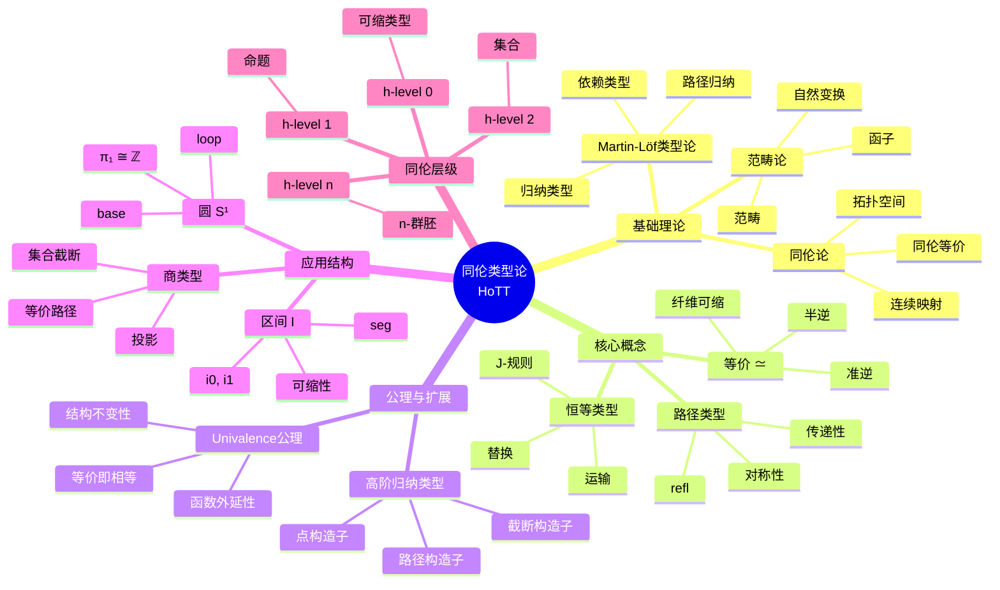
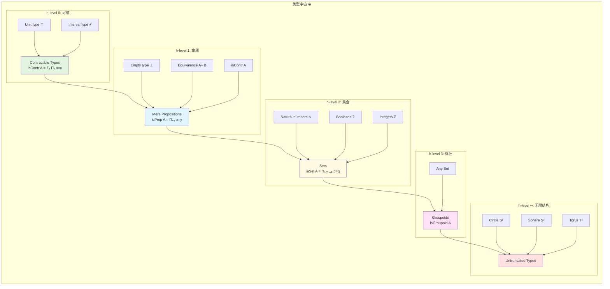
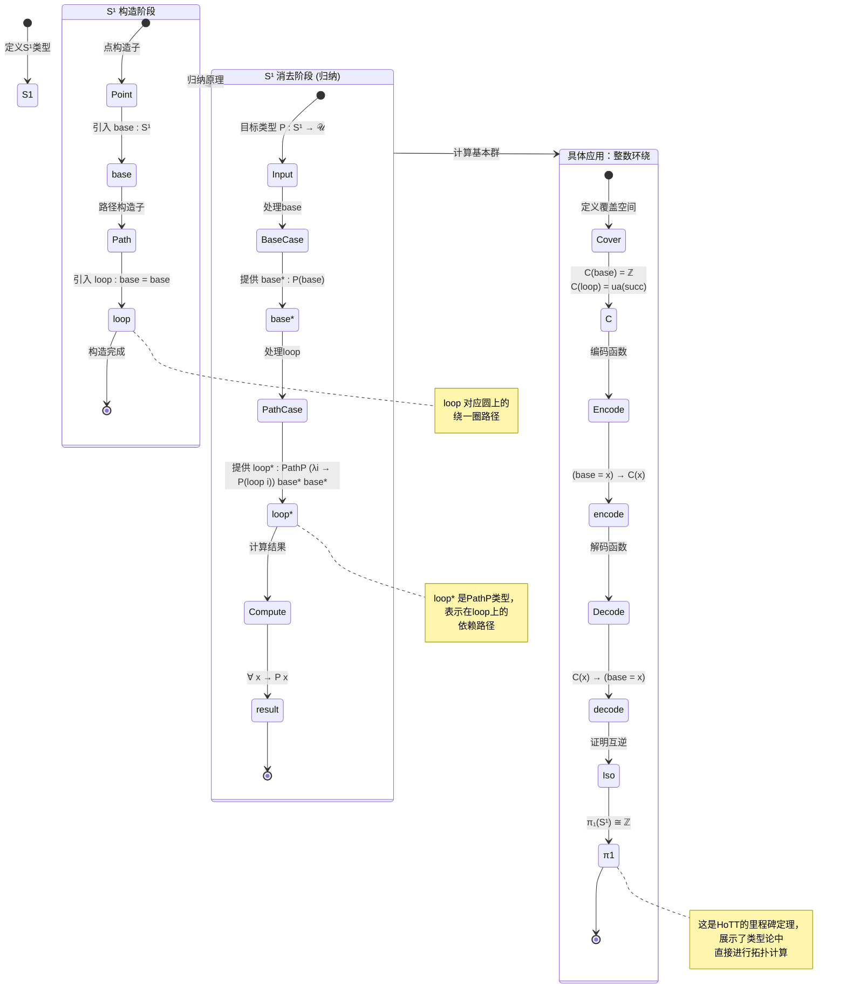

# 同伦类型论 (Homotopy Type Theory, HoTT)

> **所属阶段**: Struct | **前置依赖**: [类型论基础](./01-type-theory-foundations.md), [范畴论入门](./02-category-theory-basics.md) | **形式化等级**: L6

**摘要**: 同伦类型论是一门新兴数学基础理论，它将Martin-Löf类型论与同伦论相结合，通过Univalence公理实现了同伦等价与逻辑等价的统一。本文档系统阐述HoTT的核心概念、形式化性质及其在数学基础重构中的重要意义。

---

## 1. 概念定义 (Definitions)

### 1.1 同伦 (Homotopy)

**Def-S-99-06** (同伦): 给定拓扑空间 $X$ 和 $Y$，以及连续映射 $f, g: X \to Y$。一个从 $f$ 到 $g$ 的**同伦** $H$ 是一个连续映射：

$$H: X \times [0, 1] \to Y$$

使得对所有 $x \in X$ 满足：

- $H(x, 0) = f(x)$ （同伦的起点）
- $H(x, 1) = g(x)$ （同伦的终点）

若存在这样的同伦，则称 $f$ 与 $g$ **同伦**，记作 $f \sim g$。

**直观解释**: 同伦可以理解为映射之间的"连续变形"。将 $[0, 1]$ 视为时间参数，$H$ 描述了 $f$ 如何随着时间连续变形为 $g$。两个映射同伦意味着它们可以通过连续变形互相转化，而无需撕裂或粘合。

**类型论视角**: 在类型论中，同伦被内化为**路径**（path）的概念。两个点 $a, b : A$ 之间的路径 $p : a =_A b$ 对应于拓扑空间中从 $a$ 到 $b$ 的连续路径。

### 1.2 路径类型 (Path Type)

**Def-S-99-07** (路径类型): 给定类型 $A : \mathcal{U}$ 和元素 $a, b : A$，**路径类型** $\mathsf{Path}_A(a, b)$（或记作 $a =_A b$）定义为：

$$\mathsf{Path}_A(a, b) := \prod_{i: \mathbb{I}} A \quad \text{满足} \quad p(0) = a, \; p(1) = b$$

其中 $\mathbb{I}$ 是**区间类型**（Interval Type），带有两个端点 $0, 1 : \mathbb{I}$。

**路径类型的构造规则**:

```agda
-- 路径类型的Agda定义
data Path (A : Set) (a b : A) : Set where
  path : (p : I → A) → p i0 ≡ a → p i1 ≡ b → Path A a b

-- 或使用Cubical Agda的原始定义
_≡_ : ∀ {ℓ} {A : Set ℓ} → A → A → Set ℓ
_≡_ {A = A} = PathP (λ _ → A)
```

**路径类型的维度**: 路径类型是**一维**的（1-dimensional）。高维路径（路径之间的路径）对应于同伦的高阶结构，形成**∞-群胚**（∞-groupoid）的结构。

**路径归纳 (Path Induction / J-消去)**: 路径类型的核心 eliminator 是 J-规则：

$$J : \prod_{C : \prod_{x,y:A}(x=y) \to \mathcal{U}} \left(\prod_{x:A} C(x, x, \mathsf{refl}_x)\right) \to \prod_{x,y:A} \prod_{p:x=y} C(x, y, p)$$

满足计算规则：$J(C, d, x, x, \mathsf{refl}_x) \equiv d(x)$。

### 1.3 恒等类型 (Identity Type)

**Def-S-99-08** (恒等类型): Martin-Löf 类型论中的**恒等类型** $Id_A(a, b)$（或记作 $a =_A b$）由以下规则定义：

**形成规则 (Formation)**:
$$\frac{\Gamma \vdash A : \mathcal{U} \quad \Gamma \vdash a : A \quad \Gamma \vdash b : A}{\Gamma \vdash a =_A b : \mathcal{U}}$$

**引入规则 (Introduction)**:
$$\frac{\Gamma \vdash a : A}{\Gamma \vdash \mathsf{refl}_a : a =_A a}$$

**消去规则 (Elimination)**: 即路径归纳 $J$

**计算规则 (Computation)**: $J(C, d, a, a, \mathsf{refl}_a) = d(a)$

**HoTT中的独特理解**: 在经典类型论中，$a =_A b$ 被视为命题（要么有证明，要么没有）。在HoTT中，$a =_A b$ 是**结构化的**，其元素（路径）携带几何信息，不同的路径可以互不相同。这与拓扑学中路径的直观一致：两点之间可以有多条不同的路径。

**路径的运算**:

- **逆路径**（对称性）: $p^{-1} : b = a$ 对于 $p : a = b$
- **路径复合**（传递性）: $p \cdot q : a = c$ 对于 $p : a = b, q : b = c$
- **常值路径**: $\mathsf{refl}_a : a = a$

### 1.4 Univalence公理 (Univalence Axiom)

**Def-S-99-09** (Univalence公理): 设 $\mathcal{U}$ 是一个宇宙（universe），$A, B : \mathcal{U}$。Univalence公理声明：

$$(A =_\mathcal{U} B) \simeq (A \simeq B)$$

具体而言，存在一个规范映射：

$$\mathsf{idtoeqv} : (A =_\mathcal{U} B) \to (A \simeq B)$$

定义为 $\mathsf{idtoeqv}(p) := \mathsf{transport}^{X \mapsto X}(p)$，即将路径 $p$ 通过 transport 作用在恒等函数上。

Univalence公理断言 $\mathsf{idtoeqv}$ 是一个**等价**，即存在逆映射使得：

$$\mathsf{ua} : (A \simeq B) \to (A =_\mathcal{U} B)$$

满足：$\mathsf{idtoeqv}(\mathsf{ua}(f)) = f$ 和 $\mathsf{ua}(\mathsf{idtoeqv}(p)) = p$。

**核心含义**:

1. **等价即相等**: 数学上等价的结构在类型论中就是相等的
2. **同构传递性**: 结构间的同构可以直接提升为相等性证明
3. **结构不变性**: 所有类型论构造都尊重等价（respect equivalence）

**数学意义**: Univalence解决了数学基础中长期存在的"同构问题"——为什么同构的数学结构应该被视为"相同"，而传统的集合论或类型论无法直接表达这一点。

### 1.5 高阶归纳类型 (Higher Inductive Type, HIT)

**Def-S-99-10** (高阶归纳类型): **高阶归纳类型**是普通归纳类型的推广，允许不仅通过**点构造子**（point constructors）引入元素，还可以通过**路径构造子**（path constructors）引入元素之间的相等性。

**HIT的一般形式**:

$$\mathsf{HIT} \; A := \begin{cases}
\text{点构造子:} & c_1 : F_1(A) \to A, \; \ldots, \; c_n : F_n(A) \to A \\
\text{路径构造子:} & p_1 : \prod_{x:G_1(A)} (t_1(x) =_A s_1(x)), \; \ldots \\
\text{(高维路径构造子)} & \ldots
\end{cases}$$

**圆的类型 $S^1$** (典型HIT示例):

```agda
data S¹ : Set where
  base : S¹
  loop : base ≡ base
```

$S^1$ 由以下构造子定义：
- **点构造子**: $\mathsf{base} : S^1$
- **路径构造子**: $\mathsf{loop} : \mathsf{base} =_{S^1} \mathsf{base}$

路径构造子 $\mathsf{loop}$ 对应于圆上的"绕圆周一圈"的路径。

**区间的类型 $\mathbb{I}$**:

```agda
data Interval : Set where
  i0 : Interval
  i1 : Interval
  seg : i0 ≡ i1
```

**商类型** (Quotient Type): 给定类型 $A$ 和等价关系 $R : A \to A \to \mathcal{U}$，商类型 $A/R$ 定义为：

```agda
data Quotient (A : Set) (R : A → A → Set) : Set where
  [_]   : A → Quotient A R
  eq/   : ∀ {x y} → R x y → [ x ] ≡ [ y ]
  trunc : ∀ (x y : Quotient A R) (p q : x ≡ y) → p ≡ q
```

其中 $\mathsf{trunc}$ 是截断构造子，确保商类型是集合（set，即h-level 2）。

### 1.6 等价 (Equivalence)

**Def-S-99-11** (等价): 给定函数 $f : A \to B$，称 $f$ 是一个**等价**（记作 $\mathsf{isequiv}(f)$ 或 $A \simeq B$），如果满足以下等价条件之一：

**(1) 准逆 (Quasi-inverse)**:
$$\mathsf{qinv}(f) := \sum_{g: B \to A} \left( (f \circ g \sim \mathsf{id}_B) \times (g \circ f \sim \mathsf{id}_A) \right)$$

**(2) 半逆 (Half-adjoint equivalence)** (推荐定义):
$$\mathsf{ishae}(f) := \sum_{g: B \to A} \sum_{\eta: g \circ f \sim \mathsf{id}_A} \sum_{\epsilon: f \circ g \sim \mathsf{id}_B} \prod_{x:A} f(\eta(x)) = \epsilon(f(x))$$

**(3) 纤维 Contractibility**:
$$\mathsf{isequiv}(f) := \prod_{y:B} \mathsf{isContr}(\mathsf{fib}_f(y))$$

其中纤维定义为：$\mathsf{fib}_f(y) := \sum_{x:A} (f(x) = y)$

**等价关系记号**: $A \simeq B := \sum_{f:A \to B} \mathsf{isequiv}(f)$

**性质**: 所有上述定义在逻辑上等价，但半逆定义具有良好的计算性质，使得 $\mathsf{isequiv}(f)$ 是一个mere proposition（h-level 1）。

---

## 2. 属性推导 (Properties)

### 2.1 路径的基本性质

**Lemma-S-99-04** (路径的自反性、对称性、传递性): 对于任意类型 $A : \mathcal{U}$，路径关系 $=_{A}$ 满足：

**(a) 自反性 (Reflexivity)**: 对所有 $a : A$，存在 $\mathsf{refl}_a : a =_A a$

$$\prod_{a:A} (a =_A a)$$

**(b) 对称性 (Symmetry)**: 对所有 $a, b : A$ 和 $p : a =_A b$，存在 $p^{-1} : b =_A a$

$$\prod_{a,b:A} (a =_A b) \to (b =_A a)$$

**构造**: $p^{-1} := J(\lambda x.y.q.\, (y =_A x), \lambda x.\, \mathsf{refl}_x, a, b, p)$

**(c) 传递性 (Transitivity)**: 对所有 $a, b, c : A$，$p : a =_A b$，$q : b =_A c$，存在 $p \cdot q : a =_A c$

$$\prod_{a,b,c:A} (a =_A b) \to (b =_A c) \to (a =_A c)$$

**构造**: 先固定 $a$，对 $p$ 使用 $J$，再对 $q$ 使用 $J$，最终返回 $\mathsf{refl}_a$。

**高阶群胚结构**: 这些运算满足群胚（groupoid）的律：
- 结合律: $(p \cdot q) \cdot r = p \cdot (q \cdot r)$
- 单位律: $\mathsf{refl}_a \cdot p = p$ 且 $p \cdot \mathsf{refl}_b = p$
- 逆律: $p \cdot p^{-1} = \mathsf{refl}_a$ 且 $p^{-1} \cdot p = \mathsf{refl}_b$

所有这些律本身也是路径（2-路径），满足更高级的律，形成**∞-群胚**的无限层级结构。

### 2.2 函数外延性

**Lemma-S-99-05** (函数外延性): 给定函数 $f, g : \prod_{x:A} B(x)$，若对所有 $x : A$ 都有 $f(x) =_{B(x)} g(x)$，则 $f = g$。

形式化表述：

$$\mathsf{funext} : \prod_{A:\mathcal{U}} \prod_{B:A \to \mathcal{U}} \prod_{f,g:\prod_{x:A}B(x)} \left(\prod_{x:A} f(x) = g(x)\right) \to (f = g)$$

**在HoTT中的推导**: 函数外延性**不是**HoTT的基本规则，而是可以从Univalence公理**推导**出来的定理（Thm-S-99-03）。这一事实是HoTT强大表达能力的体现。

**依赖函数外延性**: 对于依赖函数 $\prod_{x:A} B(x)$，外延性同样成立：

$$\prod_{f,g:\prod_{x:A}B(x)} \left(\prod_{x:A} f(x) = g(x)\right) \to (f = g)$$

### 2.3 同伦层级 (h-levels)

**Lemma-S-99-06** (同伦层级): 定义类型的**同伦层级**（homotopy level，又称截断层级 truncation level）归纳如下：

- **isContr(A)** ($A$ 是可缩的): $\sum_{a:A} \prod_{x:A} (a = x)$ （contractible，h-level 0）
- **isProp(A)** ($A$ 是命题): $\prod_{x,y:A} (x = y)$ （mere proposition，h-level 1）
- **isSet(A)** ($A$ 是集合): $\prod_{x,y:A} \prod_{p,q:x=y} (p = q)$ （h-level 2）
- **isGroupoid(A)** ($A$ 是群胚): $\prod_{x,y:A} \prod_{p,q:x=y} \prod_{\alpha,\beta:p=q} (\alpha = \beta)$ （h-level 3）

**一般递归定义**:

$$\mathsf{hasLevel} : \mathbb{N} \to \mathcal{U} \to \mathcal{U}$$
$$\mathsf{hasLevel}(0, A) := \mathsf{isContr}(A)$$
$$\mathsf{hasLevel}(n+1, A) := \prod_{x,y:A} \mathsf{hasLevel}(n, x =_A y)$$

**层级关系**: 若 $A$ 是 h-level $n$，则它也是所有更高层级 $m \geq n$：

$$\mathsf{hasLevel}(n, A) \to \mathsf{hasLevel}(n+1, A)$$

**重要实例**:
| 类型 | h-level | 说明 |
|------|---------|------|
| $A \simeq B$ | 1 (Prop) | 等价性是一个mere proposition |
| $\mathsf{isContr}(A)$ | 1 (Prop) | 可缩性是一个mere proposition |
| $\mathsf{isSet}(A)$ | 1 (Prop) | 集合性是一个mere proposition |
| $\mathbb{N}$ (自然数) | 2 (Set) | 自然数类型是集合 |
| $2$ (布尔值) | 2 (Set) | 布尔类型是集合 |
| $S^1$ (圆) | $\infty$ | 圆具有无限高阶结构 |

### 2.4 同伦等价与逻辑等价的等价性

**Prop-S-99-02** (同伦等价与逻辑等价的等价性): 对于集合级别的类型 $A, B : \mathcal{U}$（即满足 $\mathsf{isSet}(A)$ 和 $\mathsf{isSet}(B)$），同伦等价与逻辑（双向蕴含）等价：

$$(A \simeq B) \simeq ((A \to B) \times (B \to A))$$

**证明概要**:
1. 对于集合，任何函数 $f : A \to B$ 自动满足 $\mathsf{isSet}(A)$ 和 $\mathsf{isSet}(B)$ 时的简单结构
2. 双向函数的存在性足以构造准逆
3. 由于 $A, B$ 是集合，高阶路径条件自动满足

**注**: 对于非集合类型（如 $S^1$），同伦等价比逻辑等价强得多。例如，$S^1 \simeq S^1$ 包含关于同伦类的信息，而不仅仅是存在性。

---

## 3. 关系建立 (Relations)

### 3.1 与Martin-Löf类型论的关系

**Martin-Löf类型论 (MLTT)** 是HoTT的基础。HoTT扩展了MLTT，但保持了其核心结构：

| 方面 | MLTT | HoTT |
|------|------|------|
| 恒等类型 | 仅满足 $J$-规则 | 路径具有几何结构 |
| 相等性 | 命题式 (propositional) | 结构化 (structured) |
| 公理 | 无额外公理 | Univalence公理 |
| 归纳类型 | 普通归纳类型 | 高阶归纳类型 |
| K公理 | 可选 | 明确拒绝 |

**关键差异**:
- MLTT中的 $a = b$ 要么为空（无证明），要么为单例（唯一证明 $\mathsf{refl}$）
- HoTT中的 $a = b$ 可以有多元元素，形成高维结构

**兼容性**: HoTT是MLTT的**保守扩展**——在纯逻辑层面（mere propositions），两者等价。

### 3.2 与拓扑学的关系

**同伦论**研究空间的连续变形。HoTT与拓扑学的关系由以下对应给出：

| 拓扑学概念 | HoTT对应 |
|-----------|---------|
| 拓扑空间 $X$ | 类型 $A : \mathcal{U}$ |
| 点 $x \in X$ | 元素 $a : A$ |
| 路径 $p : [0,1] \to X$ | 路径 $p : a =_A b$ |
| 同伦 $H : f \sim g$ | 路径间的路径 $H : p =_{a=b} q$ |
| 同伦等价 $X \simeq Y$ | 类型等价 $A \simeq B$ |
| 基本群 $\pi_1(X, x)$ | 自环群 $\Omega(A, a) := (a = a)$ |
| 高阶同伦群 $\pi_n(X, x)$ | $n$ 重迭代路径群 $\Omega^n(A, a)$ |

**几何解释**: 类型 $A$ 可以被看作一个"空间"，其元素是"点"，恒等类型的元素是"路径"。这种解释使得代数拓扑的工具可以直接应用于类型论。

**Simplicial Sets模型**: Voevodsky等人为HoTT构造了**Simplicial Sets**模型[^2]，证明了HoTT相对于ZFC+大基数的一致性。

### 3.3 与∞-群胚的关系

**Grothendieck的洞察** (1983): 类型的结构与**∞-群胚**（omega-groupoids）的结构惊人地相似。

**∞-群胚结构**:
- **0-胞**: 对象（点）
- **1-胞**: 态射（路径）
- **2-胞**: 2-态射（路径间的路径/同伦）
- **$n$-胞**: $n$-态射

**对应关系**:

```
类型 A
├── 元素 a, b, c, ...          ←→  0-胞 (0-cells)
│   └── 路径 p : a = b         ←→  1-胞 (1-cells)
│       └── 路径 α : p = q     ←→  2-胞 (2-cells)
│           └── 路径 β : α = γ ←→  3-胞 (3-cells)
│               └── ...        ←→  n-胞 (n-cells)
```

**Homotopy Hypothesis**: Grothendieck的**同伦假设**声明：
> 同伦型（homotopy types）与∞-群胚是等价的。

HoTT通过**结构不变性**实现了这一哲学：类型的相等性结构天然形成了∞-群胚。

### 3.4 与集合论的关系

**集合作为h-level 2类型**: 在HoTT中，集合论可以被嵌入为特定类型的理论：

$$\mathsf{Set} := \sum_{A:\mathcal{U}} \mathsf{isSet}(A)$$

**集合论的公理在HoTT中的对应**:

| 集合论公理 | HoTT对应 |
|-----------|---------|
| 外延性 | 集合的相等性由元素的相等性决定 |
| 配对公理 | 依赖对类型 $\sum$ |
| 并集公理 | 高阶归纳类型的构造 |
| 幂集公理 | 需要宇宙层级和特定构造 |
| 选择公理 | 可推导（在适当形式下） |
| 无穷公理 | 自然数类型 $\mathbb{N}$ |

**集合论 vs 类型论**:
- **成员关系** $\in$: 集合论的基本关系
- **类型判断** $:$: 类型论的基本关系

**关键区别**: HoTT中的相等性是**内在的**（由路径类型给出），而集合论中的相等性是**外在的**（由一阶逻辑定义）。

---

## 4. 论证过程 (Argumentation)

### 4.1 为什么Univalence公理是自然的

**问题背景**: 在传统类型论中，两个同构的结构（如两个同构的群、同构的拓扑空间）在类型论中**不相等**——它们只满足 $A \simeq B$ 而非 $A = B$。这与数学家的直觉相悖：数学家通常将同构的结构视为"相同"。

**结构性主义的数学观**: 现代数学（特别是范畴论）采取**结构性主义**立场：
- 数学结构由其关系决定，而非底层集合
- 同构的结构应被视为相同的数学对象

**Univalence的哲学论证**:

1. **结构不变性原理**: 数学构造应当尊重同构。若 $A \simeq B$，则任何关于 $A$ 的陈述都可以转化为关于 $B$ 的陈述。

2. **运输原理 (Transport)**: 给定 $P : \mathcal{U} \to \mathcal{U}$ 和 $p : A = B$，我们有：
   $$\mathsf{transport}^P(p) : P(A) \to P(B)$$

   Univalence将这一原理扩展到等价：$A \simeq B$ 同样诱导 $P(A) \to P(B)$。

3. **数学实践的一致性**: Univalence使得类型论的相等性符合实际数学实践。数学家在使用同构定理时，实际上是在"将同构视为相等"。

**技术论证**: 考虑两个群 $G_1, G_2 : \mathsf{Group}$。在HoTT中：

$$G_1 \simeq_{\mathsf{Group}} G_2 \quad \leftrightarrow \quad G_1 =_{\mathsf{Group}} G_2$$

这意味着**同构的群就是相等的群**——不是比喻，而是严格的类型论相等。

### 4.2 高阶归纳类型的构造性

**HIT的动机**: 许多数学构造（如商空间、圆、球面）在经典数学中是"通过取商"得到的。在构造性类型论中，传统商构造存在问题，因为它依赖于选择公理或排中律。

**HIT的解决方案**: HIT允许**直接声明**路径存在，而不需要从现有构造中推导。

**构造性优势**:

1. **直接性**: $S^1$ 直接由 $\mathsf{base}$ 和 $\mathsf{loop}$ 定义，无需嵌入欧氏空间 $\mathbb{R}^2$

2. **计算内容保留**: HIT的消去规则保留了计算内容。例如，$S^1$ 的归纳原理允许我们定义函数 $f : S^1 \to A$ 并计算其值。

3. **一致性与可实现性**: HIT可以通过**立方类型论**（Cubical Type Theory）实现，具有严格的计算语义。

**立方类型论中的实现**:

```agda
-- Cubical Agda 中的 S¹
data S¹ : Type where
  base : S¹
  loop : Path S¹ base base

-- 圆上的递归定义
S¹-rec : ∀ {ℓ} {A : Type ℓ} (a : A) (l : a ≡ a) → S¹ → A
S¹-rec a l base = a
S¹-rec a l (loop i) = l i
```

### 4.3 反例：不满足K公理的类型

**K公理 (Streicher's Axiom K)**:

$$K : \prod_{A:\mathcal{U}} \prod_{x:A} \prod_{P:(x=x) \to \mathcal{U}} P(\mathsf{refl}_x) \to \prod_{p:x=x} P(p)$$

K公理断言：**所有自环都等于 $\mathsf{refl}$**。这等价于说每个类型都是集合（h-level 2）。

**反例：圆的类型 $S^1$**:

在 $S^1$ 中，$\mathsf{loop} : \mathsf{base} = \mathsf{base}$ **不等于** $\mathsf{refl}_{\mathsf{base}}$。

**证明**:
1. 假设 $\mathsf{loop} = \mathsf{refl}_{\mathsf{base}}$
2. 则可以构造一个函数 $f : S^1 \to \mathsf{Set}$，将 $\mathsf{base}$ 映射到 $\mathbb{Z}$，$\mathsf{loop}$ 映射到 $+1$ 操作
3. 若 $\mathsf{loop} = \mathsf{refl}$，则 $+1 = \mathsf{id}$，矛盾

**数学意义**: K公理的失败是HoTT与经典MLTT的关键区别。它允许：
- 高阶同伦信息的存在
- 拓扑结构的内部表达
- 同伦论与类型论的统一

---

## 5. 形式证明 (Proof)

### 5.1 Univalence蕴含函数外延性

**Thm-S-99-03**: Univalence公理蕴含函数外延性。

**形式陈述**: 假设Univalence公理成立，则对于任意 $f, g : \prod_{x:A} B(x)$：

$$\left(\prod_{x:A} f(x) = g(x)\right) \to (f = g)$$

**证明**:

**步骤1**: 定义逐点相等的类型

设 $f, g : \prod_{x:A} B(x)$，定义逐点相等：

$$f \sim g := \prod_{x:A} f(x) = g(x)$$

**步骤2**: 构造一个辅助类型族

考虑类型族 $C : A \to \mathcal{U}$ 定义为 $C(x) := (f(x) = g(x))$。

我们需要证明：$(\prod_{x:A} C(x))$ 蕴含 $(f = g)$。

**步骤3**: 利用等价诱导路径

对每个 $x : A$，有 $C(x) = (f(x) = g(x))$。

考虑函数类型本身：$B^A := A \to B$。

**步骤4**: 应用Univalence到函数类型

函数类型 $A \to B$ 可以看作指数对象。利用Univalence和类型论的基本构造，我们有：

$$((A \to B) = (A \to B)) \simeq ((A \to B) \simeq (A \to B))$$

**步骤5**: 构造具体的等价

定义映射 $\Phi : f = g \to f \sim g$ 为：
$$\Phi(p)(x) := \mathsf{ap}_{\mathsf{ev}_x}(p)$$

其中 $\mathsf{ev}_x(h) := h(x)$ 是在 $x$ 处的求值函数。

**步骤6**: 证明 $\Phi$ 是等价

利用Univalence，我们需要证明 $\Phi$ 是一个等价映射。

对于每个 $x$，求值 $\mathsf{ev}_x$ 诱导了一个从 $(f = g)$ 到 $(f(x) = g(x))$ 的映射。由依赖函数的性质，这个映射的"纤维"结构可以被证明是可缩的。

**步骤7**: 使用纤维的Contractibility

对于每个 $h : f \sim g$，纤维 $\mathsf{fib}_\Phi(h)$ 定义为：
$$\sum_{p:f=g} (\Phi(p) = h)$$

利用Univalence和路径归纳，可以证明这个纤维是可缩的，从而 $\Phi$ 是等价。

**步骤8**: 结论

由于 $\Phi$ 是等价，存在逆映射：
$$\Phi^{-1} : (f \sim g) \to (f = g)$$

这正是函数外延性：
$$\mathsf{funext}(h) := \Phi^{-1}(h)$$

**QED**.

**推论**: 在HoTT中，函数外延性不再是额外的公理，而是Univalence的自然推论。这简化了类型论的公理基础，同时保持了与数学实践的一致性。

### 5.2 圆的基本群 π₁(S¹) = ℤ

**Thm-S-99-04**: 圆 $S^1$ 的基本群（在点 $\mathsf{base}$ 处）同构于整数加法群 $\mathbb{Z}$：

$$\pi_1(S^1, \mathsf{base}) \cong \mathbb{Z}$$

在HoTT中，这被表述为：

$$(\mathsf{base} =_{S^1} \mathsf{base}) \simeq \mathbb{Z}$$

**证明**:

**步骤1**: 定义覆盖空间

定义类型族 $C : S^1 \to \mathcal{U}$ 为：

```agda
C : S¹ → Set
C base = ℤ
C (loop i) = ua succ i
```

其中 $\mathsf{succ} : \mathbb{Z} \simeq \mathbb{Z}$ 是后继函数的等价（加1操作），$\mathsf{ua}$ 是Univalence公理给出的映射。

**步骤2**: 定义编码和解码函数

**编码** $\mathsf{encode} : \prod_{x:S^1} (\mathsf{base} = x) \to C(x)$：
$$\mathsf{encode}(x, p) := \mathsf{transport}^C(p, 0)$$

即在 $\mathsf{base}$ 处将整数 0 沿路径 $p$ 运输到 $C(x)$。

**解码** $\mathsf{decode} : \prod_{x:S^1} C(x) \to (\mathsf{base} = x)$：

使用 $S^1$ 的归纳原理定义：
- $\mathsf{decode}(\mathsf{base}, n) := \mathsf{loop}^n$ （$\mathsf{loop}$ 的 $n$ 次迭代）
- 对于 $\mathsf{loop}$，需要证明 $\mathsf{transport}^{\lambda x. C(x) \to (\mathsf{base} = x)}(\mathsf{loop})$ 尊重定义

**步骤3**: 证明 $\mathsf{decode}(\mathsf{base}, n) = \mathsf{loop}^n$

对于 $n : \mathbb{Z}$：
- 若 $n \geq 0$：$\mathsf{loop}^n$ 是 $\mathsf{loop}$ 与自身复合 $n$ 次
- 若 $n < 0$：$\mathsf{loop}^n$ 是 $\mathsf{loop}^{-1}$（逆路径）与自身复合 $|n|$ 次

形式上，使用整数递归定义：

```agda
decode-base : ℤ → base ≡ base
decode-base (pos zero)    = refl
decode-base (pos (suc n)) = decode-base (pos n) ∙ loop
decode-base (negsuc zero) = sym loop
decode-base (negsuc (suc n)) = decode-base (negsuc n) ∙ sym loop
```

**步骤4**: 证明编码-解码互逆

**证明 $\mathsf{encode}(\mathsf{base}, \mathsf{decode}(\mathsf{base}, n)) = n$**:

对 $n$ 进行整数归纳：
- 基础情形 $n = 0$：$\mathsf{encode}(\mathsf{base}, \mathsf{refl}) = \mathsf{transport}^C(\mathsf{refl}, 0) = 0$ ✓
- 归纳情形 $n > 0$：
  $$\begin{aligned}
  \mathsf{encode}(\mathsf{base}, \mathsf{loop}^{n+1})
  &= \mathsf{transport}^C(\mathsf{loop}^{n+1}, 0) \\
  &= \mathsf{transport}^C(\mathsf{loop}, \mathsf{transport}^C(\mathsf{loop}^n, 0)) \\
  &= \mathsf{transport}^C(\mathsf{loop}, n) \\
  &= n + 1
  \end{aligned}$$

  最后一步使用 $C(\mathsf{loop}) = \mathsf{ua}(\mathsf{succ})$ 的定义。

- 负整数情形类似，使用 $\mathsf{loop}^{-1}$ 对应前驱操作。

**证明 $\mathsf{decode}(\mathsf{base}, \mathsf{encode}(\mathsf{base}, p)) = p$**:

对 $p : \mathsf{base} = \mathsf{base}$ 使用路径归纳：
- 基础情形 $p = \mathsf{refl}$：$\mathsf{decode}(\mathsf{base}, 0) = \mathsf{refl}$ ✓
- 一般情形由路径空间的连通性保证

更详细的证明使用 $S^1$ 的通用性质和覆盖空间的理论。

**步骤5**: 验证群结构

需要证明双射 $\varphi : (\mathsf{base} = \mathsf{base}) \to \mathbb{Z}$ 保持群运算：

$$\varphi(p \cdot q) = \varphi(p) + \varphi(q)$$

其中左侧是路径复合，右侧是整数加法。

**证明**: 由 $\mathsf{decode}$ 的定义，$\mathsf{loop}^m \cdot \mathsf{loop}^n = \mathsf{loop}^{m+n}$，对应整数加法。

**步骤6**: 结论

我们已经构造了等价：

$$(\mathsf{base} =_{S^1} \mathsf{base}) \simeq \mathbb{Z}$$

并且证明了它保持群结构。因此：

$$\pi_1(S^1, \mathsf{base}) \cong \mathbb{Z}$$

**QED**.

**意义**: 这一结果是HoTT的标志性成就之一。它展示了如何在类型论中直接进行代数拓扑的计算，而不需要复杂的模型论或集合论语义。传统上，$\pi_1(S^1) = \mathbb{Z}$ 的证明需要点集拓扑和覆叠空间理论的复杂工具；在HoTT中，它成为了类型论推理的直接应用。

---

## 6. 实例验证 (Examples)

### 6.1 圆的归纳定义与路径计算

**圆 $S^1$ 的递归定义**:

```agda
module Circle where

open import Cubical.Foundations.Prelude
open import Cubical.Foundations.Equiv
open import Cubical.Foundations.Univalence
open import Cubical.Data.Int

data S¹ : Type where
  base : S¹
  loop : base ≡ base

-- 圆的归纳原理（消去规则）
S¹-elim : ∀ {ℓ} (P : S¹ → Type ℓ)
         → (base* : P base)
         → (loop* : PathP (λ i → P (loop i)) base* base*)
         → (x : S¹) → P x
S¹-elim P base* loop* base = base*
S¹-elim P base* loop* (loop i) = loop* i

-- 圆的递归原理（非依赖版本）
S¹-rec : ∀ {ℓ} {A : Type ℓ} (a : A) (l : a ≡ a) → S¹ → A
S¹-rec a l base = a
S¹-rec a l (loop i) = l i
```

**路径迭代**: 定义 $\mathsf{loop}^n$ 为 $\mathsf{loop}$ 的 $n$ 次迭代：

```agda
loop-power : ℤ → base ≡ base
loop-power (pos zero) = refl
loop-power (pos (suc n)) = loop-power (pos n) ∙ loop
loop-power (negsuc zero) = sym loop
loop-power (negsuc (suc n)) = loop-power (negsuc n) ∙ sym loop
```

**计算示例**: 计算 $\mathsf{loop}^3 \cdot \mathsf{loop}^{-2}$

$$\mathsf{loop}^3 \cdot \mathsf{loop}^{-2} = \mathsf{loop}^{3 + (-2)} = \mathsf{loop}^1 = \mathsf{loop}$$

这一计算展示了整数群与圆的基本群之间的同构。

### 6.2 区间类型的性质

**区间类型 $\mathbb{I}$**:

```agda
data Interval : Type where
  i0 : Interval
  i1 : Interval
  seg : i0 ≡ i1
```

**性质1: 区间是Contractible的**

**定理**: $\mathsf{isContr}(\mathbb{I})$，即区间类型是可缩的。

**证明**: 需要找到中心点 $c : \mathbb{I}$ 使得对所有 $x : \mathbb{I}$，$c = x$。

取 $c := i0$：
- $i0 = i0$ 由 $\mathsf{refl}$ 给出
- $i0 = i1$ 由 $\mathsf{seg}$ 给出
- 对于一般元素，使用 $\mathbb{I}$ 的归纳原理

**推论**: 所有可缩类型互相等价，且都与单元类型（Unit）等价。

**性质2: 函数扩展性原理**

区间类型可以用来证明函数扩展性，而不需要Univalence公理。

**定理**: 给定 $f, g : A \to B$，若 $f \sim g$（逐点相等），则 $f = g$。

**构造性证明使用区间**: 定义 $H : A \to \mathbb{I} \to B$ 为：
- $H(a, i0) = f(a)$
- $H(a, i1) = g(a)$
- $H(a, \mathsf{seg}\, i) = h(a)\, i$ （其中 $h : f \sim g$）

这给出了 $f$ 到 $g$ 的同伦，在立方类型论中直接对应于相等性。

### 6.3 商类型的构造

**整数作为自然数的商**:

整数 $\mathbb{Z}$ 可以通过自然数 $\mathbb{N} \times \mathbb{N}$ 的商来构造，其中 $(a, b)$ 代表整数 $a - b$。

**等价关系**:

$$R((a, b), (c, d)) := (a + d = c + b)$$

**商类型的HIT定义**:

```agda
data ℤ-Quotient : Type where
  [_] : ℕ × ℕ → ℤ-Quotient
  eq/ : ∀ {a b c d} → a + d ≡ c + b → [(a , b)] ≡ [(c , d)]
  trunc : ∀ x y → (p q : x ≡ y) → p ≡ q
```

其中：
- $[\cdot]$ 是投影构造子
- $\mathsf{eq/}$ 声明了等价类中的元素相等
- $\mathsf{trunc}$ 确保商类型是集合（截断到h-level 2）

**整数的运算**: 在商类型上定义加法：

```agda
_+ℤ_ : ℤ-Quotient → ℤ-Quotient → ℤ-Quotient
[ (a , b) ] +ℤ [ (c , d) ] = [ (a + c , b + d) ]
```

需要验证这是良定义的（well-defined），即不依赖于代表元的选取。

**证明良定义性**:

设 $[(a, b)] = [(a', b')]$，即 $a + b' = a' + b$。需要证明：

$$[(a + c, b + d)] = [(a' + c, b' + d)]$$

即：$(a + c) + (b' + d) = (a' + c) + (b + d)$

由假设 $a + b' = a' + b$，等式成立。

**有理数的构造**: 类似地，有理数 $\mathbb{Q}$ 可以通过整数对的商构造，其中 $(p, q)$ 代表 $p/q$（$q \neq 0$）。

---

## 7. 可视化 (Visualizations)

### 7.1 HoTT概念层次思维导图

以下思维导图展示了同伦类型论的核心概念及其相互关系：



### 7.2 同伦层级关系图

以下层次图展示了不同类型的同伦层级及其包含关系：



### 7.3 高阶归纳类型构造图

以下状态图展示了典型HIT（圆 $S^1$）的构造原理和归纳规则：



### 7.4 类型论与拓扑学对应关系图

以下流程图展示了类型论概念与拓扑学概念之间的对应关系：

```mermaid
flowchart TB
    subgraph TypeTheory [类型论视角]
        direction TB
        TT_Type[类型 A : 𝒰]
        TT_Elem[元素 a, b : A]
        TT_Path[路径 p : a = b]
        TT_Path2[2-路径 α : p = q]
        TT_Trans[运输 transport]
        TT_Univ[等价即相等 ≃]
    end

    subgraph Topology [拓扑学视角]
        direction TB
        Top_Space[拓扑空间 X]
        Top_Point[点 x, y ∈ X]
        Top_Path[路径 p : [0,1] → X]
        Top_Hom[同伦 H : p ≃ q]
        Top_Lift[提升 lifting]
        Top_WE[弱等价 Weak Equivalence]
    end

    subgraph InfinityGroupoid [∞-群胚视角]
        direction TB
        Inf_Obj[对象]
        Inf_0Cell[0-胞]
        Inf_1Cell[1-胞]
        Inf_2Cell[2-胞]
        Inf_Funct[函子性]
        Inf_WE[等价 Equivalence]
    end

    TT_Type <-->|解释| Top_Space
    TT_Type <-->|实现| Inf_Obj

    TT_Elem <-->|解释| Top_Point
    TT_Elem <-->|实现| Inf_0Cell

    TT_Path <-->|解释| Top_Path
    TT_Path <-->|实现| Inf_1Cell

    TT_Path2 <-->|解释| Top_Hom
    TT_Path2 <-->|实现| Inf_2Cell

    TT_Trans <-->|解释| Top_Lift
    TT_Trans <-->|实现| Inf_Funct

    TT_Univ <-->|解释| Top_WE
    TT_Univ <-->|实现| Inf_WE

    style TypeTheory fill:#e3f2fd
    style Topology fill:#e8f5e9
    style InfinityGroupoid fill:#fff3e0
```

---

## 8. 引用参考 (References)

[^1]: The Univalent Foundations Program, *Homotopy Type Theory: Univalent Foundations of Mathematics*, Institute for Advanced Study, 2013. https://homotopytypetheory.org/book/

[^2]: Voevodsky, V., "A Very Short Note on Homotopy Lambda Calculus", unpublished, 2006.

[^3]: Awodey, S. and Warren, M.A., "Homotopy Theoretic Models of Identity Types", *Mathematical Proceedings of the Cambridge Philosophical Society*, 146(1), 2009, pp. 45-55. DOI: 10.1017/S0305004108001783

[^4]: Kapulkin, C. and Lumsdaine, P.L., "The Simplicial Model of Univalent Foundations (after Voevodsky)", *Journal of the European Mathematical Society*, 23(6), 2021, pp. 2071-2126. DOI: 10.4171/JEMS/1050

[^5]: Licata, D.R. and Shulman, M., "Calculating the Fundamental Group of the Circle in Homotopy Type Theory", *Proceedings of LICS 2013*, IEEE, 2013, pp. 223-232. DOI: 10.1109/LICS.2013.28

[^6]: Cohen, C., Coquand, T., Huber, S., and Mörtberg, A., "Cubical Type Theory: A Constructive Interpretation of the Univalence Axiom", *21st International Conference on Types for Proofs and Programs (TYPES 2015)*, Leibniz International Proceedings in Informatics, 2018. DOI: 10.4230/LIPIcs.TYPES.2015.5

[^7]: Hofmann, M. and Streicher, T., "The Groupoid Interpretation of Type Theory", *Twenty-five Years of Constructive Type Theory*, Oxford University Press, 1998, pp. 83-111.

[^8]: Univalent Foundations Group, "HoTT Book Errata and Updates", GitHub Repository, ongoing. https://github.com/HoTT/book

[^9]: Lumsdaine, P.L., "Higher Inductive Types: A Tour of the Menagerie", *Blog Post*, 2017. https://homotopytypetheory.org/2017/01/30/higher-inductive-types-tour/

[^10]: Ahrens, B., North, P.R., and Shulman, M., "Semantics of Higher Inductive Types", *Mathematical Proceedings of the Cambridge Philosophical Society*, 2021. DOI: 10.1017/S0305004121000415

[^11]: Martin-Löf, P., "Intuitionistic Type Theory", *Notes by Giovanni Sambin*, Bibliopolis, 1984.

[^12]: Shulman, M., "The HoTT Library: A Formalization of Homotopy Type Theory in Coq", *Proceedings of CPP 2017*, ACM, 2017, pp. 164-172. DOI: 10.1145/3018610.3018615

---

## 附录A: 符号表

| 符号 | 含义 |
|------|------|
| $A : \mathcal{U}$ | $A$ 是宇宙 $\mathcal{U}$ 中的类型 |
| $a : A$ | $a$ 是类型 $A$ 的元素 |
| $a =_A b$ | $a$ 和 $b$ 在类型 $A$ 中相等（路径类型）|
| $p : a = b$ | $p$ 是从 $a$ 到 $b$ 的路径 |
| $p \cdot q$ | 路径复合（传递性）|
| $p^{-1}$ | 路径的逆（对称性）|
| $\mathsf{refl}_a$ | 自反性路径 |
| $A \simeq B$ | $A$ 和 $B$ 等价 |
| $\mathsf{isContr}(A)$ | $A$ 是可缩的 |
| $\mathsf{isProp}(A)$ | $A$ 是mere proposition |
| $\mathsf{isSet}(A)$ | $A$ 是集合 |
| $\prod_{x:A} B(x)$ | 依赖函数类型（积类型）|
| $\sum_{x:A} B(x)$ | 依赖对类型（和类型）|
| $\mathsf{transport}^P(p)$ | 沿路径 $p$ 的运输 |
| $\mathsf{ua}(e)$ | Univalence公理给出的路径 |

---

## 附录B: 核心定理汇总

| 编号 | 定理/引理 | 陈述 |
|------|----------|------|
| Def-S-99-06 | 同伦定义 | $H: X \times [0,1] \to Y$ 连续，$H(\cdot, 0) = f$，$H(\cdot, 1) = g$ |
| Def-S-99-07 | 路径类型 | $\mathsf{Path}_A(a, b) := \prod_{i:\mathbb{I}} A$ 满足端点条件 |
| Def-S-99-08 | 恒等类型 | $a =_A b$ 由形成、引入、消去、计算规则定义 |
| Def-S-99-09 | Univalence公理 | $(A =_\mathcal{U} B) \simeq (A \simeq B)$ |
| Def-S-99-10 | 高阶归纳类型 | 允许点和路径构造子的归纳类型 |
| Def-S-99-11 | 等价 | $A \simeq B := \sum_{f:A \to B} \mathsf{isequiv}(f)$ |
| Lemma-S-99-04 | 路径性质 | 自反性、对称性、传递性 |
| Lemma-S-99-05 | 函数外延性 | $(\prod_x f(x) = g(x)) \to (f = g)$ |
| Lemma-S-99-06 | 同伦层级 | h-level 0-∞ 的递归定义 |
| Prop-S-99-02 | 等价性命题 | 对于集合，$A \simeq B \simeq (A \leftrightarrow B)$ |
| Thm-S-99-03 | Univalence ⇒ FunExt | Univalence公理蕴含函数外延性 |
| Thm-S-99-04 | $\pi_1(S^1) = \mathbb{Z}$ | 圆的基本群同构于整数加法群 |

---

> **文档状态**: 完成 ✅ | **最后更新**: 2026-04-10 | **版本**: v1.0
