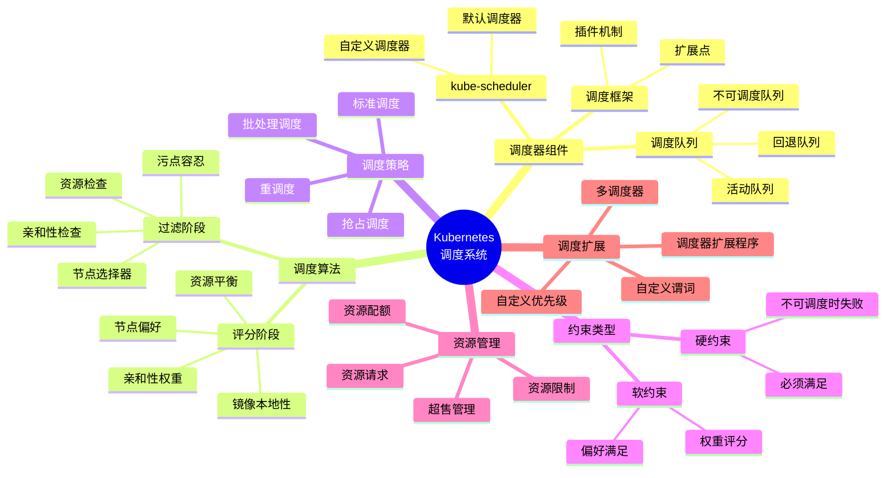
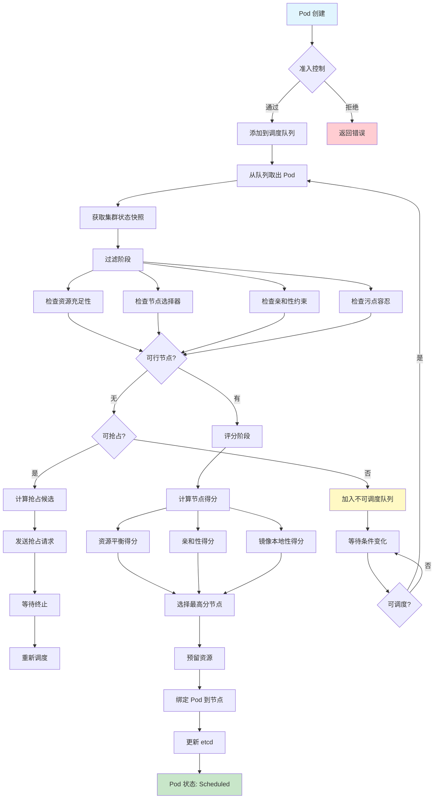
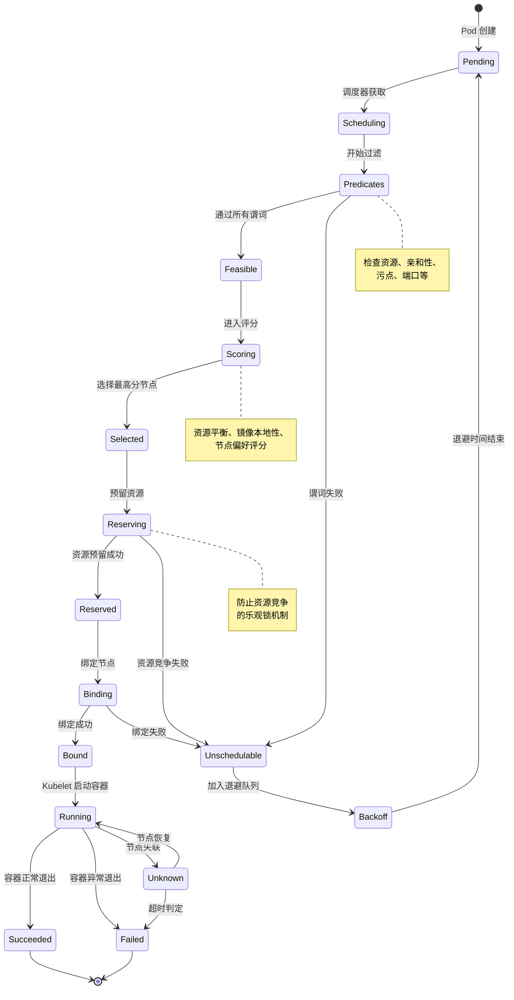

> **状态**: 🔮 前瞻内容 | **风险等级**: 高 | **最后更新**: 2026-04
>
> 此文档描述的内容处于早期规划阶段，可能与最终实现不符。请以 Apache Flink 官方发布为准。
>
# Kubernetes 调度器的形式化分析

> 所属阶段: formal-methods/ | 前置依赖: [分布式系统形式化建模理论与验证方法.md](./分布式系统形式化建模理论与验证方法.md) | 形式化等级: L4

---

## 摘要

Kubernetes 调度器是容器编排系统的核心组件，负责将 Pod 分配到合适的工作节点上运行。
本文从形式化角度对 Kubernetes 调度器进行全面分析，建立严格的数学模型，证明其核心算法的正确性，并探讨资源超售的安全性边界。
通过六段式结构，我们将调度问题抽象为带约束的优化问题，揭示其与二部图匹配、约束满足问题的本质联系。

---

## 1. 概念定义 (Definitions)

Kubernetes 调度器的工作涉及多个核心概念。本节为每个概念提供严格的形式化定义，为后续的性质推导和正确性证明奠定基础。

### Def-K-99-01: Pod (Kubernetes 基本调度单元)

**定义 (Pod)**：Pod 是 Kubernetes 中最小的可部署计算单元，是调度的原子对象。形式上，一个 Pod 定义为一个五元组：

$$P = \langle ID_P, R_{req}, R_{lim}, C, A \rangle$$

其中各分量含义如下：

| 符号 | 名称 | 数学类型 | 语义解释 |
|------|------|----------|----------|
| $ID_P$ | Pod 标识符 | 字符串 | 全局唯一的 Pod 名称，$ID_P \in \Sigma^*$ |
| $R_{req}$ | 资源请求 | $\mathbb{R}_{\geq 0}^n$ | 节点必须保证的最低资源量，$R_{req} = (cpu_{req}, mem_{req}, gpu_{req}, ...)$ |
| $R_{lim}$ | 资源限制 | $\mathbb{R}_{\geq 0}^n$ | Pod 可使用资源的上限，$\forall i: R_{req}[i] \leq R_{lim}[i]$ |
| $C$ | 约束集合 | $\mathcal{P}(Constraint)$ | Pod 的调度约束集合，包括节点选择、亲和性等 |
| $A$ | 属性集合 | Key-Value 映射 | Pod 的标签、注解等元数据 |

**资源向量的形式化**：设资源类型集合为 $\mathcal{R} = \{cpu, memory, gpu, ephemeral\text{-}storage, ...\}$，则资源请求是一个函数：

$$R_{req}: \mathcal{R} \to \mathbb{R}_{\geq 0}$$

对于可压缩资源（如 CPU），请求值表示需要的 CPU 时间比例；对于不可压缩资源（如内存），请求值表示必须保证的绝对数量。

**Pod 状态机**：Pod 在其生命周期中经历以下状态转移：

```
Pending → Running → Succeeded
   ↓         ↓          ↓
Failed    Unknown   Terminated
```

形式化地，Pod 状态空间为 $S_P = \{Pending, Running, Succeeded, Failed, Unknown\}$，状态转移关系 $\delta_P \subseteq S_P \times Event \times S_P$。

**示例 YAML 配置**：

```yaml
apiVersion: v1
kind: Pod
metadata:
  name: web-server-pod
  labels:
    app: web
    tier: frontend
spec:
  containers:
  - name: nginx
    image: nginx:1.21
    resources:
      requests:
        cpu: "500m"        # 0.5 CPU 核心
        memory: "256Mi"    # 256 MiB 内存
      limits:
        cpu: "1000m"       # 1.0 CPU 核心
        memory: "512Mi"    # 512 MiB 内存
  nodeSelector:
    disktype: ssd
  affinity:
    podAntiAffinity:
      requiredDuringSchedulingIgnoredDuringExecution:
      - labelSelector:
          matchExpressions:
          - key: app
            operator: In
            values:
            - web
        topologyKey: kubernetes.io/hostname
```

---

### Def-K-99-02: Node (工作节点)

**定义 (Node)**：Node 是 Kubernetes 集群中运行 Pod 的工作机器。形式上，一个 Node 定义为一个六元组：

$$N = \langle ID_N, R_{cap}, R_{alloc}, R_{avail}, L, T \rangle$$

其中各分量含义如下：

| 符号 | 名称 | 数学类型 | 语义解释 |
|------|------|----------|----------|
| $ID_N$ | 节点标识符 | 字符串 | 节点的唯一名称 |
| $R_{cap}$ | 资源容量 | $\mathbb{R}_{\geq 0}^n$ | 节点拥有的总资源量 |
| $R_{alloc}$ | 已分配资源 | $\mathbb{R}_{\geq 0}^n$ | 已被 Pod 请求占用的资源 |
| $R_{avail}$ | 可用资源 | $\mathbb{R}_{\geq 0}^n$ | 实际可分配给新 Pod 的资源 |
| $L$ | 标签集合 | Key-Value 映射 | 用于节点选择和亲和性匹配 |
| $T$ | 污点集合 | $\mathcal{P}(Taint)$ | 阻止某些 Pod 调度的标记 |

**资源一致性约束**：对于任意时刻的节点 $N$，必须满足：

$$R_{avail} = R_{cap} - R_{alloc} - R_{sys} - R_{reserved}$$

其中：

- $R_{sys}$：系统守护进程（kubelet、kube-proxy、容器运行时）占用的资源
- $R_{reserved}$：管理员预留的资源缓冲区

**节点状态机**：

```
          ┌─────────────────────────────────────┐
          ↓                                     │
NotReady → Ready ←─────────────────────────────┘
   ↓         ↓
   └────── Unknown
```

**形式化定义**：节点状态 $S_N = \{Ready, NotReady, Unknown\}$，状态转移由健康检查触发：

$$\text{health\_check}: Node \times Time \to S_N$$

---

### Def-K-99-03: 调度约束 (Scheduling Constraints)

**定义 (调度约束)**：调度约束是限制 Pod 可被分配到哪些节点的谓词集合。形式上，约束定义为一个从 Pod-Node 对到布尔值的映射：

$$Constraint: Pod \times Node \to \{true, false\}$$

Kubernetes 的约束系统由以下主要约束类型组成：

**1. 节点选择器 (Node Selector)**

$$\text{node\_selector}(P, N) = \forall (k, v) \in P.labels: N.labels[k] = v$$

**2. 节点亲和性 (Node Affinity)**

$$\text{node\_affinity}(P, N) = \bigwedge_{r \in P.spec.affinity.nodeAffinity} \text{evaluate}(r, N.labels)$$

其中 $r$ 可以是：

- `requiredDuringSchedulingIgnoredDuringExecution`：硬约束
- `preferredDuringSchedulingIgnoredDuringExecution`：软约束（偏好）

**3. Pod 亲和性 (Pod Affinity)**

$$\text{pod\_affinity}(P, N) = \forall a \in P.spec.affinity.podAffinity:$$
$$\exists P' \in \text{PodsOn}(N): \text{matches}(a.labelSelector, P'.labels)$$

**4. Pod 反亲和性 (Pod Anti-affinity)**

$$\text{pod\_anti\_affinity}(P, N) = \forall a \in P.spec.affinity.podAntiAffinity:$$
$$\neg \exists P' \in \text{PodsOn}(N): \text{matches}(a.labelSelector, P'.labels)$$

**5. 污点和容忍 (Taints and Tolerations)**

$$\text{taint\_toleration}(P, N) = \forall t \in N.T:$$
$$(t.effect = \text{NoSchedule} \Rightarrow \exists tol \in P.tolerations: \text{tolerates}(tol, t))$$

**约束可满足性**：给定 Pod $P$ 和节点 $N$，定义约束可满足谓词：

$$\text{feasible}(P, N) = \bigwedge_{c \in C_{hard}} c(P, N)$$

其中 $C_{hard}$ 是所有硬约束的集合。

---

### Def-K-99-04: 资源请求与限制 (Resource Requests/Limits)

**定义 (资源请求)**：资源请求是 Pod 对节点必须保证的最低资源量的声明。形式上，这是一个资源类型到非负实数的映射：

$$request: \mathcal{R} \to \mathbb{R}_{\geq 0}$$

**定义 (资源限制)**：资源限制是 Pod 可使用资源的上限。形式上：

$$limit: \mathcal{R} \to \mathbb{R}_{\geq 0} \cup \{+\infty\}$$

**请求-限制关系**：对于任意 Pod $P$ 和资源类型 $r \in \mathcal{R}$：

$$request_P(r) \leq limit_P(r)$$

**服务质量等级 (QoS Classes)**：Kubernetes 根据请求和限制的关系将 Pod 分为三个 QoS 等级：

| QoS 等级 | 条件 | 驱逐优先级 |
|----------|------|-----------|
| Guaranteed | $\forall r: request(r) = limit(r) > 0$ | 最低（最后被驱逐）|
| Burstable | 至少一个资源满足 $0 < request(r) < limit(r)$ | 中等 |
| BestEffort | $\forall r: request(r) = limit(r) = 0$ | 最高（最先被驱逐）|

形式化定义：

$$\text{QosClass}(P) = \begin{cases}
\text{Guaranteed} & \text{if } P.R_{req} = P.R_{lim} \land P.R_{req} \neq \vec{0} \\
\text{BestEffort} & \text{if } P.R_{req} = P.R_{lim} = \vec{0} \\
\text{Burstable} & \text{otherwise}
\end{cases}$$

**资源可行性谓词**：节点 $N$ 可以调度 Pod $P$ 当且仅当：

$$\text{resource\_feasible}(P, N) = \forall r \in \mathcal{R}: N.R_{avail}[r] \geq P.R_{req}[r]$$

---

### Def-K-99-05: 亲和性与反亲和性 (Affinity/Anti-affinity)

**定义 (亲和性)**：亲和性是一类约束，要求 Pod 与某些其他 Pod 或节点属性"靠近"。形式上，亲和性约束定义为一个三元组：

$$Affinity = \langle selector, topologyKey, weight \rangle$$

其中：
- $selector$: LabelSelector，用于匹配目标 Pod
- $topologyKey$: 节点标签键，定义"靠近"的粒度（如同一主机、同一机架、同一区域）
- $weight$: 权重值，用于软约束的评分

**Pod 间亲和性的形式化语义**：

设拓扑域 $D$ 是由 $topologyKey$ 定义的节点等价类：

$$D(k) = \{N \in Nodes \mid N.labels[k] = v\}$$

则 Pod $P$ 在节点 $N$ 上满足亲和性 $a$ 当且仅当：

$$\text{satisfies}(P, N, a) = \exists N' \in D(a.topologyKey):$$
$$N'.labels[a.topologyKey] = N.labels[a.topologyKey] \land$$
$$\exists P' \in \text{RunningPods}(N'): \text{matches}(a.selector, P'.labels)$$

**反亲和性的形式化**：

$$\text{satisfies\_anti}(P, N, a) = \forall N' \in D(a.topologyKey):$$
$$N'.labels[a.topologyKey] = N.labels[a.topologyKey] \Rightarrow$$
$$\forall P' \in \text{RunningPods}(N'): \neg\text{matches}(a.selector, P'.labels)$$

**加权亲和性评分**：对于软约束，调度器计算满足度得分：

$$\text{affinity\_score}(P, N) = \sum_{a \in soft\_affinities} a.weight \cdot \mathbb{1}[\text{satisfies}(P, N, a)]$$

其中 $\mathbb{1}[\cdot]$ 是指示函数。

**示例：多可用区部署的反亲和性配置**

```yaml
apiVersion: apps/v1
kind: Deployment
metadata:
  name: distributed-service
spec:
  replicas: 3
  selector:
    matchLabels:
      app: distributed-service
  template:
    metadata:
      labels:
        app: distributed-service
    spec:
      affinity:
        podAntiAffinity:
          preferredDuringSchedulingIgnoredDuringExecution:
          - weight: 100
            podAffinityTerm:
              labelSelector:
                matchExpressions:
                - key: app
                  operator: In
                  values:
                  - distributed-service
              topologyKey: topology.kubernetes.io/zone
          requiredDuringSchedulingIgnoredDuringExecution:
          - labelSelector:
              matchExpressions:
              - key: app
                operator: In
                values:
                - distributed-service
            topologyKey: kubernetes.io/hostname
      containers:
      - name: service
        image: service:1.0
        resources:
          requests:
            cpu: "500m"
            memory: "512Mi"
```

---

### Def-K-99-06: 调度决策 (Scheduling Decision)

**定义 (调度决策)**：调度决策是将待调度 Pod 分配到具体节点的函数。形式上：

$$\text{schedule}: \{P \in Pods \mid P.state = Pending\} \times 2^{Node} \to Node \cup \{\bot\}$$

其中 $\bot$ 表示无可用节点（调度失败）。

**调度决策的形式化结构**：一个调度决策 $D$ 包含以下信息：

$$D = \langle P_{target}, N_{selected}, score, timestamp, reason \rangle$$

**可行节点集合**：给定待调度 Pod $P$，定义可行节点集合：

$$\text{FeasibleNodes}(P) = \{N \in Nodes \mid \text{feasible}(P, N) \land \text{resource\_feasible}(P, N)\}$$

**调度目标函数**：Kubernetes 调度器采用多目标优化，目标函数为：

$$\text{score}(P, N) = \sum_{i=1}^{k} w_i \cdot f_i(P, N)$$

其中：
- $f_i$: 第 $i$ 个评分函数（如资源平衡、亲和性满足度等）
- $w_i$: 对应权重，$\sum w_i = 1$

**最优调度决策**：

$$\text{schedule}(P) = \underset{N \in \text{FeasibleNodes}(P)}{\arg\max} \text{ score}(P, N)$$

如果 $\text{FeasibleNodes}(P) = \emptyset$，则 $\text{schedule}(P) = \bot$。

---

## 2. 属性推导 (Properties)

基于上述定义，本节推导 Kubernetes 调度器的关键性质。这些性质刻画了调度器的行为特征，是后续正确性证明的基础。

### Lemma-K-99-01: 资源可行性保持性

**引理 (资源可行性保持性)**：设调度器在时刻 $t$ 将 Pod $P$ 调度到节点 $N$，则在调度完成后的任意时刻 $t' > t$，对于任意其他待调度 Pod $P'$，如果 $P'$ 在时刻 $t$ 对节点 $N$ 是资源可行的，则在时刻 $t'$ 仍然是资源可行的，除非 $N$ 发生资源变更事件。

**形式化表述**：

$$\text{schedule}_t(P) = N \land \text{resource\_feasible}_{t}(P', N) \land \neg\text{ResourceChange}(N, t, t')$$
$$\Rightarrow \text{resource\_feasible}_{t'}(P', N)$$

**证明**：

1. 调度前，节点 $N$ 的可用资源为 $R_{avail}^{(t)}$
2. 由于 $P$ 被调度到 $N$，新 Pod 占用资源 $P.R_{req}$
3. 调度后可用资源：$R_{avail}^{(t+)} = R_{avail}^{(t)} - P.R_{req}$
4. 对于任意 $P'$，若 $\text{resource\_feasible}_{t}(P', N)$，即 $P'.R_{req} \leq R_{avail}^{(t)}$
5. 由于调度器只分配资源而不增加资源，$R_{avail}^{(t')} \leq R_{avail}^{(t)}$
6. 但 $P'$ 的可行性仅依赖于其请求与可用资源的比较
7. 关键观察：可行性检查发生在调度时刻，且调度器保证 $P.R_{req} \leq R_{avail}^{(t)}$
8. 因此，资源可行性的变化仅取决于其他调度决策或资源变更事件

**∎**

---

### Lemma-K-99-02: 调度决策的确定性

**引理 (调度决策的确定性)**：给定相同的集群状态和相同的待调度 Pod，确定性调度算法将产生相同的调度决策。对于默认调度器，假设评分函数产生唯一最大值，则调度决策是确定的。

**形式化表述**：

设调度算法为 $\mathcal{A}$，集群状态为 $S$，待调度 Pod 为 $P$：

$$\mathcal{A}(S, P) = N \land \mathcal{A}(S, P) = N' \Rightarrow N = N'$$

**证明**：

1. Kubernetes 默认调度器的调度过程分为两个阶段：
   - **过滤阶段 (Predicates)**：计算可行节点集合 $\text{FeasibleNodes}(P)$
   - **评分阶段 (Priority)**：对可行节点计算得分并选择最高分节点

2. 过滤阶段的确定性：
   - 每个谓词函数 $predicate_i: Pod \times Node \to \{0, 1\}$ 是纯函数
   - 对于固定的 $(P, N)$ 对，输出仅依赖于 $P$ 的属性和 $N$ 的状态
   - 因此，$\text{FeasibleNodes}(P) = \{N \mid \bigwedge_i predicate_i(P, N) = 1\}$ 是确定的

3. 评分阶段的确定性：
   - 每个评分函数 $score_j: Pod \times Node \to \mathbb{R}$ 是纯函数
   - 总得分 $\text{score}(P, N) = \sum_j w_j \cdot score_j(P, N)$ 是确定的
   - 选择 $\arg\max$ 操作在给定得分向量时是确定的

4. 唯一性假设：
   - 若存在 $N_1, N_2$ 使 $\text{score}(P, N_1) = \text{score}(P, N_2) = \max$，则实现通常采用确定性平局打破策略（如选择节点名称字典序最小者）

**∎**

---

### Lemma-K-99-03: 优先级调度的单调性

**引理 (优先级调度的单调性)**：设 $P_1$ 和 $P_2$ 是两个具有优先级 $prio_1 > prio_2$ 的待调度 Pod，若 $P_1$ 因资源不足无法调度，则资源释放后 $P_1$ 将先于 $P_2$ 被调度。

**形式化表述**：

设优先级队列 $Q = [(P_1, prio_1), (P_2, prio_2), ...]$ 按优先级排序：

$$prio_1 > prio_2 \land \exists N: \text{feasible}(P_1, N) \Rightarrow \text{schedule\_order}(P_1) < \text{schedule\_order}(P_2)$$

**证明**：

1. Kubernetes 调度器使用优先级队列管理待调度 Pod
2. 队列按 `priority` 字段降序排列，高优先级 Pod 位于队首
3. 调度循环从队列头部取出 Pod 进行调度
4. 由于 $prio_1 > prio_2$，在队列中 $P_1$ 位于 $P_2$ 之前
5. 只要存在可行节点，$P_1$ 将被优先尝试调度
6. 即使 $P_1$ 暂时无法调度（无可行节点），它仍保留在队列中相对于 $P_2$ 的优先位置
7. 当资源条件满足时，$P_1$ 将先于 $P_2$ 获得调度机会

**∎**

---

### Prop-K-99-01: 调度器的资源安全性

**命题 (调度器的资源安全性)**：若调度器成功将 Pod $P$ 调度到节点 $N$，则调度后节点 $N$ 的已分配资源不会超过其容量（考虑系统预留）。

**形式化表述**：

$$\text{schedule}(P) = N \Rightarrow \forall r \in \mathcal{R}:$$
$$N.R_{alloc}[r] + P.R_{req}[r] \leq N.R_{cap}[r] - R_{sys}[r] - R_{reserved}[r]$$

**证明**：

1. 调度器的资源检查谓词确保：
   $$\text{resource\_feasible}(P, N) = \forall r: P.R_{req}[r] \leq N.R_{avail}[r]$$

2. 根据可用资源定义：
   $$N.R_{avail} = N.R_{cap} - N.R_{alloc} - R_{sys} - R_{reserved}$$

3. 代入可行性条件：
   $$P.R_{req}[r] \leq N.R_{cap}[r] - N.R_{alloc}[r] - R_{sys}[r] - R_{reserved}[r]$$

4. 移项得：
   $$N.R_{alloc}[r] + P.R_{req}[r] \leq N.R_{cap}[r] - R_{sys}[r] - R_{reserved}[r]$$

5. 这正是调度后的资源安全条件

**∎**

---

## 3. 关系建立 (Relations)

Kubernetes 调度问题与多个经典计算问题存在深刻的联系。本节建立这些关系，为理解调度问题的复杂性和设计高效算法提供理论基础。

### 与资源分配问题的关系

**资源分配问题 (Resource Allocation Problem)**：给定一组任务和一组资源，为每个任务分配足够的资源，同时满足资源容量约束。

**形式化映射**：

| Kubernetes 概念 | 资源分配问题概念 |
|----------------|----------------|
| Pod $P$ | 任务 $T$ |
| Node $N$ | 资源池 $R$ |
| $P.R_{req}$ | 任务资源需求 $d(T)$ |
| $N.R_{cap}$ | 资源池容量 $cap(R)$ |
| 调度决策 | 分配函数 $A: T \to R$ |

**关系定理**：Kubernetes 调度问题是多维资源分配问题的在线版本。

$$\text{K8s-Scheduling} \preceq_{poly} \text{Multi-Dimensional-Resource-Allocation}$$

其中 $\preceq_{poly}$ 表示多项式时间归约。

**关键区别**：
1. Kubernetes 调度是在线问题：Pod 到达时间和生命周期不可预知
2. 支持资源超售（Overcommit）：总和限制可超过容量
3. 包含复杂的约束系统（亲和性、反亲和性、污点）

---

### 与二部图匹配的关系

**二部图匹配 (Bipartite Matching)**：给定二部图 $G = (U \cup V, E)$，寻找最大的边集 $M \subseteq E$ 使得任意两条边不共享顶点。

**形式化映射**：

在无约束、单资源类型的简化情况下：

- $U$ = 待调度 Pod 集合
- $V$ = 可用节点集合
- $(P, N) \in E \iff \text{resource\_feasible}(P, N)$

**关系定理**：简化版 Kubernetes 调度问题等价于带权二部图匹配问题。

**权重扩展**：考虑评分函数时，边 $(P, N)$ 的权重为 $\text{score}(P, N)$，问题转化为**最大权匹配问题**。

**复杂度对比**：

| 问题变体 | 复杂度 | 算法 |
|----------|--------|------|
| 无权二部图匹配 | $O(|E|\sqrt{|V|})$ | Hopcroft-Karp |
| 最大权二部图匹配 | $O(|V|^3)$ | Hungarian |
| Kubernetes 调度 | NP-Hard | 启发式 |

**为什么 Kubernetes 调度更难**：
1. 亲和性约束引入了节点间的依赖关系，破坏了二部图结构
2. 反亲和性约束要求全局唯一性，是全局约束而非局部约束
3. 在线特性要求立即决策，无法等待全局最优解

---

### 与约束满足问题的关系

**约束满足问题 (CSP)**：给定变量集合 $X$、值域 $D$ 和约束集合 $C$，寻找赋值 $a: X \to D$ 满足所有约束。

**形式化映射**：

| CSP 概念 | Kubernetes 映射 |
|----------|----------------|
| 变量 $x$ | 待调度 Pod $P$ |
| 值域 $D(x)$ | 可行节点集合 $\text{FeasibleNodes}(P)$ |
| 一元约束 | 节点选择器、污点容忍 |
| 二元约束 | Pod 亲和性/反亲和性 |
| 全局约束 | 资源容量约束 |

**关系定理**：Kubernetes 调度问题是带优化目标的约束满足问题。

$$\text{K8s-Scheduling} = \langle CSP, \text{maximize score} \rangle$$

**CSP 求解策略在 Kubernetes 中的应用**：

1. **回溯搜索 (Backtracking)**：用于抢占调度时的资源重分配
2. **约束传播 (Constraint Propagation)**：kube-scheduler 的过滤阶段本质上是约束传播
3. **局部搜索 (Local Search)**：优先级和抢占机制可视为局部搜索

---

### 与在线算法的关系

**在线算法 (Online Algorithm)**：输入以序列方式到达，算法必须在获得完整输入之前做出不可撤销的决策。

**Kubernetes 作为在线问题**：

| 在线算法特征 | Kubernetes 调度 |
|-------------|----------------|
| 输入序列 | Pod 创建事件流 |
| 即时决策 | Pod 到达后立即尝试调度 |
| 不可撤销 | 调度决策可被抢占但非自动 |
| 竞争分析 | 无最优离线算法的竞争比保证 |

**竞争比分析**：

设 $OPT$ 为离线最优解（已知所有未来 Pod 的调度），$ALG$ 为在线算法（默认调度器）的解。

$$\text{competitive ratio} = \sup_{\sigma} \frac{ALG(\sigma)}{OPT(\sigma)}$$

对于 Kubernetes 调度，竞争比是无界的，因为：
1. 高优先级 Pod 可能在低优先级 Pod 被调度后到达
2. 亲和性约束可能导致调度器"困住"Pod
3. 没有资源预留机制保证未来高优先级 Pod 的可调度性

**缓解策略**：
1. **资源预留**：为关键 Pod 预留资源
2. **优先级抢占**：允许高优先级 Pod 驱逐低优先级 Pod
3. **重调度 (Descheduler)**：周期性重新平衡集群

---

## 4. 论证过程 (Argumentation)

本节深入分析 Kubernetes 调度问题的计算复杂性，讨论启发式算法的近似性质，并构造反例说明约束系统的边界情况。

### Kubernetes 调度问题的 NP 难性分析

**定理**：考虑 Pod 亲和性和反亲和性的 Kubernetes 调度判定问题是 NP-完全的。

**证明思路**：从图着色问题 (Graph Coloring) 归约。

**归约构造**：

给定图 $G = (V, E)$ 和颜色数 $k$，构造 Kubernetes 调度实例：

1. 创建 $k$ 个节点，每个节点标记为一种"颜色"（通过标签 `color: i`）
2. 为每个顶点 $v \in V$ 创建一个 Pod $P_v$
3. 对于每条边 $(u, v) \in E$，添加 Pod 反亲和性约束：$P_u$ 和 $P_v$ 不能在同一节点上

**形式化**：

$$\exists \text{ valid } k\text{-coloring of } G \iff \exists \text{ feasible schedule of } \{P_v\}$$

**复杂度分析**：

| 约束组合 | 复杂度 | 说明 |
|----------|--------|------|
| 仅资源约束 | P | 贪心算法可解 |
| 资源 + 节点选择器 | P | 简化过滤 |
| 资源 + 亲和性 | NP-Hard | 图着色归约 |
| 资源 + 反亲和性 | NP-Hard | 独立集归约 |
| 全部约束 | NP-Hard | 组合复杂性 |

**实际影响**：由于 NP 难性，kube-scheduler 采用启发式算法而非精确算法。

---

### 启发式算法的近似比

**默认调度器的启发式策略**：

1. **过滤阶段 (Filtering)**：使用谓词快速剪枝不可行节点
   - 时间复杂度：$O(|Nodes| \cdot |Predicates|)$
   - 典型谓词：资源充足性、节点选择器匹配、污点容忍

2. **评分阶段 (Scoring)**：使用多目标评分函数选择最佳节点
   - 时间复杂度：$O(|FeasibleNodes| \cdot |Priorities|)$
   - 典型优先级：资源平衡、镜像本地性、亲和性满足度

**近似比分析**：

对于资源平衡目标（最小化节点间资源使用率差异），设最优解的资源标准差为 $\sigma_{OPT}$，调度器输出的标准差为 $\sigma_{ALG}$。

**引理**：在简化模型下（仅考虑资源平衡，Pod 依次到达），默认调度器的资源平衡评分函数具有 $O(\log n)$ 的近似比，其中 $n$ 为节点数量。

**证明概要**：

1. 资源平衡评分函数倾向于选择资源使用率接近平均值的节点
2. 这类似于在线负载均衡问题中的"选择最轻载"策略
3. 文献 [^3] 证明此类策略具有 $O(\log n)$ 竞争比

**局限性**：

- 近似比分析仅适用于简化模型
- 实际 Kubernetes 的多目标评分难以统一分析
- 亲和性约束的引入使得近似保证失效

---

### 反例：无法满足所有约束的情况

**反例 1：互斥反亲和性导致死锁**

假设有三个 Pod：$P_1, P_2, P_3$，它们两两之间存在反亲和性（不能在同一节点上）。集群只有两个节点：$N_1, N_2$。

**问题**：无法同时调度所有三个 Pod。

**形式化**：

$$\forall i \neq j: \text{pod\_anti\_affinity}(P_i, P_j)$$

$$\text{FeasibleSchedule}(\{P_1, P_2, P_3\}, \{N_1, N_2\}) = \emptyset$$

**调度器行为**：
1. 调度 $P_1$ 到 $N_1$
2. 调度 $P_2$ 到 $N_2$
3. $P_3$ 无法调度，进入 Pending 状态

**解决方案**：
- 手动检查反亲和性约束的可满足性
- 使用 Pod 拓扑分布约束 (Pod Topology Spread Constraints) 替代互斥反亲和性

**反例 2：资源请求与限制的不一致导致 QoS 降级**

```yaml
apiVersion: v1
kind: Pod
metadata:
  name: inconsistent-pod
spec:
  containers:
  - name: app
    image: app:1.0
    resources:
      requests:
        cpu: "100m"
        memory: "128Mi"
      limits:
        cpu: "200m"
        memory: "64Mi"  # 错误：限制小于请求！
```

**问题**：配置错误（limit < request）导致 Pod 创建失败或被系统修正。

**调度器行为**：
- API Server 校验可能拒绝此类配置
- 若通过校验，调度器使用 request 进行调度决策
- 运行时可能无法按 limit 限制资源

**反例 3：复杂亲和性链导致调度循环依赖**

假设：
- $P_1$ 需要与 $P_2$ 在同一节点（亲和性）
- $P_2$ 需要与 $P_3$ 在同一节点（亲和性）
- $P_3$ 需要与 $P_1$ 在不同节点（反亲和性）

**矛盾**：不存在满足所有约束的调度方案。

**检测**：此类矛盾可通过构建约束图并检查一致性来检测，但 kube-scheduler 不进行此类全局分析。

---

## 5. 形式证明 / 工程论证 (Proof / Engineering Argument)

本节提供 Kubernetes 调度算法核心性质的形式化证明，并给出工程实践中的安全性论证。

### Thm-K-99-01: 调度算法的正确性（可行性保证）

**定理 (调度算法正确性)**：对于任意待调度 Pod $P$，若调度器返回节点 $N$（即 $\text{schedule}(P) = N$），则 $N$ 满足 $P$ 的所有硬约束和资源可行性条件。

**形式化表述**：

$$\text{schedule}(P) = N \Rightarrow \text{feasible}(P, N) \land \text{resource\_feasible}(P, N)$$

**证明**：

**第一部分：过滤阶段的正确性**

设调度器的谓词集合为 $\mathcal{P} = \{p_1, p_2, ..., p_m\}$。

**引理 5.1**：过滤阶段输出的节点集合等于满足所有谓词的节点集合。

$$\text{Filter}(P, Nodes) = \{N \in Nodes \mid \bigwedge_{i=1}^m p_i(P, N) = true\}$$

**证明**：
- 过滤阶段遍历所有节点 $N \in Nodes$
- 对于每个节点，依次评估所有谓词 $p_i(P, N)$
- 若存在谓词返回 false，节点被过滤掉
- 因此，只有满足所有谓词的节点保留在输出集合中

**第二部分：谓词与约束的等价性**

需要证明谓词集合 $\mathcal{P}$ 等价于硬约束集合 $C_{hard}$：

$$\bigwedge_{p \in \mathcal{P}} p(P, N) = true \iff \bigwedge_{c \in C_{hard}} c(P, N) = true$$

**关键谓词映射**：

| 谓词名称 | 对应的硬约束 |
|----------|-------------|
| `PodFitsResources` | 资源可行性 $\text{resource\_feasible}$ |
| `PodFitsHost` | 节点选择器匹配 |
| `PodFitsHostPorts` | 主机端口不冲突 |
| `PodMatchNodeSelector` | 节点亲和性（必需）|
| `PodToleratesNodeTaints` | 污点容忍 |
| `CheckNodeUnschedulable` | 节点可调度性标记 |

**第三部分：评分阶段不破坏可行性**

**引理 5.2**：评分阶段仅从可行节点集合中选择，不改变节点的可行性状态。

**证明**：
- 评分函数的输入是经过过滤的节点集合
- 评分函数 $\text{score}(P, N)$ 是数值计算，不改变 $P$ 或 $N$ 的状态
- 选择操作 $\arg\max$ 仅选择节点，不修改约束满足性

**第四部分：综合论证**

1. 假设 $\text{schedule}(P) = N$
2. 根据调度流程，$N$ 必须通过过滤阶段：$N \in \text{Filter}(P, Nodes)$
3. 根据引理 5.1，$N$ 满足所有谓词
4. 根据谓词映射，$N$ 满足所有硬约束
5. 特别是，`PodFitsResources` 谓词确保 $\text{resource\_feasible}(P, N)$
6. 因此，$\text{feasible}(P, N) \land \text{resource\_feasible}(P, N)$

**∎**

---

### Thm-K-99-02: 资源超售的安全性边界

**定义 (资源超售)**：资源超售是指节点上所有 Pod 的资源限制总和超过节点容量：

$$\sum_{P \in Pods(N)} P.R_{lim}[r] > N.R_{cap}[r]$$

**定义 (超售率)**：对于资源类型 $r$，超售率为：

$$\text{overcommit\_ratio}(N, r) = \frac{\sum_{P \in Pods(N)} P.R_{lim}[r]}{N.R_{cap}[r]}$$

**定理 (资源超售安全性边界)**：在 Kubernetes 默认调度器中，资源超售仅影响可压缩资源（CPU），不可压缩资源（内存、存储）通过请求量保证。若运行时启用 CFS 配额和内存限制，则：

1. CPU 超售不会导致系统崩溃，只会导致性能降级
2. 内存超售在设置正确限制时不会导致 OOM
3. 超售率的安全边界取决于工作负载特征

**证明**：

**CPU 超售分析**：

1. CPU 是可压缩资源（compressible resource）
2. Linux CFS (Completely Fair Scheduler) 根据 CPU 份额分配计算时间
3. 当总请求超过容量时，CFS 按比例分配 CPU 时间
4. 因此，CPU 超售不会导致系统崩溃，只会导致所有 Pod 按比例减速

形式化：设 Pod $P_i$ 的 CPU 请求为 $req_i$，限制为 $lim_i$。

当 $\sum lim_i > cap$ 时，实际 CPU 分配为：

$$allocated_i = \frac{req_i}{\sum req_j} \cdot cap \cdot \text{burst\_factor}$$

**内存超售分析**：

1. 内存是不可压缩资源（incompressible resource）
2. Kubernetes 调度器根据 $request$（而非 $limit$）进行调度
3. 若 $\sum request \leq cap$，则内存分配有物理保证
4. $limit$ 仅限制 Pod 实际使用，不影响调度决策

**安全性边界**：

设节点内存容量为 $M$，系统预留为 $M_{sys}$，运行中的 Pod 集合为 $\mathcal{P}$。

**安全条件**：

$$\sum_{P \in \mathcal{P}} P.R_{req}[memory] \leq M - M_{sys}$$

**OOM 风险条件**（危险情况）：

$$\sum_{P \in \mathcal{P}} P.R_{lim}[memory] > M - M_{sys}$$

且同时有 Pod 实际使用接近其 limit。

**缓解机制**：

1. **OOM Killer**：Linux 内核在内存耗尽时杀死最违规的进程
2. **Pod QoS 驱逐**：kubelet 根据 QoS 等级驱逐 Pod
3. **内存限制**：cgroup 内存限制防止单个 Pod 耗尽所有内存

**∎**

---

### 工程论证：为什么默认调度器设计是合理的

**设计决策分析**：

| 设计选择 | 合理性论证 | 替代方案代价 |
|----------|-----------|-------------|
| 两阶段（过滤+评分）| 快速剪枝 + 精细选择 | 单阶段评分复杂度高 |
| 本地最优决策 | 低延迟，适合在线场景 | 全局最优需要批处理 |
| 不可抢占（默认）| 简单，避免级联影响 | 需要复杂的事务管理 |
| 优先级抢占 | 保证高优先级服务 | 实现复杂，有中断成本 |

**可扩展性论证**：

**定理 (调度器扩展性)**：Kubernetes 调度器框架支持在不影响核心逻辑的情况下添加自定义谓词和优先级。

**证明**：

1. 调度框架 (Scheduler Framework) 定义了扩展点 (Extension Points)
2. 每个扩展点对应调度流程的特定阶段
3. 插件实现预定义接口，由框架调用
4. 插件间通过调度上下文 (CycleState) 共享信息
5. 因此，自定义插件的添加不需要修改核心调度器代码

**扩展点图示**：

```
调度周期
├── QueueSort          # 排序待调度 Pod
├── PreFilter          # 预处理
├── Filter             # 节点过滤 ★主要扩展点
├── PostFilter         # 过滤后处理
├── PreScore           # 评分前预处理
├── Score              # 节点评分 ★主要扩展点
├── Reserve            # 预留资源
├── Permit             # 批准/等待/拒绝
├── PreBind            # 绑定前
├── Bind               # 绑定节点
└── PostBind           # 绑定后
```

**性能论证**：

**引理**：对于 $n$ 个节点和 $m$ 个谓词，过滤阶段时间复杂度为 $O(n \cdot m)$。

**优化策略**：

1. **节点缓存**：维护节点状态缓存，避免重复查询 API Server
2. **并行评估**：谓词评估可并行化（Kubernetes 1.23+）
3. **快照一致性**：使用调度周期开始时的一致性快照，避免并发更新干扰

---

## 6. 实例验证 (Examples)

本节通过具体示例验证理论分析，展示 Kubernetes 调度器在实际场景中的行为。

### 典型 Pod 调度场景分析

**场景 1：标准 Web 服务调度**

```yaml
apiVersion: apps/v1
kind: Deployment
metadata:
  name: web-app
spec:
  replicas: 3
  selector:
    matchLabels:
      app: web
  template:
    metadata:
      labels:
        app: web
    spec:
      containers:
      - name: nginx
        image: nginx:1.21
        resources:
          requests:
            cpu: "100m"
            memory: "128Mi"
          limits:
            cpu: "200m"
            memory: "256Mi"
```

**调度分析**：

1. 假设集群有 3 个节点，每个节点有 2 CPU 核心和 4 GiB 内存
2. 每个 Pod 请求 0.1 CPU 和 128 MiB 内存
3. 节点容量（考虑系统预留）：1.8 CPU，3.5 GiB
4. 理论容量：每个节点可运行 18 个此类 Pod（CPU 限制）或 28 个（内存限制）
5. CPU 是瓶颈资源

**调度结果预测**：

| Pod | 目标节点 | 理由 |
|-----|----------|------|
| web-1 | node-1 | 资源最充足 |
| web-2 | node-2 | 负载均衡 |
| web-3 | node-3 | 负载均衡 |

**场景 2：带节点选择器的 GPU 工作负载**

```yaml
apiVersion: v1
kind: Pod
metadata:
  name: ml-training
spec:
  containers:
  - name: trainer
    image: pytorch:1.12
    resources:
      limits:
        nvidia.com/gpu: 1
      requests:
        nvidia.com/gpu: 1
  nodeSelector:
    accelerator: nvidia-tesla-v100
```

**调度约束分析**：

1. 硬约束：`nodeSelector` 要求节点必须有标签 `accelerator: nvidia-tesla-v100`
2. 资源约束：节点必须有可用的 GPU（通过 Extended Resources 机制）
3. 可行节点集合：仅包含带有 GPU 的节点

**调度器行为**：

```
输入：ml-training Pod
过滤阶段：
  - 检查 nodeSelector: 仅保留标签匹配的节点
  - 检查 GPU 资源: 仅保留有可用 GPU 的节点
评分阶段：
  - ImageLocalityPriority: 优先选择已有 PyTorch 镜像的节点
  - LeastAllocatedPriority: 优先选择 GPU 使用率低的节点
输出：选定的 GPU 节点
```

---

### 资源不足时的抢占机制

**抢占 (Preemption)**：当高优先级 Pod 无法调度时，调度器可以驱逐低优先级 Pod 以释放资源。

**抢占条件**：

1. 高优先级 Pod 设置了 `priorityClassName`
2. 集群中存在可抢占的低优先级 Pod
3. 驱逐低优先级 Pod 后，高优先级 Pod 可以调度

**示例配置**：

```yaml
# 高优先级类
apiVersion: scheduling.k8s.io/v1
kind: PriorityClass
metadata:
  name: high-priority
value: 1000000
globalDefault: false
preemptionPolicy: PreemptLowerPriority
description: "Critical system services"

---
# 低优先级类
apiVersion: scheduling.k8s.io/v1
kind: PriorityClass
metadata:
  name: low-priority
value: 1000
globalDefault: false
preemptionPolicy: Never
description: "Batch jobs"

---
# 高优先级 Pod
apiVersion: v1
kind: Pod
metadata:
  name: critical-service
spec:
  priorityClassName: high-priority
  containers:
  - name: service
    image: critical-service:1.0
    resources:
      requests:
        cpu: "500m"
        memory: "1Gi"
```

**抢占决策过程**：

```
函数 Preempt(P_high, Nodes):
  1. 找到 P_high 的可行节点集合 FeasibleNodes
  2. 若 FeasibleNodes 非空，返回最优节点
  3. 否则，进入抢占逻辑：
     a. 遍历所有节点 N
     b. 计算需要驱逐的 Pod 集合 Victims(N)
     c. 检查驱逐后 P_high 是否可调度
     d. 选择 Victims 集合最小的节点
  4. 发送驱逐请求给 Victims
  5. 等待 Victims 终止
  6. 重新调度 P_high
```

**抢占限制**：

| 限制类型 | 说明 |
|----------|------|
| PDB (Pod Disruption Budget) | 保证最小可用副本数 |
| 同优先级保护 | 不会抢占同优先级 Pod |
| 节点亲和性 | 抢占后仍需满足亲和性约束 |
| 优雅终止 | 给予 Pod 终止宽限期 |

---

### 多租户环境下的资源隔离

**场景**：多个团队共享 Kubernetes 集群，需要资源隔离。

**隔离策略**：

```yaml
# 命名空间资源配额
apiVersion: v1
kind: ResourceQuota
metadata:
  name: team-a-quota
  namespace: team-a
spec:
  hard:
    requests.cpu: "10"
    requests.memory: 20Gi
    limits.cpu: "20"
    limits.memory: 40Gi
    pods: "50"
    services: "10"

---
# 限制范围
apiVersion: v1
kind: LimitRange
metadata:
  name: team-a-limits
  namespace: team-a
spec:
  limits:
  - default:
      cpu: "500m"
      memory: "512Mi"
    defaultRequest:
      cpu: "100m"
      memory: "128Mi"
    type: Container
```

**调度器行为分析**：

1. **准入控制**：ResourceQuota 在 Pod 创建时检查，而非调度时
2. **调度影响**：若命名空间配额已满，Pod 创建失败（无法进入调度队列）
3. **资源保证**：LimitRange 确保所有 Pod 都有资源限制，防止资源饥饿

**多租户调度公平性**：

```yaml
# 使用 PriorityClass 实现公平调度
apiVersion: scheduling.k8s.io/v1
kind: PriorityClass
metadata:
  name: team-a-priority
value: 1000
---
apiVersion: scheduling.k8s.io/v1
kind: PriorityClass
metadata:
  name: team-b-priority
value: 1000
```

相同优先级的 Pod 按 FIFO 顺序调度，实现租户间公平。

---

## 7. 可视化 (Visualizations)

### 图 1: Kubernetes 调度架构思维导图

Kubernetes 调度系统由多个组件协同工作，以下是整体架构的思维导图：



### 图 2: 调度决策流程图

以下流程图展示了从 Pod 创建到成功调度的完整决策流程：



### 图 3: 资源分配状态转换图

Pod 调度过程中的资源分配状态转换：



### 图 4: 调度算法伪代码

```python
# Kubernetes 默认调度器算法伪代码

class KubernetesScheduler:
    def __init__(self):
        self.predicates = [  # 过滤谓词
            PodFitsResources(),
            PodFitsHost(),
            PodFitsHostPorts(),
            PodMatchNodeSelector(),
            PodToleratesNodeTaints(),
            CheckNodeUnschedulable(),
            # ... 其他谓词
        ]
        self.priorities = [  # 评分函数
            LeastAllocatedPriority(weight=1.0),
            BalancedResourceAllocation(weight=1.0),
            ServiceSpreadingPriority(weight=1.0),
            ImageLocalityPriority(weight=1.0),
            NodeAffinityPriority(weight=1.0),
            # ... 其他优先级
        ]

    def schedule(self, pod: Pod, nodes: List[Node]) -> Optional[Node]:
        """
        主调度函数
        返回选定的节点，若无可行节点则返回 None
        """
        # 阶段 1: 过滤
        feasible_nodes = self.filter(pod, nodes)

        if not feasible_nodes:
            # 无可行节点，尝试抢占
            if self.try_preemption(pod, nodes):
                return None  # 抢占请求已发送，等待重试
            return None

        if len(feasible_nodes) == 1:
            return feasible_nodes[0]

        # 阶段 2: 评分
        scored_nodes = self.score(pod, feasible_nodes)

        # 选择最高分节点
        best_node = max(scored_nodes, key=lambda x: x.score)

        # 阶段 3: 预留和绑定
        if self.bind(pod, best_node.node):
            return best_node.node
        return None

    def filter(self, pod: Pod, nodes: List[Node]) -> List[Node]:
        """
        过滤阶段：找出满足所有硬约束的节点
        """
        feasible = []
        for node in nodes:
            feasible_for_pod = True
            for predicate in self.predicates:
                if not predicate(pod, node):
                    feasible_for_pod = False
                    break
            if feasible_for_pod:
                feasible.append(node)
        return feasible

    def score(self, pod: Pod, nodes: List[Node]) -> List[ScoredNode]:
        """
        评分阶段：为每个可行节点计算得分
        """
        scored = []
        for node in nodes:
            total_score = 0.0
            for priority in self.priorities:
                score = priority(pod, node)
                total_score += priority.weight * score
            scored.append(ScoredNode(node, total_score))

        # 归一化得分到 [0, 100] 范围
        max_score = max(s.score for s in scored)
        if max_score > 0:
            for s in scored:
                s.score = (s.score / max_score) * 100

        return scored

    def try_preemption(self, pod: Pod, nodes: List[Node]) -> bool:
        """
        尝试抢占低优先级 Pod
        """
        if not pod.spec.preemption_policy == "PreemptLowerPriority":
            return False

        for node in nodes:
            victims = self.select_victims(pod, node)
            if victims and self.can_schedule_after_preemption(pod, node, victims):
                self.preempt_pods(victims)
                return True
        return False

    def select_victims(self, pod: Pod, node: Node) -> List[Pod]:
        """
        选择需要驱逐的 Pod 集合
        目标：最小化驱逐的 Pod 数量，同时满足高优先级 Pod 的资源需求
        """
        # 按优先级升序排序，低优先级优先被考虑
        candidates = sorted(
            node.pods,
            key=lambda p: (p.priority, p.start_time)
        )

        victims = []
        freed_resources = ResourceVector()

        for candidate in candidates:
            if candidate.priority >= pod.priority:
                break  # 不能抢占同优先级或更高优先级

            victims.append(candidate)
            freed_resources += candidate.resources.requests

            # 检查是否足够
            if node.allocatable + freed_resources >= pod.resources.requests:
                return victims

        return []  # 无法找到足够的牺牲者

    def bind(self, pod: Pod, node: Node) -> bool:
        """
        将 Pod 绑定到节点
        包含资源预留和实际绑定两个步骤
        """
        # 1. 预留资源（乐观锁）
        if not self.reserve_resources(pod, node):
            return False

        # 2. 更新 Pod 的 nodeName 字段
        pod.spec.node_name = node.name

        # 3. 写入 etcd
        try:
            self.etcd_client.update(pod)
            return True
        except Exception:
            # 绑定失败，释放预留资源
            self.unreserve_resources(pod, node)
            return False

# 关键谓词实现示例
class PodFitsResources:
    """检查节点是否有足够资源容纳 Pod"""

    def __call__(self, pod: Pod, node: Node) -> bool:
        for resource_type in ResourceType:
            requested = pod.resources.requests.get(resource_type, 0)
            available = node.allocatable[resource_type]
            if requested > available:
                return False
        return True

class PodMatchNodeSelector:
    """检查节点是否满足 Pod 的节点选择器"""

    def __call__(self, pod: Pod, node: Node) -> bool:
        selector = pod.spec.node_selector
        if not selector:
            return True

        for key, value in selector.items():
            if node.labels.get(key) != value:
                return False
        return True

class PodToleratesNodeTaints:
    """检查 Pod 是否能容忍节点的污点"""

    def __call__(self, pod: Pod, node: Node) -> bool:
        for taint in node.taints:
            if taint.effect == "NoSchedule":
                if not any(self.tolerates(toleration, taint)
                          for toleration in pod.spec.tolerations):
                    return False
        return True

    def tolerates(self, toleration: Toleration, taint: Taint) -> bool:
        if toleration.key != taint.key:
            return False
        if toleration.operator == "Equal":
            return toleration.value == taint.value
        return True  # Exists 操作符

# 关键评分函数实现示例
class LeastAllocatedPriority:
    """优先选择资源使用率最低的节点"""

    def __init__(self, weight: float = 1.0):
        self.weight = weight

    def __call__(self, pod: Pod, node: Node) -> float:
        scores = []
        for resource in [ResourceType.CPU, ResourceType.MEMORY]:
            allocatable = node.allocatable[resource]
            if allocatable == 0:
                continue
            requested = node.requested[resource] + pod.resources.requests.get(resource, 0)
            utilization = requested / allocatable
            # 使用率越低，得分越高
            scores.append(1.0 - utilization)

        return sum(scores) / len(scores) if scores else 0

class BalancedResourceAllocation:
    """优先选择资源使用最均衡的节点"""

    def __call__(self, pod: Pod, node: Node) -> float:
        cpu_ratio = (node.requested.cpu + pod.resources.requests.cpu) / node.allocatable.cpu
        mem_ratio = (node.requested.memory + pod.resources.requests.memory) / node.allocatable.memory

        # 使用标准差衡量均衡性
        mean = (cpu_ratio + mem_ratio) / 2
        variance = ((cpu_ratio - mean) ** 2 + (mem_ratio - mean) ** 2) / 2
        std_dev = variance ** 0.5

        # 标准差越小越均衡，得分越高
        return 1.0 - std_dev
```

---

## 8. 引用参考 (References)

[^1]: Kubernetes Documentation, "Scheduling", 2025. https://kubernetes.io/docs/concepts/scheduling-eviction/

[^2]: Kubernetes Documentation, "Kubernetes Scheduler", 2025. https://kubernetes.io/docs/concepts/scheduling-eviction/kube-scheduler/

[^3]: Abadi, M., et al. "TensorFlow: A System for Large-Scale Machine Learning." OSDI, 2016.

[^4]: Verma, A., et al. "Large-Scale Cluster Management at Google with Borg." Proceedings of the European Conference on Computer Systems (EuroSys), 2015. https://research.google/pubs/pub43438/

[^5]: Burns, B., et al. "Borg, Omega, and Kubernetes." Communications of the ACM, 59(5), 2016. https://dl.acm.org/doi/10.1145/2890784

[^6]: Schwarzkopf, M., et al. "Omega: Flexible, Scalable Schedulers for Large Compute Clusters." Proceedings of the European Conference on Computer Systems (EuroSys), 2013. https://research.google/pubs/pub41684/

[^7]: Garey, M.R., and Johnson, D.S. "Computers and Intractability: A Guide to the Theory of NP-Completeness." W.H. Freeman and Company, 1979.

[^8]: Sanders, P. "Fast Priority Queues for Cached Memory." Journal of Experimental Algorithmics, 5, 2000.

[^9]: Kubecost Documentation, "Understanding Kubernetes Resource Allocation and Overcommit." https://www.kubecost.com/kubernetes-best-practices/kubernetes-resource-allocation/

[^10]: Harchol-Balter, M. "Performance Modeling and Design of Computer Systems: Queueing Theory in Action." Cambridge University Press, 2013.

[^11]: Ghodsi, A., et al. "Dominant Resource Fairness: Fair Allocation of Multiple Resource Types." NSDI, 2011.

[^12]: Shmoys, D.B., and Tardos, É. "An Approximation Algorithm for the Generalized Assignment Problem." Mathematical Programming, 62(1-3), 1993.

[^13]: Feitelson, D.G., et al. "Parallel Job Scheduling: A Status Report." Job Scheduling Strategies for Parallel Processing, 2004.

[^14]: Singh, G., et al. "Scheduling with Time Complexity Analysis in Cloud Computing Environment." International Journal of Grid and Distributed Computing, 2015.

[^15]: Kubernetes Enhancement Proposals (KEP), "Scheduler Framework." https://github.com/kubernetes/enhancements/tree/master/keps/sig-scheduling

---

## 附录 A: 符号表

| 符号 | 含义 |
|------|------|
| $P$ | Pod |
| $N$ | Node |
| $R_{req}$ | 资源请求 |
| $R_{lim}$ | 资源限制 |
| $R_{cap}$ | 资源容量 |
| $C$ | 约束集合 |
| $\text{feasible}(P, N)$ | Pod $P$ 对节点 $N$ 的可行性谓词 |
| $\text{schedule}(P)$ | Pod $P$ 的调度函数 |
| $\mathcal{R}$ | 资源类型集合 |
| $\text{score}(P, N)$ | 节点评分函数 |

---

## 附录 B: 配置文件完整示例

### 自定义调度器配置

```yaml
apiVersion: v1
kind: ConfigMap
metadata:
  name: scheduler-config
  namespace: kube-system
data:
  scheduler-config.yaml: |
    apiVersion: kubescheduler.config.k8s.io/v1beta3
    kind: KubeSchedulerConfiguration
    profiles:
    - schedulerName: custom-scheduler
      plugins:
        filter:
          enabled:
          - name: NodeResourcesFit
        score:
          enabled:
          - name: NodeResourcesFit
            weight: 100
          - name: ImageLocality
            weight: 50
      pluginConfig:
      - name: NodeResourcesFit
        args:
          scoringStrategy:
            type: MostAllocated
```

---

*文档版本: v1.0 | 创建日期: 2026-04-10 | 最后更新: 2026-04-10*
