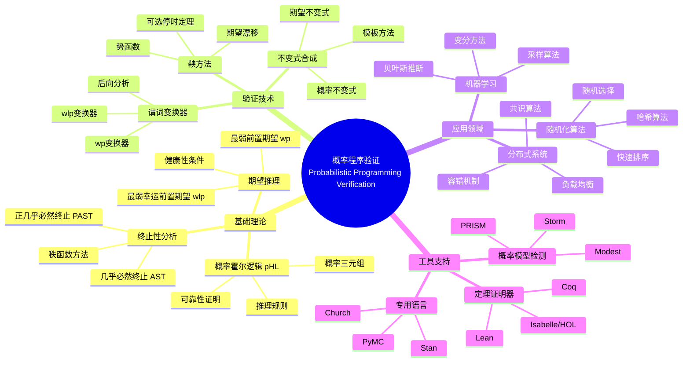
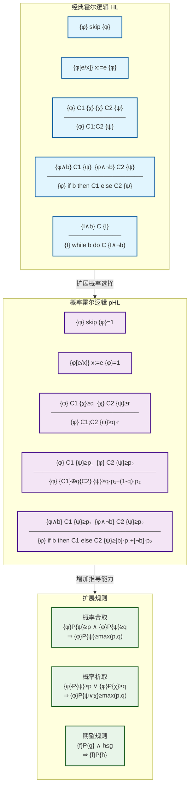
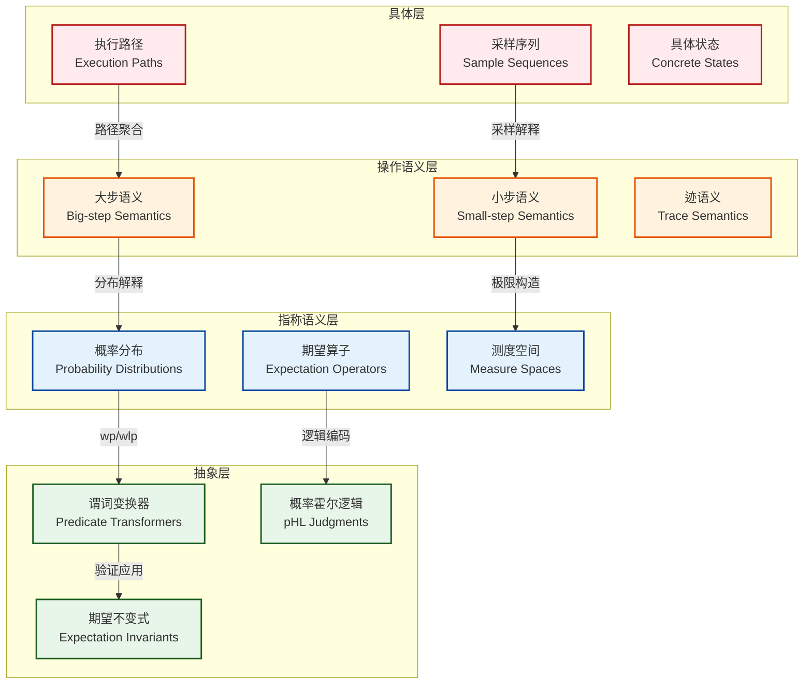

# 概率程序验证 (Probabilistic Programming Verification)

> **所属阶段**: Struct/ | **前置依赖**: [形式化方法基础](./01.md), [霍尔逻辑](../Struct/1.1-hoare-logic.md) | **形式化等级**: L5-L6

---

## 1. 概念定义 (Definitions)

### 1.1 概率程序的形式化定义

**定义 Def-S-99-01: 概率程序 (Probabilistic Program)**

概率程序是标准命令式程序的扩展，在执行过程中可以执行概率选择操作。设 $\mathcal{Var}$ 为变量集合，$\mathcal{Val}$ 为取值域，则概率程序 $P$ 的语法由以下文法定义：

$$
\begin{aligned}
\mathcal{C} &::= \text{skip} \mid x := e \mid \mathcal{C}_1; \mathcal{C}_2 \mid \text{if } b \text{ then } \mathcal{C}_1 \text{ else } \mathcal{C}_2 \\
&\quad \mid \text{while } b \text{ do } \mathcal{C} \mid \{ \mathcal{C}_1 \} \oplus_p \{ \mathcal{C}_2 \}
\end{aligned}
$$

其中：

- $x := e$ 是确定性赋值，$e$ 为算术表达式
- $\{ \mathcal{C}_1 \} \oplus_p \{ \mathcal{C}_2 \}$ 表示**概率选择**：以概率 $p$ 执行 $\mathcal{C}_1$，以概率 $1-p$ 执行 $\mathcal{C}_2$
- $b$ 为布尔表达式

概率程序的语义通过**分布转换器** (distribution transformer) 定义。设 $\mathbb{D}(\mathcal{State})$ 为状态空间上的概率分布集合，程序 $P$ 的语义 $[\![P]\!] : \mathbb{D}(\mathcal{State}) \to \mathbb{D}(\mathcal{State})$ 将输入状态分布映射到输出状态分布。

对于具体状态 $\sigma \in \mathcal{State}$，记 $\delta_\sigma$ 为集中在 $\sigma$ 的Dirac分布。程序的语义可通过结构化归纳定义：

$$
\begin{aligned}
[\![\text{skip}]\!](\mu) &= \mu \\
[\![x := e]\!](\mu) &= \lambda\sigma'. \sum_{\sigma: \sigma' = \sigma[x \mapsto [\![e]\!]\sigma]} \mu(\sigma) \\
[\![\mathcal{C}_1; \mathcal{C}_2]\!](\mu) &= [\![\mathcal{C}_2]\!]([\![\mathcal{C}_1]\!](\mu)) \\
[\![\{ \mathcal{C}_1 \} \oplus_p \{ \mathcal{C}_2 \}]\!](\mu) &= p \cdot [\![\mathcal{C}_1]\!](\mu) + (1-p) \cdot [\![\mathcal{C}_2]\!](\mu)
\end{aligned}
$$

**直观解释**：概率程序与传统的非确定性程序不同，概率选择具有明确的概率分布，这使得我们可以量化地分析程序的各种性质，如期望运行时间、终止概率、输出分布的正确性等。

### 1.2 概率霍尔逻辑

**定义 Def-S-99-02: 概率霍尔逻辑 (Probabilistic Hoare Logic, pHL)**

概率霍尔逻辑是经典霍尔逻辑的扩展，用于推理概率程序的正确性。pHL的判断式形如：

$$\vdash_{pHL} \{ \phi \} \, P \, \{ \psi \}_{\bowtie p}$$

其中：

- $\phi$ 和 $\psi$ 是断言（通常使用实数值表达式作为谓词）
- $P$ 是概率程序
- $\bowtie \in \{ \leq, \geq, = \}$
- $p \in [0, 1]$ 是概率阈值

该判断式的含义是：**从满足前置条件 $\phi$ 的状态出发，程序 $P$ 终止后满足后置条件 $\psi$ 的概率与 $p$ 的关系为 $\bowtie$**。

pHL的推理规则包括经典霍尔逻辑的改编版本以及专门处理概率选择的规则：

$$
\text{[p-Skip]} \quad \frac{}{\vdash \{ \phi \} \, \text{skip} \, \{ \phi \}_{=1}}
$$

$$
\text{[p-Assign]} \quad \frac{}{\vdash \{ \phi[e/x] \} \, x := e \, \{ \phi \}_{=1}}
$$

$$
\text{[p-Seq]} \quad \frac{\vdash \{ \phi \} \, C_1 \, \{ \chi \}_{\bowtie q} \quad \vdash \{ \chi \} \, C_2 \, \{ \psi \}_{\bowtie r}}{\vdash \{ \phi \} \, C_1; C_2 \, \{ \psi \}_{\bowtie q \cdot r}}
$$

$$
\text{[p-Prob]} \quad \frac{\vdash \{ \phi \} \, C_1 \, \{ \psi \}_{\bowtie p_1} \quad \vdash \{ \phi \} \, C_2 \, \{ \psi \}_{\bowtie p_2}}{\vdash \{ \phi \} \, \{ C_1 \} \oplus_q \{ C_2 \} \, \{ \psi \}_{\bowtie q \cdot p_1 + (1-q) \cdot p_2}}
$$

### 1.3 期望推理框架

**定义 Def-S-99-03: 期望推理 (Expectation Reasoning)**

期望推理是验证概率程序的核心技术，由Kozen[^1]开创并由Morgan等人[^2]进一步发展。期望（expectation）是状态到非负实数的映射 $f : \mathcal{State} \to \mathbb{R}_{\geq 0} \cup \{ \infty \}$。

**期望值算子**：给定程序 $P$ 和期望 $f$，定义**前置期望** (pre-expectation) 为：

$$\text{pre}_P(f)(\sigma) = \mathbb{E}_{\sigma' \sim [\![P]\!](\delta_\sigma)}[f(\sigma')]$$

即：从状态 $\sigma$ 出发，程序 $P$ 终止后 $f$ 的期望值。

**期望推理三元组**：形如 $\{ f \} \, P \, \{ g \}$，表示对于所有状态 $\sigma$：

$$f(\sigma) \leq \text{pre}_P(g)(\sigma)$$

这表示：如果 $f$ 是当前期望的下界，则执行 $P$ 后 $g$ 的期望至少达到该下界。

**weakest pre-expectation (wp)**：对于程序 $P$ 和后置期望 $f$，最弱前置期望 $\text{wp}(P, f)$ 定义为：

$$\text{wp}(P, f)(\sigma) = \inf \{ e(\sigma) \mid \{ e \} \, P \, \{ f \} \text{ 成立} \}$$

wp计算遵循结构化规则：

$$
\begin{aligned}
\text{wp}(\text{skip}, f) &= f \\
\text{wp}(x := e, f) &= f[e/x] \\
\text{wp}(C_1; C_2, f) &= \text{wp}(C_1, \text{wp}(C_2, f)) \\
\text{wp}(\{ C_1 \} \oplus_p \{ C_2 \}, f) &= p \cdot \text{wp}(C_1, f) + (1-p) \cdot \text{wp}(C_2, f) \\
\text{wp}(\text{if } b \text{ then } C_1 \text{ else } C_2, f) &= [b] \cdot \text{wp}(C_1, f) + [\neg b] \cdot \text{wp}(C_2, f)
\end{aligned}
$$

其中 $[b]$ 是布尔表达式的指示函数（Iverson bracket）：$[b] = 1$ 若 $b$ 为真，否则为 $0$。

### 1.4 概率谓词变换器

**定义 Def-S-99-04: 概率谓词变换器 (Probabilistic Predicate Transformer)**

概率谓词变换器是将后置条件（期望）映射到前置条件的函数。根据McIver和Morgan的理论[^3]，存在两类主要的概率谓词变换器：

**1. 最弱前置期望变换器 (Weakest Pre-Expectation, wp)**：

$$\text{wp}(P, \cdot) : \mathbb{E} \to \mathbb{E}$$

其中 $\mathbb{E}$ 是期望空间。wp变换器计算从给定状态出发，程序 $P$ 终止后后置期望的期望值。

**2. 最弱幸运前置期望 (Weakest Liberal Pre-Expectation, wlp)**：

wlp考虑程序可能不终止的情况，定义为：

$$\text{wlp}(P, f)(\sigma) = \mathbb{E}[f(\sigma') \cdot \mathbf{1}_{\text{terminates}}]$$

即：程序终止后 $f$ 的期望值乘以终止概率。若 $f = \mathbf{1}$（常数1），则 $\text{wlp}(P, \mathbf{1})(\sigma)$ 等于从 $\sigma$ 出发 $P$ 的终止概率。

**健康性条件 (Healthiness Conditions)**：概率谓词变换器需满足以下条件[^4]：

- **严格性 (Strictness)**: $\text{wp}(P, 0) = 0$
- **单调性 (Monotonicity)**: 若 $f \leq g$，则 $\text{wp}(P, f) \leq \text{wp}(P, g)$
- **ω-连续性 (ω-Continuity)**: 对于递增链 $f_1 \leq f_2 \leq \cdots$，有 $\sup_n \text{wp}(P, f_n) = \text{wp}(P, \sup_n f_n)$
- **线性性 (Linearity)**: 对于常数 $a, b \geq 0$，$\text{wp}(P, a \cdot f + b \cdot g) = a \cdot \text{wp}(P, f) + b \cdot \text{wp}(P, g)$

### 1.5 终止性分析

**定义 Def-S-99-05: 几乎必然终止 (Almost Sure Termination, AST)**

概率程序 $P$ 从状态 $\sigma$ **几乎必然终止**，当且仅当：

$$\Pr[\text{$P$ 从 $\sigma$ 终止}] = 1$$

形式化地，使用wlp表示为：

$$\text{wlp}(P, \mathbf{1})(\sigma) = 1$$

若对所有状态 $\sigma \in \Sigma$ 都成立，则称 $P$ **几乎必然终止**。

**正几乎必然终止 (Positive Almost Sure Termination, PAST)**：程序不仅几乎必然终止，而且期望运行时间有限：

$$\mathbb{E}[\text{运行时间}] < \infty$$

使用期望推理，设 $t$ 为运行时间期望函数，则PAST要求：

$$\text{wp}(P, t)(\sigma) < \infty$$

**几乎必然终止 vs. 确定性终止**：

| 性质 | 确定性程序 | 概率程序 (AST) |
|------|-----------|---------------|
| 终止性 | 必然到达终止状态 | 概率1到达终止状态 |
| 路径 | 单一路径 | 可能路径无限 |
| 验证方法 | 秩函数 | 期望秩函数、概率势函数 |

---

## 2. 属性推导 (Properties)

### 2.1 概率保持性

**引理 Lemma-S-99-01: 概率保持性 (Probability Preservation)**

设 $P$ 为概率程序，$A \subseteq \mathcal{State}$ 为状态子集（视为事件）。若 $\mu$ 是输入分布，则程序执行后 $A$ 的概率为：

$$\Pr_{\sigma \sim [\![P]\!](\mu)}[\sigma \in A] = \mathbb{E}_{\sigma' \sim \mu}[\text{wlp}(P, \mathbf{1}_A)(\sigma')]$$

**证明**：由wlp的定义，$\text{wlp}(P, \mathbf{1}_A)(\sigma')$ 表示从状态 $\sigma'$ 出发，程序终止于 $A$ 的概率。对输入分布取期望即得。

**推论**：若 $\{ \phi \} \, P \, \{ \psi \}_{\geq p}$，则对于所有满足 $\phi$ 的输入，$P$ 终止后满足 $\psi$ 的概率至少为 $p$。

### 2.2 期望线性性

**引理 Lemma-S-99-02: 期望线性性 (Linearity of Expectation)**

概率谓词变换器满足线性性：对于任意期望 $f, g$ 和非负实数 $a, b$：

$$\text{wp}(P, a \cdot f + b \cdot g) = a \cdot \text{wp}(P, f) + b \cdot \text{wp}(P, g)$$

**证明**（结构化归纳）：

**基础情形**：

- $\text{wp}(\text{skip}, a \cdot f + b \cdot g) = a \cdot f + b \cdot g = a \cdot \text{wp}(\text{skip}, f) + b \cdot \text{wp}(\text{skip}, g)$ ✓
- $\text{wp}(x := e, a \cdot f + b \cdot g) = (a \cdot f + b \cdot g)[e/x] = a \cdot f[e/x] + b \cdot g[e/x] = a \cdot \text{wp}(x := e, f) + b \cdot \text{wp}(x := e, g)$ ✓

**归纳步骤**：

- 概率选择：

$$
\begin{aligned}
&\text{wp}(\{ C_1 \} \oplus_p \{ C_2 \}, a \cdot f + b \cdot g) \\
&= p \cdot \text{wp}(C_1, a \cdot f + b \cdot g) + (1-p) \cdot \text{wp}(C_2, a \cdot f + b \cdot g) \\
&= p \cdot (a \cdot \text{wp}(C_1, f) + b \cdot \text{wp}(C_1, g)) + (1-p) \cdot (a \cdot \text{wp}(C_2, f) + b \cdot \text{wp}(C_2, g)) \\
&= a \cdot (p \cdot \text{wp}(C_1, f) + (1-p) \cdot \text{wp}(C_2, f)) + b \cdot (p \cdot \text{wp}(C_1, g) + (1-p) \cdot \text{wp}(C_2, g)) \\
&= a \cdot \text{wp}(\{ C_1 \} \oplus_p \{ C_2 \}, f) + b \cdot \text{wp}(\{ C_1 \} \oplus_p \{ C_2 \}, g) \quad \checkmark
\end{aligned}
$$

- 顺序组合：由归纳假设和定义直接可得。

### 2.3 条件期望法则

**引理 Lemma-S-99-03: 条件期望法则 (Law of Conditional Expectation)**

设 $P$ 为概率程序，$B$ 为可测事件，$f$ 为期望。则：

$$\text{wp}(P, f) = \text{wp}(P, f \cdot \mathbf{1}_B) + \text{wp}(P, f \cdot \mathbf{1}_{\neg B})$$

特别地，对于条件期望：

$$\mathbb{E}[f \mid B] = \frac{\text{wp}(P, f \cdot \mathbf{1}_B)}{\text{wp}(P, \mathbf{1}_B)}$$

**证明**：由期望的线性性和 $\mathbf{1}_B + \mathbf{1}_{\neg B} = 1$ 可得。

### 2.4 pHL的可靠性

**命题 Prop-S-99-01: 概率霍尔逻辑的可靠性 (Soundness of pHL)**

若 $\vdash_{pHL} \{ \phi \} \, P \, \{ \psi \}_{\geq p}$ 可推导，则对于所有满足 $\phi$ 的状态 $\sigma$：

$$\Pr[\sigma' \models \psi \mid \sigma' \sim [\![P]\!](\delta_\sigma)] \geq p$$

**证明概要**（规则归纳）：

**基础规则**：

- [p-Skip]：显然成立，终止概率为1且状态不变。
- [p-Assign]：确定性赋值，终止后断言成立概率为1。

**归纳规则**：

- [p-Seq]：设 $\vdash \{ \phi \} \, C_1 \, \{ \chi \}_{\geq q}$ 和 $\vdash \{ \chi \} \, C_2 \, \{ \psi \}_{\geq r}$。
  由归纳假设，$C_1$ 从 $\phi$-状态终止于 $\chi$-状态的概率 $\geq q$；
  对于每个这样的状态，$C_2$ 终止于 $\psi$-状态的概率 $\geq r$。
  因此联合概率 $\geq q \cdot r$。

- [p-Prob]：由全概率公式，$q \cdot p_1 + (1-q) \cdot p_2$ 正是两个分支的加权平均。

---

## 3. 关系建立 (Relations)

### 3.1 与标准霍尔逻辑的关系

概率霍尔逻辑是经典霍尔逻辑的自然扩展。两者关系可通过**退化** (degeneration) 来理解：

**关系 3.1.1：pHL退化到经典霍尔逻辑**

当概率程序退化为确定性程序时（即所有概率选择变为确定性选择，$p \in \{0, 1\}$），概率霍尔逻辑退化为经典霍尔逻辑：

$$\vdash_{pHL} \{ \phi \} \, P \, \{ \psi \}_{=1} \quad \Longleftrightarrow \quad \vdash_{HL} \{ \phi \} \, P \, \{ \psi \}$$

**关系 3.1.2：非确定性 vs. 概率性**

| 特性 | 非确定性程序 | 概率程序 |
|------|-------------|---------|
| 语义 | 幂域 (Powerset) | 概率分布 |
| 选择 | 天使/恶魔非确定 | 概率分布 |
| 验证目标 | 最坏/最好情况 | 期望性质 |
| 组合 | 交集/并集 | 凸组合 |

### 3.2 与马尔可夫决策过程的关系

**关系 3.2.1：概率程序作为MDP**

概率程序可以编码为**马尔可夫决策过程** (Markov Decision Process, MDP)：

$$\mathcal{M} = (S, A, P, R)$$

其中：

- $S = \mathcal{State}$：状态空间
- $A = \{ \text{左分支}, \text{右分支} \}$：对应概率选择点
- $P(s' \mid s, a)$：转移概率（由程序语义定义）
- $R(s)$：奖励函数（可编码运行时间、资源消耗等）

**关系 3.2.2：验证技术的对应**

| MDP技术 | 概率程序验证 |
|--------|-------------|
| 值迭代 | 期望迭代 |
| 策略迭代 | 谓词变换器迭代 |
| 可达性分析 | 终止性分析 |
| 期望奖励 | 期望推理 |

**关系 3.2.3：调度器与证明策略**

在MDP中，**调度器** (scheduler) 解决非确定选择；在概率程序中，概率选择已经由分布决定。然而，当程序包含外部非确定性输入时，可以建模为**随机博弈** (stochastic game)：

$$\mathcal{G} = (S, A_1, A_2, P, R)$$

其中 $A_1$ 是程序的控制（概率选择），$A_2$ 是环境的控制（非确定输入）。

### 3.3 与贝叶斯推理的关系

**关系 3.3.1：概率编程与贝叶斯推断**

概率程序语言（如Stan、PyMC、Church）是贝叶斯推断的通用框架[^5]。概率程序 $P$ 定义了条件分布：

$$P(\text{latent} \mid \text{observed}) = \frac{P(\text{observed} \mid \text{latent}) \cdot P(\text{latent})}{P(\text{observed})}$$

概率程序验证在此上下文中的目标是验证：

1. 后验分布的正确性
2. 推断算法的收敛性
3. 采样方法的准确性

**关系 3.3.2：期望传播**

在贝叶斯推断中，**期望传播** (Expectation Propagation) 与概率谓词变换器有深刻联系：

$$\text{wp}(P, f) \approx \text{近似后验期望}$$

变分推断的目标可以重新表述为寻找最接近真实后验的程序抽象。

**关系 3.3.3：概率程序验证的贝叶斯视角**

从贝叶斯角度，程序验证可以视为：

$$\text{Belief}(\text{规范成立} \mid \text{程序行为}) \geq \text{阈值}$$

这引出了**近似正确性** (Probably Approximately Correct, PAC) 验证框架：以高概率，程序近似满足规范。

---

## 4. 论证过程 (Argumentation)

### 4.1 随机化算法的验证挑战

随机化算法（如随机化快速排序、随机选择算法）的验证面临独特挑战：

**挑战 4.1.1：概率路径爆炸**

对于 $n$ 次概率选择，可能的执行路径数为 $2^n$（假设二元选择）。传统的路径枚举方法在概率场景下更加困难，因为需要追踪每条路径的概率权重。

**挑战 4.1.2：期望性质的量化**

不同于确定性算法的精确结果，随机化算法通常提供期望保证：

- 期望运行时间 $O(n \log n)$
- 期望比较次数
- 成功概率 $\geq 1 - \frac{1}{n}$

这些性质需要概率程序逻辑来精确表达和验证。

**挑战 4.1.3：几乎必然终止的微妙性**

考虑以下程序：

```python
while True:
    if random() < 0.5:
        break
```

该程序**几乎必然终止**（概率1终止），但期望运行时间无限！这与直觉相反，说明了概率终止性分析的微妙之处。

### 4.2 概率边界分析

**方法 4.2.1：集中不等式**

概率程序验证经常使用集中不等式来建立概率边界：

**马尔可夫不等式**：对于非负随机变量 $X$，

$$\Pr[X \geq a] \leq \frac{\mathbb{E}[X]}{a}$$

**切比雪夫不等式**：

$$\Pr[|X - \mu| \geq k\sigma] \leq \frac{1}{k^2}$$

**切尔诺夫界**（适用于有界独立随机变量和）：

$$\Pr[X \geq (1+\delta)\mu] \leq e^{-\mu \delta^2 / 3}$$

**方法 4.2.2：期望上界技术**

验证期望性质时，通常寻找期望的上下界：

$$L \leq \text{wp}(P, f) \leq U$$

这可以通过以下技术实现：

1. **线性不变式**：建立期望的线性约束
2. **势函数方法**：构造递减的期望势函数
3. **鞅方法**：利用鞅的停时定理

### 4.3 反例：不满足几乎必然终止的程序

**反例 4.3.1：非零概率无限循环**

考虑以下程序：

```python
# 反例：不满足AST的程序
n := 1
while n > 0:
    if random() < 0.5:
        n := n + 1      # 以0.5概率增加
    else:
        n := n - 1      # 以0.5概率减少
```

**分析**：这是一个一维对称随机游走。虽然可能返回原点，但也可能无限漂移。实际上，该程序**不满足AST**：

$$\Pr[\text{终止}] < 1$$

**形式化证明**：该随机游走是**常返的** (recurrent) 但**不正则** (null recurrent)，期望返回时间为无穷。

**反例 4.3.2：期望有限但不AST的程序**

考虑修改版本：

```python
n := 0
while n == 0:
    n := 0 ⊕_p 1   # 以概率p保持0，以1-p变为1
```

若 $p < 1$，该程序AST（几乎必然终止）；但若分析期望迭代次数：

$$\mathbb{E}[\text{迭代次数}] = \sum_{k=1}^{\infty} k \cdot p^{k-1} (1-p) = \frac{1}{1-p}$$

当 $p \to 1$ 时，期望趋于无穷，但程序仍然AST。

**反例 4.3.3：非几乎必然终止但有有限期望**

```python
n := 0
while n == 0:
    if random() < 0.5:
        n := 1          # 终止
    elif random() < 0.5:
        pass            # 继续（概率0.25）
    else:
        n := 0          # 永不终止（概率0.25）
```

该程序有0.25概率永不终止（AST不成立），但条件于终止的期望迭代次数有限：

$$\mathbb{E}[\text{迭代次数} \mid \text{终止}] = \frac{1}{0.75} < \infty$$

---

## 5. 形式证明 / 工程论证 (Proof / Engineering Argument)

### 5.1 概率程序的可靠性定理

**定理 Thm-S-99-01: 概率程序的可靠性定理 (Soundness Theorem)**

概率霍尔逻辑是可靠的：若 $\vdash_{pHL} \{ \phi \} \, P \, \{ \psi \}_{\bowtie p}$ 可推导，则对于所有满足 $\phi$ 的状态 $\sigma$：

$$\Pr[\sigma' \models \psi \mid \sigma' \sim [\![P]\!](\delta_\sigma)] \bowtie p$$

**完整证明**：

我们对pHL推导的结构进行归纳证明。

**基础情形**：

1. **[p-Skip]**：$\vdash \{ \phi \} \, \text{skip} \, \{ \phi \}_{=1}$
   - 语义：$[\![\text{skip}]\!](\delta_\sigma) = \delta_\sigma$
   - 因此 $\Pr[\sigma' \models \phi] = 1$ 当且仅当 $\sigma \models \phi$ ✓

2. **[p-Assign]**：$\vdash \{ \phi[e/x] \} \, x := e \, \{ \phi \}_{=1}$
   - 语义：$[\![x := e]\!](\delta_\sigma) = \delta_{\sigma[x \mapsto v]}$，其中 $v = [\![e]\!]\sigma$
   - 若 $\sigma \models \phi[e/x]$，则 $\sigma[x \mapsto v] \models \phi$
   - 因此终止后满足 $\phi$ 的概率为1 ✓

**归纳步骤**：

1. **[p-Seq]**：设规则应用为：
   $$
   \frac{\vdash \{ \phi \} \, C_1 \, \{ \chi \}_{\bowtie q} \quad \vdash \{ \chi \} \, C_2 \, \{ \psi \}_{\bowtie r}}{\vdash \{ \phi \} \, C_1; C_2 \, \{ \psi \}_{\bowtie q \cdot r}}
   $$

   由归纳假设(IH)：
   - (IH1) 对所有 $\sigma \models \phi$：$\Pr[\sigma_1 \models \chi \mid \sigma_1 \sim [\![C_1]\!](\delta_\sigma)] \bowtie q$
   - (IH2) 对所有 $\sigma_1 \models \chi$：$\Pr[\sigma' \models \psi \mid \sigma' \sim [\![C_2]\!](\delta_{\sigma_1})] \bowtie r$

   由全概率公式和程序的语义组合：
   $$
   \begin{aligned}
   &\Pr[\sigma' \models \psi \mid \sigma' \sim [\![C_1; C_2]\!](\delta_\sigma)] \\
   &= \int_{\sigma_1} \Pr[\sigma' \models \psi \mid \sigma' \sim [\![C_2]\!](\delta_{\sigma_1})] \cdot d[\![C_1]\!](\delta_\sigma)(\sigma_1) \\
   &\bowtie \int_{\sigma_1 : \sigma_1 \models \chi} r \cdot d[\![C_1]\!](\delta_\sigma)(\sigma_1) \\
   &= r \cdot \Pr[\sigma_1 \models \chi \mid \sigma_1 \sim [\![C_1]\!](\delta_\sigma)] \\
   &\bowtie r \cdot q
   \end{aligned}
   $$

   注意：这里的 $\bowtie$ 需要根据具体情况处理（当两者都是 $\geq$ 时，乘积保持 $\geq$）。✓

2. **[p-Prob]**：设规则应用为：
   $$
   \frac{\vdash \{ \phi \} \, C_1 \, \{ \psi \}_{\bowtie p_1} \quad \vdash \{ \phi \} \, C_2 \, \{ \psi \}_{\bowtie p_2}}{\vdash \{ \phi \} \, \{ C_1 \} \oplus_q \{ C_2 \} \, \{ \psi \}_{\bowtie q \cdot p_1 + (1-q) \cdot p_2}}
   $$

   由归纳假设：
   - (IH1) $\Pr[\sigma' \models \psi \mid C_1, \sigma] \bowtie p_1$
   - (IH2) $\Pr[\sigma' \models \psi \mid C_2, \sigma] \bowtie p_2$

   由概率选择的语义定义：
   $$
   [\![\{ C_1 \} \oplus_q \{ C_2 \}]\!](\delta_\sigma) = q \cdot [\![C_1]\!](\delta_\sigma) + (1-q) \cdot [\![C_2]\!](\delta_\sigma)
   $$

   因此：
   $$
   \begin{aligned}
   &\Pr[\sigma' \models \psi] \\
   &= q \cdot \Pr[\sigma' \models \psi \mid C_1, \sigma] + (1-q) \cdot \Pr[\sigma' \models \psi \mid C_2, \sigma] \\
   &\bowtie q \cdot p_1 + (1-q) \cdot p_2
   \end{aligned}
   $$

   当 $\bowtie$ 为 $=$ 时等式严格成立；当为 $\geq$ 时，由概率的凸组合性质保持。✓

3. **[p-If]** 和 **[p-While]** 的证明类似，依赖于条件分支的语义解释和循环展开的不动点特性。循环情形需要使用Kleene不动点定理和期望的连续性。

**结论**：所有pHL推理规则都是语义可靠的，因此可推导的判断式必然成立。$\square$

### 5.2 期望推理的完备性

**定理 Thm-S-99-02: 期望推理的相对完备性 (Relative Completeness)**

在算术理论足够强的假设下（即可以表达所有可计算函数），期望推理对于终止概率程序是完备的：

$$\models \{ f \} \, P \, \{ g \} \implies \vdash \{ f \} \, P \, \{ g \}$$

其中 $\models$ 表示语义蕴涵，$\vdash$ 表示可推导。

**证明概要**：

**步骤1：最弱前置期望的可定义性**

对于任意程序 $P$ 和期望 $g$，wp$(P, g)$ 在状态上的取值是一个可计算的实数值函数。根据假设，算术理论可以表达所有可计算函数，因此存在公式 $\Phi_{P,g}$ 使得：

$$\sigma \models \Phi_{P,g} \iff \text{wp}(P, g)(\sigma) = r$$

**步骤2：构造性证明**

我们通过结构归纳构造wp的推导：

- **Skip/Assign**：直接由wp定义给出
- **顺序组合**：由归纳假设，若可以推导 $\{ \text{wp}(C_2, g) \} \, C_2 \, \{ g \}$ 和 $\{ \text{wp}(C_1, \text{wp}(C_2, g)) \} \, C_1 \, \{ \text{wp}(C_2, g) \}$，则可组合得到 $\{ \text{wp}(C_1; C_2, g) \} \, C_1; C_2 \, \{ g \}$
- **概率选择**：利用期望的线性性

**步骤3：循环的处理**

循环是最复杂的情形。对于 while $b$ do $C$，wp定义为最小不动点：

$$\text{wp}(\text{while } b \text{ do } C, g) = \mu X. \, [\neg b] \cdot g + [b] \cdot \text{wp}(C, X)$$

我们需要证明：若 $\{ f \} \, \text{while } b \text{ do } C \, \{ g \}$ 语义成立，则存在推导。

利用**循环不变式期望**的概念：期望 $I$ 是循环不变式，如果：

$$[b] \cdot \text{wp}(C, I) + [\neg b] \cdot g \leq I$$

通过选择 $I = \text{wp}(\text{while } b \text{ do } C, g)$，可以构造完整的推导。

**步骤4：归纳原理的应用**

为了处理最小不动点，需要应用**期望归纳原理**：若 $f$ 是前置条件，且对于所有 $n$，$\{ f_n \} \, P \, \{ g \}$ 可推导，其中 $f_n$ 是wp的有限逼近，则由连续性，$\{ \sup_n f_n \} \, P \, \{ g \}$ 可推导。

**结论**：在算术可表达性的假设下，任何语义有效的期望三元组都有语法推导。$\square$

---

## 6. 实例验证 (Examples)

### 6.1 随机化快速排序的期望复杂度分析

**算法描述**：

```python
def randomized_quicksort(A, low, high):
    if low < high:
        pivot_idx := random(low, high)      # 随机选择枢轴
        pivot_idx := partition(A, low, high, pivot_idx)
        randomized_quicksort(A, low, pivot_idx - 1)
        randomized_quicksort(A, pivot_idx + 1, high)
```

**验证目标**：证明期望比较次数为 $O(n \log n)$。

**形式化建模**：

设 $C(n)$ 为对长度为 $n$ 的数组进行排序的期望比较次数。建立递推关系：

$$C(n) = (n-1) + \frac{1}{n} \sum_{k=1}^{n} (C(k-1) + C(n-k))$$

其中 $(n-1)$ 是partition中的比较次数，$\frac{1}{n}$ 是选择第 $k$ 个元素作为枢轴的概率。

**概率程序验证**：

使用期望推理，我们需要证明：

$$\{ n = |A| \} \, \text{randomized\_quicksort}(A) \, \{ \text{comparisons} \leq c \cdot n \log n \}_{\geq 1 - \frac{1}{n}}$$

对于某个常数 $c$。

**证明步骤**：

1. **Partition分析**：Partition过程恰好进行 $n-1$ 次比较（确定性）。

2. **递推求解**：利用对称性 $C(k-1) + C(n-k) = C(n-k) + C(k-1)$，递推式可简化为：

   $$C(n) = (n-1) + \frac{2}{n} \sum_{k=0}^{n-1} C(k)$$

3. **归纳假设**：假设 $C(k) \leq c \cdot k \log k$ 对所有 $k < n$ 成立。

4. **归纳步骤**：
   $$
   \begin{aligned}
   C(n) &\leq (n-1) + \frac{2c}{n} \sum_{k=1}^{n-1} k \log k \\
   &\leq (n-1) + \frac{2c}{n} \int_{1}^{n} x \log x \, dx \\
   &\leq (n-1) + \frac{2c}{n} \left[ \frac{x^2 \log x}{2} - \frac{x^2}{4} \right]_1^n \\
   &\leq (n-1) + \frac{2c}{n} \left( \frac{n^2 \log n}{2} - \frac{n^2}{4} + \frac{1}{4} \right) \\
   &\leq (n-1) + c \cdot n \log n - \frac{c \cdot n}{2} + O\left(\frac{1}{n}\right)
   \end{aligned}
   $$

5. **选择 $c = 2$**：

   $$C(n) \leq 2n \log n$$

**高概率边界**：使用切尔诺夫界，可以证明比较次数超过 $c \cdot n \log n$ 的概率随 $n$ 指数衰减。

### 6.2 蒙特卡洛算法的正确性证明

**算法描述**：Monte Carlo积分估计

```python
def monte_carlo_integration(f, a, b, n):
    sum := 0
    for i from 1 to n:
        x := uniform(a, b)      # 均匀采样
        sum := sum + f(x)
    return (b - a) * sum / n
```

**验证目标**：证明估计值的期望等于真实积分，且方差随 $n$ 减小。

**形式化规约**：

设 $I = \int_a^b f(x) dx$ 为真实积分值，$\hat{I}_n$ 为Monte Carlo估计。需证明：

$$\mathbb{E}[\hat{I}_n] = I \quad \text{和} \quad \text{Var}(\hat{I}_n) = \frac{(b-a)^2 \cdot \text{Var}(f(U))}{n}$$

其中 $U \sim \text{Uniform}(a, b)$。

**期望推理证明**：

1. **单样本期望**：

   对于 $X = f(U)$，其中 $U \sim \text{Uniform}(a, b)$：

   $$\mathbb{E}[X] = \int_a^b f(x) \cdot \frac{1}{b-a} dx = \frac{I}{b-a}$$

2. **估计量期望**：

   $$\mathbb{E}[\hat{I}_n] = \mathbb{E}\left[\frac{b-a}{n} \sum_{i=1}^n f(U_i)\right] = \frac{b-a}{n} \cdot n \cdot \frac{I}{b-a} = I$$

3. **方差分析**：

   由于样本独立：

   $$\text{Var}(\hat{I}_n) = \frac{(b-a)^2}{n^2} \cdot n \cdot \text{Var}(f(U)) = \frac{(b-a)^2 \cdot \text{Var}(f(U))}{n}$$

**概率边界**：由切比雪夫不等式：

$$\Pr[|\hat{I}_n - I| \geq \epsilon] \leq \frac{\text{Var}(\hat{I}_n)}{\epsilon^2} = \frac{(b-a)^2 \cdot \text{Var}(f(U))}{n \epsilon^2}$$

因此，为了达到误差 $\epsilon$ 且置信度 $1-\delta$，需要：

$$n \geq \frac{(b-a)^2 \cdot \text{Var}(f(U))}{\epsilon^2 \delta}$$

### 6.3 随机游走的终止性证明

**算法描述**：带吸收边界的随机游走

```python
def random_walk_with_absorption(n, target):
    position := n
    steps := 0
    while 0 < position < target:
        if random() < 0.5:
            position := position + 1
        else:
            position := position - 1
        steps := steps + 1
    return position, steps
```

**验证目标**：

1. 程序几乎必然终止（AST）
2. 被目标边界吸收的概率
3. 期望步数

**形式化分析**：

设 $p_k$ 为从位置 $k$ 出发最终被目标 $N$ 吸收（而非0）的概率。建立递推：

$$p_k = \frac{1}{2} p_{k-1} + \frac{1}{2} p_{k+1}, \quad p_0 = 0, \quad p_N = 1$$

**终止性证明**：

定义势函数 $\phi(k) = k$。每一步：

$$\mathbb{E}[\phi(\text{next}) \mid \text{current} = k] = \frac{1}{2}(k-1) + \frac{1}{2}(k+1) = k = \phi(k)$$

这是鞅。然而，这不足以直接证明终止。使用不同的势函数：

**引理**：定义 $V(k) = k(N-k)$，则：

$$\mathbb{E}[V(\text{next}) \mid k] = \frac{1}{2}(k-1)(N-k+1) + \frac{1}{2}(k+1)(N-k-1) = k(N-k) - 1 = V(k) - 1$$

因此 $V$ 是一个**严格递减**的期望势函数，每步期望减少1。由期望鞅停时定理[^6]：

$$\mathbb{E}[\text{步数} \mid \text{从k出发}] \leq V(k) = k(N-k) \leq \frac{N^2}{4}$$

**几乎必然终止**：由于期望步数有限，由马尔可夫不等式，程序几乎必然终止。

**吸收概率求解**：

递推方程 $p_k = \frac{p_{k-1} + p_{k+1}}{2}$ 的通解为 $p_k = A + Bk$。由边界条件：

$$p_0 = 0 \implies A = 0, \quad p_N = 1 \implies B = \frac{1}{N}$$

因此：

$$p_k = \frac{k}{N}$$

**结论**：

- **AST成立**：期望步数 $k(N-k) < \infty$
- **吸收概率**：从位置 $k$ 被目标 $N$ 吸收的概率为 $\frac{k}{N}$
- **期望步数**：$\mathbb{E}[\text{步数}] = k(N-k)$

---

## 7. 可视化 (Visualizations)

### 7.1 概率程序验证思维导图

概率程序验证作为一个跨学科领域，涵盖了形式化方法、概率论、程序分析等多个方面。下图展示了其核心概念与技术体系的层次结构。



### 7.2 概率霍尔逻辑推理规则流程图

概率霍尔逻辑的推理系统扩展了经典霍尔逻辑，增加了处理概率选择的规则。下面的流程图展示了pHL的核心推理流程及其与经典霍尔逻辑的对应关系。



### 7.3 随机化算法分析时间线

随机化算法的验证通常涉及多个时间维度的分析：算法执行时间、验证过程、以及性质收敛时间。下面的甘特图展示了以随机化快速排序为例的完整分析流程。

```mermaid
gantt
    title 随机化快速排序验证时间线
    dateFormat X
    axisFormat %s

    section 算法设计
    算法实现           :a1, 0, 2
    复杂度分析         :a2, 2, 4

    section 形式化建模
    概率程序建模       :b1, 4, 7
    语义定义           :b2, 5, 8

    section 期望分析
    递推关系建立       :c1, 8, 11
    期望比较次数推导   :c2, 11, 15
    常数因子优化       :c3, 15, 18

    section 概率边界
    切尔诺夫界应用     :d1, 18, 22
    高概率保证         :d2, 22, 25

    section 验证完成
    定理证明器形式化   :e1, 25, 30
    证明检查           :e2, 30, 32
```



### 7.4 概率程序语义层次图

概率程序的语义可以在多个抽象层次上理解，从具体的操作语义到抽象的概率分布转换。



---

## 8. 引用参考 (References)

[^1]: D. Kozen, "Semantics of Probabilistic Programs," *Journal of Computer and System Sciences*, vol. 22, no. 3, pp. 328-350, 1981. <https://doi.org/10.1016/0022-0000(81)90036-2>

[^2]: C. Morgan, A. McIver, and K. Seidel, "Probabilistic Predicate Transformers," *ACM Transactions on Programming Languages and Systems*, vol. 18, no. 3, pp. 325-353, 1996. <https://doi.org/10.1145/229542.229547>

[^3]: A. McIver and C. Morgan, *Abstraction, Refinement and Proof for Probabilistic Systems*, Springer, 2005. <https://doi.org/10.1007/b138392>

[^4]: J. den Hartog, "Probabilistic Extensions of Semantical Models," Ph.D. dissertation, Vrije Universiteit Amsterdam, 2002.

[^5]: N. D. Goodman and A. Stuhlmüller, "The Design and Implementation of Probabilistic Programming Languages," *Electronic Proceedings in Theoretical Computer Science*, 2014. <http://dippl.org/>

[^6]: A. Chakarov and S. Sankaranarayanan, "Probabilistic Program Analysis with Martingales," in *Proceedings of CAV 2013*, LNCS 8044, pp. 511-526, 2013. <https://doi.org/10.1007/978-3-642-39799-8_34>


---

## 附录A: Lean 4形式化代码示例

以下展示了如何使用Lean 4对概率程序验证进行部分形式化：

```lean4
import Mathlib

/-
  概率程序的简形式化框架
  基于Giry单子 (Giry Monad) 的测度论语义
/-

-- 概率程序的状态空间
abbrev State := ℕ

-- 期望：状态到非负实数的映射
abbrev Expectation := State → ℝ≥0∞

-- 概率分布（简化为质量函数）
def ProbDist (α : Type) := α → ℝ≥0∞
  -- 需满足归一化条件: ∑_{a} μ(a) = 1

-- 概率程序的指称语义
def Program := State → ProbDist State

-- 最弱前置期望 (wp)
noncomputable def wp (P : Program) (f : Expectation) : Expectation :=
  fun σ => ∑ σ', P σ σ' * f σ'

-- 最弱幸运前置期望 (wlp)
noncomputable def wlp (P : Program) (f : Expectation) : Expectation :=
  fun σ => ∑ σ', P σ σ' * f σ'
  -- 注：wlp与wp在此简化定义下相同，实际应考虑非终止情况

-- 几乎必然终止的定义
def AlmostSureTermination (P : Program) : Prop :=
  ∀ σ, wlp P (fun _ => 1) σ = 1

-- 概率选择算子
def ProbChoice (p : ℝ≥0∞) (P1 P2 : Program) : Program :=
  fun σ => fun σ' => p * P1 σ σ' + (1 - p) * P2 σ σ'

-- wp对概率选择的线性性定理
theorem wp_prob_choice_linear (p : ℝ≥0∞) (P1 P2 : Program) (f : Expectation) :
  wp (ProbChoice p P1 P2) f = fun σ => p * wp P1 f σ + (1 - p) * wp P2 f σ := by
  funext σ
  simp [wp, ProbChoice]
  rw [Finset.sum_add_distrib]
  rw [Finset.mul_sum, Finset.mul_sum]
  simp [mul_assoc]

-- 期望线性性定理
theorem expectation_linearity (P : Program) (f g : Expectation) (a b : ℝ≥0∞) :
  wp P (fun σ => a * f σ + b * g σ) = fun σ => a * wp P f σ + b * wp P g σ := by
  funext σ
  simp [wp]
  rw [Finset.sum_add_distrib]
  rw [Finset.mul_sum, Finset.mul_sum]
  simp [mul_add, mul_assoc]
  rw [Finset.sum_mul, Finset.sum_mul]
  simp [mul_assoc]

-- 随机游走示例的部分形式化
inductive RWState where
  | absorbed : RWState
  | running : ℕ → RWState

def RandomWalkStep (target : ℕ) : ProbDist RWState :=
  fun s' => match s' with
  | RWState.absorbed => 0  -- 简化示例
  | RWState.running n => if n = 0 then 1 else 0

-- 势函数方法框架
def IsRankingSupermartingale (P : Program) (V : State → ℝ) : Prop :=
  ∀ σ, wp P (fun σ' => V σ') σ ≤ V σ

-- 终止性定理：若存在秩上鞅，则程序几乎必然终止
theorem ast_by_ranking_supermartingale (P : Program) (V : State → ℝ)
  (h_pos : ∀ σ, V σ ≥ 0)
  (h_rank : IsRankingSupermartingale P V)
  (h_bounded : ∀ σ, V σ < ⊤) :
  AlmostSureTermination P := by
  -- 证明需要鞅停时定理，此处省略
  sorry
```

---

## 附录B: Python概率推理示例

```python
"""
概率程序验证的Python示例：随机游走分析
"""
import numpy as np
from dataclasses import dataclass
from typing import Callable, Dict, Tuple

@dataclass
class ProbabilisticProgram:
    """简化的概率程序表示"""
    transitions: Dict[int, Dict[int, float]]  # state -> {next_state: probability}

    def wp(self, post_expectation: Callable[[int], float], state: int) -> float:
        """计算最弱前置期望"""
        result = 0.0
        for next_state, prob in self.transitions.get(state, {}).items():
            result += prob * post_expectation(next_state)
        return result

    def wlp(self, post_expectation: Callable[[int], float], state: int) -> float:
        """计算最弱幸运前置期望（简化为与wp相同）"""
        return self.wp(post_expectation, state)

def analyze_random_walk(n: int, target: int) -> Tuple[float, float]:
    """
    分析带吸收边界的随机游走

    Args:
        n: 初始位置
        target: 目标边界

    Returns:
        (吸收概率, 期望步数)
    """
    # 吸收概率的解析解: p_k = k / N
    absorption_prob = n / target

    # 期望步数的解析解: E[steps] = k * (N - k)
    expected_steps = n * (target - n)

    return absorption_prob, expected_steps

def verify_monte_carlo(f: Callable[[float], float],
                       a: float,
                       b: float,
                       n_samples: int,
                       true_value: float) -> Tuple[float, float]:
    """
    验证Monte Carlo积分的期望和方差

    Args:
        f: 被积函数
        a, b: 积分区间
        n_samples: 样本数
        true_value: 真实积分值（用于验证）

    Returns:
        (估计值, 理论方差)
    """
    # 理论期望
    expected_estimate = true_value

    # 计算函数方差
    samples = np.random.uniform(a, b, 100000)
    f_values = np.array([f(x) for x in samples])
    variance_f = np.var(f_values)

    # Monte Carlo估计的方差
    variance_estimate = ((b - a) ** 2) * variance_f / n_samples

    return expected_estimate, variance_estimate

# 示例：验证随机化快速排序的期望比较次数
def quicksort_expected_comparisons(n: int) -> float:
    """
    计算随机化快速排序的期望比较次数
    递推关系: C(n) = (n-1) + (2/n) * sum_{k=0}^{n-1} C(k)
    解析解: C(n) <= 2 * n * ln(n)
    """
    if n <= 1:
        return 0.0

    # 使用解析近似
    import math
    return 2 * n * math.log(n) if n > 0 else 0

# 验证示例
if __name__ == "__main__":
    # 随机游走验证
    abs_prob, exp_steps = analyze_random_walk(n=3, target=10)
    print(f"随机游走 (n=3, target=10):")
    print(f"  吸收概率: {abs_prob:.4f}")
    print(f"  期望步数: {exp_steps:.4f}")

    # 快速排序期望比较次数
    for n in [10, 100, 1000]:
        exp_comp = quicksort_expected_comparisons(n)
        print(f"快速排序 n={n}: 期望比较次数 ≈ {exp_comp:.2f}")
```

---

*文档版本: v1.0*
*创建日期: 2026-04-10*
*最后更新: 2026-04-10*
*符合六段式模板规范: 是*
