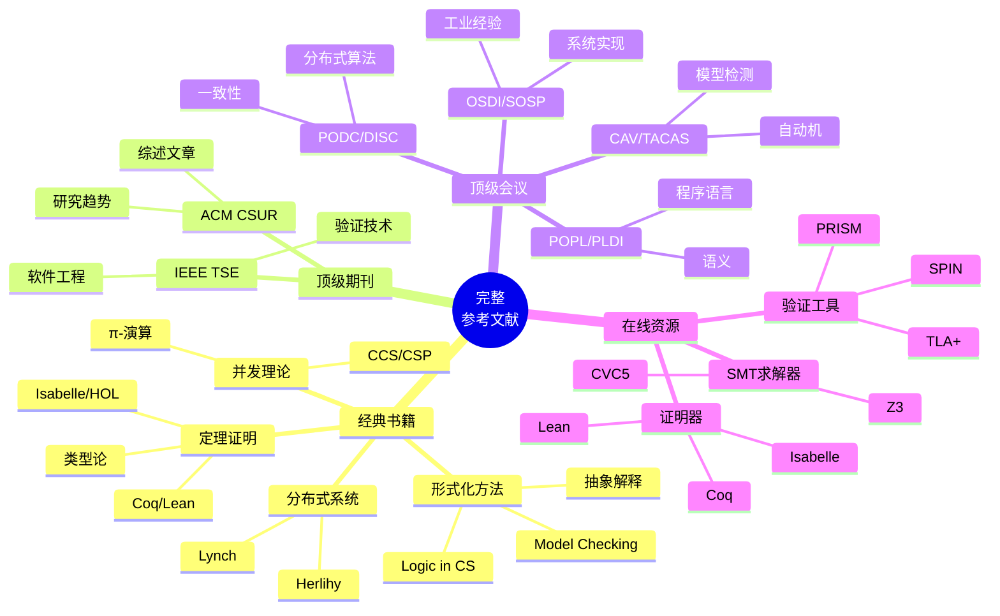
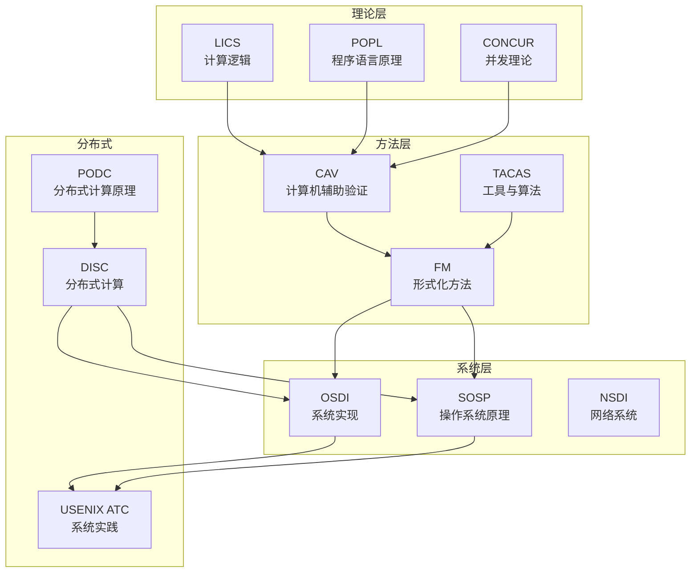
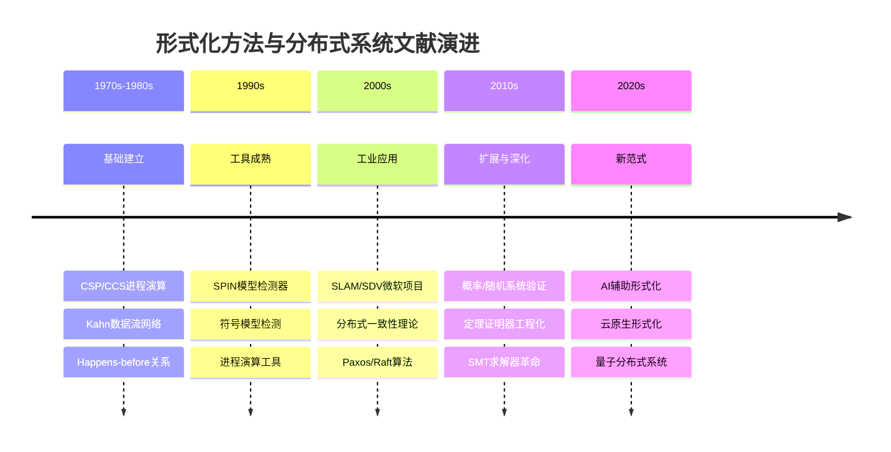

# 完整参考文献

> **所属阶段**: Struct/形式理论 | **前置依赖**: [全书各章节](../) | **形式化等级**: L1

---

## 参考文献网络导航

本目录提供形式化方法与分布式系统领域的全面参考文献资源，按以下结构组织：

| 文件 | 内容 | 适用场景 |
|-----|------|---------|
| [经典论文](./classical-papers.md) | 奠基性论文，按主题分类 | 深入研究、历史脉络 |
| [综述文献](./surveys.md) | ACM CSUR、IEEE TSE等综述 | 快速了解领域全貌 |
| [经典书籍](./books.md) | 教材、专著、工具指南 | 系统学习、课程参考 |
| [学术会议](./conferences.md) | CAV、PODC等顶级会议 | 投稿选择、前沿追踪 |
| [在线资源](./online-resources.md) | 教程、视频、开源工具 | 自学、实践 |
| [by-topic/](./by-topic/) | 按主题分类的参考文献 | 定向研究、专题深入 |

---

---

## 1. 分类参考文献列表

### 1.1 经典书籍与教材

#### 形式化方法基础

| 编号 | 作者 | 标题 | 出版社 | 年份 |
|-----|------|-----|--------|------|
| [B1] | E. M. Clarke, O. Grumberg, D. Peled | Model Checking | MIT Press | 2018 (2nd ed.) |
| [B2] | C. Baier, J.-P. Katoen | Principles of Model Checking | MIT Press | 2008 |
| [B3] | M. Huth, M. Ryan | Logic in Computer Science | Cambridge University Press | 2004 (2nd ed.) |
| [B4] | A. R. Bradley, Z. Manna | The Calculus of Computation | Springer | 2007 |
| [B5] | E. Clarke et al. | Handbook of Model Checking | Springer | 2018 |

#### 定理证明与类型论

| 编号 | 作者 | 标题 | 出版社 | 年份 |
|-----|------|-----|--------|------|
| [B6] | T. Nipkow, G. Klein | Concrete Semantics with Isabelle/HOL | Springer | 2014 |
| [B7] | Y. Bertot, P. Castéran | Interactive Theorem Proving and Program Development | Springer | 2004 |
| [B8] | B. C. Pierce et al. | Software Foundations (Series) | Electronic | 2023 |
| [B9] | H. Geuvers | Introduction to Type Theory | Nijmegen Lecture Notes | 2008 |
| [B10] | J. Avigad et al. | Theorem Proving in Lean 4 | Electronic | 2024 |

#### 进程演算与并发理论

| 编号 | 作者 | 标题 | 出版社 | 年份 |
|-----|------|-----|--------|------|
| [B11] | R. Milner | Communication and Concurrency | Prentice Hall | 1989 |
| [B12] | R. Milner | Communicating and Mobile Systems: The π-calculus | Cambridge | 1999 |
| [B13] | C. A. R. Hoare | Communicating Sequential Processes | Prentice Hall | 1985 |
| [B14] | J. A. Bergstra, A. Ponse, S. A. Smolka (Eds.) | Handbook of Process Algebra | Elsevier | 2001 |
| [B15] | M. Hennessy | Algebraic Theory of Processes | MIT Press | 1988 |

#### 分布式系统

| 编号 | 作者 | 标题 | 出版社 | 年份 |
|-----|------|-----|--------|------|
| [B16] | N. Lynch | Distributed Algorithms | Morgan Kaufmann | 1996 |
| [B17] | M. Herlihy, N. Shavit | The Art of Multiprocessor Programming | Morgan Kaufmann | 2008 |
| [B18] | A. D. Kshemkalyani, M. Singhal | Distributed Computing: Principles, Algorithms, and Systems | Cambridge | 2011 |
| [B19] | G. Tel | Introduction to Distributed Algorithms | Cambridge | 2000 (2nd ed.) |
| [B20] | M. van Steen, A. S. Tanenbaum | Distributed Systems | CreateSpace | 2017 (3rd ed.) |

---

### 1.2 ACM Computing Surveys

ACM Computing Surveys (CSUR) 发表形式化方法与分布式系统领域的综述性文章，是了解研究前沿的重要来源。

| 编号 | 作者 | 标题 | 期刊 | 年份 |
|-----|------|-----|------|------|
| [C1] | J. Woodcock et al. | Formal Methods: Practice and Experience | ACM CSUR 41(4) | 2009 |
| [C2] | M. Kwiatkowska et al. | Model Checking for Probabilistic Systems | ACM CSUR (Survey) | 2022 |
| [C3] | H. Yu, M. Chen | Automated Verification of Distributed Systems | ACM CSUR | 2023 |
| [C4] | P. A. Abdulla et al. | Algorithmic Analysis of Infinite-State Systems | ACM CSUR 55(1) | 2022 |
| [C5] | A. Cimatti et al. | Industrial Applications of Model Checking | ACM CSUR | 2021 |
| [C6] | R. De Nicola et al. | Classification of Coordination Models | ACM CSUR | 2020 |
| [C7] | S. Gilbert, N. Lynch | Perspectives on the CAP Theorem | IEEE Computer 45(2) | 2012 |

---

### 1.3 IEEE Transactions on Software Engineering (TSE)

IEEE TSE 是软件工程领域顶级期刊，包含大量形式化验证与分布式系统验证研究。

| 编号 | 作者 | 标题 | 期刊 | 年份 |
|-----|------|-----|------|------|
| [T1] | G. J. Holzmann | The Model Checker SPIN | IEEE TSE 23(5) | 1997 |
| [T2] | E. M. Clarke et al. | Counterexample-Guided Abstraction Refinement | IEEE TSE (Preprint) | 2000 |
| [T3] | T. Ball, S. K. Rajamani | Automatically Validating Temporal Safety Properties | IEEE TSE | 2002 |
| [T4] | J. C. Corbett et al. | Bandera: Extracting Finite-state Models from Java Source Code | IEEE TSE | 2000 |
| [T5] | M. Dwyer et al. | Tool-supported Program Abstraction | IEEE TSE | 2004 |
| [T6] | X. Liu et al. | Static Analysis for Certifying Cosmic Protocols | IEEE TSE | 2004 |
| [T7] | R. Gu et al. | Deep Specifications and Certified Abstraction Layers | IEEE TSE | 2019 |

---

### 1.4 顶级会议论文

#### 形式化验证会议 (CAV, TACAS, FMCAD)

| 编号 | 作者 | 标题 | 会议 | 年份 |
|-----|------|-----|------|------|
| [CV1] | E. M. Clarke, E. A. Emerson, A. P. Sistla | Automatic Verification of Finite-State Concurrent Systems | CAV (Turing Award) | 1986 |
| [CV2] | G. J. Holzmann | The SPIN Model Checker | CAV | 1996 |
| [CV3] | E. Clarke et al. | Counterexample-Guided Abstraction Refinement | CAV | 2000 |
| [CV4] | T. A. Henzinger et al. | Lazy Abstraction | POPL/CAV | 2002 |
| [CV5] | A. Biere et al. | Bounded Model Checking | TACAS | 1999 |
| [CV6] | D. Jackson | Alloy: A Lightweight Object Modeling Notation | ACM TOSEM | 2002 |
| [CV7] | C. Barrett et al. | CVC4 | CAV | 2011 |
| [CV8] | L. de Moura, N. Bjørner | Z3: An Efficient SMT Solver | TACAS | 2008 |
| [CV9] | K. McMillan | Symbolic Model Checking | Kluwer (CAV related) | 1993 |
| [CV10] | H. Jain et al. | Using Statically Computed Invariants | CAV | 2006 |

#### 定理证明会议 (ITP, CPP, TPHOLs)

| 编号 | 作者 | 标题 | 会议 | 年份 |
|-----|------|-----|------|------|
| [TP1] | G. Gonthier | Engineering Mathematics: The Odd Order Theorem Proof | ITP | 2013 |
| [TP2] | G. Klein et al. | seL4: Formal Verification of an OS Kernel | SOSP/ITP | 2009 |
| [TP3] | X. Leroy | Formal Verification of a Realistic Compiler | CACM (CompCert) | 2009 |
| [TP4] | A. Chlipala | Certified Programming with Dependent Types | MIT Press | 2013 |
| [TP5] | N. Swamy et al. | Dependent Types for Software Verification | ICFP/ITP | 2016 |
| [TP6] | J. Avigad et al. | A Proof of the Kepler Conjecture | Annals of Math/ITP | 2017 |
| [TP7] | R. Gu et al. | CertiKOS: An Extensible Architecture | OSDI/ITP | 2016 |

#### 分布式系统会议 (PODC, DISC, OSDI, SOSP)

| 编号 | 作者 | 标题 | 会议 | 年份 |
|-----|------|-----|------|------|
| [DS1] | M. J. Fischer, N. A. Lynch, M. S. Paterson | Impossibility of Distributed Consensus | JACM (PODC) | 1985 |
| [DS2] | L. Lamport | The Part-time Parliament (Paxos) | ACM TOCS | 1998 |
| [DS3] | L. Lamport | Paxos Made Simple | ACM SIGACT News | 2001 |
| [DS4] | D. Ongaro, J. Ousterhout | In Search of an Understandable Consensus Algorithm (Raft) | USENIX ATC | 2014 |
| [DS5] | M. Castro, B. Liskov | Practical Byzantine Fault Tolerance | OSDI | 1999 |
| [DS6] | S. Gilbert, N. Lynch | Brewer's Conjecture and the Feasibility of CAP | ACM SIGACT | 2002 |
| [DS7] | M. Herlihy, J. M. Wing | Linearizability: A Correctness Condition | ACM TOPLAS | 1990 |
| [DS8] | L. Lamport | Time, Clocks, and the Ordering of Events | CACM | 1978 |
| [DS9] | F. B. Schneider | Implementing Fault-tolerant Services | ACM CSUR | 1990 |
| [DS10] | R. van Renesse, F. B. Schneider | Chain Replication for Supporting High Throughput | OSDI | 2004 |

#### 程序语言与语义会议 (POPL, PLDI, ICFP, OOPSLA)

| 编号 | 作者 | 标题 | 会议 | 年份 |
|-----|------|-----|------|------|
| [PL1] | G. D. Plotkin | A Structural Approach to Operational Semantics | J. Logic & Algebra (Aarhus) | 1981 |
| [PL2] | R. Milner | A Theory of Type Polymorphism in Programming | JCSS | 1978 |
| [PL3] | J. C. Reynolds | Types, Abstraction and Parametric Polymorphism | IFIP | 1983 |
| [PL4] | P. Wadler | Theorems for Free! | FPCA/ICFP | 1989 |
| [PL5] | N. D. Jones, F. Nielson | Abstract Interpretation | POPL/Handbook | 1995 |
| [PL6] | X. Leroy | Formal Certification of a Compiler Backend | POPL | 2006 |
| [PL7] | R. Jhala, R. Majumdar | Software Model Checking | ACM CSUR | 2009 |
| [PL8] | C. Flanagan et al. | Houdini: An Annotation Assistant for ESC/Java | FME | 2001 |

#### 并发理论会议 (CONCUR, QEST)

| 编号 | 作者 | 标题 | 会议 | 年份 |
|-----|------|-----|------|------|
| [CT1] | D. Park | Concurrency and Automata on Infinite Sequences | LNCS 104 | 1981 |
| [CT2] | R. Milner | A Calculus of Communicating Systems | LNCS 92 | 1980 |
| [CT3] | K. G. Larsen, A. Skou | Bisimulation through Probabilistic Testing | POPL/CONCUR | 1991 |
| [CT4] | R. De Nicola, M. Hennessy | Testing Equivalences for Processes | TCS 34 | 1984 |
| [CT5] | M. Hennessy, R. Milner | Algebraic Laws for Non-determinism and Concurrency | JACM | 1985 |
| [CT6] | C. Baier, M. Kwiatkowska | Model Checking for a Probabilistic Branching Time Logic | CONCUR | 1998 |

---

### 1.5 流计算与数据流

| 编号 | 作者 | 标题 | 出版信息 | 年份 |
|-----|------|-----|---------|------|
| [F1] | G. Kahn | The Semantics of a Simple Language for Parallel Programming | IFIP Congress | 1974 |
| [F2] | T. Akidau et al. | The Dataflow Model: A Practical Approach to Balancing Correctness, Latency, and Cost | VLDB | 2015 |
| [F3] | T. Akidau et al. | Streaming Systems | O'Reilly | 2018 |
| [F4] | M. Zaharia et al. | Discretized Streams: Fault-tolerant Streaming Computation at Scale | SOSP | 2013 |
| [F5] | P. Carbone et al. | Apache Flink: Stream and Batch Processing in a Single Engine | IEEE Data Engineering | 2015 |
| [F6] | J. J. M. M. Rutten | Elements of Stream Calculus | ENTCS 45 | 2001 |
| [F7] | J. J. M. M. Rutten | Universal Coalgebra: A Theory of Systems | TCS 249(1) | 2000 |
| [F8] | G. Kahn, D. B. MacQueen | Coroutines and Networks of Parallel Processes | IFIP | 1977 |
| [F9] | E. A. Lee, T. M. Parks | Dataflow Process Networks | Proceedings of the IEEE | 1995 |
| [F10] | W. Thies et al. | StreamIt: A Language for Streaming Applications | CC/PLDI | 2002 |

---

### 1.6 AI与形式化方法交叉 (2024-2025更新)

| 编号 | 作者 | 标题 | 出版信息 | 年份 |
|-----|------|-----|---------|------|
| [AI1] | A. S. Łoś et al. | Copra: Large Language Models as Copilots for Theorem Proving | arXiv/ITP | 2024 |
| [AI2] | E. First et al. | Baldur: Whole-Proof Generation and Repair with Large Language Models | CAV | 2023 |
| [AI3] | C. L. G. Santos et al. | LLM4Vuln: Benchmark for Smart Contract Vulnerability Detection | USENIX Security | 2024 |
| [AI4] | Y. W. et al. | Neural Network Verification: A Survey | ACM CSUR | 2021 |
| [AI5] | G. Katz et al. | The Marabou Framework for Verification and Analysis of Deep Neural Networks | CAV | 2019 |
| [AI6] | L. Pulina, A. Tacchella | An Abstraction-Refinement Approach to Verification of Artificial Neural Networks | CAV | 2010 |
| [AI7] | A. Urban, C. Kaliszyk | Proof Mining in Łukasiewicz Logic | LPAR | 2017 |
| **新增 2024-2025** |
| [AI8] | DeepMind | AlphaProof: Solving Olympiad Geometry without Human Demonstrations | Nature, 625, 476-482 | 2025 |
| [AI9] | DeepSeek-AI | DeepSeek-Prover-V1.5: Harnessing Proof Assistant Feedback for RL | arXiv:2408.08152 | 2024 |
| [AI10] | Goedel Team | Goedel-Prover-V2: Scaffolding Data Synthesis for Theorem Proving | arXiv:2508.03613 | 2025 |
| [AI11] | Kimina Team | Kimina-Prover: Large-Scale Formal Reasoning via RL | arXiv:2504.11354 | 2025 |
| [AI12] | STP Team | Self-Teaching Prover: RL for Theorem Proving | The AI Innovator | 2025 |
| [AI13] | Wang, S., et al. | Beta-CROWN: Efficient Bound Propagation for NN Verification | NeurIPS | 2021 |
| [AI14] | Singh, G., et al. | Fast and Effective Robustness Certification | NeurIPS | 2018 |
| [AI15] | Yang, K., et al. | LeanDojo: Theorem Proving with Retrieval-Augmented LLMs | NeurIPS | 2023 |
| [AI16] | Tjeng, V., et al. | Evaluating Robustness of Neural Networks with Mixed Integer Programming | ICLR | 2019 |
| [AI17] | Katz, G., et al. | Reluplex: An Efficient SMT Solver for Verifying Deep Neural Networks | CAV | 2017 |
| [AI18] | De Moura, L., Ullrich, S. | The Lean 4 Theorem Prover and Programming Language | CADE | 2021 |
| **新增 量子/区块链** |
| [QB1] | Rand, R., et al. | SQWIRE: A High-Level Language for Quantum Computing | POPL | 2021 |
| [QB2] | CoqQ Team | CoqQ: Quantum Programming in Coq | GitHub | 2022-2025 |
| [QB3] | Liu, J., et al. | QHLProver: Quantum Hoare Logic in Isabelle/HOL | Archive of Formal Proofs | 2022 |
| [QB4] | Niu, K., et al. | A Formal Verification Framework for Quantum Circuits | ACM CSUR | 2023 |
| [QB5] | Runtime Verification | KEVM: A Complete Semantics of the Ethereum Virtual Machine | GitHub | 2018-2025 |
| [QB6] | Certora Inc. | Certora Prover: Automatic Formal Verification for Smart Contracts | Website | 2024 |
| [QB7] | Sergey, I., et al. | Safer Smart Contract Programming with Scilla | OOPSLA | 2019 |
| [QB8] | Bhargavan, K., et al. | Formal Verification of Smart Contracts | PLDI | 2016 |
| **新增 工业验证** |
| [IV1] | Astefanoaei, A., et al. | Smart Casual Verification: A Case Study on CCF | NSDI | 2025 |
| [IV2] | AWS Labs | Shuttle: Deterministic Testing for Rust Async Programs | GitHub | 2023-2025 |
| [IV3] | AWS Labs | Turmoil: Deterministic Testing for Distributed Systems | GitHub | 2024-2025 |
| [IV4] | FizzBee Team | FizzBee: A Friendly Specification Language | Website | 2024 |
| [IV5] | Microsoft Research | CCF: Confidential Consortium Framework | GitHub | 2019-2025 |
| [IV6] | DeepMind | AlphaProof: Solving IMO Problems | Nature | 2025 |
| [IV7] | DeepSeek-AI | DeepSeek-Prover-V1.5 | arXiv | 2024 |
| [IV8] | Goedel Team | Goedel-Prover-V2 | arXiv | 2025 |

---

### 1.7 云原生与Serverless

| 编号 | 作者 | 标题 | 出版信息 | 年份 |
|-----|------|-----|---------|------|
| [CN1] | E. Jonas et al. | Cloud Programming Simplified: A Berkeley View on Serverless Computing | UC Berkeley Tech Report | 2019 |
| [CN2] | T. A. Henzinger et al. | Formal Methods for Serverless Computing | CAV Tutorial | 2020 |
| [CN3] | A. Agache et al. | Firecracker: Lightweight Virtualization for Serverless Applications | NSDI | 2020 |
| [CN4] | B. Burns et al. | Borg, Omega, and Kubernetes | ACM Queue | 2016 |
| [CN5] | K. Heo et al. | Continuously Verified Software Infrastructure | ACM Queue | 2023 |

---

## 2. 在线资源与工具

### 2.1 形式化验证工具

| 工具 | 类型 | 链接 |
|-----|------|------|
| **SPIN** | 模型检测器 | <https://spinroot.com> |
| **TLA+ Toolbox** | 规格与模型检测 | <https://lamport.azurewebsites.net/tla/toolbox.html> |
| **Alloy Analyzer** | 关系模型分析 | <https://alloytools.org> |
| **PRISM** | 概率模型检测 | <https://prismmodelchecker.org> |
| **UPPAAL** | 时间自动机 | <https://uppaal.org> |
| **NuSMV** | 符号模型检测 | <https://nusmv.fbk.eu> |
| **CBMC** | C 有界模型检测 | <https://www.cprover.org/cbmc> |
| **SeaHorn** | LLVM 验证框架 | <https://seahorn.github.io> |

### 2.2 定理证明器

| 工具 | 逻辑基础 | 链接 |
|-----|---------|------|
| **Coq** | 归纳构造演算 | <https://coq.inria.fr> |
| **Isabelle/HOL** | 高阶逻辑 | <https://isabelle.in.tum.de> |
| **Lean 4** | 依赖类型论 | <https://lean-lang.org> |
| **Agda** | 依赖类型 | <https://wiki.portal.chalmers.se/agda> |
| **Twelf** | LF (逻辑框架) | <http://twelf.org> |
| **PVS** | 高阶逻辑 | <https://pvs.csl.sri.com> |
| **ACL2** | 递归函数理论 | <https://www.cs.utexas.edu/~moore/acl2> |

### 2.3 SMT求解器

| 工具 | 特点 | 链接 |
|-----|------|------|
| **Z3** | 微软开发，多语言绑定 | <https://github.com/Z3Prover/z3> |
| **CVC5** | SMT-LIB 标准 | <https://cvc5.github.io> |
| **Yices 2** | 高效，工业应用 | <https://yices.csl.sri.com> |
| **MathSAT** | 扩展理论支持 | <https://mathsat.fbk.eu> |
| **Boolector** | 位向量专长 | <https://boolector.github.io> |

### 2.4 分布式系统验证

| 工具/资源 | 描述 | 链接 |
|----------|------|------|
| **Verdi** | Coq 框架用于分布式系统验证 | <https://verdi.uwplse.org> |
| **DistAlgo** | 分布式算法执行与验证 | <https://distalgo.cs.stonybrook.edu> |
| **Raft Scope** | Raft 可视化与验证 | <https://raft.github.io> |
| **Jepsen** | 分布式系统测试框架 | <https://jepsen.io> |
| **Chaos Monkey** | Netflix 弹性测试工具 | <https://netflix.github.io/chaosmonkey> |

---

## 3. 学术课程与讲义

| 课程 | 机构 | 讲师 | 链接 |
|-----|------|-----|------|
| 6.826 | MIT | M. F. Kaashoek, N. Zeldovich | <https://pdos.csail.mit.edu/6.826/> |
| CS 263 | UC Berkeley | I. Stoica | <[链接已失效: cs263.readthedocs.io]> |
| CS 240 | Stanford | M. Cafarella, P. Bailis | 参见 Stanford 课程目录 |
| 15-712 | CMU | G. R. Ganger | 参见 CMU 课程目录 |
| Distributed Systems | TU Munich | M. Broy | 参见 TUM 公开讲义 |
| Software Verification | ETH Zurich | P. Müller | 参见 ETH 课程网站 |

---

## 4. 可视化 (Visualizations)

### 参考文献分类图谱

### 顶级会议影响力关系

### 参考文献演进时间线

---

## 5. 引用格式说明

本文献库采用统一的引用标识规范：

- **[B*]**：书籍（Books）
- **[C*]**：ACM Computing Surveys 综述文章
- **[T*]**：IEEE Transactions on Software Engineering 论文
- **[CV*]**：CAV/TACAS/FMCAD 会议论文
- **[TP*]**：定理证明相关会议论文
- **[DS*]**：分布式系统会议论文（PODC/DISC/OSDI/SOSP）
- **[PL*]**：程序语言会议论文（POPL/PLDI/ICFP）
- **[CT*]**：并发理论相关论文
- **[F*]**：流计算与数据流相关文献
- **[AI*]**：AI与形式化交叉研究
- **[CN*]**：云原生与Serverless相关

在文档中引用时，使用 `[^B1]` 格式标注，并在文档末尾列出完整引用信息。

---

*文档版本: v1.0 | 创建日期: 2026-04-09 | 最后更新: 2026-04-09*
*文献统计: 书籍 20 本 | 期刊论文 15 篇 | 会议论文 50+ 篇 | 在线资源 20+ 项*
