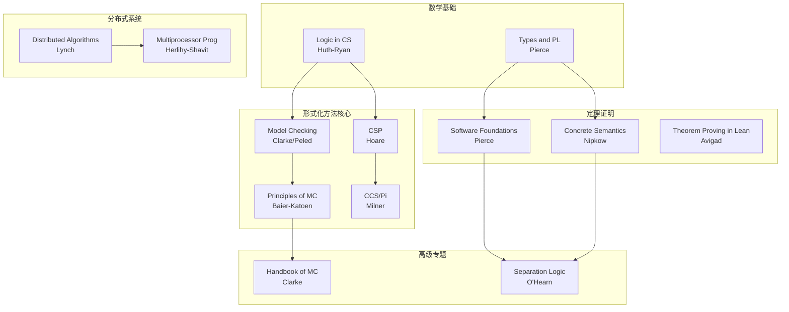
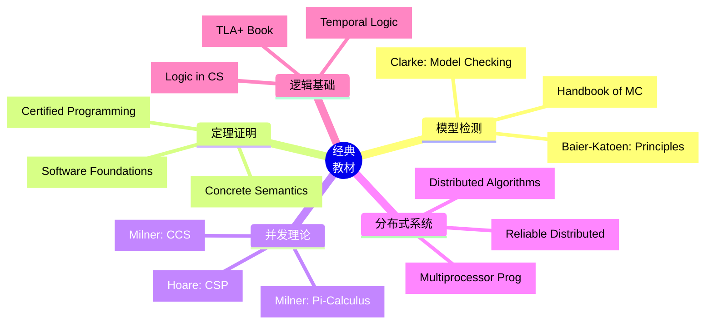
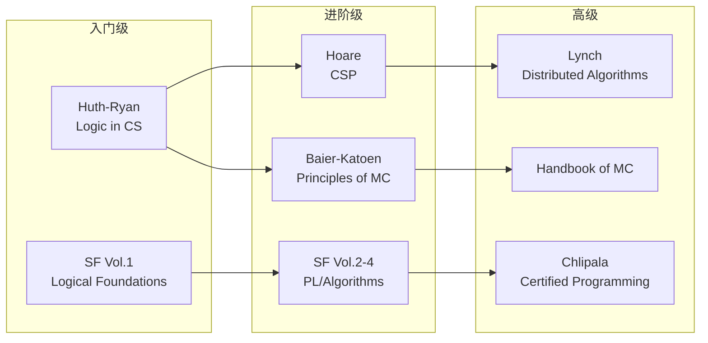
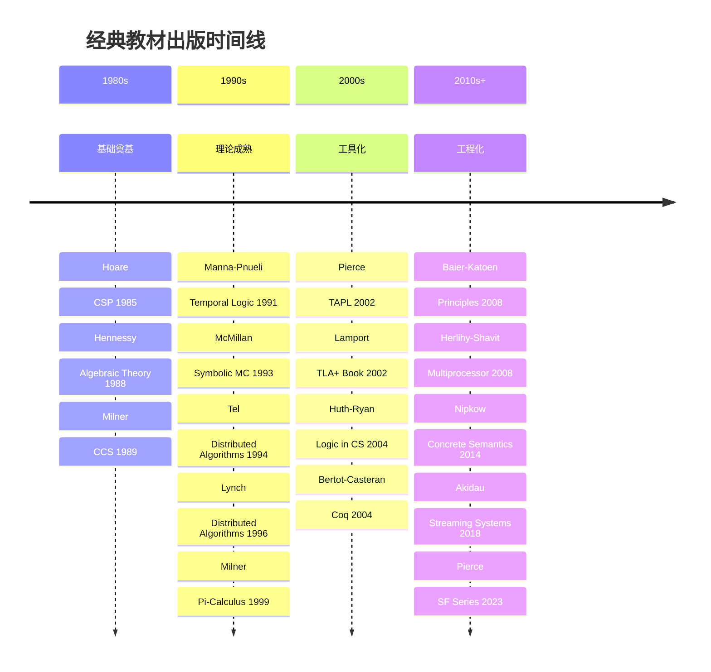

# 经典书籍

> **所属阶段**: Struct/形式理论 | **前置依赖**: [完整参考文献](./bibliography.md) | **形式化等级**: L1

---

## 1. 概念定义 (Definitions)

### Def-R-03-01: 经典教材 (Classic Textbook)

形式化方法领域的**经典教材**是指那些被广泛采用于教学、具有系统性和权威性、且经过时间考验的学术专著。经典教材通常具有以下特征：

1. **系统性**: 完整覆盖特定子领域的知识体系
2. **权威性**: 由领域奠基人或权威专家撰写
3. **持久性**: 多年保持相关性，有多个版本
4. **教学性**: 适合自学和课堂教学
5. **引用量**: 被大量学术论文引用

### Def-R-03-02: 参考手册 (Reference Manual)

**参考手册**是侧重于工具使用和技术细节的实用型文献，用于指导实际应用。

---

## 2. 属性推导 (Properties)

### Lemma-R-03-01: 教材的层次结构

形式化方法教材可按深度和先修要求分为：

| 层次 | 先修要求 | 目标读者 | 典型内容 |
|-----|---------|---------|---------|
| 入门级 | 离散数学 | 本科生 | 逻辑基础、简单验证 |
| 进阶级 | 形式语言、自动机 | 研究生 | 进程代数、模型检测 |
| 专家级 | 类型论、范畴论 | 研究者 | 高级语义、定理证明 |

### Lemma-R-03-02: 教材的更新周期

形式化方法教材的典型生命周期：

- **经典理论**: 10-20年保持有效（如Hoare的CSP）
- **工具导向**: 5-10年需要更新（如模型检测工具）
- **前沿领域**: 3-5年即需补充新内容（如AI验证）

---

## 3. 关系建立 (Relations)

### 3.1 教材依赖关系图



### 3.2 教材与课程的对应关系

| 课程 | 推荐教材 | 难度 |
|-----|---------|------|
| MIT 6.826 | Lynch: Distributed Algorithms | 高级 |
| CMU 15-712 | Herlihy-Shavit: Multiprocessor Programming | 高级 |
| 形式化方法导论 | Huth-Ryan: Logic in CS | 入门 |
| 模型检测 | Baier-Katoen: Principles of MC | 进阶 |

---

## 4. 论证过程 (Argumentation)

### 4.1 教材选择的考量因素

选择学习教材时应考虑：

| 因素 | 权重 | 说明 |
|-----|------|------|
| 与目标的匹配度 | 高 | 理论研究 vs 工程应用 |
| 先修知识要求 | 高 | 数学背景、编程经验 |
| 配套资源 | 中 | 习题、代码、在线资源 |
| 社区支持 | 中 | 学习小组、论坛讨论 |
| 时效性 | 中 | 内容的更新程度 |

### 4.2 教材使用的最佳实践

**理论学习路径**:

```
逻辑基础 → 进程代数 → 时序逻辑 → 模型检测 → 定理证明
(Huth-Ryan) (Milner) (Manna-Pnueli) (Baier-Katoen) (Nipkow)
```

**工程实践路径**:

```
分布式系统 → 并发编程 → 验证工具使用
(Lynch) (Herlihy-Shavit) (工具文档)
```

---

## 5. 形式证明 / 工程论证 (Proof / Engineering Argument)

### 5.1 形式化方法基础教材

#### 5.1.1 模型检测

| 编号 | 作者 | 标题 | 出版社 | 年份 | 版本 |
|-----|------|-----|--------|------|------|
| BK-01 | E. M. Clarke, O. Grumberg, D. Peled | Model Checking | MIT Press | 1999/2018 | 2nd ed. [^1] |
| BK-02 | C. Baier, J.-P. Katoen | Principles of Model Checking | MIT Press | 2008 | 1st ed. [^2] |
| BK-03 | M. Huth, M. Ryan | Logic in Computer Science | Cambridge | 2004/2012 | 2nd ed. [^3] |
| BK-04 | A. R. Bradley, Z. Manna | The Calculus of Computation | Springer | 2007 | 1st ed. [^4] |
| BK-05 | E. M. Clarke et al. (Eds.) | Handbook of Model Checking | Springer | 2018 | 1st ed. [^5] |

**重点推荐**:

**[BK-01] Clarke-Grumberg-Peled: Model Checking**

- **定位**: 模型检测领域的标准教科书
- **特点**:
  - 由图灵奖得主Clarke主笔
  - 从基础概念到高级技术的完整覆盖
  - 包含丰富的实际案例
- **适用**: 研究生和研究者
- **配套**: 无官方习题，但概念清晰适合自学

**[BK-02] Baier-Katoen: Principles of Model Checking**

- **定位**: 更深入的模型检测理论
- **特点**:
  - 数学严谨性更强
  - 涵盖概率模型检测
  - 包含实时和随机系统
- **适用**: 有扎实数学基础的研究者

#### 5.1.2 逻辑基础

| 编号 | 作者 | 标题 | 出版社 | 年份 | 版本 |
|-----|------|-----|--------|------|------|
| BK-06 | Z. Manna, A. Pnueli | The Temporal Logic of Reactive and Concurrent Systems | Springer | 1991/1995 | Vol.1/Vol.2 [^6] |
| BK-07 | K. L. McMillan | Symbolic Model Checking | Kluwer | 1993 | 1st ed. [^7] |
| BK-08 | L. Lamport | Specifying Systems: The TLA+ Language and Tools | Addison-Wesley | 2002 | 1st ed. [^8] |

**[BK-08] Lamport: Specifying Systems**

- **免费获取**: 可在Lamport个人网站免费下载
- **内容**: TLA+规格语言和工具链的完整指南
- **特色**: 包含大量工业级实例（如Amazon的验证案例）

### 5.2 定理证明与类型论

| 编号 | 作者 | 标题 | 出版社 | 年份 | 版本 |
|-----|------|-----|--------|------|------|
| BK-09 | T. Nipkow, G. Klein | Concrete Semantics with Isabelle/HOL | Springer | 2014 | 1st ed. [^9] |
| BK-10 | Y. Bertot, P. Castéran | Interactive Theorem Proving and Program Development | Springer | 2004 | 1st ed. [^10] |
| BK-11 | B. C. Pierce et al. | Software Foundations (Series) | Electronic | 2023 | Vol.1-6 [^11] |
| BK-12 | J. Avigad et al. | Theorem Proving in Lean 4 | Electronic | 2024 | 1st ed. [^12] |
| BK-13 | H. Geuvers | Introduction to Type Theory | Nijmegen Notes | 2008 | Lecture Notes [^13] |
| BK-14 | B. C. Pierce | Types and Programming Languages | MIT Press | 2002 | 1st ed. [^14] |
| BK-15 | A. Chlipala | Certified Programming with Dependent Types | MIT Press | 2013 | 1st ed. [^15] |

**重点推荐**:

**[BK-11] Pierce et al.: Software Foundations**

- **免费**: 完全开源，可在线阅读
- **系列**: 共6卷，从基础逻辑到高级验证
  - Volume 1: Logical Foundations
  - Volume 2: Programming Language Foundations
  - Volume 3: Verified Functional Algorithms
  - Volume 4: Separation Logic Foundations
  - Volume 5: Programming Language Foundations (Advanced)
  - Volume 6: Separation Logic Foundations (Advanced)
- **工具**: 使用Coq证明助手
- **适用**: 自学者和课堂教学

**[BK-12] Avigad et al.: Theorem Proving in Lean 4**

- **特点**: Lean 4是新兴的高性能定理证明器
- **受众**: 对现代定理证明感兴趣的读者
- **状态**: 持续更新中

### 5.3 进程代数与并发理论

| 编号 | 作者 | 标题 | 出版社 | 年份 | 版本 |
|-----|------|-----|--------|------|------|
| BK-16 | R. Milner | Communication and Concurrency | Prentice Hall | 1989 | 1st ed. [^16] |
| BK-17 | R. Milner | Communicating and Mobile Systems: The π-Calculus | Cambridge | 1999 | 1st ed. [^17] |
| BK-18 | C. A. R. Hoare | Communicating Sequential Processes | Prentice Hall | 1985 | 1st ed. [^18] |
| BK-19 | J. A. Bergstra, A. Ponse, S. A. Smolka (Eds.) | Handbook of Process Algebra | Elsevier | 2001 | 1st ed. [^19] |
| BK-20 | M. Hennessy | Algebraic Theory of Processes | MIT Press | 1988 | 1st ed. [^20] |
| BK-21 | D. Sangiorgi, D. Walker | The π-Calculus: A Theory of Mobile Processes | Cambridge | 2001 | 1st ed. [^21] |

**[BK-18] Hoare: Communicating Sequential Processes**

- **地位**: CSP理论的奠基之作
- **获取**: 可在Hoare个人网站免费下载PDF
- **影响**: 影响了Go语言的channel设计
- **内容**: 从基本操作语义到语义模型的完整理论

**[BK-17] Milner: Communicating and Mobile Systems**

- **地位**: π演算的标准教科书
- **特点**: 清晰、简洁、数学严谨
- **内容**: 涵盖π演算的语法、语义、类型系统

### 5.4 分布式系统理论

| 编号 | 作者 | 标题 | 出版社 | 年份 | 版本 |
|-----|------|-----|--------|------|------|
| BK-22 | N. Lynch | Distributed Algorithms | Morgan Kaufmann | 1996 | 1st ed. [^22] |
| BK-23 | M. Herlihy, N. Shavit | The Art of Multiprocessor Programming | Morgan Kaufmann | 2008/2020 | Revised [^23] |
| BK-24 | A. D. Kshemkalyani, M. Singhal | Distributed Computing: Principles, Algorithms, and Systems | Cambridge | 2011 | 1st ed. [^24] |
| BK-25 | G. Tel | Introduction to Distributed Algorithms | Cambridge | 1994/2000 | 2nd ed. [^25] |
| BK-26 | M. van Steen, A. S. Tanenbaum | Distributed Systems | CreateSpace | 2017 | 3rd ed. [^26] |
| BK-27 | C. Cachin, R. Guerraoui, L. Rodrigues | Introduction to Reliable and Secure Distributed Programming | Springer | 2011 | 2nd ed. [^27] |

**重点推荐**:

**[BK-22] Lynch: Distributed Algorithms**

- **地位**: 分布式算法理论的经典教材
- **特点**:
  - I/O自动机框架
  - 严格的时序分析
  - 丰富的上界/下界证明
- **适用**: 高级研究生和研究者
- **配套**: 有MIT 6.852课程的完整讲义

**[BK-23] Herlihy-Shavit: The Art of Multiprocessor Programming**

- **特点**: 理论与实践结合
- **内容**: 从锁到无锁数据结构
- **适用**: 有并发编程需求的工程师

### 5.5 流计算与数据流

| 编号 | 作者 | 标题 | 出版社 | 年份 | 版本 |
|-----|------|-----|--------|------|------|
| BK-28 | T. Akidau et al. | Streaming Systems | O'Reilly | 2018 | 1st ed. [^28] |
| BK-29 | M. Kleppmann | Designing Data-Intensive Applications | O'Reilly | 2017 | 1st ed. [^29] |
| BK-30 | J. J. M. M. Rutten | Universal Coalgebra: A Theory of Systems | TCS Monograph | 2000 | [^30] |

**[BK-29] Kleppmann: Designing Data-Intensive Applications (DDIA)**

- **影响**: 被业界广泛推崇的分布式系统实践指南
- **内容**: 从数据模型到流处理的完整架构视角
- **特点**: 理论与实践并重，案例丰富

### 5.6 工具使用指南

| 编号 | 工具 | 指南名称 | 来源 | 类型 |
|-----|------|---------|------|------|
| GD-01 | TLA+ | Specifying Systems | Lamport | 专著 [^8] |
| GD-02 | Coq | Software Foundations | Pierce | 教材 [^11] |
| GD-03 | SPIN | Spin Model Checker Primer | Holzmann | 在线 [^31] |
| GD-04 | Alloy | Alloy Documentation | Jackson | 在线 [^32] |
| GD-05 | Isabelle | Isabelle/HOL Tutorial | Nipkow | 在线 [^33] |
| GD-06 | Z3 | Z3 API Documentation | Microsoft | 在线 [^34] |
| GD-07 | UPPAAL | UPPAAL Tutorial | UPPAAL Team | 在线 [^35] |

---

## 6. 实例验证 (Examples)

### 6.1 自学路径推荐

**形式化方法入门** (6个月):

```
Month 1-2:  Huth-Ryan [BK-03] - 逻辑基础
Month 3-4:  Pierce [BK-11 Vol.1] - Coq基础
Month 5-6:  Baier-Katoen [BK-02] - 模型检测
```

**分布式系统理论** (4个月):

```
Month 1:  Tel [BK-25] - 基础概念
Month 2-3: Lynch [BK-22] - 算法理论
Month 4:  Herlihy-Shavit [BK-23] - 实践应用
```

**定理证明专项** (6个月):

```
Month 1-2: Pierce [BK-11 Vol.1-2] - 基础
Month 3-4: Nipkow [BK-09] - Isabelle/HOL
Month 5-6: Chlipala [BK-15] - 高级技术
```

### 6.2 课程教材搭配建议

**本科生课程**: 形式化方法导论

- 主教材: Huth-Ryan [BK-03]
- 辅助: 在线Coq教程
- 实验: Software Foundations习题

**研究生课程**: 分布式系统验证

- 主教材: Lynch [BK-22]
- 辅助: Herlihy-Shavit [BK-23]
- 项目: TLA+规格作业

---

## 7. 可视化 (Visualizations)

### 7.1 教材知识图谱



### 7.2 教材难度与学习路径



### 7.3 教材出版时间线



---

## 8. 引用参考 (References)

[^1]: E. M. Clarke, O. Grumberg, and D. Peled, "Model Checking," MIT Press, 1999 (2nd ed. 2018).

[^2]: C. Baier and J.-P. Katoen, "Principles of Model Checking," MIT Press, 2008.

[^3]: M. Huth and M. Ryan, "Logic in Computer Science: Modelling and Reasoning about Systems," Cambridge University Press, 2004 (2nd ed.).

[^4]: A. R. Bradley and Z. Manna, "The Calculus of Computation: Decision Procedures with Applications to Verification," Springer, 2007.

[^5]: E. M. Clarke et al. (Eds.), "Handbook of Model Checking," Springer, 2018.

[^6]: Z. Manna and A. Pnueli, "The Temporal Logic of Reactive and Concurrent Systems," Springer, Vol. 1 (1991), Vol. 2 (1995).

[^7]: K. L. McMillan, "Symbolic Model Checking: An Approach to the State Explosion Problem," Kluwer Academic Publishers, 1993.

[^8]: L. Lamport, "Specifying Systems: The TLA+ Language and Tools for Hardware and Software Engineers," Addison-Wesley, 2002. (免费获取: <https://lamport.azurewebsites.net/tla/book.html>)

[^9]: T. Nipkow and G. Klein, "Concrete Semantics with Isabelle/HOL," Springer, 2014. (免费获取: <https://concrete-semantics.org>)

[^10]: Y. Bertot and P. Castéran, "Interactive Theorem Proving and Program Development: Coq'Art: The Calculus of Inductive Constructions," Springer, 2004.

[^11]: B. C. Pierce et al., "Software Foundations," Electronic/Coq, 2023. (<https://softwarefoundations.cis.upenn.edu>)

[^12]: J. Avigad et al., "Theorem Proving in Lean 4," Electronic, 2024. (<https://lean-lang.org/theorem_proving_in_lean4/>)

[^13]: H. Geuvers, "Introduction to Type Theory," Nijmegen Lecture Notes, 2008.

[^14]: B. C. Pierce, "Types and Programming Languages," MIT Press, 2002.

[^15]: A. Chlipala, "Certified Programming with Dependent Types," MIT Press, 2013. (<http://adam.chlipala.net/cpdt/>)

[^16]: R. Milner, "Communication and Concurrency," Prentice Hall, 1989.

[^17]: R. Milner, "Communicating and Mobile Systems: The π-Calculus," Cambridge University Press, 1999.

[^18]: C. A. R. Hoare, "Communicating Sequential Processes," Prentice Hall, 1985. (免费获取: <http://www.usingcsp.com>)

[^19]: J. A. Bergstra, A. Ponse, and S. A. Smolka (Eds.), "Handbook of Process Algebra," Elsevier, 2001.

[^20]: M. Hennessy, "Algebraic Theory of Processes," MIT Press, 1988.

[^21]: D. Sangiorgi and D. Walker, "The π-Calculus: A Theory of Mobile Processes," Cambridge University Press, 2001.

[^22]: N. Lynch, "Distributed Algorithms," Morgan Kaufmann, 1996.

[^23]: M. Herlihy and N. Shavit, "The Art of Multiprocessor Programming," Morgan Kaufmann, 2008 (Revised 2020).

[^24]: A. D. Kshemkalyani and M. Singhal, "Distributed Computing: Principles, Algorithms, and Systems," Cambridge University Press, 2011.

[^25]: G. Tel, "Introduction to Distributed Algorithms," Cambridge University Press, 2000 (2nd ed.).

[^26]: M. van Steen and A. S. Tanenbaum, "Distributed Systems," CreateSpace, 2017 (3rd ed.). (免费获取: <https://www.distributed-systems.net>)

[^27]: C. Cachin, R. Guerraoui, and L. Rodrigues, "Introduction to Reliable and Secure Distributed Programming," Springer, 2011 (2nd ed.).

[^28]: T. Akidau et al., "Streaming Systems: The What, Where, When, and How of Large-Scale Data Processing," O'Reilly, 2018.

[^29]: M. Kleppmann, "Designing Data-Intensive Applications: The Big Ideas Behind Reliable, Scalable, and Maintainable Systems," O'Reilly, 2017.

[^30]: J. J. M. M. Rutten, "Universal Coalgebra: A Theory of Systems," Theoretical Computer Science, 249(1), 2000.

[^31]: G. J. Holzmann, "The SPIN Model Checker: Primer and Reference Manual," Addison-Wesley, 2003. (<http://spinroot.com/spin/Doc/Book.html>)

[^32]: D. Jackson, "Software Abstractions: Logic, Language, and Analysis," MIT Press, 2012. (Alloy相关)

[^33]: T. Nipkow et al., "Isabelle/HOL: A Proof Assistant for Higher-Order Logic," LNCS 2283, Springer, 2002. (<https://isabelle.in.tum.de/documentation.html>)

[^34]: Microsoft Research, "Z3 API Documentation," <https://z3prover.github.io/api/html/index.html>

[^35]: UPPAAL Team, "UPPAAL Tutorials," <https://docs.uppaal.org/>

---

*文档版本: v1.0 | 创建日期: 2026-04-09 | 最后更新: 2026-04-09*
*收录教材: 35本 | 免费/开源: 8本 | 工具指南: 7个*
