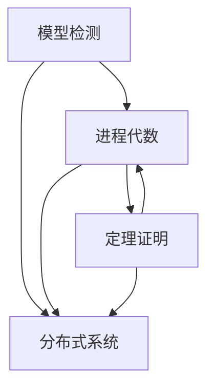

# by-topic: 按主题分类的参考文献

> **所属阶段**: Struct/形式理论 | **前置依赖**: [完整参考文献](../bibliography.md) | **形式化等级**: L1

---

## 主题分类概览

本目录按研究方向对形式化方法领域的文献进行分类整理，便于研究者快速定位特定主题的参考文献。

### 分类目录

| 文件 | 主题 | 核心内容 |
|-----|------|---------|
| [model-checking.md](./model-checking.md) | 模型检测 | 算法、工具、会议、教材 |
| [theorem-proving.md](./theorem-proving.md) | 定理证明 | 证明助手、里程碑项目 |
| [process-algebra.md](./process-algebra.md) | 进程代数 | CSP/CCS/π演算 |
| [distributed-systems.md](./distributed-systems.md) | 分布式系统 | 一致性、共识、形式化 |

---

## 使用指南

### 选择合适主题

- **模型检测**: 关注自动验证、状态空间探索、反例生成
- **定理证明**: 关注严格数学证明、无限状态系统、证明助手
- **进程代数**: 关注并发理论、进程组合、行为等价
- **分布式系统**: 关注一致性、容错、分布式算法

### 交叉引用

主题之间存在紧密联系：

---

## 待扩展主题

未来计划增加的主题分类：

- [ ] 时序逻辑与规格语言
- [ ] SMT求解与约束求解
- [ ] 类型理论
- [ ] 程序分析与抽象解释
- [ ] 概率与随机系统
- [ ] 实时与嵌入式系统
- [ ] 安全与隐私
- [ ] AI/神经网络验证
- [ ] 量子计算形式化

---

## 8. 引用参考

本目录内容基于以下权威资源整理：

- [完整参考文献](../bibliography.md)
- [经典论文](../classical-papers.md)
- [经典书籍](../books.md)
- [学术会议](../conferences.md)

---

*文档版本: v1.0 | 创建日期: 2026-04-09*
