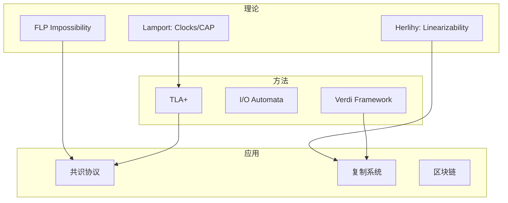
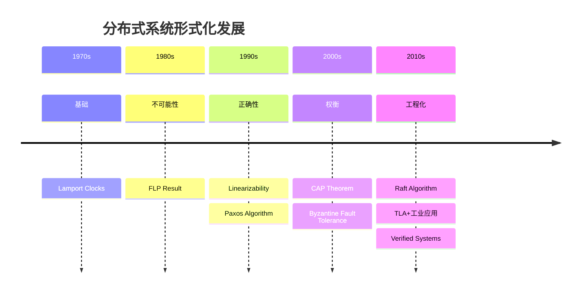

# 按主题分类：分布式系统

> **所属阶段**: Struct/形式理论 | **前置依赖**: [完整参考文献](../bibliography.md) | **形式化等级**: L1

---

## 1. 概念定义 (Definitions)

### Def-R-T04-01: 分布式系统形式化

**分布式系统的形式化方法**是指使用严格的数学模型和逻辑来描述、分析和验证分布式系统的行为，特别关注：

- **一致性**: 系统状态的协调
- **容错**: 故障情况下的正确性
- **时序**: 事件顺序和因果性
- **活性**: 系统进展保证

---

## 2. 属性推导 (Properties)

### Lemma-R-T04-01: 分布式系统形式化技术分类

| 技术 | 适用问题 | 代表工具 |
|-----|---------|---------|
| I/O自动机 | 算法正确性 | IOA Toolkit |
| TLA+ | 规格与验证 | TLC/TLAPS |
| 进程演算 | 协议验证 | FSP/LTSA |
| 时序逻辑 | 性质规约 | Temporal Logic |

---

## 3. 关系建立 (Relations)

### 3.1 分布式形式化技术图谱



---

## 4. 论证过程 (Argumentation)

### 4.1 一致性层次

| 一致性级别 | 强度 | 可用性 | 典型应用 |
|-----------|------|-------|---------|
| 线性一致性 | 最强 | 低 | 分布式锁 |
| 顺序一致性 | 强 | 中 | 数据库 |
| 因果一致性 | 中等 | 高 | 社交网络 |
| 最终一致性 | 最弱 | 最高 | CDN/DNS |

---

## 5. 形式证明 / 工程论证 (Proof / Engineering Argument)

### 5.1 经典论文

| 编号 | 作者 | 标题 | 年份 | 影响 |
|-----|------|-----|------|------|
| DS-01 | Lamport | Time, Clocks, and Ordering | 1978 | 分布式时钟基础 [^1] |
| DS-02 | Fischer, Lynch, Paterson | Impossibility of Consensus | 1985 | FLP结果 [^2] |
| DS-03 | Lamport | The Part-time Parliament (Paxos) | 1998 | 共识算法 [^3] |
| DS-04 | Herlihy, Wing | Linearizability | 1990 | 并发正确性 [^4] |
| DS-05 | Gilbert, Lynch | CAP Theorem | 2002 | 不可能三角 [^5] |
| DS-06 | Ongaro, Ousterhout | In Search of an Understandable Consensus Algorithm (Raft) | 2014 | 实用共识 [^6] |

### 5.2 推荐教材

| 教材 | 作者 | 重点 |
|-----|------|------|
| Distributed Algorithms | Lynch | 算法理论 |
| Multiprocessor Programming | Herlihy, Shavit | 并发实践 |
| Reliable Distributed Programming | Cachin et al. | 容错编程 |

### 5.3 形式化工具

| 工具 | 描述 | 链接 |
|-----|------|------|
| TLA+ | 分布式系统规格 | lamport.azurewebsites.net/tla |
| Verdi | Coq框架 | verdi.uwplse.org |
| Jepsen | 分布式测试 | jepsen.io |

### 5.4 关键会议

- **PODC**: Principles of Distributed Computing
- **DISC**: Distributed Computing
- **OSDI/SOSP**: 系统实现

---

## 6. 实例验证 (Examples)

### 6.1 学习路径

**理论**:

```
Lamport Clocks → FLP → CAP → Paxos/Raft
```

**形式化**:

```
TLA+入门 → 规格小协议 → 验证实际系统
```

---

## 7. 可视化 (Visualizations)

### 7.1 分布式形式化发展



---

## 8. 引用参考

[^1]: L. Lamport, "Time, Clocks, and the Ordering of Events," CACM, 1978.

[^2]: M. Fischer, N. Lynch, M. Paterson, "Impossibility of Distributed Consensus," JACM, 1985.

[^3]: L. Lamport, "The Part-time Parliament," ACM TOCS, 1998.

[^4]: M. Herlihy, J. Wing, "Linearizability," ACM TOPLAS, 1990.

[^5]: S. Gilbert and N. Lynch, "Brewer's Conjecture and the Feasibility of CAP," ACM SIGACT, 2002.

[^6]: D. Ongaro and J. Ousterhout, "In Search of an Understandable Consensus Algorithm," USENIX ATC, 2014.

---

*文档版本: v1.0 | 创建日期: 2026-04-09*
