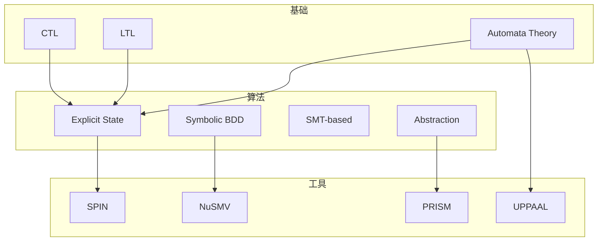
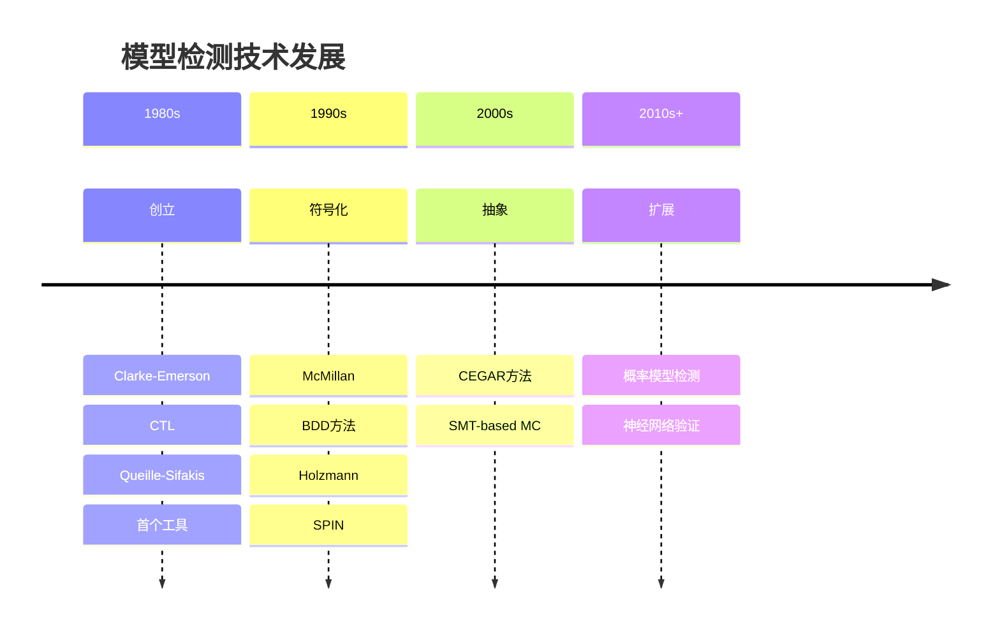

# 按主题分类：模型检测

> **所属阶段**: Struct/形式理论 | **前置依赖**: [完整参考文献](../bibliography.md) | **形式化等级**: L1

---

## 1. 概念定义 (Definitions)

### Def-R-T01-01: 模型检测 (Model Checking)

**模型检测**是一种自动化的形式化验证技术，通过系统地探索系统状态空间来验证系统是否满足给定的时序逻辑性质。

核心特征：

- **自动化**: 验证过程完全自动，无需人工构造证明
- **穷举性**: 理论上检查所有可能的状态和路径
- **反例生成**: 发现错误时能提供具体的反例路径
- **有限状态**: 传统模型检测针对有限状态系统

---

## 2. 属性推导 (Properties)

### Lemma-R-T01-02: 模型检测技术发展时间线

| 年代 | 里程碑 | 影响 |
|-----|--------|------|
| 1981 | Emerson & Clarke: CTL | 创立分支时序逻辑 |
| 1982 | Queille & Sifakis: 首个模型检测器 | 证明可行性 |
| 1987 | McMillan: 符号模型检测 | 突破状态爆炸 |
| 1990s | SPIN, SMV | 工业级工具 |
| 2000s | CEGAR, SMT | 抽象与求解结合 |
| 2010s+ | 概率/实时/神经网络 | 扩展应用领域 |

---

## 3. 关系建立 (Relations)

### 3.1 模型检测技术谱系



---

## 4. 论证过程 (Argumentation)

### 4.1 模型检测 vs 其他验证方法

| 特性 | 模型检测 | 定理证明 | 测试 |
|-----|---------|---------|------|
| 完备性 | 完全(有限系统) | 完全 | 不完备 |
| 自动化 | 高 | 低 | 高 |
| 可扩展性 | 有限(状态爆炸) | 高 | 高 |
| 反例 | 自动生成 | 需人工分析 | 提供 |
| 适用系统 | 有限状态 | 无限状态 | 任意 |

---

## 5. 形式证明 / 工程论证 (Proof / Engineering Argument)

### 5.1 经典论文

| 编号 | 作者 | 标题 | 年份 | 引用 |
|-----|------|-----|------|------|
| MC-01 | Clarke, Emerson, Sistla | Automatic Verification of Finite-State Concurrent Systems | 1986 | >10,000 [^1] |
| MC-02 | Burch et al. | Symbolic Model Checking: 10^20 States and Beyond | 1992 | >5,000 [^2] |
| MC-03 | Holzmann | The Model Checker SPIN | 1997 | >8,000 [^3] |
| MC-04 | Clarke et al. | Counterexample-Guided Abstraction Refinement | 2000 | >5,000 [^4] |
| MC-05 | Biere et al. | Bounded Model Checking | 1999 | >3,000 [^5] |
| MC-06 | Alur, Dill | A Theory of Timed Automata | 1994 | >6,000 [^6] |
| MC-07 | Baier et al. | Model Checking for Probabilistic Systems | 1998/2022 | >2,000 [^7] |

### 5.2 推荐教材

| 教材 | 作者 | 难度 | 重点 |
|-----|------|------|------|
| Model Checking | Clarke, Grumberg, Peled | 中 | 全面入门 |
| Principles of Model Checking | Baier, Katoen | 高 | 理论深度 |
| Handbook of Model Checking | Clarke et al. (Eds.) | 高 | 百科全书 |

### 5.3 关键工具

| 工具 | 类型 | 官网 | 特点 |
|-----|------|------|------|
| SPIN | 显式状态 | spinroot.com | Promela语言，经典 |
| NuSMV | 符号/SMT | nusmv.fbk.eu | BDD+SAT |
| UPPAAL | 时间自动机 | uppaal.org | 实时系统 |
| PRISM | 概率 | prismmodelchecker.org | MDP/CTMC |
| CBMC | C代码 | cprover.org/cbmc | 有界MC |

### 5.4 顶级会议

- **CAV**: Computer Aided Verification (顶级)
- **TACAS**: Tools and Algorithms for Construction and Analysis of Systems
- **ATVA**: Automated Technology for Verification and Analysis
- **SPIN**: SPIN Workshop

---

## 6. 实例验证 (Examples)

### 6.1 学习路径

**入门**:

```
Clarke: Model Checking (教材) → SPIN教程 → 简单协议验证
```

**进阶**:

```
Baier-Katoen: Principles → UPPAAL/PRISM → 实时/概率系统
```

**研究**:

```
CEGAR论文 → 无限状态MC → AI神经网络验证
```

---

## 7. 可视化 (Visualizations)

### 7.1 模型检测技术演进



---

## 8. 引用参考

[^1]: E. Clarke, E. Emerson, A. Sistla, "Automatic Verification of Finite-State Concurrent Systems," ACM TOPLAS, 1986.

[^2]: J. Burch et al., "Symbolic Model Checking: 10^20 States and Beyond," Information and Computation, 1992.

[^3]: G. Holzmann, "The Model Checker SPIN," IEEE TSE, 1997.

[^4]: E. Clarke et al., "Counterexample-Guided Abstraction Refinement," CAV 2000.

[^5]: A. Biere et al., "Bounded Model Checking," TACAS 1999.

[^6]: R. Alur and D. Dill, "A Theory of Timed Automata," Theoretical Computer Science, 1994.

[^7]: C. Baier et al., "Model Checking for Probabilistic Systems," CONCUR 1998; ACM CSUR 2022.

---

*文档版本: v1.0 | 创建日期: 2026-04-09*
