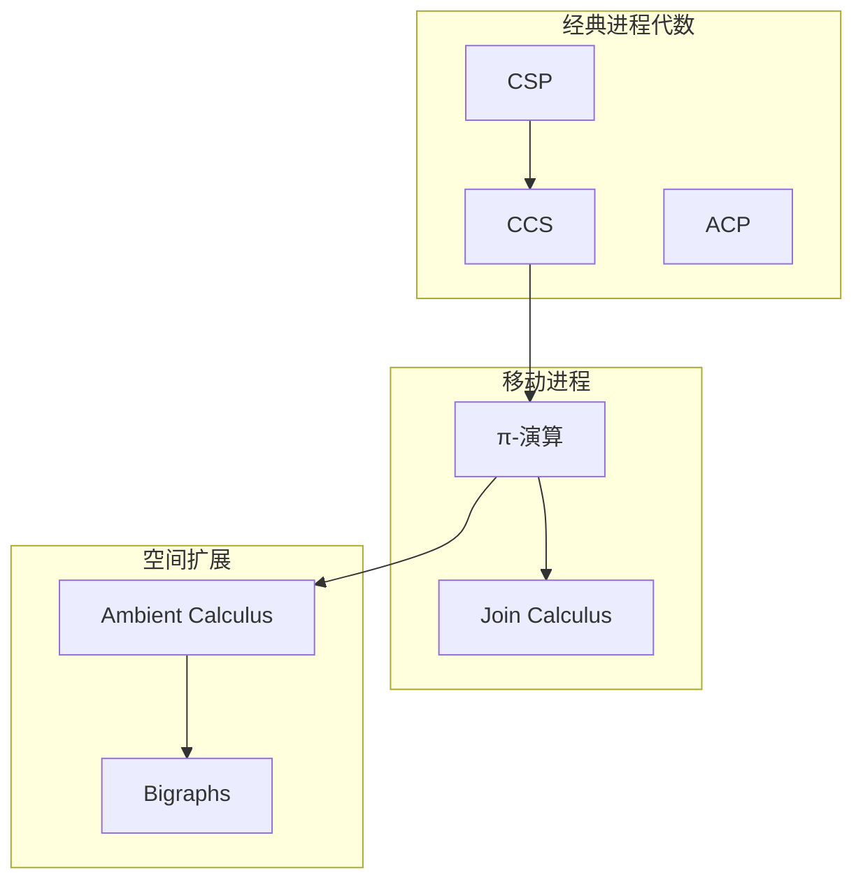
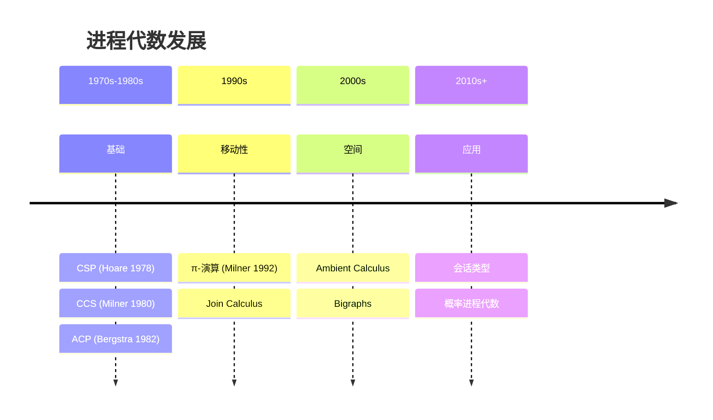

# 按主题分类：进程代数

> **所属阶段**: Struct/形式理论 | **前置依赖**: [完整参考文献](../bibliography.md) | **形式化等级**: L1

---

## 1. 概念定义 (Definitions)

### Def-R-T03-01: 进程代数 (Process Algebra)

**进程代数**是一类用于描述和分析并发系统的形式化语言，提供描述进程行为、组合进程以及推理进程等价性的代数方法。

核心特征：

- **组合性**: 从小进程构建复杂系统
- **抽象性**: 隐藏内部细节，关注可观察行为
- **代数化**: 使用方程和定律推理
- **语义多样性**: 支持多种等价关系（强/弱双模拟、测试等价等）

---

## 2. 属性推导 (Properties)

### Lemma-R-T03-01: 进程代数家族谱系

| 演算 | 提出者 | 年份 | 核心特征 |
|-----|--------|------|---------|
| CSP | Hoare | 1978/1985 | 同步通信，迹语义 |
| CCS | Milner | 1980 | 双模拟，互模拟 |
| ACP | Bergstra, Klop | 1982 | 公理化方法 |
| π-演算 | Milner | 1992 | 移动进程，名称传递 |
| Ambient | Cardelli, Gordon | 2000 | 域移动 |

---

## 3. 关系建立 (Relations)

### 3.1 进程代数关系图



---

## 4. 论证过程 (Argumentation)

### 4.1 等价关系比较

| 等价关系 | 粒度 | 可判定性 | 应用 |
|---------|------|---------|------|
| 强双模拟 | 最细 | 可判定(有限) | 行为精确比较 |
| 弱双模拟 | 中等 | 可判定(有限) | 忽略内部动作 |
| 测试等价 | 较粗 | 难判定 | 观察等价 |
| 迹等价 | 最粗 | 可判定 | 安全性质 |

---

## 5. 形式证明 / 工程论证 (Proof / Engineering Argument)

### 5.1 经典文献

| 编号 | 作者 | 标题 | 年份 |
|-----|------|-----|------|
| PA-01 | Hoare | Communicating Sequential Processes | 1978/1985 [^1] |
| PA-02 | Milner | A Calculus of Communicating Systems | 1980 [^2] |
| PA-03 | Milner | Communicating and Mobile Systems (π) | 1999 [^3] |
| PA-04 | Park | Concurrency and Automata | 1981 [^4] |
| PA-05 | Hennessy, Milner | Algebraic Laws for Nondeterminism | 1985 [^5] |

### 5.2 推荐教材

| 教材 | 作者 | 重点 |
|-----|------|------|
| CSP | Hoare | 经典进程代数 |
| CCS | Milner | 双模拟理论 |
| π-Calculus | Milner, Sangiorgi/Walker | 移动进程 |
| Handbook of Process Algebra | Bergstra et al. (Eds.) | 百科全书 |

### 5.3 工具

| 工具 | 演算 | 功能 |
|-----|------|------|
| FDR | CSP | 精化检查 |
| CADP | LOTOS/CCS | 验证工具箱 |
| mCRL2 | mCRL2 | μCRL演算 |

### 5.4 关键会议

- **CONCUR**: 并发理论顶级会议
- **EXPRESS/SOS**: 结构化操作语义
- **COORDINATION**: 协调模型

---

## 6. 实例验证 (Examples)

### 6.1 学习路径

**基础**:

```
Hoare CSP → CCS → 双模拟理论
```

**进阶**:

```
π-演算 → 类型系统 → 移动计算应用
```

---

## 7. 可视化 (Visualizations)

### 7.1 进程代数演进



---

## 8. 引用参考

[^1]: C. Hoare, "Communicating Sequential Processes," Prentice Hall, 1985.

[^2]: R. Milner, "A Calculus of Communicating Systems," LNCS 92, 1980.

[^3]: R. Milner, "Communicating and Mobile Systems: The π-Calculus," Cambridge, 1999.

[^4]: D. Park, "Concurrency and Automata on Infinite Sequences," LNCS 104, 1981.

[^5]: M. Hennessy and R. Milner, "Algebraic Laws for Nondeterminism and Concurrency," JACM, 1985.

---

*文档版本: v1.0 | 创建日期: 2026-04-09*
