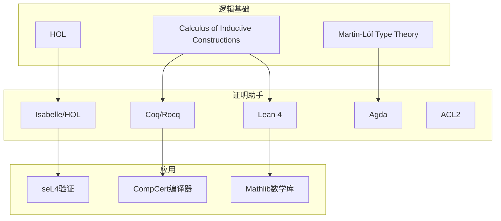
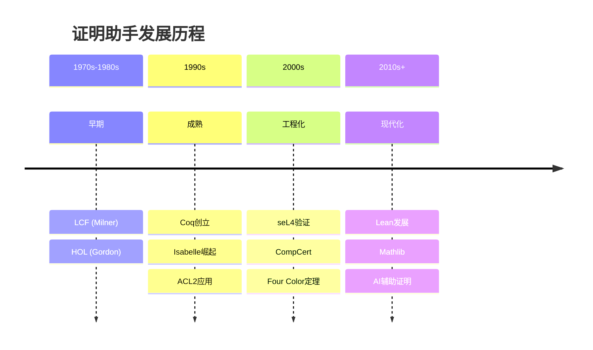

# 按主题分类：定理证明

> **所属阶段**: Struct/形式理论 | **前置依赖**: [完整参考文献](../bibliography.md) | **形式化等级**: L1

---

## 1. 概念定义 (Definitions)

### Def-R-T02-01: 定理证明 (Theorem Proving)

**定理证明**是一种形式化验证技术，使用数学逻辑构造严格的证明来验证系统的正确性。与模型检测不同，定理证明可以处理无限状态系统，但通常需要更多的人工指导。

核心特征：

- **表达能力**: 可处理无限域和高阶逻辑
- **可扩展性**: 适用于大型复杂系统
- **灵活性**: 支持抽象和推理模式定制
- **交互性**: 通常需要人机协作

---

## 2. 属性推导 (Properties)

### Lemma-R-T02-01: 证明助手分类

| 类型 | 代表系统 | 逻辑基础 | 特点 |
|-----|---------|---------|------|
| 高阶逻辑 | Isabelle/HOL, HOL4 | HOL | 经典，工业应用多 |
| 依赖类型 | Coq, Lean, Agda | CIC/MLTT |  Curry-Howard对应 |
| 自动化 | ACL2, PVS | 递归函数/HOL | 自动化程度高 |

---

## 3. 关系建立 (Relations)

### 3.1 证明助手生态系统



---

## 4. 论证过程 (Argumentation)

### 4.1 证明助手对比

| 特性 | Coq | Isabelle | Lean 4 | Agda |
|-----|-----|----------|--------|------|
| 学习曲线 | 陡峭 | 中等 | 中等 | 陡峭 |
| 自动化 | 中 | 高 | 中 | 低 |
| 社区 | 大 | 大 | 快速增长 | 小 |
| IDE | CoqIDE/VSCode | jEdit/VSCode | VSCode | Emacs |
| 提取代码 | 是 | 是 | 是 | 是 |

---

## 5. 形式证明 / 工程论证 (Proof / Engineering Argument)

### 5.1 经典教材

| 教材 | 作者 | 系统 | 免费 |
|-----|------|------|------|
| Software Foundations | Pierce et al. | Coq | 是 [^1] |
| Theorem Proving in Lean 4 | Avigad et al. | Lean | 是 [^2] |
| Concrete Semantics | Nipkow & Klein | Isabelle | 是 [^3] |
| Certified Programming | Chlipala | Coq | 是 [^4] |

### 5.2 里程碑项目

| 项目 | 系统 | 成果 | 影响 |
|-----|------|------|------|
| seL4 | Isabelle | 操作系统内核验证 | 首次完整OS验证 [^5] |
| CompCert | Coq | C编译器验证 | 工业级编译器 [^6] |
| Four Color Theorem | Coq | 四色定理证明 | 经典数学问题 [^7] |
| Odd Order Theorem | Coq | Feit-Thompson定理 | 数学群论 [^8] |
| Mathlib | Lean | 数学库 | 现代数学基础 [^9] |

### 5.3 关键会议

- **ITP**: Interactive Theorem Proving
- **CPP**: Certified Programs and Proofs
- **CADE/IJCAR**: 自动推理
- **POPL**: 类型理论与证明

---

## 6. 实例验证 (Examples)

### 6.1 入门路径

**Coq路径**:

```
Software Foundations Vol.1 → Vol.2 → 简单项目 → 贡献开源
```

**Lean路径**:

```
Theorem Proving in Lean 4 → Functional Programming → Mathlib贡献
```

**Isabelle路径**:

```
Concrete Semantics → Archive of Formal Proofs → 研究项目
```

---

## 7. 可视化 (Visualizations)

### 7.1 证明助手发展时间线



---

## 8. 引用参考

[^1]: B. Pierce et al., "Software Foundations," <https://softwarefoundations.cis.upenn.edu>

[^2]: J. Avigad et al., "Theorem Proving in Lean 4," <https://lean-lang.org/theorem_proving_in_lean4/>

[^3]: T. Nipkow and G. Klein, "Concrete Semantics with Isabelle/HOL," Springer, 2014.

[^4]: A. Chlipala, "Certified Programming with Dependent Types," MIT Press, 2013.

[^5]: G. Klein et al., "seL4: Formal Verification of an OS Kernel," SOSP 2009.

[^6]: X. Leroy, "Formal Verification of a Realistic Compiler," POPL 2006.

[^7]: G. Gonthier, "Formal Proof—The Four-Color Theorem," Notices of the AMS, 2008.

[^8]: G. Gonthier et al., "A Machine-Checked Proof of the Odd Order Theorem," ITP 2013.

[^9]: Mathlib Community, "The Lean Mathematical Library," <https://leanprover-community.github.io/>

---

*文档版本: v1.0 | 创建日期: 2026-04-09*
