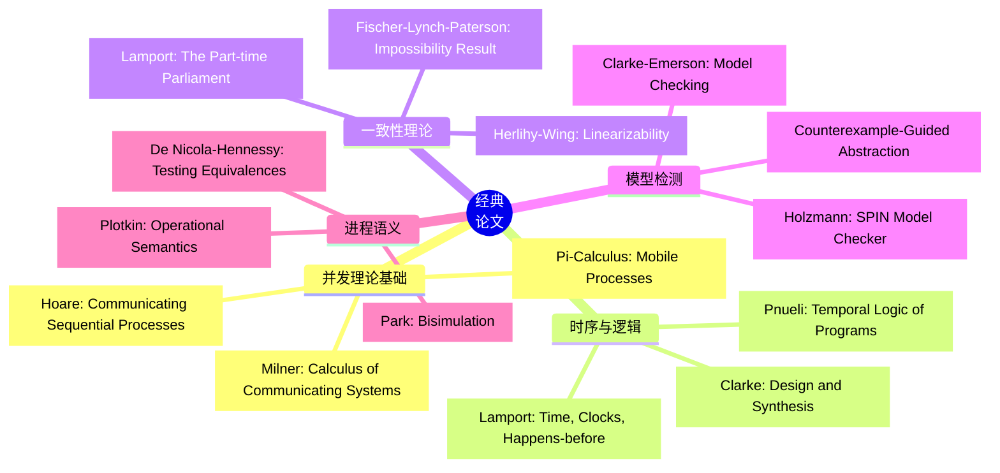
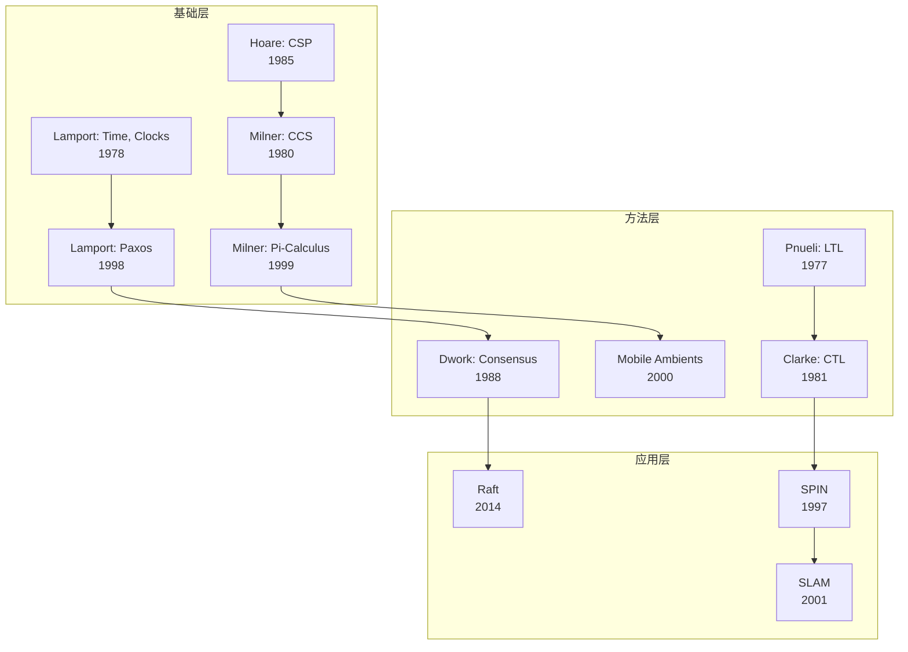
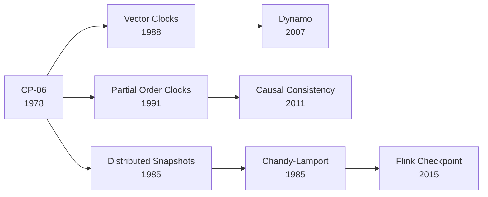
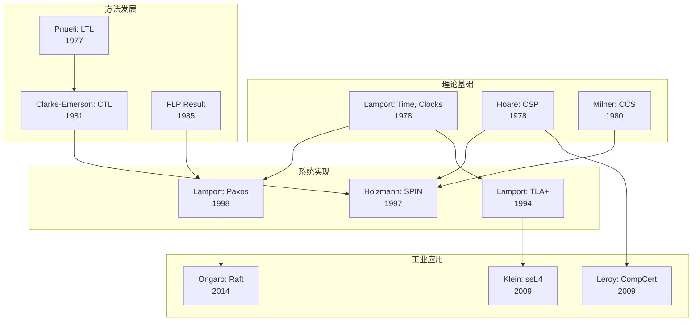
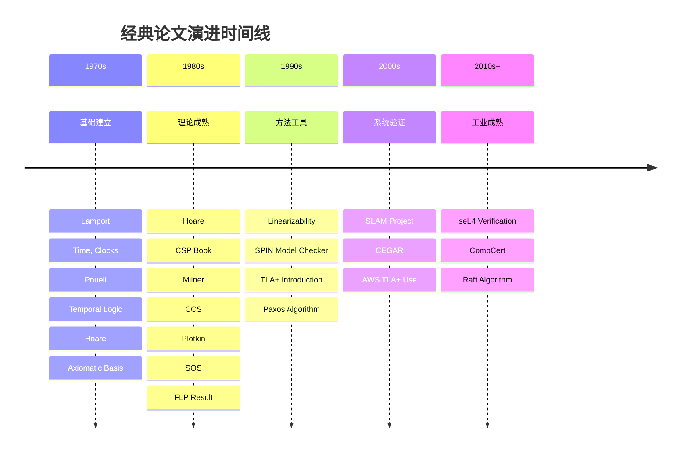

# 经典论文

> **所属阶段**: Struct/形式理论 | **前置依赖**: [完整参考文献](./bibliography.md) | **形式化等级**: L1

---

## 1. 概念定义 (Definitions)

### Def-R-01-01: 经典论文 (Classical Paper)

形式化方法与分布式系统领域的**经典论文**是指那些具有开创性理论贡献、奠定学科基础、或被广泛引用（>1000次）的研究论文。经典论文通常满足以下条件之一：

1. **开创性**: 首次提出重要概念或方法
2. **基础性**: 建立理论框架或数学基础
3. **影响力**: 被后续研究广泛引用和应用
4. **实用性**: 在工业实践中得到验证

---

## 2. 属性推导 (Properties)

### Lemma-R-01-01: 经典论文的时间分布

经典论文在形式化方法领域的分布呈现明显的**代际特征**：

- **1970s-1980s**: 理论基础建立期（进程代数、时序逻辑）
- **1990s**: 工具与算法成熟期（模型检测、符号方法）
- **2000s**: 工业应用拓展期（SLAM、AWS验证）
- **2010s-2020s**: 新范式融合期（AI+形式化、云原生）

### Lemma-R-01-02: 引用网络效应

经典论文形成紧密的**引用网络**，具有以下特征：

| 特征 | 描述 | 示例 |
|-----|------|------|
| 枢纽节点 | 被大量后续工作引用 | Lamport时钟论文 (>10,000引用) |
| 桥梁节点 | 连接不同子领域 | 双模拟等价性论文 |
| 前沿节点 | 近期高影响力工作 | seL4验证论文 |

---

## 3. 关系建立 (Relations)

### 3.1 主题分类体系



### 3.2 论文间依赖关系



---

## 4. 论证过程 (Argumentation)

### 4.1 经典论文的选择标准

为什么某些论文成为经典？以下因素起关键作用：

| 因素 | 权重 | 说明 |
|-----|------|------|
| 理论深度 | 高 | 建立严格的数学框架 |
| 实用性 | 高 | 解决实际问题或指导实践 |
| 可扩展性 | 中 | 支持后续研究发展 |
| 可理解性 | 中 | 清晰表达，易于教学 |
| 引用广度 | 高 | 跨越多个子领域 |

### 4.2 代际传承分析

**第一代人（1970s-1980s）**: 建立基础概念

- Dijkstra: 并发程序设计
- Hoare: CSP, 霍尔逻辑
- Lamport: 分布式时钟
- Milner: CCS

**第二代人（1990s-2000s）**: 工具与系统

- Holzmann: SPIN
- Clarke/Emerson/Sifakis: 模型检测 (图灵奖)
- Lamport: TLA+
- Herlihy/Shavit: 多处理器编程

**第三代人（2010s-至今）**: 工程化与融合

- Klein: seL4
- Leroy: CompCert
- Newcombe: AWS TLA+应用
- AI+形式化方法

---

## 5. 形式证明 / 工程论证 (Proof / Engineering Argument)

### 5.1 按主题分类的经典论文

#### 5.1.1 并发理论基础

| 编号 | 作者 | 标题 | 年份 | 影响 |
|-----|------|-----|------|-----|
| CP-01 | C. A. R. Hoare | Communicating Sequential Processes | 1978/1985 | 奠定进程代数基础，CSP语言起源 [^1] |
| CP-02 | R. Milner | A Calculus of Communicating Systems | 1980 | CCS进程演算开山之作 [^2] |
| CP-03 | R. Milner | Communicating and Mobile Systems: The π-Calculus | 1999 | 移动进程理论里程碑 [^3] |
| CP-04 | M. Hennessy, R. Milner | Algebraic Laws for Nondeterminism and Concurrency | 1985 | 并发代数公理化 [^4] |
| CP-05 | D. Park | Concurrency and Automata on Infinite Sequences | 1981 | 双模拟概念起源 [^5] |

**摘要与影响分析**:

**[CP-01] CSP**: Hoare提出的Communicating Sequential Processes引入了进程间通过显式通信同步的范式。其影响在于：

- 催生了Occam编程语言
- 影响了Go语言的channel设计
- 成为形式化验证的重要工具

**[CP-03] π-Calculus**: Milner提出的π演算扩展了CCS，允许进程间传递通道名称，实现了"移动性"。其创新在于：

- 统一了函数式与命令式并发模型
- 成为移动计算和分布式系统的理论基础
- 影响了大量后续演算（如Ambient Calculus）

#### 5.1.2 分布式系统一致性

| 编号 | 作者 | 标题 | 年份 | 影响 |
|-----|------|-----|------|-----|
| CP-06 | L. Lamport | Time, Clocks, and the Ordering of Events | 1978 | 分布式时钟基础，>10,000引用 [^6] |
| CP-07 | M. J. Fischer, N. A. Lynch, M. S. Paterson | Impossibility of Distributed Consensus | 1985 | FLP不可能性结果 [^7] |
| CP-08 | L. Lamport | The Part-time Parliament (Paxos) | 1998 | 共识算法经典 [^8] |
| CP-09 | M. Herlihy, J. M. Wing | Linearizability: A Correctness Condition | 1990 | 并发正确性标准定义 [^9] |
| CP-10 | S. Gilbert, N. Lynch | Brewer's Conjecture and the Feasibility of Consistent, Available, Partition-tolerant Web Services | 2002 | CAP定理形式化 [^10] |
| CP-11 | D. Ongaro, J. Ousterhout | In Search of an Understandable Consensus Algorithm | 2014 | Raft算法，工业界广泛采用 [^11] |

**关键影响**: FLP结果（CP-07）证明了在异步系统中，即使只有一个进程可能故障，也不可能达成确定性共识。这一理论深刻影响了后续共识算法设计，促使研究者探索：

- 随机化算法
- 故障检测器
- 部分同步假设

#### 5.1.3 模型检测

| 编号 | 作者 | 标题 | 年份 | 影响 |
|-----|------|-----|------|-----|
| CP-12 | E. M. Clarke, E. A. Emerson, A. P. Sistla | Automatic Verification of Finite-State Concurrent Systems | 1986 | CTL模型检测，图灵奖工作 [^12] |
| CP-13 | J. R. Burch et al. | Symbolic Model Checking: 10^20 States and Beyond | 1992 | 符号模型检测突破 [^13] |
| CP-14 | G. J. Holzmann | The Model Checker SPIN | 1997 | 工业级模型检测器 [^14] |
| CP-15 | E. Clarke et al. | Counterexample-Guided Abstraction Refinement | 2000 | CEGAR范式 [^15] |
| CP-16 | T. Ball, S. K. Rajamani | Automatically Validating Temporal Safety Properties | 2001 | SLAM项目，微软应用 [^16] |

**技术演进**: 从显式状态（CP-12）到符号方法（CP-13），再到抽象精化（CP-15），模型检测经历了从理论到工业应用的完整演进。

#### 5.1.4 时序逻辑

| 编号 | 作者 | 标题 | 年份 | 影响 |
|-----|------|-----|------|-----|
| CP-17 | A. Pnueli | The Temporal Logic of Programs | 1977 | 时序逻辑引入程序验证，图灵奖 [^17] |
| CP-18 | E. A. Emerson, E. M. Clarke | Characterizing Correctness Properties of Parallel Programs | 1980 | CTL创立 [^18] |
| CP-19 | Z. Manna, A. Pnueli | The Temporal Logic of Reactive and Concurrent Systems | 1992 | 时序逻辑系统教科书 [^19] |

#### 5.1.5 类型理论与程序语义

| 编号 | 作者 | 标题 | 年份 | 影响 |
|-----|------|-----|------|-----|
| CP-20 | G. D. Plotkin | A Structural Approach to Operational Semantics | 1981 | SOS结构化操作语义 [^20] |
| CP-21 | R. Milner | A Theory of Type Polymorphism in Programming | 1978 | ML多态类型系统 [^21] |
| CP-22 | J. C. Reynolds | Types, Abstraction and Parametric Polymorphism | 1983 | 参数多态理论基础 [^22] |
| CP-23 | P. Wadler | Theorems for Free! | 1989 | 参数性推导定理 [^23] |

#### 5.1.6 定理证明与形式化验证

| 编号 | 作者 | 标题 | 年份 | 影响 |
|-----|------|-----|------|-----|
| CP-24 | G. Klein et al. | seL4: Formal Verification of an OS Kernel | 2009 | 操作系统内核完整验证 [^24] |
| CP-25 | X. Leroy | Formal Verification of a Realistic Compiler | 2009 | CompCert验证编译器 [^25] |
| CP-26 | C. A. R. Hoare | An Axiomatic Basis for Computer Programming | 1969 | 霍尔逻辑，程序验证奠基 [^26] |

---

## 6. 实例验证 (Examples)

### 6.1 阅读路径推荐

**入门路径**:

```
Lamport [CP-06] → Hoare [CP-01] → FLP [CP-07] → Herlihy-Wing [CP-09]
```

**研究路径**:

```
Milner CCS [CP-02] → Pi-Calculus [CP-03] → Plotkin [CP-20] → Clarke/Emerson [CP-12]
```

**工程路径**:

```
Ongaro [CP-11] → Klein [CP-24] → Newcombe (AWS) → Ball/Rajamani [CP-16]
```

### 6.2 引用分析示例

以Lamport的时钟论文（CP-06）为例：



---

## 7. 可视化 (Visualizations)

### 7.1 经典论文影响力网络



### 7.2 按年代的经典论文分布



---

## 8. 引用参考 (References)

[^1]: C. A. R. Hoare, "Communicating Sequential Processes," Communications of the ACM, 21(8), 1978; 同名专著 Prentice Hall, 1985.

[^2]: R. Milner, "A Calculus of Communicating Systems," LNCS 92, Springer, 1980.

[^3]: R. Milner, "Communicating and Mobile Systems: The π-Calculus," Cambridge University Press, 1999.

[^4]: M. Hennessy and R. Milner, "Algebraic Laws for Nondeterminism and Concurrency," Journal of the ACM, 32(1), 1985.

[^5]: D. Park, "Concurrency and Automata on Infinite Sequences," LNCS 104, Springer, 1981.

[^6]: L. Lamport, "Time, Clocks, and the Ordering of Events in a Distributed System," Communications of the ACM, 21(7), 1978.

[^7]: M. J. Fischer, N. A. Lynch, and M. S. Paterson, "Impossibility of Distributed Consensus with One Faulty Process," Journal of the ACM, 32(2), 1985.

[^8]: L. Lamport, "The Part-time Parliament," ACM Transactions on Computer Systems, 16(2), 1998.

[^9]: M. Herlihy and J. M. Wing, "Linearizability: A Correctness Condition for Concurrent Objects," ACM Transactions on Programming Languages and Systems, 12(3), 1990.

[^10]: S. Gilbert and N. Lynch, "Brewer's Conjecture and the Feasibility of Consistent, Available, Partition-tolerant Web Services," ACM SIGACT News, 33(2), 2002.

[^11]: D. Ongaro and J. Ousterhout, "In Search of an Understandable Consensus Algorithm," USENIX ATC, 2014.

[^12]: E. M. Clarke, E. A. Emerson, and A. P. Sistla, "Automatic Verification of Finite-State Concurrent Systems Using Temporal Logic Specifications," ACM Transactions on Programming Languages and Systems, 8(2), 1986.

[^13]: J. R. Burch et al., "Symbolic Model Checking: 10^20 States and Beyond," Information and Computation, 98(2), 1992.

[^14]: G. J. Holzmann, "The Model Checker SPIN," IEEE Transactions on Software Engineering, 23(5), 1997.

[^15]: E. Clarke et al., "Counterexample-Guided Abstraction Refinement," CAV 2000.

[^16]: T. Ball and S. K. Rajamani, "Automatically Validating Temporal Safety Properties of Interfaces," SPIN 2001.

[^17]: A. Pnueli, "The Temporal Logic of Programs," FOCS 1977.

[^18]: E. A. Emerson and E. M. Clarke, "Characterizing Correctness Properties of Parallel Programs as Fixpoints," LNCS 85, 1980.

[^19]: Z. Manna and A. Pnueli, "The Temporal Logic of Reactive and Concurrent Systems," Springer, 1992.

[^20]: G. D. Plotkin, "A Structural Approach to Operational Semantics," DAIMI FN-19, Aarhus University, 1981.

[^21]: R. Milner, "A Theory of Type Polymorphism in Programming," Journal of Computer and System Sciences, 17(3), 1978.

[^22]: J. C. Reynolds, "Types, Abstraction and Parametric Polymorphism," IFIP Congress, 1983.

[^23]: P. Wadler, "Theorems for Free!" FPCA/ICFP 1989.

[^24]: G. Klein et al., "seL4: Formal Verification of an OS Kernel," SOSP 2009.

[^25]: X. Leroy, "Formal Verification of a Realistic Compiler," Communications of the ACM, 52(7), 2009.

[^26]: C. A. R. Hoare, "An Axiomatic Basis for Computer Programming," Communications of the ACM, 12(10), 1969.

---

*文档版本: v1.0 | 创建日期: 2026-04-09 | 最后更新: 2026-04-09*
*收录经典论文: 26篇 | 覆盖主题: 6个 | 时间跨度: 1969-2014*
