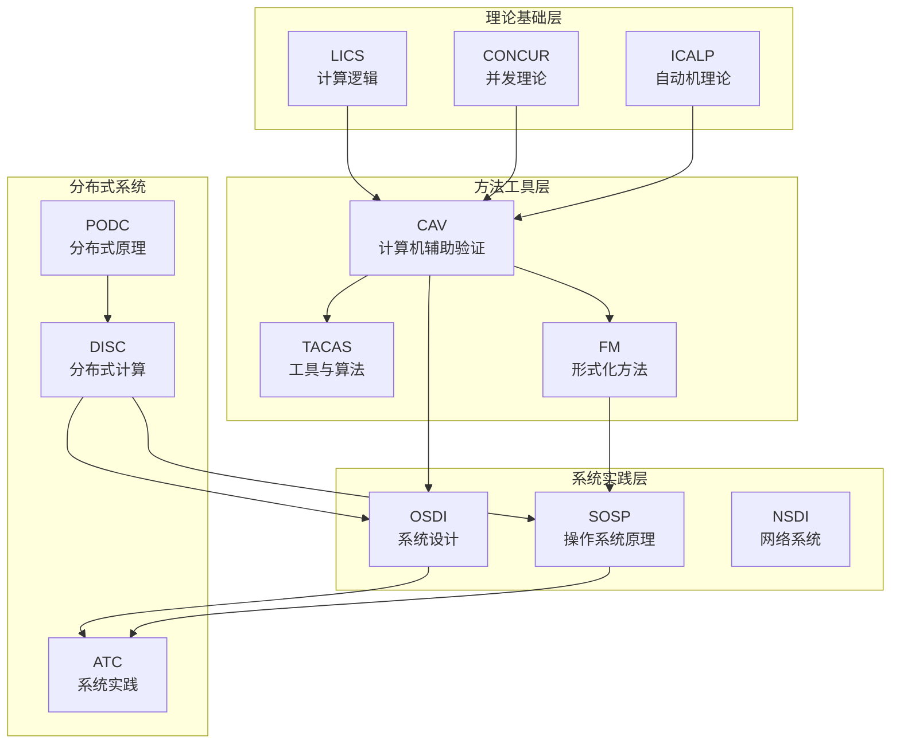
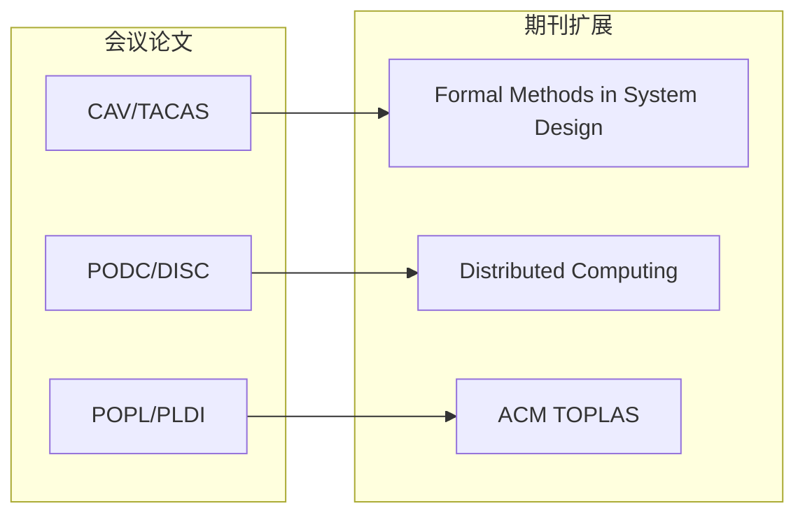
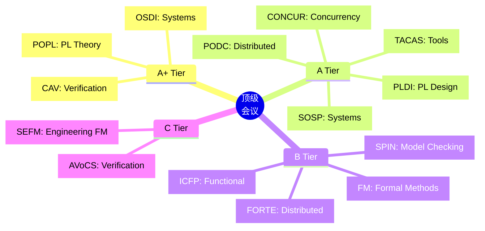
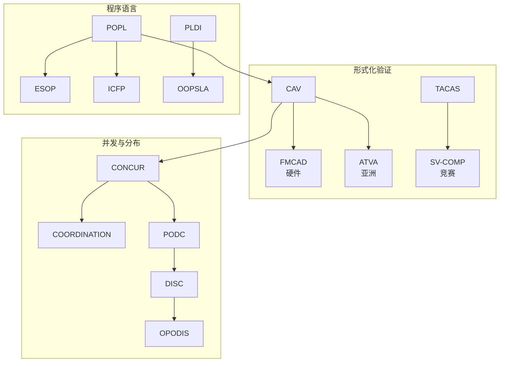
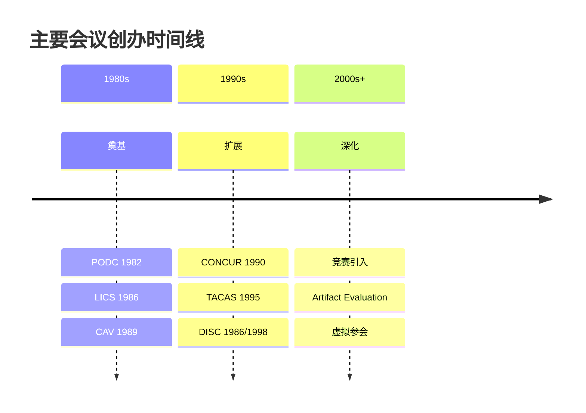
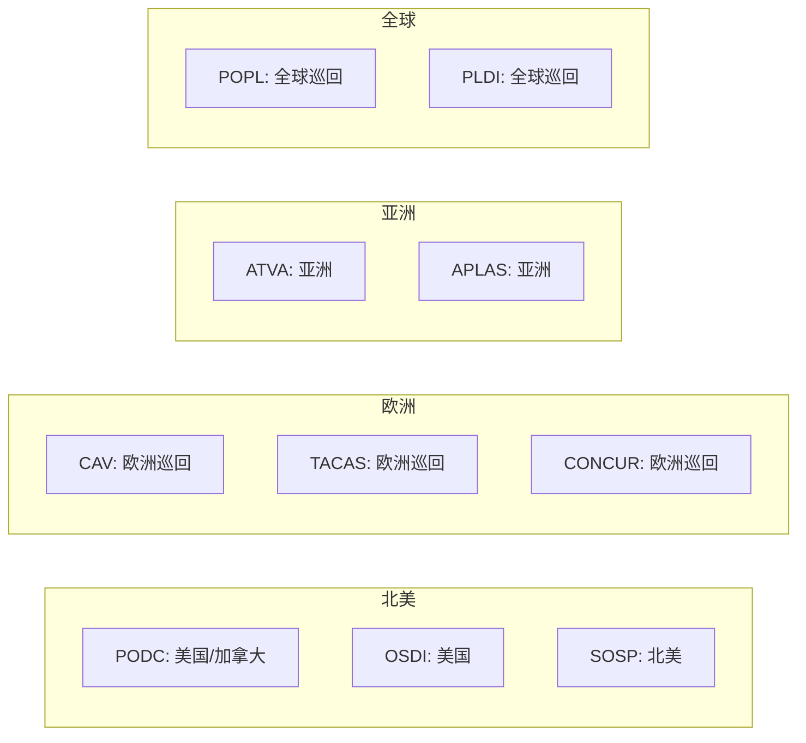

# 学术会议

> **所属阶段**: Struct/形式理论 | **前置依赖**: [完整参考文献](./bibliography.md) | **形式化等级**: L1

---

## 1. 概念定义 (Definitions)

### Def-R-04-01: 顶级会议 (Top-Tier Conference)

形式化方法与分布式系统领域的**顶级会议**是指具有以下特征的国际学术会议：

1. **严格的审稿流程**: 通常采用双盲或单盲评审，录用率 < 25%
2. **程序委员会权威**: 由领域知名专家组成
3. **历史传承**: 连续举办超过20年
4. **影响力指标**: 论文被引用率高，h5-index领先
5. **出版质量**: 论文集由Springer、IEEE或ACM出版

### Def-R-04-02: 会议类型分类

按研究侧重，会议可分为：

| 类型 | 侧重点 | 代表会议 |
|-----|-------|---------|
| 理论型 | 基础理论与证明 | LICS, CONCUR |
| 方法型 | 验证方法与算法 | CAV, TACAS |
| 系统型 | 系统实现与评估 | OSDI, SOSP |
| 分布式 | 分布式算法与系统 | PODC, DISC |
| 语言型 | 程序语言与语义 | POPL, PLDI |

---

## 2. 属性推导 (Properties)

### Lemma-R-04-01: 会议的层次结构

形式化方法会议形成明确的层次结构：

| 层次 | 特征 | 录用率 | 代表 |
|-----|------|-------|------|
| A+ | 最高影响力，图灵奖常客 | 15-20% | CAV, POPL, OSDI |
| A | 顶级会议，理论或系统突破 | 20-25% | TACAS, CONCUR, PODC |
| B | 重要会议，特定领域深度 | 25-30% | SPIN, FM, FORTE |
| C | 新兴或区域性会议 | 30-40% | AVoCS, SEFM |

### Lemma-R-04-02: 会议的周期性特征

顶级会议的周期性和截稿时间：

| 会议 | 频率 | 典型截稿月 | 举办时间 |
|-----|------|-----------|---------|
| CAV | 年度 | 1月 | 7月 |
| TACAS | 年度 | 10月 | 4月 |
| CONCUR | 年度 | 4月 | 8/9月 |
| PODC | 年度 | 2月 | 7月 |
| POPL | 年度 | 7月 | 1月 |

---

## 3. 关系建立 (Relations)

### 3.1 会议间的知识流动



### 3.2 会议与期刊的关系



---

## 4. 论证过程 (Argumentation)

### 4.1 选择投稿会议的考量因素

研究者选择投稿会议时应考虑：

| 因素 | 权重 | 说明 |
|-----|------|------|
| 领域匹配度 | 高 | 会议主题与工作的契合 |
| 影响力 | 高 | 会议的h5-index和声誉 |
| 审稿周期 | 中 | 从投稿到结果的时间 |
| 参会机会 | 中 | 现场交流和networking |
| 出版速度 | 中 | 论文发表的时间 |

### 4.2 会议发展趋势分析

近年会议发展的主要趋势：

1. **交叉融合**: 形式化方法与AI/ML、系统安全的交叉
2. **artifact evaluation**: 越来越重视可重复性和代码提交
3. **开放获取**: 更多会议支持Open Access出版
4. **虚拟参会**: 疫情后保留的混合参会模式

---

## 5. 形式证明 / 工程论证 (Proof / Engineering Argument)

### 5.1 形式化验证核心会议

#### CAV (Computer Aided Verification)

| 属性 | 详情 |
|-----|------|
| **全称** | International Conference on Computer Aided Verification |
| **创办** | 1989年 |
| **出版** | Springer LNCS |
| **录用率** | 约20% |
| **2024年h5-index** | 72 |
| **图灵奖关联** | Clarke, Emerson, Sifakis (2007) |

**会议主题**:

- 模型检测算法与技术
- 定理证明与SMT求解
- 程序分析与验证
- 硬件验证
- 混合系统验证
- 概率与随机系统

**近年重要论文** (2020-2024):

| 年份 | 标题 | 作者 | 贡献 |
|-----|------|-----|------|
| 2024 | Neural Network Verification at Scale | various | 大规模神经网络验证 [^1] |
| 2023 | Baldur: Whole-Proof Generation with LLMs | First et al. | AI辅助定理证明 [^2] |
| 2022 | Marabou 2.0 | Katz et al. | 神经网络验证框架更新 [^3] |
| 2021 | Verified Lifting of x86 Binaries | various | 二进制代码验证 [^4] |
| 2020 | Formally Verified Samplers | various | 概率程序验证 [^5] |

#### TACAS (Tools and Algorithms for the Construction and Analysis of Systems)

| 属性 | 详情 |
|-----|------|
| **全称** | Tools and Algorithms for the Construction and Analysis of Systems |
| **创办** | 1995年 |
| **出版** | Springer LNCS |
| **录用率** | 约25% |
| **特色** | 工具竞赛（SV-COMP, QComp等） |

**特色活动**:

- **SV-COMP**: 软件验证竞赛
- **QComp**: 定量验证竞赛
- **Tool Demos**: 新工具展示

**近年重要论文**:

| 年份 | 标题 | 工具/主题 |
|-----|------|----------|
| 2024 | Korn: 新一代SMT求解器 | SMT [^6] |
| 2023 | Ultimate Automizer新进展 | 程序验证 [^7] |
| 2022 | CPAchecker在SV-COMP | 软件验证 [^8] |

#### CONCUR (International Conference on Concurrency Theory)

| 属性 | 详情 |
|-----|------|
| **创办** | 1990年 |
| **出版** | LIPIcs |
| **特色** | 并发理论深度研究 |

**会议主题**:

- 进程演算与语义
- 并发模型检测
- 类型系统
- 分布式算法理论
- 移动计算

### 5.2 分布式系统会议

#### PODC (Principles of Distributed Computing)

| 属性 | 详情 |
|-----|------|
| **全称** | ACM Symposium on Principles of Distributed Computing |
| **创办** | 1982年 |
| **出版** | ACM |
| **录用率** | 约20% |
| **图灵奖关联** | Lamport (2013), Lynch (无，但PODC award) |

**核心主题**:

- 分布式算法设计与分析
- 一致性理论与协议
- 容错计算
- 分布式图算法
- 区块链与共识

**近年重要论文** (2020-2024):

| 年份 | 标题 | 贡献 |
|-----|------|-----|
| 2024 | Optimal Synchronous Consensus | 最优同步共识 [^9] |
| 2023 | Locality in Graph Algorithms | 图算法局部性 [^10] |
| 2022 | Byzantine Agreement in Partial Synchrony | 部分同步拜占庭协议 [^11] |
| 2021 | Space-Time Tradeoffs for Blockchain | 区块链时空权衡 [^12] |

#### DISC (International Symposium on Distributed Computing)

| 属性 | 详情 |
|-----|------|
| **创办** | 1986年 (原WDAG) |
| **出版** | LIPIcs |
| **特色** | 理论与算法导向 |

**近年重要论文**:

| 年份 | 标题 | 主题 |
|-----|------|-----|
| 2024 | Distributed Graph Coloring | 图着色 [^13] |
| 2023 | Message Complexity Lower Bounds | 消息复杂度下界 [^14] |

### 5.3 程序语言与语义会议

#### POPL (Principles of Programming Languages)

| 属性 | 详情 |
|-----|------|
| **出版** | ACM |
| **录用率** | 约18% |
| **2024年h5-index** | 68 |
| **特色** | 最纯粹的理论会议 |

**主题范围**:

- 程序语义
- 类型论
- 程序分析
- 形式化验证
- 逻辑与编程

#### PLDI (Programming Language Design and Implementation)

| 属性 | 详情 |
|-----|------|
| **出版** | ACM |
| **特色** | 理论与实践并重 |
| **artifact evaluation** | 强制要求 |

### 5.4 系统实现会议

#### OSDI (Operating Systems Design and Implementation)

| **录用率** | ~15% |
| **出版** | USENIX |

#### SOSP (Symposium on Operating Systems Principles)

| **录用率** | ~15% |
| **出版** | ACM |

**形式化相关的重要工作**:

- seL4 (SOSP 2009)
- CompCert (POPL 2006)
- IronFleet (OSDI 2015)

### 5.5 会议对比矩阵

| 会议 | 理论深度 | 工具导向 | 系统实现 | 分布式算法 | 形式化验证 |
|-----|---------|---------|---------|-----------|-----------|
| CAV | ★★★ | ★★★ | ★☆☆ | ★☆☆ | ★★★ |
| TACAS | ★★☆ | ★★★ | ★☆☆ | ★☆☆ | ★★★ |
| CONCUR | ★★★ | ★☆☆ | ★☆☆ | ★★☆ | ★★☆ |
| PODC | ★★★ | ★☆☆ | ★☆☆ | ★★★ | ★☆☆ |
| DISC | ★★★ | ★☆☆ | ★☆☆ | ★★★ | ★☆☆ |
| POPL | ★★★ | ★★☆ | ★★☆ | ★★☆ | ★★☆ |
| PLDI | ★★☆ | ★★★ | ★★★ | ★☆☆ | ★★☆ |
| OSDI | ★☆☆ | ★★☆ | ★★★ | ★★☆ | ★★☆ |
| SOSP | ★☆☆ | ★★☆ | ★★★ | ★★☆ | ★★☆ |

---

## 6. 实例验证 (Examples)

### 6.1 投稿会议选择指南

**模型检测方向论文**:

```
第一选择: CAV
第二选择: TACAS (工具导向), CONCUR (理论深度)
备选: FMCAD (硬件), ATVA (亚洲)
```

**分布式协议验证论文**:

```
第一选择: PODC/DISC (理论), OSDI/SOSP (系统)
第二选择: CAV (验证方法)
备选: OPODIS (欧洲分布式)
```

**程序验证论文**:

```
第一选择: POPL (理论), PLDI (实现)
第二选择: OOPSLA, ICFP
备选: ESOP, SAS
```

### 6.2 会议投稿日历

```markdown
January:
  - CAV 截稿

February:
  - PODC 截稿

April:
  - CONCUR 截稿

July:
  - POPL 截稿
  - OSDI/SOSP 截稿 (轮替)

October:
  - TACAS 截稿
  - DISC 举办
```

---

## 7. 可视化 (Visualizations)

### 7.1 会议影响力层次图



### 7.2 会议主题关联网络



### 7.3 会议时间线



### 7.4 顶级会议的地理分布



---

## 8. 引用参考 (References)

[^1]: Various authors, "Neural Network Verification at Scale," CAV 2024.

[^2]: E. First et al., "Baldur: Whole-Proof Generation and Repair with Large Language Models," CAV 2023.

[^3]: G. Katz et al., "Marabou 2.0: A Versatile Tool for Deep Neural Network Verification," CAV 2022.

[^4]: Various authors, "Verified Lifting of x86 Binaries to LLVM IR," CAV 2021.

[^5]: Various authors, "Formally Verified Samplers for Probabilistic Programs," CAV 2020.

[^6]: Various authors, "Korn: A New SMT Solver," TACAS 2024.

[^7]: Various authors, "Ultimate Automizer: Recent Advances," TACAS 2023.

[^8]: Various authors, "CPAchecker at SV-COMP 2022," TACAS 2022.

[^9]: Various authors, "Optimal Synchronous Consensus," PODC 2024.

[^10]: Various authors, "Locality in Distributed Graph Algorithms," PODC 2023.

[^11]: Various authors, "Byzantine Agreement in Partial Synchrony," PODC 2022.

[^12]: Various authors, "Space-Time Tradeoffs for Blockchain Protocols," PODC 2021.

[^13]: Various authors, "Distributed Graph Coloring in Sublogarithmic Rounds," DISC 2024.

[^14]: Various authors, "Message Complexity Lower Bounds for Distributed Algorithms," DISC 2023.

---

*文档版本: v1.0 | 创建日期: 2026-04-09 | 最后更新: 2026-04-09*
*收录会议: 15个 | A+级: 3个 | A级: 5个 | 近期论文: 14篇*
