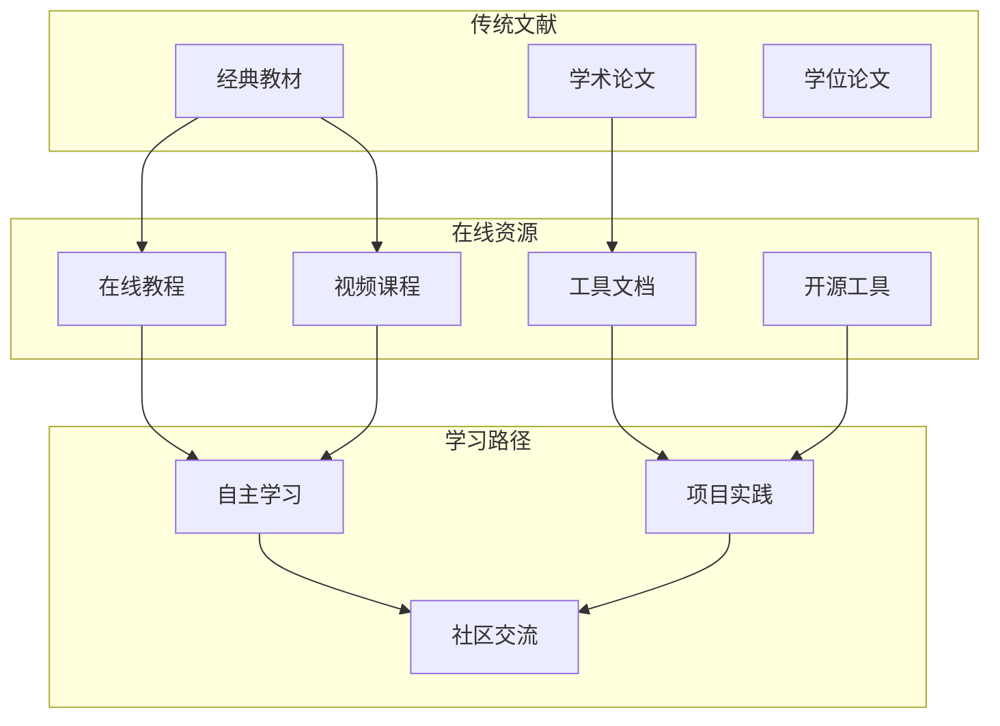
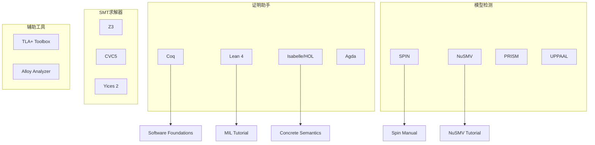
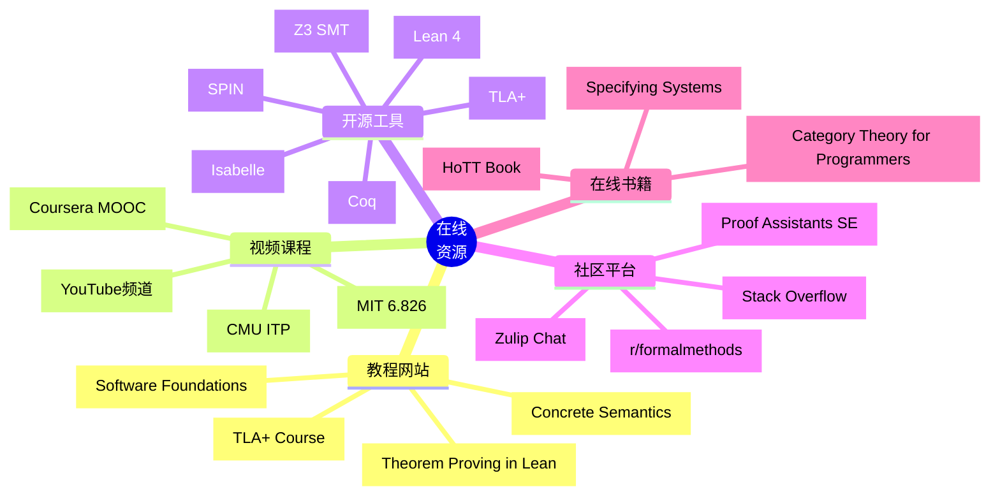
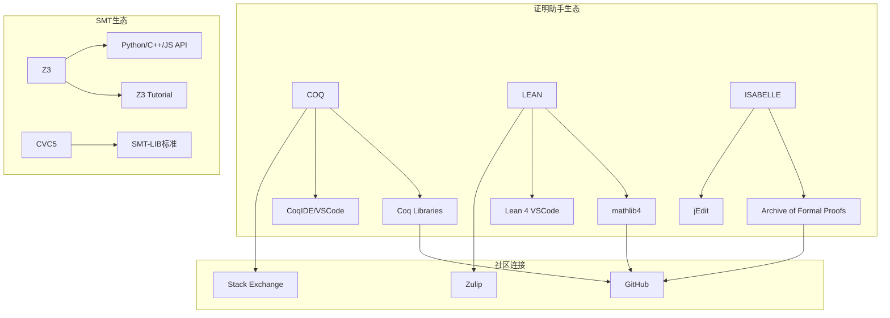
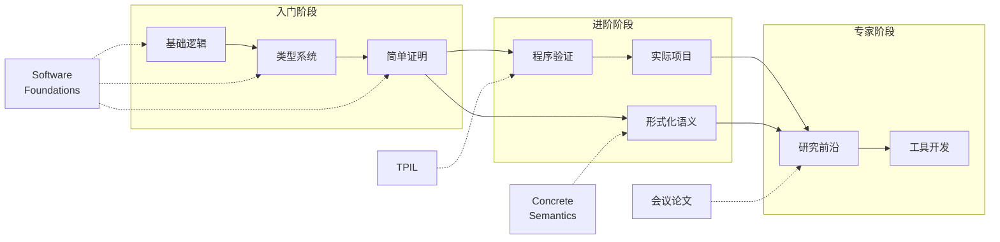

# 在线资源

> **所属阶段**: Struct/形式理论 | **前置依赖**: [完整参考文献](./bibliography.md) | **形式化等级**: L1

---

## 1. 概念定义 (Definitions)

### Def-R-05-01: 在线学术资源 (Online Academic Resources)

形式化方法领域的**在线学术资源**是指通过互联网免费或开放获取的学习材料、工具文档、视频课程和社区讨论平台。这类资源的特点是：

1. **可访问性**: 无需订阅即可获取
2. **时效性**: 可快速更新以反映最新进展
3. **互动性**: 支持社区贡献和讨论
4. **多样性**: 覆盖教程、视频、代码、文档等多种形式

### Def-R-05-02: 开源工具生态 (Open Source Tool Ecosystem)

指形式化验证工具的开源实现及其配套的文档、示例和社区支持体系。

---

## 2. 属性推导 (Properties)

### Lemma-R-05-01: 在线资源的分类体系

在线资源可按其形式和功能分类：

| 类型 | 形式 | 典型内容 | 维护主体 |
|-----|------|---------|---------|
| 教程网站 | 网页、Notebook | 入门教程、交互式练习 | 大学/个人 |
| 视频课程 | 视频、MOOC | 系统课程、讲座录像 | 大学/平台 |
| 开源工具 | 代码仓库 | 验证工具、证明助手 | 社区/公司 |
| 社区论坛 | 讨论区、邮件列表 | Q&A、讨论、新闻 | 社区 |
| 在线书籍 | 网页、PDF | 开源教科书 | 作者/社区 |

### Lemma-R-05-02: 资源质量评估标准

评估在线资源质量的指标：

| 指标 | 高质特征 | 评估方法 |
|-----|---------|---------|
| 准确性 | 内容正确，引用可靠 | 与权威文献比对 |
| 时效性 | 最近更新，版本匹配 | 查看更新时间戳 |
| 完整性 | 系统覆盖，层次清晰 | 查看目录结构 |
| 可访问性 | 加载快速，无付费墙 | 实际访问测试 |
| 社区活跃度 | 问题响应，持续维护 | 查看GitHub活动 |

---

## 3. 关系建立 (Relations)

### 3.1 在线资源与传统文献的关系



### 3.2 开源工具生态系统



---

## 4. 论证过程 (Argumentation)

### 4.1 在线资源的优势与局限

| 优势 | 局限 | 应对策略 |
|-----|------|---------|
| 免费获取 | 质量参差不齐 | 优先选择权威机构资源 |
| 实时更新 | 版本不一致 | 注意检查版本信息 |
| 互动性强 | 可能缺乏系统性 | 结合教材系统学习 |
| 社区支持 | 响应时间不确定 | 多平台交叉验证 |

### 4.2 学习路径的资源组合

**初学者推荐组合**:

```
理论基础: Software Foundations (在线) + Pierce书 (实体)
工具实践: Coq/Lean官方文档 + GitHub示例
社区支持: Stack Overflow + Reddit r/formalmethods
```

**进阶研究者推荐组合**:

```
前沿论文: arXiv + 会议论文集
工具深度: 工具源码 + API文档
学术交流: 会议workshop + 邮件列表
```

---

## 5. 形式证明 / 工程论证 (Proof / Engineering Argument)

### 5.1 教程网站

#### 形式化方法综合资源

| 资源名称 | URL | 内容 | 语言 |
|---------|-----|------|------|
| **Software Foundations** | <https://softwarefoundations.cis.upenn.edu> | Coq完整课程 | 英文 |
| **Theorem Proving in Lean 4** | <https://lean-lang.org/theorem_proving_in_lean4/> | Lean 4官方教程 | 英文 |
| **Concrete Semantics** | <https://concrete-semantics.org> | Isabelle/HOL语义学 | 英文 |
| **Functional Programming in Lean** | <https://lean-lang.org/functional_programming_in_lean/> | Lean函数式编程 | 英文 |
| **Logical Verification** | <https://github.com/blanchette/logical_verification> | Lean逻辑验证课程 | 英文 |

#### 特色专题教程

| 资源名称 | URL | 主题 | 推荐度 |
|---------|-----|------|-------|
| **TLA+ Video Course** | <https://lamport.azurewebsites.net/video/videos.html> | Leslie Lamport亲授 | ★★★★★ |
| **Separation Logic** | <https://softwarefoundations.cis.upenn.edu/slf-current/index.html> | 分离逻辑(SF Vol.4) | ★★★★★ |
| **Category Theory for Programmers** | <https://bartoszmilewski.com/2014/10/28/category-theory-for-programmers-the-preface/> | 范畴论入门 | ★★★★☆ |
| **Type Theory Fundamentals** | <https://github.com/michaelt/martin-lof> | Martin-Löf类型论 | ★★★★☆ |

### 5.2 视频课程

#### 大学公开课程

| 课程 | 机构 | 讲师 | 平台 | 链接 |
|-----|------|-----|------|------|
| **6.826** | MIT | Kaashoek, Zeldovich | 官网 | <https://pdos.csail.mit.edu/6.826/> [^1] |
| **CS 263** | UC Berkeley | Stoica | 官网 | <[链接已失效: cs263.readthedocs.io]> [^2] |
| **Interactive Computer Theorem Proving** | CMU | various | 官网 | <https://www.cs.cmu.edu/~fp/courses/theorem-proving/> [^3] |
| **Advanced Topics in Programming Languages** | MIT | various | OCW | MIT OpenCourseWare [^4] |

#### MOOC平台课程

| 课程 | 平台 | 讲师 | 内容 |
|-----|------|-----|------|
| **Introduction to Formal Methods** | Coursera | various | 形式化方法基础 |
| **Programming Languages** | Coursera | Grossman (UW) | 包含类型系统 |
| **Automata Theory** | Coursera | Ullman (Stanford) | 自动机与形式语言 |

#### YouTube/Bilibili频道

| 频道/播放列表 | 平台 | 内容 | 语言 |
|-------------|------|------|------|
| **Leslie Lamport's TLA+ Course** | YouTube | TLA+完整课程 | 英文 |
| **Coq Tutorials** | YouTube | Coq使用教程 | 英文 |
| **Lean 4 Tutorial Series** | YouTube | Lean 4入门 | 英文 |
| **形式化方法讲座** | Bilibili | 国内学术讲座 | 中文 |

### 5.3 开源工具

#### 证明助手

| 工具 | 官网 | GitHub | 特点 |
|-----|------|--------|------|
| **Coq** | <https://coq.inria.fr> | coq/coq | 历史悠久，生态丰富 [^5] |
| **Lean 4** | <https://lean-lang.org> | leanprover/lean4 | 高性能，现代设计 [^6] |
| **Isabelle/HOL** | <https://isabelle.in.tum.de> | seL4/isabelle | 工业验证首选 [^7] |
| **Agda** | <https://wiki.portal.chalmers.se/agda> | agda/agda | 依赖类型，Haskell风格 [^8] |
| **Rocq** | <https://rocq-prover.org> | (原Coq) | Coq重命名版本 [^9] |

#### 模型检测器

| 工具 | 官网 | 许可证 | 特点 |
|-----|------|--------|------|
| **SPIN** | <https://spinroot.com> | 开源 | 经典模型检测器 [^10] |
| **NuSMV** | <https://nusmv.fbk.eu> | LGPL | 符号模型检测 [^11] |
| **PRISM** | <https://prismmodelchecker.org> | GPL | 概率模型检测 [^12] |
| **UPPAAL** | <https://uppaal.org> | 学术免费 | 时间自动机 [^13] |
| **CPN Tools** | <https://cpntools.org> | 开源 | 有色Petri网 [^14] |

#### SMT求解器

| 工具 | 官网 | GitHub | 特点 |
|-----|------|--------|------|
| **Z3** | <https://github.com/Z3Prover/z3> | Z3Prover/z3 | 微软开发，多语言绑定 [^15] |
| **CVC5** | <https://cvc5.github.io> | cvc5/cvc5 | SMT-LIB标准 [^16] |
| **Yices 2** | <https://yices.csl.sri.com> | SRI-CSL/yices2 | 高效，工业应用 [^17] |
| **MathSAT** | <https://mathsat.fbk.eu> | (FBK) | 扩展理论支持 [^18] |

#### 其他验证工具

| 工具 | 类型 | 官网 | 特点 |
|-----|------|------|------|
| **TLA+ Toolbox** | 时序逻辑 | <https://lamport.azurewebsites.net/tla/toolbox.html> | AWS使用验证 [^19] |
| **Alloy Analyzer** | 关系模型 | <https://alloytools.org> | 轻量级建模 [^20] |
| **CBMC** | C代码验证 | <https://www.cprover.org/cbmc> | 有界模型检测 [^21] |
| **SeaHorn** | LLVM验证 | <https://seahorn.github.io> | LLVM框架 [^22] |
| **Dafny** | 程序验证 | <https://github.com/dafny-lang/dafny> | 微软开发 [^23] |

### 5.4 分布式系统验证工具

| 工具 | 描述 | 链接 |
|-----|------|------|
| **Verdi** | Coq分布式系统验证框架 | <https://verdi.uwplse.org> [^24] |
| **DistAlgo** | 分布式算法执行与验证 | <https://distalgo.cs.stonybrook.edu> [^25] |
| **Jepsen** | 分布式系统测试框架 | <https://jepsen.io> [^26] |
| **Raft Scope** | Raft可视化与验证 | <https://raft.github.io> [^27] |
| **Chaos Monkey** | Netflix弹性测试 | <https://netflix.github.io/chaosmonkey> [^28] |

### 5.5 社区论坛与讨论平台

#### 专业论坛

| 平台 | URL | 内容类型 | 活跃度 |
|-----|-----|---------|-------|
| **Stack Overflow** | <https://stackoverflow.com/questions/tagged/formal-methods> | Q&A | 高 |
| **Proof Assistants Stack Exchange** | <https://proofassistants.stackexchange.com> | 证明助手专题 | 中 |
| **Theoretical Computer Science** | <https://cstheory.stackexchange.com> | 理论CS | 中 |
| **r/formalmethods** | <https://reddit.com/r/formalmethods> | Reddit社区 | 中 |

#### 邮件列表与讨论组

| 列表名称 | 主题 | 订阅方式 |
|---------|------|---------|
| **coq-club** | Coq用户与开发者 | <https://sympa.inria.fr/sympa/subscribe/coq-club> |
| **isabelle-users** | Isabelle用户 | <https://lists.cam.ac.uk/mailman/listinfo/cl-isabelle-users> |
| **lean-user** | Lean用户 | <https://groups.google.com/g/lean-user> |
| **spin_list** | SPIN用户 | <https://spinroot.com/spin/> |
| **tlaplus** | TLA+用户 | <https://groups.google.com/g/tlaplus> |

#### Discord/Slack社区

| 社区 | 平台 | 描述 |
|-----|------|------|
| **Lean Prover** | Zulip | Lean官方社区聊天 |
| **Coq** | Zulip | Coq官方社区聊天 |
| **Maths & CS** | Discord | 数学与CS综合 |

### 5.6 在线书籍与讲义

| 书名 | 作者 | 格式 | 链接 |
|-----|------|------|------|
| **Specifying Systems** | Leslie Lamport | PDF | <https://lamport.azurewebsites.net/tla/book.html> [^29] |
| **Software Foundations** | Pierce et al. | 网页/Coq | <https://softwarefoundations.cis.upenn.edu> [^30] |
| **Concrete Semantics** | Nipkow & Klein | PDF | <https://concrete-semantics.org> [^31] |
| **Category Theory for Programmers** | Bartosz Milewski | 网页/PDF | <https://bartoszmilewski.com> [^32] |
| **Type Theory and Functional Programming** | Simon Thompson | PDF | (经典讲义) |
| **Homotopy Type Theory** | HoTT Book authors | PDF | <https://homotopytypetheory.org/book> [^33] |

---

## 6. 实例验证 (Examples)

### 6.1 在线学习路径示例

**零基础入门Lean 4** (4周计划):

```markdown
Week 1:
  - 阅读: Functional Programming in Lean
  - 练习: 官网习题
  - 视频: YouTube入门系列

Week 2:
  - 阅读: Theorem Proving in Lean 4 (前半)
  - 实践: 完成简单证明
  - 社区: 加入Zulip频道

Week 3:
  - 阅读: Theorem Proving in Lean 4 (后半)
  - 项目: 完成一个小证明项目
  - 交流: 在Stack Overflow提问

Week 4:
  - 深入: 阅读mathlib4文档
  - 贡献: 尝试为开源项目贡献
  - 拓展: 关注最新论文实现
```

**模型检测工具入门** (SPIN):

```markdown
第1天: 下载安装SPIN，运行示例
第2-3天: 阅读官方教程，理解Promela语法
第4-5天: 完成官方示例案例
第6-7天: 为自己的简单协议建模验证
```

### 6.2 社区贡献指南

**如何有效利用社区资源**:

1. **提问前准备**:
   - 搜索现有问题和答案
   - 准备最小可复现示例
   - 明确问题描述和环境

2. **参与讨论**:
   - 关注感兴趣的主题标签
   - 分享自己的学习心得
   - 回答力所能及的问题

3. **贡献开源**:
   - 从文档改进开始
   - 报告bugs时附带复现步骤
   - 遵循项目的贡献指南

---

## 7. 可视化 (Visualizations)

### 7.1 在线资源分类图谱



### 7.2 工具生态系统



### 7.3 学习路径资源依赖



---

## 8. 引用参考 (References)

[^1]: MIT PDOS, "6.826 Principles of Computer Systems," <https://pdos.csail.mit.edu/6.826/>

[^2]: UC Berkeley, "CS 263 Graduate Systems," <[链接已失效: cs263.readthedocs.io]>

[^3]: CMU, "Interactive Computer Theorem Proving," <https://www.cs.cmu.edu/~fp/courses/theorem-proving/>

[^4]: MIT OpenCourseWare, "Advanced Topics in Programming Languages," <https://ocw.mit.edu>

[^5]: Inria, "The Coq Proof Assistant," <https://coq.inria.fr>

[^6]: Lean FRO, "Lean 4 Theorem Prover," <https://lean-lang.org>

[^7]: TU Munich, "Isabelle/HOL," <https://isabelle.in.tum.de>

[^8]: Chalmers, "Agda Wiki," <https://wiki.portal.chalmers.se/agda>

[^9]: Rocq Team, "The Rocq Prover," <https://rocq-prover.org>

[^10]: Spinroot, "SPIN Model Checker," <https://spinroot.com>

[^11]: FBK, "NuSMV Model Checker," <https://nusmv.fbk.eu>

[^12]: PRISM Team, "PRISM Model Checker," <https://prismmodelchecker.org>

[^13]: UPPAAL Team, "UPPAAL Model Checker," <https://uppaal.org>

[^14]: CPN Group, "CPN Tools," <https://cpntools.org>

[^15]: Microsoft Research, "Z3 Theorem Prover," <https://github.com/Z3Prover/z3>

[^16]: CVC5 Team, "CVC5 SMT Solver," <https://cvc5.github.io>

[^17]: SRI CSL, "Yices 2 SMT Solver," <https://yices.csl.sri.com>

[^18]: FBK, "MathSAT SMT Solver," <https://mathsat.fbk.eu>

[^19]: Leslie Lamport, "TLA+ Toolbox," <https://lamport.azurewebsites.net/tla/toolbox.html>

[^20]: Alloy Tools, "Alloy Analyzer," <https://alloytools.org>

[^21]: CProver, "CBMC Bounded Model Checker," <https://www.cprover.org/cbmc>

[^22]: SeaHorn Team, "SeaHorn Verification Framework," <https://seahorn.github.io>

[^23]: Dafny Lang, "Dafny Programming Language," <https://github.com/dafny-lang/dafny>

[^24]: UW PLSE, "Verdi Framework," <https://verdi.uwplse.org>

[^25]: Stony Brook, "DistAlgo," <https://distalgo.cs.stonybrook.edu>

[^26]: Jepsen, "Jepsen Distributed Systems Testing," <https://jepsen.io>

[^27]: Raft, "Raft Consensus Visualization," <https://raft.github.io>

[^28]: Netflix, "Chaos Monkey," <https://netflix.github.io/chaosmonkey>

[^29]: Leslie Lamport, "Specifying Systems," <https://lamport.azurewebsites.net/tla/book.html>

[^30]: Penn CIS, "Software Foundations," <https://softwarefoundations.cis.upenn.edu>

[^31]: Nipkow & Klein, "Concrete Semantics," <https://concrete-semantics.org>

[^32]: Bartosz Milewski, "Category Theory for Programmers," <https://bartoszmilewski.com>

[^33]: HoTT Book Authors, "Homotopy Type Theory," <https://homotopytypetheory.org/book>

---

*文档版本: v1.0 | 创建日期: 2026-04-09 | 最后更新: 2026-04-09*
*收录工具: 20+ | 教程资源: 15+ | 社区平台: 10+ | 在线书籍: 8本*
