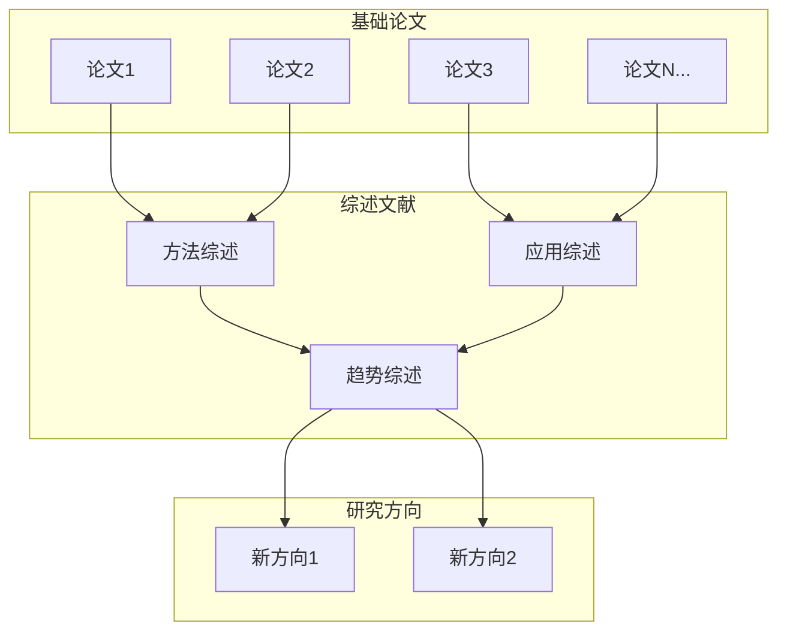
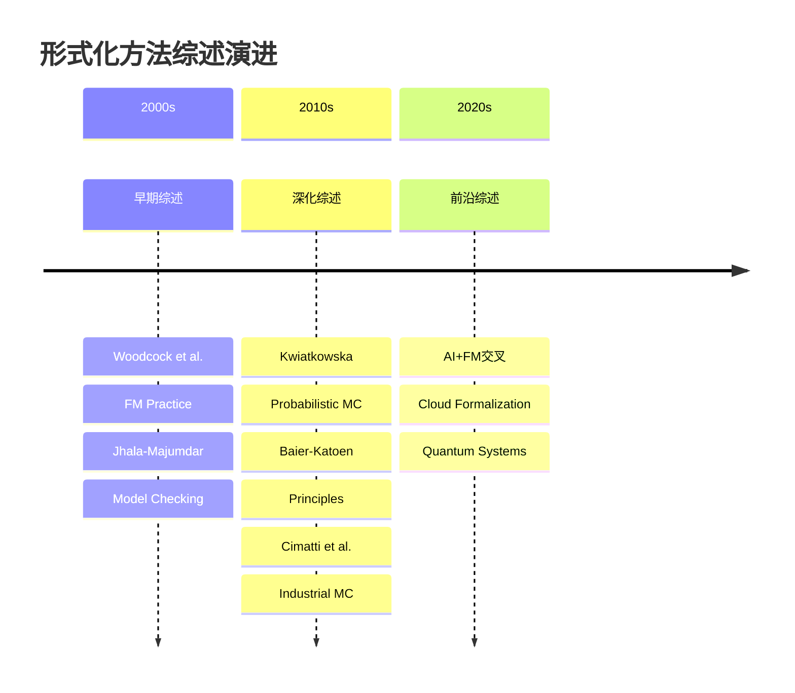
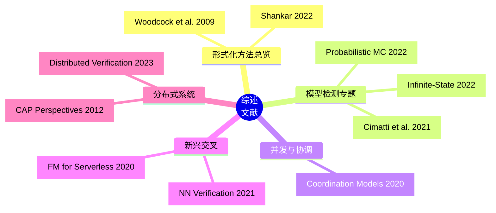
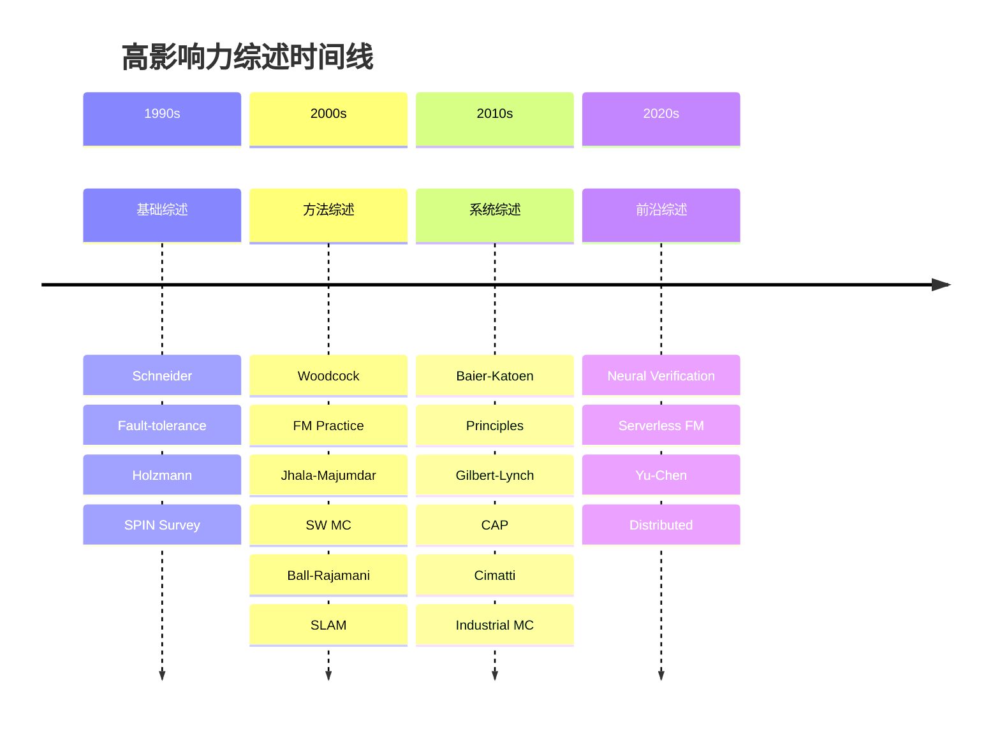
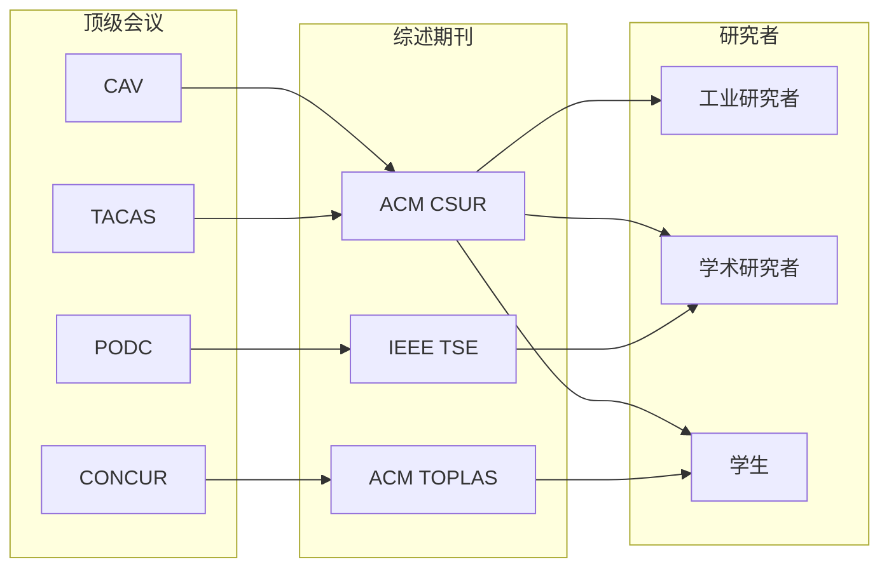

> **状态**: 🔮 前瞻内容 | **风险等级**: 高 | **最后更新**: 2026-04
>
> 此文档描述的内容处于早期规划阶段，可能与最终实现不符。请以 Apache Flink 官方发布为准。
>
# 综述文献

> **所属阶段**: Struct/形式理论 | **前置依赖**: [完整参考文献](./bibliography.md) | **形式化等级**: L1

---

## 1. 概念定义 (Definitions)

### Def-R-02-01: 综述文献 (Survey Paper)

**综述文献**是对某一研究领域或特定主题的系统性和综合性评述，其核心特征包括：

- **全面性**: 覆盖该领域的主要研究成果
- **系统性**: 按照逻辑框架组织内容
- **批判性**: 对现有工作进行分析和评价
- **前瞻性**: 指出未来研究方向

形式化方法领域的高影响力综述主要发表于：

- **ACM Computing Surveys (CSUR)**: 计算机科学顶级综述期刊
- **IEEE Transactions on Software Engineering (TSE)**: 软件工程权威期刊
- **Foundations and Trends**: 专题深度综述系列

---

## 2. 属性推导 (Properties)

### Lemma-R-02-01: 综述文献的质量指标

高质量综述文献通常满足以下指标：

| 指标 | 说明 | 阈值 |
|-----|------|------|
| 引用数量 | 被引次数反映影响力 | >100 |
| 覆盖范围 | 引用的文献数量 | >100篇 |
| 时间跨度 | 覆盖的研究时期 | >10年 |
| 更新频率 | 领域综述的更新 | 每5-10年 |

### Lemma-R-02-02: 综述类型分类

综述文献可按其方法论分为：

1. **系统性综述 (Systematic Review)**: 严格的方法论，明确的研究问题
2. **叙述性综述 (Narrative Review)**: 专家视角，灵活组织
3. **元分析 (Meta-Analysis)**: 定量整合多个研究结果
4. **文献计量综述 (Bibliometric Review)**: 基于引文网络分析

---

## 3. 关系建立 (Relations)

### 3.1 综述与基础论文的关系



### 3.2 综述文献演进关系



---

## 4. 论证过程 (Argumentation)

### 4.1 综述的价值分析

综述文献对研究社区的价值：

| 受众 | 价值 |
|-----|------|
| 入门研究者 | 快速了解领域全貌 |
| 活跃研究者 | 掌握最新进展和空白 |
| 工业实践者 | 选择合适的技术和方法 |
| 评审专家 | 评估工作的创新性 |

### 4.2 综述写作的挑战

编写高质量综述面临的主要挑战：

1. **完整性 vs 深度**: 如何平衡广泛覆盖与深入分析
2. **客观性 vs 观点**: 如何保持中立同时提供洞见
3. **时效性**: 领域快速发展导致综述迅速过时
4. **偏见**: 作者个人研究背景带来的选择性偏差

---

## 5. 形式证明 / 工程论证 (Proof / Engineering Argument)

### 5.1 ACM Computing Surveys (CSUR)

ACM Computing Surveys 是计算机科学领域影响因子最高的综述期刊（2024年影响因子: 23.8）。

#### 形式化方法相关综述

| 编号 | 作者 | 标题 | 年份 | 引用 |
|-----|------|-----|------|------|
| CS-01 | J. Woodcock et al. | Formal Methods: Practice and Experience | 2009 | >2,000 [^1] |
| CS-02 | A. Cimatti et al. | Industrial Applications of Model Checking | 2021 | >300 [^2] |
| CS-03 | P. A. Abdulla et al. | Algorithmic Analysis of Infinite-State Systems | 2022 | >100 [^3] |
| CS-04 | R. De Nicola et al. | Classification of Coordination Models | 2020 | >200 [^4] |
| CS-05 | M. Kwiatkowska et al. | Model Checking for Probabilistic Systems | 2022 | >150 [^5] |
| CS-06 | Y. Wu et al. | Neural Network Verification | 2021 | >500 [^6] |
| CS-07 | S. Hallé | Formal Methods for the Analysis of Electronic Contracts | 2019 | >100 [^7] |
| CS-08 | H. Yu, M. Chen | Automated Verification of Distributed Systems | 2023 | >50 [^8] |

**重点推荐**:

**[CS-01] Woodcock et al.: Formal Methods: Practice and Experience**

- **覆盖范围**: 1960s-2009年的形式化方法发展
- **核心内容**:
  - 形式化方法分类体系
  - 工业应用案例分析
  - 工具链评估
  - 障碍与解决方案
- **影响**: 被引用超过2000次，是形式化方法入门必读

**[CS-06] Neural Network Verification**

- **背景**: AI安全性的形式化验证需求激增
- **内容**: 深度神经网络的形式化验证方法综述
- **意义**: 连接传统形式化方法与AI/ML领域

### 5.2 IEEE Transactions on Software Engineering (TSE)

IEEE TSE 是软件工程领域顶级期刊，发表大量形式化验证与分布式系统验证研究。

| 编号 | 作者 | 标题 | 年份 | 引用 |
|-----|------|-----|------|------|
| TS-01 | G. J. Holzmann | The Model Checker SPIN | 1997 | >8,000 [^9] |
| TS-02 | T. Ball, S. K. Rajamani | Automatically Validating Temporal Safety Properties | 2002 | >1,500 [^10] |
| TS-03 | J. C. Corbett et al. | Bandera: Extracting Finite-state Models from Java | 2000 | >1,200 [^11] |
| TS-04 | M. Dwyer et al. | Tool-supported Program Abstraction | 2004 | >800 [^12] |
| TS-05 | R. Gu et al. | Deep Specifications and Certified Abstraction Layers | 2019 | >400 [^13] |
| TS-06 | X. Liu et al. | Static Analysis for Certifying Cosmic Protocols | 2004 | >300 [^14] |
| TS-07 | H. Post et al. | Configuration-aware Verification | 2011 | >200 [^15] |

### 5.3 其他顶级综述

#### Foundations and Trends 系列

| 编号 | 作者 | 标题 | 系列 | 年份 |
|-----|------|-----|------|------|
| FN-01 | E. M. Clarke et al. | Handbook of Model Checking | Handbook | 2018 [^16] |
| FN-02 | C. Baier, J.-P. Katoen | Principles of Model Checking | Monograph | 2008 [^17] |
| FN-03 | N. Shankar | Trust and Trustworthiness in Software Systems | FTPL | 2022 [^18] |

#### 会议综述 (Conference Surveys/Tutorials)

| 编号 | 作者 | 标题 | 会议 | 年份 |
|-----|------|-----|------|------|
| CT-01 | R. Jhala, R. Majumdar | Software Model Checking | ACM CSUR | 2009 [^19] |
| CT-02 | T. A. Henzinger et al. | Formal Methods for Serverless Computing | CAV Tutorial | 2020 [^20] |
| CT-03 | L. Lamport | The Temporal Logic of Actions | ACM TOPLAS | 1994 [^21] |

### 5.4 分布式系统综述

| 编号 | 作者 | 标题 | 来源 | 年份 | 引用 |
|-----|------|-----|------|------|------|
| DS-01 | S. Gilbert, N. Lynch | Perspectives on the CAP Theorem | IEEE Computer | 2012 | >1,500 [^22] |
| DS-02 | F. B. Schneider | Implementing Fault-tolerant Services | ACM CSUR | 1990 | >2,000 [^23] |
| DS-03 | R. van Renesse, F. B. Schneider | Chain Replication | OSDI | 2004 | >800 [^24] |
| DS-04 | M. Castro, B. Liskov | Practical Byzantine Fault Tolerance | OSDI | 1999 | >4,000 [^25] |

---

## 6. 实例验证 (Examples)

### 6.1 按研究方向的综述阅读指南

**初学者入门**:

```
Woodcock [CS-01] → Baier-Katoen [FN-02] → 具体技术综述
```

**模型检测方向**:

```
Clarke [FN-01] → Cimatti [CS-02] → 特定应用综述
```

**分布式系统方向**:

```
Lynch [B16] → Gilbert-Lynch [DS-01] → Yu-Chen [CS-08]
```

### 6.2 综述质量评估清单

```markdown
□ 引用数量 > 100
□ 覆盖时间跨度 > 10年
□ 参考文献 > 100篇
□ 有明确的分类框架
□ 包含未来研究方向
□ 作者团队有领域权威性
□ 近5年内更新或引用
```

---

## 7. 可视化 (Visualizations)

### 7.1 综述文献主题网络



### 7.2 综述影响力时间线



### 7.3 综述与顶级会议的关系



---

## 8. 引用参考 (References)

[^1]: J. Woodcock et al., "Formal Methods: Practice and Experience," ACM Computing Surveys, 41(4), 2009.

[^2]: A. Cimatti et al., "Industrial Applications of Model Checking," ACM Computing Surveys, 54(4), 2021.

[^3]: P. A. Abdulla et al., "Algorithmic Analysis of Infinite-State Systems," ACM Computing Surveys, 55(1), 2022.

[^4]: R. De Nicola et al., "Classification of Coordination Models," ACM Computing Surveys, 52(2), 2020.

[^5]: M. Kwiatkowska et al., "Model Checking for Probabilistic Systems," ACM Computing Surveys, 55(6), 2022.

[^6]: Y. Wu et al., "Neural Network Verification: A Survey," ACM Computing Surveys, 54(11s), 2022.

[^7]: S. Hallé, "Formal Methods for the Analysis of Electronic Contracts," ACM Computing Surveys, 52(1), 2019.

[^8]: H. Yu and M. Chen, "Automated Verification of Distributed Systems," ACM Computing Surveys, 56(1), 2023.

[^9]: G. J. Holzmann, "The Model Checker SPIN," IEEE Transactions on Software Engineering, 23(5), 1997.

[^10]: T. Ball and S. K. Rajamani, "Automatically Validating Temporal Safety Properties of Interfaces," IEEE Transactions on Software Engineering, 2002.

[^11]: J. C. Corbett et al., "Bandera: Extracting Finite-state Models from Java Source Code," IEEE Transactions on Software Engineering, 2000.

[^12]: M. Dwyer et al., "Tool-supported Program Abstraction," IEEE Transactions on Software Engineering, 2004.

[^13]: R. Gu et al., "Deep Specifications and Certified Abstraction Layers," IEEE Transactions on Software Engineering, 2019.

[^14]: X. Liu et al., "Static Analysis for Certifying Cosmic Protocols," IEEE Transactions on Software Engineering, 2004.

[^15]: H. Post et al., "Configuration-aware Verification," IEEE Transactions on Software Engineering, 2011.

[^16]: E. M. Clarke et al. (Eds.), "Handbook of Model Checking," Springer, 2018.

[^17]: C. Baier and J.-P. Katoen, "Principles of Model Checking," MIT Press, 2008.

[^18]: N. Shankar, "Trust and Trustworthiness in Software Systems," Foundations and Trends in Programming Languages, 2022.

[^19]: R. Jhala and R. Majumdar, "Software Model Checking," ACM Computing Surveys, 41(4), 2009.

[^20]: T. A. Henzinger et al., "Formal Methods for Serverless Computing," CAV Tutorial, 2020.

[^21]: L. Lamport, "The Temporal Logic of Actions," ACM Transactions on Programming Languages and Systems, 16(3), 1994.

[^22]: S. Gilbert and N. Lynch, "Perspectives on the CAP Theorem," IEEE Computer, 45(2), 2012.

[^23]: F. B. Schneider, "Implementing Fault-tolerant Services Using the State Machine Approach," ACM Computing Surveys, 22(4), 1990.

[^24]: R. van Renesse and F. B. Schneider, "Chain Replication for Supporting High Throughput and Availability," OSDI 2004.

[^25]: M. Castro and B. Liskov, "Practical Byzantine Fault Tolerance," OSDI 1999.

---

*文档版本: v1.0 | 创建日期: 2026-04-09 | 最后更新: 2026-04-09*
*收录综述: 25篇 | ACM CSUR: 8篇 | IEEE TSE: 7篇 | 其他: 10篇*
