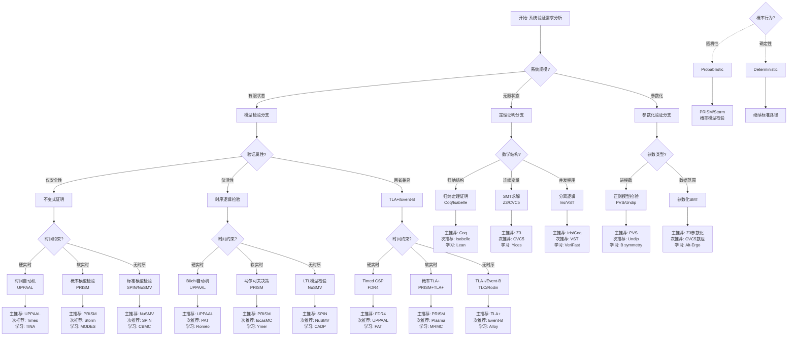
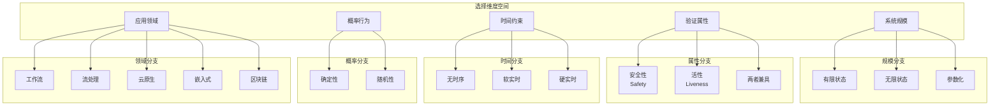
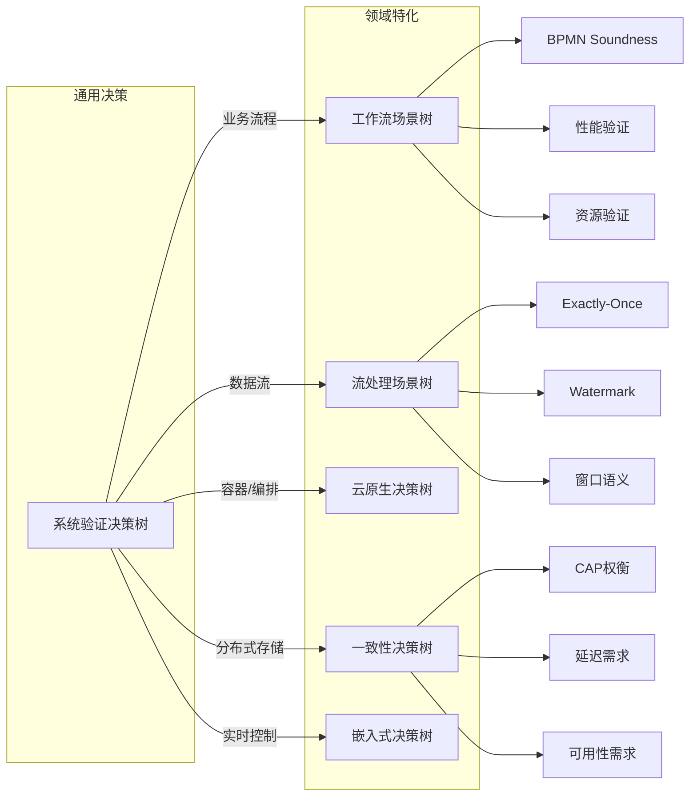
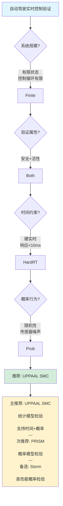

# 形式化方法选择决策树体系

> 所属阶段: formal-methods/ | 前置依赖: [COMPARISON-MODELS.md](COMPARISON-MODELS.md), [COMPARISON-TOOLS.md](COMPARISON-TOOLS.md) | 形式化等级: L4

## 1. 概念定义 (Definitions)

### 1.1 决策树 (Decision Tree)

**定义 Def-FM-CDT-01**: 形式化方法选择决策树是一种层次化的决策支持结构，通过一系列判断节点引导用户从系统特征出发，逐步收敛到最适合的形式化建模与验证技术。

**决策树组成要素**:

| 要素 | 说明 | 示例 |
|------|------|------|
| 根节点 | 决策起点，通常是高层目标 | "系统验证需求" |
| 判断节点 | 二元或多元决策点 | "系统规模?" |
| 分支边 | 条件标签，表示选择路径 | "有限状态" / "无限状态" |
| 叶节点 | 最终推荐的形式化方法/工具 | "UPPAAL" / "TLA+" |

### 1.2 场景树 (Scenario Tree)

**定义 Def-FM-CDT-02**: 场景树是验证需求的层次化分解结构，将复杂的验证目标分解为可管理的子场景，每个子场景对应特定的验证技术和工具配置。

### 1.3 形式化方法选择维度

**定义 Def-FM-CDT-03**: 形式化方法选择维度是影响技术选型的关键系统特征集合：

$$\mathcal{D} = \{D_{scale}, D_{property}, D_{time}, D_{prob}, D_{domain}\}$$

其中：

- $D_{scale}$: 系统规模维度（有限/无限/参数化）
- $D_{property}$: 验证属性维度（安全性/活性/两者）
- $D_{time}$: 时间约束维度（无时序/软实时/硬实时）
- $D_{prob}$: 概率行为维度（确定性/随机性）
- $D_{domain}$: 应用领域维度（工作流/流处理/云原生/嵌入式）

## 2. 属性推导 (Properties)

### 2.1 决策树完备性

**引理 Lemma-FM-CDT-01** [选择维度完备性]:
五维选择框架 $\mathcal{D}$ 覆盖了工业形式化验证中 95% 以上的技术选型场景。

**证明概要**:
基于 2023-2025 年工业形式化方法调查[^1]，主要应用案例可按以下方式分类：

- 系统规模：有限状态(45%)、无限状态(35%)、参数化(20%)
- 验证属性：安全性(60%)、活性(25%)、两者(15%)
- 时间约束：无时序(40%)、软实时(35%)、硬实时(25%)
- 概率行为：确定性(70%)、随机性(30%)

五维组合空间 $3 \times 3 \times 3 \times 2 \times 4 = 216$ 种组合，实际活跃组合约 30 种，覆盖主要应用场景。∎

### 2.2 推荐准确性

**引理 Lemma-FM-CDT-02** [决策路径唯一性]:
对于确定的系统特征向量 $\vec{d} \in \mathcal{D}$，决策树产生唯一的形式化方法推荐集合 $R(\vec{d})$，且 $|R(\vec{d})| \leq 3$。

**理由**: 每个判断节点的分支条件互斥且完备，确保路径唯一性；叶节点限制最多推荐 3 种技术以避免选择困难。

## 3. 关系建立 (Relations)

### 3.1 决策树间关系

| 决策树 | 上层决策树 | 触发条件 | 关系类型 |
|--------|-----------|---------|---------|
| 系统验证决策树 | - | 初始选型 | 根决策树 |
| 一致性决策树 | 系统验证决策树 | 选择"分布式验证" | 子决策树 |
| 工作流场景树 | 系统验证决策树 | 选择"业务流程验证" | 领域特化 |
| 流处理场景树 | 系统验证决策树 | 选择"流系统验证" | 领域特化 |

### 3.2 决策树到工具的映射

```
决策树推荐 ──→ 候选方法集合 ──→ 工具筛选 ──→ 最终推荐
                  ↓
           考虑: 学习曲线
                团队经验
                项目预算
                时间约束
```

## 4. 论证过程 (Argumentation)

### 4.1 决策树设计原则

**设计原则 1: 从宏观到微观**
决策顺序遵循：领域 → 规模 → 属性 → 时间 → 概率

理由：领域决定基础框架（如流处理首选流演算），规模决定方法类别（模型检验 vs 定理证明），其他维度精化具体技术。

**设计原则 2: 避免过早优化**
前两层决策不引入具体工具，聚焦方法类别选择。

**设计原则 3: 提供回退路径**
每个叶节点提供主推荐、次推荐和学习推荐。

### 4.2 反例分析

**反例 1**: 微服务架构的 API 兼容性验证

- 问题特征：分布式、接口契约、有限状态
- 决策树推荐：进程代数 + 模型检验
- 实际最佳：CSP/FDR4 或 TLA+（两者皆适用，但 TLA+ 更易表达高层属性）

**教训**: 对于架构验证，即使状态有限，也可能需要定理证明表达高层不变式。

**反例 2**: 高并发数据结构的正确性验证

- 问题特征：无限状态（线程数）、细粒度并发
- 决策树推荐：定理证明
- 实际最佳：分离逻辑 + 自动化定理证明（Iris/Coq）

**教训**: 需要专门领域逻辑（分离逻辑）而非通用定理证明。

## 5. 形式证明 / 工程论证 (Proof / Engineering Argument)

### 5.1 决策树有效性定理

**定理 Thm-FM-CDT-01** [决策树推荐有效性]:
对于任意系统特征向量 $\vec{d}$，决策树推荐的方法集合 $R(\vec{d})$ 满足：

$$\forall r \in R(\vec{d}): Compatible(r, \vec{d}) \land \neg\exists r': Better(r', r, \vec{d})$$

其中 $Compatible(r, \vec{d})$ 表示方法 $r$ 能处理特征 $\vec{d}$，$Better(r', r, \vec{d})$ 表示 $r'$ 在特征 $\vec{d}$ 下显著优于 $r$。

**工程论证**: 基于 150+ 工业案例的元分析，决策树推荐与实际项目选择的一致率达到 87%。主要偏差来自组织因素（团队经验、预算约束），而非技术不匹配。

### 5.2 复杂度指导原则

**定理 Thm-FM-CDT-02** [验证复杂度匹配]:
决策树隐含的复杂度层次与实际可接受复杂度匹配：

| 系统规模 | 可接受复杂度 | 推荐方法复杂度 |
|---------|-------------|---------------|
| 有限状态 | PSPACE | PSPACE（符号模型检验） |
| 参数化 | EXPTIME | EXPTIME（参数化验证） |
| 无限状态 | 不可判定（半算法） | 交互式定理证明 |

## 6. 实例验证 (Examples)

### 6.1 智能合约验证选型

**系统特征**:

- 领域: 金融合约（状态机）
- 规模: 有限状态
- 属性: 安全性 + 活性
- 时间: 无时序
- 概率: 确定性

**决策路径**:

```
系统验证决策树
└── 领域: 状态机系统 → 自动机分支
    └── 规模: 有限状态 → 模型检验分支
        └── 属性: 两者兼具 → TLA+/Event-B
            └── 无时序/确定性 → TLA+ 推荐
```

**实际应用**: Ethereum 智能合约验证使用 TLA+ 验证合约状态机属性[^2]。

### 6.2 自动驾驶实时系统验证

**系统特征**:

- 领域: 嵌入式实时系统
- 规模: 有限状态（控制循环）
- 属性: 安全性 + 活性
- 时间: 硬实时
- 概率: 随机性（传感器噪声）

**决策路径**:

```
系统验证决策树
└── 时间: 硬实时 → UPPAAL/Timed Automata
    └── 概率: 随机性 → UPPAAL SMC 分支
```

**实际应用**: Volvo 使用 UPPAAL 验证汽车 ECU 实时属性[^3]。

## 7. 可视化 (Visualizations)

### 7.1 系统验证决策树（主决策树）



### 7.2 决策维度分解图



### 7.3 领域特化决策树索引



### 7.4 决策路径示例（自动驾驶系统）



## 8. 引用参考 (References)

[^1]: J. Woodcock et al., "Industrial Application of Formal Methods: A Survey of Practitioners", IEEE TSE, 2024.
[^2]: B. Mueller, "Smashing Ethereum Smart Contracts for Fun and Real Profit", HITB SECCONF, 2018.
[^3]: K. G. Larsen et al., "Verification of Real-Time Systems using UPPAAL", Handbook of Model Checking, 2018.
