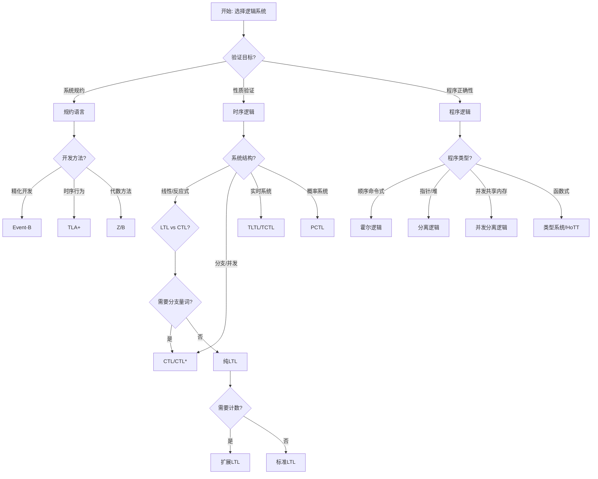
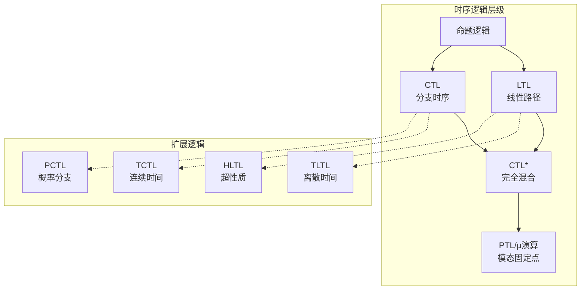
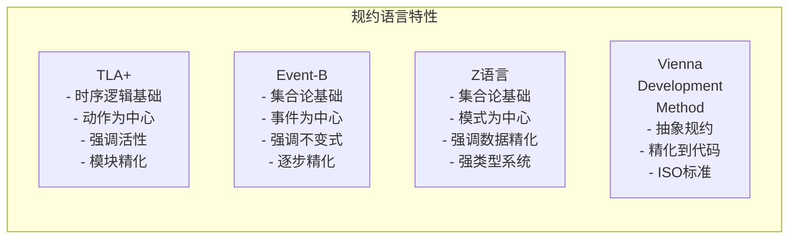
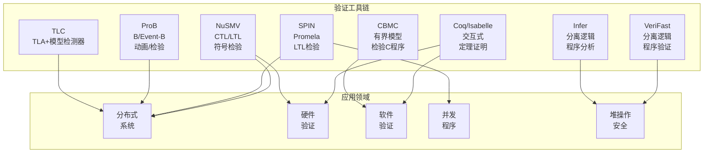

# 逻辑系统对比

> 所属阶段: formal-methods/ | 前置依赖: [01-foundations/LOGIC-FOUNDATIONS.md](01-foundations/LOGIC-FOUNDATIONS.md), [05-verification/TEMPORAL-LOGIC.md](05-verification/TEMPORAL-LOGIC.md) | 形式化等级: L4

## 1. 概念定义 (Definitions)

### 1.1 时序逻辑家族

**定义 Def-S-98-CL-01** [线性时序逻辑 LTL]:
LTL是命题逻辑的时序扩展，公式在计算路径上解释。语法定义为：
$$\phi ::= p \mid \neg\phi \mid \phi \land \psi \mid \mathbf{X}\phi \mid \phi \mathbf{U} \psi$$
其中 $\mathbf{X}$ 是"下一个"算子，$\mathbf{U}$ 是"直到"算子。

**派生算子**:

- $\mathbf{F}\phi \equiv \text{true} \mathbf{U} \phi$ (最终)
- $\mathbf{G}\phi \equiv \neg\mathbf{F}\neg\phi$ (总是)
- $\phi \mathbf{R} \psi \equiv \neg(\neg\phi \mathbf{U} \neg\psi)$ (释放)

**定义 Def-S-98-CL-02** [计算树逻辑 CTL]:
CTL是分支时序逻辑，公式在计算树上解释，每个时序算子必须立即被一个路径量词前缀：
$$\phi ::= p \mid \neg\phi \mid \phi \land \psi \mid \mathbf{A}\phi \mid \mathbf{E}\phi \mid \mathbf{AX}\phi \mid \mathbf{EX}\phi \mid \mathbf{A}[\phi \mathbf{U} \psi] \mid \mathbf{E}[\phi \mathbf{U} \psi]$$

**定义 Def-S-98-CL-03** [CTL*]:
CTL*是LTL和CTL的并集，允许任意混合路径量词和时序算子：
$$\text{状态公式 } \phi ::= p \mid \neg\phi \mid \phi \land \psi \mid \mathbf{A}\psi \mid \mathbf{E}\psi$$
$$\text{路径公式 } \psi ::= \phi \mid \neg\psi \mid \psi_1 \land \psi_2 \mid \mathbf{X}\psi \mid \psi_1 \mathbf{U} \psi_2$$

### 1.2 程序逻辑

**定义 Def-S-98-CL-04** [霍尔逻辑 Hoare Logic]:
霍尔逻辑是用于证明程序正确性的形式系统，基于霍尔三元组：
$$\{P\} C \{Q\}$$
表示如果在执行命令 $C$ 前置条件 $P$ 成立，则执行后后置条件 $Q$ 成立。

**推理规则**:

| 规则名 | 形式 | 说明 |
|-------|------|------|
| 赋值公理 | $\{Q[e/x]\} x:=e \{Q\}$ | 前置条件替换 |
| 顺序组合 | $\frac{\{P\}C_1\{R\}, \{R\}C_2\{Q\}}{\{P\}C_1;C_2\{Q\}}$ | 中间断言传递 |
| 条件规则 | $\frac{\{P \land b\}C_1\{Q\}, \{P \land \neg b\}C_2\{Q\}}{\{P\}\text{if } b \text{ then } C_1 \text{ else } C_2\{Q\}}$ | 分支覆盖 |
| 循环规则 | $\frac{\{I \land b\}C\{I\}}{\{I\}\text{while } b \text{ do } C\{I \land \neg b\}}$ | 循环不变式 |

**定义 Def-S-98-CL-05** [分离逻辑 Separation Logic]:
分离逻辑是霍尔逻辑的扩展，用于推理指针操作和可变数据结构，引入分离合取 $*$：
$$P * Q \text{ 表示 } P \text{ 和 } Q \text{ 在不相交的内存区域成立}$$

**关键原则**:

- **局部性**: 只操作被引用的内存
- **框架规则**: $\frac{\{P\}C\{Q\}}{\{P * R\}C\{Q * R\}}$（修改不触及 $R$）
- **分离蕴含**: $P \multimap Q$ 表示"如果扩展 $P$ 则得到 $Q$"

### 1.3 规约语言

**定义 Def-S-98-CL-06** [TLA+]:
TLA+ (Temporal Logic of Actions) 是基于时序逻辑和动作逻辑的规约语言，核心公式形式：
$$\text{Spec} == \text{Init} \land \Box[\text{Next}]_v \land \text{TemporalConditions}$$

**特征**:

- 状态由变量赋值描述
- 动作是状态对的谓词
- $[A]_v \equiv A \lor (v' = v)$（动作或变量不变）
- 模块化和细化支持

**定义 Def-S-98-CL-07** [Event-B]:
Event-B是基于B方法的规约方法，使用抽象机和精化开发系统：

```
MACHINE Name
SEES/EXTENDS Context
VARIABLES v
INVARIANT I
EVENTS
  EventName
  WHEN guard
  THEN action
  END
END
```

## 2. 属性推导 (Properties)

### 2.1 时序逻辑表达能力

**引理 Lemma-S-98-CL-01** [LTL与CTL不可比较]:
存在LTL可表达但CTL不可表达的公式，反之亦然。

**证明**:

- LTL有CTL无: $\mathbf{FG}p$（最终总是 $p$）
  - 在CTL中，$\mathbf{AF}\mathbf{AG}p$ 不等价，因为路径可能交错
- CTL有LTL无: $\mathbf{AG}\mathbf{EF}p$（从任何状态都可到达 $p$）
  - 这是分支性质，LTL在单路径上解释 ∎

**引理 Lemma-S-98-CL-02** [CTL*包含关系]:
$$\text{LTL} \subset \text{CTL*} \text{ 且 } \text{CTL} \subset \text{CTL*}$$
且 CTL* 真包含两者的并集。

### 2.2 逻辑完备性对比

| 逻辑系统 | 完备性 | 可判定性 | 自动机对应 |
|---------|-------|---------|-----------|
| 命题逻辑 | 完备 | 可判定(NP-c) | 布尔电路 |
| 一阶逻辑 | 不完备(Gödel) | 半可判定 | - |
| LTL | 完备 | 可判定(PSPACE-c) | Büchi自动机 |
| CTL | 完备 | 可判定(P) | 交替树自动机 |
| CTL* | 完备 | 可判定(2EXPTIME) | 树自动机 |
| 霍尔逻辑 | 相对完备(Cook) | 半可判定 | - |
| 分离逻辑 | 不完备 | 可判定(片段) | - |

## 3. 关系建立 (Relations)

### 3.1 逻辑到自动机的翻译

**命题 Prop-S-98-CL-01** [LTL到Büchi自动机]:
对任意LTL公式 $\phi$，存在等价的Büchi自动机 $A_\phi$，其状态数为 $2^{O(|\phi|)}$。

**构造概要**:

1. 构造公式 closure 集合
2. 定义原子命题的赋值
3. 构建状态为最大一致集合的自动机
4. 定义接受条件基于直到算子的满足

**命题 Prop-S-98-CL-02** [CTL到树自动机]:
CTL模型检测等价于交替Büchi树自动机的空性检测。

### 3.2 程序逻辑与霍尔逻辑的关系

| 程序逻辑 | 与霍尔逻辑关系 | 扩展点 |
|---------|--------------|-------|
| 最弱前置条件 | 霍尔逻辑的函数式重构 | 谓词变换器语义 |
| 最强后置条件 | 对偶构造 | 后向推理 |
| 动态逻辑 | 模态扩展 | $\langle C \rangle P$ 和 $[C]P$ |
| 分离逻辑 | 内存推理扩展 | 分离合取 $*$ |
| 并发分离逻辑 | 并发扩展 | $*$ 资源 + 并发推理 |

## 4. 论证过程 (Argumentation)

### 4.1 性质分类与逻辑选择

**安全/活性性质分类**:

| 性质类型 | 定义 | LTL表达 | CTL表达 |
|---------|------|--------|--------|
| 不变式 | 总是成立 | $\mathbf{G}\neg\text{bad}$ | $\mathbf{AG}\neg\text{bad}$ |
| 最终性 | 最终会 | $\mathbf{F}\text{good}$ | $\mathbf{AF}\text{good}$ |
| 响应性 | 请求必响应 | $\mathbf{G}(req \rightarrow \mathbf{F}ack)$ | $\mathbf{AG}(req \rightarrow \mathbf{AF}ack)$ |
| 稳定性 | 最终稳定 | $\mathbf{FG}\text{stable}$ | 不可表达 |
| 公平性 | 弱/强公平 | $\mathbf{GF}\text{enabled} \rightarrow \mathbf{GF}\text{executed}$ | 部分可表达 |
| 可达性 | 可到达某状态 | 不可直接表达 | $\mathbf{EF}\text{target}$ |

### 4.2 反例与边界

**反例 1**: 不能用LTL表达的典型性质

- 性质: "从任何状态都可以到达复位状态"
- 尝试: $\mathbf{G}\mathbf{F}\text{reset}$ 表示"总是最终会复位"，而非"可到达"
- 原因: LTL沿着固定路径评估，无法量化所有路径

**反例 2**: 霍尔逻辑的局限性

- 场景: 并发程序的非干扰性验证
- 问题: 霍尔三元组无法表达环境不干扰
- 解决: 需要依赖/保证逻辑或并发分离逻辑

## 5. 形式证明 / 工程论证 (Proof / Engineering Argument)

### 5.1 模型检测复杂度定理

**定理 Thm-S-98-CL-01** [LTL模型检测复杂度]:
对Kripke结构 $K$ 和LTL公式 $\phi$，检验 $K \models \phi$ 是PSPACE完全的。

**证明概要**:

- 上界: 构造 $A_{\neg\phi}$ (指数大小)，然后检验 $L(K) \cap L(A_{\neg\phi}) = \emptyset$
- 下界: 从通用性问题的PSPACE难性归约 ∎

**定理 Thm-S-98-CL-02** [CTL模型检测复杂度]:
对Kripke结构 $K$ 和CTL公式 $\phi$，检验 $K \models \phi$ 可在多项式时间内完成。

**证明概要**:
算法从子公式向内评估：

- 原子命题: 标记满足状态
- 布尔组合: 集合操作
- $\mathbf{EX}\phi$: 前驱状态计算
- $\mathbf{EG}\phi$: SCC检测
- $\mathbf{E}[\phi \mathbf{U} \psi]$: 不动点计算 ∎

**定理 Thm-S-98-CL-03** [CTL*模型检测复杂度]:
CTL*模型检测是2EXPTIME完全的。

### 5.2 证明器完备性

**定理 Thm-S-98-CL-04** [霍尔逻辑相对完备性]:
霍尔逻辑在表达能力充分的断言语言下是相对完备的，即：
$$\models \{P\}C\{Q\} \implies \vdash \{P\}C\{Q\}$$

**条件**: 断言语言能表达最弱前置条件。

## 6. 实例验证 (Examples)

### 6.1 互斥协议性质对比表达

**Peterson算法性质**:

| 性质 | LTL | CTL | 自然语言 |
|------|-----|-----|---------|
| 互斥 | $\mathbf{G}\neg(c_1 \land c_2)$ | $\mathbf{AG}\neg(c_1 \land c_2)$ | 两进程永不同在临界区 |
| 无死锁 | $\mathbf{G}(t_1 \rightarrow \mathbf{F}c_1)$ | $\mathbf{AG}(t_1 \rightarrow \mathbf{AF}c_1)$ | 尝试必进入 |
| 公平性 | $\mathbf{G}(t_1 \rightarrow \mathbf{F}c_1)$ | $\mathbf{AG}(t_1 \rightarrow \mathbf{AF}c_1)$ | 无限次尝试必进入 |
| 可达性 | - | $\mathbf{EF}(c_1 \land c_2)$ | 检查是否能违反互斥 |

### 6.2 链表操作验证

**分离逻辑规范**:

```
// 链表节点表示
list(x) ≡ x = null ∨ ∃y. x ↦ [next: y] * list(y)

// 在头部插入
{list(x)}
code: new_node->next = x; return new_node;
{list(ret) ∧ ret ≠ null}

// 框架规则应用
{list(x) * tree(y)}  // 不变式
insert(x, v);
{list(x) * tree(y)}  // tree(y) 保持不变
```

### 6.3 TLA+ vs Event-B 实例

**生产者-消费者问题**:

**TLA+ 规约**:

```tla
VARIABLES buffer, p_pos, c_pos

Init == buffer = <<>> ∧ p_pos = 0 ∧ c_pos = 0

Produce(v) ==
  ∧ Len(buffer) < N
  ∧ buffer' = Append(buffer, v)
  ∧ p_pos' = p_pos + 1
  ∧ UNCHANGED c_pos

Consume ==
  ∧ Len(buffer) > 0
  ∧ buffer' = Tail(buffer)
  ∧ c_pos' = c_pos + 1
  ∧ UNCHANGED p_pos

Next == ∃v ∈ Values : Produce(v) ∨ Consume

Safety == c_pos ≤ p_pos  // 不消费超过生产
Liveness == p_pos = c_pos + N ↝ c_pos = p_pos  // 消费者最终追赶
```

**Event-B 规约**:

```eventb
MACHINE ProducerConsumer
VARIABLES buffer, p_count, c_count
INVARIANT
  buffer ⊆ VALUES ∧
  card(buffer) ≤ N ∧
  c_count ≤ p_count

EVENT Produce
  ANY v
  WHERE v ∈ VALUES \ buffer ∧ card(buffer) < N
  THEN buffer := buffer ∪ {v} || p_count := p_count + 1
END

EVENT Consume
  ANY v
  WHERE v ∈ buffer
  THEN buffer := buffer \ {v} || c_count := c_count + 1
END
END
```

**对比分析**:

- TLA+: 强调时序性质和活性，基于TLA逻辑
- Event-B: 强调不变式和精化，基于集合论

## 7. 可视化 (Visualizations)

### 7.1 逻辑选择决策树



### 7.2 时序逻辑包含关系



### 7.3 规约方法对比矩阵



### 7.4 工具链生态系统



## 8. 引用参考 (References)
