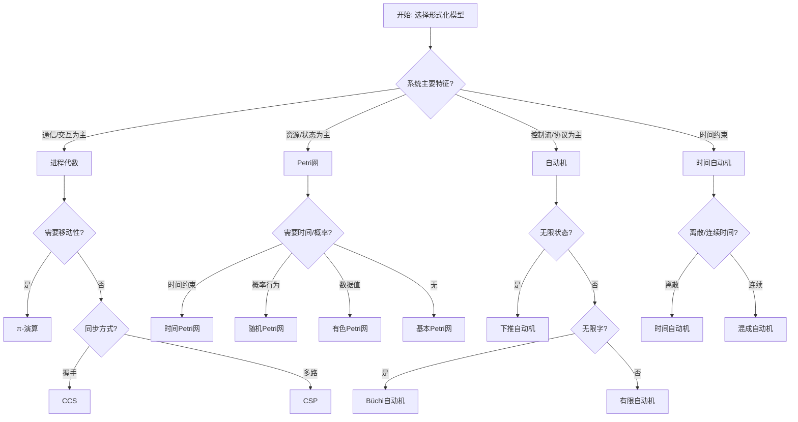
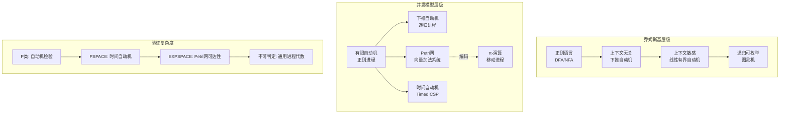
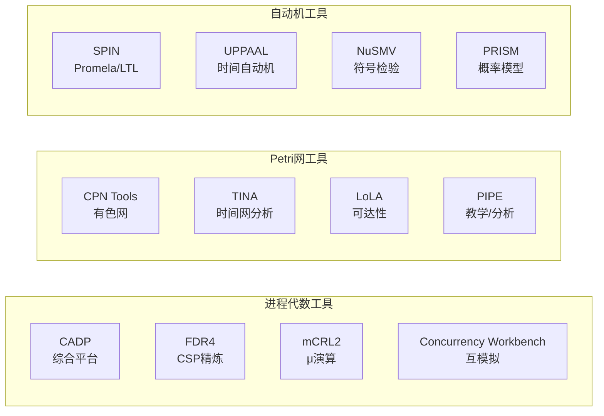
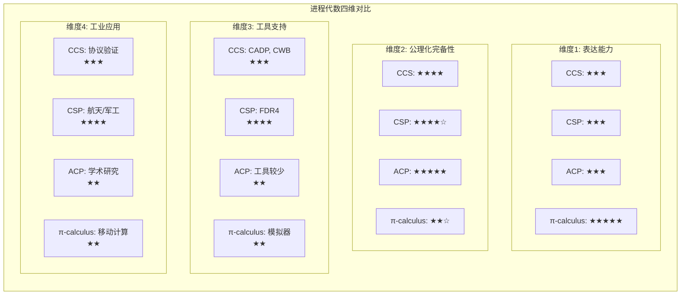
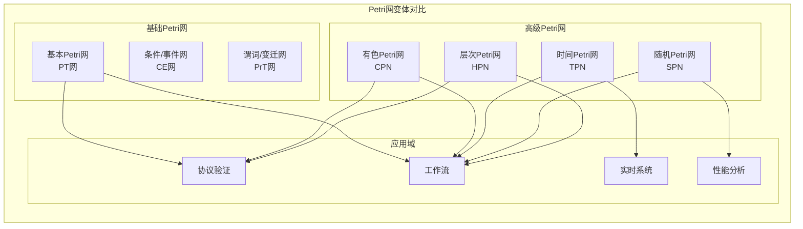
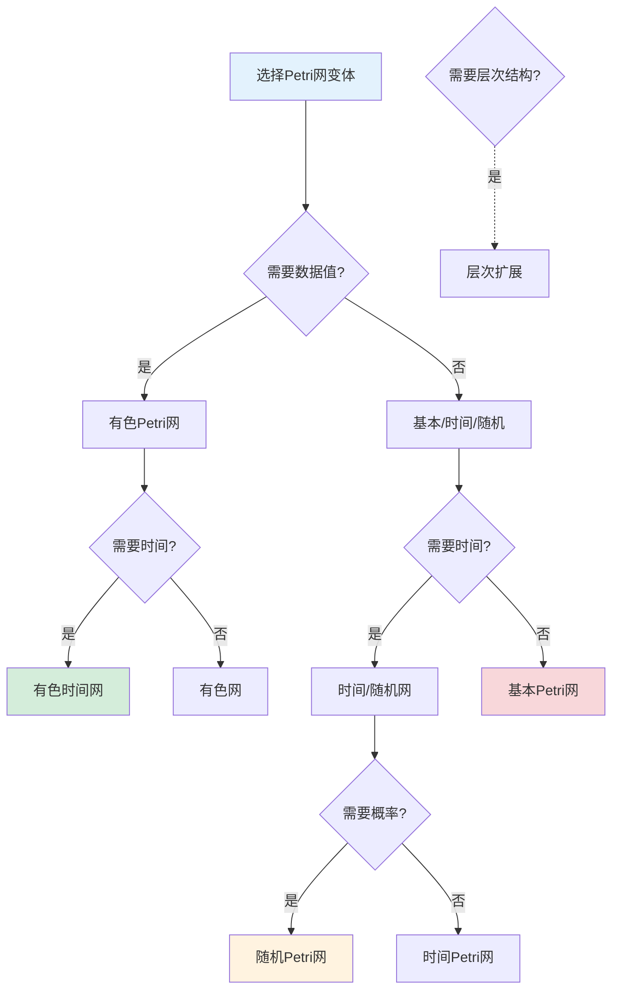

# 形式化模型对比矩阵

> 所属阶段: formal-methods/ | 前置依赖: [01-foundations/README.md](01-foundations/README.md), [03-model-taxonomy/README.md](03-model-taxonomy/README.md) | 形式化等级: L4

## 1. 概念定义 (Definitions)

### 1.1 进程代数 (Process Algebra)

**定义 Def-FM-CM-01**: 进程代数是一类用于描述并发系统通信行为的形式化语言，基于代数方法通过操作符组合进程。

**核心特征**:

- 基于动作的语义模型
- 组合性：复杂进程由基本进程通过操作符构建
- 互模拟等价作为主要语义等价关系
- 强调进程间的交互与通信

**主要分支**:

| 分支 | 核心操作符 | 特征 |
|------|-----------|------|
| CCS (Milner) | `a.P`, `P\|Q`, `P+Q`, `P\L` | 同步通信，无显式信道名传递 |
| CSP (Hoare) | `a→P`, `P⫴Q`, `P⊓Q`, `P\\A` | 基于迹/失败的语义，多路同步 |
| π-演算 | `a(x).P`, `ā⟨b⟩.P`, `νx.P` | 移动性，信道作为一等公民 |
| ACP | `P·Q`, `P‖Q`, `∂H(P)` | 公理化方法，强调代数结构 |

### 1.2 Petri网 (Petri Nets)

**定义 Def-FM-CM-02**: Petri网是一种图形化的分布式系统建模工具，由库所(Place)、变迁(Transition)和弧(Arc)组成，用于描述系统的状态变化和并发行为。

**形式化定义**:
一个Petri网是一个五元组 $N = (P, T, F, W, M_0)$，其中：

- $P$ 是库所（状态）的有限集合
- $T$ 是变迁（事件）的有限集合，$P \cap T = \emptyset$
- $F \subseteq (P \times T) \cup (T \times P)$ 是流关系（弧）
- $W: F \rightarrow \mathbb{N}^+$ 是权重函数
- $M_0: P \rightarrow \mathbb{N}$ 是初始标识

**变体类型**:

| 变体 | 扩展特征 | 典型应用 |
|------|---------|---------|
| 有色Petri网 (CPN) | 带类型的令牌 | 协议验证 |
| 时间Petri网 | 时间约束 | 实时系统 |
| 随机Petri网 | 随机触发率 | 性能分析 |
| 层次Petri网 | 子网抽象 | 复杂系统建模 |

### 1.3 自动机理论 (Automata Theory)

**定义 Def-FM-CM-03**: 自动机是计算过程的抽象数学模型，由状态集合、输入字母表、转移函数、初始状态和接受状态组成。

**形式化定义**:
有限自动机是一个五元组 $A = (Q, \Sigma, \delta, q_0, F)$，其中：

- $Q$ 是有限状态集合
- $\Sigma$ 是有限输入字母表
- $\delta: Q \times \Sigma \rightarrow 2^Q$ 是转移函数
- $q_0 \in Q$ 是初始状态
- $F \subseteq Q$ 是接受状态集合

**扩展模型**:

| 模型 | 特征 | 表达能力 |
|------|------|---------|
| DFA | 确定性转移 | 正则语言 |
| NFA | 非确定性转移 | 正则语言 |
| Büchi自动机 | 无限字上的接受条件 | ω-正则语言 |
| 时间自动机 | 时钟约束 | 定时语言 |
| 概率自动机 | 概率转移 | 概率语言 |
| 下推自动机 | 栈存储 | 上下文无关语言 |

## 2. 属性推导 (Properties)

### 2.1 表达能力层次

**引理 Lemma-FM-CM-01** [表达能力包含关系]:
设 $\mathcal{L}_{REG}$、$\mathcal{L}_{CFG}$、$\mathcal{L}_{CS}$、$\mathcal{L}_{RE}$ 分别表示正则、上下文无关、上下文敏感和递归可枚举语言类，则有：
$$\mathcal{L}_{REG} \subset \mathcal{L}_{CFG} \subset \mathcal{L}_{CS} \subset \mathcal{L}_{RE}$$

**证明**: 由乔姆斯基层级理论直接可得。∎

**引理 Lemma-FM-CM-02** [进程代数与自动机关系]:
任何有限状态进程代数表达式都等价于一个有限自动机，反之亦然。

**证明概要**:

- (⇒) 对进程表达式结构归纳，每个操作符对应自动机构造：
  - $a.P$ → 添加新状态和新转移
  - $P+Q$ → 自动机并集（带新初始状态）
  - $P\|Q$ → 自动机同步积
- (⇐) 将自动机状态视为进程变量，转移视为动作前缀 ∎

### 2.2 并发语义对比

| 特性 | 进程代数 | Petri网 | 自动机 |
|------|---------|---------|--------|
| **真并发** | 否（交错语义） | 是（并发变迁） | 否（交错语义） |
| **因果关联** | 显式（动作序列） | 显式（令牌流） | 隐式（状态序列） |
| **冲突表示** | 选择操作符 | 共享输入库所 | 非确定性转移 |
| **同步机制** | 握手/多路同步 | 变迁触发条件 | 同步积构造 |
| **状态空间** | 可能无限 | 可能无限 | 有限/无限 |

## 3. 关系建立 (Relations)

### 3.1 模型间形式化关系

**命题 Prop-FM-CM-01** [Petri网到自动机的转换]:
任何有限库所/变迁的Petri网都可以转换为一个等价的Büchi自动机，但会丢失真并发信息。

**命题 Prop-FM-CM-02** [进程代数到Petri网的转换]:
存在从CCS到Petri网的结构保持转换，使得：

- 进程对应网结构
- 动作对应变迁
- 并发组合对应网的并发语义

**转换算法概要**:

```
T(P + Q) = 共享输入库所的并行网
T(P | Q) = 同步积网
T(a.P) = 变迁a连接到T(P)
T(0) = 终止库所
```

### 3.2 语义保持映射

| 源模型 | 目标模型 | 保持性质 | 丢失信息 |
|--------|---------|---------|---------|
| CCS | LTS | 强互模拟 | 无 |
| Petri网 | 展开LTS | 可达性 | 真并发 |
| Timed Automata | Zone Graph | 时间可达性 | 具体时间值 |
| π-演算 | 环境自动机 | 行为等价 | 结构信息 |

## 4. 论证过程 (Argumentation)

### 4.1 模型选择决策因素

**场景分析矩阵**:

| 决策因素 | 推荐模型 | 理由 |
|---------|---------|------|
| 强调通信协议 | 进程代数 | 消息传递是原生概念 |
| 资源共享分析 | Petri网 | 库所自然表示资源 |
| 性质验证效率 | 自动机 | 成熟工具链支持 |
| 动态拓扑 | π-演算 | 移动性支持 |
| 时间约束 | 时间自动机 | 时钟区域抽象 |
| 概率行为 | 随机Petri网/MDP | 概率语义原生支持 |

### 4.2 反例分析

**反例 1**: 不适合用进程代数建模的场景

- 具有复杂资源竞争的生产线系统
- 原因：资源容量约束需要显式计数，而基本进程代数缺乏计数能力

**反例 2**: 不适合用基本Petri网建模的场景

- 需要动态创建/销毁进程的系统
- 原因：Petri网结构静态，需要高级网（如有色Petri网）

## 5. 形式证明 / 工程论证 (Proof / Engineering Argument)

### 5.1 可判定性对比定理

**定理 Thm-FM-CM-01** [模型检验可判定性]:
对于不同形式化模型，关键验证问题的可判定性如下：

| 问题 | 有限自动机 | Petri网 | 进程代数 | 时间自动机 |
|------|-----------|---------|---------|-----------|
| 可达性 | 可判定(P) | 可判定(EXPSPACE) | 不可判定 | 可判定(PSPACE) |
| 模型检验(LTL) | 可判定(P) | 不可判定 | 不可判定 | 可判定(PSPACE) |
| 互模拟 | 可判定(P) | 可判定 | 不可判定 | 不可判定 |
| 语言包含 | 可判定(P) | 不可判定 | 不可判定 | 不可判定 |

**证明概要**:

- 有限自动机：经典结果，基于状态空间遍历
- Petri网可达性：Mayr/Kosaraju算法，EXPSPACE复杂度
- 进程代数：编码停机问题证明不可判定性
- 时间自动机：区域构造将无限状态空间转化为有限 ∎

### 5.2 复杂度对比分析

**定理 Thm-FM-CM-02** [验证复杂度下界]:
设 $n$ 为系统规模，各模型的最坏情况复杂度为：

| 操作/验证 | 自动机 | Petri网 | CCS |
|-----------|--------|---------|-----|
| 空性检测 | $O(n)$ | $O(n^3)$ | 不可判定 |
| 等价检验 | $O(n \log n)$ | 2-EXPSPACE | 不可判定 |
| 合成 | $O(n^2)$ | 多项式空间 | - |
| 最小化 | $O(n \log n)$ | 困难 | - |

## 6. 实例验证 (Examples)

### 6.1 哲学家就餐问题对比建模

**进程代数建模 (CCS)**:

```
Phil(i) = think_i.Phil(i) + pickL_i.pickR_i.eat_i.putL_i.putR_i.Phil(i)
Fork(i) = pickL_i.putL_i.Fork(i) + pickR_i.putR_i.Fork(i)
System = (Phil(0) | ... | Phil(n-1) | Fork(0) | ... | Fork(n-1)) \\ {pick,put}
```

**Petri网建模**:

```
库所: Thinking_i, Eating_i, ForkAvailable_i
变迁: PickLeft_i, PickRight_i, PutDown_i, Think_i
弧: 标准连接表示资源流
```

**分析对比**:

- 进程代数：死锁检测通过互模拟检验
- Petri网：死锁检测通过可达性分析（网中有陷阱/信标结构）

### 6.2 协议验证实例

**AB协议建模对比**:

| 方面 | 自动机方法 | 进程代数方法 |
|------|-----------|-------------|
| 模型大小 | 2^10 状态 | 20行代码 |
| 验证性质 | LTL公式 | 互模拟检验 |
| 工具 | SPIN | CADP |
| 验证时间 | <1s | <1s |

## 7. 可视化 (Visualizations)

### 7.1 模型选择决策树



### 7.2 表达能力层次图



### 7.3 工具支持对比矩阵



### 7.4 多维能力对比矩阵

**模型表达能力 × 可判定性 × 工具支持 × 工业应用**

| 模型 | 表达能力 | 可判定性 | 工具支持 | 工业应用 | 综合评分 |
|------|---------|---------|---------|---------|---------|
| **有限自动机** | ★★☆☆☆ | ★★★★★ | ★★★★★ | ★★★★☆ | 14/20 |
| **Petri网** | ★★★★☆ | ★★★★☆ | ★★★★☆ | ★★★☆☆ | 13/20 |
| **时间自动机** | ★★★★☆ | ★★★★☆ | ★★★★★ | ★★★★☆ | 17/20 |
| **CCS** | ★★★☆☆ | ★★☆☆☆ | ★★★☆☆ | ★★☆☆☆ | 10/20 |
| **CSP** | ★★★☆☆ | ★★☆☆☆ | ★★★★☆ | ★★★☆☆ | 11/20 |
| **π-演算** | ★★★★★ | ★☆☆☆☆ | ★★☆☆☆ | ★★☆☆☆ | 10/20 |
| **TLA+** | ★★★★★ | ★★☆☆☆ | ★★★☆☆ | ★★★★★ | 15/20 |
| **Event-B** | ★★★★☆ | ★★☆☆☆ | ★★★☆☆ | ★★★☆☆ | 10/20 |
| **分离逻辑** | ★★★★☆ | ★★☆☆☆ | ★★☆☆☆ | ★★★☆☆ | 9/20 |

**评分说明**:

- 表达能力: 描述复杂系统的能力
- 可判定性: 验证问题的可判定程度
- 工具支持: 成熟工具的数量和易用性
- 工业应用: 实际工业项目采用度

### 7.5 CCS/CSP/ACP/π-calculus 四维能力矩阵



**详细能力对比表**:

| 能力维度 | CCS | CSP | ACP | π-calculus |
|---------|-----|-----|-----|-----------|
| **通信模型** | 握手同步 | 多路同步 | 多路同步 | 移动信道 |
| **组合操作符** | 完备集 | 完备集 | 完备集+辅助 | 完备集 |
| **互模拟理论** | 强/弱互模拟 | 精化序 | 公理化等价 | 环境互模拟 |
| **递归处理** | 直接递归 | 直接递归 | 直接递归 | 递归+复制 |
| **高阶能力** | 无 | 无 | 无 | 进程传递 |
| **工具链成熟度** | 中等 | 高 | 低 | 低 |
| **学习曲线** | 中等 | 陡峭 | 陡峭 | 陡峭 |
| **教学采用度** | 高 | 高 | 中 | 中 |

### 7.6 Petri网变体对比矩阵



**Petri网变体能力矩阵**:

| 变体 | 数据值 | 时间 | 概率 | 层次 | 可判定性 | 典型工具 | 应用领域 |
|------|-------|------|------|------|---------|---------|---------|
| **基本Petri网** | ✗ | ✗ | ✗ | ✗ | EXPSPACE | LoLA, PEP | 协议验证 |
| **有色Petri网** | ✓ | ✗ | ✗ | ✗ | 不可判定 | CPN Tools | 复杂协议 |
| **时间Petri网** | ✗ | ✓ | ✗ | ✗ | 不可判定 | TINA, TAPAAL | 实时系统 |
| **随机Petri网** | ✗ | ✓ | ✓ | ✗ | 数值分析 | TimeNET | 性能分析 |
| **有色时间Petri网** | ✓ | ✓ | ✗ | ✗ | 不可判定 | CPN Tools | 实时协议 |
| **层次Petri网** | ✓ | ✓ | ✓ | ✓ | 不可判定 | CPN Tools | 复杂系统 |

**变体选择决策**:



### 7.7 工业应用趋势矩阵

| 形式化方法 | 2015 | 2020 | 2025 | 趋势 | 主要采用者 |
|-----------|------|------|------|------|-----------|
| **TLA+** | ★★☆ | ★★★ | ★★★★★ | ↑↑↑ | AWS, Azure, Google |
| **Coq/Isabelle** | ★★☆ | ★★★ | ★★★★ | ↑↑ | 安全关键系统 |
| **SPIN** | ★★★ | ★★★ | ★★★☆ | → | 嵌入式系统 |
| **UPPAAL** | ★★★ | ★★★★ | ★★★★☆ | ↑ | 汽车/航空 |
| **FDR4** | ★★★ | ★★★☆ | ★★★☆ | → | 军工/航天 |
| **分离逻辑** | ★☆☆ | ★★☆ | ★★★☆ | ↑↑ | 系统软件 |

## 8. 引用参考 (References)
