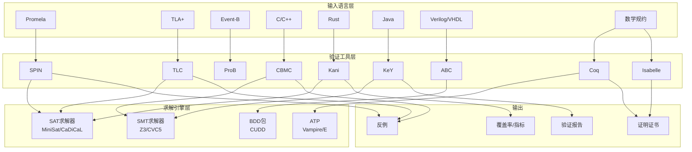
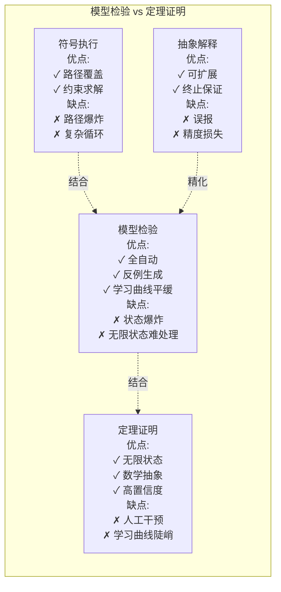
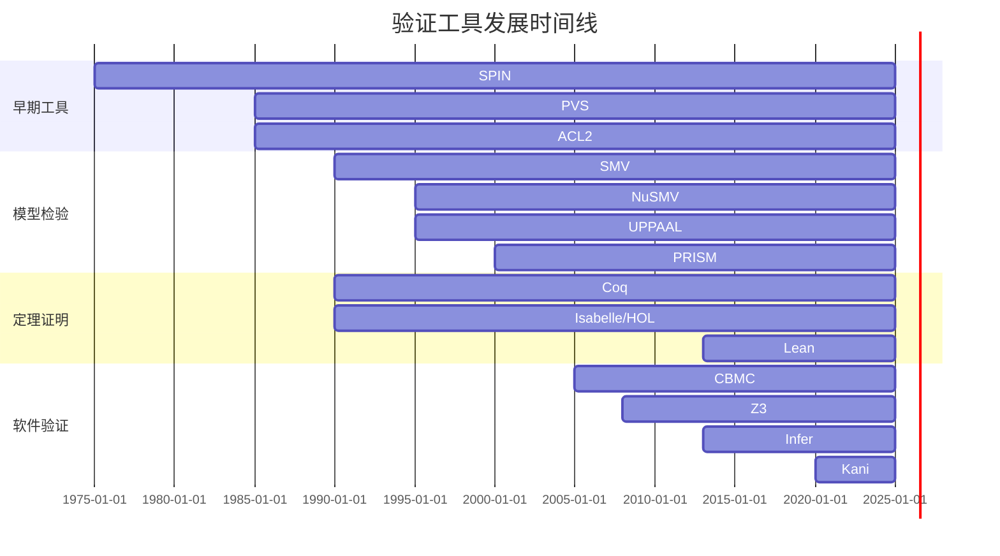

# 验证工具对比

> 所属阶段: formal-methods/ | 前置依赖: [06-tools/README.md](06-tools/README.md), [COMPARISON-MODELS.md](COMPARISON-MODELS.md), [COMPARISON-LOGICS.md](COMPARISON-LOGICS.md) | 形式化等级: L3

## 1. 概念定义 (Definitions)

### 1.1 模型检验工具分类

**定义 Def-FM-CT-01** [显式状态模型检验]:
显式状态模型检验通过显式枚举和存储可达状态空间来验证系统性质，适用于小规模到中等规模系统。

**核心特征**:

- 状态空间显式存储（哈希表/位图）
- 深度优先或广度优先搜索
- 支持反例生成
- 状态爆炸问题显著

**定义 Def-FM-CT-02** [符号模型检验]:
符号模型检验使用布尔函数（如BDD）或SAT/SMT求解器隐式表示状态集合，可处理更大规模系统。

**核心技术**:

- 二叉决策图 (BDD)
- 布尔可满足性求解 (SAT)
- 可满足性模理论 (SMT)
- 谓词抽象

**定义 Def-FM-CT-03** [有界模型检验 BMC]:
有界模型检验将模型检验问题转换为给定界限 $k$ 内的可满足性检验：
$$\text{ unfold } k \text{ steps: } I(s_0) \land \bigwedge_{i=0}^{k-1} T(s_i, s_{i+1}) \land \bigvee_{i=0}^{k} \neg P(s_i)$$
若不可满足，则性质在 $k$ 步内成立（可能需要完备性检验）。

### 1.2 定理证明工具分类

**定义 Def-FM-CT-04** [自动定理证明器 ATP]:
自动定理证明器尝试无需用户干预即可证明定理，通常针对特定逻辑片段优化。

| 工具 | 逻辑 | 应用领域 |
|------|------|---------|
| Vampire | 一阶逻辑 | 数学、软件验证 |
| E Prover | 一阶逻辑 | 等式推理 |
| Z3 | SMT | 程序验证、测试生成 |
| CVC5 | SMT | 硬件/软件验证 |

**定义 Def-FM-CT-05** [交互式定理证明器 ITP]:
交互式定理证明器提供人机协作环境，用户指导证明策略，系统处理细节验证。

| 工具 | 基础逻辑 | 特色功能 |
|------|---------|---------|
| Coq | 归纳构造演算 | 程序提取、依赖类型 |
| Isabelle/HOL | 高阶逻辑 | 自动化策略、可读证明 |
| Lean 4 | 依赖类型 | 现代化、数学库 |
| Agda | 依赖类型 | 证明即程序 |
| ACL2 | 递归函数论 | 工业级验证 |

**定义 Def-FM-CT-06** [ satisfiability modulo theories (SMT) ]:
SMT求解器决定一阶逻辑公式在组合理论背景下的可满足性，支持：

- 线性/非线性算术
- 位向量
- 数组
- 未解释函数
- 代数数据类型

## 2. 属性推导 (Properties)

### 2.1 工具能力矩阵

**引理 Lemma-FM-CT-01** [工具能力边界]:
没有任何单一工具能同时满足以下所有条件：全自动、完全、可处理无限状态系统、高效。

**工具能力权衡**:

| 特性 | 显式MC | 符号MC | BMC | ITP |
|------|--------|--------|-----|-----|
| 自动化程度 | 高 | 高 | 高 | 低 |
| 完整性保证 | 有 | 有 | 需扩展 | 有 |
| 无限状态处理 | 否 | 部分 | 否 | 是 |
| 可扩展性 | 10^6-10^8状态 | 10^20+状态 | 大规模 | 理论上无限制 |
| 反例生成 | 是 | 是 | 是 | 否（构造性证明） |
| 证明证书 | 无 | 无 | 无 | 有 |

### 2.2 复杂度与可判定性

| 工具类型 | 理论基础 | 最坏情况复杂度 | 典型问题 |
|---------|---------|--------------|---------|
| SAT求解器 | NP完全 | 指数 | 布尔可满足性 |
| SMT求解器 | 依赖理论 | NP到不可判定 | 算术、数组等 |
| BDD操作 | PSPACE | 多项式空间 | 符号模型检验 |
| 一阶ATP | 半可判定 | 不可判定 | 一般定理证明 |
| ITP | 依赖逻辑 | 人工指导 | 数学/程序证明 |

## 3. 关系建立 (Relations)

### 3.1 工具与技术映射

**命题 Prop-FM-CT-01** [工具-逻辑对应关系]:

| 工具 | 支持的逻辑/输入语言 | 核心技术 |
|------|------------------|---------|
| SPIN | Promela + LTL | 显式状态、偏序规约 |
| NuSMV | SMV (CTL/LTL) | BDD符号检验 |
| UPPAAL | 时间自动机 + TCTL | DBM、区域构造 |
| PRISM | MDP/CTMC + PCTL | 数值计算 |
| TLC | TLA+ | 显式状态、对称性约简 |
| CBMC | C程序 + 断言 | 有界模型检验 |
| Kani | Rust程序 | 有界模型检验 |
| VeriFast | C/Java + 分离逻辑 | 符号执行 |

### 3.2 工具生态系统关系

```
┌─────────────────────────────────────────────────────────────┐
│                    形式化验证工具栈                          │
├─────────────────────────────────────────────────────────────┤
│  应用层: 协议验证 ←→ 程序验证 ←→ 硬件验证 ←→ 数学证明        │
├─────────────────────────────────────────────────────────────┤
│  语言层: Promela, TLA+, B方法, C/Java/Rust规范               │
├─────────────────────────────────────────────────────────────┤
│  逻辑层: LTL/CTL, 霍尔逻辑, 分离逻辑, 时序逻辑                │
├─────────────────────────────────────────────────────────────┤
│  算法层: 模型检验, 定理证明, 符号执行, 抽象解释               │
├─────────────────────────────────────────────────────────────┤
│  引擎层: SAT求解器, SMT求解器, BDD包, 自动推理                │
└─────────────────────────────────────────────────────────────┘
```

## 4. 论证过程 (Argumentation)

### 4.1 工具选择决策因素

**决策矩阵**:

| 评估维度 | 权重 | SPIN | NuSMV | TLC | Coq | Z3 |
|---------|-----|------|-------|-----|-----|-----|
| 易用性 | 20% | ★★★★ | ★★★ | ★★★★ | ★★ | ★★★ |
| 自动化 | 25% | ★★★★★ | ★★★★★ | ★★★★ | ★★ | ★★★★★ |
| 表达能力 | 20% | ★★★ | ★★★ | ★★★★ | ★★★★★ | ★★★ |
| 可扩展性 | 15% | ★★★ | ★★★★ | ★★★ | ★★★★★ | ★★★★ |
| 社区支持 | 10% | ★★★★ | ★★★ | ★★★ | ★★★★ | ★★★★★ |
| 工业应用 | 10% | ★★★★ | ★★★ | ★★★ | ★★★★ | ★★★★★ |

**场景推荐**:

| 应用场景 | 推荐工具 | 理由 |
|---------|---------|------|
| 通信协议验证 | SPIN/TLA+ | 进程/时序表达能力强 |
| 硬件设计验证 | NuSMV/ABC | 符号检验处理大规模状态 |
| 实时系统 | UPPAAL | 时间自动机原生支持 |
| 概率系统 | PRISM/Storm | 概率模型检验专业工具 |
| C程序验证 | CBMC/Frama-C | 直接分析源代码 |
| Rust验证 | Kani/Prusti | 针对Rust内存安全 |
| 安全关键软件 | Coq/Isabelle | 高保证证明证书 |
| 自动测试生成 | Z3/CVC5 | SMT求解快速约束求解 |

### 4.2 反例与局限

**反例 1**: 模型检验的局限

- 场景: 验证参数化系统（N个进程）
- 问题: 状态空间随N指数增长
- 解决方案: 使用定理证明（Coq）或参数化验证（如网络不变量）

**反例 2**: 定理证明的局限

- 场景: 快速原型验证
- 问题: 交互式证明耗时长
- 解决方案: 先用模型检验发现明显错误，再定理证明核心性质

## 5. 形式证明 / 工程论证 (Proof / Engineering Argument)

### 5.1 验证方法学组合

**定理 Thm-FM-CT-01** [组合验证的有效性]:
对于复杂系统，组合使用轻量级和重量级验证技术比单一技术更有效。

**证据**:

- Amazon AWS使用TLA+发现系统级设计错误
- seL4微内核使用Isabelle证明功能正确性
- Microsoft使用Boogie/Z3验证驱动程序

### 5.2 工具链集成模式

**集成架构模式**:

| 模式 | 描述 | 实例 |
|------|------|------|
| 分层验证 | 高层模型检验 → 低层定理证明 | CompCert编译器 |
| 反例引导 | MC发现错误 → 修复 → ITP证明 | 协议验证 |
| SMT嵌入 | ITP调用SMT求解简单目标 | Sledgehammer (Isabelle) |
| 条件检验 | 符号执行生成验证条件 → SMT | Boogie/Why3 |
| 契约检查 | 运行时检查 + 静态验证 | CodeContracts (已停用) |

## 6. 实例验证 (Examples)

### 6.1 互斥协议验证实例

**SPIN验证 Peterson算法**:

```promela
#define N 2
bool flag[N];
byte turn;

active [N] proctype P() {
  pid i = _pid;
  pid j = 1 - _pid;

  do ::
    flag[i] = true;
    turn = j;
    (flag[j] == false || turn == i);

    /* 临界区 */
    cs: skip;

    flag[i] = false;
    /* 非临界区 */
  od
}

/* LTL性质 */
#define in_cs (P[0]@cs + P[1]@cs)
ltl mutex { [](in_cs <= 1) }
ltl liveness { []((P[0]@flag[0]=true) -> <>(P[0]@cs)) }
```

**TLC验证**:

```tla
MODULE Peterson
VARIABLES flag, turn, pc

degs == 0..1
other(i) == IF i = 0 THEN 1 ELSE 0

Init ==
  ∧ flag = [i ∈ degs ↦ FALSE]
  ∧ turn ∈ degs
  ∧ pc = [i ∈ degs ↦ "idle"]

Enter(i) ==
  ∧ pc[i] = "idle"
  ∧ flag' = [flag EXCEPT ![i] = TRUE]
  ∧ turn' = other(i)
  ∧ pc' = [pc EXCEPT ![i] = "wait"]
  ∧ UNCHANGED ⟨⟩

Wait(i) ==
  ∧ pc[i] = "wait"
  ∧ (flag[other(i)] = FALSE ∨ turn = i)
  ∧ pc' = [pc EXCEPT ![i] = "cs"]
  ∧ UNCHANGED ⟨flag, turn⟩

... (* Exit和Idle类似 *)

Safety == ∀i,j ∈ degs : (i ≠ j) ⇒ ¬(pc[i] = "cs" ∧ pc[j] = "cs")
```

**验证结果对比**:

| 工具 | 验证时间 | 内存使用 | 发现错误 |
|------|---------|---------|---------|
| SPIN | 0.1s | 10MB | 无 |
| TLC | 0.5s | 50MB | 无 |
| NuSMV | 0.2s | 20MB | 无 |

### 6.2 C程序验证实例

**CBMC验证数组边界**:

```c
#include <assert.h>
#define N 100

int sum(int arr[], int n) {
  __CPROVER_assume(n >= 0 && n <= N);
  int total = 0;
  for (int i = 0; i < n; i++) {
    total += arr[i];
  }
  return total;
}

void main() {
  int arr[N];
  int n;
  int result = sum(arr, n);
  // CBMC自动检查数组访问在边界内
}
```

**Frama-C/ACSL验证**:

```c
/*@ requires n >= 0 && n <= 100;
    requires \valid_read(arr + (0..n-1));
    assigns \nothing;
    ensures \result == \sum(0, n-1, \lambda integer i; arr[i]);
*/
int sum(int arr[], int n);
```

### 6.3 定理证明实例

**Isabelle/HOL证明列表性质**:

```isabelle
theory ListRev
imports Main
begin

fun rev :: "'a list ⇒ 'a list" where
  "rev [] = []"
| "rev (x#xs) = rev xs @ [x]"

fun itrev :: "'a list ⇒ 'a list ⇒ 'a list" where
  "itrev [] ys = ys"
| "itrev (x#xs) ys = itrev xs (x#ys)"

lemma itrev_rev: "itrev xs ys = rev xs @ ys"
  apply(induct xs arbitrary: ys)
  apply(auto)
  done

lemma "itrev xs [] = rev xs"
  by(simp add: itrev_rev)

end
```

## 7. 可视化 (Visualizations)

### 7.1 工具选择决策树

```mermaid
flowchart TD
    A[开始: 选择验证工具] --> B{系统类型?}

    B -->|通信/并发协议| C[模型检验工具]
    B -->|软件程序| D{程序语言?}
    B -->|硬件设计| E[硬件验证工具]
    B -->|数学/算法| F[定理证明器]
    B -->|实时/嵌入式| G[专用验证工具]

    C --> C1{状态空间规模?}
    C1 -->|小规模| C2[SPIN]
    C1 -->|大规模| C3[NuSMV/NuXMV]
    C1 -->|分布式协议| C4[TLC/Apalache]

    D --> D1{C/C++}
    D1 -->|全自动| D2[CBMC/ESBMC]
    D1 -->|契约验证| D3[Frama-C]
    D1 -->|内存安全| D4[Infer/Separator]

    D --> D5{Java}
    D5 -->|契约| D6[OpenJML/KeY]
    D5 -->|空指针| D7[Infer/NullAway]

    D --> D8{Rust}
    D8 -->[Kani/Prusti]

    D --> D9{函数式}
    D9 -->|Haskell| D10[HSCV/QuickCheck]
    D9 -->|OCaml| D11[Coq提取]

    E --> E1[符号检验: ABC/AVY]
    E --> E2[等价检验: Yosys]
    E --> E3[定理证明: ACL2]

    F --> F1{证明风格?}
    F1 -->|高自动化| F2[Isabelle/HOL]
    F1 -->|程序提取| F3[Coq]
    F1 -->|现代体验| F4[Lean 4]
    F1 -->|依赖类型| F5[Agda/Idris]

    G --> G1{实时性?}
    G1 -->|硬实时| G2[UPPAAL]
    G1 -->|概率| G3[PRISM/Storm]
    G1 -->|混合系统| G4[SpaceEx/dReach]
```

### 7.2 工具生态系统图



### 7.3 验证方法对比雷达图



### 7.4 工具成熟度时间线



## 8. 引用参考 (References)
