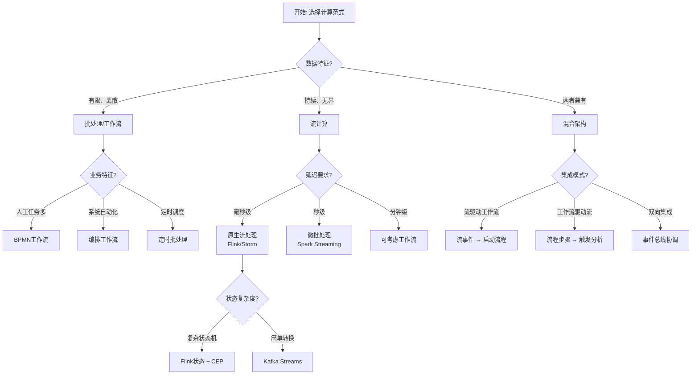
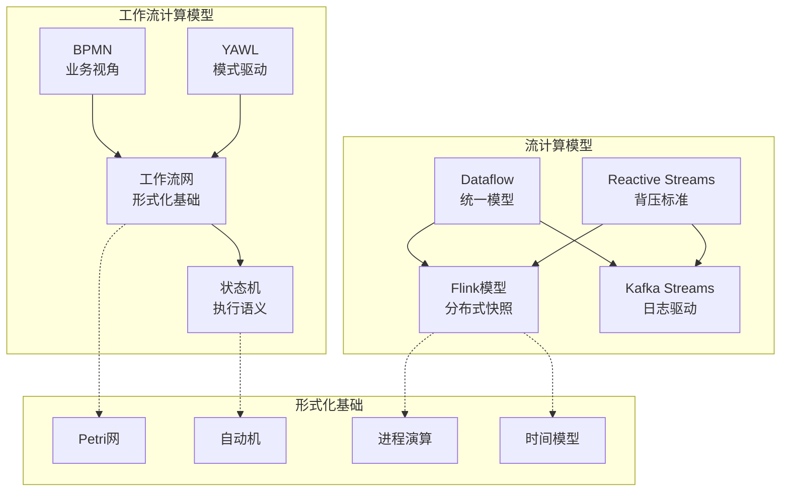
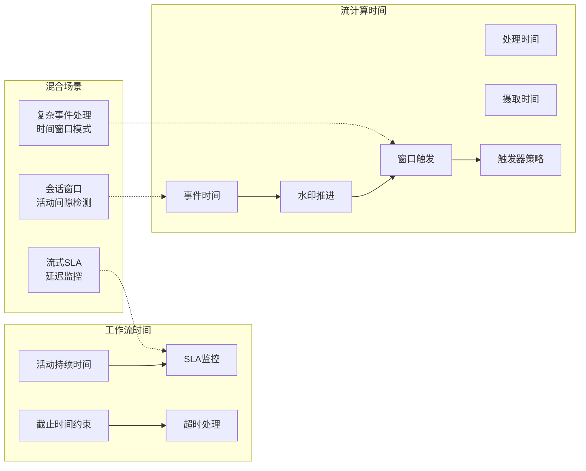
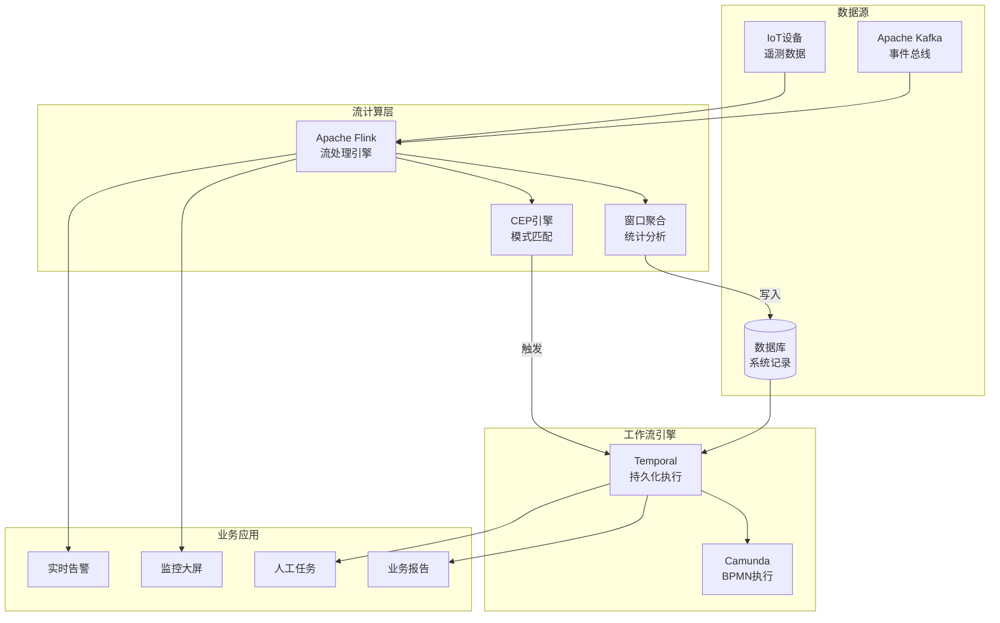
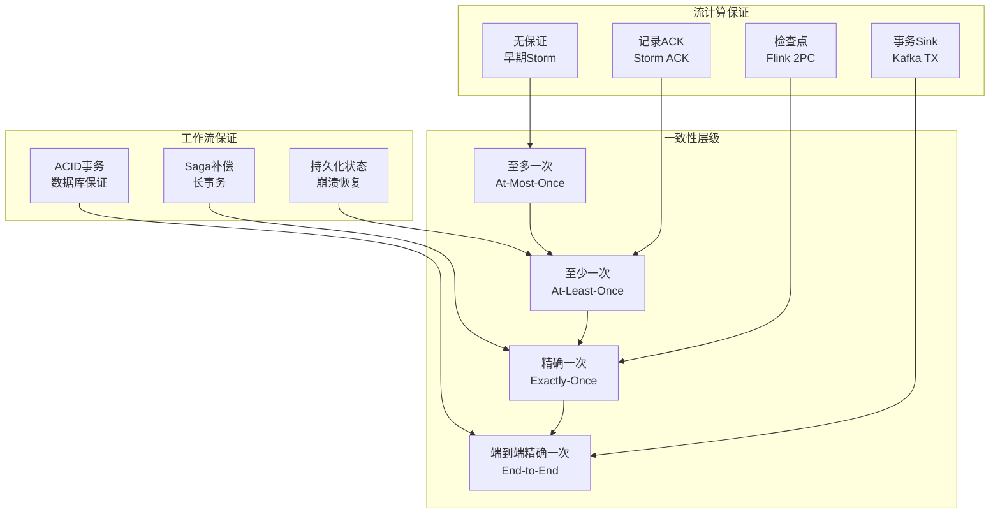

# 工作流与流计算对比

> 所属阶段: formal-methods/ | 前置依赖: [04-application-layer/WORKFLOW-SEMANTICS.md](04-application-layer/WORKFLOW-SEMANTICS.md), [Flink/](../Flink/README.md) | 形式化等级: L4

## 1. 概念定义 (Definitions)

### 1.1 工作流计算模型

**定义 Def-S-98-CWS-01** [工作流系统 Workflow System]:
工作流系统是一种用于自动化执行业务流程的软件系统，通过明确定义的步骤序列协调人员、系统和信息。

**形式化特征**:

- **控制流**: 定义活动执行顺序（顺序、并行、选择、循环）
- **数据流**: 定义活动间数据传递
- **资源分配**: 任务到人/系统的分配规则
- **状态持久化**: 长时间运行的状态管理

**定义 Def-S-98-CWS-02** [工作流模式 Workflow Patterns]:
工作流模式是业务流程中常见的控制流结构集合，Russell等人识别了43种基本模式：

| 类别 | 模式示例 | 形式化语义 |
|------|---------|-----------|
| 基本控制流 | 顺序、并行分支、同步 | Petri网变迁触发 |
| 高级分支同步 | 多选、多合并 | OR-split/OR-join |
| 多实例 | 设计时/运行时确定实例数 | 参数化网 |
| 状态基础 | 延迟选择、交叉并行 | 有色Petri网 |
| 取消 | 活动/案例取消 | 重置弧/抑制弧 |

**定义 Def-S-98-CWS-03** [BPMN形式化语义]:
BPMN (Business Process Model and Notation) 可通过映射到形式化模型获得语义：

```
BPMN元素 → Petri网构造
- 任务 → 变迁
- 事件 → 库所或变迁
- 网关 → 控制流构造
  - 排他网关 → 选择结构
  - 并行网关 → AND-split/AND-join
  - 包容网关 → OR-split/OR-join
```

### 1.2 流计算模型

**定义 Def-S-98-CWS-04** [流计算 Stream Processing]:
流计算是一种处理无界、持续到达数据流的计算范式，强调低延迟、高吞吐和持续计算。

**核心抽象**:

- **无界流**: 理论上无限持续的数据序列
- **事件时间 vs 处理时间**: 数据产生时间 vs 系统处理时间
- **窗口**: 将无界流切分为有限块（滚动、滑动、会话）
- **水印**: 事件时间进度的启发式度量

**定义 Def-S-98-CWS-05** [Dataflow模型]:
Dataflow模型是流计算的统一抽象，由Google提出，核心概念：

| 概念 | 定义 | 形式化 |
|------|------|--------|
| 什么计算 | 变换操作 (ParDo/GroupByKey) | 函数 $f: Input \rightarrow Output$ |
| 在哪组 | 窗口策略 | 时间区间集合 |
| 何时物化 | 触发器策略 | 水印条件 + 延迟容忍 |
| 如何修正 | 累加模式 | 丢弃/累积/累积撤回 |

**定义 Def-S-98-CWS-06** [时间语义分类]:

| 语义类型 | 特征 | 典型系统 |
|---------|------|---------|
| 至多一次 | 可能丢失数据 | 早期Storm |
| 至少一次 | 可能重复处理 | Kafka Streams |
| 精确一次 | 恰好处理一次 | Flink, exactly-once Kafka |
| 端到端精确一次 | 包含Sink的完整保证 | Flink + 幂等/事务Sink |

## 2. 属性推导 (Properties)

### 2.1 计算模型对比

**引理 Lemma-S-98-CWS-01** [工作流 vs 流计算状态空间]:
工作流系统通常具有有限但复杂的状态空间，而流计算系统具有简单但无限的状态空间。

**形式化**:

- 工作流: 状态空间由控制流位置和数据值决定，$|States| = O(2^{|places|} \times |data|)$
- 流计算: 状态空间由窗口内容和算子状态决定，持续演化

**引理 Lemma-S-98-CWS-02** [语义等价性]:
工作流中的并行网关语义等价于流计算中的并行流合并，但触发机制不同。

**证明概要**:

- BPMN并行网关: 等待所有分支完成
- 流计算合并: 基于水印或触发器
- 等价条件: 当水印对齐所有分区时行为一致 ∎

### 2.2 时间模型对比

| 维度 | 工作流 | 流计算 |
|------|--------|--------|
| **时间基础** | 活动持续时间、截止时间 | 事件时间、处理时间、摄取时间 |
| **时序保证** | 活动完成顺序 | 事件顺序、乱序处理 |
| **延迟容忍** | SLA驱动的超时 | 水印延迟、允许迟到数据 |
| **调度粒度** | 任务级别 | 记录/微批级别 |
| **状态时效** | 持久到完成 | 窗口生命周期管理 |

## 3. 关系建立 (Relations)

### 3.1 形式化方法对应关系

**命题 Prop-S-98-CWS-01** [工作流到Petri网的保行为映射]:
任何良好结构的BPMN模型都可映射到行为等价的Petri网。

**映射要点**:

- 结构化循环 → 循环网结构
- 取消区域 → 抑制弧或重置网
- 事件子流程 → 额外的初始库所

**命题 Prop-S-98-CWS-02** [流计算的时序逻辑规约]:
流计算性质可用度量时序逻辑 (Metric Temporal Logic, MTL) 表达：

| 性质 | MTL公式 | 说明 |
|------|--------|------|
| 延迟约束 | $\square_{[0,T]}(input \rightarrow \diamond_{[0,D]}output)$ | 响应时间不超过D |
| 吞吐量 | 统计性质 | 需扩展STL |
| 无序处理 | $\neg\square(input_i \land \bigcirc input_j \rightarrow i < j)$ | 允许乱序 |

### 3.2 系统边界与交互

**工作流-流计算集成模式**:

| 模式 | 描述 | 应用场景 |
|------|------|---------|
| 工作流驱动流 | BPMN调用流处理作业 | 业务流程触发实时分析 |
| 流驱动工作流 | 流事件启动工作流实例 | 异常检测触发审批流程 |
| 混合编排 | 两者协同 | IoT设备管理 |

## 4. 论证过程 (Argumentation)

### 4.1 适用场景分析

**选择工作流当**:

- 流程涉及人工任务和审批
- 需要长期运行（天/周/月）
- 状态需要审计和恢复
- 控制流复杂（多层级、异常处理）

**选择流计算当**:

- 数据量巨大且持续到达
- 需要亚秒级延迟
- 计算主要面向转换和聚合
- 水平扩展是关键需求

**边界模糊场景**:

- 复杂事件处理 (CEP): 两者都有解决方案
- 长时间运行的流分析: Flink状态 + 检查点
- 事务性流处理: 事务Sink + 恰好一次语义

### 4.2 形式化验证挑战

**工作流验证**:

- 死锁/活锁检测: Petri网可达性分析
- 数据一致性: 霍尔逻辑证明
- 资源约束: 时间Petri网分析

**流计算验证**:

- 时间正确性: 时间自动机模型检测
- 一致性语义: TLA+规约TLA+模型检测
- 检查点一致性: 分布式快照形式化证明

## 5. 形式证明 / 工程论证 (Proof / Engineering Argument)

### 5.1 语义等价定理

**定理 Thm-S-98-CWS-01** [窗口聚合与工作流批处理的等价性]:
给定有限数据集合，滚动窗口聚合在语义上等价于批处理工作流中的聚合活动。

**形式化**:
设 $D$ 为数据集合，$f$ 为聚合函数，$w$ 为窗口大小：
$$\text{WindowAgg}(D, f, w) \equiv \text{BatchAgg}(\text{Split}(D, w), f)$$

**证明**:
两种计算都产生相同的分区结果，对每个分区应用 $f$，差异仅在于触发机制（时间驱动 vs 显式触发）。∎

### 5.2 一致性保证对比

**定理 Thm-S-98-CWS-02** [一致性层级不可兼得]:
在分布式环境中，工作流ACID保证与流计算低延迟存在基本张力。

**CAP角度分析**:

| 系统 | 优先保证 | 牺牲 | 策略 |
|------|---------|------|------|
| 传统工作流 | 一致性 + 分区容忍 | 可用性 | 2PC事务 |
| 流计算 | 可用性 + 分区容忍 | 强一致性 | 最终一致性 |
| Flink | 精确一次 + 分区容忍 | 部分可用性 | 检查点屏障 |

## 6. 实例验证 (Examples)

### 6.1 订单处理系统对比实现

**场景**: 电商订单从创建到完成

**工作流实现 (BPMN)**:

```bpmn
开始 → 创建订单 → 并行:
    → 库存检查 → 库存预留
    → 支付处理 → 支付确认
→ 并行合并 → 发货通知 → 物流跟踪 → 订单完成
```

**流计算实现 (Flink)**:

```java

import org.apache.flink.streaming.api.datastream.DataStream;
import org.apache.flink.streaming.api.windowing.time.Time;

// 订单流处理
DataStream<OrderEvent> orders = env
    .addSource(new KafkaSource<>("orders"))
    .assignTimestampsAndWatermarks(
        WatermarkStrategy.<OrderEvent>forBoundedOutOfOrderness(
            Duration.ofMinutes(5)));

// 窗口聚合统计
orders
    .keyBy(OrderEvent::getStatus)
    .window(TumblingEventTimeWindows.of(Time.hours(1)))
    .aggregate(new OrderStatsAggregator())
    .sinkTo(new KafkaSink<>("order-stats"));

// CEP: 异常检测模式
Pattern<OrderEvent, ?> abandonedOrder = Pattern
    .<OrderEvent>begin("created")
    .where(evt -> evt.getStatus() == CREATED)
    .next("payment")
    .where(evt -> evt.getStatus() == PAID)
    .within(Time.minutes(30));
```

**对比分析**:

| 维度 | BPMN工作流 | Flink流处理 |
|------|-----------|------------|
| 持久化 | 每个活动后 | 检查点间隔 |
| 延迟 | 秒级 | 毫秒级 |
| 人工介入 | 原生支持 | 需外部集成 |
| 监控 | 活动级别 | 算子级别 |
| 扩展性 | 垂直为主 | 水平为主 |

### 6.2 IoT设备管理融合

**架构示例**:

```
┌─────────────────────────────────────────────────────────┐
│                    IoT设备管理                           │
├─────────────────────────────────────────────────────────┤
│  流计算层 (Flink)                                        │
│  ├── 设备遥测数据摄取 (Kafka Source)                      │
│  ├── 实时异常检测 (CEP)                                  │
│  ├── 聚合统计 (窗口操作)                                  │
│  └── 触发工作流 (Sink到工作流引擎)                         │
├─────────────────────────────────────────────────────────┤
│  工作流层 (Camunda/Temporal)                             │
│  ├── 设备故障处理流程                                     │
│  ├── 固件升级审批流程                                     │
│  ├── 维护任务调度                                        │
│  └── 人工干预任务                                        │
└─────────────────────────────────────────────────────────┘
```

### 6.3 金融风控系统

**实时风控 (流计算)**:

- 交易流实时监控
- 规则引擎匹配
- 毫秒级风险评分
- 可疑交易标记

**调查工作流 (BPMN)**:

- 可疑案例分配
- 多级审批流程
- 证据收集任务
- 监管报告生成

## 7. 可视化 (Visualizations)

### 7.1 工作流 vs 流计算选择决策树



### 7.2 计算模型对比层次图



### 7.3 时间语义对比



### 7.4 融合架构示例



### 7.5 一致性保证对比矩阵



## 8. 引用参考 (References)
