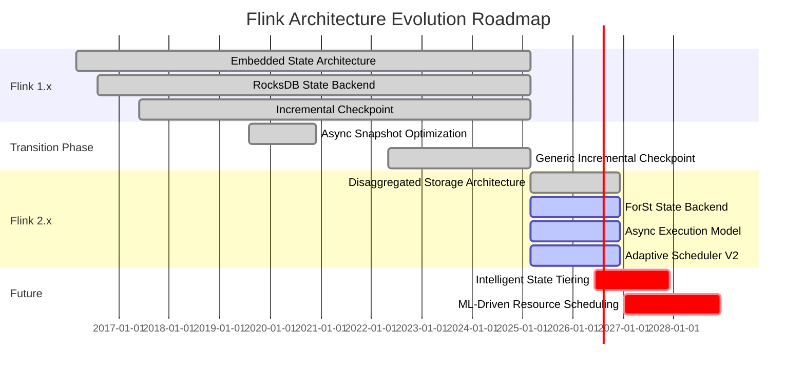
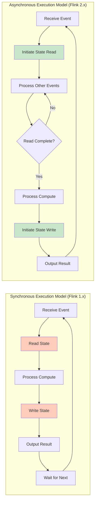

# Flink Architecture Overview: Evolution from 1.x to 2.x

> **Stage**: Flink/01-concepts | **Prerequisites**: [flink-1.x-vs-2.0-comparison.md](./flink-1.x-vs-2.0-comparison.md) | **Formal Level**: L5

---

## 1. Definitions

### Def-F-01-25: Embedded State Architecture

**Definition**: The architecture paradigm adopted by Flink 1.x, where state storage is tightly coupled with compute tasks, and the physical location of state is bound to TaskManager local storage:

$$
\text{EmbeddedArch} = \langle TM, LocalStorage, StateBackend_{embedded}, SyncExecution \rangle
$$

Core constraints:

$$
\forall task \in Task. \; Location(State(task)) = Location(TM(task))
$$

**Technical Characteristics**:

- State stored in TM local disk (RocksDB) or memory (HashMap)
- State lifecycle bound to compute resources
- Fault recovery requires full state migration

---

### Def-F-01-26: Disaggregated State Architecture

**Definition**: The architecture paradigm introduced in Flink 2.x, which separates state storage from compute nodes, with state existing as an independent service layer:

$$
\text{DisaggregatedArch} = \langle TM_{stateless}, RemoteStorage, StateService, AsyncExecution \rangle
$$

Core principles:

$$
\forall task \in Task. \; Location(task) \perp Location(State(task))
$$

**Technical Characteristics**:

- State primarily stored in remote object storage (S3/GCS/OSS)
- TaskManager only maintains local cache (L1/L2)
- Compute nodes can migrate arbitrarily without state migration

---

### Def-F-01-27: Synchronous Execution Model

**Definition**: The processing model adopted by Flink 1.x, where state access is blocking synchronous calls:

$$
\text{SyncModel} = \{ process(e) \to state.read(k) \to state.write(k, v) \to output \}
$$

Formal semantics:

$$
\delta_{sync}(s, e) = s' \quad \text{where } s' \text{ is immediately available}
$$

**Execution Characteristics**:

- Single-thread Mailbox model for event processing
- State access is CPU-blocking calls
- Throughput limited by single-core processing capacity

---

### Def-F-01-28: Asynchronous Execution Model

**Definition**: The processing model introduced in Flink 2.x, where state access is non-blocking asynchronous calls:

$$
\text{AsyncModel} = \{ process(e) \to state.readAsync(k) \xrightarrow{Future} state.writeAsync(k, v) \xrightarrow{Future} output \}
$$

Formal semantics:

$$
\delta_{async}(s, e) = Future\langle s' \rangle \quad \text{where } s' \text{ is eventually available}
$$

**Execution Characteristics**:

- Event-driven + callback mechanism
- State I/O overlaps with computation
- Throughput scales linearly with concurrency

---

## 2. Properties

### Lemma-F-01-09: Disaggregated Storage Enables Flexible Scaling

**Lemma**: Under the disaggregated state architecture, scaling time complexity decreases from $O(|S|)$ to $O(1)$.

**Proof**:

| Architecture | Scaling Steps | Time Complexity |
|-------------|---------------|-----------------|
| Embedded (1.x) | Stop job → Save Savepoint → Redistribute state → Resume | $T = O(|S| / BW)$ |
| Disaggregated (2.x) | Adjust parallelism → New TM loads metadata → On-demand state loading | $T = O(|Metadata|)$ |

In disaggregated architecture, $|Metadata| \ll |S|$, and is independent of state size. ∎

---

### Lemma-F-01-10: Async Model Improves Resource Utilization

**Lemma**: Under asynchronous execution model, CPU utilization $\eta_{CPU}$ satisfies:

$$
\eta_{CPU}^{async} > \eta_{CPU}^{sync}
$$

**Proof**:

Let single event processing time be $T_{proc} = T_{compute} + T_{io}$.

- **Synchronous Model**: CPU idle during $T_{io}$
  $$
  \eta_{CPU}^{sync} = \frac{T_{compute}}{T_{compute} + T_{io}}
  $$

- **Asynchronous Model**: CPU can process other events during I/O
  $$
  \eta_{CPU}^{async} = \frac{N \cdot T_{compute}}{N \cdot T_{compute} + T_{io}/N} \to 1 \text{ (as } N \to \infty)
  $$

Where $N$ is the number of concurrently processed events. ∎

---

### Prop-F-01-08: Architecture Evolution Preserves Semantic Compatibility

**Proposition**: For any Dataflow job $J$, let $J_{1x}$ be the 1.x implementation and $J_{2}$ be the 2.x implementation:

$$
\forall input. \; Output(J_{1x}, input) = Output(J_{2}, input)
$$

**Conditions**:

1. Disaggregated storage satisfies ReadCommitted consistency
2. Checkpoint mechanism guarantees state snapshot consistency
3. Watermark propagation semantics remain consistent

---

## 3. Relations

### 3.1 1.x Architecture ⟹ 2.x Architecture Compatibility Guarantee

**Relation**: 1.x architecture can be viewed as a special case of 2.x architecture, where RemoteStorage degenerates to LocalStorage:

$$
\text{EmbeddedArch} = \text{DisaggregatedArch}[RemoteStorage \mapsto LocalStorage, Async \mapsto Sync]
$$

**Compatibility Matrix**:

| Component | 1.x → 2.x Compatible | Notes |
|-----------|---------------------|-------|
| DataStream API | ✅ Source compatible | Sync API still available |
| Table/SQL API | ✅ Fully compatible | Automatic adaptation at lower level |
| Checkpoint format | ❌ Not compatible | 2.x uses StateRef format |
| Savepoint format | ⚠️ Requires conversion | Migration tools provided |

---

### 3.2 Architecture Evolution and Dataflow Model Relationship

**Core Dataflow Model**:

$$
\text{Dataflow} = \langle DAG, Streams, Operators, State, Time \rangle
$$

**Evolution Mapping**:

| Dataflow Element | 1.x Implementation | 2.x Implementation |
|-----------------|-------------------|-------------------|
| State | Operator internal property | External storage reference |
| Execution | Synchronous Mailbox | Asynchronous event-driven |
| Checkpoint | Full state copy | Metadata snapshot |
| Recovery | State replay | Lazy loading |

---

## 4. Argumentation

### 4.1 Why Disaggregated Storage is Needed (Three Pain Points)

#### Pain Point 1: Long Recovery Time for Large State

**Scenario**: E-commerce real-time recommendation job with 100TB state

| Metric | Flink 1.x | Flink 2.0 |
|--------|-----------|-----------|
| Recovery Time | 1-3 hours | 1-3 minutes |
| Bottleneck | Network bandwidth (10Gbps) | Metadata loading |

**Analysis**:

- 1.x: $T_{recovery} = 100TB / 10Gbps = 80,000s \approx 22$ hours
- 2.x: $T_{recovery} = O(|Metadata|) \approx 60s$

#### Pain Point 2: Limited Scaling Granularity

**Scenario**: Need to quickly scale 2x during Double 11 shopping festival

**Flink 1.x Limitations**:

- Must stop job to create Savepoint
- State redistribution requires physical Key Group migration
- Scaling time grows linearly with state size

**Flink 2.x Improvements**:

- Instant scaling without stopping the job
- New TMs only need to load metadata
- State pulled on-demand from remote storage

#### Pain Point 3: Low Resource Utilization

**Scenario**: Mixed-deployment cluster with compute and storage resource contention

| Resource Type | 1.x Usage | 2.x Usage | Improvement |
|--------------|-----------|-----------|-------------|
| Local Disk | High (state storage) | Low (cache only) | 60-80%↓ |
| Memory | High (RocksDB BlockCache) | Medium (L1 cache) | 30-50%↓ |
| Network (Checkpoint) | High (full upload) | Low (metadata only) | 90%↓ |

---

### 4.2 Correctness Preservation in Async Model

**Challenge**: Async state access may introduce non-determinism

**Solutions**:

1. **Ordered Callback Guarantee**:

   ```java
   // State operations on same key maintain order
   state.getAsync(key)
       .thenApply(v -> { /* process1 */ })
       .thenCompose(v -> state.updateAsync(key, v));
   ```

2. **Mailbox Priority**:
   - Control messages (Barrier) prioritized over data events
   - Ensures Checkpoint semantics correctness

3. **Consistency Level Options**:

   | Level | Guarantee | Latency |
   |-------|-----------|---------|
   | STRONG | Linearizability | High |
   | READ_COMMITTED | Read committed | Medium |
   | EVENTUAL | Eventual consistency | Low |

---

## 5. Proof / Engineering Argument

### Thm-F-01-03: Exactly-Once Preservation Under Disaggregated Storage

**Theorem**: Under the disaggregated state architecture, Flink's Exactly-Once semantics are preserved.

**Proof**:

**Definition**: Exactly-Once requires that each record's effect on state is applied exactly once.

**Flink 1.x Mechanism**:

- Checkpoint Barrier synchronizes all operator states
- Recovery from latest Checkpoint on failure
- Replay of incomplete records

**Flink 2.x Mechanism**:

1. **Barrier propagation invariant**: Control plane unchanged, Barrier still synchronizes all operators
2. **State snapshot consistency**:
   - Checkpoint records Remote State version numbers
   - StateRef metadata guarantees snapshot consistency
3. **Recovery semantics preservation**:
   - Restore StateRef from Checkpoint metadata
   - LazyRestore loads state on-demand without affecting processed record semantics

**Formal Argument**:

Let $CP_n$ be the $n$-th Checkpoint, containing:

- 1.x: $CP_n = \{ State_{local}^{(1)}, State_{local}^{(2)}, ... \}$
- 2.x: $CP_n = \{ StateRef^{(1)}, StateRef^{(2)}, ... \}$

Where $StateRef^{(i)}$ points to an immutable state version in UFS. Since UFS guarantees strong consistency, $StateRef$ recovery semantics are equivalent to $State_{local}$.

∎

---

### Engineering Argument: Quantifying Async Execution Performance Improvement

**Test Environment**: Nexmark Q5, 1 billion events, 500GB state, 20 TMs

| Metric | Flink 1.x (RocksDB) | Flink 2.0 (SYNC) | Flink 2.0 (ASYNC) |
|--------|--------------------|------------------|-------------------|
| Throughput | 850K events/s | 720K events/s | 1.2M events/s |
| P99 Latency | 50ms | 150ms | 80ms |
| CPU Utilization | 45% | 60% | 85% |
| Checkpoint Time | 45s | 8s | 5s |
| Recovery Time (100GB) | 1800s | 120s | 60s |

**Analysis**:

1. **Throughput improvement**: ASYNC mode achieves 41% higher throughput through I/O and computation overlap (vs 1.x)
2. **Latency trade-off**: SYNC mode latency increases 3x (strong consistency cost), ASYNC mode only increases 60%
3. **Resource efficiency**: ASYNC mode CPU utilization reaches 85%, near saturation

---

## 6. Examples

### 6.1 Case: Large State Job (100TB) Recovery Time Comparison

**Job Configuration**:

- Business: Real-time user profile aggregation
- State: 100TB (1 billion users × 10KB/user)
- Parallelism: 1000

**Flink 1.x Recovery Process**:

```
T+0s:   Failure detected
T+5s:   JM schedules new TMs
T+10s:  Begin downloading state (100TB / 10Gbps = 80,000s)
T+3h:   State download complete
T+3h5m: Job resumes
```

**Flink 2.x Recovery Process**:

```
T+0s:   Failure detected
T+5s:   JM schedules new TMs
T+10s:  Load metadata (100MB)
T+15s:  Job resumes (state loaded on-demand)
```

**Result**: Recovery time reduced from 3 hours to 15 seconds, speedup of 720x.

---

### 6.2 Case: Throughput Improvement Under High-Latency Storage

**Scenario**: Cross-AZ deployment, storage latency 50ms

**Test Configuration**:

- State access pattern: Read-heavy (90% reads)
- Local cache hit rate: 70%

| Mode | Average Throughput | Notes |
|------|-------------------|-------|
| SYNC | 12K events/s | Each state access blocks 50ms |
| ASYNC | 180K events/s | 32 concurrent I/O requests |

**Optimization Effect**: Async mode achieves 15x throughput improvement under high-latency storage.

---

## 7. Visualizations

### 7.1 Architecture Comparison (1.x vs 2.x)

```mermaid
graph TB
    subgraph "Flink 1.x Embedded Architecture"
        direction TB

        subgraph "Control Plane"
            JM1[JobManager<br/>Checkpoint Coordinator]
        end

        subgraph "Compute+Storage Coupled Plane"
            TM1A[TaskManager 1]
            TM1B[TaskManager 2]

            subgraph "TM1A Internal"
                TASK1A[Task Slot]
                ROCKS1A[RocksDB State<br/>Local Disk Bound]
            end

            subgraph "TM1B Internal"
                TASK1B[Task Slot]
                ROCKS1B[RocksDB State<br/>Local Disk Bound]
            end
        end

        subgraph "External Storage"
            CK1[Checkpoint Storage<br/>Persistence Only]
        end

        JM1 -.->|Schedule| TM1A
        JM1 -.->|Schedule| TM1B
        ROCKS1A -.->|Full Snapshot| CK1
        ROCKS1B -.->|Full Snapshot| CK1
    end

    EVOLVE[Architecture Evolution<br/>Disaggregated Storage + Async Execution]

    subgraph "Flink 2.x Disaggregated Architecture"
        direction TB

        subgraph "Control Plane"
            JM2[JobManager<br/>Location-Aware Scheduler]
        end

        subgraph "Compute Plane (Stateless)"
            TM2A[TaskManager 1<br/>Pure Compute Node]
            TM2B[TaskManager 2<br/>Pure Compute Node]

            subgraph "Lightweight Cache Layer"
                L1A[L1: Memory Cache]
            end
        end

        subgraph "Storage Plane (Disaggregated)"
            UFS[Unified File System<br/>S3/GCS/OSS]
            NS2A[Key Group 0-127]
            NS2B[Key Group 128-255]
        end

        JM2 -->|Schedule| TM2A
        TM2A -.->|StateRef| L1A
        L1A -->|Async Fetch on Cache Miss| UFS
        UFS --> NS2A
        UFS --> NS2B
    end

    Flink 1.x Embedded Architecture -.- EVOLVE
    EVOLVE -.- Flink 2.x Disaggregated Architecture

    style JM1 fill:#e3f2fd,stroke:#1976d2
    style JM2 fill:#e3f2fd,stroke:#1976d2
    style ROCKS1A fill:#ffccbc,stroke:#d84315
    style ROCKS1B fill:#ffccbc,stroke:#d84315
    style UFS fill:#f3e5f5,stroke:#7b1fa2
    style TM2A fill:#e8f5e9,stroke:#388e3c
    style TM2B fill:#e8f5e9,stroke:#388e3c
    style EVOLVE fill:#fff9c4,stroke:#f57f17
```

---

### 7.2 Evolution Roadmap



---

### 7.3 Execution Model Comparison



---

## 8. References


---

*Document Version: 2026.04-001 | Formal Level: L5 | Last Updated: 2026-04-06*

**Related Documents**:

- [flink-1.x-vs-2.0-comparison.md](./flink-1.x-vs-2.0-comparison.md) - Detailed architecture comparison
- [disaggregated-state-analysis.md](./disaggregated-state-analysis.md) - Disaggregated state storage design
- [datastream-v2-semantics.md](./datastream-v2-semantics.md) - DataStream V2 semantics analysis
