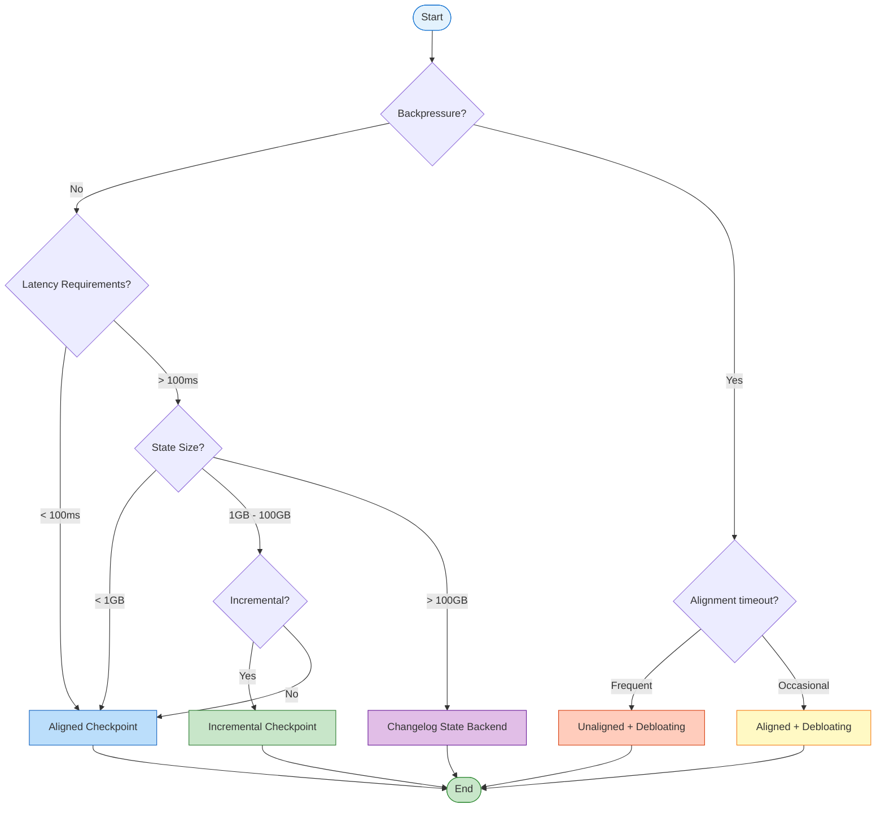

# Flink Checkpoint Mechanism Deep Dive

> **Stage**: Flink/02-core-mechanisms | **Prerequisites**: [02.02-consistency-hierarchy.md](../../../USTM-F-Reconstruction/archive/original-struct/02-properties/02.02-consistency-hierarchy.md) | **Formal Level**: L4

---

## Table of Contents

- [1. Definitions](#1-definitions)
- [2. Properties](#2-properties)
- [3. Relations](#3-relations)
- [4. Argumentation](#4-argumentation)
- [5. Proof / Engineering Argument](#5-proof--engineering-argument)
- [6. Examples](#6-examples)
- [7. Visualizations](#7-visualizations)
- [8. References](#8-references)

---

## 1. Definitions

This section establishes rigorous formal definitions for the Flink Checkpoint mechanism, laying the theoretical foundation for subsequent analysis. All definitions are consistent with the semantic hierarchy definitions in [02.02-consistency-hierarchy.md](../../../USTM-F-Reconstruction/archive/original-struct/02-properties/02.02-consistency-hierarchy.md)[^1][^2].

---

### Def-F-02-01: Checkpoint Core Abstraction

**Checkpoint** is a globally consistent state snapshot of a distributed stream processing job at a specific moment, formally defined as:

$$
CP = \langle ID, TS, \{S_i\}_{i \in Tasks}, Metadata \rangle
$$

Where:

- $ID \in \mathbb{N}^+$: Checkpoint unique identifier, monotonically increasing
- $TS \in \mathbb{R}^+$: Creation timestamp
- $S_i$: State snapshot of task $i$, including Keyed State and Operator State
- $Metadata$: Metadata (storage location, state size, operator mapping, etc.)

**Intuitive Explanation**: Checkpoint is a "global photo" of a running distributed stream processing job, where all operator instance states are frozen at the same logical moment, allowing the system to restart from this consistent state after failure[^1].

**Source Implementation**:

- Checkpoint Coordinator: `org.apache.flink.runtime.checkpoint.CheckpointCoordinator`
- Checkpoint Storage: `org.apache.flink.runtime.state.CheckpointStreamFactory`
- Location: `flink-runtime` module
- Flink Documentation: <https://nightlies.apache.org/flink/flink-docs-stable/docs/dev/datastream/fault-tolerance/checkpointing/>

---

### Def-F-02-02: Checkpoint Barrier

**Barrier** is a special control event injected into the data stream to separate data boundaries of different Checkpoints:

$$
Barrier(n) = \langle Type = CONTROL, checkpointId = n, timestamp = ts \rangle
$$

**Core Functions**:

1. Serves as logical time boundary, separating data before and after $CP_n$
2. Propagates through data stream, triggering operator state snapshots
3. Achieves distributed coordination without global clock[^2][^3]

**Source Implementation**:

- Barrier definition: `org.apache.flink.runtime.checkpoint.CheckpointBarrier`
- Barrier handler: `org.apache.flink.streaming.runtime.io.CheckpointBarrierHandler`
- Aligned handler: `org.apache.flink.streaming.runtime.io.CheckpointBarrierAligner`
- Unaligned handler: `org.apache.flink.streaming.runtime.io.CheckpointBarrierUnaligner`
- Location: `flink-runtime` module (`flink-streaming-java`)

---

### Def-F-02-03: Aligned Checkpoint

**Aligned Checkpoint** means the operator triggers state snapshot only after receiving Barrier from **all** input channels:

$$
\text{AlignedSnapshot}(t, n) \iff \forall c \in Inputs(t): Barrier(n) \in Received(c)
$$

**Characteristics**:

- Guarantees snapshot state precisely corresponds to processing results up to Barrier
- Introduces backpressure waiting: channels receiving Barrier earlier wait for others
- Simple implementation, strong consistency guarantee[^1][^4]

---

### Def-F-02-04: Unaligned Checkpoint

**Unaligned Checkpoint** allows operators to trigger snapshot immediately upon receiving Barrier from **any** input channel, saving unprocessed records from other channels (in-flight data) as part of state:

$$
\text{UnalignedSnapshot}(t, n) \iff \exists c \in Inputs(t): Barrier(n) \in Received(c)
$$

**Characteristics**:

- Eliminates Barrier alignment waiting, reduces Checkpoint impact on latency
- Requires saving in-flight data, increasing state size
- Suitable for high backpressure, large latency scenarios[^4][^5]

---

### Def-F-02-05: Incremental Checkpoint

**Incremental Checkpoint** only captures the changed portion of state since the last Checkpoint:

$$
\Delta S_n = S_{t_n} \setminus S_{t_{n-1}}, \quad CP_n^{inc} = \langle Base, \{\Delta S_i\}_{i=1}^{n} \rangle
$$

**RocksDB Implementation Principle**:

- Based on SST file immutability of LSM-Tree
- Only backs up newly created or modified SST files
- Recovery reconstructs complete state through base Checkpoint + incremental chain[^5][^6]

---

### Def-F-02-06: State Backend

**State Backend** is the runtime component responsible for state storage, access, and snapshot persistence:

```java
// Source: org.apache.flink.runtime.state.StateBackend
interface StateBackend {
    createKeyedStateBackend(env, stateHandles): AbstractKeyedStateBackend<K>
    createOperatorStateBackend(env, stateHandles): OperatorStateBackend
    snapshot(checkpointId): RunnableFuture<SnapshotResult>
    restore(stateHandles): StateBackend
}
```

**Main Implementation Types**:

| Backend | Storage Medium | Snapshot Method | Suitable Scenarios |
|---------|---------------|-----------------|-------------------|
| HashMapStateBackend | Memory (Heap) | Full Sync/Async | Small state, low latency |
| EmbeddedRocksDBStateBackend | Local Disk (RocksDB) | Incremental Async | Large state, high throughput |

[^5][^6]

**Source Implementation**:

- Abstract base: `org.apache.flink.runtime.state.AbstractStateBackend`
- HashMap implementation: `org.apache.flink.runtime.state.hashmap.HashMapStateBackend`
- RocksDB implementation: `org.apache.flink.runtime.state.rocksdb.EmbeddedRocksDBStateBackend`
- Location: `flink-runtime` / `flink-state-backends` module
- Flink Documentation: <https://nightlies.apache.org/flink/flink-docs-stable/docs/ops/state/state_backends/>

---

### Def-F-02-07: Checkpoint Coordinator

**Checkpoint Coordinator** is the JobManager component responsible for global Checkpoint lifecycle management:

$$
Coordinator = \langle PendingCP, CompletedCP, TimeoutTimer, AckCallbacks \rangle
$$

**Responsibilities**:

1. Trigger Checkpoint at configured intervals (send `TriggerCheckpoint` to Source)
2. Collect acknowledgments from all Tasks
3. Manage Checkpoint timeout and failure handling
4. Maintain metadata of completed Checkpoints[^1][^4]

---

### Def-F-02-08: Changelog State Backend

**Changelog State Backend** is a state backend enhancement introduced in Flink 1.15+, materializing state changes to distributed storage in real-time, achieving second-level recovery[^7]:

$$
\text{ChangelogStateBackend} = \langle \text{BaseBackend}, \text{ChangelogStorage}, \text{MaterializationStrategy} \rangle
$$

**Core Mechanisms**:

1. **Real-time Materialization**: State changes written to Changelog in real-time, not just periodic Checkpoint
2. **Incremental Sync**: Background thread continuously uploads state changes, reducing I/O spikes during Checkpoint
3. **Recovery Acceleration**: Parallel reading of base Checkpoint + subsequent Changelog during recovery, achieving second-level recovery

**Official Configuration** (flink-conf.yaml):

```yaml
# Enable Changelog State Backend
state.backend.changelog.enabled: true
state.backend.changelog.storage: filesystem

# Materialization config
execution.checkpointing.max-concurrent-checkpoints: 1
state.backend.changelog.periodic-materialization.interval: 10min
state.backend.changelog.materialization.max-concurrent: 1
```

**Comparison with Incremental Checkpoint**:

| Feature | Incremental Checkpoint | Changelog State Backend |
|---------|------------------------|-------------------------|
| Trigger Timing | Periodic (seconds/minutes) | Real-time continuous materialization |
| Recovery Time | Minutes (needs incremental chain merge) | Seconds (parallel reading) |
| I/O Overhead | Low (only incremental files) | High (continuous writing) |
| Storage Cost | Low (shared SST files) | Medium (needs Changelog storage) |
| Suitable Scenarios | Large state, tolerate minute-level recovery | Latency sensitive, second-level recovery required |

---

## 2. Properties

This section derives core properties of the Checkpoint mechanism from definitions in Section 1.

---

### Lemma-F-02-01: Barrier Alignment Guarantees State Consistency

**Statement**: If all input channels of operator $t$ have received $Barrier(n)$, then $t$'s state $S_t^{(n)}$ at snapshot moment is consistent with the state induced by all data up to $Barrier(n)$ in the input stream.

**Proof**:

1. By Def-F-02-02, $Barrier(n)$ is a logical time boundary separating data before and after $CP_n$.
2. By Def-F-02-03, operator $t$ only triggers snapshot after receiving $Barrier(n)$ from all input channels.
3. Therefore, before snapshot trigger, $t$ has processed all data up to $Barrier(n)$ from all inputs, and has not processed any data after $Barrier(n)$.
4. Thus $S_t^{(n)}$ precisely corresponds to the state induced by "input up to $Barrier(n)$", neither ahead nor behind.
5. Q.E.D.

> **Inference [Theory→Implementation]**: Barrier alignment is the core mechanism for Flink to implement internal consistency (see [02.02-consistency-hierarchy.md](../../../USTM-F-Reconstruction/archive/original-struct/02-properties/02.02-consistency-hierarchy.md) Def-S-08-06).

---

### Lemma-F-02-02: Async Checkpoint Low Latency Characteristic

**Statement**: Under async Checkpoint mode, operator data processing latency is not affected by state snapshot persistence time.

**Proof**:

1. By Def-F-02-06, State Backend snapshot has sync phase (get state reference/copy) and async phase (serialize and upload).
2. After sync phase completes, operator immediately resumes data processing, async upload runs in background thread.
3. Let sync phase duration be $\delta_{sync}$, async phase duration be $\delta_{async}$.
4. Operator pause time is only $\delta_{sync}$, independent of $\delta_{async}$.
5. Therefore, even with large state ($\delta_{async} \gg \delta_{sync}$), data processing tail latency is controlled at $\delta_{sync}$ magnitude.
6. Q.E.D.

---

### Lemma-F-02-03: Incremental Checkpoint Storage Optimization

**Statement**: For RocksDB-based incremental Checkpoint, the $n$-th Checkpoint storage overhead $Storage(n)$ satisfies:

$$
Storage(n) \ll Storage_{full}(n)
$$

Where $Storage_{full}(n)$ is the full Checkpoint storage overhead for equivalent state.

**Proof**:

1. By RocksDB's LSM-Tree structure, once written, SST files are immutable.
2. Incremental Checkpoint only backs up SST files created or modified since last Checkpoint ($\Delta SST$).
3. For stable workloads, $|\Delta SST| \ll |Total SST|$.
4. Therefore $Storage(n) = |\Delta SST_n|$, while $Storage_{full}(n) = |Total SST_n|$.
5. Q.E.D.

---

### Prop-F-02-01: Checkpoint Type Selection Trade-off Space

**Statement**: Aligned, Unaligned, Incremental, and Changelog four Checkpoint mechanisms have the following trade-off relationships across five dimensions: latency, throughput, storage, recovery time, and consistency guarantee:

| Dimension | Aligned | Unaligned | Incremental | Changelog |
|-----------|---------|-----------|-------------|-----------|
| Latency Impact | Medium (alignment wait) | Low (no alignment wait) | Low (async upload) | Low (real-time materialization) |
| Throughput Impact | Medium (backpressure propagation) | Low (alleviates backpressure) | Low (reduces I/O) | Medium (continuous I/O) |
| Storage Overhead | Standard | High (in-flight data) | Low (only incremental) | Medium (Changelog storage) |
| Recovery Speed | Standard | Standard | Slower (needs merge) | Fast (second-level) |
| Consistency Guarantee | Strong | Strong | Strong | Strong |

**Engineering Inference**: No single optimal configuration exists, need to choose combination strategy based on job characteristics (state size, latency requirements, recovery time SLA, network bandwidth).

---

## 3. Relations

This section establishes mapping relationships between Checkpoint mechanism and distributed systems theory, consistency semantics, and engineering practice.

---

### Relation 1: Flink Checkpoint ↔ Chandy-Lamport Distributed Snapshot

**Argument**:

Flink's Checkpoint mechanism is an engineering implementation of the Chandy-Lamport distributed snapshot algorithm[^3] in stream processing scenarios:

| Chandy-Lamport Concept | Flink Implementation | Semantic Correspondence |
|------------------------|---------------------|------------------------|
| Marker message | Checkpoint Barrier | Logical time boundary |
| Process local state record | Operator state snapshot | Task instance state |
| Channel state record | in-flight data saving | Unprocessed data |
| Consistent Cut | Global Checkpoint | Global consistent state |

By Chandy-Lamport theorem, this snapshot satisfies:

1. **Consistent Cut**: No message crosses cut boundary
2. **No Orphans**: All in-flight messages are captured
3. **Reachable**: Recovered state is reachable from initial state

Therefore:

$$
\text{Flink-Checkpoint} \approx \text{Chandy-Lamport-Snapshot}
$$

> **See**: [02.02-consistency-hierarchy.md](../../../USTM-F-Reconstruction/archive/original-struct/02-properties/02.02-consistency-hierarchy.md) Relation 2 provides more detailed correspondence analysis.

---

### Relation 2: Checkpoint Mechanism ⟹ Exactly-Once Semantics

**Argument**:

**Prerequisites**:

1. Data source is replayable (e.g., Kafka offset rewindable)
2. Operator processing is deterministic
3. Sink supports transactional or idempotent writes

**Derivation**:

By Lemma-F-02-01, Checkpoint captures globally consistent state. During fault recovery, system restores from $CP_n$ and replays subsequent data. Due to operator determinism, replay produces identical state and output as first execution. Combined with transactional Sink's two-phase commit, external system observes no duplicate or lost data.

**Conclusion**:

$$
\text{Checkpoint} + \text{Replayable Source} + \text{Atomic Sink} \implies \text{Exactly-Once}
$$

> **See**: [02.02-consistency-hierarchy.md](../../../USTM-F-Reconstruction/archive/original-struct/02-properties/02.02-consistency-hierarchy.md) Thm-S-08-02 provides complete correctness proof for end-to-end Exactly-Once.

---

### Relation 3: State Backend Type ↔ Application Scenario

**Argument**:

Different State Backend choices directly determine Checkpoint performance characteristics and applicable scenarios:

| Scenario Characteristics | Recommended Backend | Reason |
|-------------------------|---------------------|--------|
| State < 100MB, latency sensitive | HashMapStateBackend | Memory access, nanosecond latency |
| State 100MB-10GB | RocksDB + Full Checkpoint | Disk storage, async snapshot |
| State > 10GB | RocksDB + Incremental Checkpoint | Reduce I/O, lower timeout risk |
| Frequent state updates | RocksDB | LSM-Tree optimizes write amplification |
| Large point queries | HashMapStateBackend | Memory hash table O(1) query |

---

## 4. Argumentation

This section analyzes core engineering implementation details of the Checkpoint mechanism.

---

### 4.1 Checkpoint Architecture: JM/TM Coordination Mechanism

Flink Checkpoint adopts **master-slave coordination** architecture, with CheckpointCoordinator on JobManager (JM) cooperating with Checkpoint tasks on TaskManager (TM):

**Phase 1: Trigger Phase**

1. CheckpointCoordinator triggers at `checkpointInterval` period
2. Generates monotonically increasing Checkpoint ID
3. Sends `TriggerCheckpoint` RPC to all Source operators

**Phase 2: Propagation Phase**

1. Source operator injects Barrier into data stream
2. Barrier propagates downstream along DAG topology
3. Each operator processes Barrier in aligned or unaligned mode based on configuration

**Phase 3: Snapshot Phase**

1. Operator triggers State Backend snapshot
2. Sync phase: get state reference/copy
3. Async phase: serialize and upload to distributed storage (HDFS/S3)

**Phase 4: Acknowledgment Phase**

1. TM sends `AcknowledgeCheckpoint` to JM
2. Coordinator collects all Ack
3. If all received before timeout, mark as COMPLETED; otherwise mark as FAILED

```
JM (CheckpointCoordinator)                    TM (Task with State)
         |                                             |
         |------ TriggerCheckpoint(ID) ---------------->|
         |                                             |
         |<----- AcknowledgeCheckpoint(ID) ------------|
         |          (contains StateHandle reference)    |
         |                                             |
```

---

### 4.2 Aligned vs Unaligned: Deep Comparison

#### Aligned Checkpoint Workflow

1. Operator maintains Barrier arrival status for each input channel
2. Channel receiving Barrier $n$ stops processing, buffers data
3. Wait for Barrier $n$ from all input channels
4. Trigger state snapshot, forward Barrier $n$ to downstream
5. Resume data processing, process buffered data

**Pros**:

- Simple implementation, state only contains operator internal state
- Direct Exactly-Once semantics implementation with two-phase commit

**Cons**:

- Alignment wait introduces additional latency
- Under backpressure, Barrier propagation is blocked, increasing Checkpoint timeout risk

#### Unaligned Checkpoint Workflow

1. Operator triggers snapshot immediately upon receiving Barrier $n$ from any input channel
2. Save unprocessed records from other channels (in-flight) as state
3. Snapshot contains: operator internal state + in-flight data
4. Immediately forward Barrier $n$ to downstream

**Pros**:

- Eliminates alignment wait, reduces Checkpoint impact on latency
- Can complete Checkpoint quickly even under backpressure

**Cons**:

- State size increases (contains in-flight data)
- Recovery needs to replay in-flight data, increasing recovery time
- High implementation complexity

---

### 4.3 Incremental Checkpoint Engineering Implementation

#### RocksDB Incremental Checkpoint Principle

Based on RocksDB's LSM-Tree architecture characteristics:

1. **SST File Immutability**: Once written, SST files are never modified
2. **Manifest File**: Records metadata of all active SST files
3. **Incremental Detection**: Compare SST file sets between consecutive Checkpoints

**Implementation Flow**:

```
Checkpoint N:   Backup all SST files (Base)
                ↓
Checkpoint N+1: Identify new SST files (Δ₁)
                Backup new files + Update Manifest
                ↓
Checkpoint N+2: Identify new SST files (Δ₂)
                Backup new files + Update Manifest
```

**Recovery Flow**:

$$
S_{recovered} = Base \cup \Delta_1 \cup \Delta_2 \cup \cdots \cup \Delta_n
$$

---

## 5. Proof / Engineering Argument

### Thm-F-02-01: Checkpoint Recovery System State Equivalence

**Statement**: Let system fail at moment $\tau_f$, with last successful Checkpoint being $CP_n$. After recovering from $CP_n$ and Replay completion, the system is observationally equivalent to some consistent cut $C$ before failure, where $C$ corresponds to the global state captured by $CP_n$.

**Proof**:

**Step 1: Establish consistent cut correspondence**

By Lemma-F-02-01 and Relation 1, $CP_n$ captured state set $Snapshot(n) = \{S_t^{(n)} \mid t \in Tasks\}$ forms a consistent cut $C_n$ (see Chandy-Lamport theorem[^3]).

**Step 2: Analyze pre-failure execution history**

Let pre-failure execution history be event sequence $E = e_1, e_2, \ldots, e_k$. Let history prefix corresponding to $C_n$ be $E_{prefix} = e_1, \ldots, e_p$, i.e., $CP_n$ captures global state after executing $E_{prefix}$.

By Checkpoint protocol and Lemma-F-02-01, $E_{prefix}$ exactly contains all events located before $Barrier(n)$ at their respective operators. For any event $e_j \in E_{prefix}$ and $e_l \notin E_{prefix}$, there is no $e_l \rightarrow e_j$ (otherwise $e_l$ should also be before $Barrier(n)$). Therefore $E_{prefix}$ is downward closed under happens-before relation, i.e., $C_n$ is a consistent cut.

**Step 3: Recovery and Replay semantics**

Recovery process executes:

1. $Restore(CP_n)$: Reset each operator $t$'s state to $S_t^{(n)}$.
2. $Replay$: Data source re-consumes from offset recorded in $CP_n$, i.e., replay input records corresponding to $E_{suffix} = e_{p+1}, \ldots, e_k$.

**Step 4: Determinism guarantees equivalence**

Since Flink operators are deterministic (same input and state produce same output and state update), replaying $E_{suffix}$ produces event sequence identical in state and output effect to first execution of $E_{suffix}$.

**Step 5: Observational equivalence**

For external observer, recovered system starts from global state $G_n$ (i.e., consistent cut $C_n$), continuing to execute same event suffix as before failure. Therefore, recovered system trace $tr'$ and original system trace $tr$ satisfy:

$$
tr = E_{prefix} \circ E_{suffix}, \quad tr' = E_{prefix} \circ E_{suffix}
$$

I.e., $tr$ and $tr'$ completely coincide after $C_n$. Observer cannot distinguish original execution from recovered execution.

∎

> **Note**: More detailed formal proof see [04.01-flink-checkpoint-correctness.md](../../../USTM-F-Reconstruction/archive/original-struct/04-proofs/04.01-flink-checkpoint-correctness.md).

---

### Thm-F-02-02: Incremental Checkpoint Completeness

**Statement**: Let $Base$ be the state set captured by some full Checkpoint, $\Delta_1, \Delta_2, \ldots, \Delta_n$ be the incremental state sets captured by subsequent $n$ incremental Checkpoints. Then state $S_{restore}$ after $n$-th incremental Checkpoint recovery satisfies:

$$
S_{restore} = Base \cup \bigcup_{i=1}^{n} \Delta_i = S_n
$$

Where $S_n$ is the complete state at $n$-th Checkpoint moment.

**Proof**:

**Step 1: RocksDB SST Immutability**

RocksDB based on LSM-Tree architecture, once data written to SST (Sorted String Table) files is unmodifiable. Subsequent writes only create new SST files, old SST files remain unchanged.

**Step 2: Incremental Set Semantics**

Let $F_t$ be RocksDB SST file set at moment $t$. By immutability:

$$
F_{t_2} = F_{t_1} \cup F_{new}, \quad t_2 > t_1
$$

Where $F_{new}$ is new SST file set created during $(t_1, t_2]$.

**Step 3: Incremental Checkpoint Construction**

- $Base = F_{t_0}$ (all SST files backed up by base full Checkpoint)
- $\Delta_i = F_{t_i} \setminus F_{t_{i-1}}$ (new SST files backed up by $i$-th incremental Checkpoint)

**Step 4: Completeness Derivation**

$$
\begin{aligned}
S_{restore} &= Base \cup \bigcup_{i=1}^{n} \Delta_i \\
&= F_{t_0} \cup \bigcup_{i=1}^{n} (F_{t_i} \setminus F_{t_{i-1}}) \\
&= F_{t_0} \cup (F_{t_1} \setminus F_{t_0}) \cup (F_{t_2} \setminus F_{t_1}) \cup \ldots \cup (F_{t_n} \setminus F_{t_{n-1}}) \\
&= F_{t_n} \\
&= S_n
\end{aligned}
$$

**Step 5: Consistency Guarantee**

RocksDB's manifest file records metadata of all active SST files. Incremental Checkpoint simultaneously backs up manifest incremental changes, ensuring correct reconstruction of SST file reference relationships and hierarchical structure during recovery.

∎

---

## 6. Examples

### 6.1 Configuration: Aligned Checkpoint

```java

import org.apache.flink.streaming.api.environment.StreamExecutionEnvironment;
import org.apache.flink.streaming.api.CheckpointingMode;

StreamExecutionEnvironment env = StreamExecutionEnvironment.getExecutionEnvironment();

// Enable Checkpoint, 10 second interval
env.enableCheckpointing(10000);

// Configure Aligned Checkpoint (default)
env.getCheckpointConfig().setCheckpointingMode(CheckpointingMode.EXACTLY_ONCE);

// Timeout 60 seconds
env.getCheckpointConfig().setCheckpointTimeout(60000);

// Max concurrent Checkpoints
env.getCheckpointConfig().setMaxConcurrentCheckpoints(1);

// Min pause 500ms
env.getCheckpointConfig().setMinPauseBetweenCheckpoints(500);

// Use RocksDB State Backend
EmbeddedRocksDBStateBackend rocksDbBackend = new EmbeddedRocksDBStateBackend();
env.setStateBackend(rocksDbBackend);

// Checkpoint storage path
env.getCheckpointConfig().setCheckpointStorage("hdfs:///flink/checkpoints");
```

---

### 6.2 Configuration: Unaligned Checkpoint

```java

import org.apache.flink.streaming.api.environment.StreamExecutionEnvironment;

StreamExecutionEnvironment env = StreamExecutionEnvironment.getExecutionEnvironment();

env.enableCheckpointing(10000);

// Enable Unaligned Checkpoint
env.getCheckpointConfig().enableUnalignedCheckpoints();

// Configure alignment timeout (auto-switch to Unaligned after this time)
env.getCheckpointConfig().setAlignmentTimeout(Duration.ofSeconds(30));

// Configure in-flight data size threshold
env.getCheckpointConfig().setMaxUnalignedCheckpoints(2);

// Use RocksDB State Backend (recommended with Unaligned Checkpoint)
env.setStateBackend(new EmbeddedRocksDBStateBackend());

env.getCheckpointConfig().setCheckpointStorage("hdfs:///flink/checkpoints");
```

---

### 6.3 Configuration: Incremental Checkpoint

```java

import org.apache.flink.streaming.api.environment.StreamExecutionEnvironment;

StreamExecutionEnvironment env = StreamExecutionEnvironment.getExecutionEnvironment();

env.enableCheckpointing(60000); // Incremental Checkpoint recommends longer interval

// Use RocksDB State Backend, enable incremental Checkpoint
// Second parameter true means enable incremental
EmbeddedRocksDBStateBackend rocksDbBackend = new EmbeddedRocksDBStateBackend(true);
env.setStateBackend(rocksDbBackend);

// Checkpoint storage path
env.getCheckpointConfig().setCheckpointStorage("hdfs:///flink/checkpoints");
```

---

### 6.4 Configuration: Changelog State Backend

```java

import org.apache.flink.streaming.api.environment.StreamExecutionEnvironment;

StreamExecutionEnvironment env = StreamExecutionEnvironment.getExecutionEnvironment();

env.enableCheckpointing(60000);

// Enable Changelog State Backend
env.setStateBackend(new EmbeddedRocksDBStateBackend());

// Configure in flink-conf.yaml:
// state.backend.changelog.enabled: true
// state.backend.changelog.storage: filesystem

// Or configure via code
Configuration config = new Configuration();
config.setBoolean("state.backend.changelog.enabled", true);
config.setString("state.backend.changelog.storage", "filesystem");
env.configure(config);

env.getCheckpointConfig().setCheckpointStorage("hdfs:///flink/checkpoints");
```

**Key Configuration Explanation**:

| Config Item | Default | Description |
|-------------|---------|-------------|
| `state.backend.changelog.enabled` | false | Enable Changelog State Backend |
| `state.backend.changelog.storage` | filesystem | Changelog storage type (filesystem/memory) |
| `state.backend.changelog.periodic-materialization.interval` | 10min | Materialization interval |
| `state.backend.changelog.materialization.max-concurrent` | 1 | Max concurrent materialization tasks |

---

## 7. Visualizations

### 7.1 State Backend Snapshot Flow


**Color Legend**:

- Red: Time-consuming operations
- Yellow: Medium time-consuming
- Green: Lightweight operations

---

### 7.2 Checkpoint Type Decision Tree



---

## 8. References

[^1]: Apache Flink Documentation, "Checkpointing", 2025. <https://nightlies.apache.org/flink/flink-docs-stable/docs/dev/datastream/fault-tolerance/checkpointing/>

[^2]: Apache Flink Documentation, "State Backends", 2025. <https://nightlies.apache.org/flink/flink-docs-stable/docs/ops/state/state_backends/>

[^3]: K. M. Chandy and L. Lamport, "Distributed Snapshots: Determining Global States of Distributed Systems", ACM TOCS, 3(1), 1985.

[^4]: Apache Flink Documentation, "Exactly-Once Semantics", 2025. <https://nightlies.apache.org/flink/flink-docs-stable/docs/concepts/stateful-stream-processing/>

[^5]: Apache Flink Documentation, "Incremental Checkpoint", 2025. <https://nightlies.apache.org/flink/flink-docs-stable/docs/ops/state/large_state_tuning/>

[^6]: S. Dong et al., "RocksDB: Evolution of Development Priorities in a Key-Value Store Serving Large-Scale Applications", ACM SIGMOD, 2021.

[^7]: Apache Flink Documentation, "Changelog State Backend", 2025. <https://nightlies.apache.org/flink/flink-docs-stable/docs/ops/state/changelog/>

---

*Document Version: 2026.04-001 | Formal Level: L4 | Last Updated: 2026-04-06*
