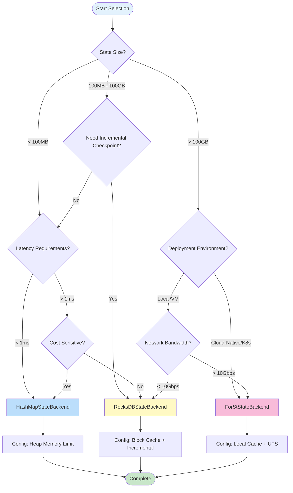
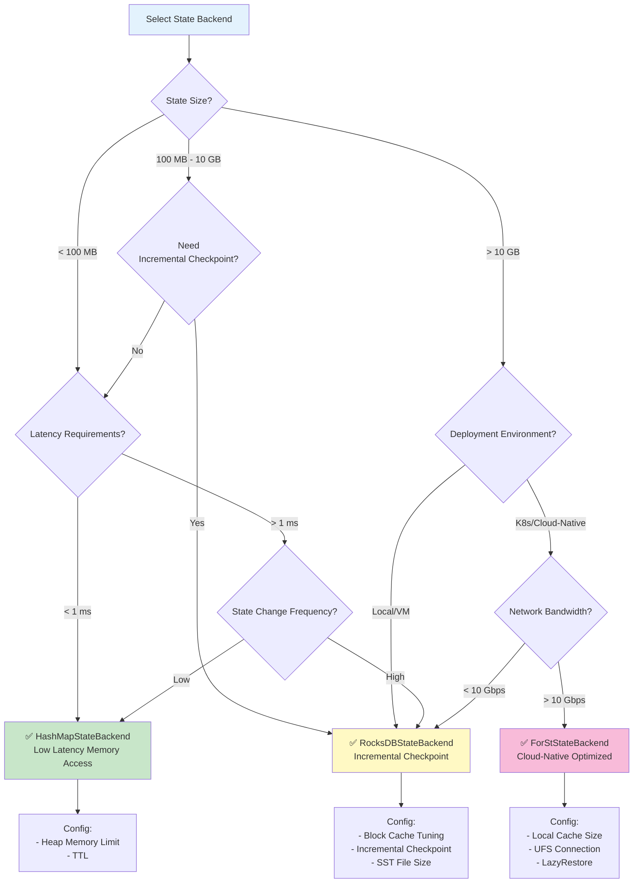

# Flink State Backends Deep Comparison

> **Stage**: Flink/02-core-mechanisms | **Prerequisites**: [checkpoint-mechanism-deep-dive.md](../../../Flink/02-core/checkpoint-mechanism-deep-dive.md), [flink-state-management-complete-guide.md](../../../Flink/02-core/flink-state-management-complete-guide.md) | **Formal Level**: L4

---

## Table of Contents

- [1. Definitions](#1-definitions)
- [2. Properties](#2-properties)
- [3. Relations](#3-relations)
- [4. Argumentation](#4-argumentation)
- [5. Proof / Engineering Argument](#5-proof--engineering-argument)
- [6. Examples](#6-examples)
- [7. Visualizations](#7-visualizations)
- [8. References](#8-references)

---

## 1. Definitions

### Def-F-02-14: State Backend

**Definition**: State Backend is the Flink runtime component responsible for state physical storage, access interfaces, and snapshot persistence. Formally defined as:

$$
\text{StateBackend} = \langle \text{StorageLayer}, \text{AccessInterface}, \text{SnapshotStrategy}, \text{RecoveryMechanism} \rangle
$$

Where:

| Component | Responsibility | Key Attributes |
|-----------|---------------|----------------|
| $\text{StorageLayer}$ | State physical storage | Location (memory/disk/remote), capacity, durability |
| $\text{AccessInterface}$ | State access interface | Latency, throughput, concurrency |
| $\text{SnapshotStrategy}$ | Snapshot generation strategy | Full/incremental, sync/async, consistency guarantee |
| $\text{RecoveryMechanism}$ | Fault recovery mechanism | Recovery time, state consistency, resource requirements |

---

### Def-F-02-15: MemoryStateBackend

**Definition**: MemoryStateBackend (Flink 1.x naming, replaced by HashMapStateBackend since 1.13+) stores state data in TaskManager JVM heap memory:

$$
\text{MemoryStateBackend} = \langle \text{Heap}_{\text{tm}}, \text{HashMap}_{K,V}, \Psi_{\text{async-fs}}, \Omega_{\text{deserialize}} \rangle
$$

**Core Characteristics**:

1. **Storage Location**: TaskManager JVM heap memory
2. **Data Structure**: `HashMap<K, State>` for keyed state
3. **Snapshot Mechanism**: Async copy to filesystem (HDFS/S3)
4. **Access Latency**: Nanosecond-level (direct memory access)

**Capacity Constraints**:

$$
|S_{\text{total}}| \leq \alpha \cdot \text{taskmanager.memory.task.heap.size}, \quad \alpha \approx 0.3
$$

> ⚠️ **Note**: MemoryStateBackend deprecated since Flink 1.13, recommend using HashMapStateBackend.

---

### Def-F-02-16: FsStateBackend

**Definition**: FsStateBackend (Flink 1.x) is an extension of MemoryStateBackend, storing state in memory but async snapshots to distributed filesystem:

$$
\text{FsStateBackend} = \langle \text{Heap}_{\text{tm}}, \text{HashMap}_{K,V}, \Psi_{\text{async-fs}}, \text{CheckpointStorage}_{\text{fs}} \rangle
$$

**Evolution Note**: Flink 1.13+ unified MemoryStateBackend and FsStateBackend into **HashMapStateBackend**, configuring snapshot storage location via `setCheckpointStorage()`.

---

### Def-F-02-17: HashMapStateBackend

**Definition**: HashMapStateBackend is the unified memory state backend introduced in Flink 1.13+, replacing original MemoryStateBackend and FsStateBackend:

$$
\text{HashMapStateBackend} = \langle \text{Heap}_{\text{tm}}, \text{HashMap}_{K,V}, \text{TypeSerializer}, \Psi_{\text{async}} \rangle
$$

**Core Improvements**:

1. **Unified API**: Single backend supports memory storage + arbitrary snapshot target
2. **Async Snapshot**: Copy-on-Write snapshot without blocking data stream processing
3. **Managed Memory Integration**: Deep integration with Flink memory model

---

### Def-F-02-18: RocksDBStateBackend

**Definition**: RocksDBStateBackend (EmbeddedRocksDBStateBackend since 1.13+) uses embedded RocksDB database for state storage:

$$
\text{RocksDBStateBackend} = \langle \text{LSM-Tree}, \text{MemTable}, \text{SST Files}, \text{WAL}, \Psi_{\text{incremental}} \rangle
$$

**LSM-Tree Structure**:

$$
\text{RocksDB} = \text{MemTable}_{\text{active}} \cup \text{MemTable}_{\text{immutable}} \cup \left( \bigcup_{i=0}^{L} \text{Level}_i \right)
$$

Where:

- **MemTable**: In-memory write buffer (default 64MB)
- **Level 0**: SST files flushed directly from MemTable
- **Level 1+**: Sorted SST file levels through Compaction

**Key Features**:

1. **Disk-level Capacity**: Supports TB-level state storage
2. **Incremental Checkpoint**: Only uploads changed SST files
3. **Memory-Disk Tiering**: Block Cache caches hot data
4. **Native TTL**: Cleanup expired data through Compaction Filter

---

### Def-F-02-19: ForStStateBackend

**Definition**: ForSt (For Streaming) is a disaggregated state backend introduced in Flink 2.0+, designed for cloud-native scenarios:

$$
\text{ForStStateBackend} = \langle \text{UFS}, \text{LocalCache}_{\text{L1/L2}}, \text{LazyRestore}, \text{RemoteCompaction} \rangle
$$

Where:

| Component | Description | Performance Characteristics |
|-----------|-------------|----------------------------|
| $\text{UFS}$ | Unified File System (S3/HDFS/GCS) | Primary storage, unlimited capacity |
| $\text{LocalCache}_{\text{L1}}$ | Memory cache (LRU/SLRU) | ~1μs access latency |
| $\text{LocalCache}_{\text{L2}}$ | Local disk cache | ~1ms access latency |
| $\text{LazyRestore}$ | Lazy recovery mechanism | Sub-second fault recovery |
| $\text{RemoteCompaction}$ | Remote Compaction service | CPU resource decoupling |

**Core Innovations**:

1. **Compute-Storage Separation**: State primary storage in object storage, local only as cache
2. **Lightweight Checkpoint**: Metadata snapshot only, time complexity $O(1)$
3. **Instant Recovery**: LazyRestore achieves second-level fault recovery
4. **Cost Optimization**: Storage cost reduced 50-70%

> 📌 **Forward-looking Note**: ForStStateBackend is a new feature in Flink 2.0/2.4, under rapid iteration. Verify stability for specific versions before production use.

---

### Def-F-02-20: Incremental Checkpointing

**Definition**: Incremental Checkpoint only persists the state change portion since the last Checkpoint:

$$
\Delta_n = S_n \ominus S_{n-1}, \quad |CP_n^{\text{inc}}| = |\Delta_n| \ll |S_n|
$$

**RocksDB Implementation**:

Based on SST file immutability, only uploads newly produced SST files:

$$
CP_n^{\text{rocksdb}} = \{ f \in \text{SST}_n \mid f \notin \text{SST}_{n-1} \}
$$

**ForSt Implementation**:

Based on UFS hard link sharing, Checkpoint only persists metadata references:

$$
CP_n^{\text{forst}} = \{ (f, \text{version}) \mid f \in \text{SST}_n \}
$$

---

## 2. Properties

### Lemma-F-02-06: State Backend Access Latency Ordering

**Lemma**: State access latency of four State Backends satisfies the following inequality:

$$
\text{Latency}_{\text{HashMap}} < \text{Latency}_{\text{RocksDB}}^{\text{cache-hit}} < \text{Latency}_{\text{ForSt}}^{\text{L1-hit}} < \text{Latency}_{\text{RocksDB}}^{\text{cache-miss}} < \text{Latency}_{\text{ForSt}}^{\text{cache-miss}}
$$

**Proof**:

| Level | Latency Range | Reason |
|-------|---------------|--------|
| HashMap | 10-100 ns | JVM heap memory direct access |
| RocksDB Cache Hit | 1-10 μs | Block Cache memory access |
| ForSt L1 Hit | 1-10 μs | Local memory cache |
| RocksDB Cache Miss | 1-10 ms | Local disk I/O |
| ForSt Cache Miss | 10-100 ms | Network I/O (UFS) |

$\square$

---

### Lemma-F-02-07: State Capacity Scalability

**Lemma**: Theoretical capacity limits of four State Backends satisfy:

$$
\text{Capacity}_{\text{HashMap}} \ll \text{Capacity}_{\text{RocksDB}} < \text{Capacity}_{\text{ForSt}} \approx \infty
$$

**Proof**:

| Backend | Capacity Limit | Typical Value |
|---------|---------------|---------------|
| HashMap | TM heap memory | < 10 GB |
| RocksDB | TM local disk | 100 GB - 10 TB |
| ForSt | UFS storage capacity | Theoretically unlimited (PB-level) |

$\square$

---

### Prop-F-02-05: Checkpoint Time Complexity Comparison

**Proposition**: Checkpoint time complexity for different State Backends:

| Backend | Time Complexity | Description |
|---------|-----------------|-------------|
| HashMap | $O(\|S\|)$ | Full serialization and upload |
| RocksDB (Full) | $O(\|S\|)$ | Full SST upload |
| RocksDB (Incremental) | $O(\|\Delta S\|)$ | Only upload changed SST |
| ForSt | $O(1)$ | Metadata snapshot only |

**Inference**: For large state scenarios ($|S| > 100\text{GB}$), ForSt's Checkpoint speed advantage is significant.

---

### Prop-F-02-06: Fault Recovery Time Bounds

**Proposition**: Fault recovery time satisfies the following bounds:

$$
T_{\text{recovery}}^{\text{HashMap}} \approx T_{\text{recovery}}^{\text{ForSt}} \ll T_{\text{recovery}}^{\text{RocksDB}}
$$

**Proof**:

- **HashMap**: Deserialize from snapshot to memory, $T = O(|S|)$ but small constant
- **RocksDB**: Download SST files to local disk, $T = O(|S| / B_{\text{network}})$
- **ForSt**: Only load metadata, state loaded on-demand, $T = O(|M|) \approx O(1)$

$\square$

---

## 3. Relations

### 3.1 State Backend Evolution Relations

```
Flink 1.0-1.12                    Flink 1.13+                    Flink 2.0+
────────────────────────────────────────────────────────────────────────────
MemoryStateBackend ──┐
                     ├─→ HashMapStateBackend ───┐
FsStateBackend ──────┘                          │
                                                ├─→ Unified State Backend API
RocksDBStateBackend ───→ EmbeddedRocksDBStateBackend ──┘
                                                │
ForStStateBackend ──────────────────────────────┘
```

**Evolution Motivations**:

1. **API Simplification**: Unified Memory/Fs to HashMap
2. **Performance Optimization**: EmbeddedRocksDB native incremental Checkpoint support
3. **Cloud-Native Adaptation**: ForSt implements compute-storage separation

---

### 3.2 State Backend to Dataflow Model Mapping

| Dataflow Model Concept | HashMap Implementation | RocksDB Implementation | ForSt Implementation |
|------------------------|------------------------|------------------------|---------------------|
| Windowed State | Heap HashMap | SST Files | SST in UFS |
| Trigger | Checkpoint Barrier | Checkpoint Barrier | Checkpoint Barrier |
| Accumulation | Full snapshot | Incremental SST | Hard link reference |
| Discarding | GC reclaim | Compaction + GC | Reference count GC |

---

### 3.3 Checkpoint Mechanism Comparison

| Dimension | HashMapStateBackend | RocksDBStateBackend | ForStStateBackend |
|-----------|--------------------|--------------------|--------------------|
| **Sync Phase** | Create HashMap view | Flush MemTable | None (async flush) |
| **Async Phase** | Serialize to remote | Upload SST files | Only persist metadata |
| **Incremental Support** | ❌ Not supported | ✅ SST file-level | ✅ Hard link sharing |
| **Consistency Guarantee** | Copy-on-Write | LSM immutability | Atomic rename |
| **Network Transfer** | Large (full state) | Medium (incremental SST) | Minimal (metadata only) |

---

## 4. Argumentation

### 4.1 State Backend Selection Decision Tree



---

### 4.2 Scenario Adaptation Boundary Analysis

| Scenario Characteristics | Recommended Backend | Reason |
|-------------------------|---------------------|--------|
| State < 100MB, low latency | HashMap | Memory access, nanosecond latency |
| State 100MB - 10GB, medium latency | HashMap/RocksDB | Depends on GC tolerance |
| State > 10GB | RocksDB | Avoid heap memory pressure |
| State > 100GB, frequent Checkpoint | **ForSt** | Checkpoint efficiency advantage |
| Cloud-Native/K8s deployment | **ForSt** | Compute elastic scaling |
| Edge/Network-constrained environment | RocksDB | Avoid network dependency |
| Ultra-low latency (< 1ms P99) | HashMap | RocksDB serialization overhead |

---

### 4.3 Counter-Example Analysis: Impact of Improper Selection

#### Counter-Example 1: Large State Using HashMap

**Scenario**: 100M user sessions × 200B = 20GB state, 10 TMs × 4GB heap

**Calculation**: 2GB per TM + overhead ≈ 3GB (75% heap memory)

**Result**:

- Frequent Full GC (> 10% CPU)
- OOM risk, job instability
- **Solution**: Migrate to RocksDBStateBackend

#### Counter-Example 2: High Throughput Random Read Using RocksDB

**Scenario**: 100K TPS random key queries, Cache hit rate < 50%

**Problem**:

- Disk I/O becomes bottleneck
- Write Stall causes backpressure
- **Solution**: Increase Block Cache or migrate to HashMap (if state allows)

#### Counter-Example 3: Low Bandwidth Environment Using ForSt

**Scenario**: Edge node, network bandwidth 100Mbps, state 1TB

**Problem**:

- Cache Miss latency extremely high (> 1s)
- Network congestion affects other services
- **Solution**: Use RocksDB + Local SSD

---

### 4.4 Resource Requirements Comparison

| Resource Type | HashMap | RocksDB | ForSt |
|--------------|---------|---------|-------|
| **Memory** | High (state all in memory) | Medium (Block Cache + MemTable) | Medium (local cache) |
| **Disk** | None | High (state + WAL) | Medium (local cache) |
| **CPU** | Low | Medium (serialization + Compaction) | High (serialization + network) |
| **Network** | Low (only Checkpoint) | Medium (incremental Checkpoint) | High (state access) |
| **Storage Cost** | High (memory expensive) | Medium (local SSD) | Low (object storage) |

---

## 5. Proof / Engineering Argument

### Thm-F-02-03: State Backend Selection Completeness Theorem

**Theorem**: For any job $J$, there exists optimal state backend selection strategy uniquely determined by feature vector $F(J) = (S_{\text{size}}, L_{\text{sla}}, E_{\text{env}}, C_{\text{budget}})$.

**Decision Function**:

$$
\mathcal{D}(F(J)) = \begin{cases}
\text{HashMap} & \text{if } S_{\text{size}} < M_{\text{max}} \land L_{\text{sla}} < 1\text{ms} \\
\text{RocksDB} & \text{if } M_{\text{max}} \leq S_{\text{size}} < 100\text{GB} \lor E_{\text{env}} = \text{edge} \\
\text{ForSt} & \text{if } S_{\text{size}} \geq 100\text{GB} \land E_{\text{env}} = \text{cloud}
\end{cases}
$$

**Typical Thresholds**:

- $M_{\text{max}}$: 30% of TM heap memory (e.g., 4GB heap → 1.2GB state limit)
- $L_{\text{sla}}$: P99 latency requirement
- $E_{\text{env}}$: Deployment environment (edge/cloud)

**Proof**:

1. **Capacity Constraint**: If $S_{\text{size}} \geq M_{\text{max}}$, HashMap causes unacceptable GC pressure, must choose disk-level backend
2. **Latency Constraint**: If $L_{\text{sla}} < 1\text{ms}$, RocksDB/ForSt serialization overhead cannot meet, prefer HashMap
3. **Environment Constraint**: Edge environment network constrained, ForSt remote access not feasible, choose RocksDB
4. **Cost Optimization**: Cloud-native environment leverages object storage cost advantage, choose ForSt

$\square$

---

### Thm-F-02-04: Checkpoint Efficiency Optimization Bound Theorem

**Theorem**: Incremental Checkpoint storage saving rate $R_{\text{save}}$ satisfies:

$$
R_{\text{save}} = 1 - \frac{|\Delta S|}{|S|}
$$

**Optimal Case**: Only $p$ proportion state updates per cycle, $R_{\text{save}} = 1 - p$

**Worst Case**: All state updates per cycle, $R_{\text{save}} = 0$ (degrades to full)

**Backend Efficiency Comparison**:

| Backend | Optimal Saving Rate | Typical Scenario Saving Rate |
|---------|--------------------|------------------------------|
| HashMap | 0% | 0% |
| RocksDB (Incremental) | 90-99% | 50-80% |
| ForSt | ~100% | ~100% |

**Engineering Inference**: For hotspot-obvious scenarios (e.g., session windows), RocksDB incremental Checkpoint is significant; ForSt almost constantly achieves theoretical optimum due to hard link mechanism.

---

### Engineering Argument: ForSt Advantages in Cloud-Native Scenarios

**Argument**: Why choose ForSt for cloud-native scenarios?

**Cost Analysis**:

| Cost Item | RocksDB | ForSt | Savings |
|-----------|---------|-------|---------|
| Storage (Monthly) | $0.10/GB × 2 replicas = $0.20/GB | $0.023/GB = $0.023/GB | **88%** |
| Compute (Reserved) | Must reserve disk capacity | On-demand scaling | **50%** |
| Network (Checkpoint) | Incremental upload | Metadata only | **90%** |

**Elasticity Analysis**:

- **RocksDB Scaling**: Requires state migration → $T_{\text{scale}} = O(|S| / B_{\text{network}})$
- **ForSt Scaling**: Only needs metadata loading → $T_{\text{scale}} = O(1)$

**Reliability Analysis**:

- **RocksDB**: Local disk failure → data loss risk
- **ForSt**: UFS multi-replica guarantee → 99.999999999% durability

---

## 6. Examples

### 6.1 MemoryStateBackend / HashMapStateBackend Configuration

```java

// [伪代码片段 - 不可直接运行] 仅展示核心逻辑
import org.apache.flink.streaming.api.environment.StreamExecutionEnvironment;
import org.apache.flink.streaming.api.CheckpointingMode;

StreamExecutionEnvironment env =
    StreamExecutionEnvironment.getExecutionEnvironment();

// ========== HashMapStateBackend Configuration ==========
HashMapStateBackend hashMapBackend = new HashMapStateBackend();
env.setStateBackend(hashMapBackend);

// Checkpoint storage configuration
env.getCheckpointConfig().setCheckpointStorage("hdfs:///checkpoints");
// Or S3: env.getCheckpointConfig().setCheckpointStorage("s3://bucket/checkpoints");

// Checkpoint parameters
env.enableCheckpointing(10000);  // 10 second interval
env.getCheckpointConfig().setCheckpointingMode(CheckpointingMode.EXACTLY_ONCE);
env.getCheckpointConfig().setCheckpointTimeout(60000);
```

**flink-conf.yaml Configuration**:

```yaml
# State backend configuration
state.backend: hashmap

# Memory configuration (critical!)
taskmanager.memory.task.heap.size: 2gb
taskmanager.memory.managed.size: 256mb
```

---

### 6.2 RocksDBStateBackend Production Configuration

```java
// [伪代码片段 - 不可直接运行] 仅展示核心逻辑
// ========== RocksDBStateBackend Production Configuration ==========
// Enable incremental Checkpoint
EmbeddedRocksDBStateBackend rocksDbBackend =
    new EmbeddedRocksDBStateBackend(true);
env.setStateBackend(rocksDbBackend);

// Checkpoint configuration
env.enableCheckpointing(60000);  // 60 seconds
env.getCheckpointConfig().setCheckpointStorage("hdfs:///checkpoints");
env.getCheckpointConfig().setCheckpointTimeout(600000);  // 10 minute timeout
env.getCheckpointConfig().setMinPauseBetweenCheckpoints(30000);

// RocksDB fine-grained configuration
DefaultConfigurableOptionsFactory optionsFactory =
    new DefaultConfigurableOptionsFactory();

// Memory configuration
optionsFactory.setRocksDBOptions(
    "state.backend.rocksdb.memory.managed", "true");
optionsFactory.setRocksDBOptions(
    "state.backend.rocksdb.memory.fixed-per-slot", "512mb");

// Write buffer configuration
optionsFactory.setRocksDBOptions("write_buffer_size", "64MB");
optionsFactory.setRocksDBOptions("max_write_buffer_number", "4");

// SST file configuration
optionsFactory.setRocksDBOptions("target_file_size_base", "32MB");
optionsFactory.setRocksDBOptions("max_bytes_for_level_base", "256MB");

// Compression configuration
optionsFactory.setRocksDBOptions("compression_per_level", "LZ4:LZ4:ZSTD");

env.setRocksDBStateBackend(rocksDbBackend, optionsFactory);
```

**Key Parameter Explanation**:

| Parameter | Description | Recommended Value |
|-----------|-------------|-------------------|
| `write_buffer_size` | MemTable size | 64-128 MB |
| `max_write_buffer_number` | Max MemTable count | 3-5 |
| `target_file_size_base` | L0 SST file size | 32-64 MB |
| `max_bytes_for_level_base` | L1 total size | 256-512 MB |

---

### 6.3 ForStStateBackend Configuration (Flink 2.0+)

```java
// [伪代码片段 - 不可直接运行] 仅展示核心逻辑
// ========== ForStStateBackend Configuration (Forward-looking) ==========
// Flink 2.0+ support
ForStStateBackend forstBackend = new ForStStateBackend();
forstBackend.setUFSStoragePath("s3://flink-state-bucket/jobs/job-001");
forstBackend.setLocalCacheSize("10 gb");
forstBackend.setLazyRestoreEnabled(true);
forstBackend.setRemoteCompactionEnabled(true);

env.setStateBackend(forstBackend);

// ForSt recommends longer Checkpoint interval
env.enableCheckpointing(120000);  // 2 minutes
```

**flink-conf.yaml Complete Configuration**:

```yaml
# ========== ForSt State Backend Core Configuration ==========
state.backend: forst

# UFS configuration
state.backend.forst.ufs.type: s3
state.backend.forst.ufs.s3.bucket: flink-state-bucket
state.backend.forst.ufs.s3.region: us-east-1
state.backend.forst.ufs.s3.credentials.provider: IAM_ROLE

# Local cache configuration
state.backend.forst.cache.memory.size: 4gb
state.backend.forst.cache.disk.size: 100gb
state.backend.forst.cache.policy: SLRU

# Recovery configuration
state.backend.forst.restore.mode: LAZY
state.backend.forst.restore.preload.keys: 10000

# Remote Compaction configuration
state.backend.forst.compaction.remote.enabled: true
state.backend.forst.compaction.remote.endpoint: compaction-service:9090
```

---

### 6.4 State Backend Migration Example

```bash
# ========== Migrate from HashMap to RocksDB ==========

# 1. Create Savepoint (using original backend)
flink savepoint <job-id> hdfs:///savepoints/migration

# 2. Modify code to switch backend
# env.setStateBackend(new HashMapStateBackend());  // Old
# env.setStateBackend(new EmbeddedRocksDBStateBackend(true));  // New

# 3. Restore from Savepoint (automatically converts state format)
flink run -s hdfs:///savepoints/migration/savepoint-xxxxx \
  -c com.example.MyJob my-job.jar
```

**Migration Compatibility Matrix**:

| Source Backend | Target Backend | Compatibility | Notes |
|----------------|---------------|---------------|-------|
| HashMap | RocksDB | ✅ Supported | Automatic conversion, no data loss |
| RocksDB | HashMap | ⚠️ Conditional | Must ensure state size < TM heap memory |
| HashMap/RocksDB | ForSt | ✅ Supported | Flink 2.0+ support |
| ForSt | RocksDB | ❌ Not supported | Storage architecture incompatible |

---

## 7. Visualizations

### 7.1 State Backend Architecture Comparison

```mermaid
graph TB
    subgraph "HashMapStateBackend"
        H1[KeyedProcessFunction] --> H2[StateManager]
        H2 --> H3[HashMap Table]
        H3 --> H4[JVM Heap Memory]
        H4 --> H5[Async Snapshot]
        H5 --> H6[Checkpoint Storage<br/>HDFS/S3]
        style H1 fill:#e3f2fd
        style H4 fill:#c8e6c9
        style H6 fill:#f8bbd9
    end

    subgraph "RocksDBStateBackend"
        R1[KeyedProcessFunction] --> R2[RocksDB JNI]
        R2 --> R3[MemTable<br/>Write Buffer]
        R2 --> R4[Block Cache<br/>LRU]
        R3 --> R5[SST Files<br/>LSM-Tree]
        R4 -.-> R5
        R5 --> R6[Local Disk]
        R6 --> R7[Incremental Snapshot]
        R7 --> R8[Checkpoint Storage]
        style R1 fill:#e3f2fd
        style R3 fill:#fff9c4
        style R4 fill:#c8e6c9
        style R5 fill:#ffe0b2
        style R6 fill:#e1bee7
        style R8 fill:#f8bbd9
    end

    subgraph "ForStStateBackend"
        F1[KeyedProcessFunction] --> F2[Local Cache Manager]
        F2 --> F3{L1 Hit?}
        F3 -->|Yes| F4[Memory Cache<br/>LRU/SLRU]
        F3 -->|No| F5{L2 Hit?}
        F5 -->|Yes| F6[Disk Cache<br/>Local SSD]
        F5 -->|No| F7[Async Fetch from UFS]
        F7 --> F8[Unified File System<br/>S3/OSS/GCS]
        F8 --> F9[SST Files<br/>Immutable]
        F9 --> F10[Metadata Snapshot]
        F10 --> F11[Checkpoint Storage]
        style F1 fill:#e3f2fd
        style F4 fill:#c8e6c9
        style F6 fill:#fff9c4
        style F8 fill:#b2dfdb
        style F9 fill:#ffe0b2
        style F11 fill:#f8bbd9
    end
```



---

### 7.2 Complete Feature Comparison Matrix

| Feature Dimension | HashMapStateBackend | RocksDBStateBackend | ForStStateBackend |
|:-----------------:|:-------------------:|:-------------------:|:-----------------:|
| **Storage Location** | JVM Heap | Local Disk (LSM-Tree) | Remote UFS + Local Cache |
| **State Capacity** | < 10 GB | 100 GB - 10 TB | Unlimited (PB-level) |
| **Access Latency** | 10-100 ns | 1 μs - 10 ms | 1 μs - 100 ms |
| **Throughput** | ⭐⭐⭐⭐⭐ | ⭐⭐⭐ | ⭐⭐⭐ |
| **Memory Efficiency** | ⭐⭐ | ⭐⭐⭐⭐ | ⭐⭐⭐⭐⭐ |
| **CPU Overhead** | Low | Medium | High |
| **Disk Dependency** | None | High (Local SSD) | Medium (Cache disk) |
| **Network Dependency** | Low | Medium (Checkpoint) | High (State access) |
| **Checkpoint Method** | Full Async | Incremental Async | Metadata Snapshot |
| **Checkpoint Speed** | Slow | Fast (incremental) | Extremely fast (O(1)) |
| **Recovery Speed** | Fast | Slow | Extremely fast (Lazy) |
| **Incremental Checkpoint** | ❌ | ✅ | ✅ |
| **TTL Support** | ✅ | ✅ (Native) | ✅ |
| **Cloud-Native Friendly** | ⭐⭐ | ⭐⭐⭐ | ⭐⭐⭐⭐⭐ |
| **Storage Cost** | High | Medium | Low |
| **Flink Version** | 1.13+ | 1.13+ | 2.0+ |

---

### 7.3 Selection Decision Tree



---

## 8. References


---

*Document Version: 2026.04-001 | Formal Level: L4 | Last Updated: 2026-04-06*
