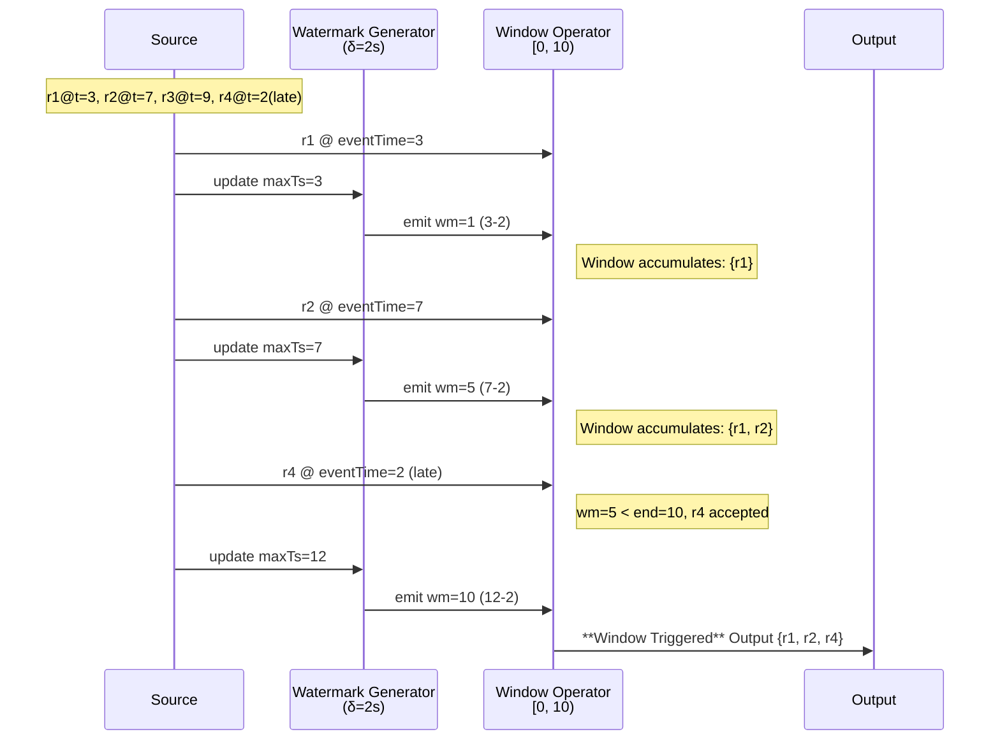
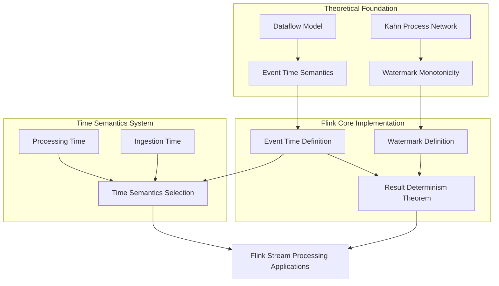

# Flink Time Semantics and Watermark

> **Stage**: Flink/02-core-mechanisms | **Prerequisites**: [Flink Deployment Architecture](../../../Flink/01-concepts/deployment-architectures.md) | **Formal Level**: L4

---

## Table of Contents

- [1. Definitions](#1-definitions)
- [2. Properties](#2-properties)
- [3. Relations](#3-relations)
- [4. Argumentation](#4-argumentation)
- [5. Proof / Engineering Argument](#5-proof--engineering-argument)
- [6. Examples](#6-examples)
- [7. Visualizations](#7-visualizations)
- [8. References](#8-references)

---

## 1. Definitions

### Def-F-02-01: Event Time

$$
\text{EventTime}(r): \text{Record} \to \mathbb{T}, \quad \mathbb{T} = \mathbb{R}_{\geq 0}
$$

Event time is the timestamp carried by record $r$ when generated at the data source, produced by the business system and immutable by the stream processing engine.

**Semantic Assertion**: For any record $r$, its event time $t_e(r)$ represents the real moment when this record occurred in business logic, completely independent of when data arrives at Flink or when it is processed.

**Intuitive Explanation**: Event Time is the "business occurrence moment" carried by the data itself, such as user click time, sensor data collection time, or transaction occurrence time. In distributed environments, network delay, backpressure, and retransmission cause records to arrive in different order than they were produced. If event time is not used as the computation baseline, window aggregation results will depend on uncontrollable transmission latency, causing **non-deterministic output**[^1][^2].

**Definition Motivation**: Event Time decouples computation semantics from physical transmission, being the only reliable time baseline for guaranteeing result determinism on out-of-order streams. It is a necessary prerequisite for stream processing correctness and one of Flink's core capabilities distinguishing it from other stream processing engines.

---

### Def-F-02-02: Processing Time

$$
\text{ProcessingTime}(o, r, t): \text{Operator} \times \text{Record} \times \mathbb{T} \to \mathbb{T}
$$

Processing time is the physical clock reading (wall-clock time) when operator $o$ processes record $r$ on the local machine.

**Semantic Assertion**: Processing time completely depends on the local system time when the operator executes, independent of data content.

**Intuitive Explanation**: Processing Time is "what time is it now", reflecting the machine time when the operator executes. When system time reaches the window boundary, the window triggers immediately without waiting for any late data[^2][^3].

**Definition Motivation**: In some scenarios (e.g., real-time monitoring, approximate statistics, alerting systems), low latency is more important than result accuracy. Processing Time requires no Watermark state maintenance, and can output results with minimal latency. However, it makes computation results dependent on machine clock, network jitter, and scheduling delay, **cannot guarantee cross-run result consistency**.

---

### Def-F-02-03: Ingestion Time

$$
\text{IngestionTime}(r) = \text{ProcessingTime}(\text{source}(r), r, \text{arrival}(r))
$$

Ingestion time is the processing timestamp when record $r$ enters the Flink Source operator, automatically attached by Source when data enters the system.

**Semantic Assertion**: Ingestion Time is the moment when data enters Flink, between Event Time and Processing Time. Source assigns monotonically non-decreasing timestamps to records in arrival order.

**Intuitive Explanation**: Ingestion Time is "the moment data enters Flink". Unlike Processing Time, it is only assigned once at Source, and subsequent operators use this timestamp for processing, avoiding non-determinism of Processing Time[^2][^4].

**Definition Motivation**: When upstream cannot produce reliable event timestamps, Ingestion Time provides a **monotonically non-decreasing** time baseline, making window triggering deterministic without requiring user configuration of Watermark and out-of-order handling.

---

### Def-F-02-04: Watermark

Watermark is a special progress beacon injected into the data stream by the stream processing system, formalized as a monotonic function from data stream to time domain:

$$
\text{Watermark}: \text{Stream} \to \mathbb{T} \cup \{+\infty\}
$$

Let current Watermark value be $w$, its semantic assertion is:

$$
\forall r \in \text{Stream}_{\text{future}}. \; \text{EventTime}(r) \geq w \lor \text{Late}(r, w)
$$

I.e., all records with event time strictly less than $w$ have either already arrived and been processed, or have been judged as "late" by the system and will no longer be accepted by the target window.

**Watermark Generation Strategy**: At Source, the most common periodic generation strategy is:

$$
w(t) = \max_{r \in \text{Observed}(t)} \text{EventTime}(r) - \delta
$$

Where $\delta \geq 0$ is the maximum out-of-orderness tolerance boundary.

**Intuitive Explanation**: Watermark is the "progress signal" sent by the system, telling downstream operators "no more data with event time less than or equal to the current Watermark will arrive normally"[^1][^5].

**Definition Motivation**: On infinite streams, the system can never be sure "whether there's any older data still coming". Watermark transforms infinite waiting into a decidable progress advancement mechanism by introducing **bounded uncertainty assumption**, enabling windows to trigger and output results within finite delay.

---

### Def-F-02-05: Allowed Lateness

Let window $W$'s end time be $\text{end}(W)$, Allowed Lateness is defined as:

$$
\text{AllowedLateness}(W) = L \in \mathbb{T}
$$

Indicating the maximum time length after Watermark has passed the window end time, during which the system still accepts late data and updates window results.

**Semantic Assertion**: When $w \geq \text{end}(W)$ window triggers for the first time; during $w < \text{end}(W) + L$, if late data arrives, window state can be updated and may output corrected results.

**Intuitive Explanation**: Allowed Lateness is the "grace period" reserved for late data after Watermark passes the window end time[^2][^6].

**Definition Motivation**: Watermark is based on statistical assumptions (maximum out-of-order boundary), but actual systems may always have late data exceeding expectations. Allowed Lateness makes trade-offs between state storage cost and result completeness.

---

### Def-F-02-06: Window

Window $W$ is a left-closed, right-open interval on the event time axis:

$$
W = [t_{\text{start}}, t_{\text{end}}) \subseteq \mathbb{T}
$$

Record $r$ is assigned to window $W$ if and only if:

$$
\text{Assign}(r, W) \iff t_{\text{start}} \leq \text{EventTime}(r) < t_{\text{end}}
$$

**Window Type Definitions**:

| Window Type | Mathematical Definition | Characteristics |
|------------|------------------------|-----------------|
| **Tumbling** | $\left[\left\lfloor \frac{t_e}{\text{size}} \right\rfloor \times \text{size}, \left(\left\lfloor \frac{t_e}{\text{size}} \right\rfloor + 1\right) \times \text{size}\right)$ | Fixed length, non-overlapping, each record belongs to exactly one window |
| **Sliding** | $\left\{\left[k \times \text{slide}, k \times \text{slide} + \text{size}\right) \mid t_e \in \text{interval}\right\}$ | Fixed length, can overlap, slide controls step size |
| **Session** | $\left[\min_i(t_e(e_i)), \max_i(t_e(e_i)) + \text{gap}\right)$ | Dynamic length, determined by activity gap, adaptive merging |
| **Global** | $[0, +\infty)$ | Single window, no time boundary, with custom trigger |

---

## 2. Properties

### Lemma-F-02-01: Watermark Monotonicity

**Proposition**: For the same input stream, Watermark sequence $\{w_t\}$ satisfies monotonic non-decreasing:

$$
\forall i < j: w_i \leq w_j
$$

**Derivation**:

1. By Def-F-02-04, $w(t) = \max(\text{EventTime}_{\text{seen}}(t)) - \delta$
2. Let $t_1 < t_2$, then record set observed by $t_2$ contains $t_1$'s set
3. Therefore $\max(\text{EventTime}_{\text{seen}}(t_2)) \geq \max(\text{EventTime}_{\text{seen}}(t_1))$
4. Subtract constant $\delta$ from both sides, get $w(t_2) \geq w(t_1)$
5. Q.E.D.

**Semantic Explanation**: Watermark monotonicity is the core invariant guaranteeing window results are "calculated only once". Detailed formal proof see **Thm-S-09-01** in [Struct/02-properties/02.03-watermark-monotonicity.md](../../../USTM-F-Reconstruction/archive/original-struct/02-properties/02.03-watermark-monotonicity.md).

---

### Lemma-F-02-02: Window Assignment Completeness

**Proposition**: Under Event Time semantics, for any record $r$ and standard window types, $r$ is assigned to at least one window; exactly one window under Tumbling Window.

**Derivation**:

1. **Tumbling Window**: Time axis divided into non-overlapping intervals, for any $t_e(r)$, exists unique $k$ falling in that interval.
2. **Sliding Window**: For any $t_e(r)$, exists at least one $k$ such that $t_e(r)$ falls in window range.
3. **Session Window**: Each record is at least the start of its own window.
4. **Global Window**: All records belong to the same window.
5. Q.E.D.

---

### Lemma-F-02-03: Latency Upper Bound Theorem

**Proposition**: Let window $W$'s end time be $\text{end}(W)$, Watermark maximum out-of-order delay be $\delta$, then the maximum delay upper bound for window result first output is $\delta + \text{processingDelay}$.

**Derivation**:

1. By Def-F-02-04, $w(t) = \max(\text{EventTime}_{\text{seen}}) - \delta$
2. When window's last event arrives at Source, $\max(\text{EventTime}_{\text{seen}}) \geq \text{end}(W)$
3. Window trigger condition is $w \geq \text{end}(W)$
4. Therefore from last event arriving at Source to window triggering, Watermark needs to advance $\delta$
5. Plus operator processing delay, total delay $\leq \delta + \text{processingDelay}$
6. Q.E.D.

---

## 3. Relations

### Relation 1: Flink Event Time and Dataflow Model

**Argument**:

Flink's Event Time processing mechanism is an engineering implementation and extension of the Google Dataflow model[^1][^9]:

- **Encoding Existence**: Dataflow model's three core concepts—event time, Watermark, and window triggers—are completely implemented in Flink through `TimeCharacteristic`, `WatermarkStrategy`, `Trigger` APIs.
- **Extension Implementation**: Flink adds `Allowed Lateness` mechanism and Side Output functionality on top of Dataflow model.
- **Separation Result**: Dataflow model is the theoretical framework defining "what should be done"; Flink is the concrete implementation solving distributed Watermark propagation, Checkpoint consistency, and other engineering problems.

---

### Relation 2: Watermark and Kahn Process Network

**Argument**:

Kahn Process Network (KPN) determinism is based on FIFO channels and process continuous functions[^10][^11]:

- **Encoding Existence**: In KPN, data flow on channels has implicit arrival partial order. Flink's Watermark can be viewed as **synchronization barrier** inserted into data flow channels, explicitly converting implicit arrival partial order into event time scalar lower bound.
- **Separation Result**: KPN determinism relies on "no out-of-order" assumption. Watermark mechanism extends KPN's determinism guarantee to **finite out-of-order allowed** stream processing scenarios by introducing $w$ as **logical clock cutting surface**.

---

### Relation 3: Time Semantics Hierarchy

**Argument**: Three time semantics have containment relationship in correctness guarantee dimension:

$$
\text{Processing Time} \subset \text{Ingestion Time} \subset \text{Event Time}
$$

Any Processing Time window can be simulated by Event Time window (by using Processing Time as pseudo Event Time), but not vice versa. Therefore in correctness guarantee dimension, Processing Time is a proper subset of Event Time.

---

## 4. Argumentation

### 4.1 Watermark Generation Strategy Comparison

| Strategy | Implementation Class | Suitable Scenarios | Latency Characteristics | Out-of-Order Tolerance |
|----------|---------------------|-------------------|------------------------|----------------------|
| **Ordered Stream** | `forMonotonousTimestamps()` | No out-of-order data source | Zero delay | None |
| **Fixed Delay** | `forBoundedOutOfOrderness()` | Bounded out-of-order data source | Fixed delay $\delta$ | Up to $\delta$ |
| **Punctuated Watermark** | Custom Generator | Data carries special markers | Data-driven | Depends on markers |
| **Idle Source Handling** | `withIdleness()` | Multi-source scenarios | Prevent blocking | Unaffected |

**Strategy Selection Guide**:

1. **Ordered Stream**: Suitable for Kafka single partition, ordered logs, etc. Watermark equals current maximum event time.
2. **Fixed Delay** (most common): Suitable for network transmission out-of-order scenarios. Delay parameter $\delta$ should be based on statistical estimation of data source out-of-order distribution, with safety margin.
3. **Idle Source Handling**: Must configure for multi-input operators (Join, Union) to prevent single slow source blocking global progress.

---

### 4.2 Late Data Processing Mechanisms

Late data refers to data with event time less than current Watermark but physically arriving late. Flink provides three processing strategies:

**Strategy 1: Drop (Default)**

```java

import org.apache.flink.streaming.api.windowing.time.Time;

.window(TumblingEventTimeWindows.of(Time.minutes(1)))
// allowedLateness defaults to 0, late data directly dropped
```

**Strategy 2: Allow Lateness Updates**

```java

import org.apache.flink.streaming.api.windowing.time.Time;

.window(TumblingEventTimeWindows.of(Time.minutes(1)))
.allowedLateness(Time.minutes(5))  // Extra 5 minutes retention
```

**Strategy 3: Side Output Capture**

```java

import org.apache.flink.streaming.api.windowing.time.Time;

OutputTag<Event> lateDataTag = new OutputTag<Event>("late-data"){};
.window(TumblingEventTimeWindows.of(Time.minutes(1)))
.sideOutputLateData(lateDataTag)
```

---

### 4.3 Window Trigger Timing Analysis

Window trigger is the mechanism determining when window outputs results. Watermark-based trigger condition is:

$$
\text{Trigger}(W, w) = \text{FIRE} \iff w \geq \text{end}(W) + L
$$

Where $L$ is Allowed Lateness.

**Trigger Timing Influencing Factors**:

1. **Watermark advancement speed**: Determined by Source generation strategy
2. **Multi-input operator minimum propagation**: Join, Union operators output Watermark as minimum of all inputs
3. **Idle source mechanism**: Configure `withIdleness()` to prevent single source blocking global progress

---

## 5. Proof / Engineering Argument

### Thm-F-02-01: Event Time Result Determinism Theorem

**Theorem**: Let input record multiset be $S$, window function be $W$, and aggregation function be $\text{Agg}$. Under Event Time semantics and correctly advancing Watermark, final window result $R$ is independent of record physical arrival order.

**Proof**:

1. Let two arrival orders be $O_1$ and $O_2$, corresponding record sequences differ but as multisets are equal: $\{r_i^1\} = \{r_i^2\} = S$.

2. By Def-F-02-01, each record's Event Time is an inherent property, unchanged by arrival order.

3. By Def-F-02-06, window assignment $W(r)$ depends only on $\text{EventTime}(r)$. Therefore for any $r \in S$, $W(r)$ is same under $O_1$ and $O_2$.

4. By Lemma-F-02-01, Watermark advancement depends only on observed maximum Event Time. Under both orders, final Watermark is same after all records observed.

5. **Case Analysis**:
   - **Case 1**: Watermark delay is large enough, all data arrives before window trigger. Window content contains all belonging records, $\text{Agg}$ result same.
   - **Case 2**: Partial data late, arrives after Watermark passes window end time. Decision depends only on data's Event Time relative to Watermark position, independent of arrival order.

6. Since window content and trigger conditions are independent of arrival order, $\text{Agg}$ result must be same.

7. Therefore $R(O_1) = R(O_2)$.

∎

---

### Thm-F-02-02: Allowed Lateness Does Not Break Exactly-Once Semantics

**Theorem**: Under Flink's Checkpoint mechanism, introducing Allowed Lateness will not cause window aggregation results to be repeatedly calculated or output.

**Proof**:

1. **Premise Analysis**: Flink's Exactly-Once semantics is based on distributed snapshots (Chandy-Lamport algorithm). Each operator's state is consistently persisted at Checkpoint boundary[^6][^12].

2. **Construction/Derivation**:
   - Let window $W$ trigger when Watermark first passes $\text{end}(W)$, output result $v_1$.
   - During $\text{Allowed Lateness} = L > 0$ period, if late data arrives, window state is updated, may output corrected results $v_2, v_3, \ldots$.
   - These subsequent outputs are not "duplicate" $v_1$, but **updated results** (usually with updated timestamps or version identifiers).

3. **Key Case Analysis**:
   - **Case 1**: Checkpoint occurs after window first trigger, during Allowed Lateness period. After recovery, window state retained, late data continues to be processed, will not re-output already confirmed results.
   - **Case 2**: Checkpoint occurs after Allowed Lateness ends. Window state already cleaned, late data arriving after recovery will be dropped or sent to side output, consistent with pre-failure behavior.

4. **Conclusion**: Allowed Lateness introduces "result updates" rather than "duplicate outputs", and Checkpoint mechanism guarantees state recovery consistency. Therefore Exactly-Once semantics are not broken.

∎

---

## 6. Examples

### 6.1 Time Semantics Selection Decision

**Scenario Comparison Table**:

| Scenario | Recommended Semantics | Reason |
|----------|----------------------|--------|
| Financial transaction statistics | Event Time | Need precise aggregation by transaction time, reproducible |
| Real-time alerting monitoring | Processing Time | Latency priority, approximation acceptable |
| Log analysis | Ingestion Time | Logs may lack standard timestamps, but need ordering |
| User behavior analysis | Event Time | Out-of-order click stream needs correct attribution |

---

### 6.2 Watermark Configuration Example

**Example 1: Ordered Log Stream**

```java

import org.apache.flink.streaming.api.datastream.DataStream;

DataStream<Event> stream = env.fromSource(kafkaSource,
    WatermarkStrategy.<Event>forMonotonousTimestamps()
        .withIdleness(Duration.ofMinutes(5)),
    "Ordered Kafka Source");
```

**Example 2: Out-of-Order Transaction Stream (Common Configuration)**

```java

import org.apache.flink.streaming.api.datastream.DataStream;

DataStream<Transaction> stream = env.fromSource(kafkaSource,
    WatermarkStrategy.<Transaction>forBoundedOutOfOrderness(Duration.ofSeconds(10))
        .withIdleness(Duration.ofMinutes(1)),
    "Transaction Source");
```

---

### 6.3 Window Type Application Example

**Tumbling Window - Hourly PV Statistics**

```java

import org.apache.flink.streaming.api.windowing.time.Time;

stream.keyBy(Event::getPageId)
    .window(TumblingEventTimeWindows.of(Time.hours(1)))
    .aggregate(new CountAggregate());
```

**Sliding Window - 5-Minute Moving Average**

```java

import org.apache.flink.streaming.api.windowing.time.Time;

stream.keyBy(SensorReading::getSensorId)
    .window(SlidingEventTimeWindows.of(Time.minutes(5), Time.minutes(1)))
    .aggregate(new AverageAggregate());
```

**Session Window - User Behavior Analysis**

```java

import org.apache.flink.streaming.api.windowing.time.Time;

stream.keyBy(ClickEvent::getUserId)
    .window(EventTimeSessionWindows.withGap(Time.minutes(30)))
    .allowedLateness(Time.minutes(10))
    .aggregate(new SessionAggregate());
```

---

### 6.4 Late Data Processing Example

```java

import org.apache.flink.streaming.api.datastream.DataStream;
import org.apache.flink.streaming.api.windowing.time.Time;

OutputTag<Event> lateDataTag = new OutputTag<Event>("late-data"){};

SingleOutputStreamOperator<Result> mainResult = stream
    .assignTimestampsAndWatermarks(
        WatermarkStrategy.<Event>forBoundedOutOfOrderness(Duration.ofSeconds(5)))
    .keyBy(Event::getKey)
    .window(TumblingEventTimeWindows.of(Time.minutes(1)))
    .allowedLateness(Time.minutes(10))
    .sideOutputLateData(lateDataTag)
    .aggregate(new MyAggregate());

DataStream<Event> lateData = mainResult.getSideOutput(lateDataTag);
lateData.addSink(new LateDataLogger());
```

---

## 7. Visualizations

### 7.1 Watermark Propagation in DAG

```mermaid
graph LR
    subgraph "Source Layer"
        S1[Source A<br/>wm=15]
        S2[Source B<br/>wm=10]
    end

    subgraph "Transform Layer"
        M1[Map-A1<br/>wm=15]
        M2[Map-A2<br/>wm=15]
        M3[Map-B1<br/>wm=10]
    end

    subgraph "Join Layer"
        J1[Join-AB<br/>wm=10]
    end

    subgraph "Window Layer"
        W1[Window [0,10)<br/>TRIGGERED]
        W2[Window [10,20)<br/>wm=10]
    end

    subgraph "Sink Layer"
        SNK[Sink<br/>wm=10]
    end

    S1 -->|wm=15| M1
    S1 -->|wm=15| M2
    S2 -->|wm=10| M3
    M1 -->|wm=15| J1
    M3 -->|wm=10| J1
    M2 -->|wm=15| W2
    J1 -->|wm=10| W2
    W1 -->|wm=10| SNK

    style S1 fill:#fff9c4,stroke:#f57f17
    style S2 fill:#fff9c4,stroke:#f57f17
    style J1 fill:#e1bee7,stroke:#6a1b9a
    style W1 fill:#c8e6c9,stroke:#2e7d32
```

**Figure Description**: Join-AB as multi-input operator outputs Watermark as minimum $\min(15, 10) = 10$. Shows **Lemma-F-02-01** engineering implementation: although different branches have different progress in DAG, each node's local Watermark sequence maintains monotonic non-decreasing.

---

### 7.2 Window Trigger Timeline



**Figure Description**: Shows Watermark advancement and window trigger timing relationship. Although r4 is late data, it arrives before window trigger and is normally included.

---

### 7.3 Time Semantics Concept Dependency Graph



---

## 8. References

[^1]: T. Akidau et al., "The Dataflow Model: A Practical Approach to Balancing Correctness, Latency, and Cost in Massive-Scale, Unbounded, Out-of-Order Data Processing", PVLDB, 8(12), 2015.

[^2]: Apache Flink Documentation, "Time Characteristics", 2025. <https://nightlies.apache.org/flink/flink-docs-stable/docs/concepts/time/>

[^3]: Apache Flink Documentation, "Processing Time", 2025. <https://nightlies.apache.org/flink/flink-docs-stable/docs/dev/datastream/event-time/>

[^4]: Apache Flink Documentation, "Ingestion Time", 2025. <https://nightlies.apache.org/flink/flink-docs-stable/docs/dev/datastream/event-time/>

[^5]: Apache Flink Documentation, "Generating Watermarks", 2025. <https://nightlies.apache.org/flink/flink-docs-stable/docs/dev/datastream/event-time/generating_watermarks/>

[^6]: Apache Flink Documentation, "Allowed Lateness", 2025. <https://nightlies.apache.org/flink/flink-docs-stable/docs/dev/datastream/operators/windows/>

[^9]: Google Cloud, "The Dataflow Model", 2025. <https://cloud.google.com/dataflow/docs/concepts/streaming-with-cloud-dataflow>

[^10]: G. Kahn, "The Semantics of a Simple Language for Parallel Programming", Information Processing, 1974.

[^11]: E. A. Lee and T. M. Parks, "Dataflow Process Networks", Proceedings of the IEEE, 83(5), 1995.

[^12]: Apache Flink Documentation, "Checkpointing", 2025. <https://nightlies.apache.org/flink/flink-docs-stable/docs/dev/datastream/fault-tolerance/checkpointing/>

---

*Document Version: 2026.04-001 | Formal Level: L4 | Last Updated: 2026-04-06*
