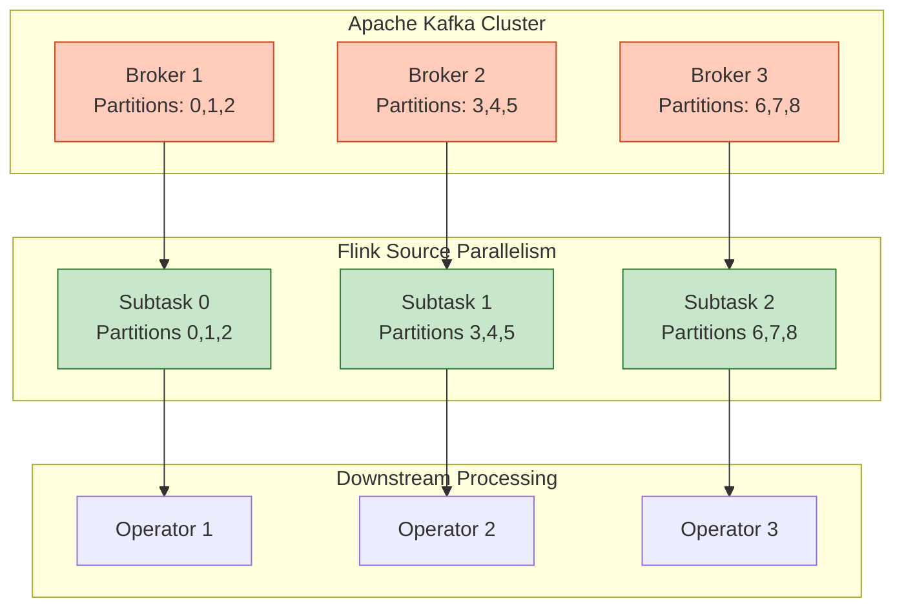
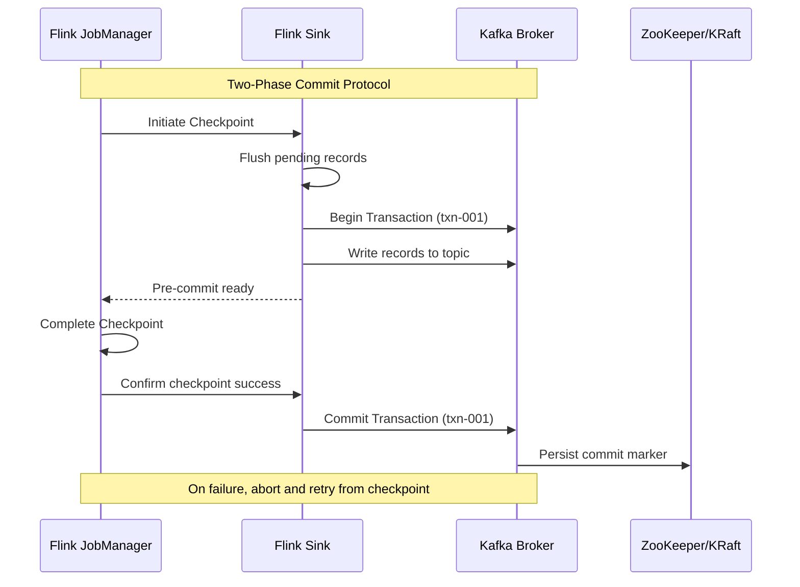
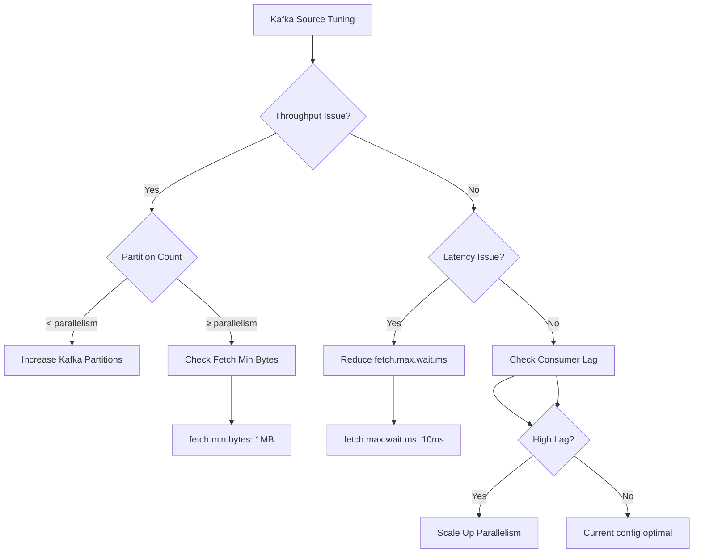
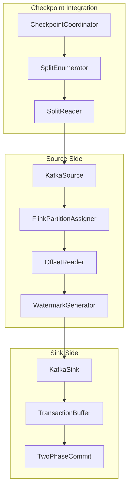
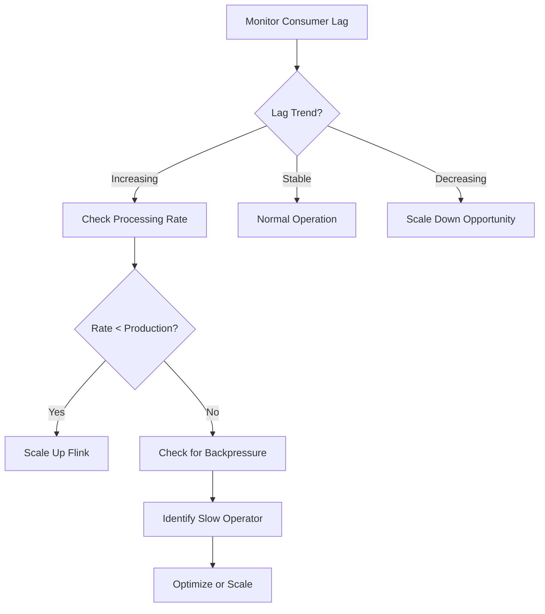
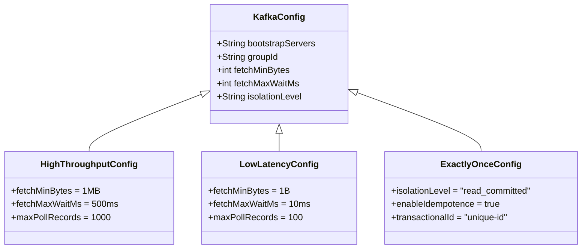

# Flink Kafka Connector: Deep Dive and Best Practices

> **Stage**: Flink/Connectors | **Prerequisites**: [Flink Architecture Overview](./01-architecture-overview.md) | **Formal Level**: L3-L4

---

## 1. Definitions

### Def-F-06-01: Kafka Source Connector

**Definition**: The Kafka Source Connector is a Flink connector that ingests data from Apache Kafka topics into Flink DataStreams, providing exactly-once semantics through Flink's checkpoint mechanism integrated with Kafka consumer groups.

**Formal Specification**:

$$
\text{KafkaSource}: \text{Topic} \times \text{Partition} \times \text{Offset} \rightarrow \text{Stream}\langle \text{Record} \rangle
$$

**Core Components**:

| Component | Function | Formal Property |
|-----------|----------|-----------------|
| `KafkaConsumer` | Polls records from brokers | $\forall p \in \text{Partitions}, \exists c \in \text{Consumers}: \text{assign}(c, p)$ |
| `OffsetCommit` | Tracks consumption progress | $\text{committed}(o) \Rightarrow \text{processed}(o)$ |
| `WatermarkGenerator` | Generates watermarks from record timestamps | $\text{WM}(t) \leq \min(\text{event\_time})$ |

---

### Def-F-06-02: Kafka Sink Connector

**Definition**: The Kafka Sink Connector writes processed records from Flink streams to Kafka topics, supporting three delivery guarantee levels: at-least-once, at-most-once, and exactly-once.

**Delivery Guarantees**:

| Guarantee | Mechanism | Constraints |
|-----------|-----------|-------------|
| At-Most-Once | Fire-and-forget | No retry, possible data loss |
| At-Least-Once | Retry on failure | May produce duplicates |
| Exactly-Once | Two-phase commit with Kafka transactions | Requires transaction-enabled brokers |

**Formal Property** (Exactly-Once):

$$
\text{KafkaSink}_{\text{exactly-once}} \equiv \text{2PC} \land \text{TransactionId} \land \text{CheckpointAlignment}
$$

---

### Def-F-06-03: Consumer Group Rebalancing

**Definition**: The process by which Kafka redistributes topic partitions among active consumers in a group when membership changes.

**Rebalance Protocol**:

```
State Transition: Stable → Rebalancing → Stable
Trigger Events: {Consumer Join, Consumer Leave, Partition Change}
Partition Assignment: P → C (Surjective mapping from partitions to consumers)
```

**Flink's Cooperative Rebalancing** (FLIP-27):

| Aspect | Eager Rebalance (Legacy) | Cooperative Rebalance (Modern) |
|--------|-------------------------|-------------------------------|
| Partition Revocation | All partitions | Only affected partitions |
| State Migration | Full savepoint required | Incremental handover |
| Downtime | High | Minimal |

---

## 2. Properties

### Lemma-F-06-01: Offset Consistency Under Checkpoint

**Lemma**: When Flink checkpointing is enabled, the committed offset is always less than or equal to the processed offset.

**Proof**:

Let $O_p$ be the set of processed offsets and $O_c$ be the set of committed offsets.

1. During checkpoint, Flink stores the current consumer position in state
2. Offsets are committed to Kafka only after successful checkpoint completion
3. Therefore: $\forall o \in O_c: o \in O_p \land \nexists o' \in O_c: o' > \max(O_p)$

$$\therefore O_c \subseteq O_p \Rightarrow \max(O_c) \leq \max(O_p) \quad \square$$

---

### Prop-F-06-01: Exactly-Once Guarantee Conditions

**Proposition**: Exactly-once semantics are guaranteed if and only if:

1. `isolation.level=read_committed` for consumers
2. Transactional IDs are unique and monotonic
3. Checkpoint interval < transaction timeout
4. Flink job restarts from last successful checkpoint

**Formal Condition**:

$$
\text{ExactlyOnce} \iff \begin{cases}
\text{ReadCommitted} \land \\
\text{UniqueTxnId} \land \\
T_{\text{checkpoint}} < T_{\text{transaction\_timeout}} \land \\
\text{RestartFromCheckpoint}
\end{cases}
$$

---

### Lemma-F-06-02: Parallelism Bound

**Lemma**: The maximum effective parallelism of a Kafka source is bounded by the number of partitions.

$$
\text{EffectiveParallelism} = \min(\text{ConfiguredParallelism}, \sum_{t \in \text{Topics}} |\text{Partitions}(t)|)
$$

**Implication**: Increasing parallelism beyond total partition count provides no throughput benefit for Kafka sources.

---

## 3. Relations

### 3.1 Kafka-Flink Integration Architecture



### 3.2 Exactly-Once Transaction Flow



---

## 4. Argumentation

### 4.1 Partition Assignment Strategy Comparison

| Strategy | Use Case | Pros | Cons |
|----------|----------|------|------|
| **Range Assignor** | Key-ordered processing | Preserves key locality | Uneven load with hot keys |
| **Round-Robin** | Balanced throughput | Even distribution | Breaks key ordering |
| **Sticky Assignor** | Minimal rebalancing | Preserves assignments | Slower to adapt |
| **Cooperative** | Large-scale streaming | Minimal disruption | Requires newer Kafka |

### 4.2 Performance Tuning Decision Matrix



---

## 5. Engineering Argument

### Thm-F-06-01: Exactly-Once End-to-End Guarantee

**Theorem**: With Kafka Source + Flink Processing + Kafka Sink, exactly-once semantics are maintained end-to-end.

**Proof Sketch**:

1. **Source Side**: Flink stores consumer offsets in checkpoint state
2. **Processing Side**: Flink's checkpoint mechanism ensures state consistency
3. **Sink Side**: Two-phase commit protocol with Kafka transactions
4. **Recovery**: On failure, replay from checkpoint with committed offsets

$$
\text{EndToEndExactlyOnce} = \text{SourceCheckpoint} \circ \text{StatefulProcessing} \circ \text{TransactionalSink}
$$

### 5.1 Configuration Best Practices

**High-Throughput Configuration** (100K+ events/sec):

```properties
# Source Configuration
fetch.min.bytes=1048576
fetch.max.wait.ms=500
max.poll.records=1000
enable.auto.commit=false

# Sink Configuration
batch.size=131072
linger.ms=100
compression.type=lz4
transaction.timeout.ms=900000
```

**Low-Latency Configuration** (< 100ms p99):

```properties
fetch.min.bytes=1
fetch.max.wait.ms=10
max.poll.records=100
batch.size=8192
linger.ms=0
```

---

## 6. Examples

### 6.1 Kafka Source with Watermark Generation

```java
// Modern FLIP-27 Source API
KafkaSource<String> source = KafkaSource.<String>builder()
    .setBootstrapServers("kafka:9092")
    .setTopics(Arrays.asList("events", "logs"))
    .setGroupId("flink-consumer-group")
    .setStartingOffsets(OffsetsInitializer.earliest())
    .setValueOnlyDeserializer(new SimpleStringSchema())
    .setProperty("fetch.min.bytes", "1048576")
    .build();

DataStream<String> stream = env.fromSource(
    source,
    WatermarkStrategy.forBoundedOutOfOrderness(Duration.ofSeconds(5)),
    "Kafka Source"
);
```

### 6.2 Exactly-Once Kafka Sink

```java
KafkaSink<String> sink = KafkaSink.<String>builder()
    .setBootstrapServers("kafka:9092")
    .setRecordSerializer(KafkaRecordSerializationSchema.builder()
        .setTopic("output-topic")
        .setValueSerializationSchema(new SimpleStringSchema())
        .build())
    .setDeliveryGuarantee(DeliveryGuarantee.EXACTLY_ONCE)
    .setTransactionalIdPrefix("flink-sink-")
    .build();

stream.sinkTo(sink);
```

### 6.3 Custom Partitioner for Keyed Data

```java
FlinkKafkaProducer<String> producer = new FlinkKafkaProducer<>(
    "output-topic",
    new KeyedSerializationSchemaWrapper<>(new SimpleStringSchema()),
    properties,
    Optional.of((KafkaPartitioner<String>) (record, key, value, targetTopic, partitions) -> {
        // Consistent hashing based on key
        return Math.abs(key.hashCode()) % partitions.length;
    })
);
```

---

## 7. Visualizations

### 7.1 Kafka Connector Architecture



### 7.2 Consumer Lag Monitoring Decision Tree



### 7.3 Configuration Selection Matrix



---

## 8. References


---

*Document Version: 2026.04-001 | Formal Level: L3-L4 | Last Updated: 2026-04-10*

**Related Documents**:

- [Flink Architecture Overview](./01-architecture-overview.md)
- [Exactly-Once Semantics](./03-checkpoint.md)
- [Flink Table API & SQL](./08-sql-semantics.md)
