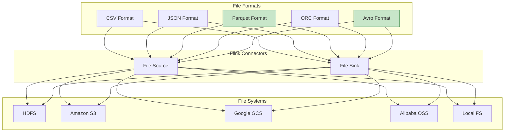
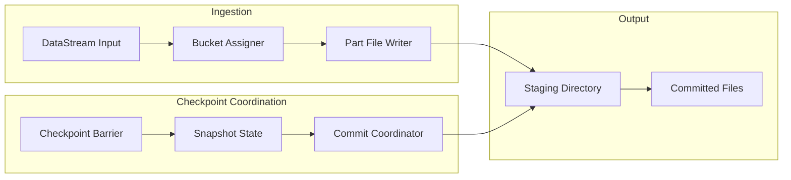
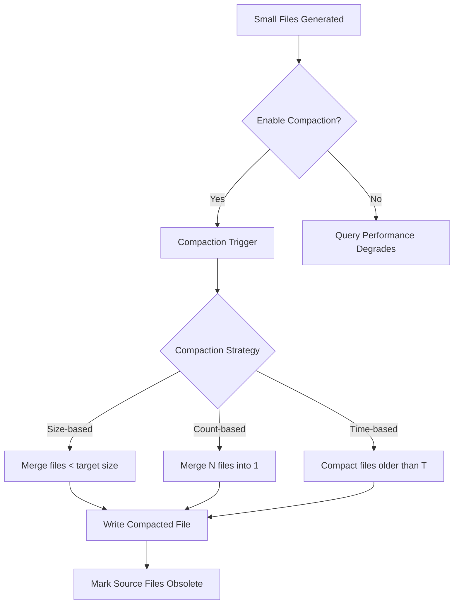
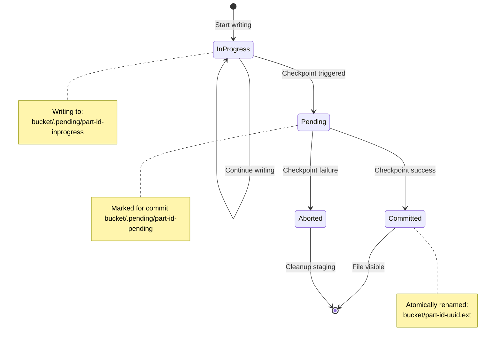
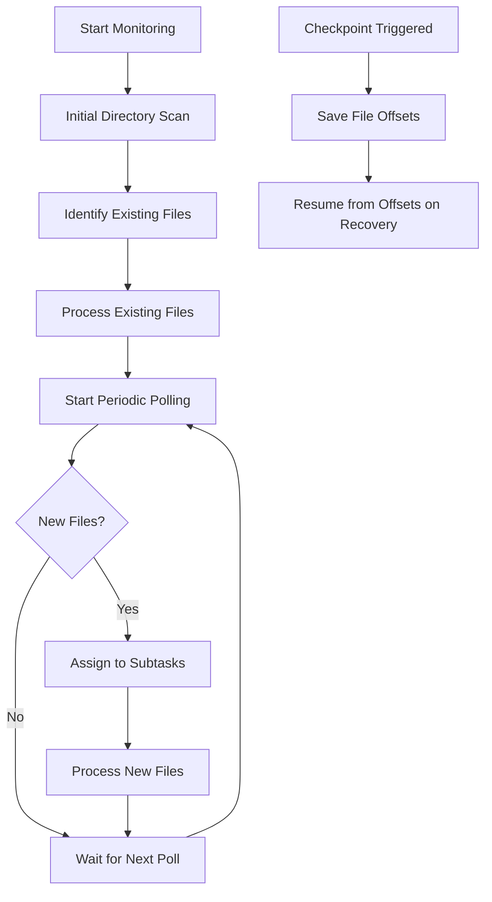
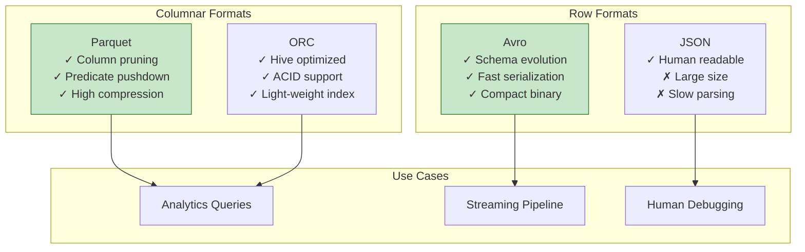

# Flink File System Connector: Unified Batch and Streaming

> **Stage**: Flink/Connectors | **Prerequisites**: [Flink Architecture Overview](./01-architecture-overview.md), [Kafka Connector](./06-kafka-connector.md) | **Formal Level**: L3-L4

---

## 1. Definitions

### Def-F-07-01: File Source Connector

**Definition**: The File Source Connector reads data from distributed file systems (HDFS, S3, OSS, GCS, Local FS) and converts files into a bounded or continuous DataStream, supporting both batch and streaming execution modes.

**Formal Specification**:

$$
\text{FileSource}: \text{Path} \times \text{Format} \times \text{DiscoveryMode} \rightarrow \text{Stream}\langle \text{Record} \rangle
$$

**Discovery Modes**:

| Mode | Semantic | Use Case |
|------|----------|----------|
| `BATCH` | Bounded, scans once | Historical data processing |
| `STREAM` | Continuous, monitors directory | Real-time data ingestion |
| `bounded` | Bounded with continuous monitoring | Bounded streaming |

---

### Def-F-07-02: File Sink Connector

**Definition**: The File Sink Connector writes Flink DataStream records to files in a specified format, supporting exactly-once semantics through the two-phase commit protocol and file staging mechanism.

**Exactly-Once Mechanism**:

$$
\text{FileSink}_{\text{exactly-once}} = \langle \text{StagingDir}, \text{CommitAction}, \text{CheckpointAlignment} \rangle
$$

**Write Stages**:

1. **In-Progress**: Records written to temporary staging files
2. **Pending**: On checkpoint, staging files marked for commit
3. **Committed**: After successful checkpoint, files moved to final location
4. **Aborted**: On failure, staging files cleaned up

---

### Def-F-07-03: Bucket and Part File

**Definition**: The File Sink organizes output into buckets (directories) and part files (actual data files) based on configurable assignment policies.

**Structure**:

```
Output Directory/
├── bucket-2024-01-15/          # Time-based bucket
│   ├── part-00001-in-progress  # Currently writing
│   ├── part-00000-abcdef.avro  # Completed part file
│   └── .pending/               # Pending commits
├── bucket-2024-01-16/
│   └── part-00000-fedcba.avro
└── _SUCCESS                    # Job completion marker
```

**Bucket Assignment Strategies**:

| Strategy | Partition Key | Example |
|----------|--------------|---------|
| `DateTimeBucketAssigner` | Processing/Event time | `yyyy-MM-dd--HH` |
| `BasePathBucketAssigner` | Single bucket | All to root |
| `CustomBucketAssigner` | User-defined | Customer ID |

---

## 2. Properties

### Lemma-F-07-01: File Source Boundedness

**Lemma**: A File Source is bounded if and only if the discovery mode is `BATCH` or the monitored directory has no new files after the scan.

**Proof**:

Let $F(t)$ be the set of files discovered at time $t$.

- **BATCH mode**: $\exists t_0: \forall t > t_0, F(t) = F(t_0)$ (fixed set)
- **STREAM mode**: $\forall t, \exists t' > t: F(t') \supset F(t)$ (growing set)

Therefore:

$$
\text{Bounded}(\text{FileSource}) \iff \text{mode} = \text{BATCH} \lor (\text{mode} = \text{STREAM} \land \neg\exists \text{new files})
$$

$$\square$$

---

### Prop-F-07-01: Exactly-Once File Sink Guarantee

**Proposition**: The File Sink provides exactly-once semantics through atomic commit operations supported by the underlying file system.

**Required File System Properties**:

| Property | HDFS | S3 | Local FS |
|----------|------|-----|----------|
| Atomic rename | ✅ | ✅ (via MPU) | ✅ |
| Visibility after commit | ✅ | ✅ (eventual) | ✅ |
| Transaction cleanup | ✅ | ✅ | ✅ |

**Commit Protocol**:

```
1. Write to: bucket/.pending/part-{id}-{checkpoint}
2. On checkpoint success:
   a. Rename: .pending/part-{id}-{checkpoint} → part-{id}-{uuid}.ext
   b. Delete: .pending/part-{id}-{checkpoint}
3. On checkpoint failure:
   a. Delete: .pending/part-{id}-{checkpoint}
```

---

### Lemma-F-07-02: Rolling Policy Monotonicity

**Lemma**: Part file creation follows a monotonic sequence: once a part file is marked complete, it never receives new records.

**Proof**:

Let $P_i$ denote part file $i$ with state $S(P_i) \in \{\text{IN_PROGRESS}, \text{PENDING}, \text{COMMITTED}\}$.

State transitions:

- $\text{IN_PROGRESS} \rightarrow \text{PENDING}$ (on checkpoint)
- $\text{PENDING} \rightarrow \text{COMMITTED}$ (after successful checkpoint)
- $\text{PENDING} \rightarrow \text{ABORTED}$ (on failure)

No reverse transitions exist. $\square$

---

## 3. Relations

### 3.1 File Connector Ecosystem



### 3.2 Streaming File Sink Architecture



---

## 4. Argumentation

### 4.1 Format Selection Decision Matrix

| Format | Compression | Schema Evolution | Query Performance | Use Case |
|--------|-------------|------------------|-------------------|----------|
| **Parquet** | Excellent | Good | Excellent | Analytics, columnar queries |
| **Avro** | Good | Excellent | Moderate | Streaming, schema evolution |
| **ORC** | Excellent | Moderate | Excellent | Hive integration |
| **JSON** | Poor | N/A | Poor | Debugging, simple structures |
| **CSV** | Poor | N/A | Poor | Legacy system compatibility |

### 4.2 Small File Problem and Compaction

**Problem Statement**: High-frequency streaming writes generate many small files, impacting query performance.

**Compaction Strategy**:



**Compaction Configuration**:

```java
FileSink.forRowFormat(new Path("s3://bucket/output"), new SimpleStringEncoder())
    .enableCompact(
        FileCompactStrategy.builder()
            .setSizeThreshold(128 * 1024 * 1024)  // 128MB
            .enableCompactionOnCheckpoint(5)      // Every 5 checkpoints
            .build(),
        new RecordWiseFileCompactor<>(new SimpleStringDecoder())
    )
    .build();
```

---

## 5. Engineering Argument

### Thm-F-07-01: Exactly-Once File Output Guarantee

**Theorem**: The File Sink guarantees exactly-once semantics when the underlying file system supports atomic rename operations.

**Proof**:

1. **Write Phase**: Records are written to temporary staging files
   - $\forall r \in \text{Records}: \text{write}(r) \rightarrow \text{StagingFile}$

2. **Pre-Commit Phase**: On checkpoint, staging files are marked pending
   - $\text{Snapshot} = \{\text{pending\_files}\}$

3. **Commit Phase**: After successful checkpoint, atomic rename commits files
   - $\text{atomic\_rename}(\text{pending}, \text{committed})$

4. **Abort Phase**: On failure, pending files are deleted
   - $\neg\text{checkpoint\_success} \Rightarrow \text{delete}(\text{pending})$

Since atomic rename ensures visibility only after success:

$$
\forall f \in \text{CommittedFiles}: \exists! \text{ checkpoint}: f \in \text{Snapshot}(\text{checkpoint})
$$

$$\square$$

### 5.1 Performance Tuning Guidelines

**HDFS Optimization**:

```java
// Increase block size for large files
Configuration conf = new Configuration();
conf.set("dfs.blocksize", "268435456");  // 256MB

// Enable short-circuit reads for local access
conf.set("dfs.client.read.shortcircuit", "true");
```

**S3 Optimization**:

```java
// Multipart upload for large files
FileSink.forBulkFormat(
    new Path("s3://bucket/output"),
    ParquetAvroWriters.forGenericRecord(schema))
    .setS3UploadPartSize(128 * 1024 * 1024)  // 128MB parts
    .setS3MultiPartUploadThreshold(256 * 1024 * 1024)  // 256MB threshold
    .build();
```

---

## 6. Examples

### 6.1 File Source with Continuous Monitoring

```java

import org.apache.flink.streaming.api.datastream.DataStream;

// Continuous file discovery for streaming
FileSource<String> source = FileSource
    .forRecordStreamFormat(
        new TextLineFormat(),
        new Path("s3://data-bucket/incoming/"))
    .setFileEnumeratorParallelism(10)
    .setContinuousFileMonitoring(Duration.ofSeconds(30))
    .setFileDiscoveryPolicy(FileDiscoveryPolicy.NEW_FILES_ONLY)
    .build();

DataStream<String> stream = env.fromSource(
    source,
    WatermarkStrategy.forBoundedOutOfOrderness(Duration.ofMinutes(5)),
    "File Source"
);
```

### 6.2 Parquet Sink with Partitioning

```java
// Parquet sink with time-based bucketing
FileSink<GenericRecord> sink = FileSink
    .forBulkFormat(
        new Path("hdfs:///warehouse/events"),
        ParquetAvroWriters.forGenericRecord(schema))
    .withBucketAssigner(new DateTimeBucketAssigner<>("yyyy-MM-dd--HH"))
    .withRollingPolicy(
        DefaultRollingPolicy.builder()
            .withRolloverInterval(Duration.ofMinutes(15))
            .withInactivityInterval(Duration.ofMinutes(5))
            .withMaxPartSize(128 * 1024 * 1024)
            .build())
    .withOutputFileConfig(
        OutputFileConfig.builder()
            .withPartPrefix("events")
            .withPartSuffix(".parquet")
            .build())
    .build();

stream.sinkTo(sink);
```

### 6.3 Avro Sink with Schema Evolution

```java
// Avro format supports schema evolution
Schema evolvedSchema = new Schema.Parser().parse(
    new File("user-v2.avsc")
);

FileSink<UserEvent> sink = FileSink
    .forBulkFormat(
        new Path("s3://events/avro-output"),
        AvroWriters.forSpecificRecord(UserEvent.class))
    .withBucketAssigner(new BasePathBucketAssigner<>())
    .build();
```

---

## 7. Visualizations

### 7.1 File Sink Commit Protocol



### 7.2 Directory Monitoring Flow



### 7.3 Format Comparison Matrix



---

## 8. References


---

*Document Version: 2026.04-001 | Formal Level: L3-L4 | Last Updated: 2026-04-10*

**Related Documents**:

- [Kafka Connector](./06-kafka-connector.md)
- [Checkpoint Mechanism](./03-checkpoint.md)
- [Flink Architecture Overview](./01-architecture-overview.md)
