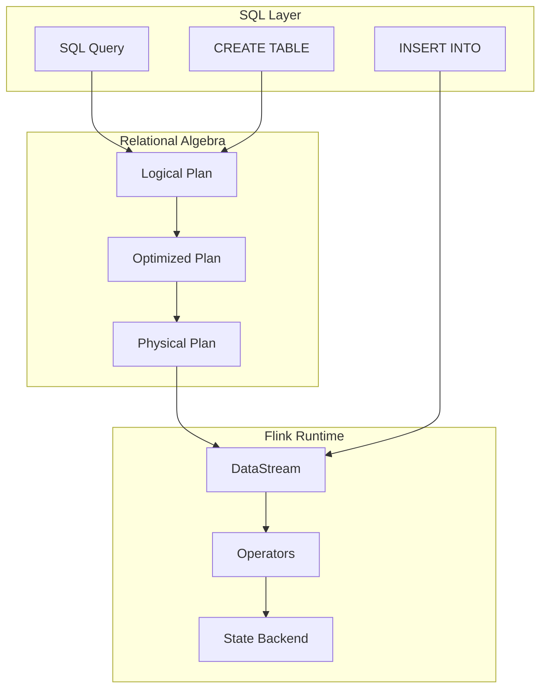
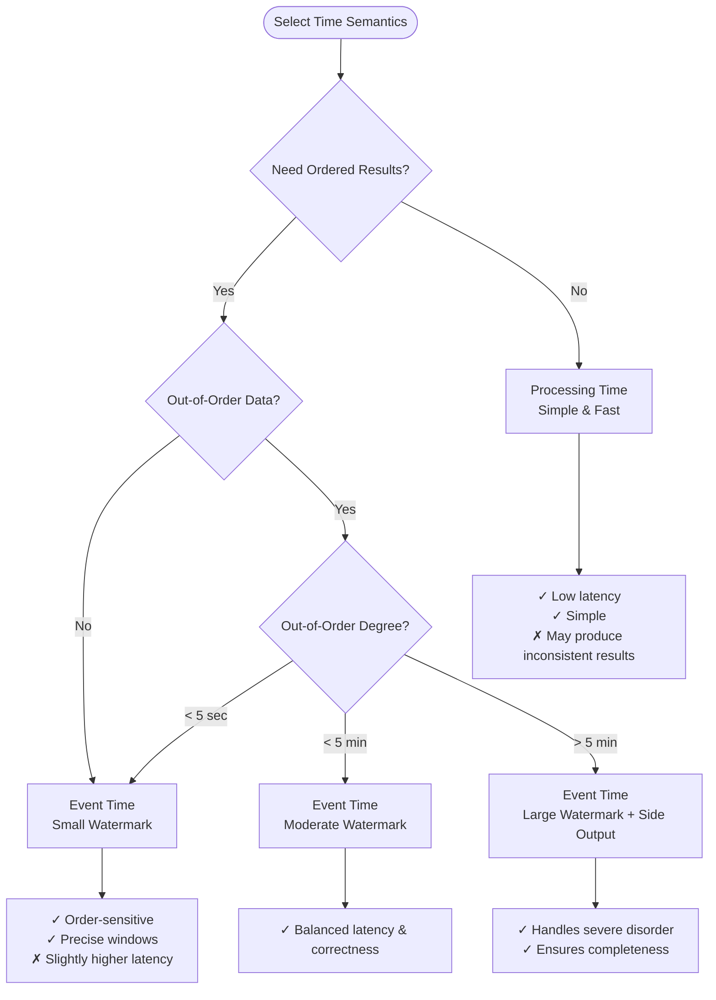
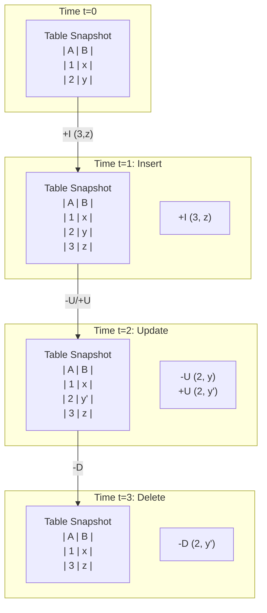
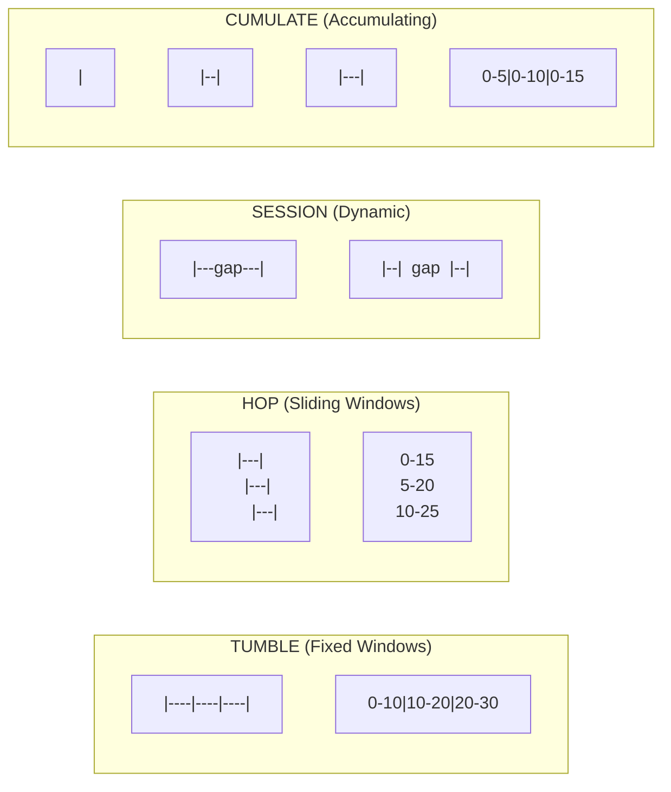
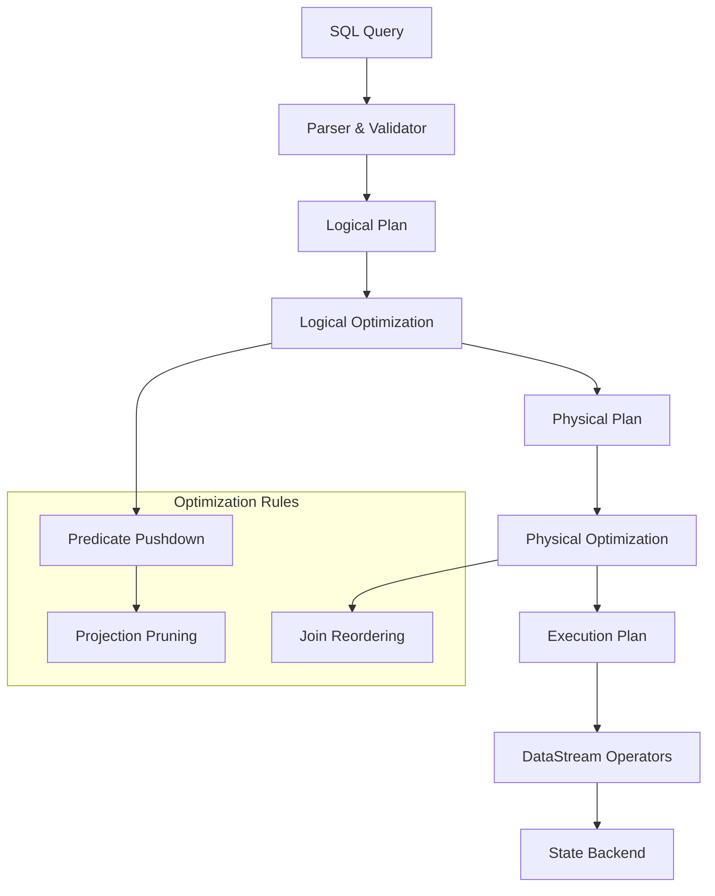

# Flink SQL Semantics: Dynamic Tables and Continuous Queries

> **Stage**: Flink/Table API | **Prerequisites**: [Flink Architecture Overview](./01-architecture-overview.md), [Stream Processing](./02-stream-processing.md) | **Formal Level**: L4-L5

---

## 1. Definitions

### Def-F-08-01: Flink SQL Semantic Model

**Definition**: Flink SQL extends standard ANSI SQL with stream processing semantics, defining queries over dynamic tables that evolve over time.

**Formal Model**:

$$
\text{FlinkSQL} = (\mathcal{D}, \mathcal{Q}, \mathcal{T}, \mathcal{S}, \mathcal{W})
$$

Where:

- $\mathcal{D}$: Data Definition Language (DDL) - table, view, function definitions
- $\mathcal{Q}$: Query Language (DQL) - SELECT, WHERE, JOIN operations
- $\mathcal{T}$: Data Manipulation Language (DML) - INSERT, UPDATE semantics
- $\mathcal{S}$: Stream extensions - time attributes, windows, watermarks
- $\mathcal{W}$: Watermark specification - event time progress tracking

---

### Def-F-08-02: Dynamic Table

**Definition**: A dynamic table is a time-varying relation where each point in time corresponds to a snapshot of a static table.

**Formal Definition**:

$$
\text{DynamicTable}: \mathbb{T} \rightarrow \text{Table}
$$

Where $\mathbb{T}$ is the time domain and $\text{Table}$ is a finite set of tuples.

**Changelog Semantics**:

| Change Type | Symbol | SQL Semantics | Stream Representation |
|-------------|--------|---------------|----------------------|
| Insert | `+I` | New row added | Append-only stream |
| Delete | `-D` | Row removed | Retraction stream |
| Update Before | `-U` | Old value | Before-image for update |
| Update After | `+U` | New value | After-image for update |

---

### Def-F-08-03: Time Attributes

**Definition**: Time attributes define how temporal semantics are interpreted in stream processing.

**Event Time**:

$$
\text{EventTime}(e) = t_{\text{event}} \quad \text{(when event occurred)}
$$

```sql
CREATE TABLE events (
    event_time TIMESTAMP(3),
    WATERMARK FOR event_time AS event_time - INTERVAL '5' SECOND
)
```

**Processing Time**:

$$
\text{ProcessingTime}(e) = t_{\text{process}} \quad \text{(when event is processed)}
$$

```sql
CREATE TABLE events (
    proc_time AS PROCTIME()
)
```

**Ingestion Time**:

$$
\text{IngestionTime}(e) = t_{\text{ingest}} \quad \text{(when event entered Flink)}
$$

---

### Def-F-08-04: Continuous Query

**Definition**: A continuous query evaluates a SQL query over a dynamic table and produces a stream of results that are continuously updated.

**Formal Specification**:

$$
\text{ContinuousQuery}: \mathcal{D}(t) \rightarrow \Delta\mathcal{R}(t)
$$

Where $\Delta\mathcal{R}(t)$ represents the changelog stream of result updates.

**Query Types**:

| Type | Output | Use Case |
|------|--------|----------|
| Append Query | Only `+I` | Window aggregations, simple selects |
| Update Query | `+I/-U/+U/-D` | Grouped aggregations, JOINs |
| Upsert Query | `+U/-D` | Primary key-based outputs |

---

## 2. Properties

### Lemma-F-08-01: Event Time Monotonicity

**Lemma**: Watermarks in Flink SQL are monotonic non-decreasing functions of processing time.

**Proof**:

Let $W(t)$ be the watermark at processing time $t$, and $E(e)$ be the event time of record $e$.

Watermark generation rule:

$$
W(t) = \min_{e \in \text{Buffer}} E(e) - \text{delay}
$$

Since records are processed in arrival order:

$$t_1 < t_2 \Rightarrow W(t_1) \leq W(t_2) \quad \square$$

---

### Prop-F-08-01: Window Result Completeness

**Proposition**: Once a window is triggered by a watermark passing its end timestamp, the result is complete for that window.

**Formal Statement**:

For window $w$ with end time $t_{\text{end}}$:

$$
\forall t: W(t) \geq t_{\text{end}} \Rightarrow \text{Result}(w, t) = \text{CompleteResult}(w)
$$

**Conditions**:

- Watermark strategy correctly configured
- No late data allowed (or handled by side output)
- Event timestamps are accurate

---

### Lemma-F-08-02: JOIN State Boundedness

**Lemma**: The state required for stream JOIN operations is bounded when time-window constraints are applied.

**Proof**:

For interval JOIN with bound $\delta$:

$$
|State_{\text{join}}(t)| \leq |\{e : t - \delta \leq E(e) \leq t + \delta\}|
$$

As $t \rightarrow \infty$, old state is purged by watermark progression:

$$
\lim_{t \rightarrow \infty} \frac{|State_{\text{join}}(t)|}{t} = 0 \quad \square$$

---

## 3. Relations

### 3.1 SQL to Relational Algebra Mapping



### 3.2 Stream-Batch Unification

| Aspect | Batch SQL | Streaming SQL |
|--------|-----------|---------------|
| Data Source | Bounded table | Dynamic table |
| Result | Final | Continuous updates |
| Execution | One-shot | Continuous |
| Watermark | N/A | Required |
| State | Temporary | Persistent |

**Unification Principle**:

$$
\text{Batch} = \lim_{|\text{Input}| < \infty} \text{Streaming}
$$

---

## 4. Argumentation

### 4.1 Time Semantics Selection Decision Tree



### 4.2 SQL vs Table API Selection Guide

| Scenario | Recommendation | Rationale |
|----------|---------------|-----------|
| Complex business logic | Table API | Type-safe, IDE support, testable |
| Ad-hoc queries / BI | SQL | Declarative, rich tool ecosystem |
| Dynamic query generation | SQL | Flexible string concatenation |
| Integration with existing systems | SQL | Standard interface, low learning curve |
| Fine-grained control needed | Table API | Access to low-level APIs |

---

## 5. Proof / Engineering Argument

### Thm-F-08-01: Changelog Stream Completeness

**Theorem**: For any continuous query $Q$ over dynamic table $T$, the changelog stream output preserves all changes to the result.

**Proof**:

Let $\Delta T(t)$ be the set of changes to table $T$ at time $t$.

1. Query evaluation function: $Q(T(t)) = R(t)$
2. Change propagation: $\Delta R(t) = Q(T(t)) - Q(T(t-1))$
3. Each $\Delta R(t)$ is encoded as changelog entries

For insert: $+I \Leftrightarrow \{r \in R(t) : r \notin R(t-1)\}$

For delete: $-D \Leftrightarrow \{r \in R(t-1) : r \notin R(t)\}$

For update: $-U/+U \Leftrightarrow \{r : r \in R(t-1) \land r' \in R(t) \land \text{key}(r) = \text{key}(r')\}$

$$\therefore \text{Changelog}(Q, T) \text{ is complete and correct} \quad \square$$

### 5.1 DDL Best Practices

**Optimized Table Definition**:

```sql
-- High-performance source table
CREATE TABLE user_events (
    -- Primary key for CDC sources
    event_id STRING,
    user_id STRING,

    -- Event time with watermark
    event_time TIMESTAMP(3),
    WATERMARK FOR event_time AS event_time - INTERVAL '5' SECOND,

    -- Processing time for latency-sensitive operations
    proc_time AS PROCTIME(),

    -- Computed columns
    event_date AS DATE_FORMAT(event_time, 'yyyy-MM-dd'),

    PRIMARY KEY (event_id) NOT ENFORCED
) WITH (
    'connector' = 'kafka',
    'topic' = 'user-events',
    'properties.bootstrap.servers' = 'kafka:9092',
    'scan.startup.mode' = 'latest-offset',
    'format' = 'json',
    'json.fail-on-missing-field' = 'false'
);
```

---

## 6. Examples

### 6.1 TUMBLE Window Aggregation

```sql
-- Hourly user activity statistics
SELECT
    user_id,
    TUMBLE_START(event_time, INTERVAL '1' HOUR) as window_start,
    TUMBLE_END(event_time, INTERVAL '1' HOUR) as window_end,
    COUNT(*) as event_count,
    COUNT(DISTINCT event_type) as unique_events
FROM user_events
GROUP BY
    user_id,
    TUMBLE(event_time, INTERVAL '1' HOUR);
```

### 6.2 HOP Window for Moving Average

```sql
-- 5-minute moving average updated every minute
SELECT
    url,
    HOP_START(event_time, INTERVAL '1' MINUTE, INTERVAL '5' MINUTE) as window_start,
    AVG(response_time) as avg_response_time,
    PERCENTILE_CONT(0.99) WITHIN GROUP (ORDER BY response_time) as p99_latency
FROM access_logs
GROUP BY
    url,
    HOP(event_time, INTERVAL '1' MINUTE, INTERVAL '5' MINUTE);
```

### 6.3 Temporal Table JOIN

```sql
-- Currency conversion with slowly-changing dimension
CREATE TABLE orders (
    order_id STRING,
    currency STRING,
    amount DECIMAL(10, 2),
    order_time TIMESTAMP(3),
    WATERMARK FOR order_time AS order_time - INTERVAL '10' SECOND
);

CREATE TABLE exchange_rates (
    currency STRING,
    rate DECIMAL(10, 6),
    update_time TIMESTAMP(3),
    WATERMARK FOR update_time AS update_time - INTERVAL '5' SECOND,
    PRIMARY KEY (currency) NOT ENFORCED
) WITH (
    'connector' = 'jdbc',
    'url' = 'jdbc:mysql://...',
    'table-name' = 'rates'
);

-- Temporal JOIN: use exchange rate valid at order time
SELECT
    o.order_id,
    o.amount * r.rate as amount_usd
FROM orders o
LEFT JOIN exchange_rates FOR SYSTEM_TIME AS OF o.order_time r
ON o.currency = r.currency;
```

### 6.4 Continuous Deduplication

```sql
-- Deduplicate events by event_id, keeping the first occurrence
SELECT event_id, event_time, payload
FROM (
    SELECT
        *,
        ROW_NUMBER() OVER (
            PARTITION BY event_id
            ORDER BY event_time ASC
        ) as rn
    FROM events
)
WHERE rn = 1;
```

---

## 7. Visualizations

### 7.1 Dynamic Table Evolution



### 7.2 Window Types Comparison



### 7.3 Query Execution Flow



---

## 8. References

[^1]: T. Akidau et al., "The Dataflow Model: A Practical Approach to Balancing Correctness, Latency, and Cost in Massive-Scale, Unbounded, Out-of-Order Data Processing", PVLDB, 8(12), 2015.

[^2]: Apache Flink Documentation, "SQL", 2025. https://nightlies.apache.org/flink/flink-docs-stable/docs/dev/table/sql/

[^3]: Apache Flink Documentation, "Dynamic Tables", 2025. https://nightlies.apache.org/flink/flink-docs-stable/docs/dev/table/concepts/dynamic_tables/

[^4]: J. Li et al., "SemFlow: An Efficient SQL Streaming Engine", SIGMOD 2022.

---

*Document Version: 2026.04-001 | Formal Level: L4-L5 | Last Updated: 2026-04-10*

**Related Documents**:

- [Query Optimization](./09-query-optimization.md)
- [Flink Table API Complete Guide](../../../Flink/03-api/03.02-table-sql-api/flink-table-sql-complete-guide.md)
- [Window Functions Deep Dive](../../../Flink/03-api/03.02-table-sql-api/flink-sql-window-functions-deep-dive.md)
