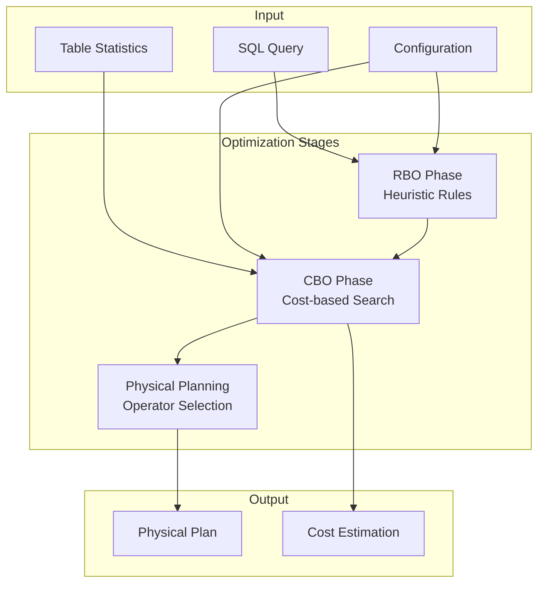
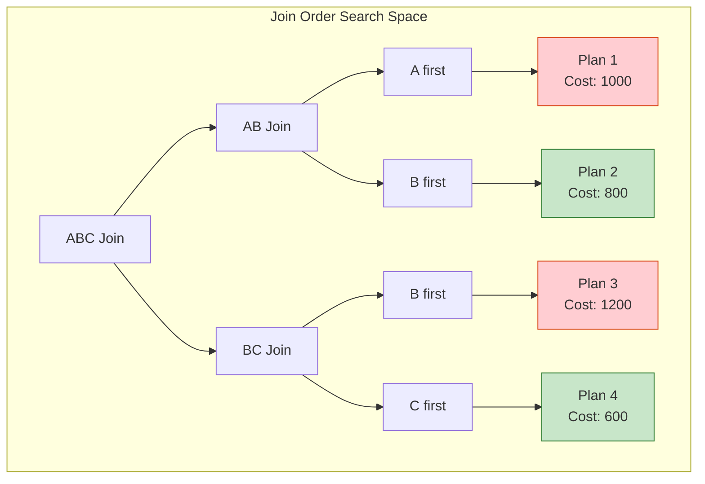
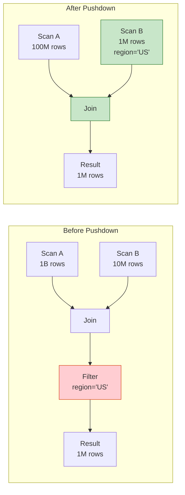
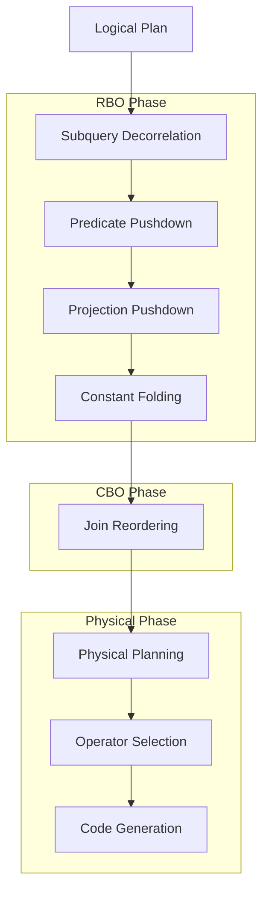

# Flink SQL Query Optimization: RBO and CBO Deep Dive

> **Stage**: Flink/Table API | **Prerequisites**: [SQL Semantics](./08-sql-semantics.md), [Flink Architecture Overview](./01-architecture-overview.md) | **Formal Level**: L4-L5

---

## 1. Definitions

### Def-F-09-01: Query Optimizer Architecture

**Definition**: The Flink SQL query optimizer transforms logical query plans into efficient physical execution plans through rule-based optimization (RBO) and cost-based optimization (CBO).

**Formal Model**:

$$
\text{Optimizer}: \text{LogicalPlan} \times \text{Statistics} \times \text{Config} \rightarrow \text{PhysicalPlan}
$$

**Architecture Components**:

```
SQL / Table API
      ↓
[Parser + Validator] → SqlNode
      ↓
[Logical Plan] → RelNode Tree
      ↓
[HepPlanner] → RBO Optimization
      ↓
[VolcanoPlanner] → CBO Optimization
      ↓
[Physical Plan] → FlinkPhysicalRel
      ↓
[Code Generation] → Transformation
      ↓
[Execution]
```

---

### Def-F-09-02: Rule-Based Optimization (RBO)

**Definition**: RBO applies heuristic transformation rules to query plans without considering data statistics, ensuring deterministic and efficient query rewriting.

**Rule Categories**:

| Category | Rules | Description |
|----------|-------|-------------|
| Predicate Pushdown | `FilterIntoJoin`, `PushFilterIntoSource` | Move filters closer to data source |
| Projection Pushdown | `ProjectPushdown`, `ProjectMerge` | Eliminate unused columns |
| Join Optimization | `FilterIntoJoin`, `JoinToMultiJoin` | Optimize join conditions |
| Subquery Rewrite | `SubQueryRemove`, `Decorrelate` | Convert subqueries to joins |
| Aggregation Optimization | `TwoPhaseAgg`, `DistinctAggSplit` | Optimize grouping operations |

---

### Def-F-09-03: Cost-Based Optimization (CBO)

**Definition**: CBO evaluates multiple candidate plans using a cost model and statistics, selecting the plan with the lowest estimated execution cost.

**Cost Model**:

$$
\text{Cost}(P) = \alpha \cdot \text{CPU}(P) + \beta \cdot \text{IO}(P) + \gamma \cdot \text{Network}(P) + \delta \cdot \text{Memory}(P)
$$

**Statistics Used**:

| Statistic | Symbol | Description |
|-----------|--------|-------------|
| Row Count | $N$ | Total number of rows |
| Null Count | $N_{\text{null}}$ | Number of null values |
| Distinct Values | $NDV$ | Number of distinct values |
| Average Length | $L_{\text{avg}}$ | Average column size |
| Min/Max Values | $[V_{\min}, V_{\max}]$ | Value range |

---

### Def-F-09-04: Join Algorithms

**Definition**: Different join implementations optimized for specific data distributions and sizes.

| Algorithm | Time Complexity | Space Complexity | Network Cost |
|-----------|-----------------|------------------|--------------|
| Broadcast Hash Join | $O(|R| + |S|)$ | $O(|S|)$ | Broadcast small table |
| Shuffle Hash Join | $O(|R| + |S|)$ | $O(\min(|R|, |S|))$ | Shuffle both tables |
| Sort-Merge Join | $O(|R|\log|R| + |S|\log|S|)$ | $O(1)$ | Shuffle both tables |
| Nested Loop Join | $O(|R| \cdot |S|)$ | $O(1)$ | Cartesian product |

---

## 2. Properties

### Lemma-F-09-01: Predicate Pushdown Equivalence

**Lemma**: Pushing predicates below join operations preserves query semantics.

**Formal Proof**:

For relations $R$ and $S$ with predicate $\theta = \theta_R \land \theta_S$:

$$
\sigma_{\theta}(R \bowtie S) \equiv \sigma_{\theta_R}(R) \bowtie \sigma_{\theta_S}(S)
$$

Where $\theta_R$ only references $R$ attributes and $\theta_S$ only references $S$ attributes.

**Optimization Impact**:

| Scenario | Before Pushdown | After Pushdown | Improvement |
|----------|-----------------|----------------|-------------|
| Join input | $|R| + |S|$ | $|\sigma_{\theta_R}(R)| + |\sigma_{\theta_S}(S)|$ | Reduced data |
| Example | 1B + 10M rows | 100M + 1M rows | 90% reduction |

$$\square$$

---

### Prop-F-09-01: Join Reordering Optimality

**Proposition**: For $n$ relations, the optimal join order minimizes intermediate result size.

**Search Space**:

$$
|\mathcal{T}(n)| = \text{Catalan}(n-1) \cdot (n-1)! = \frac{(2n-2)!}{(n-1)!}
$$

**Heuristic Approach**:

For multi-way joins, CBO uses dynamic programming with pruning:

```
Cost({R1, R2, ..., Rn}) = min(
    Cost({R1}) + Cost({R2, ..., Rn}) + JoinCost(R1, {R2,...,Rn}),
    Cost({R1, R2}) + Cost({R3, ..., Rn}) + JoinCost({R1,R2}, {R3,...,Rn}),
    ...
)
```

---

### Lemma-F-09-02: CBO Plan Quality Bound

**Lemma**: With accurate statistics, CBO selects a plan within $(1+\epsilon)$ of the optimal cost, where $\epsilon$ depends on estimation error.

**Proof Sketch**:

Let $P_{\text{opt}}$ be the true optimal plan and $P_{\text{cbo}}$ be the CBO-selected plan.

With estimation error bound $\delta$:

$$
\frac{\text{Cost}_{\text{est}}(P)}{\text{Cost}_{\text{true}}(P)} \in [1-\delta, 1+\delta]
$$

Then:

$$
\frac{\text{Cost}(P_{\text{cbo}})}{\text{Cost}(P_{\text{opt}})} \leq \frac{1+\delta}{1-\delta} \approx 1 + 2\delta \quad \square$$

---

## 3. Relations

### 3.1 Optimization Pipeline



### 3.2 Join Strategy Selection

```mermaid
flowchart TD
    START([Join Strategy]) --> Q1{Join Type?}

    Q1 -->|Equi-Join| Q2{Table Size?}
    Q1 -->|Non-Equi| NL[Nested Loop<br/>O(n²)]

    Q2 -->|One table small| Q3{< broadcast threshold?}
    Q2 -->|Both large| Q4{Data sorted?}

    Q3 -->|Yes| BC[Broadcast Hash Join<br/>Optimal for small tables]
    Q3 -->|No| HM[Shuffle Hash Join<br/>Build hash on smaller table]

    Q4 -->|Yes| SM[Sort-Merge Join<br/>Leverage existing sort]
    Q4 -->|No| HM2[Shuffle Hash Join]

    BC --> END([Execute])
    HM --> END
    SM --> END
    NL --> END
    HM2 --> END

    style BC fill:#c8e6c9,stroke:#2e7d32
    style SM fill:#bbdefb,stroke:#1976d2
    style NL fill:#ffcdd2,stroke:#d84315
```

---

## 4. Argumentation

### 4.1 Statistics Collection Strategy

| Statistic Collection Method | Accuracy | Overhead | Use Case |
|---------------------------|----------|----------|----------|
| `ANALYZE TABLE` | High | High (full scan) | Critical tables |
| Sampling (10%) | Medium | Medium | Large tables |
| Metadata-only | Low | Minimal | Dynamic tables |

**Best Practice**:

```sql
-- Full analysis for critical tables
ANALYZE TABLE orders COMPUTE STATISTICS;

-- Column-specific analysis
ANALYZE TABLE events COMPUTE STATISTICS FOR COLUMNS user_id, event_type;

-- Sampling for large tables
ANALYZE TABLE big_table COMPUTE STATISTICS WITH SAMPLE 10 PERCENT;
```

### 4.2 Common Optimization Pitfalls

| Problem | Symptom | Solution |
|---------|---------|----------|
| Missing statistics | Suboptimal join order | Run `ANALYZE TABLE` |
| Data skew | Some tasks run much slower | Use SALT keys or adaptive batching |
| Large broadcast | Out of memory | Increase threshold or use shuffle join |
| Over-parallelism | High coordination overhead | Match parallelism to partitions |

---

## 5. Proof / Engineering Argument

### Thm-F-09-01: Optimal Join Order with Dynamic Programming

**Theorem**: The dynamic programming approach finds the optimal join order for $n$ relations in $O(3^n)$ time.

**Proof**:

For each subset $S \subseteq \{R_1, ..., R_n\}$:
1. Compute optimal cost for $S$
2. For all partitions $S = S_1 \cup S_2$:
   - $Cost(S) = \min(Cost(S_1) + Cost(S_2) + JoinCost(S_1, S_2))$

Number of subsets: $2^n$
For each subset, enumerate partitions: $O(2^{|S|})$

Total: $\sum_{k=1}^{n} \binom{n}{k} 2^k = 3^n$ $\square$

### 5.1 Performance Tuning Guidelines

**Enable CBO**:

```sql
-- Enable cost-based optimization
SET table.optimizer.join-reorder-enabled = 'true';
SET table.optimizer.join.broadcast-threshold = '10MB';

-- Enable advanced rewrites
SET table.optimizer.distinct-agg.split.enabled = 'true';
SET table.optimizer.agg-phase-strategy = 'TWO_PHASE';
```

**Join Hints**:

```sql
-- Force broadcast join
SELECT /*+ BROADCAST(d) */ *
FROM fact_table f
JOIN dimension_table d ON f.dim_id = d.id;

-- Force shuffle hash join
SELECT /*+ SHUFFLE_HASH(f, d) */ *
FROM fact_table f
JOIN dimension_table d ON f.dim_id = d.id;

-- Force sort-merge join
SELECT /*+ SORT_MERGE(f, d) */ *
FROM fact_table f
JOIN dimension_table d ON f.dim_id = d.id;
```

---

## 6. Examples

### 6.1 Execution Plan Analysis

```sql
EXPLAIN PLAN FOR
SELECT
    d.department,
    COUNT(*) as employee_count,
    AVG(e.salary) as avg_salary
FROM employees e
JOIN departments d ON e.dept_id = d.id
WHERE e.hire_date > '2023-01-01'
GROUP BY d.department;
```

**Expected Optimized Plan**:

```
== Optimized Physical Plan ==
HashAggregate(groupBy=[department],
              agg=[COUNT(*), AVG(salary)])
+- Exchange(distribution=[hash[department]])
   +- HashJoin(joinType=[InnerJoin],
               condition=[=(dept_id, id)])
      :- Exchange(distribution=[hash[dept_id]])
      :  +- Calc(select=[dept_id, salary],
      :           where=[>(hire_date, 2023-01-01)])
      :     +- TableSourceScan(table=[[employees]])
      +- Exchange(distribution=[hash[id]])
         +- TableSourceScan(table=[[departments]])
```

### 6.2 Skewed Join Handling

```sql
-- SALT key approach for skewed joins
WITH salted AS (
    SELECT
        user_id,
        CONCAT(CAST(user_id AS STRING), '_',
               CAST(RAND() * 10 AS INT)) as salt_key,
        amount
    FROM orders
)
SELECT
    s.user_id,
    SUM(s.amount) as total_amount
FROM salted s
JOIN users u
    ON s.salt_key = CONCAT(CAST(u.id AS STRING), '_',
                           CAST(RAND() * 10 AS INT))
GROUP BY s.user_id;
```

### 6.3 Window Aggregation Optimization

```sql
-- Two-phase aggregation for high-cardinality groups
SET table.optimizer.agg-phase-strategy = 'TWO_PHASE';

SELECT
    user_id,
    TUMBLE_START(event_time, INTERVAL '1' HOUR) as window_start,
    COUNT(*) as event_count,
    SUM(amount) as total_amount
FROM events
GROUP BY
    user_id,
    TUMBLE(event_time, INTERVAL '1' HOUR);
```

---

## 7. Visualizations

### 7.1 CBO Search Space Exploration



### 7.2 Predicate Pushdown Impact



### 7.3 Optimization Rule Application Order



---

## 8. References

[^1]: G. Graefe, "The Cascades Framework for Query Optimization", IEEE Data Engineering Bulletin, 1995.

[^2]: G. Graefe and W. McKenna, "The Volcano Optimizer Generator: Extensibility and Efficient Search", ICDE 1993.

[^3]: Apache Calcite Documentation, "Query Optimization", 2025. https://calcite.apache.org/docs/

[^4]: Apache Flink Documentation, "Query Optimization", 2025. https://nightlies.apache.org/flink/flink-docs-stable/docs/dev/table/tuning/

[^5]: P. Selinger et al., "Access Path Selection in a Relational Database Management System", SIGMOD 1979.

---

*Document Version: 2026.04-001 | Formal Level: L4-L5 | Last Updated: 2026-04-10*

**Related Documents**:

- [SQL Semantics](./08-sql-semantics.md)
- [Flink SQL Calcite Optimizer](../../../Flink/03-api/03.02-table-sql-api/flink-sql-calcite-optimizer-deep-dive.md)
- [Flink Architecture Overview](./01-architecture-overview.md)
