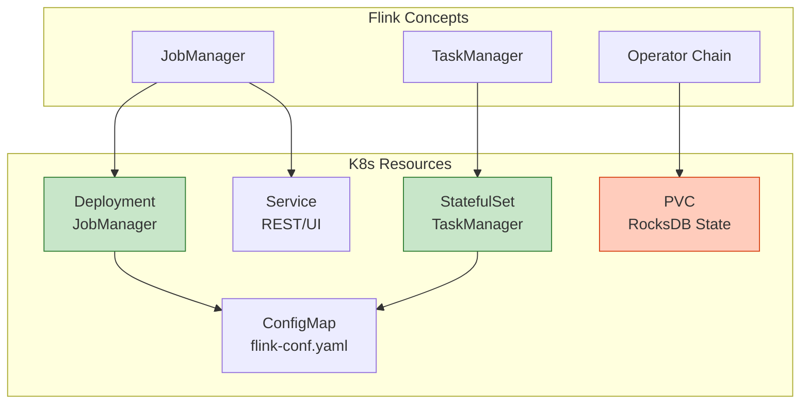
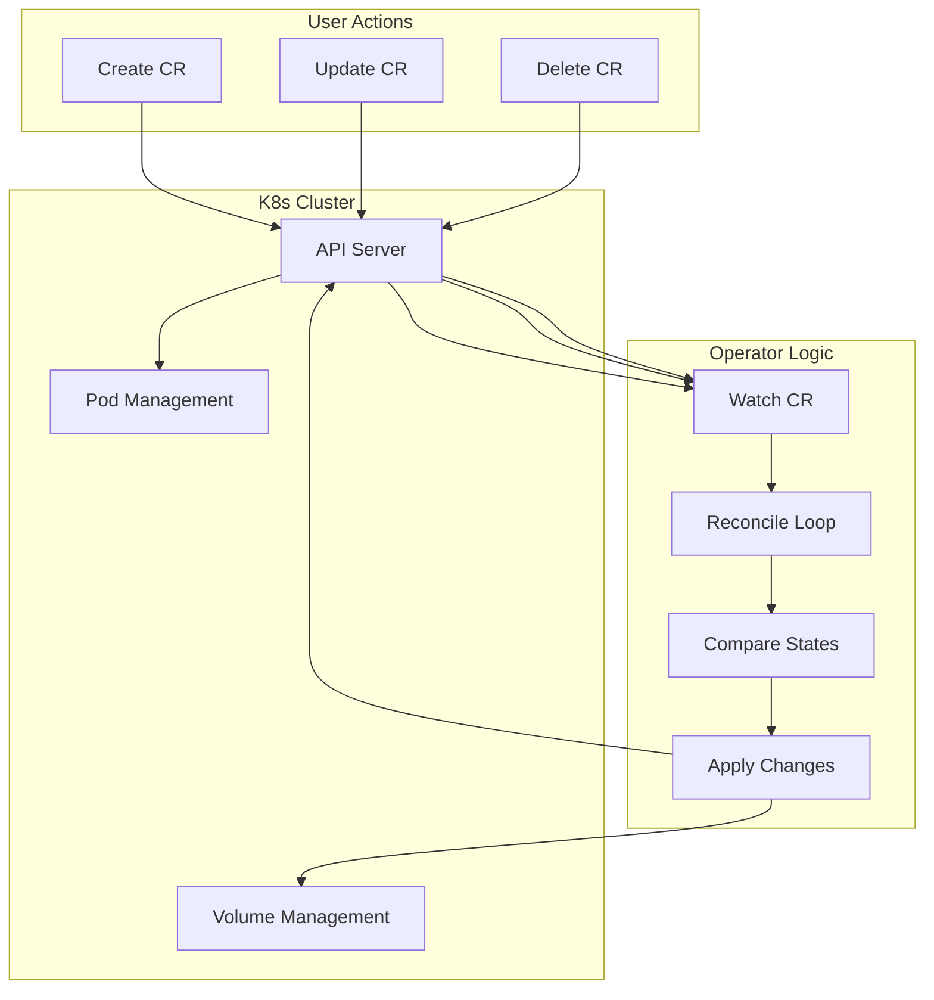
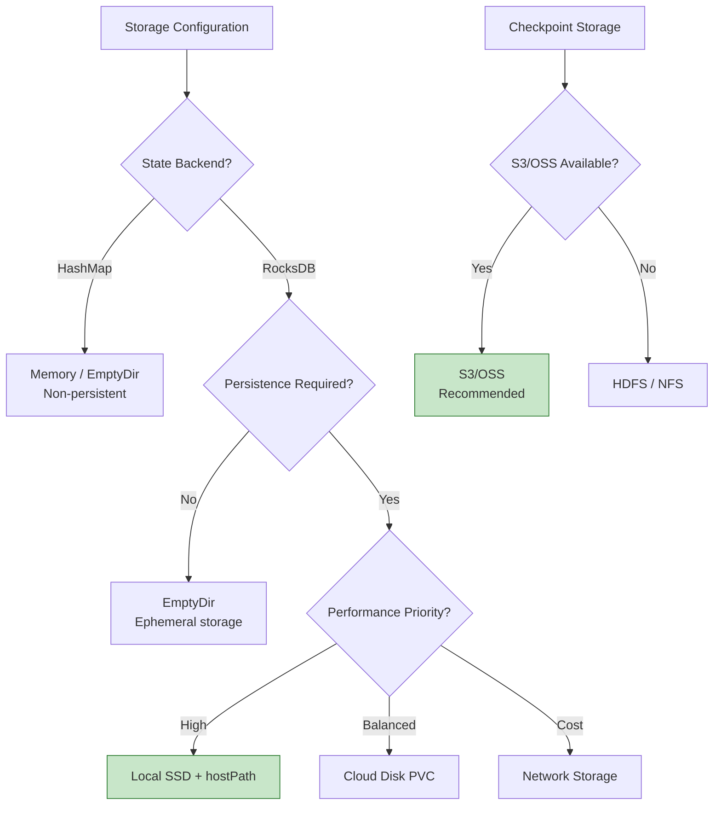
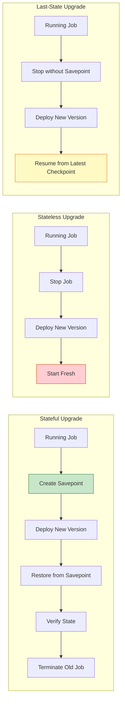
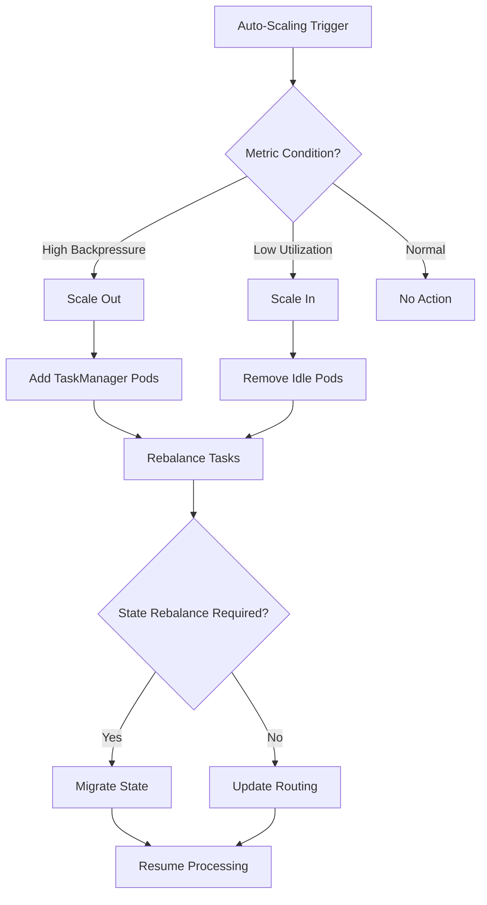

# Flink on Kubernetes: Cloud-Native Deployment Guide

> **Stage**: Flink/Deployment | **Prerequisites**: [Flink Architecture Overview](./01-architecture-overview.md), [Checkpoint Mechanism](./03-checkpoint.md) | **Formal Level**: L3-L4

---

## 1. Definitions

### Def-F-10-01: Flink Kubernetes Operator

**Definition**: The Flink Kubernetes Operator is a control plane component that automates the lifecycle management of Flink applications through Kubernetes Custom Resource Definitions (CRDs).

**Formal Model**:

$$
\text{Operator}: (\text{DesiredState}, \text{ObservedState}) \rightarrow (\text{Actions}, \text{NewState})
$$

Where:

- $\text{DesiredState}$: Specified in `FlinkDeployment` or `FlinkSessionJob` CR
- $\text{ObservedState}$: Current cluster state from K8s API
- $\text{Actions}$: $\{\text{Create}, \text{Update}, \text{Delete}, \text{Upgrade}, \text{Rollback}, \text{Savepoint}\}$

**Core Responsibilities**:

| Responsibility | Description |
|---------------|-------------|
| Deployment Management | Convert Flink apps to K8s resources |
| State Reconciliation | Continuously align desired and actual state |
| Upgrade Orchestration | Support blue-green, canary strategies |
| Failure Recovery | Auto-detect and recover failed instances |

---

### Def-F-10-02: Native Kubernetes Integration

**Definition**: Flink's native Kubernetes integration allows direct interaction with the K8s API for resource management, bypassing traditional resource managers like YARN.

**Architecture Layers**:

```
┌─────────────────────────────────────────────────────────┐
│  User Application (DataStream API / Table API / SQL)    │
├─────────────────────────────────────────────────────────┤
│  Flink Runtime (JobManager + TaskManager)               │
├─────────────────────────────────────────────────────────┤
│  Kubernetes Integration Layer                           │
│  ┌─────────────┐  ┌─────────────┐  ┌─────────────────┐ │
│  │ Fabric8 K8s │  │ K8s HA      │  │ K8s ConfigMap   │ │
│  │ Client      │  │ Services    │  │ Discovery       │ │
│  └─────────────┘  └─────────────┘  └─────────────────┘ │
├─────────────────────────────────────────────────────────┤
│  Kubernetes API Server                                  │
└─────────────────────────────────────────────────────────┘
```

---

### Def-F-10-03: Deployment Modes

**Application Mode**:

- Each Flink application has its own JobManager
- Strong resource isolation between applications
- Recommended for production workloads

**Session Mode**:

- Multiple applications share a single JobManager
- Lower startup latency
- Suitable for development and short-lived jobs

| Aspect | Application Mode | Session Mode |
|--------|-----------------|--------------|
| Resource Isolation | Strong (dedicated JM) | Weak (shared JM) |
| Startup Latency | Medium | Low |
| Multi-tenancy | Excellent | Fair |
| Fault Impact | Single application | All applications |

---

### Def-F-10-04: Custom Resources

**FlinkDeployment**: Deploys standalone Flink applications

```yaml
apiVersion: flink.apache.org/v1beta1
kind: FlinkDeployment
metadata:
  name: example-flink-job
spec:
  image: flink:2.0.0-scala_2.12
  flinkVersion: v2.0
  mode: native
  jobManager:
    resource:
      memory: "4Gi"
      cpu: 2
  taskManager:
    resource:
      memory: "8Gi"
      cpu: 4
    replicas: 3
  job:
    jarURI: local:///opt/flink/examples/StateMachineExample.jar
    parallelism: 6
    upgradeMode: stateful
```

**FlinkSessionJob**: Submits jobs to existing session clusters

---

## 2. Properties

### Prop-F-10-01: Resource Isolation Guarantee

**Proposition**: In Application Mode, JobManager failure of application A does not affect application B.

**Proof**:

Let $\text{App}_A = (\text{JM}_A, \{\text{TM}_{A1}, \text{TM}_{A2}, ...\})$ and $\text{App}_B = (\text{JM}_B, \{\text{TM}_{B1}, ...\})$

Given:

1. K8s Pods are fault-isolated units
2. Application Mode: $\text{JM}_A \neq \text{JM}_B$ (by definition)
3. $\text{TM}_{Ai}$ and $\text{TM}_{Bj}$ run in separate Pods

Therefore:

$$
\text{Failure}(\text{JM}_A) \not\Rightarrow \text{Failure}(\text{App}_B) \quad \square$$

---

### Prop-F-10-02: Operator Idempotency

**Proposition**: The Operator's reconciliation loop is idempotent—applying the same desired state multiple times produces no side effects.

**Idempotency Mechanisms**:

| Mechanism | Implementation |
|-----------|---------------|
| Declarative Semantics | CRD specifies target state, not operations |
| State Machine | Defined transitions: CREATED → DEPLOYED → RUNNING |
| Optimistic Concurrency | Uses `resourceVersion` to prevent conflicts |

---

### Lemma-F-10-01: Checkpoint Persistence

**Lemma**: With proper configuration, Flink state is persistent across Pod restarts.

**Persistence Condition**:

$$
\text{Persistence} \iff \begin{cases}
\text{StateBackend} \in \{\text{RocksDB}, \text{ForSt}\} \land \\
\text{CheckpointDir} \in \{\text{S3}, \text{OSS}, \text{GCS}\} \land \\
\text{PV.reclaimPolicy} = \text{Retain}
\end{cases}
$$

---

## 3. Relations

### 3.1 K8s Resource Mapping



### 3.2 Operator Control Flow



---

## 4. Argumentation

### 4.1 Deployment Mode Selection Matrix

| Scenario | Recommended Mode | Rationale |
|----------|-----------------|-----------|
| 24x7 production ETL | Application Mode | Isolation, independent upgrades |
| Scheduled batch jobs | Application Mode | Clean environment per run |
| Interactive queries | Session Mode | Millisecond query response |
| Development/debugging | Session Mode | Fast iteration |
| ML inference service | Application Mode | Resource isolation |

### 4.2 Storage Configuration Decision Tree



---

## 5. Proof / Engineering Argument

### Thm-F-10-01: Zero-Downtime Upgrade Correctness

**Theorem**: The Operator's stateful upgrade mechanism ensures exactly-once processing semantics during job upgrades.

**Proof**:

1. **Pre-upgrade**: Create savepoint $S$ of current state
2. **Upgrade**: Deploy new version with state restored from $S$
3. **Verification**: Confirm new job processes from savepoint
4. **Cleanup**: Terminate old job only after verification

Formally:

$$
\forall e \in \text{Events}: \text{processed}_{\text{old}}(e) \lor \text{processed}_{\text{new}}(e) \land \neg(\text{processed}_{\text{old}}(e) \land \text{processed}_{\text{new}}(e))
$$

$$\square$$

### 5.1 High Availability Configuration

```yaml
spec:
  flinkConfiguration:
    # High Availability Mode
    high-availability: kubernetes
    high-availability.storageDir: s3://flink-ha/

    # Multiple JM replicas (Flink 2.0)
    jobmanager.high-availability.mode: kubernetes

    # Checkpoint configuration
    execution.checkpointing.interval: 30s
    execution.checkpointing.timeout: 10m
    execution.checkpointing.tolerable-failed-checkpoints: 3

    # Restart strategy
    restart-strategy: fixed-delay
    restart-strategy.fixed-delay.attempts: 10
    restart-strategy.fixed-delay.delay: 10s
```

---

## 6. Examples

### 6.1 Complete Application Deployment

```yaml
apiVersion: flink.apache.org/v1beta1
kind: FlinkDeployment
metadata:
  name: realtime-etl-pipeline
  namespace: flink-jobs
spec:
  image: flink:2.0.0-scala_2.12-java17
  flinkVersion: v2.0
  mode: native
  serviceAccount: flink-service-account

  flinkConfiguration:
    # Cluster configuration
    kubernetes.cluster-id: realtime-etl-pipeline

    # High availability
    high-availability: kubernetes
    high-availability.storageDir: s3://flink-ha/realtime-etl

    # Checkpoint configuration
    execution.checkpointing.interval: 30s
    execution.checkpointing.min-pause: 30s
    state.backend: rocksdb
    state.checkpoint-storage: filesystem
    state.checkpoints.dir: s3://flink-checkpoints/realtime-etl

    # Adaptive scheduler
    scheduler-mode: REACTIVE
    cluster.declarative-resource-management.enabled: true

  jobManager:
    resource:
      memory: 4Gi
      cpu: 2
    replicas: 1

  taskManager:
    resource:
      memory: 8Gi
      cpu: 4
    replicas: 3

  job:
    jarURI: local:///opt/flink/usrlib/realtime-etl.jar
    parallelism: 12
    upgradeMode: stateful
    state: running
```

### 6.2 Session Mode Deployment

```yaml
# Session Cluster
apiVersion: flink.apache.org/v1beta1
kind: FlinkDeployment
metadata:
  name: flink-session-cluster
spec:
  image: flink:2.0.0
  flinkVersion: v2.0
  mode: native

  jobManager:
    resource:
      memory: 8Gi
      cpu: 4

  taskManager:
    resource:
      memory: 16Gi
      cpu: 8
    replicas: 5
  # No job section for Session Mode

---
# Submit job to session
apiVersion: flink.apache.org/v1beta1
kind: FlinkSessionJob
metadata:
  name: ad-hoc-query
spec:
  deploymentName: flink-session-cluster
  job:
    jarURI: https://example.com/jobs/ad-hoc-query.jar
    parallelism: 4
    upgradeMode: stateless
```

### 6.3 Pod Template Customization

```yaml
spec:
  taskManager:
    podTemplate:
      spec:
        initContainers:
          - name: download-deps
            image: busybox
            command: ['wget', '-P', '/opt/flink/lib', 'https://repo/libs/connector.jar']
            volumeMounts:
              - name: flink-lib
                mountPath: /opt/flink/lib
        containers:
          - name: flink-main-container
            resources:
              limits:
                memory: 8Gi
                cpu: 4
            env:
              - name: JAVA_OPTS
                value: "-XX:+UseG1GC -XX:MaxRAMPercentage=75.0"
            volumeMounts:
              - name: rocksdb-storage
                mountPath: /opt/flink/rocksdb
              - name: flink-lib
                mountPath: /opt/flink/lib
        volumes:
          - name: rocksdb-storage
            persistentVolumeClaim:
              claimName: rocksdb-pvc
          - name: flink-lib
            emptyDir: {}
        affinity:
          podAntiAffinity:
            preferredDuringSchedulingIgnoredDuringExecution:
              - weight: 100
                podAffinityTerm:
                  labelSelector:
                    matchLabels:
                      app: flink
                  topologyKey: kubernetes.io/hostname
```

---

## 7. Visualizations

### 7.1 Flink on K8s Architecture

```mermaid
graph TB
    subgraph "Control Plane"
        USER[User]
        KUBECTL[kubectl / Helm]
        OP[Flink Operator]
        API[Kubernetes API Server]
    end

    subgraph "Data Plane - Flink Cluster"
        subgraph "JobManager Pod"
            JM[Flink JobManager]
            DS[Dispatcher]
            HA[K8s HA Services]
        end

        subgraph "TaskManager Pods"
            TM1[TaskManager 1]
            TM2[TaskManager 2]
            TM3[TaskManager 3]
        end
    end

    subgraph "Persistence"
        S3_CKPT[S3/OSS<br/>Checkpoints]
        S3_HA[S3/OSS<br/>HA Metadata]
        PVC[PVC<br/>RocksDB State]
    end

    subgraph "External Systems"
        KAFKA[Kafka]
        MONITOR[Prometheus<br/>Grafana]
    end

    USER --> KUBECTL --> API
    API --> OP
    OP --> API
    API --> JM
    JM --> TM1
    JM --> TM2
    JM --> TM3
    TM1 --> S3_CKPT
    TM2 --> PVC
    TM3 --> KAFKA
    JM --> MONITOR
    JM --> S3_HA
```



### 7.2 Upgrade Strategy Comparison



### 7.3 Auto-Scaling Decision Flow



---

## 8. References

[^1]: Apache Flink Documentation, "Kubernetes Setup", 2025. https://nightlies.apache.org/flink/flink-docs-stable/docs/deployment/resource-providers/standalone/kubernetes/

[^2]: Apache Flink Kubernetes Operator Documentation, 2025. https://nightlies.apache.org/flink/flink-kubernetes-operator-docs-main/

[^3]: Kubernetes Documentation, "Operators", 2025. https://kubernetes.io/docs/concepts/extend-kubernetes/operator/

[^4]: B. Burns et al., "Borg, Omega, and Kubernetes", ACM Queue, 2016.

---

*Document Version: 2026.04-001 | Formal Level: L3-L4 | Last Updated: 2026-04-10*

**Related Documents**:

- [Standalone Deployment](./11-standalone.md)
- [Checkpoint Mechanism](./03-checkpoint.md)
- [Flink Architecture Overview](./01-architecture-overview.md)
