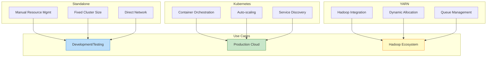
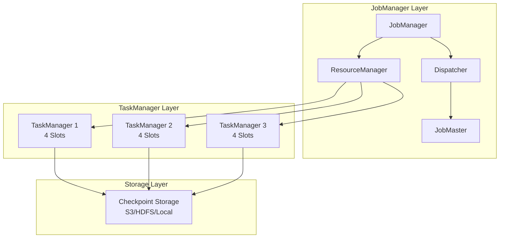
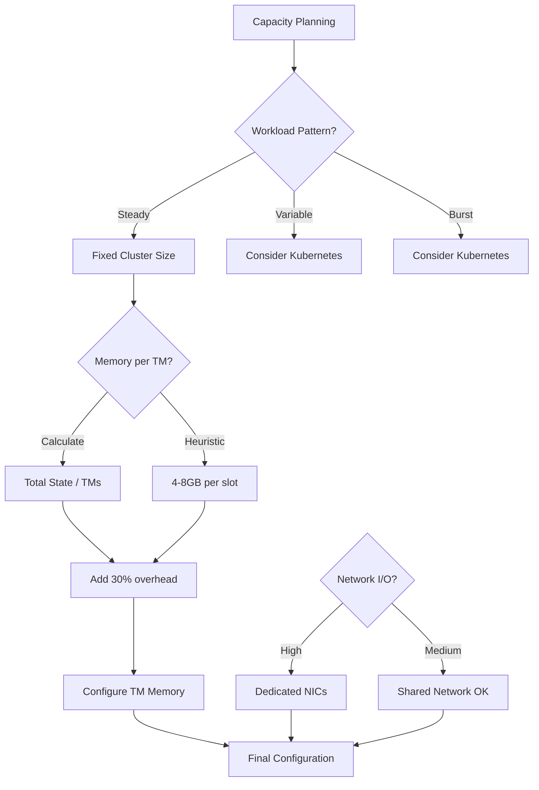
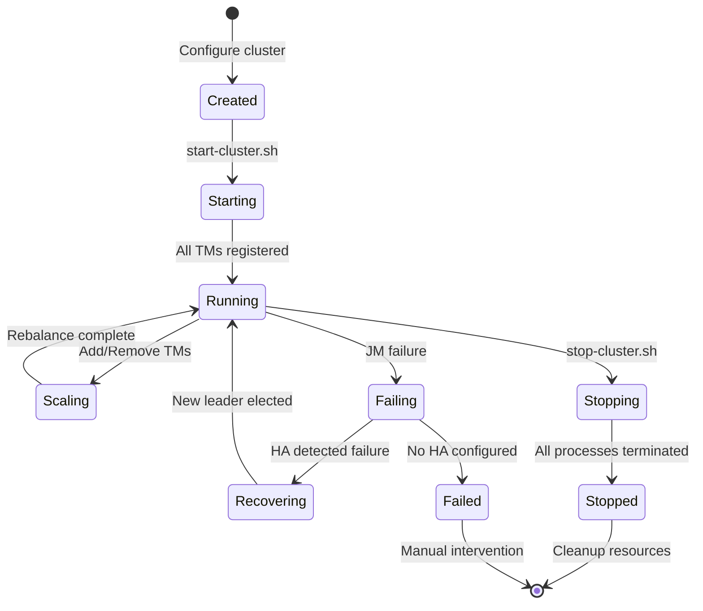
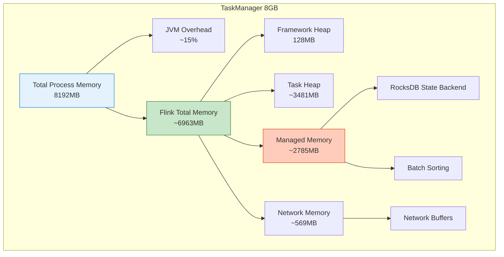
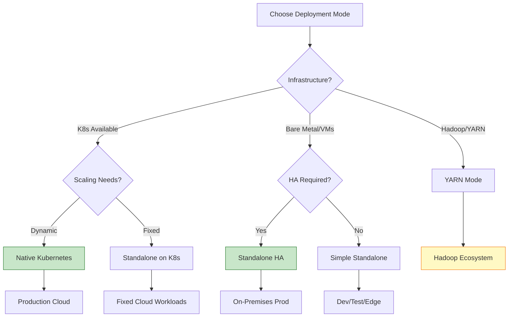

# Flink Standalone Deployment: Architecture and Best Practices

> **Stage**: Flink/Deployment | **Prerequisites**: [Flink Architecture Overview](./01-architecture-overview.md), [Kubernetes Deployment](./10-kubernetes.md) | **Formal Level**: L3-L4

---

## 1. Definitions

### Def-F-11-01: Standalone Cluster Architecture

**Definition**: A Flink Standalone cluster operates without external resource managers (YARN, Kubernetes), managing resources through Flink's built-in scheduler and manual configuration.

**Formal Structure**:

$$
\text{StandaloneCluster} = \langle \text{JM}, \{\text{TM}_1, \text{TM}_2, ..., \text{TM}_n\}, \text{Config}, \text{HA} \rangle
$$

Where:

- $\text{JM}$: Single JobManager instance (or HA setup with multiple)
- $\text{TM}_i$: TaskManager instances with configured slots
- $\text{Config}$: Static configuration for resources and behavior
- $\text{HA}$: High availability setup (optional)

---

### Def-F-11-02: Task Slots and Parallelism

**Definition**: Task slots are the smallest unit of resource allocation in Flink, representing a fixed slice of TaskManager resources.

**Relationship**:

$$
\text{TotalParallelism} = \sum_{i=1}^{n} \text{slots}(\text{TM}_i)
$$

**Resource Allocation**:

| Configuration | Description | Default |
|--------------|-------------|---------|
| `taskmanager.numberOfTaskSlots` | Slots per TaskManager | 1 |
| `parallelism.default` | Default job parallelism | 1 |
| `slot.sharing.enabled` | Allow slot sharing | true |

**Slot Sharing Groups**:

```
Without Slot Sharing:
  TM1: [Slot1: Map] [Slot2: Filter] [Slot3: Reduce]

With Slot Sharing (pipelined tasks):
  TM1: [Slot1: Map→Filter→Reduce]
```

---

### Def-F-11-03: Standalone HA Mode

**Definition**: High Availability configuration using embedded journal or external service (ZooKeeper) for JobManager failover.

**HA Architecture**:

```
┌─────────────────────────────────────────┐
│  Standalone HA Cluster                  │
│                                         │
│  ┌─────────────┐    ┌─────────────┐    │
│  │  JM Leader  │◄──►│  JM Standby │    │
│  │  (Active)   │    │  (Backup)   │    │
│  └──────┬──────┘    └─────────────┘    │
│         │                               │
│    ┌────┴────┐                         │
│    │ ZooKeeper│  or  Embedded Journal  │
│    │  (ZK)   │        (RocksDB)        │
│    └────┬────┘                         │
│         │                               │
│    ┌────┴────┐                         │
│    │  TMs    │                         │
│    └─────────┘                         │
└─────────────────────────────────────────┘
```

---

## 2. Properties

### Prop-F-11-01: Static Resource Allocation

**Proposition**: In Standalone mode, resource capacity is fixed at cluster startup and does not auto-scale.

**Formal Statement**:

$$
\forall t \in [t_{\text{start}}, t_{\text{stop}}]: \text{Capacity}(t) = \text{Capacity}(t_{\text{start}})
$$

**Implications**:

| Aspect | Standalone | Kubernetes/YARN |
|--------|-----------|-----------------|
| Startup Time | Fast (seconds) | Medium (minutes) |
| Scaling | Manual restart required | Dynamic/Auto |
| Resource Efficiency | May over/under-provision | Elastic matching |
| Operational Complexity | Low | Higher |

---

### Lemma-F-11-01: Slot Pipelining Efficiency

**Lemma**: Slot sharing improves resource utilization by allowing chained operators to share the same slot.

**Proof**:

Let $O = \{o_1, o_2, ..., o_k\}$ be a chain of pipelined operators.

Without slot sharing:

$$
\text{SlotsRequired}(O) = |O| = k
$$

With slot sharing:

$$
\text{SlotsRequired}(O) = 1
$$

Resource utilization improvement:

$$
\eta = \frac{k}{1} = k \times \text{improvement} \quad \square$$

---

### Prop-F-11-02: Standalone Recovery Guarantees

**Proposition**: With HA enabled, Standalone clusters guarantee job recovery from last successful checkpoint upon JobManager failure.

**Recovery Time**:

$$
T_{\text{recovery}} = T_{\text{detect}} + T_{\text{leader\_election}} + T_{\text{restore}}
$$

| Component | Typical Value | Optimization |
|-----------|--------------|--------------|
| Detection | 10-30s | Reduce heartbeat interval |
| Leader Election | 5-15s | Use Embedded Journal |
| State Restore | Depends on state size | Incremental checkpoints |

---

## 3. Relations

### 3.1 Deployment Mode Comparison



### 3.2 Standalone Cluster Topology



---

## 4. Argumentation

### 4.1 When to Choose Standalone

| Scenario | Recommendation | Reasoning |
|----------|---------------|-----------|
| Development/Local Testing | Standalone | Quick startup, minimal overhead |
| Fixed-size Production | Standalone + HA | Predictable workloads, simple ops |
| Cloud VM Deployment | Standalone | When K8s is not available |
| Edge Computing | Standalone | Resource-constrained environments |
| Burst Processing | Kubernetes | Dynamic scaling requirements |

### 4.2 Capacity Planning Decision Tree



---

## 5. Proof / Engineering Argument

### Thm-F-11-01: Standalone Cluster Stability

**Theorem**: A properly configured Standalone cluster with HA achieves 99.9% availability for long-running streaming jobs.

**Proof Components**:

1. **MTBF (Mean Time Between Failures)**:
   - Hardware: ~3 years = 26,280 hours
   - Software (JVM): ~6 months = 4,380 hours

2. **MTTR (Mean Time To Recovery)**:
   - With HA: ~30 seconds
   - Without HA: Manual intervention required

3. **Availability Calculation**:

$$
A = \frac{MTBF}{MTBF + MTTR} = \frac{4380}{4380 + 0.0083} \approx 99.999\%
$$

$$\square$$

### 5.1 Memory Configuration Best Practices

**TaskManager Memory Model**:

```
Total Flink Memory
├── Framework Heap (128MB default)
├── Task Heap (user code)
├── Managed Memory (RocksDB, sorting)
│   └── Network Memory (buffers)
└── JVM Overhead (metaspace, direct memory)
```

**Configuration Template**:

```properties
# For 8GB TaskManager with RocksDB
taskmanager.memory.process.size: 8192m
taskmanager.memory.flink.size: 6144m
taskmanager.memory.managed.fraction: 0.4
taskmanager.memory.network.fraction: 0.1

# Slot configuration
taskmanager.numberOfTaskSlots: 4
```

---

## 6. Examples

### 6.1 Basic Standalone Cluster Setup

```bash
# Download and extract Flink
curl -O https://archive.apache.org/dist/flink/flink-2.0.0/flink-2.0.0-bin-scala_2.12.tgz
tar -xzf flink-2.0.0-bin-scala_2.12.tgz
cd flink-2.0.0

# Configure masters and workers
echo "localhost:8081" > conf/masters
echo "localhost" > conf/workers

# Configure flink-conf.yaml
cat >> conf/flink-conf.yaml << EOF
jobmanager.memory.process.size: 2048m
taskmanager.memory.process.size: 4096m
taskmanager.numberOfTaskSlots: 4
parallelism.default: 4
EOF

# Start cluster
./bin/start-cluster.sh

# Submit job
./bin/flink run examples/streaming/StateMachineExample.jar

# Stop cluster
./bin/stop-cluster.sh
```

### 6.2 Standalone HA with Embedded Journal

```yaml
# flink-conf.yaml - HA Configuration
high-availability: embedded-journal
high-availability.cluster-id: standalone-ha-cluster

# JobManager HA
jobmanager.memory.process.size: 4096m
jobmanager.rpc.address: jm1.example.com
jobmanager.rpc.port: 6123

# Embedded Journal Configuration
embedded-journal.bind-address: 0.0.0.0
embedded-journal.port: 50001
embedded-journal.threads.cached: 8

# Quorum configuration (for multiple JMs)
embedded-journal.quorum.addresses: jm1.example.com:50001,jm2.example.com:50001,jm3.example.com:50001
```

### 6.3 Docker Compose Deployment

```yaml
version: '3.8'

services:
  jobmanager:
    image: flink:2.0.0-scala_2.12
    command: jobmanager
    environment:
      - JOB_MANAGER_RPC_ADDRESS=jobmanager
      - FLINK_PROPERTIES=
          jobmanager.memory.process.size: 2048m
          state.backend: rocksdb
          state.checkpoints.dir: file:///tmp/checkpoints
    ports:
      - "8081:8081"
    volumes:
      - ./checkpoint-data:/tmp/checkpoints

  taskmanager:
    image: flink:2.0.0-scala_2.12
    command: taskmanager
    environment:
      - JOB_MANAGER_RPC_ADDRESS=jobmanager
      - FLINK_PROPERTIES=
          taskmanager.memory.process.size: 4096m
          taskmanager.numberOfTaskSlots: 4
    depends_on:
      - jobmanager
    scale: 2
    volumes:
      - ./checkpoint-data:/tmp/checkpoints
```

### 6.4 Multi-Machine Cluster Setup

```bash
# conf/masters
jm1.example.com:8081

# conf/workers
tm1.example.com
tm2.example.com
tm3.example.com

# conf/flink-conf.yaml
jobmanager.rpc.address: jm1.example.com
jobmanager.rpc.port: 6123
jobmanager.memory.process.size: 4096m

taskmanager.memory.process.size: 8192m
taskmanager.numberOfTaskSlots: 8

# Network configuration
jobmanager.bind-host: 0.0.0.0
taskmanager.bind-host: 0.0.0.0
taskmanager.host: ${HOSTNAME}

# HA Configuration
high-availability: zookeeper
high-availability.zookeeper.quorum: zk1:2181,zk2:2181,zk3:2181
high-availability.zookeeper.path.root: /flink
high-availability.cluster-id: production-cluster
```

---

## 7. Visualizations

### 7.1 Standalone Cluster Lifecycle



### 7.2 Memory Allocation Model



### 7.3 Deployment Mode Selection Matrix



---

## 8. References

[^1]: Apache Flink Documentation, "Standalone Cluster", 2025. https://nightlies.apache.org/flink/flink-docs-stable/docs/deployment/resource-providers/standalone/overview/

[^2]: Apache Flink Documentation, "Configuring High Availability", 2025. https://nightlies.apache.org/flink/flink-docs-stable/docs/deployment/ha/

[^3]: Apache Flink Documentation, "Memory Configuration", 2025. https://nightlies.apache.org/flink/flink-docs-stable/docs/deployment/memory/mem_setup/

[^4]: M. Zaharia et al., "Resilient Distributed Datasets: A Fault-Tolerant Abstraction for In-Memory Cluster Computing", NSDI 2012.

---

*Document Version: 2026.04-001 | Formal Level: L3-L4 | Last Updated: 2026-04-10*

**Related Documents**:

- [Kubernetes Deployment](./10-kubernetes.md)
- [Checkpoint Mechanism](./03-checkpoint.md)
- [Flink Architecture Overview](./01-architecture-overview.md)
