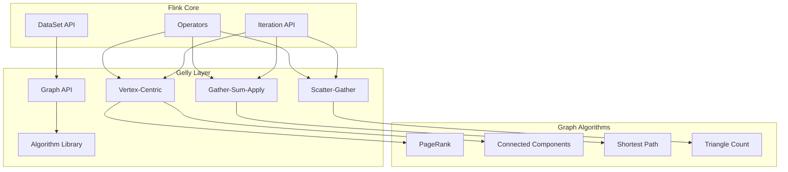
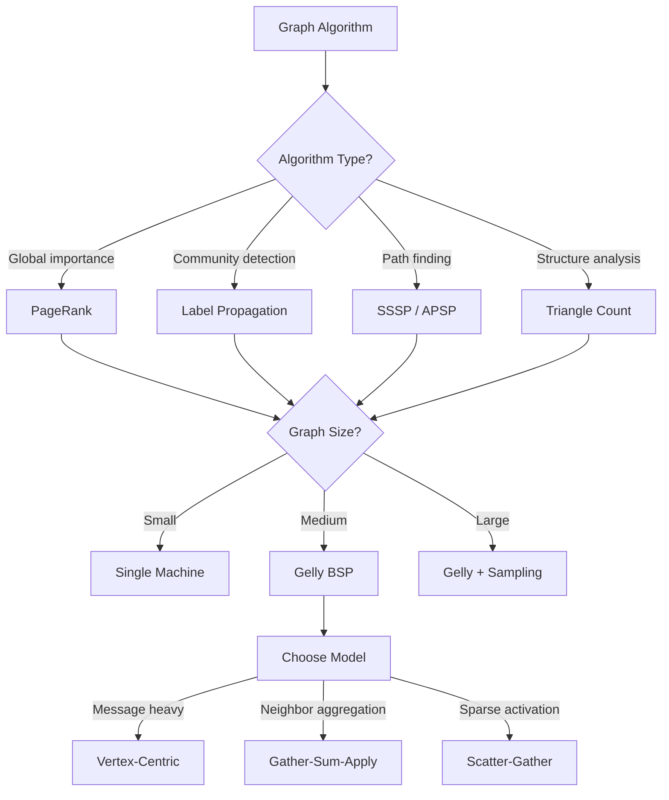
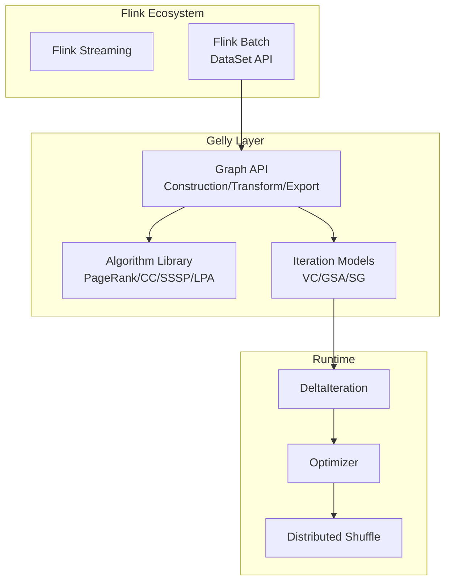
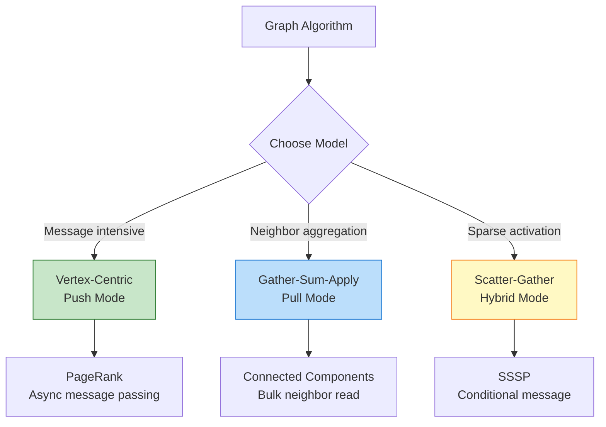
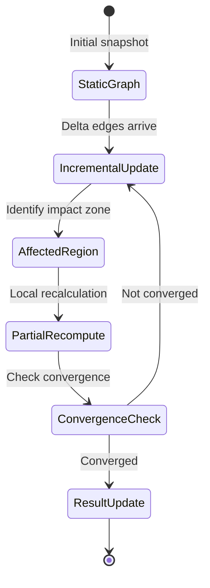

# Flink Gelly: Large-Scale Graph Processing

> **Stage**: Flink/Graph | **Prerequisites**: [Flink DataStream API](../../../Flink/03-api/09-language-foundations/flink-datastream-api-complete-guide.md), [Batch Processing](../../../Flink/01-concepts/flink-architecture-evolution-1x-to-2x.md) | **Formal Level**: L4-L5

---

## 1. Definitions

### Def-F-13-01: Graph Data Model

**Definition**: A graph in Flink Gelly is modeled as a directed or undirected graph with typed vertices and edges, represented as two distributed datasets.

**Formal Specification**:

$$
G = (V, E) \quad \text{where}
$$

- $V$: Vertex set with $v = (id, value)$, $id \in K$, $value \in VV$
- $E$: Edge set with $e = (source, target, value)$, $value \in EV$

**Gelly Representation**:

```java
// [伪代码片段 - 不可直接运行] 仅展示核心逻辑
Graph<K, VV, EV> = (DataSet<Vertex<K, VV>>, DataSet<Edge<K, EV>>)
```

**Properties**:

| Property | Description | Constraint |
|----------|-------------|------------|
| Vertex uniqueness | Each vertex has unique ID | $\forall v_1, v_2 \in V: id(v_1) = id(v_2) \Rightarrow v_1 = v_2$ |
| Edge validity | Edges connect existing vertices | $\forall (u,v) \in E: u \in V \land v \in V$ |
| Partition locality | Edge co-located with source vertex | $\text{partition}(e) = \text{partition}(\text{source}(e))$ |

---

### Def-F-13-02: BSP Iteration Model

**Definition**: Bulk Synchronous Parallel (BSP) model defines the execution semantics for iterative graph algorithms with global synchronization barriers.

**Formal Model**:

Let $S_i = (V_i, E_i, M_i)$ be the computation state at superstep $i$, where $M_i$ is the message set.

$$
S_{i+1} = \Gamma(S_i) = (V_i', E_i', M_{i+1})
$$

**BSP Phases**:

1. **Local Compute**: Each vertex executes user function based on current state and received messages
2. **Communication**: Messages are routed to destination vertices
3. **Synchronization**: Global barrier waits for all vertices to complete

**Termination Condition**:

$$
\text{terminate} \iff M_i = \emptyset \lor i \geq I_{\max}
$$

---

### Def-F-13-03: Incremental Graph Updates

**Definition**: Incremental updates modify the graph structure with minimal recomputation, affecting only the changed region and its neighborhood.

**Update Set**:

$$
\Delta G = (\Delta V^+, \Delta V^-, \Delta E^+, \Delta E^-)
$$

**Incremental Update Formula**:

$$
G_{t+1} = (V_t \setminus \Delta V^- \cup \Delta V^+, E_t \setminus \Delta E^- \cup \Delta E^+ \setminus \{(u,v) | u \in \Delta V^- \lor v \in \Delta V^-\})
$$

**Affected Region**:

$$
|A(\Delta G)| \leq |\Delta V^+| + |\Delta V^-| + 2|\Delta E^+| + 2|\Delta E^-| + \sum_{v \in \Delta V} \text{degree}(v)
$$

---

## 2. Properties

### Lemma-F-13-01: Graph Invariants

**Lemma**: Any valid Gelly graph instance satisfies:

1. **Identifier uniqueness**: $\forall v_1, v_2 \in V: id(v_1) = id(v_2) \Rightarrow v_1 = v_2$
2. **Edge validity**: $\forall (u,v) \in E: u \in V \land v \in V$
3. **Partition locality**: $\text{partition}(e) = \text{partition}(\text{source}(e))$

**Proof**: Guaranteed by `Graph.fromDataSet()` constructor and DataSet's hash-partitioning strategy. $\square$

---

### Lemma-F-13-02: BSP Convergence

**Lemma**: For monotonic vertex computation functions, algorithm convergence is independent of message delivery order.

**Proof**:

Given monotonic function $f$ where $v_{i+1} = f(v_i, M_i)$:

- Messages from iteration $i$ arrive before iteration $i+1$ (synchronization guarantee)
- Function $f$ is deterministic given the same inputs
- Therefore, final state $v_T$ is uniquely determined

$$\square$$

---

### Prop-F-13-01: Algorithm Complexity Bounds

**Proposition**: Gelly graph algorithms have the following complexity characteristics:

| Algorithm | Time Complexity | Space Complexity | Iterations |
|-----------|-----------------|------------------|------------|
| PageRank | $O(I \cdot (|V| + |E|))$ | $O(|V|)$ | $I$ (convergence) |
| Connected Components | $O(D \cdot (|V| + |E|))$ | $O(|V|)$ | $D$ (diameter) |
| Single Source Shortest Path | $O(D \cdot |E|)$ | $O(|V|)$ | $D$ (max distance) |
| Triangle Count | $O(|V| \cdot d^2)$ | $O(|V|)$ | 1 |

---

## 3. Relations

### 3.1 Gelly and Flink Core APIs



### 3.2 Programming Model Comparison

| Model | Communication Pattern | Best For | Example |
|-------|---------------------|----------|---------|
| Vertex-Centric | Push (send messages) | Message-intensive | PageRank |
| Gather-Sum-Apply | Pull (gather neighbors) | Neighbor aggregation | Connected Components |
| Scatter-Gather | Hybrid | Sparse activation | SSSP |

---

## 4. Argumentation

### 4.1 Algorithm Selection Decision Tree



### 4.2 Streaming Graph Processing

| Dimension | Batch Graph | Streaming Graph |
|-----------|-------------|-----------------|
| Graph State | Static snapshot | Dynamic evolution |
| Update Mode | Full recompute | Incremental update |
| Result Freshness | Hours | Seconds |
| Algorithm Type | Global convergence | Approximate / sliding |

---

## 5. Proof / Engineering Argument

### Thm-F-13-01: PageRank Convergence

**Theorem**: Gelly's PageRank implementation converges to the principal eigenvector of the graph's transition matrix.

**Proof**:

PageRank iteration formula:

$$
PR_{i+1}(v) = \frac{1-d}{|V|} + d \sum_{u \in N_{in}(v)} \frac{PR_i(u)}{|N_{out}(u)|}
$$

Matrix form:

$$
\vec{PR}_{i+1} = d \cdot M \cdot \vec{PR}_i + \frac{1-d}{|V|} \cdot \vec{1}
$$

1. $M$ is column-stochastic (by construction)
2. By Perron-Frobenius theorem, $M$ has a unique stationary distribution
3. BSP iteration ensures numerical consistency with theoretical model
4. Convergence detected when $\|\vec{PR}_{i+1} - \vec{PR}_i\|_1 < \epsilon$

$$\square$$

### 5.1 Performance Optimization Strategies

**Partitioning Optimization**:

```java
// [伪代码片段 - 不可直接运行] 仅展示核心逻辑
// Use custom partitioner for skewed graphs
Graph<Long, Double, Double> graph = Graph.fromDataSet(
    vertices,
    edges,
    new CustomPartitioner<>(),  // Hash-based with load balancing
    env
);
```

**Iteration Optimization**:

| Technique | Benefit | When to Use |
|-----------|---------|-------------|
| Delta iterations | Skip inactive vertices | When many vertices converge early |
| Aggregators | Global state without broadcast | When needing global statistics |
| Message combiners | Reduce network traffic | When messages are additive |

---

## 6. Examples

### 6.1 PageRank Implementation

```java
// Create graph from datasets
Graph<Long, Double, Double> graph = Graph.fromDataSet(
    vertexDataset,
    edgeDataset,
    env
);

// Run PageRank with Vertex-Centric iteration
DataSet<Vertex<Long, Double>> pageRanks = graph
    .runVertexCentricIteration(
        new PageRankComputeFunction(dampingFactor),
        new PageRankMessageCombiner(),
        maxIterations
    )
    .getVertices();

// PageRank compute function
public static class PageRankComputeFunction
    extends VertexCentricFunction<Long, Double, Double, Double> {

    private final double dampingFactor;

    @Override
    public void iterate(Vertex<Long, Double> vertex,
                       MessageIterator<Double> messages) {
        double sum = 0;
        for (double msg : messages) {
            sum += msg;
        }

        double newRank = (1 - dampingFactor) / getNumberOfVertices()
                        + dampingFactor * sum;

        setNewVertexValue(newRank);

        // Send messages to neighbors
        for (Edge<Long, Double> edge : getEdges()) {
            sendMessageTo(edge.getTarget(), newRank / getEdges().size());
        }
    }
}
```

### 6.2 Connected Components with GSA

```java
// Gather-Sum-Apply for Connected Components
Graph<Long, Long, NullValue> ccGraph = graph
    .runGatherSumApplyIteration(
        new GatherNeighborIds(),      // Gather neighbor component IDs
        new SelectMinComponentId(),   // Sum: select minimum
        new UpdateComponentId(),      // Apply: update if changed
        maxIterations
    );

// Gather function
public static class GatherNeighborIds
    extends GatherFunction<Long, NullValue, Long> {

    @Override
    public Long gather(Neighbor<Long, NullValue> neighbor) {
        return neighbor.getNeighborValue();
    }
}

// Sum function
public static class SelectMinComponentId
    extends SumFunction<Long, NullValue, Long> {

    @Override
    public Long sum(Long newValue, Long currentValue) {
        return Math.min(newValue, currentValue);
    }
}
```

### 6.3 Social Network Analysis

```java
// [伪代码片段 - 不可直接运行] 仅展示核心逻辑
// Build bipartite graph for recommendation
Graph<Long, Double, Double> bipartiteGraph = Graph.fromDataSet(
    users.union(items),        // Vertices: users and items
    interactions,              // Edges: user-item interactions
    env
);

// Run Personalized PageRank for each user
DataSet<Vertex<Long, Double>> recommendations = bipartiteGraph
    .runVertexCentricIteration(
        new PersonalizedPageRankCompute(targetUser),
        new PageRankMessageCombiner(),
        maxIterations
    )
    .getVertices()
    .filter(v -> isItemVertex(v.getId()))  // Keep only item vertices
    .sortPartition(1, Order.DESCENDING)    // Sort by PageRank
    .first(topK);                           // Top-K recommendations
```

### 6.4 Fraud Detection with Label Propagation

```java
// [伪代码片段 - 不可直接运行] 仅展示核心逻辑
// Build transaction graph
Graph<String, AccountInfo, Transaction> transactionGraph =
    Graph.fromDataSet(accounts, transactions, env);

// Apply Label Propagation for community detection
Graph<String, AccountInfo, Transaction> communities =
    transactionGraph.runScatterGatherIteration(
        new LabelPropagationScatter(),   // Send label to neighbors
        new LabelPropagationGather(),    // Collect neighbor labels
        maxIterations
    );

// Identify suspicious communities
DataSet<Community> suspiciousCommunities = communities
    .getVertices()
    .groupBy(v -> v.getValue().getCommunityLabel())
    .reduceGroup(new AnomalyScoreCalculator());
```

---

## 7. Visualizations

### 7.1 Gelly Architecture



### 7.2 Iteration Models Comparison



### 7.3 Incremental Graph Processing



### 7.4 Graph Algorithm Complexity

```mermaid
graph LR
    subgraph "Time Complexity"
        A[PageRank<br/>O(I·(V+E))]
        B[Connected Comp<br/>O(D·(V+E))]
        C[SSSP<br/>O(D·E)]
        D[Triangle Count<br/>O(V·d²)]
    end

    subgraph "Space Complexity"
        S1[All: O(V)]
    end

    subgraph "Use Cases"
        U1[Importance ranking]
        U2[Community detection]
        U3[Path optimization]
        U4[Structure analysis]
    end

    A --> U1
    B --> U2
    C --> U3
    D --> U4
    A --> S1
    B --> S1
    C --> S1
    D --> S1
```

---

## 8. References


---

*Document Version: 2026.04-001 | Formal Level: L4-L5 | Last Updated: 2026-04-10*

**Related Documents**:

- [Flink DataStream API](../../../Flink/03-api/09-language-foundations/flink-datastream-api-complete-guide.md)
- [Streaming Graph Processing](../../../Flink/05-ecosystem/05.04-graph/flink-gelly-streaming-graph-processing.md)
- [Flink Architecture Overview](./01-architecture-overview.md)
