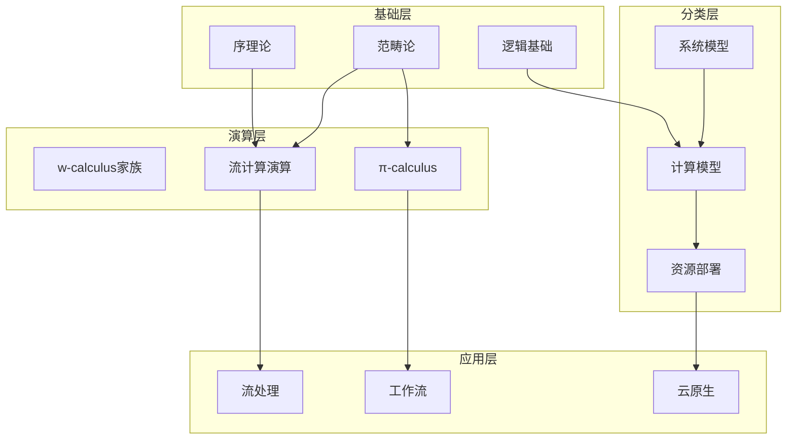

# 分布式系统形式化方法 - 总索引

> **文档版本**: v4.0 | **最后更新**: 2026-04-10 | **文档总数**: 95+ 篇

---

## 快速导航

### 按主题索引

| 主题 | 主要文档 | 难度 |
|------|----------|------|
| **数学基础** | 01-foundations/*.md | L1-L2 |
| **计算演算** | 02-calculi/**/*.md | L2-L4 |
| **模型分类** | 03-model-taxonomy/**/*.md | L3-L5 |
| **应用形式化** | 04-application-layer/**/*.md | L4-L6 |
| **验证方法** | 05-verification/**/*.md | L4-L6 |
| **工具链** | 06-tools/**/*.md | L3-L5 |
| **未来方向** | 07-future/*.md | L5-L6 |
| **AI形式化** | 08-ai-formal-methods/*.md | L5-L6 |
| **Wikipedia概念** | 98-appendices/wikipedia-concepts/*.md | L1-L6 |
| **附录** | 98-appendices/*.md | L1-L6 |

### 按难度索引

#### L1-L2 (入门)

- [序理论](01-foundations/01-order-theory.md)
- [逻辑基础](01-foundations/03-logic-foundations.md)
- [同步/异步模型](03-model-taxonomy/01-system-models/01-sync-async.md)

#### L3-L4 (进阶)

- [π-calculus基础](02-calculi/02-pi-calculus/01-pi-calculus-basics.md)
- [Kahn进程网](02-calculi/03-stream-calculus/03-kahn-process-networks.md)
- [工作流形式化](04-application-layer/01-workflow/01-workflow-formalization.md)

#### L5-L6 (专家)

- [流演算](02-calculi/03-stream-calculus/01-stream-calculus.md)
- [Soundness公理](04-application-layer/01-workflow/02-soundness-axioms.md)
- [TLA+](05-verification/01-logic/01-tla-plus.md)

---

## 定理与定义索引

### 核心定理 (Thm-)

| 编号 | 名称 | 位置 |
|------|------|------|
| Thm-F-01-01 | Kleene不动点定理 | 01-foundations/01-order-theory.md |
| Thm-F-02-01 | 流的终余代数刻画 | 01-foundations/02-category-theory.md |
| Thm-C-04-01 | π-calculus强互模拟同余 | 02-calculi/02-pi-calculus/01-pi-calculus-basics.md |
| Thm-C-05-01 | Kahn不动点定理 | 02-calculi/03-stream-calculus/03-kahn-process-networks.md |
| Thm-A-02-01 | Soundness判定定理 | 04-application-layer/01-workflow/02-soundness-axioms.md |
| Thm-M-04-02-01 | CAP定理 | 03-model-taxonomy/04-consistency/02-cap-theorem.md |
| Thm-FM-18-01 | Paxos Safety | 98-appendices/wikipedia-concepts/18-paxos.md |
| Thm-FM-19-01 | Raft Election Safety | 98-appendices/wikipedia-concepts/19-raft.md |
| Thm-FM-22-01 | Gödel完备性 | 98-appendices/wikipedia-concepts/22-first-order-logic.md |
| Thm-FL-04-01 | Flink Checkpoint一致性 | 04-application-layer/02-stream-processing/04-flink-formal-verification.md |
| Thm-K8s-02-01 | K8s控制器收敛 | 04-application-layer/03-cloud-native/02-kubernetes-verification.md |

### 核心定义 (Def-)

| 编号 | 名称 | 位置 |
|------|------|------|
| Def-F-01-02 | 完全偏序(CPO) | 01-foundations/01-order-theory.md |
| Def-F-02-04 | F-余代数 | 01-foundations/02-category-theory.md |
| Def-C-04-02 | π-calculus语法 | 02-calculi/02-pi-calculus/01-pi-calculus-basics.md |
| Def-A-01-01 | 工作流形式化目标 | 04-application-layer/01-workflow/01-workflow-formalization.md |

---

## 跨文档引用图

---

## 关键词索引

### A

- **Actor模型**: 02-calculi/03-stream-calculus/04-dataflow-networks.md
- **ACP**: 03-model-taxonomy/02-computation-models/01-process-algebras.md

### B

- **Bisimulation**: 01-foundations/02-category-theory.md
- **BPMN**: 04-application-layer/01-workflow/01-workflow-formalization.md
- **Byzantine故障**: 03-model-taxonomy/01-system-models/02-failure-models.md

### C

- **CAP定理**: 03-model-taxonomy/04-consistency/02-cap-theorem.md
- **CCS**: 03-model-taxonomy/02-computation-models/01-process-algebras.md
- **Coq**: 05-verification/03-theorem-proving/01-coq-isabelle.md
- **CPO**: 01-foundations/01-order-theory.md
- **CSP**: 03-model-taxonomy/02-computation-models/01-process-algebras.md

### D

- **Dataflow**: 02-calculi/03-stream-calculus/04-dataflow-networks.md

### E

- **Event-B**: 05-verification/01-logic/02-event-b.md

### F

- **FLP不可能性**: 98-appendices/01-key-theorems.md

### K

- **Kahn进程网**: 02-calculi/03-stream-calculus/03-kahn-process-networks.md
- **Kleene不动点**: 01-foundations/01-order-theory.md
- **Kubernetes**: 04-application-layer/03-cloud-native/02-kubernetes-verification.md

### L

- **LTL/CTL**: 01-foundations/03-logic-foundations.md

### M

- **Model Checking**: 05-verification/02-model-checking/01-explicit-state.md

### P

- **Petri网**: 03-model-taxonomy/02-computation-models/03-net-models.md
- **π-calculus**: 02-calculi/02-pi-calculus/01-pi-calculus-basics.md

### S

- **Soundness**: 04-application-layer/01-workflow/02-soundness-axioms.md
- **Stream Calculus**: 02-calculi/03-stream-calculus/01-stream-calculus.md
- **分离逻辑**: 05-verification/01-logic/03-separation-logic.md

### T

- **TLA+**: 05-verification/01-logic/01-tla-plus.md

### W

- **W-calculus**: 02-calculi/01-w-calculus-family/02-W-calculus.md
- **Workflow**: 04-application-layer/01-workflow/01-workflow-formalization.md

### Ω

- **ω-calculus**: 02-calculi/01-w-calculus-family/01-omega-calculus.md

---

## 更新日志

| 日期 | 版本 | 更新内容 |
|------|------|----------|
| 2026-04-09 | v3.0 | 初始版本，完整拆分01.md为51+文档 |

---

> **使用提示**: 本文档体系支持多种学习路径，详见 [README.md](README.md) 中的路径推荐。
