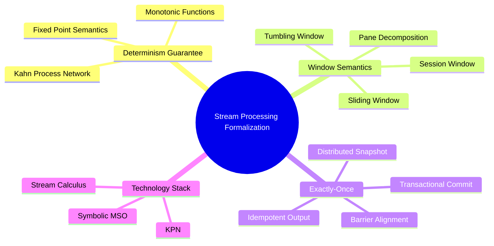
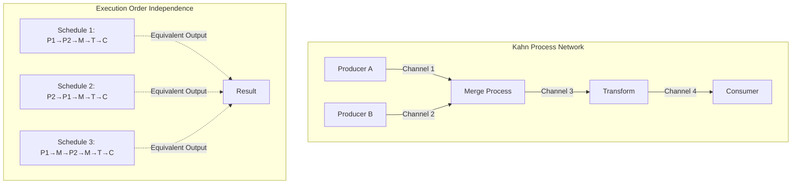
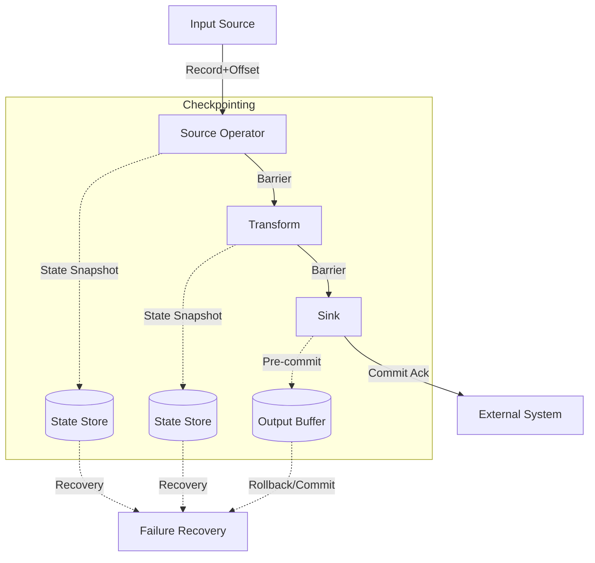

# Stream Processing Systems: Formal Objectives and Technology Stack

> **Unit**: formal-methods/04-application-layer/02-stream-processing | **Prerequisites**: [formal-methods/03-distributed-systems/01-time-and-order](../../03-distributed-systems/01-time-and-order.md) | **Formalization Level**: L4-L5

## 1. Concept Definitions (Definitions)

### Def-A-02-01: Stream Processing System

A stream processing system is a sextuple $\mathcal{S} = (\mathcal{O}, \mathcal{F}, \mathcal{W}, \Sigma, \tau, \Gamma)$, where:

- $\mathcal{O}$: Directed acyclic graph (DAG) representing operator topology, with vertices as operators and edges as data streams
- $\mathcal{F}$: Set of operator functions, where $f \in \mathcal{F}$ represents a transformation function $f: Stream(A) \rightarrow Stream(B)$
- $\mathcal{W}$: Windowing policy, defining trigger and eviction for time/count windows
- $\Sigma$: State space, recording intermediate computation results of operators
- $\tau$: Time model, can be event-time or processing-time
- $\Gamma$: Consistency guarantee level, such as At-Most-Once, At-Least-Once, Exactly-Once

### Def-A-02-02: Kahn Process Network (KPN)

KPN is a computational model $\mathcal{K} = (P, C)$, where:

- $P = \{p_1, p_2, ..., p_n\}$: Set of processes
- $C \subseteq P \times P$: Set of channels, representing unidirectional FIFO connections

Each process $p_i$ is a continuous function:

$$p_i: \prod_{j \in In(i)} Stream(A_j) \rightarrow \prod_{k \in Out(i)} Stream(B_k)$$

Satisfying **monotonicity**: Extension of input streams leads to extension of output streams (non-strict extension).

### Def-A-02-03: Determinism Guarantee

A stream processing system $\mathcal{S}$ is **deterministic** if and only if for any input streams $I$ and configuration $C$:

$$\forall I_1 = I_2: \mathcal{S}(I_1, C) = \mathcal{S}(I_2, C)$$

That is, identical inputs produce identical outputs, independent of execution scheduling.

### Def-A-02-04: Window Semantics

A window is a quadruple $\mathcal{W} = (T, P, E, F)$:

- $T$: Time domain (discrete or continuous)
- $P: T \rightarrow 2^T$: Pane assignment function, mapping timestamps to sets of windows
- $E: \mathcal{W} \times Event \rightarrow \{Trigger,\; Ignore\}$: Trigger strategy
- $F: 2^{Event} \rightarrow Result$: Aggregation function

Window type definitions:

- **Tumbling Window**: $P(t) = \{\lfloor t/w \rfloor \cdot w\}$, non-overlapping
- **Sliding Window**: $P(t) = \{k \cdot s \mid k \cdot s \leq t < k \cdot s + w\}$, step $s$, size $w$
- **Session Window**: $P(t)$ dynamically determined by timeout threshold $\delta$, closes when gap $> \delta$

### Def-A-02-05: Exactly-Once Semantics

Exactly-Once processing semantics requires for each input record $e$:

$$|\{o \in Output \mid cause(o) = e\}| = 1$$

Where $cause(o) = e$ indicates that output $o$ is causally derived from input $e$.

Formally, it requires:

- **Idempotency**: Repeated processing produces no side effects
- **Transactional Output**: Output and state updates are atomically committed
- **Replayability**: Can replay from checkpoint upon failure

## 2. Property Derivation (Properties)

### Lemma-A-02-01: Determinism of KPN

Any Kahn process network is deterministic.

**Proof Sketch**:

- Process functions are monotonic $\Rightarrow$ Composed function is monotonic
- Monotonic continuous functions have unique least fixed points on CPO
- This fixed point is the network semantics, independent of evaluation order

### Lemma-A-02-02: Properties of Window Assignment Function

For any window assignment function $P$:

$$\forall t \in T: |P(t)| \leq \omega$$

Where $\omega$ is the maximum number of concurrent windows. For:

- Tumbling window: $\omega = 1$
- Sliding window: $\omega = \lceil w/s \rceil$
- Session window: $\omega$ unbounded (theoretically)

### Prop-A-02-01: Relationship Between Exactly-Once and Checkpointing

If a stream processing system implements **distributed snapshot** (Chandy-Lamport) as its checkpointing mechanism, then:

$$\text{Exactly-Once} \iff \text{Idempotent Output} \land \text{Barrier Alignment}$$

**Proof Sketch**:

- ($\Rightarrow$): Exactly-Once requires that failure replay does not duplicate output, i.e., idempotency; barrier alignment ensures state consistency
- ($\Leftarrow$): Idempotency guarantees safety of repetition, barrier alignment guarantees snapshot consistency, together yielding Exactly-Once

### Lemma-A-02-03: Compositionality of Stream Calculus

Stream Calculus operators satisfy the following algebraic laws:

1. **Map Fusion**: $map(f) \circ map(g) = map(f \circ g)$
2. **Filter Commutativity**: $filter(p) \circ filter(q) = filter(q) \circ filter(p)$
3. **Window Assignment Associativity**: $window(w_1) \cdot window(w_2) = window(w_1 \circ w_2)$ (when composition is meaningful)

## 3. Relationship Establishment (Relations)

### 3.1 Stream Processing Model Comparison

**Industrial Implementation**: [Apache Flink Formal Model](./04-flink-formalization.md) - Formal definition of Flink computational model and Exactly-Once semantics

| Feature | KPN | Dataflow | Actor Model | Stream Calculus |
|---------|-----|----------|-------------|-----------------|
| Determinism | Yes | Config-dependent | No | Yes |
| Blocking Semantics | Read-blocking | Token-driven | Message-driven | Lazy evaluation |
| Dynamic Topology | No | Limited | Yes | No |
| Time Semantics | None | Explicit | Implicit | Explicit |
| Implementation | Simulators | Flink, Spark | Akka, Orleans | StreamIt |

### 3.2 Symbolic MSO and Stream Queries

Monadic second-order logic (MSO) can be used to express stream queries:

$$\phi(x) = \exists y: y < x \land P_a(y) \land \forall z: (y < z < x) \rightarrow P_b(z)$$

Represents "there exists $a$ before $x$, and only $b$ in between".

Correspondence between Stream Calculus operators and MSO:

| Operator | MSO Expression |
|----------|----------------|
| $filter(\phi)$ | $\{x \mid \phi(x)\}$ |
| $map(f)$ | No direct correspondence (changes value domain) |
| $window(k)$ | Finite context MSO |
| $aggregate(g)$ | Aggregation predicate |

### 3.3 Window Semantics and SQL Extensions

Stream SQL extensions (such as CQL, StreamSQL) window semantics can be mapped to formal definitions:

```sql
SELECT AVG(price) FROM Trades
GROUP BY TUMBLE(timestamp, INTERVAL '1' MINUTE)
```

Corresponds to formalization:

- $P(t) = \{\lfloor t/60 \rfloor \cdot 60\}$
- $F = avg$
- $E = \text{Watermark trigger}$

## 4. Argumentation Process (Argumentation)

### 4.1 Formalization of Time Models

**Event Time**: Timestamp when record was generated $\tau_e: Event \rightarrow \mathbb{T}$

**Processing Time**: Timestamp when record was processed $\tau_p: Event \rightarrow \mathbb{T}$

**Temporal Partial Order**:

$$e_1 \prec e_2 \iff \tau_e(e_1) < \tau_e(e_2)$$

**Out-of-Order Arrival**:

$$disorder = \max_{e \in Buffer} (\tau_p(e) - \tau_e(e))$$

### 4.2 Formalization of Watermark

Watermark is a lower bound estimate of event time:

$$W(t_p) = \min_{e \in InFlight} \tau_e(e) - \delta$$

Where $\delta$ is the allowed maximum out-of-order delay.

**Watermark Completeness**:

$$\forall e: \tau_e(e) \leq W(t_p) \Rightarrow e \text{ has arrived}$$

### 4.3 Comparison of Exactly-Once Implementation Strategies

| Strategy | Mechanism | Latency | Throughput | Complexity |
|----------|-----------|---------|------------|------------|
| At-Least-Once + Idempotent | Deduplication key | Low | High | Medium |
| Transactional Output | Two-phase commit | Medium | Medium | High |
| Distributed Snapshot | Chandy-Lamport | Medium | Medium | Medium |
| Exactly-Once Log | WAL + Offset | Low | High | Medium |

## 5. Formal Proof / Engineering Argument

### 5.1 KPN Determinism Theorem Proof

**Theorem**: Kahn process networks have deterministic input-output behavior.

**Proof**:

Let $\mathcal{K} = (P, C)$ be a KPN, and $Streams$ be the CPO of finite and infinite sequences.

**Step 1**: Define process semantics

Each process $p_i$ is a continuous function:

$$[\![p_i]\!]: \prod_{j \in In(i)} Streams \rightarrow \prod_{k \in Out(i)} Streams$$

**Step 2**: Construct composition function

The overall network function $F: Streams^{|In|} \rightarrow Streams^{|Out|}$ is defined by the following fixed-point equation:

$$F(in) = \mu \lambda out. \Phi(in, out)$$

Where $\Phi$ composes all process functions, mapping input streams and feedback streams to output streams.

**Step 3**: Existence and uniqueness of fixed point

Since:

- $Streams$ is a CPO (under prefix order)
- Each process function is monotonic and continuous
- Composition of continuous functions is continuous

By Kleene fixed-point theorem, there exists a unique least fixed point.

**Step 4**: Scheduling independence

Any legal schedule (satisfying FIFO and blocking reads) converges to the same fixed point, because:

- Monotonicity ensures partial results are extensible
- Continuity ensures the limit exists

Therefore output is independent of scheduling, and the system is deterministic.

### 5.2 Consistency of Window Semantics

**Theorem**: For any input stream, window assignment produces disjoint or mergeable result sets.

**Proof**: According to window type:

*Tumbling Window*:

- $P(t_1) \cap P(t_2) \neq \emptyset \Rightarrow P(t_1) = P(t_2)$
- Windows do not overlap, results naturally disjoint

*Sliding Window*:

- Results from overlapping windows need to be merged through pane decomposition
- Pane $pane(w, t)$ is a composable monoid

*Session Window*:

- Dynamic boundaries ensure gap separation
- Window closes after timeout, result is deterministic

## 6. Example Verification (Examples)

### 6.1 KPN Example: Producer-Consumer

```python
# Producer process
def producer():
    n = 0
    while True:
        yield n
        n += 1

# Consumer process
def consumer(input_stream):
    for x in input_stream:
        yield x * 2

# KPN composition
channel = []
prod = producer()
cons = consumer(channel)
```

### 6.2 Stream Calculus Expressions

```haskell
-- Filter and map
stream2 = map (*2) (filter (>10) stream1)

-- Window aggregation
windowed = tumblingWindow 60 (aggregate avg) trades

-- Multi-stream join
joined = joinByKey streamA streamB 300  -- 300 second window
```

### 6.3 Exactly-Once Checkpoint Implementation

```java
// Flink-style Barrier processing
class ExactlyOnceOperator {
    void processElement(Element e) {
        state.update(e);
        output.collect(transform(e));
    }

    void processBarrier(Barrier b) {
        // Asynchronous state snapshot
        snapshotState(b.checkpointId);
        // Propagate barrier downstream
        output.broadcast(b);
    }

    void snapshotState(long checkpointId) {
        // State written to persistent storage
        stateBackend.asyncSnapshot(state, checkpointId);
    }
}
```

## 7. Visualizations (Visualizations)

### 7.1 Stream Processing Formalization Technology Stack



### 7.2 KPN Topology and Execution Model



### 7.3 Window Type Comparison

```mermaid
gantt
    title Window Type Timeline
    dateFormat X
    axisFormat %s

    section Tumbling Window
    Window 1      :0, 10
    Window 2      :10, 20
    Window 3      :20, 30

    section Sliding Window (50%)
    Window 1      :0, 10
    Window 2      :5, 15
    Window 3      :10, 20
    Window 4      :15, 25

    section Session Window
    Session A     :0, 7
    Session B     :12, 18
    Session C     :25, 30
```



### 7.4 Exactly-Once Implementation Architecture



## 8. References (References)
