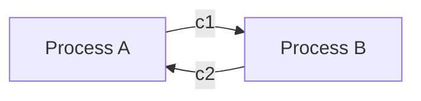
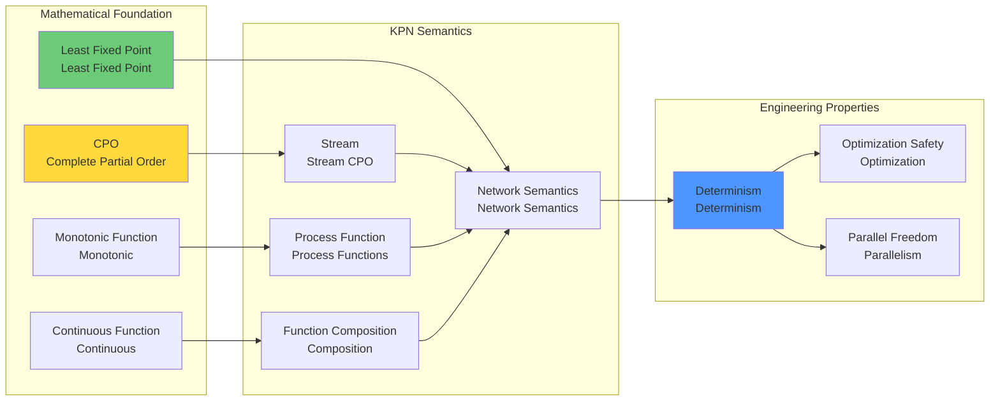
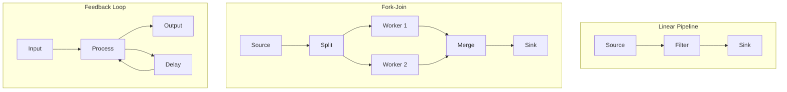

# Kahn Fixed-Point Theorem in Detail

> **Unit**: formal-methods/04-application-layer/02-stream-processing | **Prerequisites**: [01-stream-formalization](../../04-application-layer/02-stream-processing/01-stream-formalization.md) | **Formalization Level**: L5-L6

## 1. Concept Definitions (Definitions)

### Def-A-02-01: CPO (Complete Partial Order)

A partial order set $(D, \sqsubseteq)$ is a **complete partial order** (CPO) if and only if:

- $D$ has a least element $\bot$ (bottom)
- Any ascending chain $d_0 \sqsubseteq d_1 \sqsubseteq d_2 \sqsubseteq ...$ in $D$ has a supremum (least upper bound)

$$\bigsqcup_{i \geq 0} d_i \in D$$

### Def-A-02-02: Monotonic Function

A function $f: D \rightarrow D$ is **monotonic** if and only if:

$$\forall x, y \in D: x \sqsubseteq y \Rightarrow f(x) \sqsubseteq f(y)$$

### Def-A-02-03: Continuous Function

A function $f: D \rightarrow D$ is **continuous** if and only if:

- $f$ is monotonic
- $f$ preserves suprema: $f(\bigsqcup_{i \geq 0} d_i) = \bigsqcup_{i \geq 0} f(d_i)$

### Def-A-02-04: Stream

A stream over domain $A$ is $A^\infty = A^* \cup A^\omega$, where:

- $A^*$: Set of finite sequences
- $A^\omega$: Set of infinite sequences

CPO structure of streams:

- Order relation $\sqsubseteq$: Prefix order, $s \sqsubseteq t$ iff $s$ is a prefix of $t$
- Least element $\bot$: Empty sequence $\epsilon$
- Supremum: Limit of chains (finite or infinite sequences)

### Def-A-02-05: Fixed Point

An element $x \in D$ is a **fixed point** of function $f: D \rightarrow D$ if and only if:

$$f(x) = x$$

**Least Fixed Point** (LFP) is the least element in the set of fixed points:

$$\text{lfp}(f) = \bigsqcup_{n \geq 0} f^n(\bot)$$

## 2. Property Derivation (Properties)

### Lemma-A-02-01: CPO Property of Streams

$(A^\infty, \sqsubseteq)$ is a CPO.

**Proof**:

- Least element: Empty sequence $\epsilon$
- Supremum of chains: For ascending chain $s_0 \sqsubseteq s_1 \sqsubseteq ...$, define $s = \lim_{i \to \infty} s_i$:
  - If chain stabilizes (exists $n$ such that $s_n = s_{n+1} = ...$), then $s = s_n \in A^*$
  - Otherwise, $s$ is an infinite sequence, $s \in A^\omega$

### Lemma-A-02-02: Monotonicity Implies Chain Preservation

If $f$ is monotonic, then for any chain $\{d_i\}$, $\{f(d_i)\}$ is also a chain.

**Proof**:
From $d_i \sqsubseteq d_{i+1}$ and monotonicity, $f(d_i) \sqsubseteq f(d_{i+1})$.

### Lemma-A-02-03: Continuity Implies Monotonicity

$$f \text{ continuous} \Rightarrow f \text{ monotonic}$$

**Proof**: Take chain $x \sqsubseteq y \sqsubseteq y \sqsubseteq ...$, its supremum is $y$. By continuity:

$$f(y) = f(\bigsqcup \{x, y\}) = \bigsqcup \{f(x), f(y)\}$$

Thus $f(x) \sqsubseteq f(y)$.

### Prop-A-02-01: Kleene Chain Convergence

For continuous function $f$, the Kleene chain $\{f^n(\bot)\}_{n \geq 0}$ is an ascending chain:

$$\bot \sqsubseteq f(\bot) \sqsubseteq f^2(\bot) \sqsubseteq ...$$

**Proof**: By induction.

- Base: $\bot \sqsubseteq f(\bot)$ since $\bot$ is the least element
- Inductive step: If $f^n(\bot) \sqsubseteq f^{n+1}(\bot)$, then $f^{n+1}(\bot) \sqsubseteq f^{n+2}(\bot)$ by monotonicity

## 3. Relationship Establishment (Relations)

### 3.1 Mapping from KPN to Fixed-Point Semantics

| KPN Concept | Fixed-Point Semantics Concept | Correspondence |
|-------------|------------------------------|----------------|
| Process $p$ | Continuous function $f_p$ | Process semantics is the function |
| Channel | Stream value $s \in A^\infty$ | CPO of streams |
| Network Execution | Function composition | $F = f_n \circ ... \circ f_1$ |
| Network Semantics | Least fixed point | $\text{lfp}(F)$ |
| Blocking Read | Strictness analysis | Function strictness determines blocking points |

### 3.2 Reasoning Chain: Monotonic → Continuous → Fixed Point → Deterministic

```
┌─────────────┐    ┌─────────────┐    ┌─────────────┐    ┌─────────────┐
│  Monotonic  │ → │  Continuous │ → │  Fixed Point│ → │ Deterministic│
│ Monotonicity│    │ Continuity  │    │ Fixed Point │    │ Determinism │
└─────────────┘    └─────────────┘    └─────────────┘    └─────────────┘
       │                  │                  │                  │
       ▼                  ▼                  ▼                  ▼
  Prefix Preserve      Limit Preserve      Unique Semantics   Schedule
  Prefix              Limit               Unique             Independent
```

### 3.3 Relationship with Other Concurrency Models

| Model | Deterministic | Fixed-Point Semantics | Expressiveness |
|-------|---------------|----------------------|----------------|
| KPN | Yes | Direct application | Bounded nondeterminism |
| Dataflow | Config-dependent | With control tokens | Richer |
| CSP | No | Failure semantics | External choice |
| Actor | No | No standard fixed point | Dynamic topology |

## 4. Argumentation Process (Argumentation)

### 4.1 Function Strictness Analysis

A function $f: A^\infty \rightarrow B^\infty$ is **strict** if and only if:

$$f(\bot) = \bot$$

That is, it requires input to produce output.

In KPN, **blocking read** corresponds to strictness:

- Strict functions: Require input, manifest as blocking
- Non-strict functions: Can produce output without input (e.g., constant generators)

### 4.2 Network Connectivity and Deadlock

KPNs can experience **deadlock** if and only if there exists a cycle in the process graph where all processes are waiting for input.

Formally: Process $p$ is deadlocked in state $s$ when:

$$\forall c \in In(p): s(c) = \epsilon \land p \text{ is strict on all inputs}$$

**Deadlock Detection**: Construct wait-for graph, detect cycles.

### 4.3 Finite vs Infinite Streams

Kahn's theorem applies equally to finite and infinite streams:

- **Finite streams**: Actual computation terminates, output is finite sequence
- **Infinite streams**: Represents continuously running systems, output is infinite sequence

In the infinite case, the fixed point gives limit semantics (possibly partially defined infinite behavior).

## 5. Formal Proof / Engineering Argument

### 5.1 Kleene Fixed-Point Theorem

**Theorem**: Let $(D, \sqsubseteq)$ be a CPO, and $f: D \rightarrow D$ be a continuous function, then $f$ has a least fixed point:

$$\text{lfp}(f) = \bigsqcup_{n \geq 0} f^n(\bot)$$

**Complete Proof**:

**Step 1**: Prove Kleene chain is ascending

By Lemma A-04-01, $\bot \sqsubseteq f(\bot)$ since $\bot$ is the least element.

Assume $f^n(\bot) \sqsubseteq f^{n+1}(\bot)$, by monotonicity:

$$f^{n+1}(\bot) = f(f^n(\bot)) \sqsubseteq f(f^{n+1}(\bot)) = f^{n+2}(\bot)$$

Thus the chain is ascending.

**Step 2**: Prove supremum exists

Since $D$ is a CPO, ascending chains have suprema:

$$d^* = \bigsqcup_{n \geq 0} f^n(\bot) \in D$$

**Step 3**: Prove $d^*$ is a fixed point

$$\begin{aligned}
f(d^*) &= f(\bigsqcup_{n \geq 0} f^n(\bot)) \\
&= \bigsqcup_{n \geq 0} f(f^n(\bot)) \quad \text{(Continuity)} \\
&= \bigsqcup_{n \geq 0} f^{n+1}(\bot) \\
&= \bigsqcup_{n \geq 1} f^n(\bot) \\
&= \bigsqcup_{n \geq 0} f^n(\bot) \quad \text{($f^0(\bot) = \bot$ does not affect supremum)} \\
&= d^*
\end{aligned}$$

Thus $f(d^*) = d^*$.

**Step 4**: Prove minimality

Let $e$ be any fixed point, i.e., $f(e) = e$.

By induction prove $\forall n: f^n(\bot) \sqsubseteq e$:
- $n=0$: $\bot \sqsubseteq e$ (least element property)
- Inductive step: If $f^n(\bot) \sqsubseteq e$, then $f^{n+1}(\bot) = f(f^n(\bot)) \sqsubseteq f(e) = e$ (monotonicity + fixed point)

Thus $e$ is an upper bound of the chain, $d^* = \bigsqcup f^n(\bot) \sqsubseteq e$.

Therefore $d^*$ is the least fixed point.

### 5.2 Kahn Network Determinism Theorem

**Theorem**: Kahn process networks have deterministic input-output relationships.

**Proof**:

Let $\mathcal{K} = (P, C)$ be a KPN, $n = |P|$.

**Step 1**: Define network function

View the network as function $F: (A^\infty)^n \rightarrow (A^\infty)^n$, where inputs/outputs correspond to all input/output channels of processes.

For process $p_i$, its semantics is:

$$f_i: \prod_{j \in In(i)} A^\infty \rightarrow \prod_{k \in Out(i)} A^\infty$$

**Step 2**: Compose as network function

Network function $F$ is determined by process functions and channel connections:

$$F(\vec{x}) = (f_1(\vec{x}_{In(1)}), ..., f_n(\vec{x}_{In(n)}))$$

Where $\vec{x}_{In(i)}$ extracts the input channels of process $p_i$.

**Step 3**: Continuity and monotonicity

- Each $f_i$ is continuous (KPN definition)
- Composition and projection of continuous functions preserve continuity
- Thus $F$ is a continuous function

**Step 4**: Apply Kleene's theorem

By Kleene fixed-point theorem, $F$ has a unique least fixed point:

$$\text{lfp}(F) = \bigsqcup_{k \geq 0} F^k(\bot^n)$$

**Step 5**: Scheduling independence

Any legal schedule (satisfying FIFO and blocking reads) produces execution traces that are approximations of the Kleene chain:
- Step $k$ of schedule corresponds to some approximation of $F^k(\bot^n)$
- At the limit, all schedules converge to the same fixed point

Thus output is independent of scheduling, and the system is deterministic.

### 5.3 Engineering Applications: Determinism Guarantee Implementation

**Application 1**: Compiler optimization
- KPN-based compilers can safely reorder operations without changing semantics
- Example: Merge adjacent map operations

**Application 2**: Parallel scheduling
- Runtime scheduler can freely choose parallelism without affecting correctness
- Example: Dynamically adjust thread count

**Application 3**: Fault recovery
- When recovering from checkpoint, recomputation yields identical results
- Example: Flink's distributed snapshots

## 6. Example Verification (Examples)

### 6.1 Simple KPN and Fixed-Point Computation

**Network**: Producer → Double → Consumer

```haskell
-- Producer: outputs natural number sequence
producer = iterate (+1) 0  -- [0, 1, 2, 3, ...]

-- Double: map (*2)
double = map (*2)

-- Composition
network = double . producer
```

**Fixed-Point Computation**:

```
F^0(⊥) = ⊥
F^1(⊥) = [0]
F^2(⊥) = [0, 2]
F^3(⊥) = [0, 2, 4]
...
lfp(F) = [0, 2, 4, 6, ...]  -- Even number sequence
```

### 6.2 Feedback Network (Recursive Definition)

```haskell
-- fib = 0 : 1 : zipWith (+) fib (tail fib)
fib = fix (\s -> 0 : 1 : zipWith (+) s (tail s))
```

Fixed-point iteration:
```
F^0(⊥) = ⊥
F^1(⊥) = [0, 1]
F^2(⊥) = [0, 1, 1]
F^3(⊥) = [0, 1, 1, 2]
F^4(⊥) = [0, 1, 1, 2, 3]
...
lfp(F) = [0, 1, 1, 2, 3, 5, 8, ...]  -- Fibonacci sequence
```

### 6.3 Deadlock Detection Example



- A waits for c2, B waits for c1
- Forms circular wait
- **Deadlock!**

## 7. Visualizations (Visualizations)

### 7.1 Kahn's Theorem Reasoning Chain



### 7.2 Kleene Chain Convergence Diagram

```mermaid
graph TB
    subgraph "Kleene Iteration"
        B[⊥<br/>Empty Sequence]
        F1[f¹(⊥)<br/>Partial Result 1]
        F2[f²(⊥)<br/>Partial Result 2]
        F3[f³(⊥)<br/>Partial Result 3]
        DOTS[...]
        LFP[⨆fⁿ(⊥)<br/>Least Fixed Point]

        B --> F1
        F1 --> F2
        F2 --> F3
        F3 --> DOTS
        DOTS --> LFP
    end

    subgraph "Order Relation"
        B -.->|⊑| F1
        B -.->|⊑| F2
        B -.->|⊑| F3
        F1 -.->|⊑| F2
        F1 -.->|⊑| F3
        F2 -.->|⊑| F3
    end

    style B fill:#FF6B6B
    style LFP fill:#90EE90
```

### 7.3 KPN Topology Types



## 8. References (References)

[^1]: G. Kahn, "The Semantics of a Simple Language for Parallel Programming", Information Processing 74, North-Holland, 1974.
[^2]: G. Kahn and D.B. MacQueen, "Coroutines and Networks of Parallel Processes", Information Processing 77, North-Holland, 1977.
[^3]: A. Tarski, "A Lattice-Theoretical Fixpoint Theorem and its Applications", Pacific Journal of Mathematics, 5(2), 1955.
[^4]: S.C. Kleene, "Introduction to Metamathematics", North-Holland, 1952.
[^5]: J. Stoy, "Denotational Semantics: The Scott-Strachey Approach to Programming Language Theory", MIT Press, 1977.
[^6]: E.A. Lee and T.M. Parks, "Dataflow Process Networks", Proceedings of the IEEE, 83(5), 1995.
[^7]: G. Huet, "Confluent Reductions: Abstract Properties and Applications to Term Rewriting Systems", Journal of the ACM, 27(4), 1980.
[^8]: R.M. Amadio and P.L. Curien, "Domains and Lambda-Calculi", Cambridge University Press, 1998.
[^9]: S. Abramsky and A. Jung, "Domain Theory", Handbook of Logic in Computer Science, Vol. 3, 1994.
[^10]: M. Hennessy, "The Semantics of Programming Languages: An Elementary Introduction Using Operational Semantics", Wiley, 1990.
