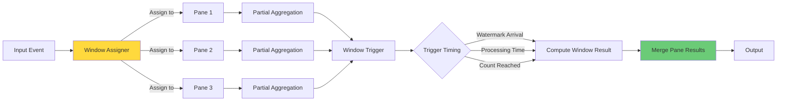
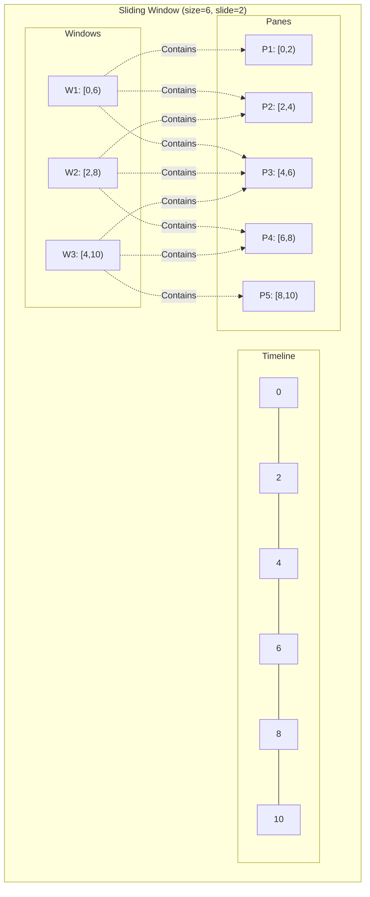
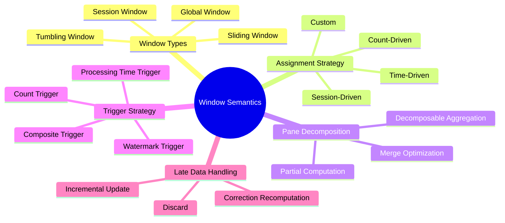

# Window Semantics and Pane Decomposition

> **Unit**: formal-methods/04-application-layer/02-stream-processing | **Prerequisites**: [02-kahn-theorem](../../04-application-layer/02-stream-processing/02-kahn-theorem.md) | **Formalization Level**: L4-L5

## 1. Concept Definitions (Definitions)

### Def-A-02-01: k-Symbolic Lookback Automaton (k-SLA)

k-SLA is a septuple $\mathcal{A}_k = (Q, \Sigma, \delta, q_0, F, \eta, k)$, where:

- $Q$: Finite set of states
- $\Sigma$: Input alphabet set (event types)
- $\delta: Q \times \Sigma^k \rightarrow Q$: Transition function, depending on the most recent $k$ symbols
- $q_0 \in Q$: Initial state
- $F \subseteq Q$: Set of accepting states
- $\eta: Q \rightarrow \mathbb{B}$: Window trigger decision function
- $k \in \mathbb{N}$: Lookback depth

**Window Recognition**: The language $L(\mathcal{A}_k)$ accepted by the automaton defines window boundary patterns.

### Def-A-02-02: Pane

A pane is the minimal atomic unit of window computation. For window $w$ and event $e$, its pane decomposition is:

$$pane(w, e) = \{(w', agg(e)) \mid e \in w' \land w' \in P(\tau_e(e))\}$$

Where $P(t)$ is the set of windows corresponding to timestamp $t$.

### Def-A-02-03: Pane Decomposition

**Pane decomposition** of a window aggregation function requires the existence of a binary operation $\oplus$ such that:

$$\text{Aggregate}(w) = \bigoplus_{p \in Panes(w)} \text{Partial}(p)$$

That is, the overall aggregation can be obtained through incremental computation of partial results.

**Decomposability Conditions**:

- Associativity: $(a \oplus b) \oplus c = a \oplus (b \oplus c)$
- Commutativity: $a \oplus b = b \oplus a$ (for unordered panes)
- Identity: $\exists e: e \oplus a = a$

### Def-A-02-04: Window Type Formalization

**Tumbling Window**:

$$W_{tumble}(t, size) = \{t' \mid \lfloor t/size \rfloor \cdot size \leq t' < (\lfloor t/size \rfloor + 1) \cdot size\}$$

**Sliding Window**:

$$W_{slide}(t, size, slide) = \{t' \mid \exists n \in \mathbb{Z}: n \cdot slide \leq t < n \cdot slide + size \land t' \in [n \cdot slide, n \cdot slide + size)\}$$

**Session Window**:

$$W_{session}(t, timeout) = \{t' \mid gap(t, t') < timeout\}$$

Where $gap$ is the time difference function between events.

### Def-A-02-05: Trigger Strategy

A trigger strategy is a predicate $Trigger: \mathcal{W} \times State \rightarrow \{Fire, Hold\}$. Common strategies:

- **Watermark Trigger**: $Trigger(w, s) = Fire \iff W_s \geq \max_{e \in w} \tau_e(e)$
- **Processing Time Trigger**: $Trigger(w, s) = Fire \iff \tau_p(current) - \tau_p(start(w)) \geq duration$
- **Count Trigger**: $Trigger(w, s) = Fire \iff |w| \geq count$
- **Pattern Trigger**: $Trigger(w, s) = Fire \iff pattern(w)$

## 2. Property Derivation (Properties)

### Lemma-A-02-01: Correctness of Pane Decomposition

If aggregation function $agg$ can be decomposed into $(\oplus, init)$, then:

$$agg(\{e_1, ..., e_n\}) = init \oplus agg(\{e_1\}) \oplus ... \oplus agg(\{e_n\})$$

**Proof**: By decomposability definition, follows from induction.

### Lemma-A-02-02: Sliding Window Overlap Degree

For sliding window $(size, slide)$, the number of active windows at any time $t$ is:

$$N_{active}(t) = \lceil size / slide \rceil$$

**Proof**: A new window starts every $slide$ time, lasting $size$ time, so $\lceil size/slide \rceil$ windows exist simultaneously.

### Prop-A-02-01: Expressiveness of k-SLA

k-SLA can recognize all regular window patterns, and for fixed $k$:

$$L(k\text{-}SLA) = \{w \in \Sigma^* \mid w \text{ satisfies local constraints of length } k\}$$

**Proof Sketch**:

- Any $k$-order regular language can be recognized by k-SLA
- By encoding history into states, simulate $(k+1)$-order dependencies

### Lemma-A-02-03: Finiteness Condition for Session Windows

A session window system produces finite windows if and only if:

$$\exists \delta > 0: \forall e_i, e_{i+1}: \tau_e(e_{i+1}) - \tau_e(e_i) \leq \delta \text{ (finite gap)}$$

Or the event stream is finite.

## 3. Relationship Establishment (Relations)

### 3.1 Window Type Relationship Graph

```
Window Types
    │
    ├── Time-Driven
    │      ├── Tumbling
    │      ├── Sliding
    │      └── Session
    │
    └── Count-Driven
           ├── Fixed Count
           └── Dynamic Count (Delta)
```

### 3.2 Pane Decomposition and Monoid

Decomposable aggregation functions form a **monoid** structure $(V, \oplus, e)$:

| Aggregation Function | Value Domain $V$ | Operation $\oplus$ | Identity $e$ |
|---------------------|------------------|-------------------|--------------|
| Sum | $\mathbb{R}$ | + | 0 |
| Count | $\mathbb{N}$ | + | 0 |
| Min | $\mathbb{R} \cup \{\infty\}$ | min | $\infty$ |
| Max | $\mathbb{R} \cup \{-\infty\}$ | max | $-\infty$ |
| Mean | $(sum, count)$ | Component-wise addition | (0, 0) |

Non-decomposable aggregations (such as Median, Top-K) require special handling.

### 3.3 Correspondence with Stream SQL

| SQL Extension | Window Type | Trigger Strategy |
|---------------|-------------|------------------|
| `TUMBLE(ts, interval)` | Tumbling | Watermark/Processing Time |
| `HOP(ts, slide, size)` | Sliding | Watermark/Processing Time |
| `SESSION(ts, gap)` | Session | Timeout + Watermark |
| `RANGE BETWEEN` | Sliding | Count |

## 4. Argumentation Process (Argumentation)

### 4.1 Complexity of Window Assignment Algorithms

**Tumbling Window Assignment**: $O(1)$ time

- Computation: $wid = timestamp / size$

**Sliding Window Assignment**: $O(size/slide)$ time

- Need to assign to all overlapping windows

**Session Window Assignment**: $O(\log n)$ time (using ordered set)

- Find nearest active session
- Merge or create new session

### 4.2 Pane Decomposition Optimization Effect

**Without Pane Decomposition**:

- Traverse all events when each window triggers
- Complexity: $O(|w|)$ per trigger

**With Pane Decomposition**:

- Precompute partial aggregations
- Complexity: $O(|Panes|)$ per trigger
- When window overlap is high, $|Panes| \ll |w|$

**Speedup Ratio**:

$$Speedup = \frac{|w|}{|Panes|} = \frac{size}{slide} \text{ (for sliding windows)}$$

### 4.3 Out-of-Order Processing and Window Correction

When a late event $e_{late}$ arrives ($\tau_p(e_{late}) > W(t)$):

**Correction Strategies**:

1. **Discard**: Ignore late events (lossy)
2. **Correction**: Recompute affected windows
3. **Incremental Correction**: Use pane decomposition, only update relevant panes

**Incremental Correction Complexity**: $O(\text{number of affected panes})$, rather than $O(|w|)$

## 5. Formal Proof / Engineering Argument

### 5.1 Pane Decomposition Equivalence Theorem

**Theorem**: Let $agg$ be a decomposable aggregation, then pane decomposition computation is equivalent to traditional full computation:

$$\bigoplus_{p \in Panes(w)} \text{Partial}(p) = agg(\{e \mid e \in w\})$$

**Proof**:

Let $w$ contain events $\{e_1, ..., e_n\}$, and pane set be $\{p_1, ..., p_m\}$.

**Step 1**: Define pane mapping

Each event $e_i$ maps to one or more panes:

$$Panes(e_i) = \{p_j \mid e_i \in p_j\}$$

**Step 2**: Define partial aggregation

$$Partial(p_j) = \bigoplus_{e_i \in p_j} agg(\{e_i\})$$

**Step 3**: Merge pane results

$$\begin{aligned}
\bigoplus_{p_j} Partial(p_j) &= \bigoplus_{p_j} \bigoplus_{e_i \in p_j} agg(\{e_i\}) \\
&= \bigoplus_{e_i} \bigoplus_{p_j \ni e_i} agg(\{e_i\}) \quad \text{(Commutativity + Associativity)} \\
&= \bigoplus_{e_i} agg(\{e_i\}) \quad \text{(Each event in finite number of panes)} \\
&= agg(\{e_1, ..., e_n\}) \quad \text{(Decomposability)}
\end{aligned}$$

### 5.2 k-SLA Window Recognition Completeness

**Theorem**: For any $k$-order regular window pattern, there exists a k-SLA that recognizes it.

**Proof Sketch**: Constructive proof.

Given $k$-order regular expression $R$, construct $\mathcal{A}_k$:
- States $Q$ correspond to $k$-order partial derivatives of $R$
- Transitions $\delta(q, (a_1, ..., a_k))$ computed according to linear form of $R$
- Accepting states correspond to window end patterns

Through extension of Thompson's construction, can handle lookback of length $k$.

### 5.3 Engineering Implementation: Dataflow Model Windows

Apache Beam/Dataflow window semantics implementation:

```java
// [伪代码片段 - 不可直接运行] 仅展示核心逻辑
// Window policy definition
Window.into(FixedWindows.of(Duration.standardMinutes(1)))
    .triggering(
        AfterWatermark.pastEndOfWindow()
            .withEarlyFirings(AfterProcessingTime.pastFirstElementInPane()
                .plusDelayOf(Duration.standardSeconds(10)))
            .withLateFirings(AfterPane.elementCountAtLeast(1))
    )
    .withAllowedLateness(Duration.standardHours(1))
    .accumulatingFiredPanes();
```

**Key Design**:
- Watermark-driven primary trigger
- Processing time-driven early trigger
- Allow late data correction
- Accumulate/discard mode selection

## 6. Example Verification (Examples)

### 6.1 Sliding Window Pane Decomposition Example

Input events: `[e1@t=1, e2@t=3, e3@t=5, e4@t=7]`
Window parameters: `size=6, slide=3`

Window assignment:
- Window 1: [0, 6) → e1, e2, e3
- Window 2: [3, 9) → e2, e3, e4

Pane decomposition (Sum aggregation):

| Pane | Events | Partial Sum |
|------|--------|-------------|
| [0,3) | e1 | 1 |
| [3,6) | e2, e3 | 5 |
| [6,9) | e4 | 7 |

Window 1 result: 1 + 5 = 6
Window 2 result: 5 + 7 = 12

### 6.2 Session Window Dynamic Merge

Input events: `[e1@t=1, e2@t=4, e3@t=12, e4@t=15]`
Timeout: `5`

Session formation:
- Session 1: [e1, e2] (gap 3 < 5)
- Session 2: [e3, e4] (gap 3 < 5, but 8 > 5 from Session 1)

When `e2'@t=8` arrives:
- Original Session 1: [e1, e2]
- New merge: [e1, e2, e2'] (gap 4 < 5)
- Need to re-trigger corrected computation for Session 1

### 6.3 k-SLA Pattern Recognition

Recognize "trigger window after 3 consecutive errors":

```
States: {q0, q1, q2, q_win}
Transitions:
  q0 --[ERROR]--> q1
  q1 --[ERROR]--> q2
  q2 --[ERROR]--> q_win
  q* --[SUCCESS]--> q0

Trigger: η(q_win) = Fire
```

## 7. Visualizations (Visualizations)

### 7.1 Window Type Timeline Comparison

```mermaid
gantt
    title Window Type Comparison Timeline
    dateFormat X
    axisFormat %s

    section Tumbling Window (size=4)
    W1 [0,4)  :0, 4
    W2 [4,8)  :4, 8
    W3 [8,12) :8, 12

    section Sliding Window (size=6, slide=2)
    W1 [0,6)  :0, 6
    W2 [2,8)  :2, 8
    W3 [4,10) :4, 10
    W4 [6,12) :6, 12

    section Session Window (gap=3)
    S1 (e1,e2,e3) :0, 7
    S2 (e4,e5)    :10, 14
```



### 7.2 Pane Decomposition Architecture



### 7.3 Pane Decomposition and Overlapping Windows



### 7.4 Window Semantics Hierarchy



## 8. References (References)

[^1]: T. Akidau et al., "The Dataflow Model: A Practical Approach to Balancing Correctness, Latency, and Cost in Massive-Scale, Unbounded, Out-of-Order Data Processing", PVLDB, 8(12), 2015.
[^2]: A. Arasu et al., "STREAM: The Stanford Stream Data Manager", IEEE Data Engineering Bulletin, 26(1), 2003.
[^3]: J. Li et al., "No Pane, No Gain: Efficient Evaluation of Sliding-Window Aggregates over Data Streams", SIGMOD 2005.
[^4]: B. Babcock et al., "Scalable Distributed Stream Processing", CIDR 2003.
[^5]: Apache Beam Documentation, "Windowing", https://beam.apache.org/documentation/programming-guide/#windowing
[^6]: R. Motwani et al., "Query Processing, Resource Management, and Approximation in a Data Stream Management System", CIDR 2003.
[^7]: D.J. Abadi et al., "The Design of the Borealis Stream Processing Engine", CIDR 2005.
[^8]: S. Chandrasekaran et al., "TelegraphCQ: Continuous Dataflow Processing for an Uncertain World", CIDR 2003.
[^9]: J. Gama and M. Gaber, "Learning from Data Streams: Processing Techniques in Sensor Networks", Springer, 2007.
[^10]: F. McSherry et al., "Differential Dataflow", CIDR 2013.
