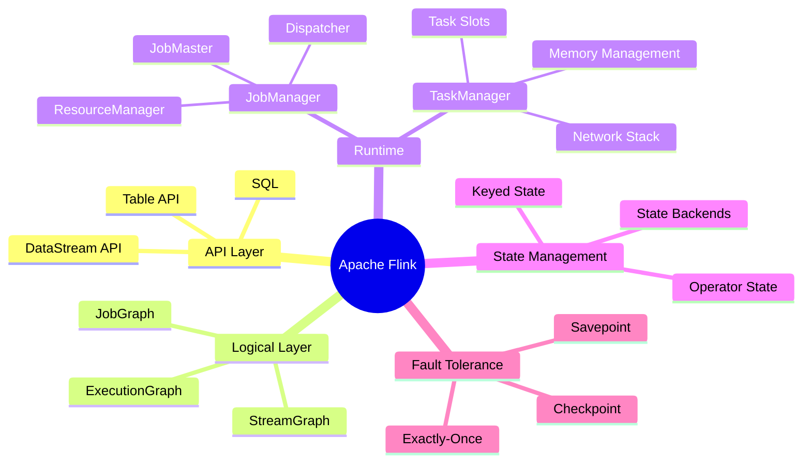
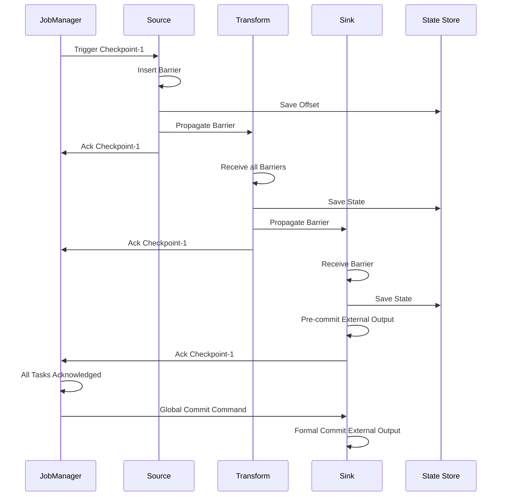
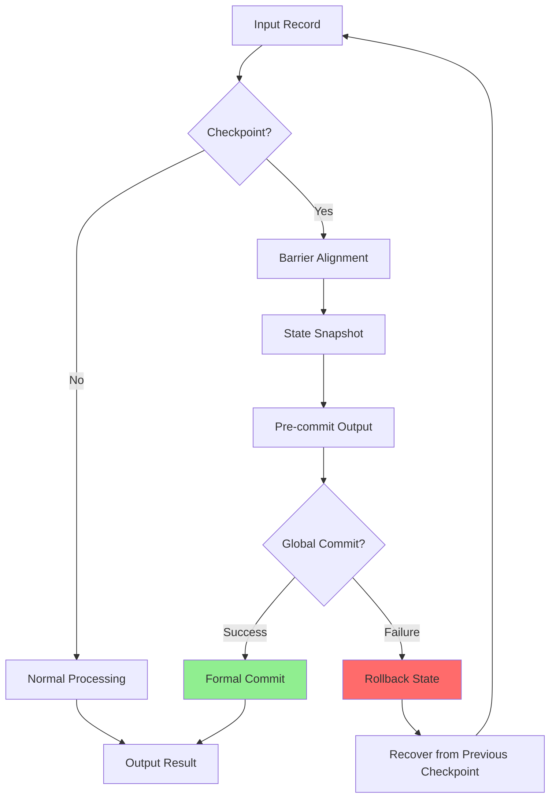

# Apache Flink Formal Model

> **Unit**: formal-methods/04-application-layer/02-stream-processing | **Prerequisites**: [01-stream-formalization](01-stream-formalization.md), [03-window-semantics](03-window-semantics.md) | **Formalization Level**: L5-L6

## 1. Concept Definitions (Definitions)

### Def-A-02-06: Flink Computational Model

Apache Flink computational model is an octuple $\mathcal{F} = (S, O, E, T, W, C, K, \Sigma)$:

- $S$: Set of data streams, infinite sequences $S = \langle e_1, e_2, e_3, ... \rangle$
- $O$: Set of operators, where $o \in O$ is a function $o: S \rightarrow S'$
- $E$: Execution environment, including JobManager and TaskManager topology
- $T$: Time semantics, $T = \{\text{Event Time}, \text{Processing Time}, \text{Ingestion Time}\}$
- $W$: Watermark strategy, $W: S \rightarrow \mathbb{T}_{watermark}$
- $C$: Checkpoint configuration, $C = (interval, mode, timeout)$
- $K$: State backend type, $K \in \{\text{Memory}, \text{FsState}, \text{RocksDB}\}$
- $\Sigma$: State space, recording intermediate results of stateful operators

### Def-A-02-07: DataStream API Semantics

DataStream API operator semantics are defined as:

**Map**:
$$\text{map}(f): \langle e_1, e_2, ... \rangle \mapsto \langle f(e_1), f(e_2), ... \rangle$$

**Filter**:
$$\text{filter}(p): \langle e_1, e_2, ... \rangle \mapsto \langle e_i \mid p(e_i) = \text{true} \rangle$$

**KeyBy**:
$$\text{keyBy}(k): S \rightarrow \{S_{k_1}, S_{k_2}, ..., S_{k_n}\}$$
Partitions the stream by key $k$ into parallel sub-streams.

**Reduce**:
$$\text{reduce}(\oplus): \langle e_1, e_2, e_3, ... \rangle \mapsto \langle e_1, e_1 \oplus e_2, (e_1 \oplus e_2) \oplus e_3, ... \rangle$$

**Window**:
$$\text{window}(w, f): S \rightarrow \langle f(S_{w_1}), f(S_{w_2}), ... \rangle$$
Where $S_{w_i}$ is the set of elements within window $w_i$.

### Def-A-02-08: Checkpoint Mechanism Formalization

Checkpoint is a distributed snapshot operation:

$$\text{Checkpoint}: (\Sigma_1, \Sigma_2, ..., \Sigma_n) \times (P_1, P_2, ..., P_m) \rightarrow \text{Snapshot}_k$$

Where:

- $\Sigma_i$: State of operator $i$
- $P_j$: Offset of data source $j$

**Barrier Insertion**:

For source operators, barrier $b_k$ (corresponding to checkpoint $k$) is inserted at position $p$:

$$\text{insert}(b_k, p) \Rightarrow \forall e \in S_{before\_p}: e \in \text{Snapshot}_{k-1} \land \forall e \in S_{after\_p}: e \in \text{Snapshot}_k$$

**State Snapshot**:

After an operator receives $b_k$ on all input channels:

$$\text{snapshot}(o) = \{(k, \Sigma_o(k)) \mid b_k \text{ received on all inputs}\}$$

### Def-A-02-09: Watermark Propagation Semantics

Watermark is a marker of time progress:

$$w \in \mathbb{T} \cup \{+\infty\}$$

**Watermark Generation** (at source operators):

$$w_{out}(t) = \max_{e \in \text{buffer}} \tau(e) - \delta$$

Where $\tau(e)$ is the event timestamp, and $\delta$ is the allowed maximum delay.

**Watermark Propagation**:

For multi-input operators, output watermark is the minimum of all input watermarks:

$$w_{out} = \min_{i \in inputs} w_i$$

**Watermark Monotonicity**:

$$\forall t_1 < t_2: w(t_1) \leq w(t_2)$$

### Def-A-02-10: Exactly-Once Semantics

Exactly-once processing semantics requires:

$$\forall e \in Input: |\{o \in Output \mid \text{cause}(o) = e\}| = 1$$

Formally defined as two sub-properties:

**Result Durability**:
$$\text{Output}(e) \text{ committed } \Rightarrow \text{ never lost }$$

**Result Uniqueness**:
$$\text{Output}(e) \text{ committed } \Rightarrow \text{ never re-emitted }$$

## 2. Property Derivation (Properties)

### Lemma-A-02-04: Checkpoint Consistency

If all operators perform state snapshots only after receiving barriers on all inputs, then the global snapshot is consistent:

$$\forall o: (\forall i \in In(o): b_k \in i) \Rightarrow \text{Snapshot}_o(k) \text{ is consistent}$$

**Proof**: Satisfies conditions of Chandy-Lamport snapshot algorithm.

### Lemma-A-02-05: Watermark Completeness

For watermark $w$, all events with event time $\tau < w$ have arrived:

$$\forall e: \tau(e) < w \Rightarrow e \in \text{processed}$$

**Proof**: Guaranteed by source operator watermark generation strategy.

### Prop-A-02-02: Exactly-Once Sufficient Conditions

Exactly-once semantics are satisfied when:

1. **Idempotent Output**: Output operations are idempotent
2. **Atomic Commit**: State snapshot and output commit atomically complete
3. **Replayable Source**: Data source supports offset replay

$$\text{Exactly-Once} \iff \text{IdempotentOutput} \land \text{AtomicCommit} \land \text{ReplayableSource}$$

### Lemma-A-02-06: Flink DAG Determinism

For given input streams and checkpoint configuration, Flink programs produce deterministic output streams:

$$\forall S_1 = S_2: \mathcal{F}(S_1, C) = \mathcal{F}(S_2, C)$$

## 3. Relationship Establishment (Relations)

### 3.1 Correspondence Between Flink and KPN

```
┌─────────────────┬──────────────────┬──────────────────┐
│     Concept     │     Flink        │     KPN          │
├─────────────────┼──────────────────┼──────────────────┤
│ Process         │ Task/Operator    │ Process p_i      │
│ Channel         │ Network Buffer   │ Unbounded FIFO   │
│ Blocking Sem.   │ Backpressure     │ Read-blocking    │
│ Determinism     │ Config-dependent │ Inherent         │
│ Dynamic Topology│ Not supported    │ Not supported    │
│ Time Semantics  │ Explicit (Wm)    │ None             │
│ Fault Tolerance │ Checkpoint       │ None             │
└─────────────────┴──────────────────┴──────────────────┘
```

### 3.2 Flink vs Dataflow Model Comparison

| Feature | Flink | Google Dataflow | Beam Model |
|---------|-------|-----------------|------------|
| Window Trigger | Watermark+Allowed Lateness | Watermark+Triggers | Trigger API |
| State Management | Embedded state backend | External state | Abstract state |
| Consistency | Checkpoint | Distributed snapshot | Implementation-dependent |
| Time Semantics | Full support | Full support | Full support |
| Out-of-Order | Watermark | Watermark | Watermark |
| Exactly-Once | Two-phase commit | Distributed snapshot | Implementation-dependent |

### 3.3 Flink Operator Algebraic Laws

| Law | Expression | Condition |
|-----|------------|-----------|
| Map Fusion | map(f) ∘ map(g) = map(f ∘ g) | None |
| Filter Commutativity | filter(p) ∘ filter(q) = filter(q) ∘ filter(p) | p, q pure functions |
| KeyBy Idempotence | keyBy(k) ∘ keyBy(k) = keyBy(k) | None |
| Window Assignment | window(w₁) → window(w₂) = window(w₂) | w₂ ⊆ w₁ |
| Reduce Associativity | reduce(⊕) parallel = reduce(⊕) serial | ⊕ associative |

## 4. Argumentation Process (Argumentation)

### 4.1 Flink Architecture Layers

```
Flink Architecture Layers:
├── Application Layer
│   └── DataStream API / Table API / SQL
├── Core Layer
│   ├── StreamGraph (Logical Plan)
│   ├── JobGraph (Optimized Logical)
│   └── ExecutionGraph (Physical Execution)
├── Runtime Layer
│   ├── JobManager (Coordination)
│   └── TaskManager (Execution)
├── State Layer
│   ├── MemoryStateBackend
│   ├── FsStateBackend
│   └── RocksDBStateBackend
└── Fault Tolerance Layer
    ├── Checkpoint Mechanism
    ├── Savepoint Mechanism
    └── Two-phase Commit
```

### 4.2 Checkpoint Algorithm Comparison

| Algorithm | Sync/Async | Incremental | Latency Impact | Recovery Time |
|-----------|------------|-------------|----------------|---------------|
| Chandy-Lamport | Sync | No | High | Short |
| Flink Barrier | Async | Yes | Low | Medium |
| RocksDB Incremental | Async | Yes | Very Low | Medium |
| No Checkpoint | - | - | None | Start from 0 |

### 4.3 Time Semantics Selection

```
Time Semantics Selection Decision Tree:
                    ┌─────────────────┐
                    │ Need Correctness?│
                    └────────┬────────┘
                             │
            ┌────────────────┼────────────────┐
            ▼ No                               ▼ Yes
    ┌───────────────┐                  ┌───────────────┐
    │ Processing    │                  │  Data Ordered?│
    │ Time          │                  └───────┬───────┘
    └───────────────┘                          │
                                    ┌──────────┴──────────┐
                                    ▼ Yes                 ▼ No
                            ┌───────────────┐     ┌───────────────┐
                            │ Event Time    │     │ Event Time +  │
                            │ (No Watermark)│     │ Watermark     │
                            └───────────────┘     └───────────────┘
```

## 5. Formal Proof / Engineering Argument

### 5.1 Exactly-Once Semantics Formal Proof

**Theorem**: Flink's two-phase commit protocol implements exactly-once semantics.

**Proof**:

**System Model**:

- Source operator set $S = \{s_1, ..., s_n\}$
- Transformation operator set $T = \{t_1, ..., t_m\}$
- Sink operator set $K = \{k_1, ..., k_p\}$
- External sink system $X$

**Two-Phase Commit Protocol**:

**Phase 1 - Pre-commit**:

```
foreach checkpoint k:
  1. JM triggers checkpoint k
  2. Source operators insert barrier b_k, snapshot offsets
  3. Downstream operators snapshot state upon receiving b_k, forward b_k
  4. Upon sink operators receiving b_k:
     - Snapshot state
     - Pre-commit output to external system
  5. All operators confirm snapshot completion
```

**Phase 2 - Commit**:

```
if (all operators confirmed):
  JM sends global commit command
  Sink operators execute formal commit to external system
else:
  Rollback to previous checkpoint
```

**Correctness Argument**:

1. **Atomicity**: Global commit command ensures all operator states are consistent
2. **Durability**: Pre-committed data is in external system transaction, can rollback on failure
3. **Uniqueness**: Checkpoint recovery ensures no duplicate processing

**Formal Invariant**:

$$I: \forall k: \text{Checkpoint}_k \text{ committed} \Rightarrow \forall o: \text{State}_o(k) \text{ consistent with } X(k)$$

### 5.2 Watermark Propagation Correctness Proof

**Theorem**: Watermark propagation ensures correctness of event time processing.

**Proof**:

**Base Case** (source operators):

Source observes maximum event time $\tau_{max}$, with allowed delay $\delta$:

$$w_{out} = \tau_{max} - \delta$$

Satisfies: $\forall e: \tau(e) \leq w_{out} + \delta$, i.e., all events either arrived or marked as late.

**Inductive Step**:

For operator $o$ with inputs $I_1, I_2, ..., I_n$, output is:

$$w_{out}^{(o)} = \min_{i \in [1,n]} w_{in}^{(i)}$$

Let $e$ be any event satisfying $\tau(e) < w_{out}^{(o)}$:

$$\tau(e) < \min_i w_{in}^{(i)} \Rightarrow \forall i: \tau(e) < w_{in}^{(i)}$$

By induction hypothesis, $\forall i: e$ has been processed on input $i$.

Therefore $e$ has been processed before the output watermark.

### 5.3 Checkpoint and Exactly-Once Relationship

```
┌─────────────────────────────────────────────────────────────┐
│                   Exactly-Once Implementation               │
├─────────────────────────────────────────────────────────────┤
│                                                             │
│  ┌──────────┐    ┌──────────┐    ┌──────────┐              │
│  │  Source  │───▶│ Transform│───▶│   Sink   │              │
│  └──────────┘    └──────────┘    └──────────┘              │
│       │               │               │                    │
│       ▼               ▼               ▼                    │
│  ┌──────────┐    ┌──────────┐    ┌──────────┐              │
│  │ Offset   │    │ State    │    │ Pre-commit│             │
│  │ Persist  │    │ Snapshot │    │ Transaction│            │
│  └──────────┘    └──────────┘    └──────────┘              │
│                                         │                  │
│                                         ▼                  │
│                              ┌──────────────────┐         │
│                              │  Global Commit   │         │
│                              │  (JobManager)    │         │
│                              └──────────────────┘         │
│                                                             │
│  Failure Recovery: Load state from latest checkpoint +     │
│  Replay source offsets                                       │
│                                                             │
└─────────────────────────────────────────────────────────────┘
```

## 6. Example Verification (Examples)

### 6.1 DataStream API Code and Semantics

```java

import org.apache.flink.streaming.api.datastream.DataStream;
import org.apache.flink.streaming.api.windowing.time.Time;

// Flink program
DataStream<Event> stream = env
    .addSource(new KafkaSource<>())           // Source
    .map(e -> transform(e))                  // Map
    .filter(e -> e.value > 0)                // Filter
    .keyBy(e -> e.key)                       // KeyBy
    .window(TumblingEventTimeWindows.of(Time.minutes(5)))  // Window
    .aggregate(new AverageAggregate())       // Aggregate
    .addSink(new KafkaSink<>());             // Sink
```

Formal representation:

```
Program = Sink ∘ Window(5min, avg) ∘ KeyBy(key) ∘ Filter(>0) ∘ Map(transform) ∘ Source
```

### 6.2 Checkpoint Configuration and Behavior

```java

import org.apache.flink.streaming.api.CheckpointingMode;

// Checkpoint configuration
env.enableCheckpointing(60000);  // 60 second interval
env.getCheckpointConfig().setCheckpointingMode(
    CheckpointingMode.EXACTLY_ONCE);
env.getCheckpointConfig().setMinPauseBetweenCheckpoints(30000);
env.getCheckpointConfig().setCheckpointTimeout(600000);
env.getCheckpointConfig().setMaxConcurrentCheckpoints(1);
env.getCheckpointConfig().enableExternalizedCheckpoints(
    ExternalizedCheckpointCleanup.RETAIN_ON_CANCELLATION);

// State backend
env.setStateBackend(new RocksDBStateBackend("hdfs://checkpoints"));
```

Semantic constraints:

```
CheckpointInterval = 60s
MaxConcurrent = 1  ⟹  Global ordering
ExactlyOnceMode  ⟹  Barrier alignment
RocksDBBackend   ⟹  Incremental checkpoint + Large state support
```

### 6.3 Watermark Strategy Implementation

```java
// Fixed delay watermark
WatermarkStrategy.<Event>forBoundedOutOfOrderness(
    Duration.ofSeconds(5))
    .withTimestampAssigner((event, timestamp) -> event.eventTime);

// Formal semantics
// w(t) = max{τ(e) | e arrived by t} - 5s

// Idle source handling
WatermarkStrategy.<Event>forBoundedOutOfOrderness(...)
    .withIdleness(Duration.ofMinutes(1));
```

### 6.4 Exactly-Once Sink Implementation

```java
// Two-phase commit sink example
public class TwoPhaseCommitSink extends TwoPhaseCommitSinkFunction<String> {

    @Override
    protected void invoke(Transaction transaction, String value, Context context) {
        transaction.write(value);  // Write to uncommitted buffer
    }

    @Override
    protected Transaction beginTransaction() {
        return new Transaction();  // Start transaction
    }

    @Override
    protected void preCommit(Transaction transaction) {
        transaction.flush();  // Pre-commit (persisted but not visible)
    }

    @Override
    protected void commit(Transaction transaction) {
        transaction.commit();  // Formal commit after global commit
    }

    @Override
    protected void abort(Transaction transaction) {
        transaction.rollback();  // Failure rollback
    }
}
```

## 7. Visualizations (Visualizations)

### 7.1 Flink Architecture Overview



### 7.2 Checkpoint Flow



### 7.3 Watermark Propagation

```mermaid
graph LR
    subgraph "Source"
        S1[Partition 1<br/>w=10:00]
        S2[Partition 2<br/>w=10:05]
        S3[Partition 3<br/>w=09:55]
    end

    subgraph "Window Operator"
        WO[min(10:00, 10:05, 09:55)<br/>w=09:55]
    end

    subgraph "Aggregate"
        AG[w=09:55]
    end

    S1 --> WO
    S2 --> WO
    S3 --> WO
    WO --> AG

    style S3 fill:#ff9999
    style WO fill:#ff9999
    style AG fill:#ff9999
```

### 7.4 Exactly-Once Guarantee Mechanism



### 7.5 Flink Execution Graph Transformation

```mermaid
graph TB
    subgraph StreamGraph Logical
        A[Source] --> B[Map]
        B --> C[KeyBy]
        C --> D[Window]
        D --> E[Sink]
    end

    subgraph JobGraph Optimized
        F[Source] --> G[Map | KeyBy]
        G --> H[Window]
        H --> I[Sink]
    end

    subgraph ExecutionGraph Physical
        J1[Source-1] --> K1[Map-1]
        J2[Source-2] --> K2[Map-2]
        K1 --> L1[Window-1]
        K2 --> L1
        L1 --> M1[Sink-1]
    end

    A -.-> F
    B -.-> G
    C -.-> G
    D -.-> H
    E -.-> I

    F -.-> J1
    F -.-> J2
    G -.-> K1
    G -.-> K2
    H -.-> L1
    I -.-> M1
```

## 8. References (References)
