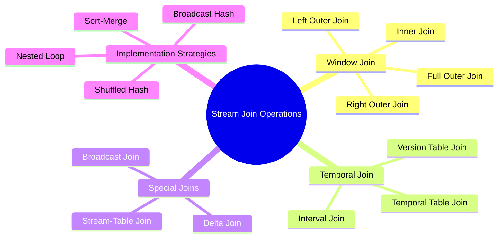
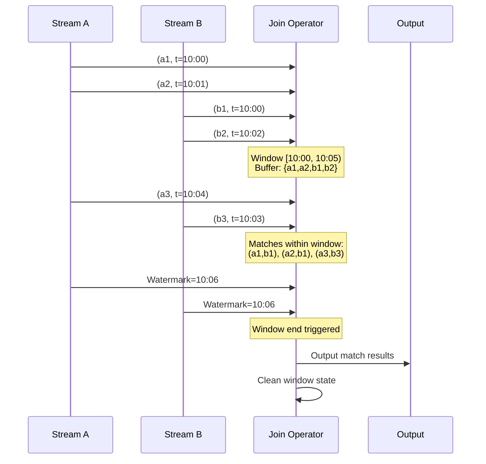
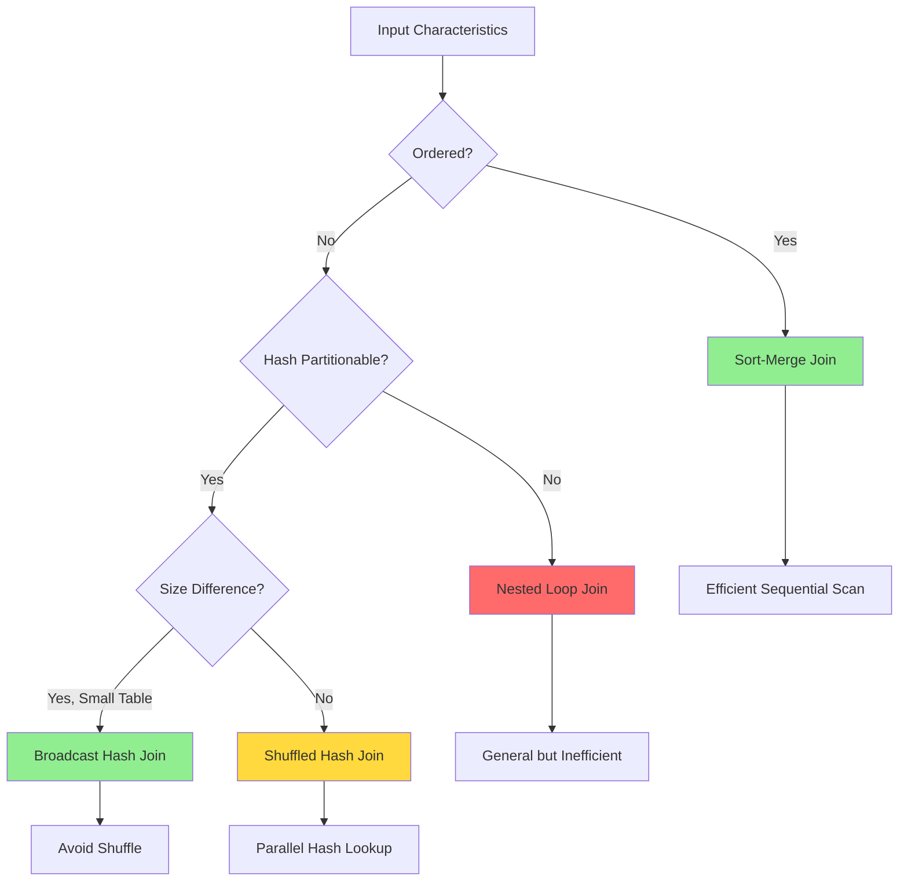

# Stream Join Operations Formalization

> **Unit**: formal-methods/04-application-layer/02-stream-processing | **Prerequisites**: [04-flink-formalization](../../04-application-layer/02-stream-processing/04-flink-formalization.md) | **Formalization Level**: L5-L6

## 1. Concept Definitions (Definitions)

### Def-A-02-11: Stream Join Operation

Stream join is an operation that combines two or more streams based on join conditions:

$$\bowtie: Stream(A) \times Stream(B) \times \theta \rightarrow Stream(A \times B)$$

Where $\theta$ is the join predicate.

**Basic Representation of Streams**:

Stream $S$ is a sequence of timestamped elements:

$$S = \langle (e_1, \tau_1), (e_2, \tau_2), ... \rangle$$

Where $\tau_i \in \mathbb{T}$ is the event timestamp.

### Def-A-02-12: Window Join Semantics

Window join matches elements within finite time windows:

$$\bowtie_{W}: Stream(A) \times Stream(B) \rightarrow Stream(A \times B)$$

For window $w = [t_{start}, t_{end}]$:

$$S_A \bowtie_{w} S_B = \{(a, b) \mid a \in S_A(w) \land b \in S_B(w) \land \theta(a, b)\}$$

### Def-A-02-13: Join Type Formalization

**Inner Join**:

$$S_A \bowtie_{inner} S_B = \{(a, b) \mid a \in S_A \land b \in S_B \land key(a) = key(b)\}$$

Only outputs matched pairs.

**Left Outer Join**:

$$S_A \bowtie_{left} S_B = \{(a, b) \mid a \in S_A \land (b \in S_B \land key(a) = key(b) \lor b = \bot)\}$$

For each element in $S_A$, outputs even without match (filled with $\bot$).

**Right Outer Join**:

$$S_A \bowtie_{right} S_B = \{(a, b) \mid (a \in S_A \land key(a) = key(b) \lor a = \bot) \land b \in S_B\}$$

**Full Outer Join**:

$$S_A \bowtie_{full} S_B = (S_A \bowtie_{left} S_B) \cup (S_A \bowtie_{right} S_B)$$

**Interval Join**:

$$S_A \bowtie_{[l,r]} S_B = \{(a, b) \mid a \in S_A \land b \in S_B \land \tau(b) \in [\tau(a) + l, \tau(a) + r]\}$$

Matches elements within time intervals.

### Def-A-02-14: Stream-Table Join

$$\bowtie_{ST}: Stream(A) \times Table(B) \rightarrow Stream(A \times B)$$

For stream element $(a, \tau_a)$:

$$a \bowtie_{ST} T = \{(a, b) \mid b \in T \land key(a) = key(b) \land \tau_{valid}(b) \ni \tau_a\}$$

Where $\tau_{valid}(b)$ is the valid time interval of table row $b$.

### Def-A-02-15: Temporal Table Join

$$S \bowtie_{temporal} T(t) = \{(s, T(key(s), \tau_s)) \mid s \in S\}$$

Where $T(k, t)$ returns the version of key $k$ in table $T$ at time $t$.

## 2. Property Derivation (Properties)

### Lemma-A-02-07: Join Symmetry

Inner join is symmetric:

$$S_A \bowtie_{inner} S_B = S_B \bowtie_{inner} S_A$$

**Proof**: Directly from symmetry of set intersection.

Outer join does not satisfy symmetry:

$$S_A \bowtie_{left} S_B \neq S_B \bowtie_{left} S_A$$

### Lemma-A-02-08: Bounded State for Window Join

For time window join of size $W$, the state space is bounded:

$$|State| \leq \lambda_A \cdot W + \lambda_B \cdot W$$

Where $\lambda$ is the arrival rate.

**Proof**: Events outside the window are cleaned up, so the number of events within the window is bounded.

### Prop-A-02-03: Interval Join Transitivity

Interval join is transitive under specific conditions:

$$(S_A \bowtie_{[l_1,r_1]} S_B) \bowtie_{[l_2,r_2]} S_C = S_A \bowtie_{[l,r]} (S_B \bowtie_{[l',r']} S_C)$$

Holds when intervals satisfy specific overlap conditions.

### Lemma-A-02-09: Completeness of Join Results

For complete historical table $T_{hist}$, temporal table join produces deterministic results:

$$\forall s \in S: \exists! t \in T_{hist}: key(s) = key(t) \land \tau_s \in \tau_{valid}(t)$$

## 3. Relationship Establishment (Relations)

### 3.1 Join Type Comparison

```
┌─────────────────┬──────────────────┬──────────────────┬──────────────────┐
│   Join Type     │   Result Set     │   State Needs    │   Latency Char.  │
├─────────────────┼──────────────────┼──────────────────┼──────────────────┤
│ Inner Join      │ Matches only     │ Dual window buf  │ Window end trig  │
│ Left Outer      │ Left full output │ Dual window+mark │ Window end trig  │
│ Right Outer     │ Right full output│ Dual window+mark │ Window end trig  │
│ Full Outer      │ Full output      │ Dual window+mark │ Window end trig  │
│ Interval Join   │ Time match       │ Dual sliding win │ Delay-driven trig│
│ Stream-Table    │ Table lookup     │ Table cache+buf  │ Immediate trig   │
│ Temporal Join   │ Temporal version │ Table history    │ Immediate trig   │
└─────────────────┴──────────────────┴──────────────────┴──────────────────┘
```

### 3.2 SQL and Stream Join Correspondence

| SQL Join | Stream Semantics | Implementation Complexity |
|----------|-----------------|---------------------------|
| `INNER JOIN` | Window inner join | Low |
| `LEFT JOIN` | Left outer join | Medium |
| `RIGHT JOIN` | Right outer join | Medium |
| `FULL OUTER JOIN` | Full outer join | High |
| `JOIN ... ON ... AND timestamp diff` | Interval Join | Medium |
| `LATERAL TABLE` | Stream-Table Join | Medium |
| `FOR SYSTEM_TIME AS OF` | Temporal Join | High |

### 3.3 Join Implementation Strategy Comparison

```
Implementation Strategy Selection:
┌─────────────────────────────────────────────────────────────┐
│                    Input Characteristics                    │
├─────────────────────────────────────────────────────────────┤
│ Ordered? ──Yes──▶ Sort-Merge Join (Efficient sequential)    │
│    │                                                        │
│    No                                                       │
│    │                                                        │
│ Partitionable? ──Yes──▶ Shuffled Hash Join (Partitioned)    │
│    │                                                        │
│    No                                                       │
│    │                                                        │
│ Small Table? ──Yes──▶ Broadcast Hash Join (Broadcast small) │
│    │                                                        │
│    No                                                       │
│    ▼                                                        │
│ Nested Loop Join (General but slow)                         │
└─────────────────────────────────────────────────────────────┘
```

## 4. Argumentation Process (Argumentation)

### 4.1 Challenges of Stream Joins

```
Core Challenges of Stream Joins:
├── Infinite Input
│   ├── Requires window/time boundaries
│   └── Complex state management
├── Out-of-Order Arrival
│   ├── Watermark coordination
│   └── Late data processing
├── Time Semantics
│   ├── Event time vs Processing time
│   └── Version control
├── State Scale
│   ├── Large key space
│   └── Long windows
└── Consistency Guarantee
    ├── Exactly-Once
    └── Failure recovery
```

### 4.2 Window Join vs Interval Join Comparison

| Feature | Window Join | Interval Join |
|---------|-------------|---------------|
| Time Base | Global window | Relative interval |
| Trigger Timing | Window end | Delay expiration |
| State Cleanup | Window end cleanup | Interval expiration cleanup |
| Match Flexibility | Low (fixed window) | High (relative interval) |
| Typical Application | Aggregation stats | Event correlation |
| Implementation Complexity | Low | Medium |

### 4.3 State Backend Impact on Joins

```
State Backend Selection:
┌─────────────────────────────────────────────────────────────┐
│ MemoryStateBackend                                          │
│ ├── Suitable for: Small state, short window, fast recovery  │
│ └── Limitation: JVM memory limit, large state OOM           │
├─────────────────────────────────────────────────────────────┤
│ FsStateBackend                                              │
│ ├── Suitable for: Medium state, needs persistence           │
│ └── Limitation: Disk access on each access, lower perf      │
├─────────────────────────────────────────────────────────────┤
│ RocksDBStateBackend                                         │
│ ├── Suitable for: Large state, long window, incremental CP  │
│ └── Limitation: Serialization overhead, complex tuning      │
└─────────────────────────────────────────────────────────────┘
```

## 5. Formal Proof / Engineering Argument

### 5.1 Window Join Formal Specification

**Syntax**:

$$Join_{window}(S_1, S_2, w, k) = \{(s_1, s_2) \mid s_1 \in S_1, s_2 \in S_2, window(s_1) = window(s_2) = w, key(s_1) = key(s_2)\}$$

**Semantic Rules**:

```
[Window-Join-Init]
─────────────────────────────────────────
Join(S₁, S₂, w, k) → State(∅, ∅, w, k)

[Window-Join-Left]
s₁ ∈ S₁  key(s₁) = k  w(s₁) = w  State(L, R, w, k)
────────────────────────────────────────────────────
State(L, R, w, k) → State(L ∪ {s₁}, R, w, k)

[Window-Join-Right]
s₂ ∈ S₂  key(s₂) = k  w(s₂) = w  State(L, R, w, k)
────────────────────────────────────────────────────
State(L, R, w, k) → State(L, R ∪ {s₂}, w, k)

[Window-Join-Emit]
(s₁, s₂) ∈ L × R  key(s₁) = key(s₂)  watermark ≥ w.end
────────────────────────────────────────────────────────
State(L, R, w, k) → Output(s₁, s₂)  State(L', R', w', k)
```

### 5.2 Interval Join Formalization

**Definition**: For interval $[l, r]$:

$$S_1 \bowtie_{[l,r]} S_2 = \{(s_1, s_2) \mid s_1 \in S_1, s_2 \in S_2, \tau_1 + l \leq \tau_2 \leq \tau_1 + r, key(s_1) = key(s_2)\}$$

**State Machine Semantics**:

```
State: (Buffer₁, Buffer₂, W)  -- Dual buffer + Current Watermark

Transitions:
 1. Input s₁:
    Buffer₁' = Buffer₁ ∪ {s₁}
    Matches = {s₂ ∈ Buffer₂ | τ₁+l ≤ τ₂ ≤ τ₁+r ∧ key(s₁)=key(s₂)}
    Output all (s₁, s₂) ∈ Matches

 2. Input s₂:
    Buffer₂' = Buffer₂ ∪ {s₂}
    Matches = {s₁ ∈ Buffer₁ | τ₁+l ≤ τ₂ ≤ τ₁+r ∧ key(s₁)=key(s₂)}
    Output all (s₁, s₂) ∈ Matches

 3. Watermark updated to W':
    Clean Buffer₁ elements with τ₁ < W'-r
    Clean Buffer₂ elements with τ₂ < W'-l
```

### 5.3 Formal Semantic Tables

#### Join Type Semantic Table

| Join Type | Mathematical Definition | Output Condition | Null Handling |
|-----------|------------------------|------------------|---------------|
| Inner | $\{(a,b) \mid key(a)=key(b)\}$ | Matches only | None |
| Left Outer | $\{(a,b) \mid a \in S_A \land (key(a)=key(b) \lor b=\bot)\}$ | Full left | Right pad $\bot$ |
| Right Outer | $\{(a,b) \mid (key(a)=key(b) \lor a=\bot) \land b \in S_B\}$ | Full right | Left pad $\bot$ |
| Full Outer | Left $\cup$ Right | Full output | Both pad $\bot$ |

#### Trigger Condition Semantic Table

| Join Type | Trigger Condition | Cleanup Condition |
|-----------|-------------------|-------------------|
| Window | $W \geq window.end$ | Watermark > window.end |
| Interval | $\tau_2 \in [\tau_1+l, \tau_1+r]$ | $\tau < W - max(|l|, |r|)$ |
| Stream-Table | Immediate | Table update triggers re-query |
| Temporal | Immediate | Historical version retention policy |

### 5.4 Consistency Proof

**Theorem**: Window join with checkpointing satisfies Exactly-Once semantics.

**Proof**:

1. **State Snapshot**: Join operator state includes contents of both window buffers
2. **Barrier Alignment**: Ensures barriers from both input streams arrive synchronously
3. **Atomic Recovery**: On failure, recover from checkpoint and replay unconfirmed records
4. **Idempotent Output**: Window output triggered by Watermark, Watermark monotonicity ensures single output

**Formal Invariant**:

$$\forall w: Output(w) \text{ committed} \iff \forall s \in S_A(w) \cup S_B(w): s \text{ processed}$$

## 6. Example Verification (Examples)

### 6.1 Flink Window Join Implementation

```java

// [伪代码片段 - 不可直接运行] 仅展示核心逻辑
import org.apache.flink.streaming.api.datastream.DataStream;
import org.apache.flink.streaming.api.windowing.time.Time;

// Dual-stream window join
DataStream<Order> orders = ...
DataStream<Shipment> shipments = ...

orders.join(shipments)
    .where(order -> order.getUserId())
    .equalTo(shipment -> shipment.getUserId())
    .window(TumblingEventTimeWindows.of(Time.minutes(5)))
    .apply((order, shipment) -> new EnrichedOrder(order, shipment))
    .addSink(...);
```

Formal representation:

```
Join_{Tumbling(5min)}(Orders, Shipments, key = userId)
```

### 6.2 Interval Join Implementation

```java

// [伪代码片段 - 不可直接运行] 仅展示核心逻辑
import org.apache.flink.streaming.api.datastream.DataStream;
import org.apache.flink.streaming.api.windowing.time.Time;

// Interval Join: Match purchases within 30 minutes of clicks
DataStream<Click> clicks = ...
DataStream<Purchase> purchases = ...

clicks.keyBy(Click::getUserId)
    .intervalJoin(purchases.keyBy(Purchase::getUserId))
    .between(Time.minutes(0), Time.minutes(30))
    .process(new ProcessJoinFunction<Click, Purchase, Conversion>() {
        @Override
        public void processElement(Click click, Purchase purchase, Context ctx, Collector<Conversion> out) {
            out.collect(new Conversion(click, purchase));
        }
    });
```

Formal representation:

```
Join_{[0min, 30min]}(Clicks, Purchases, key = userId)
```

### 6.3 Temporal Table Join

```sql
-- Temporal table join: Get exchange rate at order processing time
SELECT
    o.order_id,
    o.amount,
    r.rate,
    o.amount * r.rate as amount_usd
FROM Orders AS o
JOIN Rates FOR SYSTEM_TIME AS OF o.order_time AS r
ON o.currency = r.currency;
```

Formal representation:

```
Join_{temporal}(Orders, Rates, key = currency, time = order_time)
```

### 6.4 Stream-Table Join

```java
// [伪代码片段 - 不可直接运行] 仅展示核心逻辑
// Implement dimension table join using broadcast state
MapStateDescriptor<String, UserInfo> descriptor =
    new MapStateDescriptor<>("users", String.class, UserInfo.class);

BroadcastStream<UserInfo> userBroadcastStream = userStream.broadcast(descriptor);

eventStream
    .keyBy(Event::getUserId)
    .connect(userBroadcastStream)
    .process(new KeyedBroadcastProcessFunction<String, Event, UserInfo, EnrichedEvent>() {
        @Override
        public void processElement(Event event, ReadOnlyContext ctx, Collector<EnrichedEvent> out) {
            UserInfo user = ctx.getBroadcastState(descriptor).get(event.getUserId());
            out.collect(new EnrichedEvent(event, user));
        }

        @Override
        public void processBroadcastElement(UserInfo user, Context ctx, Collector<EnrichedEvent> out) {
            ctx.getBroadcastState(descriptor).put(user.getId(), user);
        }
    });
```

## 7. Visualizations (Visualizations)

### 7.1 Stream Join Type Overview



### 7.2 Window Join Execution Flow



### 7.3 Interval Join Time Matching

```mermaid
gantt
    title Interval Join Time Matching Example (±5 minutes)
    dateFormat HH:mm
    axisFormat %H:%M

    section Stream A (Clicks)
    Click-1    :10:00, 10:01
    Click-2    :10:05, 10:06
    Click-3    :10:12, 10:13

    section Stream B (Purchases)
    Purchase-1 :10:03, 10:04
    Purchase-2 :10:07, 10:08
    Purchase-3 :10:15, 10:16

    section Match Results
    Match-1    :crit, 10:03, 10:04
    Match-2    :crit, 10:07, 10:08
```



### 7.4 Join State Management

```mermaid
graph TB
    subgraph "Left Stream Buffer"
        L1[a1: k=A, t=10:00]
        L2[a2: k=B, t=10:01]
        L3[a3: k=A, t=10:02]
    end

    subgraph "Join Operator"
        J[Hash Map<br/>A: [a1,a3]<br/>B: [a2]]
    end

    subgraph "Right Stream Buffer"
        R1[b1: k=A, t=10:00]
        R2[b2: k=B, t=10:03]
        R3[b3: k=C, t=10:01]
    end

    L1 --> J
    L2 --> J
    L3 --> J
    R1 --> J
    R2 --> J
    R3 --> J

    J --> M1[(a1,b1)]
    J --> M2[(a2,b2)]
    J --> N[No match for b3]
```

### 7.5 Implementation Strategy Selection Decision Tree



## 8. References (References)
