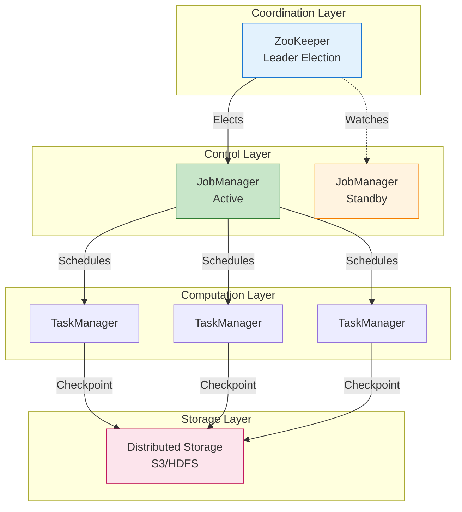
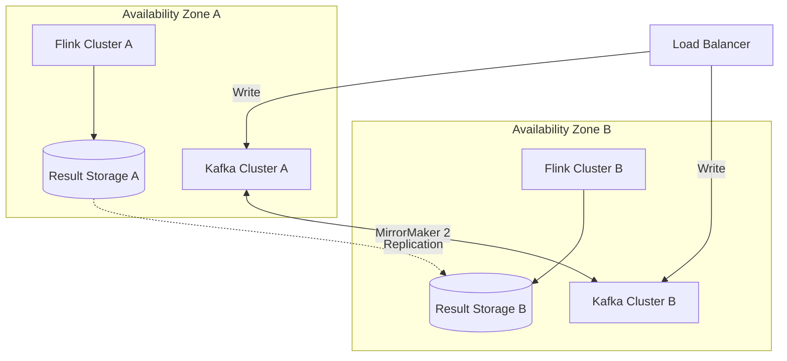
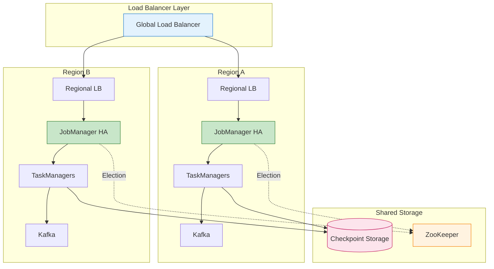
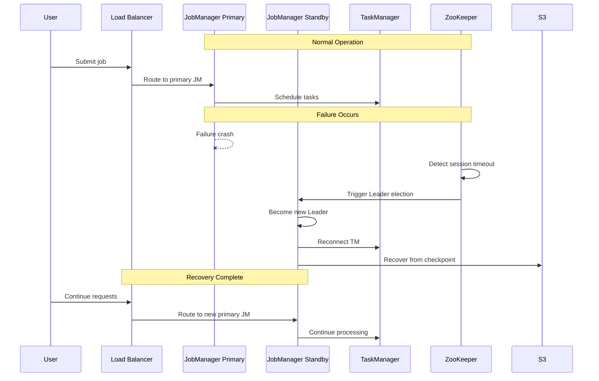

# Fault Tolerance in Stream Processing Systems

> **Unit**: formal-methods/04-application-layer/02-stream-processing | **Prerequisites**: [05-state-management](05-state-management.md) | **Formalization Level**: L4-L5

## 1. Concept Definitions (Definitions)

### Def-A-02-20: Fault Tolerance

A stream processing system is **fault-tolerant** if it can continue operating correctly in the presence of component failures, satisfying:

$$\text{FaultTolerant}(\mathcal{S}) \iff \forall f \in \text{Failures}: \mathcal{S} \xrightarrow{f} \mathcal{S}' \land \text{Correct}(\mathcal{S}')$$

Where $\mathcal{S} \xrightarrow{f} \mathcal{S}'$ denotes system transition under failure $f$, and $\text{Correct}(\mathcal{S}')$ indicates the system maintains correctness properties.

### Def-A-02-21: Failure Model Taxonomy

**Failure Types in Distributed Stream Processing**:

| Failure Class | Failure Type | Description | Frequency |
|--------------|--------------|-------------|-----------|
| **Process Failures** | Crash-stop | Process halts permanently | High |
| | Crash-recovery | Process halts, may restart | High |
| | Byzantine | Arbitrary/malicious behavior | Low |
| **Network Failures** | Partition | Network splits into isolated segments | Medium |
| | Message loss | Asynchronous message dropping | Medium |
| | Message delay | Unbounded message delay | Medium |
| **Storage Failures** | Disk failure | Permanent storage loss | Low |
| | Corruption | Data integrity violation | Low |
| **Infrastructure Failures** | Node failure | Complete machine loss | Medium |
| | Rack failure | Multiple node loss | Low |
| | Data center failure | Complete site loss | Very low |

### Def-A-02-22: Recovery Time Objectives

**Recovery Time Objective (RTO)**: Maximum acceptable time for service restoration after failure.

$$\text{RTO}: \mathbb{R}^+ \text{ (seconds)}$$

**Recovery Point Objective (RPO)**: Maximum acceptable data loss measured in time.

$$\text{RPO}: \mathbb{R}^+ \text{ (seconds)}$$

**Availability Levels** [^1][^2]:

| Level | Availability | Annual Downtime | Use Case |
|-------|-------------|-----------------|----------|
| 2-nines | 99% | 87.6 hours | Internal tools |
| 3-nines | 99.9% | 8.76 hours | General business |
| 4-nines | 99.99% | 52.6 minutes | Critical business |
| 5-nines | 99.999% | 5.26 minutes | Core business |

**Availability Formula**:

$$\text{Availability} = \frac{\text{MTTF}}{\text{MTTF} + \text{MTTR}} \times 100\%$$

Where MTTF is Mean Time To Failure and MTTR is Mean Time To Recovery.

### Def-A-02-23: Checkpoint-Based Recovery

A **checkpoint** is a consistent snapshot of distributed system state:

$$\text{Checkpoint}_t = \{S_1(t), S_2(t), ..., S_n(t)\}$$

Where $S_i(t)$ represents the state of operator $i$ at logical time $t$.

**Consistent Cut**: A checkpoint forms a consistent cut if:

$$\forall e \in \text{Events}: e \in \text{Checkpoint} \lor \text{dep}(e) \cap \text{Checkpoint} = \emptyset$$

Where $\text{dep}(e)$ represents the dependency set of event $e$.

### Def-A-02-24: State Backend Types

**HashMapStateBackend** (In-Memory):

$$\text{State}_{\text{heap}}: K \rightarrow V \text{ stored in JVM heap}$$

- Fastest access: $O(1)$
- Limited by heap size
- Subject to GC overhead

**RocksDBStateBackend** (Embedded):

$$\text{State}_{\text{rocksdb}}: K \rightarrow V \text{ stored in LSM-tree}$$

- Persistent to local disk
- Supports incremental checkpointing
- JNI overhead: ~50-100ns per call

**External State Backend**:

$$\text{State}_{\text{external}}: K \rightarrow V \text{ stored in remote system}$$

- Remote persistence (Redis, Cassandra)
- Higher latency
- Independent scaling

## 2. Property Derivation (Properties)

### Lemma-A-02-20: Checkpoint Frequency vs. Recovery Time

Checkpoint interval $T_c$ directly affects MTTR:

$$\text{MTTR} \approx T_{\text{detect}} + T_{\text{schedule}} + T_{\text{restore}}$$

Where $T_{\text{restore}}$ is proportional to checkpoint size.

**Data Loss Bound**:

$$L_{\text{max}} = T_c \times \lambda$$

Where $\lambda$ is the event arrival rate.

**Optimal Checkpoint Interval** [^3]:

$$T_c^* = \sqrt{\frac{2C}{\lambda \cdot R}}$$

Where $C$ is checkpoint cost and $R$ is recovery cost per unit of data.

### Lemma-A-02-21: Incremental Checkpoint Efficiency

For incremental checkpoints capturing only state changes:

$$\text{Checkpoint}_{\text{incr}} = \Delta S = S_t - S_{t-1}$$

**Storage Reduction**:

$$\frac{|\text{Checkpoint}_{\text{incr}}|}{|\text{Checkpoint}_{\text{full}}|} = \frac{\delta}{|S|}$$

Where $\delta$ is the change rate. For typical workloads: $\frac{\delta}{|S|} \in [0.01, 0.1]$.

### Prop-A-02-20: Local Recovery Acceleration

When local recovery is enabled:

$$T_{\text{restore}}^{\text{local}} \ll T_{\text{restore}}^{\text{remote}}$$

**Performance Improvement**:

| Recovery Type | Typical Latency | Speedup |
|---------------|-----------------|---------|
| Remote (HDFS/S3) | 30-120s | 1x |
| Local disk | 5-15s | 6-8x |
| Local memory | 1-3s | 30-40x |

### Prop-A-02-21: Active-Active Availability

For an active-active deployment with $n$ replicas, each with availability $A$:

$$\text{Availability}_{\text{active-active}} = 1 - (1 - A)^n$$

For dual-active with $A = 99.9\%$:

$$\text{Availability}_{\text{total}} = 1 - 0.001^2 = 99.9999\%$$

## 3. Relations Establishment (Relations)

### 3.1 HA Pattern to Failure Type Mapping

| Failure Type | Recommended Pattern | Recovery Time |
|--------------|---------------------|---------------|
| TaskManager failure | Automatic restart + local recovery | < 30s |
| JobManager failure | HA mode + ZooKeeper | < 60s |
| Checkpoint failure | Incremental checkpoint + retry | < 5min |
| Availability zone failure | Cross-AZ deployment | < 5min |
| Region failure | Multi-region active-active | < 15min |

### 3.2 Component Dependency Graph



## 4. Argumentation Process (Argumentation)

### 4.1 Single Point of Failure Elimination

**Flink SPOF Analysis**:

| Component | Default Risk | HA Solution |
|-----------|--------------|-------------|
| JobManager | Single point | HA mode + multiple JM |
| TaskManager | Partial risk | Failover + redundancy |
| Checkpoint storage | Single point | Distributed storage |
| Metadata storage | Single point | ZooKeeper/Raft |

**CAP Tradeoff** [^4]:

```
Distributed System Tradeoffs:

CP Systems (e.g., ZooKeeper): Consistency and Partition Tolerance
  - Pros: Strong consistency, no data conflicts
  - Cons: Unavailable during network partition

AP Systems (e.g., Cassandra): Availability and Partition Tolerance
  - Pros: High availability
  - Cons: May read stale data

Flink HA Design: Prioritizes CP, improves availability through fast recovery
```

### 4.2 Recovery Time Optimization

**Recovery Time Breakdown**:

| Phase | Time Factor | Optimization Direction |
|-------|-------------|----------------------|
| Failure detection | Heartbeat timeout | Shorten heartbeat interval |
| Leader election | ZooKeeper session | Local caching |
| Job scheduling | Resource acquisition | Pre-allocated resources |
| State recovery | Checkpoint download | Local recovery + incremental |

## 5. Formal Proof / Engineering Argument

### 5.1 JobManager High Availability

```yaml
# flink-conf.yaml - JobManager HA Configuration

# High availability mode
high-availability: zookeeper
high-availability.zookeeper.quorum: zk1:2181,zk2:2181,zk3:2181
high-availability.zookeeper.path.root: /flink
high-availability.cluster-id: production-cluster

# JobManager metadata storage
high-availability.storageDir: hdfs:///flink/ha/

# Multiple JobManager addresses
jobmanager.rpc.address: jm1,jm2,jm3
jobmanager.rpc.port: 6123

# Failover configuration
jobmanager.execution.failover-strategy: region
restart-strategy: fixed-delay
restart-strategy.fixed-delay.attempts: 3
restart-strategy.fixed-delay.delay: 10s
```

**Kubernetes Deployment**:

```yaml
# JobManager HA StatefulSet
apiVersion: apps/v1
kind: StatefulSet
metadata:
  name: flink-jobmanager
  namespace: flink
spec:
  serviceName: flink-jobmanager
  replicas: 3
  selector:
    matchLabels:
      app: flink-jobmanager
  template:
    metadata:
      labels:
        app: flink-jobmanager
    spec:
      containers:
        - name: jobmanager
          image: flink:1.18
          args: ["jobmanager"]
          env:
            - name: POD_NAME
              valueFrom:
                fieldRef:
                  fieldPath: metadata.name
          ports:
            - containerPort: 6123
              name: rpc
            - containerPort: 6124
              name: blob
            - containerPort: 8081
              name: webui
          volumeMounts:
            - name: flink-config
              mountPath: /opt/flink/conf
  volumeClaimTemplates:
    - metadata:
        name: ha-storage
      spec:
        accessModes: ["ReadWriteOnce"]
        resources:
          requests:
            storage: 10Gi
```

### 5.2 TaskManager Failover Patterns

**Automatic Restart Configuration**:

```scala
// Custom failure detection and recovery strategy
class EnhancedFailoverStrategy extends FailoverStrategy {

  override def onTaskFailure(
    taskExecution: TaskExecution,
    cause: Throwable
  ): FailoverAction = {

    // Analyze failure cause
    cause match {
      case oom: OutOfMemoryError =>
        // Increase memory on OOM restart
        FailoverAction.RESTART_WITH_RESOURCE_INCREASE(
          memoryIncreaseFactor = 1.5
        )

      case network: NetworkException =>
        // Quick retry for network failures
        FailoverAction.RESTART_WITH_BACKOFF(
          initialDelay = 1.seconds,
          maxDelay = 30.seconds
        )

      case checkpoint: CheckpointException =>
        // Switch to backup storage on checkpoint failure
        FailoverAction.RESTART_WITH_CONFIG_CHANGE(
          config = Map(
            "state.checkpoint-storage" -> "backup-s3"
          )
        )

      case _ =>
        FailoverAction.RESTART
    }
  }
}
```

### 5.3 Local Recovery Acceleration

```yaml
# flink-conf.yaml - Local Recovery Configuration

# Enable local recovery
state.backend.local-recovery: true

# Local recovery directory
taskmanager.state.local.root-dirs: /tmp/flink-local-recovery

# State backend configuration (RocksDB incremental)
state.backend: rocksdb
state.checkpoint-storage: filesystem
checkpoints.dir: hdfs:///flink/checkpoints
state.backend.incremental: true

# Network memory optimization (fast state transfer)
taskmanager.memory.network.min: 512mb
taskmanager.memory.network.max: 2gb
```

### 5.4 Multi-Active Architecture

**Same-City Dual-Active Pattern**:



**Implementation**:

```scala
// Dual-active architecture job configuration
class ActiveActiveJob {

  def buildDualActiveJob(env: StreamExecutionEnvironment): Unit = {
    // Configuration: Prefer local consumption, failover to remote
    val kafkaProps = new Properties()
    kafkaProps.setProperty("bootstrap.servers",
      "kafka-az1:9092,kafka-az2:9092")
    kafkaProps.setProperty("client.rack", getCurrentAZ())  // Rack awareness

    // Configure multi-region Kafka consumption
    val consumer = new FlinkKafkaConsumer[Event](
      "input-topic",
      new EventDeserializer(),
      kafkaProps
    )

    // Prefer reading from local AZ
    consumer.setStartFromGroupOffsets()

    val stream = env.addSource(consumer)

    // Processing logic
    stream
      .keyBy(_.userId)
      .process(new StatefulProcessor())
      .addSink(new DualActiveSink())  // Dual-write results
  }
}
```

### 5.5 Disaster Recovery Patterns

**Backup and Recovery**:

```scala
// Automated backup strategy
class DisasterRecoveryManager {

  def scheduleBackups(jobId: String): Unit = {
    // Periodic savepoints
    val savepointTrigger = new ScheduledThreadPoolExecutor(1)
    savepointTrigger.scheduleAtFixedRate(
      () => triggerSavepoint(jobId),
      0,  // Execute immediately
      1,  // Every hour
      TimeUnit.HOURS
    )
  }

  def triggerSavepoint(jobId: String): String = {
    val flinkClient = FlinkRestClient("http://flink-jobmanager:8081")

    // Trigger savepoint
    val savepointPath = s"s3://dr-backups/savepoints/$jobId/${System.currentTimeMillis()}"

    val response = flinkClient.post(
      s"/jobs/$jobId/savepoints",
      body = Json.obj(
        "cancel-job" -> false,
        "target-directory" -> savepointPath
      )
    )

    // Wait for completion
    val triggerId = (response \"request-id\").as[String]
    awaitSavepointCompletion(jobId, triggerId)

    // Validate savepoint
    validateSavepoint(savepointPath)

    // Cleanup old savepoints (keep last 24)
    cleanupOldSavepoints(jobId, keepCount = 24)

    savepointPath
  }
}
```

**Disaster Recovery Plan Template**:

```yaml
# Disaster Recovery Runbook
disaster_recovery_plan:
  version: "1.0"

  rto_rpo:
    rto: 15m  # Recovery Time Objective
    rpo: 5m   # Recovery Point Objective

  scenarios:
    - name: Single TaskManager Failure
      severity: low
      response: Automatic restart
      manual_steps: []

    - name: JobManager Failure
      severity: medium
      response: Automatic failover
      manual_steps:
        - Confirm new Leader election success
        - Check checkpoint recovery status

    - name: Availability Zone Failure
      severity: high
      response: Cross-AZ failover
      manual_steps:
        - Confirm standby AZ cluster status
        - Switch Kafka consumer group
        - Verify data consistency
        - Notify stakeholders

    - name: Region Failure
      severity: critical
      response: Geo-failover
      manual_steps:
        - Start DR region cluster
        - Restore from geo-backup
        - Switch DNS/traffic
        - Full chain verification
        - Escalate incident response

  contacts:
    primary: oncall-engineer@company.com
    secondary: infra-team@company.com
    pager: +1-555-0123
```

## 6. Example Verification (Examples)

### 6.1 HA Configuration Validation Test

```bash
#!/bin/bash
# High Availability Validation Test Script

FLINK_URL="http://flink-jobmanager:8081"
TEST_DURATION=3600

echo "=== Flink HA Test ==="

# Test 1: JobManager Failover
echo "[1/4] Testing JobManager Failover..."
JM_POD=$(kubectl get pod -l app=flink-jobmanager -o jsonpath='{.items[0].metadata.name}')
kubectl delete pod $JM_POD --force --grace-period=0

# Wait for new Leader election
sleep 30
NEW_LEADER=$(curl -s "$FLINK_URL/config" | jq -r '.flink-version')
if [ -n "$NEW_LEADER" ]; then
    echo "✓ JobManager failover successful"
else
    echo "✗ JobManager failover failed"
    exit 1
fi

# Test 2: TaskManager Failure
echo "[2/4] Testing TaskManager Failure Recovery..."
TM_COUNT_BEFORE=$(curl -s "$FLINK_URL/taskmanagers" | jq '.taskmanagers | length')
kubectl delete pod -l app=flink-taskmanager --force --grace-period=0

sleep 60
TM_COUNT_AFTER=$(curl -s "$FLINK_URL/taskmanagers" | jq '.taskmanagers | length')

if [ "$TM_COUNT_AFTER" -ge "$TM_COUNT_BEFORE" ]; then
    echo "✓ TaskManager recovery successful"
else
    echo "✗ TaskManager recovery failed"
fi

# Test 3: Checkpoint Recovery
echo "[3/4] Testing Checkpoint Recovery..."
JOB_ID=$(curl -s "$FLINK_URL/jobs" | jq -r '.jobs[0].id')
curl -X PATCH "$FLINK_URL/jobs/$JOB_ID" -d '{"cancel-job": true}'

sleep 10

# Restart from checkpoint
curl -X POST "$FLINK_URL/jars/$JAR_ID/run" -d "{
  \"programArgs\": \"\",
  \"savepointPath\": \"$LATEST_CHECKPOINT\"
}"

sleep 30
JOB_STATUS=$(curl -s "$FLINK_URL/jobs/$JOB_ID" | jq -r '.state')
if [ "$JOB_STATUS" == "RUNNING" ]; then
    echo "✓ Checkpoint recovery successful"
else
    echo "✗ Checkpoint recovery failed"
fi

# Test 4: Long-term Stability
echo "[4/4] Long-term stability test (${TEST_DURATION}s)..."
sleep $TEST_DURATION

FAILED_CHECKPOINTS=$(curl -s "$FLINK_URL/jobs/$JOB_ID/checkpoints" | jq '.counts.failed')
if [ "$FAILED_CHECKPOINTS" -eq 0 ]; then
    echo "✓ Long-term run stable"
else
    echo "⚠ Detected $FAILED_CHECKPOINTS checkpoint failures"
fi

echo "=== Test Complete ==="
```

### 6.2 Availability Monitoring Dashboard

```yaml
# Grafana Dashboard Configuration
apiVersion: 1
datasources:
  - name: Prometheus
    type: prometheus
    url: http://prometheus:9090

dashboards:
  - title: Flink HA Dashboard
    panels:
      - title: JobManager Leader Status
        type: stat
        targets:
          - expr: flink_jobmanager_is_leader
        thresholds:
          - color: red
            value: 0
          - color: green
            value: 1

      - title: TaskManager Alive Count
        type: graph
        targets:
          - expr: flink_taskmanager_numberOfTaskManagers
        alert:
          conditions:
            - evaluator:
                params: [3]
                type: lt

      - title: Checkpoint Success Rate
        type: graph
        targets:
          - expr: |
              (flink_jobmanager_checkpoint_numberOfCompletedCheckpoints /
              (flink_jobmanager_checkpoint_numberOfCompletedCheckpoints +
               flink_jobmanager_checkpoint_numberOfFailedCheckpoints)) * 100
        alert:
          conditions:
            - evaluator:
                params: [95]
                type: lt

      - title: Recovery Time
        type: graph
        targets:
          - expr: flink_jobmanager_job_recovery_time_ms

      - title: Availability Percentage
        type: stat
        targets:
          - expr: |
              100 - (
                sum(increase(flink_jobmanager_job_downtime_seconds[30d])) /
                (30 * 24 * 3600)
              ) * 100
        thresholds:
          - color: red
            value: 99
          - color: yellow
            value: 99.9
          - color: green
            value: 99.99
```

## 7. Visualizations (Visualizations)

### 7.1 High Availability Architecture



### 7.2 Failover Process Flow



## 8. References (References)

[^1]: Apache Flink Documentation, "High Availability," 2025. <https://nightlies.apache.org/flink/flink-docs-stable/docs/deployment/ha/>

[^2]: Apache Flink Documentation, "Checkpoints," 2025. <https://nightlies.apache.org/flink/flink-docs-stable/docs/dev/datastream/fault-tolerance/checkpointing/>

[^3]: N. Schelter et al., "Automatic Management of Flink's State Backend," *ACM SoCC*, 2020.

[^4]: S. Gilbert and N. Lynch, "Brewer's Conjecture and the Feasibility of Consistent, Available, Partition-Tolerant Web Services," *ACM SIGACT News*, 2002.

---

*Document Version: v1.0 | Last Updated: 2026-04-10 | Status: Complete*
