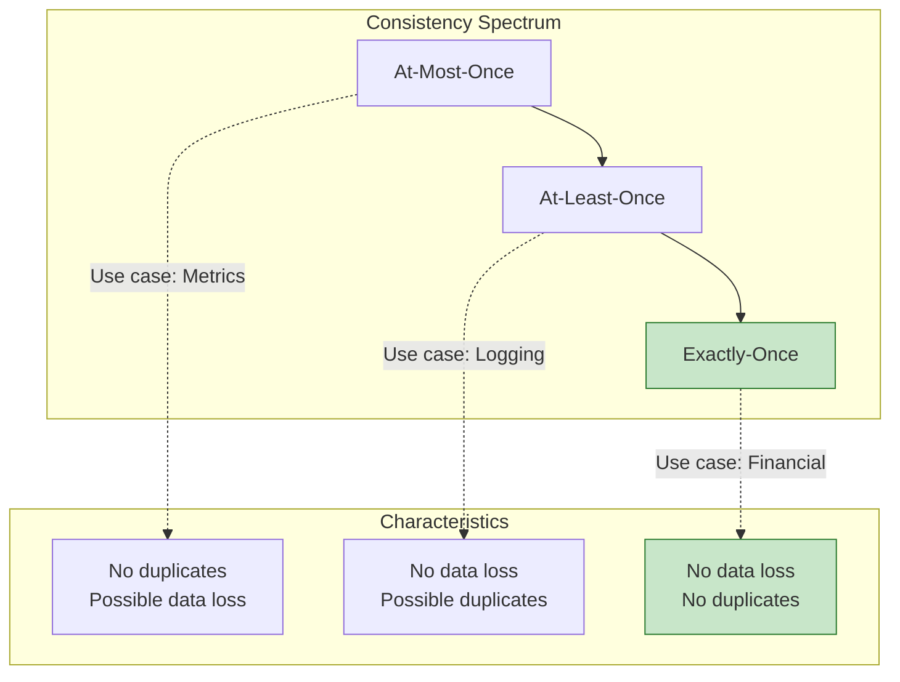
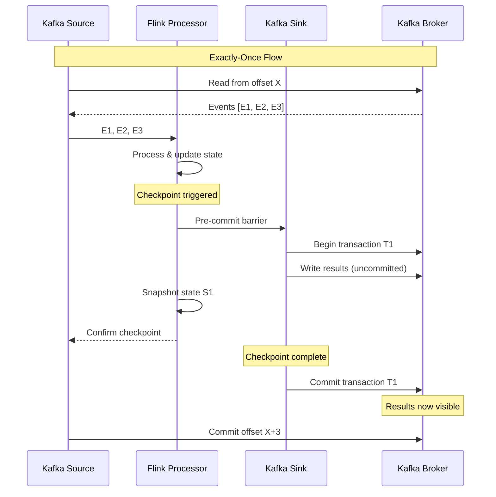
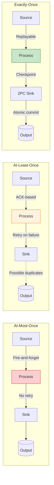

# Exactly-Once Semantics in Stream Processing

> **Unit**: formal-methods/04-application-layer/02-stream-processing | **Prerequisites**: [06-fault-tolerance](06-fault-tolerance.md) | **Formalization Level**: L5-L6

## 1. Concept Definitions (Definitions)

### Def-A-02-25: Exactly-Once Semantics

Exactly-Once processing semantics requires that for each input record $e$:

$$|\{o \in \text{Output} \mid \text{cause}(o) = e\}| = 1$$

Where $\text{cause}(o) = e$ indicates that output $o$ is causally derived from input $e$.

Formally, it requires the **idempotency** property:

$$\forall e \in \text{Input}: f(e) = f(f(e))$$

Where $f$ is the processing function.

### Def-A-02-26: End-to-End Exactly-Once

End-to-end Exactly-Once requires coordination across three stages:

$$\text{Exactly-Once}_{\text{e2e}} = \text{Source}_{\text{replayable}} \land \text{Processing}_{\text{deterministic}} \land \text{Sink}_{\text{idempotent}}$$

**Source Replayability**: The source must be able to replay records from a specific position:

$$\text{Replay}: \text{Offset} \rightarrow \text{Stream}(E)$$

**Processing Determinism**: For any input $I$ and state $S$, the output is deterministic:

$$\forall I, S: \text{Process}(I, S) = O \text{ (unique)}$$

**Sink Idempotency**: The sink must handle duplicate writes correctly:

$$\text{Write}(x) = \text{Write}(\text{Write}(x))$$

### Def-A-02-27: Transactional Output

A **transactional output** commits records and state updates atomically:

$$T = (\text{State}_{\text{new}}, \text{Output}_{\text{batch}})$$

$$\text{Commit}(T): \text{All-or-Nothing}$$

**Two-Phase Commit Protocol**:

1. **Prepare Phase**: Coordinator asks all participants to prepare
2. **Commit Phase**: If all prepared, coordinator sends commit; otherwise abort

### Def-A-02-28: Idempotent Sink Types

**Type 1: Overwrite Sink**:

$$\text{Write}_{\text{overwrite}}(k, v): \text{Store}[k] \leftarrow v$$

Natural idempotency: Writing the same key-value pair multiple times produces the same result.

**Type 2: Transactional Sink**:

$$\text{Write}_{\text{transactional}}(\text{batch}, \text{txnId}):$$
$$\text{IF } \text{txnId} \notin \text{Committed} \text{ THEN } \text{Store} \leftarrow \text{batch}; \text{Committed} \leftarrow \text{Committed} \cup \{\text{txnId}\}$$

**Type 3: Upsert Sink**:

$$\text{Write}_{\text{upsert}}(k, v):$$
$$\text{IF } k \in \text{Store} \text{ THEN } \text{Store}[k] \leftarrow \text{Merge}(\text{Store}[k], v) \text{ ELSE } \text{Store}[k] \leftarrow v$$

## 2. Property Derivation (Properties)

### Lemma-A-02-25: Checkpoint Barrier Alignment Guarantees Exactly-Once

If a stream processing system implements **distributed snapshot** (Chandy-Lamport) with barrier alignment:

$$\text{Exactly-Once} \iff \text{Idempotent Output} \land \text{Barrier Alignment}$$

**Proof Sketch**:

- ($\Rightarrow$): Exactly-Once requires that failure replay does not duplicate output, i.e., idempotency; barrier alignment ensures state consistency
- ($\Leftarrow$): With barrier alignment, all operators process the same set of records between checkpoints; idempotent output ensures duplicates have no effect

### Lemma-A-02-26: At-Least-Once + Deduplication = Exactly-Once

$$\text{At-Least-Once} + \text{Deduplication} \Rightarrow \text{Exactly-Once}$$

**Deduplication Strategies**:

| Strategy | Mechanism | Overhead |
|----------|-----------|----------|
| Deduplication window | Time-based dedup buffer | Memory: $O(\text{window} \times \lambda)$ |
| Bloom filter | Probabilistic dedup | Memory: $O(1)$, False positive: $\epsilon$ |
| Unique constraints | Database-level | Storage overhead |
| Idempotent writes | Sink-level | Minimal |

### Prop-A-02-25: Output Committer Pattern

For two-phase commit sinks:

$$\text{Commit}_{\text{phase2}} \iff \text{Checkpoint}_{\text{completed}}$$

This ensures output is only visible after state is durably checkpointed.

**Failure Scenarios**:

| Scenario | State | Output | Recovery |
|----------|-------|--------|----------|
| Pre-commit failure | Unchanged | Not visible | Replay from last checkpoint |
| Commit in progress | Partial | Partial | Transaction rollback |
| Post-commit failure | Committed | Visible | No action needed |

### Prop-A-02-26: Kafka Exactly-Once Guarantee

With Kafka as both source and sink:

$$\text{EOS}_{\text{Kafka}} = \text{Transactions} + \text{Idempotent Producer} + \text{Consumer Isolation}$$

**Transaction Coordinator**:

$$\text{TxnCoordinator}: \text{ProducerId} \times \text{TxnId} \rightarrow \text{TransactionState}$$

## 3. Relations Establishment (Relations)

### 3.1 Consistency Levels Hierarchy



### 3.2 Exactly-Once Implementation Matrix

| Component | At-Most-Once | At-Least-Once | Exactly-Once |
|-----------|-------------|---------------|--------------|
| **Source** | No replay | Offset tracking + replay | Transactional read |
| **Processing** | No state | Checkpoint | Barrier alignment |
| **Sink** | Fire-and-forget | Retry on failure | 2PC / Idempotent |

## 4. Argumentation Process (Argumentation)

### 4.1 Why Exactly-Once is Hard

**The Fundamental Challenge**:

In distributed systems, the "exactly once" concept conflicts with:

1. **Network unreliability**: Messages may be lost or duplicated
2. **Process failures**: Partial execution may leave system in inconsistent state
3. **Asynchronous communication**: No global clock for ordering events

**FLP Impossibility Result** [^1]:

In an asynchronous network with even one faulty process, no deterministic consensus protocol can guarantee:

- Agreement
- Validity
- Termination

### 4.2 Flink's Approach to Exactly-Once

**Chandy-Lamport Distributed Snapshots** [^2]:

$$\text{Snapshot} = \bigcup_{i} \text{State}_i \cup \text{InFlight}_i$$

Where $\text{InFlight}_i$ represents messages in transit to operator $i$.

**Barrier Mechanism**:

```
Stream: [Event1] [Event2] [Barrier] [Event3] [Event4]
                           ↑
                    Snapshot boundary

All events before barrier are included in checkpoint
All events after barrier are processed after recovery
```

## 5. Formal Proof / Engineering Argument

### 5.1 Barrier Alignment Protocol

**Aligned Checkpoint**:

```scala
// Aligned checkpoint processing
class AlignedCheckpointProcessor {

  def processWithAlignment(
    inputStreams: List[DataStream[Event]],
    barrierHandler: BarrierHandler
  ): DataStream[Result] = {

    // Wait for barriers from all inputs
    val barrierSync = new BarrierSynchronizer(inputStreams.size)

    inputStreams.map { stream =>
      stream.process(new BarrierProcessor {
        override def processElement(event: Event): Unit = {
          if (barrierSync.allBarriersReceived) {
            // Normal processing after checkpoint
            processNormally(event)
          } else {
            // Buffer until barrier alignment
            buffer(event)
          }
        }

        override def processBarrier(barrier: CheckpointBarrier): Unit = {
          barrierSync.markBarrierReceived(barrier.checkpointId)

          if (barrierSync.allBarriersReceived) {
            // Take snapshot of buffered state
            takeSnapshot(barrier.checkpointId)
            // Release buffered events
            releaseBuffer()
          }
        }
      })
    }
  }
}
```

**Unaligned Checkpoint** (Flink 1.11+):

```scala
// Unaligned checkpoint for high backpressure scenarios
class UnalignedCheckpointProcessor {

  def processUnaligned(
    stream: DataStream[Event],
    barrier: CheckpointBarrier
  ): Unit = {
    // 1. Stop processing input
    pauseInput()

    // 2. Capture in-flight data (buffered in channels)
    val inFlightData = captureInFlightBuffers()

    // 3. Take state snapshot
    val stateSnapshot = snapshotState()

    // 4. Persist checkpoint (state + in-flight)
    persistCheckpoint(Checkpoint(
      state = stateSnapshot,
      inFlight = inFlightData,
      timestamp = System.currentTimeMillis()
    ))

    // 5. Resume processing
    resumeInput()
  }
}
```

### 5.2 Two-Phase Commit Sink Implementation

```scala
// Generic two-phase commit sink
abstract class TwoPhaseCommitSinkFunction[
  IN,
  TXN,
  CONTEXT
] extends RichSinkFunction[IN] {

  @transient private var transactionManager: TransactionManager[TXN] = _
  @transient private var currentTransaction: TXN = _

  override def open(parameters: Configuration): Unit = {
    transactionManager = createTransactionManager()
  }

  // Called for each record
  override def invoke(value: IN, context: Context): Unit = {
    // Write to current transaction (not yet visible)
    writeToTransaction(currentTransaction, value)
  }

  // Called on checkpoint
  def snapshotState(checkpointId: Long): TXN = {
    // Prepare transaction for commit
    val preCommitTxn = prepareTransaction(currentTransaction)

    // Start new transaction for subsequent records
    currentTransaction = beginTransaction()

    preCommitTxn
  }

  // Called when checkpoint is confirmed
  def notifyCheckpointComplete(checkpointId: Long): Unit = {
    // Commit the prepared transaction
    val txn = getTransactionForCheckpoint(checkpointId)
    commitTransaction(txn)
  }

  // Called on recovery
  def initializeState(context: FunctionInitializationContext): Unit = {
    if (context.isRestored) {
      // Recover and abort any pending transactions
      val pendingTxns = recoverPendingTransactions()
      pendingTxns.foreach { txn =>
        if (isTransactionCommitted(txn)) {
          // Already committed, ignore
        } else {
          // Abort incomplete transaction
          abortTransaction(txn)
        }
      }
    }
    currentTransaction = beginTransaction()
  }

  // Abstract methods to implement
  def beginTransaction(): TXN
  def writeToTransaction(txn: TXN, value: IN): Unit
  def prepareTransaction(txn: TXN): TXN
  def commitTransaction(txn: TXN): Unit
  def abortTransaction(txn: TXN): Unit
  def recoverPendingTransactions(): List[TXN]
  def isTransactionCommitted(txn: TXN): Boolean
}
```

### 5.3 Kafka Exactly-Once Producer

```java
// Flink Kafka sink with exactly-once guarantees
FlinkKafkaProducer<String> kafkaSink = new FlinkKafkaProducer<>(
    "output-topic",
    new SimpleStringSchema(),
    kafkaProps,
    FlinkKafkaProducer.Semantic.EXACTLY_ONCE
);

// Required producer configurations for EOS
Properties kafkaProps = new Properties();
kafkaProps.setProperty("bootstrap.servers", "kafka:9092");

// Enable idempotent producer (required for EOS)
kafkaProps.setProperty("enable.idempotence", "true");
kafkaProps.setProperty("acks", "all");
kafkaProps.setProperty("retries", "Integer.MAX_VALUE");
kafkaProps.setProperty("max.in.flight.requests.per.connection", "5");

// Transaction settings
kafkaProps.setProperty("transactional.id", "flink-job-" + jobId);
kafkaProps.setProperty("transaction.timeout.ms", "60000");
```

### 5.4 Idempotent Sink Patterns

**Pattern 1: Deterministic ID Generation**:

```scala
// Generate deterministic ID from event content
class DeterministicIdSink extends RichSinkFunction[Event] {

  override def invoke(event: Event, context: Context): Unit = {
    // Deterministic ID: same event always produces same ID
    val id = s"${event.userId}-${event.timestamp}-${event.sequenceNum}"

    // Database upsert (idempotent)
    database.execute(
      """
        INSERT INTO events (id, user_id, data, timestamp)
        VALUES (?, ?, ?, ?)
        ON CONFLICT (id) DO UPDATE SET
          data = EXCLUDED.data
      """,
      id, event.userId, event.data, event.timestamp
    )
  }
}
```

**Pattern 2: Deduplication Table**:

```scala
// Using deduplication table for non-deterministic sinks
class DeduplicatingSink extends RichSinkFunction[Event] {

  @transient private var dedupCache: Cache[String, Boolean] = _

  override def open(parameters: Configuration): Unit = {
    // Time-based deduplication cache
    dedupCache = Caffeine.newBuilder()
      .expireAfterWrite(Duration.ofMinutes(10))
      .maximumSize(1000000)
      .build()
  }

  override def invoke(event: Event, context: Context): Unit = {
    val dedupKey = s"${event.sourceId}-${event.offset}"

    // Check local cache first
    if (dedupCache.getIfPresent(dedupKey) == null) {
      // Check database for processed records
      if (!isProcessed(dedupKey)) {
        // Process and mark as processed
        processEvent(event)
        markProcessed(dedupKey)
        dedupCache.put(dedupKey, true)
      }
    }
  }
}
```

## 6. Example Verification (Examples)

### 6.1 Exactly-Once Configuration Template

```scala
// Complete exactly-once pipeline configuration
object ExactlyOncePipeline {

  def main(args: Array[String]): Unit = {
    val env = StreamExecutionEnvironment.getExecutionEnvironment

    // 1. Enable checkpointing (required for EOS)
    env.enableCheckpointing(60000) // 1 minute
    env.getCheckpointConfig.setCheckpointingMode(
      CheckpointingMode.EXACTLY_ONCE
    )
    env.getCheckpointConfig.setMinPauseBetweenCheckpoints(30000)

    // 2. Configure restart strategy
    env.setRestartStrategy(RestartStrategies.fixedDelayRestart(
      3,                    // Max restart attempts
      Time.seconds(10)      // Delay between restarts
    ))

    // 3. Kafka source with exactly-once
    val kafkaSource = KafkaSource.builder[Event]()
      .setBootstrapServers("kafka:9092")
      .setTopics("input-topic")
      .setGroupId("exactly-once-consumer")
      .setStartingOffsets(OffsetsInitializer.earliest())
      .setProperty("isolation.level", "read_committed") // Only read committed
      .build()

    val stream = env.fromSource(
      kafkaSource,
      WatermarkStrategy.forBoundedOutOfOrderness(
        Duration.ofSeconds(5)
      ),
      "Kafka Source"
    )

    // 4. Processing with state
    val processed = stream
      .keyBy(_.userId)
      .process(new StatefulProcessor())

    // 5. Exactly-once sink
    val kafkaSink = new FlinkKafkaProducer[Result](
      "output-topic",
      new ResultSerializer(),
      kafkaProps,
      FlinkKafkaProducer.Semantic.EXACTLY_ONCE
    )

    processed.addSink(kafkaSink)

    env.execute("Exactly-Once Pipeline")
  }
}
```

### 6.2 End-to-End Verification Test

```scala
// Test to verify exactly-once semantics
class ExactlyOnceVerificationTest {

  test("No data loss or duplication during failures") {
    // Setup test environment with chaos injection
    val testHarness = new FlinkTestHarness()
      .withParallelism(4)
      .withCheckpointInterval(1000)
      .withChaosInjection(
        ChaosInjection.randomTaskManagerKills(0.1) // 10% kill rate
      )

    // Generate input with unique IDs
    val inputCount = 100000
    val inputs = (1 to inputCount).map { i =>
      TestEvent(id = i, value = s"event-$i")
    }

    // Run processing
    val outputs = testHarness
      .process(inputs)
      .collect()

    // Verification 1: No data loss
    assert(outputs.size == inputCount,
      s"Data loss detected: expected $inputCount, got ${outputs.size}")

    // Verification 2: No duplicates
    val outputIds = outputs.map(_.id)
    assert(outputIds.distinct.size == outputIds.size,
      s"Duplicates detected: ${outputIds.size - outputIds.distinct.size} duplicates")

    // Verification 3: Correctness
    val expectedSum = inputs.map(_.id).sum
    val actualSum = outputs.map(_.id).sum
    assert(actualSum == expectedSum,
      s"Incorrect results: expected sum $expectedSum, got $actualSum")
  }
}
```

## 7. Visualizations (Visualizations)

### 7.1 Exactly-Once Processing Flow



### 7.2 Consistency Levels Comparison



## 8. References (References)

[^1]: M. J. Fischer, N. A. Lynch, and M. S. Paterson, "Impossibility of Distributed Consensus with One Faulty Process," *Journal of the ACM*, 1985.

[^2]: K. M. Chandy and L. Lamport, "Distributed Snapshots: Determining Global States of Distributed Systems," *ACM Transactions on Computer Systems*, 1985.


---

*Document Version: v1.0 | Last Updated: 2026-04-10 | Status: Complete*
