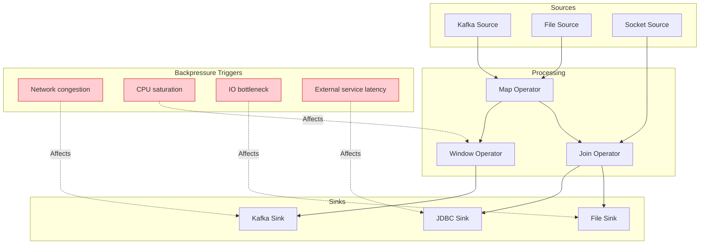
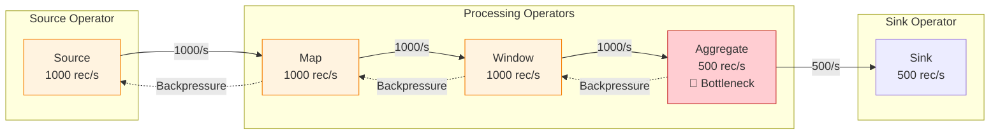
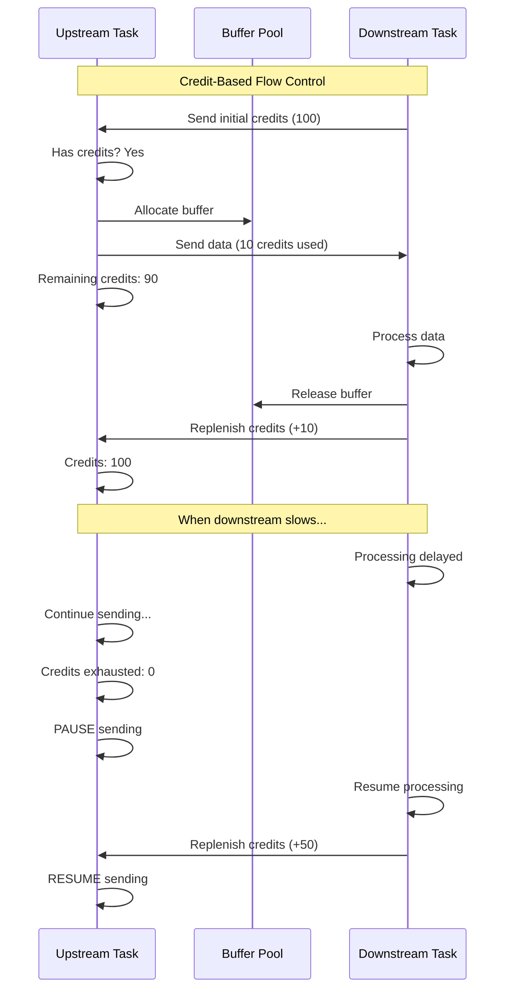
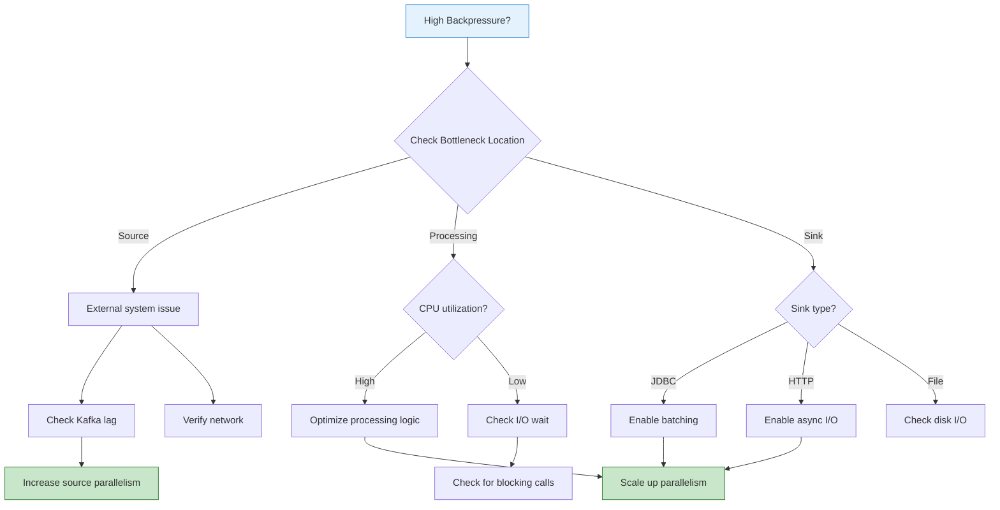

# Backpressure Mechanisms in Stream Processing

> **Unit**: formal-methods/04-application-layer/02-stream-processing | **Prerequisites**: [05-state-management](05-state-management.md) | **Formalization Level**: L4-L5

## 1. Concept Definitions (Definitions)

### Def-A-02-30: Backpressure

**Backpressure** is a flow control mechanism where a slow downstream consumer signals upstream producers to reduce data production rate:

$$\text{Backpressure}: \text{Rate}_{\text{downstream}} < \text{Rate}_{\text{upstream}} \Rightarrow \text{Signal}_{\text{throttle}}$$

Formally, for operator chain $O_1 \rightarrow O_2 \rightarrow ... \rightarrow O_n$:

$$\text{Backpressure at } O_i \iff \lambda_{\text{in}}(O_i) > \mu_{\text{out}}(O_i) + \beta_{\text{buffer}}$$

Where $\lambda$ is input rate, $\mu$ is output rate, and $\beta$ is buffer capacity.

### Def-A-02-31: Credit-Based Flow Control

**Credit-based flow control** assigns transmission rights to upstream operators:

$$\text{Credit}_i(t) \in \mathbb{N}_0$$

Upstream can send only when credit is available:

$$\text{Send}(m) \iff \text{Credit}_i(t) \geq |m|$$

After sending:

$$\text{Credit}_i(t+1) = \text{Credit}_i(t) - |m|$$

Downstream replenishes credits when buffers are freed:

$$\text{Credit}_i(t+1) = \text{Credit}_i(t) + \Delta \text{ when Buffer}_{\text{freed}}$$

### Def-A-02-32: Backpressure Propagation Models

**Model 1: Immediate Propagation**:

$$\text{Backpressure}(O_i) \Rightarrow \forall j < i: \text{Backpressure}(O_j)$$

Pressure propagates instantly to all upstream operators.

**Model 2: Buffer-Attenuated Propagation**:

$$\text{Backpressure}(O_i) \text{ after } \frac{B_{i-1}}{\lambda_{i-1} - \mu_{i-1}} \Rightarrow \text{Backpressure}(O_{i-1})$$

Buffers absorb temporary pressure differences before propagating.

**Model 3: Selective Propagation**:

$$\text{Backpressure}(O_i) \Rightarrow \text{Backpressure}(O_j) \text{ where } j = \arg\min_{k < i} \{\text{Utilization}(O_k)\}$$

Pressure propagates only through least utilized paths.

### Def-A-02-33: Backpressure Metrics

**Backpressure Time**: Time spent in backpressure per unit time

$$T_{\text{backpressure}}(t) = \frac{\text{time in backpressure}}{\text{total time}} \times 100\%$$

**Backpressure Ratio**:

$$R_{\text{bp}} = \frac{\lambda_{\text{actual}}}{\lambda_{\text{max}}} \times 100\%$$

**Processing Lag**:

$$L(t) = \int_0^t (\lambda(\tau) - \mu(\tau)) d\tau$$

### Def-A-02-34: Buffer Management

**Network Buffer Pool**:

$$B_{\text{total}} = \sum_{i=1}^{n} B_i^{\text{local}} + B^{\text{floating}}$$

Where:

- $B_i^{\text{local}}$: Buffers dedicated to channel $i$
- $B^{\text{floating}}$: Shared buffer pool for dynamic allocation

**Buffer Allocation Strategy**:

| Strategy | Formula | Use Case |
|----------|---------|----------|
| Fixed | $B_i = \frac{B_{\text{total}}}{n}$ | Uniform load |
| Demand-based | $B_i \propto \lambda_i$ | Variable load |
| Priority | $B_i \propto \text{Priority}_i$ | QoS requirements |

## 2. Property Derivation (Properties)

### Lemma-A-02-30: Backpressure Propagation Speed

For a pipeline of $n$ operators with buffer size $B$ at each stage:

$$T_{\text{propagate}} = \sum_{i=1}^{n} \frac{B}{\lambda_i - \mu_i}$$

**Special Case**: If $\lambda_i = \mu_i$ (steady state), backpressure does not propagate.

### Lemma-A-02-31: Credit-Based Flow Control Stability

Credit-based flow control is **stable** if:

$$\lim_{t \to \infty} \text{Credit}(t) > 0$$

**Stability Condition**:

$$\mathbb{E}[\lambda_{\text{upstream}}] \leq \mathbb{E}[\mu_{\text{downstream}}]$$

### Prop-A-02-30: Buffer Size vs. Latency Tradeoff

For buffer size $B$:

$$\text{Latency}_{\text{buffer}} = \frac{B}{2\lambda} + \frac{B}{2\mu}$$

$$\text{Throughput}_{\text{max}} = \mu \times \frac{B}{B - L_{\text{avg}}}$$

Where $L_{\text{avg}}$ is average queue length.

**Optimal Buffer Size**:

$$B^* = \arg\min_B \left( \alpha \cdot \text{Latency}(B) + \beta \cdot \frac{1}{\text{Throughput}(B)} \right)$$

### Prop-A-02-31: Backpressure Cascade Effect

In a DAG topology, backpressure at sink $s$ affects source $r$ through paths $P(r, s)$:

$$\text{Pressure}(r) = \sum_{p \in P(r,s)} \prod_{e \in p} w(e)$$

Where $w(e)$ is the backpressure transmission coefficient of edge $e$.

## 3. Relations Establishment (Relations)

### 3.1 Backpressure Detection Methods

| Method | Mechanism | Granularity | Overhead |
|--------|-----------|-------------|----------|
| **Buffer watermark** | Monitor buffer fill ratio | Per channel | Low |
| **Credit exhaustion** | Track available credits | Per channel | Low |
| **Processing time ratio** | Compare input/output rates | Per task | Medium |
| **Backpressure time** | Measure time in backpressure | Per task | Low |

### 3.2 Backpressure vs. System Components



## 4. Argumentation Process (Argumentation)

### 4.1 Why Backpressure is Necessary

**Without Backpressure**:

```
Scenario: Kafka Source (100K/s) → Slow Sink (10K/s)

Time 0s:  Buffer empty
Time 1s:  Buffer: 90K records (OOM risk)
Time 2s:  Buffer: 180K records (OOM)
Time 3s:  Job failure → Data loss
```

**With Backpressure**:

```
Same scenario with backpressure:

Time 0s:  Buffer empty, Source at 100K/s
Time 0.5s: Buffer reaches 50%, Backpressure triggered
Time 0.6s: Source rate reduced to 10K/s (matching sink)
Time 1s+:  Stable operation, Source at 10K/s
```

### 4.2 Backpressure vs. Scaling

| Approach | Response Time | Resource Usage | Complexity |
|----------|--------------|----------------|------------|
| Backpressure | Immediate | Existing resources | Low |
| Auto-scaling | Seconds-minutes | Additional resources | Medium |
| Manual scaling | Minutes-hours | Additional resources | High |

**Recommendation**: Use backpressure for temporary spikes, scaling for sustained load.

## 5. Formal Proof / Engineering Argument

### 5.1 Flink Credit-Based Flow Control

```scala
// Credit-based flow control implementation
class CreditBasedFlowControl {

  // Credit assignment to upstream
  class CreditBasedResultPartition(
    partitionId: ResultPartitionID,
    bufferSize: Int
  ) {
    private val credits = new AtomicInteger(bufferSize)
    private val pendingRequests = new ConcurrentLinkedQueue[BufferRequest]()

    // Called when downstream acknowledges receipt
    def addCredits(delta: Int): Unit = {
      val newCredits = credits.addAndGet(delta)

      // Process pending requests if credits available
      while (newCredits > 0 && !pendingRequests.isEmpty) {
        val request = pendingRequests.poll()
        if (request != null) {
          fulfillRequest(request)
          credits.decrementAndGet()
        }
      }
    }

    // Request buffer for sending data
    def requestBuffer(size: Int): Option[Buffer] = {
      if (credits.get() >= size) {
        credits.addAndGet(-size)
        Some(allocateBuffer(size))
      } else {
        // Queue request for later fulfillment
        pendingRequests.offer(BufferRequest(size))
        None
      }
    }

    // Backpressure check
    def isBackpressured: Boolean = credits.get() <= 0
  }
}
```

### 5.2 Backpressure Monitoring and Metrics

```scala
// Backpressure monitoring implementation
class BackpressureMonitor extends RichFunction {

  @transient private var backpressureTimeMs: Counter = _
  @transient private var lastCheckTime: Long = _
  @transient private var inBackpressure: Boolean = false

  override def open(parameters: Configuration): Unit = {
    backpressureTimeMs = getRuntimeContext
      .getMetricGroup
      .counter("backPressuredTimeMsPerSecond", new Counter())
  }

  def updateBackpressureStatus(isBackpressured: Boolean): Unit = {
    val currentTime = System.currentTimeMillis()

    if (inBackpressure) {
      // Accumulate backpressure time
      val duration = currentTime - lastCheckTime
      backpressureTimeMs.inc(duration)
    }

    inBackpressure = isBackpressured
    lastCheckTime = currentTime
  }
}

// Prometheus alerting rules
groups:
  - name: flink_backpressure
    rules:
      # Critical: High backpressure for extended period
      - alert: FlinkHighBackpressure
        expr: flink_taskmanager_job_task_backPressuredTimeMsPerSecond > 200
        for: 5m
        labels:
          severity: critical
        annotations:
          summary: "Flink task experiencing high backpressure"
          description: "Task {{ $labels.task_name }} has {{ $value }}ms/s backpressure"

      # Warning: Moderate backpressure
      - alert: FlinkModerateBackpressure
        expr: flink_taskmanager_job_task_backPressuredTimeMsPerSecond > 100
        for: 10m
        labels:
          severity: warning
        annotations:
          summary: "Flink task experiencing moderate backpressure"
```

### 5.3 Backpressure Mitigation Patterns

**Pattern 1: Async I/O for External Calls**:

```scala
// Replace blocking I/O with async I/O
class AsyncEnrichment extends AsyncFunction[Event, EnrichedEvent] {

  @transient private var httpClient: AsyncHttpClient = _

  override def open(parameters: Configuration): Unit = {
    httpClient = Dsl.asyncHttpClient()
  }

  override def asyncInvoke(
    event: Event,
    resultFuture: ResultFuture[EnrichedEvent]
  ): Unit = {
    // Non-blocking HTTP call
    val future = httpClient
      .prepareGet(s"http://api/user/${event.userId}")
      .execute()

    // Callback when response arrives
    future.addListener(() => {
      val response = future.get()
      val enriched = EnrichedEvent(
        event,
        userInfo = parse(response.getResponseBody)
      )
      resultFuture.complete(Collections.singleton(enriched))
    }, executor)
  }
}

// Usage with timeout and capacity limit
val enriched = AsyncDataStream.unorderedWait(
  inputStream,
  new AsyncEnrichment(),
  timeout = 1000,  // 1 second timeout
  timeUnit = TimeUnit.MILLISECONDS,
  capacity = 100   // Max 100 concurrent requests
)
```

**Pattern 2: Load Shedding**:

```scala
// Discard low-priority events during congestion
class LoadSheddingOperator extends ProcessFunction[Event, Event] {

  private val congestionThreshold = 0.8

  override def processElement(
    event: Event,
    ctx: Context,
    out: Collector[Event]
  ): Unit = {
    val bufferRatio = getBufferFillRatio()

    if (bufferRatio < congestionThreshold) {
      // Normal processing
      out.collect(event)
    } else if (event.priority == HIGH) {
      // Keep high priority events
      out.collect(event)
    } else {
      // Drop low priority events, count for metrics
      ctx.output(droppedEventsTag, event)
    }
  }
}
```

**Pattern 3: Batching and Compression**:

```scala
// Reduce overhead through batching
class BatchingSink extends RichSinkFunction[Event] {

  private val batchSize = 1000
  private val batchTimeoutMs = 1000
  private var buffer: ListBuffer[Event] = _
  @transient private var flushTimer: ScheduledFuture[_] = _

  override def open(parameters: Configuration): Unit = {
    buffer = new ListBuffer[Event]()
    flushTimer = getRuntimeContext.getProcessingTimeService
      .registerTimer(
        System.currentTimeMillis() + batchTimeoutMs,
        _ => flushBuffer()
      )
  }

  override def invoke(event: Event, context: Context): Unit = {
    buffer += event

    if (buffer.size >= batchSize) {
      flushBuffer()
    }
  }

  private def flushBuffer(): Unit = {
    if (buffer.nonEmpty) {
      // Write batch to sink (single network call)
      writeBatch(buffer.toList)
      buffer.clear()
    }
  }
}
```

### 5.4 Network Buffer Configuration

```yaml
# flink-conf.yaml - Network buffer optimization

# Buffer size (default: 32KB)
taskmanager.memory.network.buffer-size: 65536  # 64KB

# Minimum network memory
taskmanager.memory.network.min: 512mb

# Maximum network memory
taskmanager.memory.network.max: 2gb

# Fraction of managed memory for network
taskmanager.memory.network.fraction: 0.15

# Buffers per channel (low for low parallelism, high for high)
taskmanager.network.memory.network-buffers-per-channel: 8

# Floating buffers for dynamic allocation
taskmanager.network.memory.floating-buffers-per-gate: 16

# Credit-based flow control settings
taskmanager.network.memory.buffer-debloat.enabled: true
taskmanager.network.memory.buffer-debloat.target: 1000  # Target 1s of buffered data
```

### 5.5 Backpressure-Aware Scheduling

```scala
// Schedule tasks based on backpressure status
class BackpressureAwareScheduler {

  def scheduleTask(
    task: Task,
    availableSlots: List[TaskManagerSlot]
  ): TaskManagerSlot = {

    // Get backpressure metrics for each slot
    val slotMetrics = availableSlots.map { slot =>
      val backpressure = getBackpressureTime(slot)
      val throughput = getThroughput(slot)
      (slot, backpressure, throughput)
    }

    // Select slot with lowest backpressure
    val bestSlot = slotMetrics
      .filter(_._2 < BACKPRESSURE_THRESHOLD)
      .maxBy(_._3)

    bestSlot._1
  }
}
```

## 6. Example Verification (Examples)

### 6.1 Backpressure Diagnosis Workflow

```scala
// Diagnostic tool for backpressure analysis
object BackpressureDiagnostic {

  def analyze(jobId: String, flinkClient: FlinkRestClient): DiagnosisReport = {

    // 1. Get backpressure metrics
    val vertices = flinkClient.getJobVertices(jobId)

    val backpressureAnalysis = vertices.map { vertex =>
      val metrics = flinkClient.getVertexMetrics(vertex.id)

      VertexAnalysis(
        name = vertex.name,
        backpressureTime = metrics.backPressuredTimeMsPerSecond,
        inputRate = metrics.numRecordsInPerSecond,
        outputRate = metrics.numRecordsOutPerSecond,
        bufferedRecords = metrics.buffersInUse
      )
    }

    // 2. Identify bottleneck
    val bottleneck = backpressureAnalysis
      .filter(_.backpressureTime > 100)  // >100ms/s backpressure
      .maxBy(_.backpressureTime)

    // 3. Generate recommendations
    val recommendations = generateRecommendations(bottleneck)

    DiagnosisReport(
      jobId = jobId,
      bottleneck = bottleneck,
      recommendations = recommendations,
      timestamp = System.currentTimeMillis()
    )
  }

  def generateRecommendations(analysis: VertexAnalysis): List[Recommendation] = {
    var recs = List.empty[Recommendation]

    if (analysis.backpressureTime > 200) {
      recs :+= Recommendation(
        severity = CRITICAL,
        message = "Severe backpressure detected - immediate action required",
        actions = List(
          "Check sink throughput capacity",
          "Consider increasing sink parallelism",
          "Enable async I/O for external calls"
        )
      )
    }

    if (analysis.inputRate > analysis.outputRate * 2) {
      recs :+= Recommendation(
        severity = WARNING,
        message = "Significant rate imbalance",
        actions = List(
          "Implement load shedding for non-critical events",
          "Increase downstream parallelism",
          "Optimize processing logic"
        )
      )
    }

    recs
  }
}
```

### 6.2 Backpressure Test Harness

```scala
// Test backpressure behavior under load
class BackpressureTest extends FlinkTestBase {

  test("System should apply backpressure when sink is slow") {
    val fastSourceRate = 10000  // 10K records/s
    val slowSinkRate = 1000     // 1K records/s

    // Setup pipeline
    val source = env.addSource(new RateLimitedSource(fastSourceRate))
    val sink = new SlowSink(slowSinkRate)

    source.addSink(sink)

    // Execute and monitor
    val job = env.executeAsync()

    // Wait for backpressure to propagate
    Thread.sleep(5000)

    // Verify backpressure metrics
    val metrics = getBackpressureMetrics(job.getJobID)

    // Source should be backpressured
    metrics.sourceBackpressureTime should be > 0

    // Buffer utilization should be high
    metrics.bufferUtilization should be > 0.5

    // Actual throughput should match sink rate
    metrics.actualThroughput shouldBe slowSinkRate +- 100
  }
}
```

## 7. Visualizations (Visualizations)

### 7.1 Backpressure Propagation in Pipeline



### 7.2 Credit-Based Flow Control Sequence



### 7.3 Backpressure Decision Tree



## 8. References (References)


---

*Document Version: v1.0 | Last Updated: 2026-04-10 | Status: Complete*
