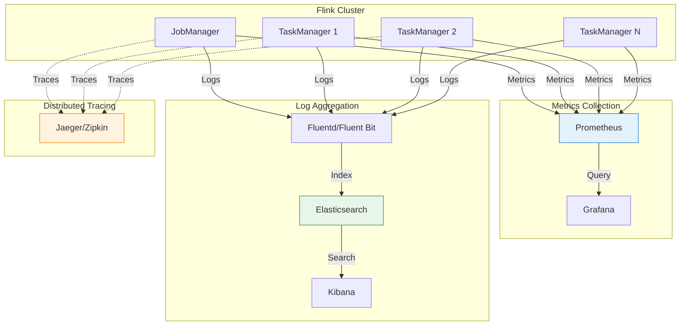
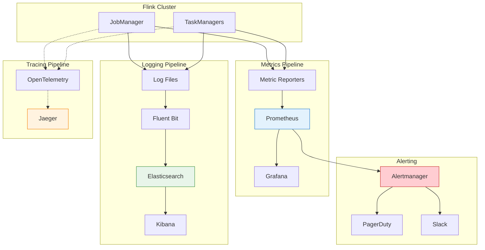
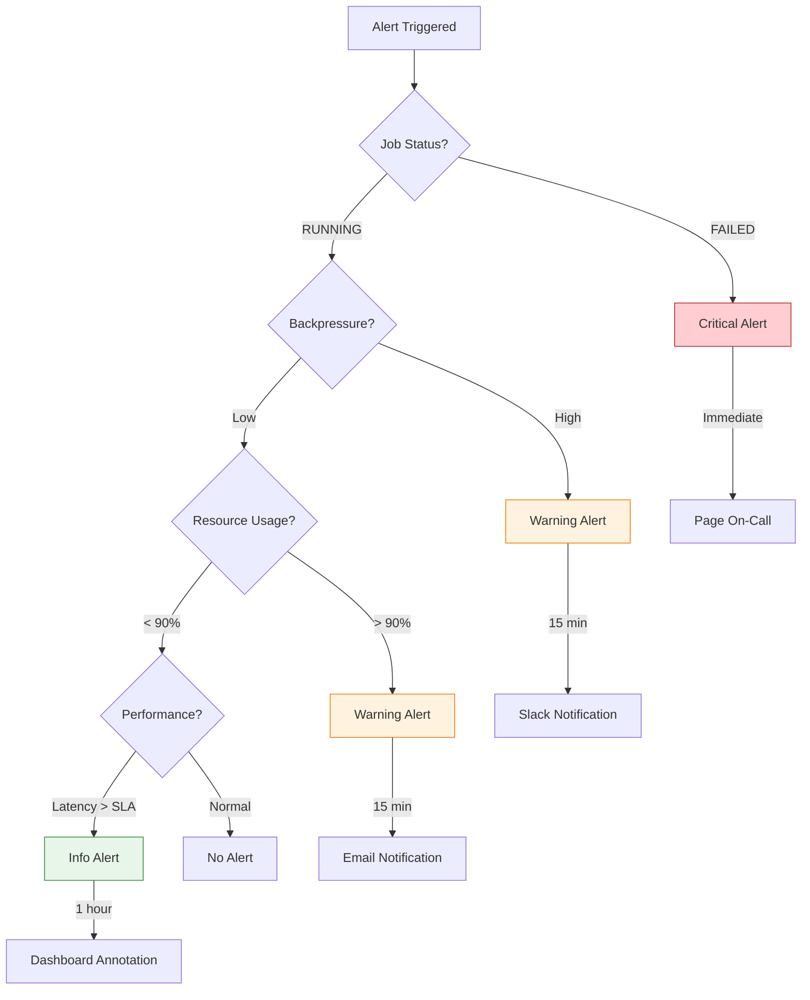

# Monitoring and Observability in Stream Processing

> **Unit**: formal-methods/04-application-layer/02-stream-processing | **Prerequisites**: [06-fault-tolerance](06-fault-tolerance.md), [08-backpressure](08-backpressure.md) | **Formalization Level**: L3-L4

## 1. Concept Definitions (Definitions)

### Def-A-02-35: Observability

**Observability** is the ability to infer internal system state from external outputs:

$$\text{Observability}(\mathcal{S}) = \{o \in \text{Outputs} \mid \text{State}(\mathcal{S}) \xrightarrow{\text{infer}} o\}$$

A system is **fully observable** if:

$$\forall s_1, s_2 \in \text{States}: s_1 \neq s_2 \Rightarrow \text{Obs}(s_1) \neq \text{Obs}(s_2)$$

### Def-A-02-36: Monitoring Pillars

**Three Pillars of Observability** [^1]:

| Pillar | Definition | Granularity | Retention |
|--------|-----------|-------------|-----------|
| **Metrics** | Time-series numerical data | Aggregated | Long-term |
| **Logs** | Discrete event records | Per-event | Medium-term |
| **Traces** | Request flow through system | Distributed | Short-term |

**Formal Representation**:

$$\text{Observability}_{\text{system}} = \text{Metrics} \times \text{Logs} \times \text{Traces}$$

### Def-A-02-37: Service Level Objectives

**Service Level Objective (SLO)**: Target reliability metric over time window:

$$\text{SLO}: (\text{Metric}, \text{Target}, \text{Window}, \text{Threshold})$$

**Service Level Indicator (SLI)**: Measured metric value:

$$\text{SLI}(t) = \frac{\text{Good Events}(t)}{\text{Total Events}(t)}$$

**Error Budget**: Acceptable unavailability within window:

$$\text{Error Budget} = 1 - \text{SLO}_{\text{target}}$$

### Def-A-02-38: Alerting Semantics

**Alert Rule**:

$$\text{Alert} = (\text{Condition}, \text{Duration}, \text{Severity}, \text{Action})$$

**Alert State Machine**:

```
[PENDING] --condition met for duration--> [FIRING]
[FIRING] --condition resolved--> [RESOLVED]
[PENDING] --condition not met--> [IDLE]
```

**Severity Levels**:

| Level | Response Time | Example |
|-------|--------------|---------|
| P0 (Critical) | Immediate | Complete outage |
| P1 (High) | 15 minutes | Performance degradation |
| P2 (Medium) | 1 hour | Resource exhaustion warning |
| P3 (Low) | 24 hours | Optimization opportunity |

## 2. Property Derivation (Properties)

### Lemma-A-02-35: Metric Cardinality vs. Cost

For metric with dimensions $D = \{d_1, d_2, ..., d_n\}$:

$$\text{Cardinality} = \prod_{i=1}^{n} |d_i|$$

**Storage Cost**:

$$\text{Cost} \propto \text{Cardinality} \times \text{Scrape Frequency} \times \text{Retention}$$

**Cardinality Limits** [^2]:

| System | Max Cardinality | Max Labels |
|--------|----------------|------------|
| Prometheus | ~1M series | 30 |
| InfluxDB | ~10M series | 200 |
| Custom TSDB | Configurable | Unlimited |

### Lemma-A-02-36: Alert Fatigue Threshold

**Alert Fatigue Point**: When false positive rate exceeds tolerance:

$$\text{Fatigue} \iff \frac{\text{False Positives}}{\text{Total Alerts}} > 0.2$$

**Alert Quality Metrics**:

- **Precision**: $\frac{\text{True Positives}}{\text{True Positives} + \text{False Positives}}$
- **Recall**: $\frac{\text{True Positives}}{\text{True Positives} + \text{False Negatives}}$
- **F1 Score**: $2 \cdot \frac{\text{Precision} \cdot \text{Recall}}{\text{Precision} + \text{Recall}}$

### Prop-A-02-35: Four Golden Signals

For any service, monitor [^3]:

| Signal | Metric | Formula |
|--------|--------|---------|
| **Latency** | Response time | $P_{50}, P_{99}, P_{99.9}$ |
| **Traffic** | Request rate | $\frac{\Delta \text{Requests}}{\Delta t}$ |
| **Errors** | Error rate | $\frac{\text{Errors}}{\text{Total Requests}}$ |
| **Saturation** | Resource utilization | $\frac{\text{Used}}{\text{Capacity}}$ |

### Prop-A-02-36: Correlation Between Metrics

**Metric Correlation Coefficient**:

$$\rho(X, Y) = \frac{\text{Cov}(X, Y)}{\sigma_X \sigma_Y}$$

**Common Correlations in Flink**:

| Metric Pair | Correlation | Interpretation |
|-------------|-------------|----------------|
| Backpressure ~ Latency | $> 0.8$ | Backpressure causes latency |
| CPU ~ Throughput | $0.5-0.8$ | CPU bound processing |
| GC ~ Latency | $> 0.6$ | GC pauses affect latency |
| Memory ~ Checkpoint Duration | $> 0.7$ | Large state increases checkpoint time |

## 3. Relations Establishment (Relations)

### 3.1 Monitoring Architecture



### 3.2 Alert Routing Matrix

| Alert Type | Severity | Team | Escalation |
|------------|----------|------|------------|
| Job failure | P0 | Platform | Immediate |
| Checkpoint failure | P0 | Platform | Immediate |
| High backpressure | P1 | Application | 15 min |
| Resource exhaustion | P1 | Platform | 15 min |
| Slow query | P2 | Application | 1 hour |
| Optimization opportunity | P3 | Application | 24 hours |

## 4. Argumentation Process (Argumentation)

### 4.1 Why Monitoring is Essential

**Without Monitoring**:

```
User reports: "The dashboard shows old data"

Engineer response:
1. Check job status: Not running
2. Check logs: OOM 3 hours ago
3. Recovery time: 2 hours
4. Data loss: 3 hours

MTTR: 5+ hours
```

**With Monitoring**:

```
Alert fires: "Flink job failed with OOM"

Engineer response:
1. Receive alert immediately
2. Auto-restart triggered
3. Manual intervention: Review memory config
4. Recovery time: 10 minutes

MTTR: 15 minutes
```

### 4.2 Metric Selection Criteria

**USE Method** (Brendan Gregg) [^4]:

For every resource, check:

- **U**tilization: Percentage of time busy
- **S**aturation: Queue length / work queued
- **E**rrors: Count of error events

**RED Method** (Tom Wilkie):

For every service, check:

- **R**ate: Requests per second
- **E**rrors: Number of failed requests
- **D**uration: Time to process requests

## 5. Formal Proof / Engineering Argument

### 5.1 Flink Metrics System

```scala
// Custom metric registration
class MonitoredFunction extends RichMapFunction[Event, Result] {

  @transient private var processingTime: Histogram = _
  @transient private var throughput: Meter = _
  @transient private var errorCounter: Counter = _
  @transient private var activeRequests: Gauge[Int] = _

  private var currentActive = 0

  override def open(parameters: Configuration): Unit = {
    val metricGroup = getRuntimeContext.getMetricGroup

    // Counter
    errorCounter = metricGroup.counter("errors")

    // Meter (events per second)
    throughput = metricGroup.meter("throughput", new Meter())

    // Histogram (latency distribution)
    processingTime = metricGroup.histogram(
      "processingTimeMs",
      new DropwizardHistogramWrapper(
        new com.codahale.metrics.Histogram(
          new ExponentiallyDecayingReservoir()
        )
      )
    )

    // Gauge (current value)
    activeRequests = metricGroup.gauge[Int, ScalaGauge[Int]](
      "activeRequests",
      ScalaGauge[Int](() => currentActive)
    )
  }

  override def map(event: Event): Result = {
    val start = System.currentTimeMillis()
    currentActive += 1

    try {
      val result = process(event)
      throughput.markEvent()
      result
    } catch {
      case e: Exception =>
        errorCounter.inc()
        throw e
    } finally {
      val duration = System.currentTimeMillis() - start
      processingTime.update(duration)
      currentActive -= 1
    }
  }
}
```

### 5.2 Prometheus Integration

```yaml
# Prometheus scrape configuration
scrape_configs:
  - job_name: 'flink-jobmanager'
    static_configs:
      - targets: ['flink-jobmanager:9249']
    metrics_path: /metrics
    scrape_interval: 15s

  - job_name: 'flink-taskmanager'
    static_configs:
      - targets: ['flink-taskmanager-0:9249', 'flink-taskmanager-1:9249']
    metrics_path: /metrics
    scrape_interval: 15s

# Recording rules for aggregation
groups:
  - name: flink_aggregation
    rules:
      - record: flink:job_throughput:rate5m
        expr: |
          sum by (job_name) (
            rate(flink_taskmanager_job_task_numRecordsInPerSecond[5m])
          )

      - record: flink:checkpoint_success_rate:ratio
        expr: |
          sum by (job_name) (
            flink_jobmanager_checkpoint_numberOfCompletedCheckpoints
          ) /
          sum by (job_name) (
            flink_jobmanager_checkpoint_numberOfCompletedCheckpoints +
            flink_jobmanager_checkpoint_numberOfFailedCheckpoints
          )
```

### 5.3 Comprehensive Alerting Rules

```yaml
groups:
  - name: flink_critical
    rules:
      # P0: Job failure
      - alert: FlinkJobFailed
        expr: flink_jobmanager_job_status{status="FAILED"} == 1
        for: 0m
        labels:
          severity: critical
          team: platform
        annotations:
          summary: "Flink job {{ $labels.job_name }} has failed"
          runbook_url: "https://wiki/runbooks/flink-job-failure"

      # P0: Checkpoint failure
      - alert: FlinkCheckpointFailing
        expr: |
          increase(flink_jobmanager_checkpoint_numberOfFailedCheckpoints[10m]) > 3
        for: 5m
        labels:
          severity: critical
          team: platform
        annotations:
          summary: "Flink job {{ $labels.job_name }} checkpoint failing"

      # P1: High backpressure
      - alert: FlinkHighBackpressure
        expr: |
          flink_taskmanager_job_task_backPressuredTimeMsPerSecond > 200
        for: 5m
        labels:
          severity: warning
          team: application
        annotations:
          summary: "Task {{ $labels.task_name }} experiencing high backpressure"

      # P1: Data skew
      - alert: FlinkDataSkew
        expr: |
          (
            max by (task_name) (flink_taskmanager_job_task_numRecordsInPerSecond) /
            min by (task_name) (flink_taskmanager_job_task_numRecordsInPerSecond)
          ) > 5
        for: 10m
        labels:
          severity: warning
          team: application
        annotations:
          summary: "Data skew detected in task {{ $labels.task_name }}"

      # P1: Memory pressure
      - alert: FlinkMemoryPressure
        expr: |
          flink_taskmanager_Status_JVM_Memory_Heap_Used /
          flink_taskmanager_Status_JVM_Memory_Heap_Committed > 0.85
        for: 5m
        labels:
          severity: warning
          team: platform
        annotations:
          summary: "TaskManager memory pressure"

      # P2: GC overhead
      - alert: FlinkHighGCOverhead
        expr: |
          rate(flink_taskmanager_Status_JVM_GarbageCollector_G1_Young_Generation_Time[5m]) /
          5 * 100 > 10
        for: 10m
        labels:
          severity: info
          team: application
        annotations:
          summary: "High GC overhead detected"
```

### 5.4 Distributed Tracing Integration

```scala
// OpenTelemetry tracing for Flink
class TracedFunction extends RichMapFunction[Event, Result] {

  @transient private var tracer: Tracer = _

  override def open(parameters: Configuration): Unit = {
    val openTelemetry = OpenTelemetrySdk.builder()
      .setTracerProvider(
        SdkTracerProvider.builder()
          .addSpanProcessor(
            BatchSpanProcessor.builder(
              JaegerGrpcSpanExporter.builder()
                .setEndpoint("http://jaeger:14250")
                .build()
            ).build()
          )
          .build()
      )
      .build()

    tracer = openTelemetry.getTracer("flink-job")
  }

  override def map(event: Event): Result = {
    val span = tracer.spanBuilder("process-event")
      .setAttribute("event.id", event.id)
      .setAttribute("event.type", event.eventType)
      .startSpan()

    try {
      val scope = span.makeCurrent()

      // Add processing details
      span.addEvent("validation-start")
      validate(event)
      span.addEvent("validation-complete")

      span.addEvent("transformation-start")
      val result = transform(event)
      span.addEvent("transformation-complete")

      span.setStatus(StatusCode.OK)
      result
    } catch {
      case e: Exception =>
        span.recordException(e)
        span.setStatus(StatusCode.ERROR, e.getMessage)
        throw e
    } finally {
      span.end()
    }
  }
}
```

### 5.5 Log Aggregation Configuration

```yaml
# Fluent Bit configuration for Flink logs
fluent-bit.conf: |
  [INPUT]
      Name              tail
      Path              /opt/flink/log/flink-*.log
      Parser            flink_multiline
      Tag               flink.*
      Refresh_Interval  5

  [FILTER]
      Name              grep
      Match             flink.*
      Regex             level ERROR|WARN|INFO

  [FILTER]
      Name              modify
      Match             flink.*
      Add               cluster production
      Add               environment flink

  [FILTER]
      Name              kubernetes
      Match             flink.*
      Kube_URL          https://kubernetes.default.svc:443
      Kube_CA_File      /var/run/secrets/kubernetes.io/serviceaccount/ca.crt
      Kube_Token_File   /var/run/secrets/kubernetes.io/serviceaccount/token

  [OUTPUT]
      Name              es
      Match             flink.*
      Host              elasticsearch
      Port              9200
      Index             flink-logs-%Y.%m.%d
      Type              _doc
      Logstash_Format   On
      Logstash_Prefix   flink

# Log parsing rules
parsers.conf: |
  [MULTILINE_PARSER]
      name          flink_multiline
      type          regex
      flush_timeout 1000
      rule          "start_state"   "^(\d{4}-\d{2}-\d{2}\s\d{2}:\d{2}:\d{2},\d{3})"  "cont"
      rule          "cont"          "^\s+at.*"  "cont"
      rule          "cont"          "^\s+...\s\d+\smore"  "cont"
```

### 5.6 Custom Dashboard Configuration

```json
{
  "dashboard": {
    "title": "Flink Job Overview",
    "panels": [
      {
        "title": "Throughput (records/s)",
        "type": "graph",
        "targets": [
          {
            "expr": "sum(rate(flink_taskmanager_job_task_numRecordsInPerSecond[1m])) by (job_name)",
            "legendFormat": "{{job_name}} - Input"
          },
          {
            "expr": "sum(rate(flink_taskmanager_job_task_numRecordsOutPerSecond[1m])) by (job_name)",
            "legendFormat": "{{job_name}} - Output"
          }
        ]
      },
      {
        "title": "Checkpoint Metrics",
        "type": "graph",
        "targets": [
          {
            "expr": "flink_jobmanager_checkpoint_duration",
            "legendFormat": "Duration"
          },
          {
            "expr": "flink_jobmanager_checkpoint_size",
            "legendFormat": "Size"
          }
        ]
      },
      {
        "title": "Backpressure Heatmap",
        "type": "heatmap",
        "targets": [
          {
            "expr": "flink_taskmanager_job_task_backPressuredTimeMsPerSecond",
            "legendFormat": "{{task_name}}"
          }
        ],
        "color": {
          "mode": "spectrum",
          "cardColor": "red",
          "colorScale": "sqrt"
        }
      },
      {
        "title": "JVM Memory",
        "type": "gauge",
        "targets": [
          {
            "expr": "flink_taskmanager_Status_JVM_Memory_Heap_Used / flink_taskmanager_Status_JVM_Memory_Heap_Committed * 100"
          }
        ],
        "fieldConfig": {
          "defaults": {
            "min": 0,
            "max": 100,
            "thresholds": {
              "steps": [
                {"color": "green", "value": 0},
                {"color": "yellow", "value": 70},
                {"color": "red", "value": 85}
              ]
            }
          }
        }
      }
    ]
  }
}
```

## 6. Example Verification (Examples)

### 6.1 End-to-End Monitoring Setup

```scala
// Complete monitoring setup for Flink job
object MonitoringSetup {

  def setupMetricsReporter(env: StreamExecutionEnvironment): Unit = {
    // Enable Prometheus reporter
    env.getConfig.setGlobalJobParameters(
      new Configuration() {{
        setString("metrics.reporter.prom.class", "org.apache.flink.metrics.prometheus.PrometheusReporter")
        setString("metrics.reporter.prom.port", "9249")
        setString("metrics.reporters", "prom")
      }}
    )
  }

  def createMonitoredJob(env: StreamExecutionEnvironment): Unit = {
    setupMetricsReporter(env)

    val stream = env
      .addSource(new KafkaSource[Event]())
      .name("Kafka Source")
      .uid("kafka-source")

    val processed = stream
      .map(new MonitoredFunction())
      .name("Event Processor")
      .uid("event-processor")

    processed
      .addSink(new MonitoredSink())
      .name("Result Sink")
      .uid("result-sink")

    env.execute("Monitored Flink Job")
  }
}
```

### 6.2 Alert Verification Test

```scala
// Test alerting rules
class AlertVerificationTest {

  test("Checkpoint failure should trigger critical alert") {
    // Simulate checkpoint failures
    val checkpointMetrics = simulateCheckpointFailures(
      failureRate = 0.5,
      duration = 15.minutes
    )

    // Evaluate alert rule
    val alertResult = evaluateAlertRule(
      rule = checkpointFailingRule,
      metrics = checkpointMetrics
    )

    alertResult.fired shouldBe true
    alertResult.severity shouldBe "critical"
  }

  test("Backpressure should trigger warning after 5 minutes") {
    // Simulate backpressure
    val backpressureMetrics = simulateBackpressure(
      backpressureTimeMs = 300,
      duration = 10.minutes
    )

    val alertResult = evaluateAlertRule(
      rule = highBackpressureRule,
      metrics = backpressureMetrics
    )

    alertResult.fired shouldBe true
    alertResult.severity shouldBe "warning"
  }
}
```

## 7. Visualizations (Visualizations)

### 7.1 Observability Architecture



### 7.2 Alert Severity Decision Tree



## 8. References (References)

[^1]: Beyer, B. et al., "Site Reliability Engineering," O'Reilly Media, 2016. <https://sre.google/sre-book/table-of-contents/>

[^2]: Apache Flink Documentation, "Metrics," 2025. <https://nightlies.apache.org/flink/flink-docs-stable/docs/ops/metrics/>

[^3]: R. Blank-Edelman, "Monitoring and Observability," *SRE Workbook*, 2018.

[^4]: B. Gregg, "Systems Performance: Enterprise and the Cloud," 2nd Edition, Addison-Wesley, 2020.

---

*Document Version: v1.0 | Last Updated: 2026-04-10 | Status: Complete*
