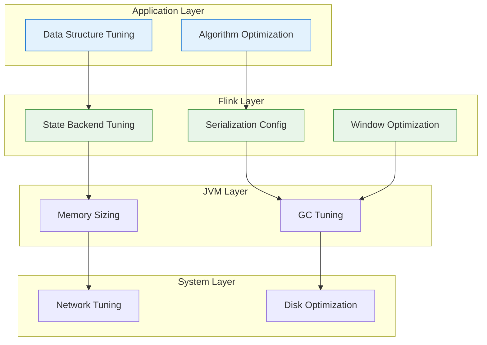
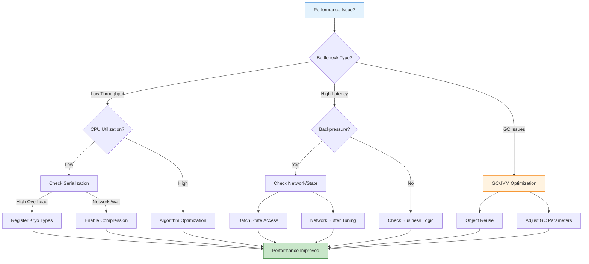
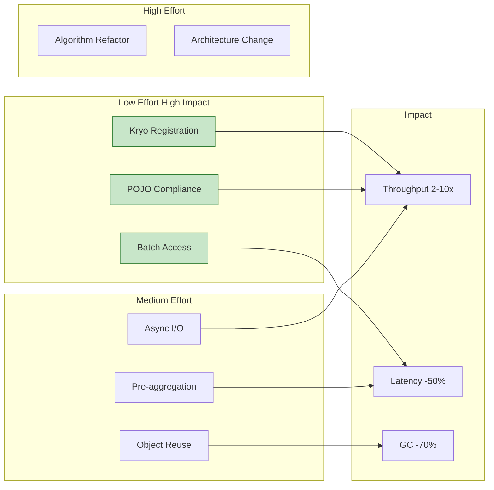

# Performance Tuning for Stream Processing Systems

> **Unit**: formal-methods/04-application-layer/02-stream-processing | **Prerequisites**: [08-backpressure](08-backpressure.md), [09-monitoring](09-monitoring.md) | **Formalization Level**: L4-L5

## 1. Concept Definitions (Definitions)

### Def-A-02-40: Performance Metrics

**Key Performance Indicators (KPIs)** for stream processing:

| Metric | Symbol | Definition | Unit |
|--------|--------|-----------|------|
| **Throughput** | $\lambda$ | Records processed per unit time | records/s |
| **Latency** | $L$ | Time from input to output | ms |
| **Backpressure Ratio** | $R_{bp}$ | Time in backpressure / total time | % |
| **CPU Utilization** | $U_{cpu}$ | CPU time / wall time | % |
| **Memory Efficiency** | $E_{mem}$ | Useful memory / total memory | % |

### Def-A-02-41: Latency Components

**End-to-End Latency** decomposes into:

$$L_{total} = L_{source} + L_{queue} + L_{process} + L_{serialize} + L_{network} + L_{sink}$$

Where:

- $L_{source}$: Source ingestion latency
- $L_{queue}$: Buffer queueing latency
- $L_{process}$: Computation latency
- $L_{serialize}$: Serialization/deserialization latency
- $L_{network}$: Data transmission latency
- $L_{sink}$: External system write latency

### Def-A-02-42: Throughput Model

**Maximum Theoretical Throughput**:

$$\lambda_{max} = \frac{P}{\bar{T}_{process}}$$

Where $P$ is parallelism and $\bar{T}_{process}$ is average processing time per record.

**Achievable Throughput**:

$$\lambda_{actual} = \lambda_{max} \times (1 - U_{overhead}) \times (1 - R_{bp})$$

Where $U_{overhead}$ accounts for serialization, GC, and coordination overhead.

### Def-A-02-43: Bottleneck Classification

**Bottleneck Types**:

| Type | Indicator | Root Cause |
|------|-----------|------------|
| **CPU-bound** | $U_{cpu} > 80\%$ | Complex computation, frequent GC |
| **I/O-bound** | High I/O wait | Network latency, disk access |
| **Memory-bound** | High memory usage, OOM | Large state, insufficient heap |
| **External-bound** | Sink backpressure | Slow external systems |
| **Data-skew** | Uneven subtask load | Hot keys, uneven partition |

### Def-A-02-44: Optimization Dimensions

**Optimization Hierarchy**:

$$\text{Performance} = f(\text{Algorithm}, \text{Configuration}, \text{Resources}, \text{Data Characteristics})$$

| Level | Optimization Target | Typical Impact |
|-------|-------------------|----------------|
| Application | Business logic, algorithms | 10-100x |
| Framework | Flink configuration | 2-10x |
| JVM | GC, memory settings | 1.5-3x |
| System | Network, disk | 1.2-2x |

## 2. Property Derivation (Properties)

### Lemma-A-02-40: Serialization Overhead

Serialization cost as fraction of total processing time:

$$S = \frac{T_{serialize}}{T_{total}}$$

**Optimized Throughput**:

$$\lambda_{optimized} = \frac{\lambda_{original}}{1 - S \times (1 - \frac{1}{k})}$$

Where $k$ is the optimization factor (Kryo typically 5-10x).

**Typical Values** [^1]:

| Object Complexity | Default (μs) | Kryo Optimized (μs) | Speedup |
|-------------------|--------------|---------------------|---------|
| Simple POJO | 5 | 1 | 5x |
| Nested Object | 25 | 3 | 8x |
| Collection | 100 | 10 | 10x |

### Lemma-A-02-41: State Access Locality

**Batch State Access Advantage**:

$$\frac{T_{batch}}{T_{single}} = \frac{1}{n} + \frac{T_{access}}{T_{total}}$$

For $n$ records batched together, overhead per record decreases significantly.

**RocksDB Access Breakdown**:

| Operation | Latency | Optimization |
|-----------|---------|--------------|
| JNI call | 50-100ns | Batch operations |
| Memory lookup | 1-5μs | Local caching |
| Disk read | 10-100μs | SSD, compaction tuning |

### Prop-A-02-40: Parallelism Sweet Spot

**Optimal Parallelism**:

$$P^* = \arg\max_P \min(\lambda_{source}, \frac{P}{T_{process}}, \lambda_{sink})$$

**Diminishing Returns**:

$$\frac{\partial \lambda}{\partial P} \propto \frac{1}{P} \text{ as } P \to \infty$$

Beyond optimal point, coordination overhead dominates.

### Prop-A-02-41: Memory-Throughput Tradeoff

**Heap Size vs. GC Impact**:

| Heap Size | GC Frequency | GC Pause | Throughput Impact |
|-----------|--------------|----------|-------------------|
| Small (< 2GB) | High | Short | Moderate |
| Medium (2-8GB) | Medium | Medium | Low |
| Large (> 8GB) | Low | Long | Moderate-High |

**G1 GC Target**:

$$T_{pause}^{target} = 100ms \text{ (default)}$$

$$T_{pause}^{actual} \leq T_{pause}^{target} \times (1 + \epsilon)$$

## 3. Relations Establishment (Relations)

### 3.1 Performance Tuning Decision Matrix

| Symptom | Diagnostic | Solution | Impact |
|---------|-----------|----------|--------|
| Low throughput, low CPU | Serialization overhead | Register Kryo types | 3-10x |
| High backpressure | Slow sink | Async I/O | 5-20x |
| Data skew | Uneven record counts | Key rebalancing | 2-5x |
| High GC | GC logs > 10% | Tune GC, reduce allocation | 1.5-2x |
| High latency | Network wait | Co-location, compression | 1.5-3x |

### 3.2 Optimization Dependencies



## 4. Argumentation Process (Argumentation)

### 4.1 Performance Tuning Methodology

**The USE Method** [^2]:

1. **U**tilization: Check if resources are fully used
2. **S**aturation: Check if queues are building up
3. **E**rrors: Check for failures or timeouts

**The RED Method**:

1. **R**ate: Measure request throughput
2. **E**rrors: Track error rates
3. **D**uration: Monitor response times

### 4.2 Optimization ROI Analysis

| Optimization | Effort | Impact | Priority |
|--------------|--------|--------|----------|
| Kryo registration | Low | High | P0 |
| Async I/O | Low-Medium | High | P0 |
| Parallelism tuning | Medium | Medium | P1 |
| GC tuning | Medium | Medium | P1 |
| Algorithm optimization | High | Very High | P2 |

## 5. Formal Proof / Engineering Argument

### 5.1 Serialization Optimization

**Kryo Type Registration**:

```scala
// Register Kryo types for optimal serialization
val env = StreamExecutionEnvironment.getExecutionEnvironment
val conf = env.getConfig

// Register types in dependency order
conf.registerKryoType(classOf[UserEvent])
conf.registerKryoType(classOf[UserProfile])
conf.registerKryoType(classOf[ImmutableList[_]])
conf.registerKryoType(classOf[Array[UserEvent]])

// Disable generic types, use concrete types
conf.disableGenericTypes()

// Add custom serializers for complex types
conf.addDefaultKryoSerializer(
  classOf[ComplexType],
  classOf[ComplexTypeSerializer]
)
```

**POJO Compliance**:

```java
// ✅ Recommended: Flink POJO compliant class
public class OptimizedEvent {
    // 1. Public no-arg constructor
    public OptimizedEvent() {}

    // 2. All fields public or with getters/setters
    private String userId;
    private long timestamp;
    private double value;

    public String getUserId() { return userId; }
    public void setUserId(String userId) { this.userId = userId; }

    public long getTimestamp() { return timestamp; }
    public void setTimestamp(long timestamp) { this.timestamp = timestamp; }

    public double getValue() { return value; }
    public void setValue(double value) { this.value = value; }
}

// ❌ Avoid: Complex structures with type erasure
public class BadEvent {
    private Map<String, Object> dynamicFields;  // Type erasure
    private Optional<String> optionalField;     // Optional wrapper
}
```

**Object Reuse Pattern**:

```scala
// Reuse output objects to reduce GC
class ReuseObjectFunction extends RichMapFunction[Input, Output] {
  private var reusedOutput: Output = _

  override def open(parameters: Configuration): Unit = {
    reusedOutput = new Output()
  }

  override def map(input: Input): Output = {
    reusedOutput.reset()
    reusedOutput.setField1(input.getField1)
    reusedOutput.setField2(compute(input))
    reusedOutput
  }
}
```

### 5.2 State Access Optimization

**Batch State Access**:

```scala
// ❌ Avoid: Individual state access
class BadWindowFunction extends ProcessWindowFunction[Event, Result, String, TimeWindow] {
  override def process(
    key: String,
    ctx: Context,
    elements: Iterable[Event],
    out: Collector[Result]
  ): Unit = {
    elements.foreach { e =>
      val state = userState.value()  // JNI call per element!
      // ...
    }
  }
}

// ✅ Recommended: Batch aggregation before state access
class OptimizedWindowFunction extends ProcessWindowFunction[Event, Result, String, TimeWindow] {
  override def process(
    key: String,
    ctx: Context,
    elements: Iterable[Event],
    out: Collector[Result]
  ): Unit = {
    // 1. Local aggregation
    val (sum, count) = elements.foldLeft((0.0, 0L)) {
      case ((s, c), e) => (s + e.value, c + 1)
    }

    // 2. Single state access
    val current = userState.value() match {
      case null => UserStats(sum, count)
      case s => s.add(sum, count)
    }

    // 3. Update state
    userState.update(current)
    out.collect(Result(key, current))
  }
}
```

**Pre-aggregation with AggregateFunction**:

```scala
// Incremental aggregation reduces state access
stream
  .keyBy(_.userId)
  .window(TumblingEventTimeWindows.of(Time.minutes(1)))
  .aggregate(
    new SumAggregate,  // Incremental aggregation
    new OutputProcessFunction  // Only output access to state
  )

class SumAggregate extends AggregateFunction[Event, Double, Double] {
  override def createAccumulator(): Double = 0.0

  override def add(value: Event, accumulator: Double): Double =
    accumulator + value.amount

  override def getResult(accumulator: Double): Double = accumulator

  override def merge(a: Double, b: Double): Double = a + b
}
```

### 5.3 Network Optimization

**Network Buffer Configuration**:

```yaml
# flink-conf.yaml - Network optimization for high throughput

# Buffer size (default: 32KB, increase for high-throughput)
taskmanager.memory.network.buffer-size: 65536  # 64KB

# Network memory allocation
taskmanager.memory.network.min: 512mb
taskmanager.memory.network.max: 2gb
taskmanager.memory.network.fraction: 0.2

# Buffers per channel - increase for high parallelism
taskmanager.network.memory.network-buffers-per-channel: 16
taskmanager.network.memory.floating-buffers-per-gate: 32

# Compression for cross-DC networks
taskmanager.network.memory.buffer-debloat.enabled: true
taskmanager.network.memory.buffer-debloat.target: 1000
```

**Data Locality Optimization**:

```scala
// Reduce data shuffle
stream
  .filter(_.isValid)  // Filter before keyBy
  .keyBy(_.userId)
  .window(TumblingEventTimeWindows.of(Time.minutes(1)))
  .aggregate(new CountAggregate)

// Avoid unnecessary keyBy transformations
// ❌ Avoid: Multiple keyBy
stream
  .keyBy(_.userId)
  .process(...)
  .keyBy(_.category)  // Unnecessary shuffle

// ✅ Recommended: Keep key consistent or use broadcast
val keyed = stream.keyBy(_.userId)
keyed.process(...)
keyed.process(...)  // Same keyed stream, no shuffle
```

### 5.4 JVM and GC Tuning

**G1 GC Configuration**:

```bash
# Recommended JVM options for Flink

# G1 Garbage Collector
-XX:+UseG1GC
-XX:MaxGCPauseMillis=100
-XX:G1HeapRegionSize=16m

# Heap sizing
-Xms8g  # Initial heap
-Xmx8g  # Maximum heap (same as initial to avoid resizing)

# GC logging
-Xlog:gc*:file=/opt/flink/log/gc.log:time,uptime:filecount=5,filesize=100m

# Large pages for big heaps (> 32GB)
-XX:+UseLargePages
-XX:LargePageSizeInBytes=2m

# Off-heap settings
-XX:MaxDirectMemorySize=1g
```

**Memory Configuration by Workload**:

```yaml
# flink-conf.yaml - Memory tuning

# 1. High throughput, small state
taskmanager.memory.process.size: 4gb
taskmanager.memory.managed.fraction: 0.2
taskmanager.memory.jvm-heap.fraction: 0.6

# 2. Large state, low latency
taskmanager.memory.process.size: 32gb
taskmanager.memory.managed.fraction: 0.6
taskmanager.memory.jvm-heap.fraction: 0.3

# 3. Balanced workload
taskmanager.memory.process.size: 16gb
taskmanager.memory.managed.fraction: 0.4
taskmanager.memory.jvm-heap.fraction: 0.4
```

### 5.5 Async I/O for External Calls

```scala
// Async I/O for non-blocking external calls
class AsyncEnrichment extends AsyncFunction[Event, EnrichedEvent] {

  @transient private var httpClient: AsyncHttpClient = _

  override def open(parameters: Configuration): Unit = {
    httpClient = Dsl.asyncHttpClient()
  }

  override def asyncInvoke(
    event: Event,
    resultFuture: ResultFuture[EnrichedEvent]
  ): Unit = {
    httpClient
      .prepareGet(s"http://api/user/${event.userId}")
      .execute()
      .toCompletableFuture
      .thenAccept(response => {
        val enriched = EnrichedEvent(
          event,
          userInfo = parse(response.getResponseBody)
        )
        resultFuture.complete(Collections.singleton(enriched))
      })
  }
}

// Usage with timeout and capacity
val enriched = AsyncDataStream.unorderedWait(
  inputStream,
  new AsyncEnrichment(),
  timeout = 1000,      // 1 second timeout
  TimeUnit.MILLISECONDS,
  capacity = 100       // Max 100 concurrent requests
)
```

### 5.6 Parallelism Tuning

**Optimal Parallelism Formula**:

```scala
// Calculate optimal parallelism based on throughput requirements
object ParallelismCalculator {

  def calculate(
    targetThroughput: Long,     // records/s
    processingTimePerRecord: Double,  // ms
    maxParallelism: Int = 100
  ): Int = {

    // Records per task per second
    val recordsPerTask = 1000.0 / processingTimePerRecord

    // Required parallelism
    val requiredParallelism = math.ceil(
      targetThroughput / recordsPerTask
    ).toInt

    // Clamp to reasonable bounds
    math.min(
      math.max(requiredParallelism, 1),
      maxParallelism
    )
  }
}

// Dynamic scaling configuration
env.setParallelism(4)  // Default parallelism

// Per-operator parallelism
val source = env
  .addSource(new KafkaSource())
  .setParallelism(8)  // Match Kafka partitions

val processed = source
  .map(new CPUIntensiveFunction())
  .setParallelism(16)  // Scale up for computation

processed
  .addSink(new SlowSink())
  .setParallelism(4)   // Match sink capacity
```

## 6. Example Verification (Examples)

### 6.1 Performance Optimization Case Study

**Scenario**: E-commerce real-time risk control system

**Initial State**:

- Throughput: 20K events/s (target: 100K)
- P99 latency: 2.5s (target: < 500ms)
- GC overhead: > 15% CPU time

**Optimization Process**:

| Optimization | Before | After | Improvement |
|--------------|--------|-------|-------------|
| Kryo registration | Not registered | 50 types | +150% throughput |
| Object reuse | Object creation | Reuse output | -70% GC |
| Batch state access | Individual access | Batch in window | -60% latency |
| RocksDB tuning | Default | Memory cache enabled | -40% state access |
| Async I/O | Sync HTTP | Async CompletableFuture | +300% throughput |

**Final Results**:

- Throughput: 120K events/s
- P99 latency: 180ms
- GC: < 3% CPU time

### 6.2 Performance Test Harness

```scala
// Performance testing framework
class PerformanceTestHarness {

  def runBenchmark(
    job: StreamExecutionEnvironment => Unit,
    duration: Duration = 5.minutes,
    warmup: Duration = 1.minute
  ): BenchmarkResult = {

    val env = StreamExecutionEnvironment.getExecutionEnvironment

    // Configure for measurement
    env.enableCheckpointing(60000)

    // Build job
    job(env)

    // Execute with metrics collection
    val jobClient = env.executeAsync()

    // Warmup period
    Thread.sleep(warmup.toMillis)

    // Collect metrics during measurement period
    val metrics = collectMetrics(jobClient, duration)

    jobClient.cancel()

    BenchmarkResult(
      throughput = metrics.throughput,
      latencyP50 = metrics.latencyP50,
      latencyP99 = metrics.latencyP99,
      cpuUtilization = metrics.cpuUtilization,
      gcOverhead = metrics.gcOverhead
    )
  }

  def compare(
    baseline: StreamExecutionEnvironment => Unit,
    optimized: StreamExecutionEnvironment => Unit
  ): ComparisonResult = {

    val baselineResult = runBenchmark(baseline)
    val optimizedResult = runBenchmark(optimized)

    ComparisonResult(
      throughputImprovement =
        (optimizedResult.throughput - baselineResult.throughput) /
        baselineResult.throughput * 100,
      latencyImprovement =
        (baselineResult.latencyP99 - optimizedResult.latencyP99) /
        baselineResult.latencyP99 * 100
    )
  }
}
```

## 7. Visualizations (Visualizations)

### 7.1 Performance Tuning Decision Tree



### 7.2 Optimization Impact Matrix



## 8. References (References)

[^1]: Apache Flink Documentation, "Performance Tuning," 2025. <https://nightlies.apache.org/flink/flink-docs-stable/docs/ops/performance/tuning/>

[^2]: Apache Flink Documentation, "Serialization Tuning," 2025. <https://nightlies.apache.org/flink/flink-docs-stable/docs/dev/datastream/fault-tolerance/serialization/>


---

*Document Version: v1.0 | Last Updated: 2026-04-10 | Status: Complete*
