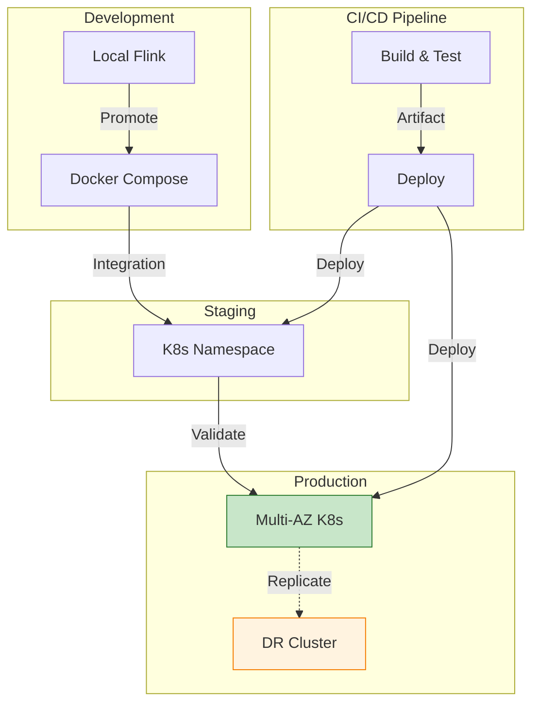
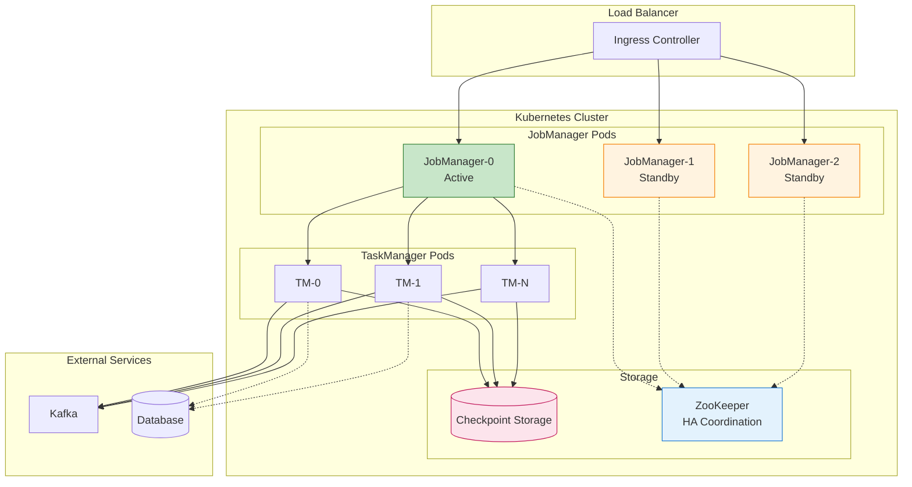
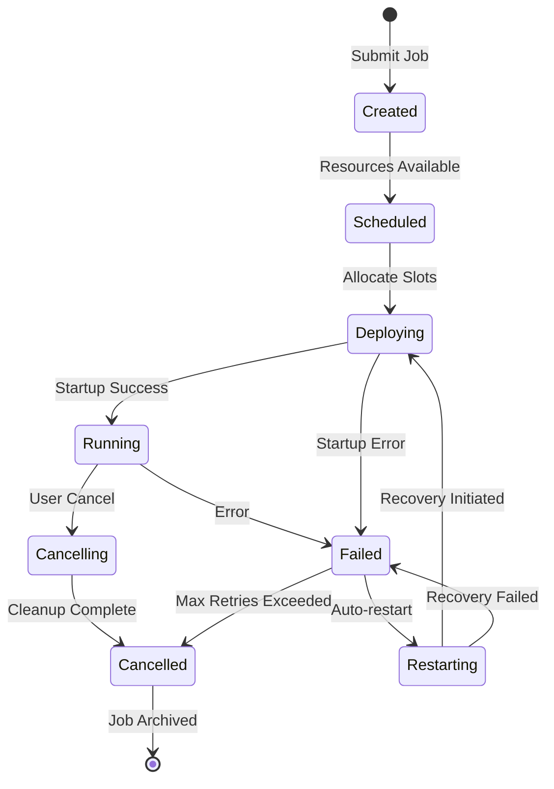

# Deployment and Operations for Stream Processing Systems

> **Unit**: formal-methods/04-application-layer/02-stream-processing | **Prerequisites**: [06-fault-tolerance](06-fault-tolerance.md), [10-performance-tuning](10-performance-tuning.md) | **Formalization Level**: L3-L4

## 1. Concept Definitions (Definitions)

### Def-A-02-45: Deployment Topology

**Deployment Topology** defines the physical arrangement of stream processing components:

$$\mathcal{T} = (N, R, S, C)$$

Where:

- $N$: Set of nodes (physical or virtual machines)
- $R \subseteq N \times N$: Network connections
- $S$: Service placement function $S: \text{Component} \rightarrow N$
- $C$: Resource constraints

**Topology Types**:

| Type | Description | Use Case |
|------|-------------|----------|
| **Single-node** | All components on one machine | Development, testing |
| **Standalone cluster** | Dedicated cluster nodes | Production on-premise |
| **Containerized** | Docker/Kubernetes deployment | Cloud-native, microservices |
| **Serverless** | Managed service (Flink on AWS/GCP) | Variable workload, managed ops |

### Def-A-02-46: Resource Allocation

**Resource Allocation Function**:

$$A: \text{Task} \rightarrow (\text{CPU}, \text{Memory}, \text{Disk}, \text{Network})$$

**Resource Requirements**:

For job $J$ with parallelism $P$:

$$\text{Resources}(J) = \sum_{i=1}^{P} A(t_i) + \text{Overhead}_{\text{system}}$$

**Slot Sharing**:

$$\text{SlotUtilization} = \frac{\sum_{t \in \text{Slot}} \text{ResourceDemand}(t)}{\text{SlotCapacity}}$$

### Def-A-02-47: Deployment Lifecycle

**Lifecycle States**:

```
[CREATED] --> [SCHEDULED] --> [DEPLOYING] --> [RUNNING]
                              |                    |
                              v                    v
                         [FAILED] <---------- [CANCELLING]
                              |                    |
                              +-----> [RESTARTING] <-----+
```

**State Transitions**:

| From | To | Trigger | Action |
|------|-----|---------|--------|
| CREATED | SCHEDULED | Resources available | Allocate slots |
| SCHEDULED | DEPLOYING | Slots allocated | Download artifacts |
| DEPLOYING | RUNNING | Startup successful | Begin processing |
| RUNNING | CANCELLING | User cancel | Graceful shutdown |
| RUNNING | FAILED | Exception | Error handling |
| FAILED | RESTARTING | Auto-restart enabled | Recover from checkpoint |

### Def-A-02-48: Configuration Management

**Configuration Hierarchy** (highest to lowest priority):

1. Job-specific parameters
2. Command-line arguments
3. Environment variables
4. Configuration files (`flink-conf.yaml`)
5. Default values

**Configuration Validation**:

$$\text{Valid}(c) \iff \forall p \in \text{Parameters}: p_{\text{min}} \leq c(p) \leq p_{\text{max}}$$

## 2. Property Derivation (Properties)

### Lemma-A-02-45: Resource Fragmentation

**Fragmentation Ratio**:

$$F = 1 - \frac{\max_{A' \subseteq A} \sum_{a \in A'} a}{\sum_{a \in A} a}$$

Where $A$ is the set of allocated resource chunks.

**Impact**: Higher fragmentation leads to lower utilization and scheduling failures.

### Lemma-A-02-46: Deployment Time Components

**Total Deployment Time**:

$$T_{deploy} = T_{scheduling} + T_{artifact} + T_{startup} + T_{recovery}$$

Where:

- $T_{scheduling}$: Resource negotiation (seconds)
- $T_{artifact}$: JAR/config download (seconds-minutes)
- $T_{startup}$: JVM initialization (seconds)
- $T_{recovery}$: State restoration from checkpoint (seconds-minutes)

### Prop-A-02-45: Rolling Update Safety

For rolling update of job version $V_1 \rightarrow V_2$:

$$\text{Safe}(V_1, V_2) \iff \text{State}_{V_1} \xrightarrow{\text{compatible}} \text{State}_{V_2}$$

**Compatibility Requirements**:

| Change Type | Safe | Requires |
|-------------|------|----------|
| Business logic only | Yes | Same state schema |
| Add operator | Yes | `allowNonRestoredState=true` |
| Remove operator | Conditional | State not used downstream |
| Change key type | No | State migration |
| Change state type | No | State migration |

### Prop-A-02-46: Resource Isolation Guarantees

**Container-based Isolation**:

$$\text{Isolation}(c_1, c_2) \Rightarrow \text{Resource}(c_1) \cap \text{Resource}(c_2) = \emptyset$$

**Levels of Isolation**:

| Level | Mechanism | Guarantee |
|-------|-----------|-----------|
| Process | JVM | Memory, CPU limits |
| Container | Docker/cgroups | Resource limits, network isolation |
| VM | Hypervisor | Hardware-level isolation |
| Physical | Separate machines | Complete isolation |

## 3. Relations Establishment (Relations)

### 3.1 Deployment Mode Comparison

| Mode | Resource Management | Scalability | Complexity | Cost |
|------|-------------------|-------------|------------|------|
| **Session Cluster** | Shared resources | Medium | Low | Low |
| **Job Cluster** | Dedicated per job | High | Medium | Medium |
| **Application Mode** | Per-job with client | High | Medium | Medium |
| **Native Kubernetes** | Pod-based | Very High | High | Variable |

### 3.2 Deployment Architecture



## 4. Argumentation Process (Argumentation)

### 4.1 Deployment Strategy Selection

**Session Cluster** (Multiple jobs share resources):

```
Pros:
- Resource sharing between jobs
- Low startup latency
- Simple operations

Cons:
- No job isolation
- Single point of failure
- Version conflicts between jobs

Best for: Development, testing, low-criticality production
```

**Job Cluster** (Dedicated cluster per job):

```
Pros:
- Strong isolation
- Independent scaling
- Different Flink versions per job

Cons:
- Higher resource overhead
- Longer startup time
- More complex to manage

Best for: Critical production jobs, compliance requirements
```

### 4.2 Resource Planning

**Memory Sizing Formula**:

```
TaskManager Memory =
  Framework Memory (fixed ~256MB) +
  Task Off-Heap Memory (fixed ~128MB) +
  Network Memory (min 64MB, typically 10-20% of total) +
  Managed Memory (for state backends, typically 30-50% of total) +
  JVM Heap (remainder)
```

**CPU Planning**:

```
Required Slots =
  Source Parallelism +
  Processing Parallelism +
  Sink Parallelism

Recommended CPUs = Slots × 1.5 (for headroom)
```

## 5. Formal Proof / Engineering Argument

### 5.1 Kubernetes Deployment

**FlinkDeployment CRD**:

```yaml
apiVersion: flink.apache.org/v1beta1
kind: FlinkDeployment
metadata:
  name: production-pipeline
  namespace: flink
spec:
  image: flink:1.18-scala_2.12
  flinkVersion: v1.18
  jobManager:
    resource:
      memory: 4Gi
      cpu: 2
    replicas: 3  # HA mode
    podTemplate:
      spec:
        containers:
          - name: flink-main-container
            env:
              - name: ENABLE_BUILT_IN_PLUGINS
                value: flink-metrics-prometheus,flink-gs-fs-hadoop
  taskManager:
    resource:
      memory: 16Gi
      cpu: 8
    replicas: 10
  job:
    jarURI: local:///opt/flink/usrlib/pipeline.jar
    parallelism: 40
    upgradeMode: savepoint
    state: running
    savepointTriggerNonce: 0
  podTemplate:
    spec:
      serviceAccountName: flink-service-account
      containers:
        - name: flink-main-container
          volumeMounts:
            - name: flink-config
              mountPath: /opt/flink/conf
            - name: checkpoints
              mountPath: /flink/checkpoints
      volumes:
        - name: flink-config
          configMap:
            name: flink-config
        - name: checkpoints
          persistentVolumeClaim:
            claimName: flink-checkpoints
```

**ConfigMap for flink-conf.yaml**:

```yaml
apiVersion: v1
kind: ConfigMap
metadata:
  name: flink-config
data:
  flink-conf.yaml: |
    # High Availability
    high-availability: kubernetes
    high-availability.storageDir: s3p://flink/ha/
    kubernetes.cluster-id: production-pipeline

    # State Backend
    state.backend: rocksdb
    state.backend.incremental: true
    state.checkpoint-storage: filesystem
    checkpoints.dir: s3p://flink/checkpoints/

    # Checkpointing
    execution.checkpointing.interval: 1min
    execution.checkpointing.min-pause: 30s
    execution.checkpointing.timeout: 10min
    execution.checkpointing.max-concurrent-checkpoints: 1
    execution.checkpointing.externalized-checkpoint-retention: RETAIN_ON_CANCELLATION

    # Restart Strategy
    restart-strategy: fixed-delay
    restart-strategy.fixed-delay.attempts: 10
    restart-strategy.fixed-delay.delay: 10s

    # Metrics
    metrics.reporter.prom.class: org.apache.flink.metrics.prometheus.PrometheusReporter
    metrics.reporter.prom.port: 9249
```

### 5.2 Helm Chart Deployment

```yaml
# values.yaml for Flink Helm chart
image:
  repository: flink
  tag: 1.18-scala_2.12
  pullPolicy: IfNotPresent

jobManager:
  replicas: 3
  resources:
    requests:
      memory: 4Gi
      cpu: 2
    limits:
      memory: 4Gi
      cpu: 2
  ports:
    rpc: 6123
    blob: 6124
    query: 6125
    ui: 8081
  podLabels:
    app: flink-jobmanager

TaskManager:
  replicas: 10
  resources:
    requests:
      memory: 16Gi
      cpu: 8
    limits:
      memory: 16Gi
      cpu: 8
  slots: 4
  podLabels:
    app: flink-taskmanager

flinkProperties: |
  jobmanager.memory.process.size: 4g
  taskmanager.memory.process.size: 16g
  state.backend: rocksdb
  state.checkpoint-storage: filesystem
  checkpoints.dir: /flink/checkpoints
  high-availability: zookeeper
  high-availability.zookeeper.quorum: zk:2181

persistence:
  enabled: true
  storageClass: fast-ssd
  size: 100Gi
  mountPath: /flink/checkpoints

service:
  type: ClusterIP
  uiPort: 8081

ingress:
  enabled: true
  hosts:
    - flink-ui.company.com
  tls:
    - secretName: flink-tls
      hosts:
        - flink-ui.company.com
```

### 5.3 Blue-Green Deployment

```scala
// Blue-Green deployment strategy for zero-downtime updates
class BlueGreenDeployment {

  def deploy(
    blueJob: JobDeployment,
    greenJob: JobDeployment,
    kafkaSource: KafkaSourceConfig
  ): Unit = {

    // 1. Start green job from savepoint
    val latestSavepoint = findLatestSavepoint(blueJob.jobId)
    val greenJobId = submitJob(greenJob, latestSavepoint)

    // 2. Wait for green job to catch up
    awaitCatchingUp(greenJobId, lagThreshold = 1000)

    // 3. Verify green job health
    if (verifyHealth(greenJobId)) {
      // 4. Switch Kafka consumer group
      switchConsumerGroup(
        from = blueJob.consumerGroup,
        to = greenJob.consumerGroup
      )

      // 5. Gracefully stop blue job
      cancelJob(blueJob.jobId, savepoint = true)

      println(s"Deployment complete: Blue(${blueJob.jobId}) -> Green($greenJobId)")
    } else {
      // Rollback
      cancelJob(greenJobId, savepoint = false)
      throw new DeploymentException("Green job health check failed")
    }
  }

  def awaitCatchingUp(jobId: String, lagThreshold: Long): Unit = {
    var lag = Long.MaxValue
    while (lag > lagThreshold) {
      lag = getConsumerLag(jobId)
      println(s"Current lag: $lag, threshold: $lagThreshold")
      Thread.sleep(5000)
    }
  }
}
```

### 5.4 Auto-scaling Configuration

```yaml
# Flink autoscaler configuration
apiVersion: flink.apache.org/v1beta1
kind: FlinkDeployment
metadata:
  name: autoscaled-job
spec:
  job:
    jarURI: local:///opt/flink/usrlib/job.jar
    parallelism: 10
    # Enable autoscaler
    autoscaler:
      enabled: true
      # Scale up when utilization > 80%
      targetUtilization: 0.8
      # Scale down when utilization < 30%
      scaleDownUtilization: 0.3
      # Minimum parallelism
      minParallelism: 5
      # Maximum parallelism
      maxParallelism: 100
      # Scale up cooldown (seconds)
      scaleUpDelay: 60
      # Scale down cooldown (seconds)
      scaleDownDelay: 300
      # Metrics window for decision
      metricsWindow: 5min
```

### 5.5 Security Configuration

```yaml
# flink-conf.yaml - Security hardening

# Authentication
security.ssl.rest.enabled: true
security.ssl.rest.keystore: /etc/flink/certs/keystore.jks
security.ssl.rest.keystore-password: ${KEYSTORE_PASSWORD}
security.ssl.rest.key-password: ${KEY_PASSWORD}
security.ssl.rest.truststore: /etc/flink/certs/truststore.jks
security.ssl.rest.truststore-password: ${TRUSTSTORE_PASSWORD}

# Internal communication encryption
security.ssl.internal.enabled: true
security.ssl.internal.keystore: /etc/flink/certs/internal.keystore
security.ssl.internal.truststore: /etc/flink/certs/internal.truststore

# Kerberos authentication
security.kerberos.login.keytab: /etc/security/keytabs/flink.keytab
security.kerberos.login.principal: flink@EXAMPLE.COM
security.kerberos.login.use-ticket-cache: false

# Audit logging
audit.log.enabled: true
audit.log.mode: ALL
audit.log.path: /var/log/flink/audit
```

### 5.6 Backup and Disaster Recovery

```scala
// Automated backup and DR procedures
class DisasterRecoveryManager {

  def scheduleBackups(jobId: String): Unit = {
    // Schedule periodic savepoints
    val scheduler = new ScheduledThreadPoolExecutor(1)
    scheduler.scheduleAtFixedRate(
      () => triggerSavepoint(jobId),
      0,     // Immediate
      1,     // Every hour
      TimeUnit.HOURS
    )
  }

  def triggerSavepoint(jobId: String): String = {
    val client = FlinkRestClient("http://flink-jobmanager:8081")

    val savepointPath = s"s3://dr-backups/savepoints/$jobId/${System.currentTimeMillis()}"

    val response = client.post(
      s"/jobs/$jobId/savepoints",
      body = Json.obj(
        "cancel-job" -> false,
        "target-directory" -> savepointPath
      )
    )

    val triggerId = (response \"request-id\").as[String]
    awaitSavepointCompletion(jobId, triggerId)

    // Validate and cleanup
    validateSavepoint(savepointPath)
    cleanupOldSavepoints(jobId, keepCount = 24)

    savepointPath
  }

  def disasterRecovery(
    jobId: String,
    targetRegion: String
  ): Unit = {
    // 1. Find latest valid savepoint
    val savepoint = findLatestValidSavepoint(jobId)

    // 2. Create cluster in DR region
    val drCluster = createClusterInRegion(targetRegion)

    // 3. Restore job from savepoint
    val newJobId = drCluster.submitJob(
      jobJar = getJobJar(jobId),
      savepointPath = savepoint,
      allowNonRestoredState = false
    )

    // 4. Verify and switch traffic
    awaitJobRunning(newJobId)
    verifyDataConsistency(newJobId)
    switchTraffic(targetRegion)
  }
}
```

## 6. Example Verification (Examples)

### 6.1 Production Checklist

```yaml
# Production deployment checklist
production_checklist:
  pre_deployment:
    - [ ] Code review completed
    - [ ] Unit tests passing (>80% coverage)
    - [ ] Integration tests passing
    - [ ] Performance benchmark acceptable
    - [ ] Security scan passed

  configuration:
    - [ ] Checkpoint enabled with appropriate interval
    - [ ] Restart strategy configured
    - [ ] Resource limits set appropriately
    - [ ] Monitoring and alerting configured
    - [ ] Logging configured and aggregated

  security:
    - [ ] SSL/TLS enabled for REST API
    - [ ] Internal communication encrypted
    - [ ] Authentication enabled
    - [ ] Secrets managed securely (Vault/K8s secrets)
    - [ ] Network policies configured

  high_availability:
    - [ ] JobManager HA enabled
    - [ ] Checkpoint storage distributed
    - [ ] Multi-AZ deployment
    - [ ] Disaster recovery tested

  monitoring:
    - [ ] Metrics exposed (Prometheus)
    - [ ] Dashboards created (Grafana)
    - [ ] Critical alerts configured
    - [ ] On-call rotation established
    - [ ] Runbooks documented

  post_deployment:
    - [ ] Smoke tests passed
    - [ ] Monitoring data visible
    - [ ] Alerts tested
    - [ ] Rollback plan verified
```

### 6.2 Deployment Verification Tests

```scala
// Post-deployment verification
class DeploymentVerification {

  def verify(deployment: FlinkDeployment): VerificationResult = {
    val checks = Seq(
      verifyJobRunning(deployment),
      verifyCheckpointsActive(deployment),
      verifyMetricsFlowing(deployment),
      verifyNoBackpressure(deployment),
      verifyLatencySLA(deployment),
      verifyResourceUtilization(deployment)
    )

    VerificationResult(
      passed = checks.forall(_.passed),
      checks = checks,
      timestamp = System.currentTimeMillis()
    )
  }

  def verifyJobRunning(deployment: FlinkDeployment): CheckResult = {
    val status = getJobStatus(deployment)
    CheckResult(
      name = "Job Running",
      passed = status == JobStatus.RUNNING,
      message = s"Job status: $status"
    )
  }

  def verifyLatencySLA(deployment: FlinkDeployment): CheckResult = {
    val p99Latency = getP99Latency(deployment)
    val sla = 500  // ms
    CheckResult(
      name = "Latency SLA",
      passed = p99Latency < sla,
      message = s"P99 latency: ${p99Latency}ms (SLA: ${sla}ms)"
    )
  }
}
```

## 7. Visualizations (Visualizations)

### 7.1 Deployment Architecture



### 7.2 Deployment Lifecycle



## 8. References (References)


---

*Document Version: v1.0 | Last Updated: 2026-04-10 | Status: Complete*
