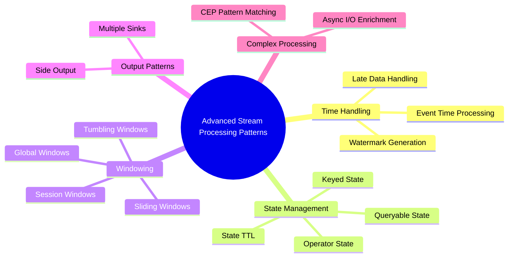
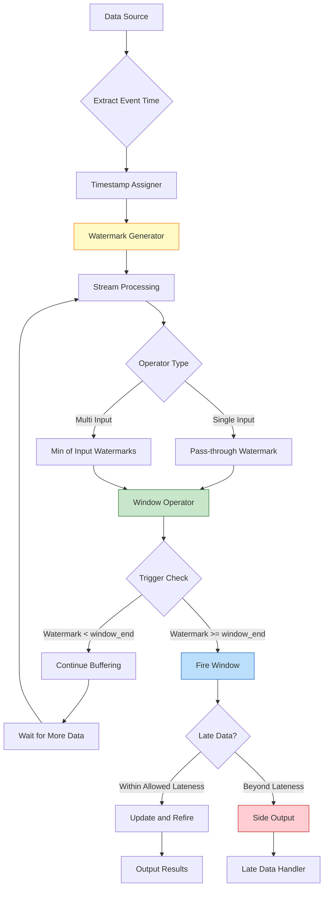
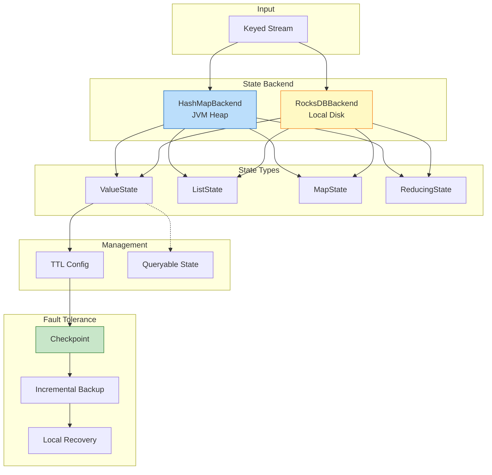

# Advanced Stream Processing Patterns

> **Unit**: Knowledge/Advanced | **Prerequisites**: [05-state-management](05-state-management.md), [03-window-semantics](03-window-semantics.md) | **Formalization Level**: L4-L5
>
> This document presents advanced design patterns for distributed stream processing, including event time processing, stateful computation, windowed aggregation, side output patterns, and complex event processing (CEP).

---

## Table of Contents

- [Advanced Stream Processing Patterns](#advanced-stream-processing-patterns)
  - [Table of Contents](#table-of-contents)
  - [1. Definitions](#1-definitions)
    - [Def-K-12-01: Design Pattern](#def-k-12-01-design-pattern)
    - [Def-K-12-02: Event Time Processing](#def-k-12-02-event-time-processing)
    - [Def-K-12-03: Watermark](#def-k-12-03-watermark)
    - [Def-K-12-04: Stateful Computation](#def-k-12-04-stateful-computation)
    - [Def-K-12-05: Windowed Aggregation](#def-k-12-05-windowed-aggregation)
  - [2. Properties](#2-properties)
    - [Prop-K-12-01: Watermark Monotonicity](#prop-k-12-01-watermark-monotonicity)
    - [Lemma-K-12-01: State Partitioning Determinism](#lemma-k-12-01-state-partitioning-determinism)
    - [Prop-K-12-02: Window Time Coverage Completeness](#prop-k-12-02-window-time-coverage-completeness)
  - [3. Relations](#3-relations)
    - [3.1 Pattern Composition Matrix](#31-pattern-composition-matrix)
    - [3.2 Pattern Selection Decision Tree](#32-pattern-selection-decision-tree)
  - [4. Argumentation](#4-argumentation)
    - [4.1 Event Time vs Processing Time Trade-offs](#41-event-time-vs-processing-time-trade-offs)
    - [4.2 State Backend Selection Criteria](#42-state-backend-selection-criteria)
  - [5. Proof / Engineering Argument](#5-proof-engineering-argument)
    - [5.1 Event Time Processing Correctness](#51-event-time-processing-correctness)
    - [5.2 Stateful Computation Consistency](#52-stateful-computation-consistency)
    - [5.3 Window Aggregation Correctness Conditions](#53-window-aggregation-correctness-conditions)
  - [6. Examples](#6-examples)
    - [6.1 Event Time Processing with Watermark](#61-event-time-processing-with-watermark)
    - [6.2 Stateful Computation with TTL](#62-stateful-computation-with-ttl)
    - [6.3 Windowed Aggregation Patterns](#63-windowed-aggregation-patterns)
    - [6.4 Side Output for Late Data](#64-side-output-for-late-data)
  - [7. Visualizations](#7-visualizations)
    - [7.1 Advanced Patterns Mind Map](#71-advanced-patterns-mind-map)
    - [7.2 Event Time Processing Flow](#72-event-time-processing-flow)
    - [7.3 State Management Architecture](#73-state-management-architecture)
  - [8. References](#8-references)

---

## 1. Definitions

### Def-K-12-01: Design Pattern

A **design pattern** in stream processing is a reusable solution to a commonly occurring problem within a given context [^1][^2]. Formally, a pattern $P$ is defined as:

$$P = (C, F, S, I)$$

Where:

- $C$: Context - the situation where the pattern applies
- $F$: Forces - conflicting constraints to be balanced
- $S$: Solution - the pattern's structural arrangement
- $I$: Implementation - concrete code examples

**Pattern Categories**:

| Category | Purpose | Examples |
|----------|---------|----------|
| **Time Handling** | Manage temporal semantics | Event Time, Watermark |
| **State Management** | Handle stateful computation | Keyed State, TTL |
| **Windowing** | Bounded aggregation | Tumbling, Sliding, Session |
| **Output Handling** | Multiple output streams | Side Output |
| **Complex Processing** | Pattern matching | CEP |

---

### Def-K-12-02: Event Time Processing

**Event Time Processing** is a temporal semantics where computation is based on the time when events actually occurred in the business domain, rather than when they are processed [^3][^4].

Let $\text{Record}$ be the set of all possible records and $\mathbb{T} = \mathbb{R}_{\geq 0}$ be the time domain. **Event Time** is a mapping:

$$t_e: \text{Record} \to \mathbb{T}$$

For any record $r \in \text{Record}$, $t_e(r)$ represents the timestamp when the record was generated at the source, attached by the data producer and **immutable** throughout processing.

**Out-of-Order Property**:

For any two records $r_1, r_2$:

$$t_e(r_1) < t_e(r_2) \nRightarrow t_a(r_1) < t_a(r_2)$$

Where $t_a(r)$ is the arrival time. The partial order of event time is **not isomorphic** to the partial order of arrival time.

**Time Semantics Hierarchy** [^4]:

$$
\text{Processing Time} \subset \text{Ingestion Time} \subset \text{Event Time}
$$

---

### Def-K-12-03: Watermark

A **Watermark** is a special progress beacon injected into the data stream, formally a monotonic function from the stream to the time domain [^3][^4]:

$$wm: \text{Stream} \to \mathbb{T} \cup \{+\infty\}$$

Given current watermark value $w$, its semantic assertion is:

$$\forall r \in \text{Stream}_{\text{future}}. \; t_e(r) \geq w \lor \text{Late}(r, w)$$

**Watermark Generation Strategy**:

$$w(t) = \max_{r \in \text{Observed}(t)} t_e(r) - \delta$$

Where $\delta \geq 0$ is the maximum out-of-orderness tolerated by the system.

**Propagation Rules**:

| Operator Type | Propagation Rule | Description |
|--------------|------------------|-------------|
| Single Input (Map/Filter) | $w_{\text{out}} = w_{\text{in}} - d_{\text{proc}}$ | Pass-through with processing delay |
| Multi Input (Join/Union) | $w_{\text{out}} = \min_i w_{\text{in}_i}$ | Take minimum for safety |
| Multi Output | Each output inherits input watermark | Consistency maintained |

---

### Def-K-12-04: Stateful Computation

**Stateful Computation** maintains contextual information across events in distributed stream processing [^1][^5].

Let $S_t(o_i)$ be the state of operator $o_i$ at time $t$. Stateful computation satisfies:

$$\text{Output}(o_i, r_j, t) = f(r_j, S_{t-1}(o_i))$$

**State Types**:

| Type | Binding | Scope | Use Case |
|------|---------|-------|----------|
| **Operator State** | Bound to operator instance | All records share same state | Broadcast state |
| **Keyed State** | Partitioned by key | Independent state per key | Aggregations, sessions |

**State Backend** [^5]:

$$\mathcal{B} = (S_{storage}, \Phi_{access}, \Psi_{snapshot}, \Omega_{recovery})$$

| Backend | Storage | Capacity | Latency | Incremental Checkpoint |
|---------|---------|----------|---------|----------------------|
| HashMapStateBackend | JVM Heap | MB to GB | ~10-100 ns | ❌ Not supported |
| RocksDBStateBackend | Local Disk | TB level | 1-100 μs | ✅ Native support |

---

### Def-K-12-05: Windowed Aggregation

**Windowed Aggregation** divides unbounded data streams into finite time buckets for aggregate computation [^2][^6].

**Window Assigner**:

$$\text{Assigner}: \mathcal{D} \times \mathbb{T} \to \mathcal{P}(\text{WindowID})$$

**Window Types** [^6]:

| Type | Definition | Overlap | Record Assignment |
|------|------------|---------|-------------------|
| **Tumbling** | $\text{Tumbling}(\delta): wid_n = [n\delta, (n+1)\delta)$ | None | Single window |
| **Sliding** | $\text{Sliding}(\delta, s): wid_n = [n \cdot s, n \cdot s + \delta)$ | When $s < \delta$ | Multiple windows |
| **Session** | $\text{Session}(g): wid = [t_{first}, t_{last} + g)$ | Dynamic | Single window |
| **Global** | $\text{Global}: wid_{global} = (-\infty, +\infty)$ | N/A | All records |

**Trigger** [^6]:

$$\text{Trigger}: \text{WindowID} \times \mathbb{T}_{watermark} \times \text{State} \to \{\text{FIRE}, \text{CONTINUE}, \text{PURGE}\}$$

---

## 2. Properties

### Prop-K-12-01: Watermark Monotonicity

**Statement**: For any operator $v$ in a Dataflow DAG using event time semantics, the output watermark sequence satisfies monotonic non-decreasing:

$$\forall v \in V, \; \forall t_1 \leq t_2: \quad w_v(t_1) \leq w_v(t_2)$$

**Proof Sketch** [^3]:

1. Source watermark is generated as $w(t) = \max t_e - \delta$, which is non-decreasing as $\max t_e$ only increases
2. For single-input operators, $w_{out} = w_{in} - d_{proc}$ preserves monotonicity
3. For multi-input operators, $w_{out} = \min_i w_{in_i}$ preserves monotonicity because the minimum of non-decreasing functions is non-decreasing
4. By induction over the DAG topology, all operators maintain watermark monotonicity ∎

**Engineering Implication**: This property guarantees **unique window trigger moments**, preventing the same window from triggering multiple times due to watermark regression.

---

### Lemma-K-12-01: State Partitioning Determinism

**Statement**: Keyed State partitioned by key hash distributes deterministically to parallel subtasks:

$$\text{Partition}(key) = hash(key) \mod parallelism$$

**Guarantee**: All records with the same key are routed to the same subtask, ensuring serialized state updates.

---

### Prop-K-12-02: Window Time Coverage Completeness

**Statement**: For any event time $t \in \mathbb{T}$, there exists at least one window $wid$ such that $t \in [t_{start}(wid), t_{end}(wid))$.

**Proof** [^6]:

1. **Tumbling window**: For window size $\delta$, $t$ belongs to window $wid_{\lfloor t/\delta \rfloor}$
2. **Sliding window**: $t$ belongs to all windows satisfying $n \cdot s \leq t < n \cdot s + \delta$
3. **Session window**: As long as $t$ corresponds to some record, that record belongs to some session
4. **Global window**: Trivially covers all time ∎

---

## 3. Relations

### 3.1 Pattern Composition Matrix

```
┌─────────────────────┬──────────┬─────────┬──────────┬───────────┐
│ Pattern Combination │ Valid    │ Benefit │ Risk     │ Priority  │
├─────────────────────┼──────────┼─────────┼──────────┼───────────┤
│ Event Time + Window │ ✅ Yes   │ Deterministic results | Higher latency | P0        │
│ Stateful + Window   │ ✅ Yes   │ Cross-window state    │ State explosion │ P0        │
│ Event Time + CEP    │ ✅ Yes   │ Temporal patterns     │ Complex state   │ P1        │
│ Side Output + Window│ ✅ Yes   │ Late data handling    │ Additional I/O  │ P1        │
│ Async I/O + Stateful│ ⚠️ Careful│ External enrichment   │ Timeout handling│ P2        │
└─────────────────────┴──────────┴─────────┴──────────┴───────────┘
```

### 3.2 Pattern Selection Decision Tree

```
Does the computation depend on historical context?
├── No ──► Stateless Processing (Map/Filter)
└── Yes ──► Is time the primary grouping dimension?
            ├── No ──► Stateful Computation (Keyed State)
            └── Yes ──► Tolerance for late data?
                        ├── None ──► Processing Time Window
                        └── Some ──► Event Time + Watermark
                                     ├── Fixed intervals ──► Tumbling Window
                                     ├── Overlapping stats ──► Sliding Window
                                     └── User behavior ──► Session Window
```

---

## 4. Argumentation

### 4.1 Event Time vs Processing Time Trade-offs

| Dimension | Event Time | Processing Time |
|-----------|------------|-----------------|
| **Result Correctness** | Deterministic, reproducible | Non-deterministic |
| **Latency** | Higher (watermark delay) | Lower (immediate) |
| **State Cost** | Higher (buffer late data) | Lower |
| **Complexity** | Higher (watermark management) | Lower |
| **Use Cases** | Financial transactions, billing | Monitoring, alerting |

**Decision Framework** [^4]:

```
Is result reproducibility required across runs?
├── No ──► Processing Time (lowest latency)
└── Yes ──► Does the data source have reliable timestamps?
            ├── No ──► Ingestion Time (simplified configuration)
            └── Yes ──► What is the out-of-order degree?
                        ├── None ──► forMonotonousTimestamps()
                        ├── Light (<1s) ──► forBoundedOutOfOrderness(1s)
                        ├── Medium (1-30s) ──► forBoundedOutOfOrderness(10-30s)
                        └── Heavy (>30s) ──► forBoundedOutOfOrderness(60s+) + Side Output
```

### 4.2 State Backend Selection Criteria

**Decision Tree** [^5]:

```
State size < 30% of TM heap memory?
├── Yes ──► HashMapStateBackend (low latency)
│           └── Need persistence?
│               ├── Yes ──► FsStateBackend
│               └── No ──► MemoryStateBackend
└── No ──► RocksDBStateBackend (large state)
            └── Need incremental checkpoint?
                ├── Yes ──► EmbeddedRocksDBStateBackend(true)
                └── No ──► EmbeddedRocksDBStateBackend(false)
```

---

## 5. Proof / Engineering Argument

### 5.1 Event Time Processing Correctness

**Theorem**: Given an event time processing configuration with:

- Watermark strategy: $w(t) = \max_{r \in \text{observed}} t_e(r) - L$
- Window assigner satisfying Def-K-12-05
- Trigger based on watermark progression

When $L \geq D_{actual}$ (configured delay >= actual out-of-order degree), window aggregation results are **complete and correct**.

**Proof** [^3][^4]:

**Step 1**: By Def-K-12-03, watermark $w$ guarantees that all events with $t_e \leq w$ have either arrived or will never arrive.

**Step 2**: Window $wid = [t_{start}, t_{end})$ triggers when:
$$\tau_{trigger} = \min\{t \mid w(t) \geq t_{end}\}$$

**Step 3**: When $L \geq D_{actual}$:
$$w(t) = \max t_e - L \leq \max t_e - D_{actual} \leq \min_{r} t_a(r)$$

The watermark always lags behind the earliest possible arrival time, ensuring all records arrive before trigger.

**Step 4**: Result correctness:
$$
\text{Result Correctness} = \begin{cases}
\text{Complete} & L \geq D_{actual} \\
\text{Deterministic but Incomplete} & L < D_{actual}
\end{cases}
$$ ∎

### 5.2 Stateful Computation Consistency

**Theorem**: Stateful computation with checkpointing satisfies Exactly-Once semantics when:
1. State updates are deterministic
2. Checkpoint captures consistent global state
3. Source supports replay

**Proof Sketch** [^5]:

1. **Checkpoint consistency**: By Thm-S-17-01, state snapshot forms a consistent cut
2. **State recovery**: Upon failure, restore to checkpointed state
3. **Source replay**: Re-process records after checkpoint with deterministic updates
4. **Idempotency**: Checkpoint barriers align with output commits, ensuring no duplicates ∎

### 5.3 Window Aggregation Correctness Conditions

**Theorem Thm-K-12-01**: Window aggregation is correct when:
- Window assigner satisfies Def-K-12-05
- Watermark satisfies Prop-K-12-01
- Aggregate function is associative (for incremental computation)

**Engineering Argument** [^6]:

1. **Associativity**: For incremental aggregates, $f = g \circ h$ where $h$ satisfies:
   $$h(h(a, b), c) = h(a, h(b, c))$$

2. **State complexity**: $O(1)$ for distributive aggregates (SUM, COUNT), $O(N)$ for holistic (MEDIAN)

3. **Trigger correctness**: Watermark monotonicity ensures each window triggers at most once

---

## 6. Examples

### 6.1 Event Time Processing with Watermark

```scala
import org.apache.flink.api.common.eventtime.{SerializableTimestampAssigner, WatermarkStrategy}
import java.time.Duration

// Bounded out-of-orderness strategy
val watermarkStrategy: WatermarkStrategy[Transaction] =
  WatermarkStrategy
    .forBoundedOutOfOrderness[Transaction](Duration.ofSeconds(10))
    .withTimestampAssigner((txn, _) => txn.timestamp)
    .withIdleness(Duration.ofMinutes(1))  // Handle idle sources

// Apply to stream
val streamWithWatermark = env
  .fromSource(kafkaSource, watermarkStrategy, "Transaction Source")
```

### 6.2 Stateful Computation with TTL

```scala
// State TTL configuration
val ttlConfig = StateTtlConfig
  .newBuilder(Time.minutes(30))
  .setUpdateType(OnCreateAndWrite)
  .setStateVisibility(NeverReturnExpired)
  .cleanupFullSnapshot()
  .build()

// ValueState with TTL
class UserVisitCounter extends ProcessFunction[UserEvent, UserStats] {
  private var visitCountState: ValueState[Long] = _

  override def open(parameters: Configuration): Unit = {
    val descriptor = new ValueStateDescriptor[Long]("visit-count", classOf[Long])
    descriptor.enableTimeToLive(ttlConfig)
    visitCountState = getRuntimeContext.getState(descriptor)
  }

  override def processElement(
    event: UserEvent,
    ctx: Context,
    out: Collector[UserStats]
  ): Unit = {
    val currentCount = Option(visitCountState.value()).getOrElse(0L)
    val newCount = currentCount + 1
    visitCountState.update(newCount)
    out.collect(UserStats(event.userId, newCount))
  }
}
```

### 6.3 Windowed Aggregation Patterns

```scala
// Tumbling window: 5-second fixed intervals
val tumblingAgg = transactionStream
  .keyBy(_.currency)
  .window(TumblingEventTimeWindows.of(Time.seconds(5)))
  .aggregate(new SumAggregate())

// Sliding window: 1-minute window, 10-second slide
val slidingAgg = sensorStream
  .keyBy(_.sensorId)
  .window(SlidingEventTimeWindows.of(Time.minutes(1), Time.seconds(10)))
  .aggregate(new AverageAggregate())

// Session window: 5-minute gap
val sessionAgg = clickStream
  .keyBy(_.userId)
  .window(EventTimeSessionWindows.withGap(Time.minutes(5)))
  .allowedLateness(Time.seconds(30))
  .sideOutputLateData(lateDataTag)
  .process(new UserSessionFunction())
```

### 6.4 Side Output for Late Data

```scala
// Define late data tag
val lateDataTag = OutputTag[SensorReading]("late-data")

// Window with late data handling
val resultStream = sensorStream
  .assignTimestampsAndWatermarks(
    WatermarkStrategy
      .forBoundedOutOfOrderness[SensorReading](Duration.ofSeconds(15))
      .withTimestampAssigner((reading, _) => reading.timestamp)
  )
  .keyBy(_.deviceId)
  .window(EventTimeSessionWindows.withGap(Time.minutes(10)))
  .allowedLateness(Time.seconds(30))
  .sideOutputLateData(lateDataTag)
  .process(new DeviceSessionAggregateFunction())

// Process main output
resultStream.addSink(new InfluxDBSink())

// Process late data separately
val lateDataStream = resultStream.getSideOutput(lateDataTag)
lateDataStream.addSink(new LateDataAuditSink())
```

---

## 7. Visualizations

### 7.1 Advanced Patterns Mind Map



### 7.2 Event Time Processing Flow



### 7.3 State Management Architecture



---

## 8. References

[^1]: Apache Flink Documentation, "State Management," 2025. <https://nightlies.apache.org/flink/flink-docs-stable/docs/dev/datastream/fault-tolerance/state/>

[^2]: T. Akidau et al., "The Dataflow Model: A Practical Approach to Balancing Correctness, Latency, and Cost in Massive-Scale, Unbounded, Out-of-Order Data Processing," *PVLDB*, 8(12), 2015.

[^3]: Apache Flink Documentation, "Event Time and Watermarks," 2025. <https://nightlies.apache.org/flink/flink-docs-stable/docs/concepts/time/>

[^4]: Apache Flink Documentation, "Time Characteristics," 2025. <https://nightlies.apache.org/flink/flink-docs-stable/docs/dev/datastream/event-time/>

[^5]: P. Carbone et al., "State Management in Apache Flink," *PVLDB*, 2017.

[^6]: Apache Flink Documentation, "Windowing," 2025. <https://nightlies.apache.org/flink/flink-docs-stable/docs/dev/datastream/operators/windows/>

---

*Document Version: v1.0 | Last Updated: 2026-04-10 | Status: Complete*
