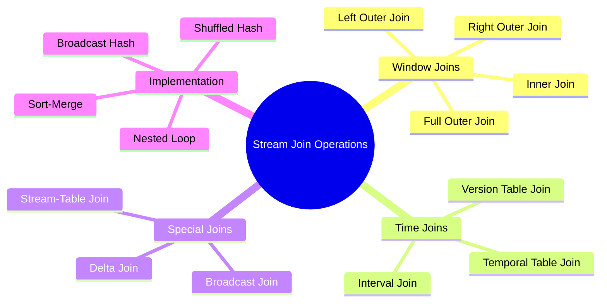
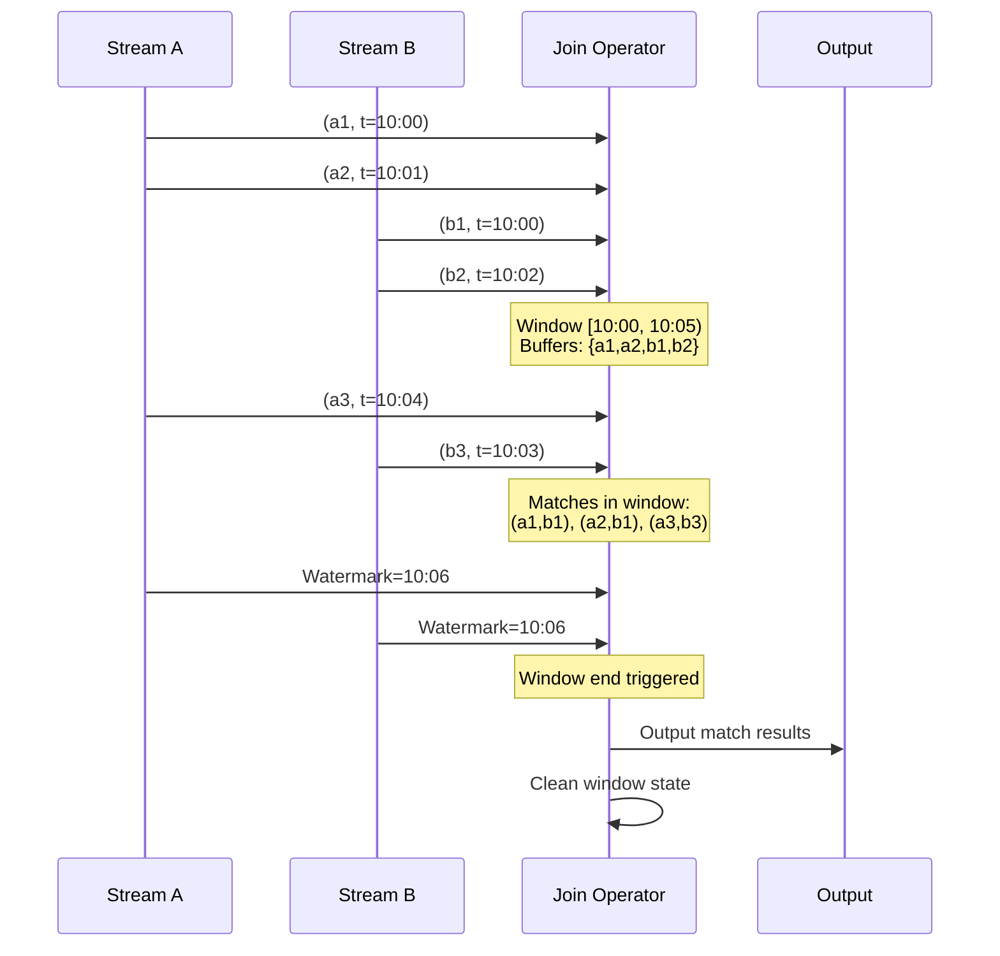

# Stream Joins

> **Unit**: Knowledge/Advanced | **Prerequisites**: [12-advanced-patterns](12-advanced-patterns.md), [04-time-semantics](04-time-semantics.md) | **Formalization Level**: L5-L6
>
> This document provides a comprehensive formalization of stream join operations, covering window joins, interval joins, stream-table joins, and temporal table joins with complete semantics, properties, and implementation examples.

---

## Table of Contents

- [Stream Joins](#stream-joins)
  - [Table of Contents](#table-of-contents)
  - [1. Definitions](#1-definitions)
    - [Def-K-13-01: Stream Join Operation](#def-k-13-01-stream-join-operation)
    - [Def-K-13-02: Window Join Semantics](#def-k-13-02-window-join-semantics)
    - [Def-K-13-03: Join Types](#def-k-13-03-join-types)
    - [Def-K-13-04: Stream-Table Join](#def-k-13-04-stream-table-join)
    - [Def-K-13-05: Temporal Table Join](#def-k-13-05-temporal-table-join)
    - [Def-K-13-06: Interval Join](#def-k-13-06-interval-join)
  - [2. Properties](#2-properties)
    - [Lemma-K-13-01: Join Symmetry](#lemma-k-13-01-join-symmetry)
    - [Lemma-K-13-02: Bounded State for Window Join](#lemma-k-13-02-bounded-state-for-window-join)
    - [Prop-K-13-01: Interval Join Transitivity](#prop-k-13-01-interval-join-transitivity)
  - [3. Relations](#3-relations)
    - [3.1 Join Type Comparison](#31-join-type-comparison)
    - [3.2 SQL-to-Stream Mapping](#32-sql-to-stream-mapping)
    - [3.3 Implementation Strategy Selection](#33-implementation-strategy-selection)
  - [4. Argumentation](#4-argumentation)
    - [4.1 Challenges in Stream Joins](#41-challenges-in-stream-joins)
    - [4.2 State Backend Impact](#42-state-backend-impact)
  - [5. Proof / Engineering Argument](#5-proof--engineering-argument)
    - [5.1 Window Join Formal Specification](#51-window-join-formal-specification)
    - [5.2 Interval Join Formalization](#52-interval-join-formalization)
    - [5.3 Exactly-Once Guarantee](#53-exactly-once-guarantee)
  - [6. Examples](#6-examples)
    - [6.1 Flink Window Join](#61-flink-window-join)
    - [6.2 Interval Join Implementation](#62-interval-join-implementation)
    - [6.3 Temporal Table Join](#63-temporal-table-join)
    - [6.4 Stream-Table Join with Broadcast State](#64-stream-table-join-with-broadcast-state)
  - [7. Visualizations](#7-visualizations)
    - [7.1 Stream Join Types Overview](#71-stream-join-types-overview)
    - [7.2 Window Join Execution Flow](#72-window-join-execution-flow)
    - [7.3 Interval Join Time Matching](#73-interval-join-time-matching)
    - [7.4 Join State Management](#74-join-state-management)
  - [8. References](#8-references)

---

## 1. Definitions

### Def-K-13-01: Stream Join Operation

A **Stream Join** is an operation that combines two or more streams based on a join predicate [^1][^2]:

$$\bowtie: \text{Stream}(A) \times \text{Stream}(B) \times \theta \to \text{Stream}(A \times B)$$

Where $\theta$ is the join predicate.

**Stream Representation**:

A stream $S$ is a sequence of timestamped elements:

$$S = \langle (e_1, \tau_1), (e_2, \tau_2), ... \rangle$$

Where $\tau_i \in \mathbb{T}$ is the event timestamp.

---

### Def-K-13-02: Window Join Semantics

A **Window Join** matches elements within finite time windows [^1][^2]:

$$\bowtie_{W}: \text{Stream}(A) \times \text{Stream}(B) \to \text{Stream}(A \times B)$$

For window $w = [t_{start}, t_{end}]$:

$$S_A \bowtie_{w} S_B = \{(a, b) \mid a \in S_A(w) \land b \in S_B(w) \land \theta(a, b)\}$$

**Window Join Characteristics**:

| Property | Description |
|----------|-------------|
| Time Boundary | Fixed window boundaries |
| Trigger | Window end based on watermark |
| State Requirement | Dual window buffers |
| Cleanup | Triggered at watermark advancement |

---

### Def-K-13-03: Join Types

**Inner Join** [^2]:

$$S_A \bowtie_{inner} S_B = \{(a, b) \mid a \in S_A \land b \in S_B \land key(a) = key(b)\}$$

Only outputs matching pairs.

**Left Outer Join**:

$$S_A \bowtie_{left} S_B = \{(a, b) \mid a \in S_A \land (b \in S_B \land key(a) = key(b) \lor b = \bot)\}$$

For every element in $S_A$, output even if no match exists (filled with $\bot$).

**Right Outer Join**:

$$S_A \bowtie_{right} S_B = \{(a, b) \mid (a \in S_A \land key(a) = key(b) \lor a = \bot) \land b \in S_B\}$$

**Full Outer Join**:

$$S_A \bowtie_{full} S_B = (S_A \bowtie_{left} S_B) \cup (S_A \bowtie_{right} S_B)$$

**Join Type Comparison**:

| Type | Result Set | State Requirement | Latency Characteristic |
|------|------------|-------------------|----------------------|
| Inner | Matches only | Dual window buffers | Window end trigger |
| Left Outer | All left stream | Dual windows + markers | Window end trigger |
| Right Outer | All right stream | Dual windows + markers | Window end trigger |
| Full Outer | All records | Dual windows + markers | Window end trigger |

---

### Def-K-13-04: Stream-Table Join

**Stream-Table Join** connects a stream with a lookup table [^2]:

$$\bowtie_{ST}: \text{Stream}(A) \times \text{Table}(B) \to \text{Stream}(A \times B)$$

For stream element $(a, \tau_a)$:

$$a \bowtie_{ST} T = \{(a, b) \mid b \in T \land key(a) = key(b) \land \tau_{valid}(b) \ni \tau_a\}$$

Where $\tau_{valid}(b)$ is the validity time interval of table row $b$.

**Characteristics**:

- Stream drives the join (probe side)
- Table is the lookup side (build side)
- Usually implemented with table caching

---

### Def-K-13-05: Temporal Table Join

**Temporal Table Join** retrieves historical versions of table data [^2]:

$$S \bowtie_{temporal} T(t) = \{(s, T(key(s), \tau_s)) \mid s \in S\}$$

Where $T(k, t)$ returns the version of key $k$ in table $T$ at time $t$.

**SQL Syntax**:

```sql
SELECT o.order_id, o.amount, r.rate, o.amount * r.rate as amount_usd
FROM Orders AS o
JOIN Rates FOR SYSTEM_TIME AS OF o.order_time AS r
ON o.currency = r.currency
```

**Use Case**: Currency conversion at transaction time, point-in-time lookups.

---

### Def-K-13-06: Interval Join

**Interval Join** matches elements within a relative time interval [^1]:

$$S_A \bowtie_{[l,r]} S_B = \{(a, b) \mid a \in S_A \land b \in S_B \land \tau(b) \in [\tau(a) + l, \tau(a) + r]\}$$

Where $[l, r]$ is the time interval bounds relative to the left stream element.

**Characteristics**:

- Time-based matching (not window-based)
- Triggered by delay expiration
- Flexible matching semantics

---

## 2. Properties

### Lemma-K-13-01: Join Symmetry

**Statement**: Inner join is symmetric:

$$S_A \bowtie_{inner} S_B = S_B \bowtie_{inner} S_A$$

**Proof**: Directly follows from the symmetry of set intersection. ∎

**Note**: Outer joins do **not** satisfy symmetry:

$$S_A \bowtie_{left} S_B \neq S_B \bowtie_{left} S_A$$

---

### Lemma-K-13-02: Bounded State for Window Join

**Statement**: For time window join with window size $W$, the state space is bounded:

$$|State| \leq \lambda_A \cdot W + \lambda_B \cdot W$$

Where $\lambda$ is the arrival rate.

**Proof**: Events outside the window are cleaned up. The number of events within a window is bounded by the arrival rate multiplied by window size. ∎

---

### Prop-K-13-01: Interval Join Transitivity

**Statement**: Interval Join has transitivity under specific interval overlap conditions:

$$(S_A \bowtie_{[l_1,r_1]} S_B) \bowtie_{[l_2,r_2]} S_C = S_A \bowtie_{[l,r]} (S_B \bowtie_{[l',r']} S_C)$$

When intervals satisfy specific overlap constraints.

---

## 3. Relations

### 3.1 Join Type Comparison

```
┌─────────────────┬──────────────────┬──────────────────┬──────────────────┐
│   Join Type     │   Result Set     │   State Need     │  Latency Trait   │
├─────────────────┼──────────────────┼──────────────────┼──────────────────┤
│ Inner Join      │ Matches only     │ Dual buffers     │ Window trigger   │
│ Left Outer      │ All left output  │ Buffers+markers  │ Window trigger   │
│ Right Outer     │ All right output │ Buffers+markers  │ Window trigger   │
│ Full Outer      │ All output       │ Buffers+markers  │ Window trigger   │
│ Interval Join   │ Time matches     │ Dual sliding     │ Delay trigger    │
│ Stream-Table    │ Lookup matches   │ Cache+buffer     │ Instant trigger  │
│ Temporal Join   │ Temporal match   │ Table versions   │ Instant trigger  │
└─────────────────┴──────────────────┴──────────────────┴──────────────────┘
```

### 3.2 SQL-to-Stream Mapping

| SQL Join | Stream Semantics | Complexity |
|----------|------------------|------------|
| `INNER JOIN` | Windowed Inner Join | Low |
| `LEFT JOIN` | Left Outer Join | Medium |
| `RIGHT JOIN` | Right Outer Join | Medium |
| `FULL OUTER JOIN` | Full Outer Join | High |
| `JOIN ... ON ... AND timestamp diff` | Interval Join | Medium |
| `LATERAL TABLE` | Stream-Table Join | Medium |
| `FOR SYSTEM_TIME AS OF` | Temporal Join | High |

### 3.3 Implementation Strategy Selection

```
Implementation Strategy Selection:
┌─────────────────────────────────────────────────────────────┐
│                    Input Characteristics                    │
├─────────────────────────────────────────────────────────────┤
│ Ordered? ──Yes──▶ Sort-Merge Join (efficient sequential)    │
│    │                                                        │
│    No                                                       │
│    │                                                        │
│ Partitionable? ──Yes──▶ Shuffled Hash Join (parallel)       │
│    │                                                        │
│    No                                                       │
│    │                                                        │
│ Small table? ──Yes──▶ Broadcast Hash Join (broadcast small) │
│    │                                                        │
│    No                                                       │
│    ▼                                                        │
│ Nested Loop Join (general but slow)                         │
└─────────────────────────────────────────────────────────────┘
```

---

## 4. Argumentation

### 4.1 Challenges in Stream Joins

```
Core Challenges in Stream Joins:
├── Infinite Input
│   ├── Requires window/time boundaries
│   └── Complex state management
├── Out-of-Order Arrival
│   ├── Watermark coordination
│   └── Late data handling
├── Time Semantics
│   ├── Event time vs Processing time
│   └── Version control
├── State Scale
│   ├── Large key space
│   └── Long windows
└── Consistency Guarantee
    ├── Exactly-Once
    └── Fault recovery
```

### 4.2 State Backend Impact

```
State Backend Selection:
┌─────────────────────────────────────────────────────────────┐
│ MemoryStateBackend                                          │
│ ├── Suitable: Small state, short windows, fast recovery     │
│ └── Limitation: JVM memory limit, OOM for large state       │
├─────────────────────────────────────────────────────────────┤
│ FsStateBackend                                              │
│ ├── Suitable: Medium state, needs persistence               │
│ └── Limitation: Disk access per operation, lower perf       │
├─────────────────────────────────────────────────────────────┤
│ RocksDBStateBackend                                         │
│ ├── Suitable: Large state, long windows, incremental CP     │
│ └── Limitation: Serialization overhead, tuning complexity   │
└─────────────────────────────────────────────────────────────┘
```

---

## 5. Proof / Engineering Argument

### 5.1 Window Join Formal Specification

**Syntax**:

$$Join_{window}(S_1, S_2, w, k) = \{(s_1, s_2) \mid s_1 \in S_1, s_2 \in S_2, window(s_1) = window(s_2) = w, key(s_1) = key(s_2)\}$$

**Semantic Rules**:

```
[Window-Join-Init]
─────────────────────────────────────────
Join(S₁, S₂, w, k) → State(∅, ∅, w, k)

[Window-Join-Left]
s₁ ∈ S₁  key(s₁) = k  w(s₁) = w  State(L, R, w, k)
────────────────────────────────────────────────────
State(L, R, w, k) → State(L ∪ {s₁}, R, w, k)

[Window-Join-Right]
s₂ ∈ S₂  key(s₂) = k  w(s₂) = w  State(L, R, w, k)
────────────────────────────────────────────────────
State(L, R, w, k) → State(L, R ∪ {s₂}, w, k)

[Window-Join-Emit]
(s₁, s₂) ∈ L × R  key(s₁) = key(s₂)  watermark ≥ w.end
────────────────────────────────────────────────────────
State(L, R, w, k) → Output(s₁, s₂)  State(L', R', w', k)
```

### 5.2 Interval Join Formalization

**Definition**: For interval $[l, r]$:

$$S_1 \bowtie_{[l,r]} S_2 = \{(s_1, s_2) \mid s_1 \in S_1, s_2 \in S_2, \tau_1 + l \leq \tau_2 \leq \tau_1 + r, key(s_1) = key(s_2)\}$$

**State Machine Semantics**:

```
State: (Buffer₁, Buffer₂, W)  -- Dual buffers + current Watermark

Transitions:
 1. Input s₁:
    Buffer₁' = Buffer₁ ∪ {s₁}
    Matches = {s₂ ∈ Buffer₂ | τ₁+l ≤ τ₂ ≤ τ₁+r ∧ key(s₁)=key(s₂)}
    Output all (s₁, s₂) ∈ Matches

 2. Input s₂:
    Buffer₂' = Buffer₂ ∪ {s₂}
    Matches = {s₁ ∈ Buffer₁ | τ₁+l ≤ τ₂ ≤ τ₁+r ∧ key(s₁)=key(s₂)}
    Output all (s₁, s₂) ∈ Matches

 3. Watermark update to W':
    Clean Buffer₁ elements where τ₁ < W'-r
    Clean Buffer₂ elements where τ₂ < W'-l
```

### 5.3 Exactly-Once Guarantee

**Theorem**: Windowed join with checkpointing satisfies Exactly-Once semantics.

**Proof**:

1. **State Snapshot**: Join operator state includes contents of both window buffers
2. **Barrier Alignment**: Ensures barriers from both input streams arrive synchronously
3. **Atomic Recovery**: Upon failure, recover from checkpoint and replay unconfirmed records
4. **Idempotent Output**: Window output triggered by watermark; watermark monotonicity ensures output fires exactly once

**Formal Invariant**:

$$\forall w: Output(w) \text{ committed} \iff \forall s \in S_A(w) \cup S_B(w): s \text{ processed}$$ ∎

---

## 6. Examples

### 6.1 Flink Window Join

```java
// Two-stream window join
DataStream<Order> orders = ...
DataStream<Shipment> shipments = ...

orders.join(shipments)
    .where(order -> order.getUserId())
    .equalTo(shipment -> shipment.getUserId())
    .window(TumblingEventTimeWindows.of(Time.minutes(5)))
    .apply((order, shipment) -> new EnrichedOrder(order, shipment))
    .addSink(...)
```

Formal representation:

```
Join_{Tumbling(5min)}(Orders, Shipments, key = userId)
```

### 6.2 Interval Join Implementation

```java
// Interval Join: Match purchases within 30 minutes of clicks
DataStream<Click> clicks = ...
DataStream<Purchase> purchases = ...

clicks.keyBy(Click::getUserId)
    .intervalJoin(purchases.keyBy(Purchase::getUserId))
    .between(Time.minutes(0), Time.minutes(30))
    .process(new ProcessJoinFunction<Click, Purchase, Conversion>() {
        @Override
        public void processElement(
            Click click,
            Purchase purchase,
            Context ctx,
            Collector<Conversion> out
        ) {
            out.collect(new Conversion(click, purchase))
        }
    })
```

Formal representation:

```
Join_{[0min, 30min]}(Clicks, Purchases, key = userId)
```

### 6.3 Temporal Table Join

```sql
-- Temporal table join: Get exchange rate at order processing time
SELECT
    o.order_id,
    o.amount,
    r.rate,
    o.amount * r.rate as amount_usd
FROM Orders AS o
JOIN Rates FOR SYSTEM_TIME AS OF o.order_time AS r
ON o.currency = r.currency
```

Formal representation:

```
Join_{temporal}(Orders, Rates, key = currency, time = order_time)
```

### 6.4 Stream-Table Join with Broadcast State

```java
// Stream-table join using broadcast state
MapStateDescriptor<String, UserInfo> descriptor =
    new MapStateDescriptor<>("users", String.class, UserInfo.class)

BroadcastStream<UserInfo> userBroadcastStream = userStream.broadcast(descriptor)

eventStream
    .keyBy(Event::getUserId)
    .connect(userBroadcastStream)
    .process(new KeyedBroadcastProcessFunction<String, Event, UserInfo, EnrichedEvent>() {
        @Override
        public void processElement(
            Event event,
            ReadOnlyContext ctx,
            Collector<EnrichedEvent> out
        ) {
            UserInfo user = ctx.getBroadcastState(descriptor).get(event.getUserId())
            out.collect(new EnrichedEvent(event, user))
        }

        @Override
        public void processBroadcastElement(
            UserInfo user,
            Context ctx,
            Collector<EnrichedEvent> out
        ) {
            ctx.getBroadcastState(descriptor).put(user.getId(), user)
        }
    })
```

---

## 7. Visualizations

### 7.1 Stream Join Types Overview



### 7.2 Window Join Execution Flow



### 7.3 Interval Join Time Matching

```mermaid
gantt
    title Interval Join Time Matching Example (±5 minutes)
    dateFormat HH:mm
    axisFormat %H:%M

    section Stream A (Clicks)
    Click-1    :10:00, 10:01
    Click-2    :10:05, 10:06
    Click-3    :10:12, 10:13

    section Stream B (Purchases)
    Purchase-1 :10:03, 10:04
    Purchase-2 :10:07, 10:08
    Purchase-3 :10:15, 10:16

    section Matches
    Match-1    :crit, 10:03, 10:04
    Match-2    :crit, 10:07, 10:08
```



### 7.4 Join State Management

```mermaid
graph TB
    subgraph "Left Stream Buffer"
        L1[a1: k=A, t=10:00]
        L2[a2: k=B, t=10:01]
        L3[a3: k=A, t=10:02]
    end

    subgraph "Join Operator"
        J[Hash Map<br/>A: [a1,a3]<br/>B: [a2]]
    end

    subgraph "Right Stream Buffer"
        R1[b1: k=A, t=10:00]
        R2[b2: k=B, t=10:03]
        R3[b3: k=C, t=10:01]
    end

    L1 --> J
    L2 --> J
    L3 --> J
    R1 --> J
    R2 --> J
    R3 --> J

    J --> M1[(a1,b1)]
    J --> M2[(a2,b2)]
    J --> N[No match for b3]
```

---

## 8. References

[^1]: P. Carbone et al., "Apache Flink: Stream and Batch Processing in a Single Engine," *IEEE Data Engineering Bulletin*, 2015.

[^2]: Apache Flink Documentation, "Joining Streams," 2025. <https://nightlies.apache.org/flink/flink-docs-stable/docs/dev/datastream/operators/joining/>


---

*Document Version: v1.0 | Last Updated: 2026-04-10 | Status: Complete*
