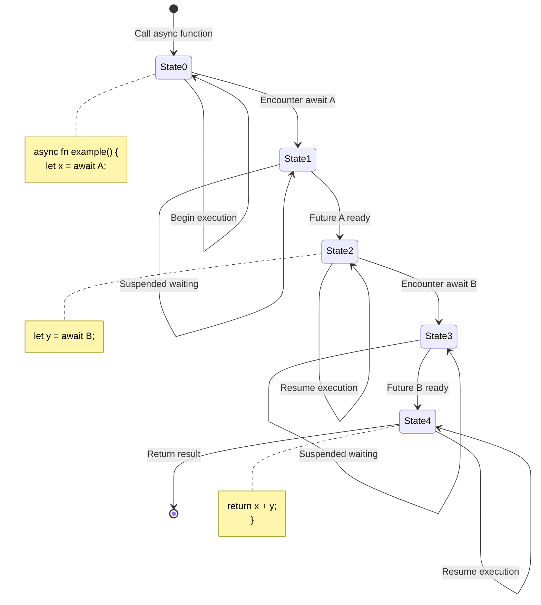
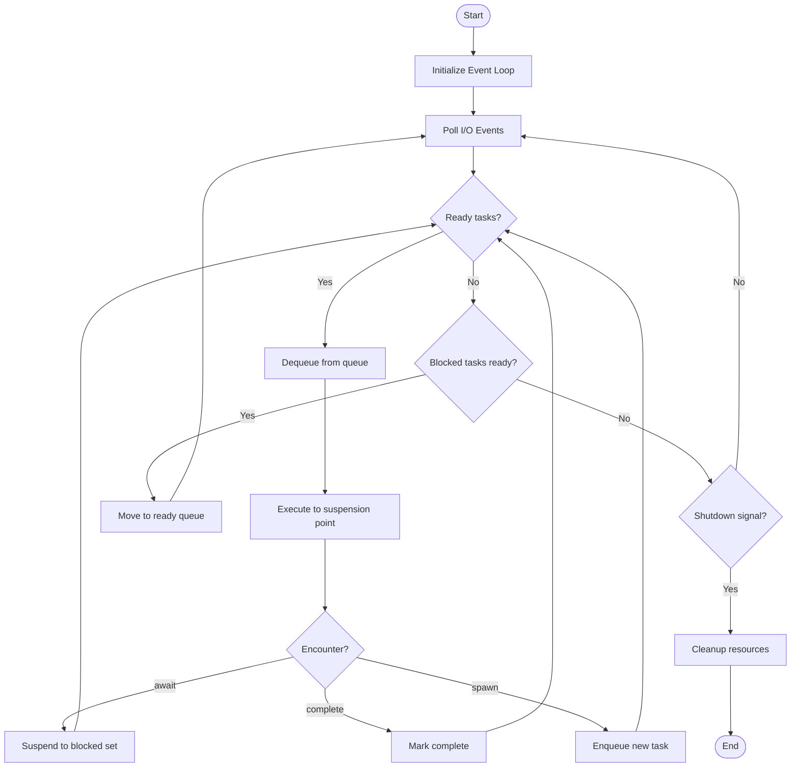

# Asynchronous Processing

> **Unit**: Knowledge/Advanced | **Prerequisites**: [12-advanced-patterns](12-advanced-patterns.md) | **Formalization Level**: L5-L6
>
> This document provides a comprehensive formalization of asynchronous programming semantics, covering async/await mechanisms, Future/Promise models, event loops, and concurrent execution with type systems and formal proofs.

---

## Table of Contents

- [Asynchronous Processing](#asynchronous-processing)
  - [Table of Contents](#table-of-contents)
  - [1. Definitions](#1-definitions)
    - [Def-K-14-01: Asynchronous Computation](#def-k-14-01-asynchronous-computation)
    - [Def-K-14-02: Non-blocking Execution](#def-k-14-02-non-blocking-execution)
    - [Def-K-14-03: Async Function](#def-k-14-03-async-function)
    - [Def-K-14-04: Await Expression](#def-k-14-04-await-expression)
    - [Def-K-14-05: Suspension Point](#def-k-14-05-suspension-point)
    - [Def-K-14-06: Future](#def-k-14-06-future)
    - [Def-K-14-07: Promise](#def-k-14-07-promise)
    - [Def-K-14-08: Event Loop](#def-k-14-08-event-loop)
  - [2. Properties](#2-properties)
    - [Lemma-K-14-01: Continuation Capture](#lemma-k-14-01-continuation-capture)
    - [Lemma-K-14-02: State Machine Generation](#lemma-k-14-02-state-machine-generation)
    - [Lemma-K-14-03: Scheduling Rules](#lemma-k-14-03-scheduling-rules)
  - [3. Relations](#3-relations)
    - [3.1 Async vs Sync Comparison](#31-async-vs-sync-comparison)
    - [3.2 Language Implementations](#32-language-implementations)
  - [4. Argumentation](#4-argumentation)
    - [4.1 Why Async?](#41-why-async)
    - [4.2 Async in Stream Processing](#42-async-in-stream-processing)
  - [5. Proof / Engineering Argument](#5-proof-engineering-argument)
    - [5.1 Determinism of Async Execution](#51-determinism-of-async-execution)
    - [5.2 Type Safety](#52-type-safety)
    - [5.3 Cooperative Cancellation Safety](#53-cooperative-cancellation-safety)
  - [6. Examples](#6-examples)
    - [6.1 Rust Async/Await](#61-rust-asyncawait)
    - [6.2 JavaScript Promise](#62-javascript-promise)
    - [6.3 Async I/O in Stream Processing](#63-async-io-in-stream-processing)
    - [6.4 Protocol State Machine with Types](#64-protocol-state-machine-with-types)
  - [7. Visualizations](#7-visualizations)
    - [7.1 Async/Await State Machine](#71-asyncawait-state-machine)
    - [7.2 Future Lifecycle](#72-future-lifecycle)
    - [7.3 Event Loop Execution Flow](#73-event-loop-execution-flow)
  - [8. References](#8-references)

---

## 1. Definitions

### Def-K-14-01: Asynchronous Computation

**Asynchronous Computation** is a computation mode that allows operations to continue without waiting for completion [^1][^2]:

$$\text{async}: \mathcal{C} \times (\mathcal{R} \to \mathcal{C}') \to \text{Future}(\mathcal{R})$$

Where:

- $\mathcal{C}$: Computation space
- $\mathcal{R}$: Response space
- Callback function $(\mathcal{R} \to \mathcal{C}')$ invoked when operation completes

**Characteristics**:

| Property | Description |
|----------|-------------|
| Concurrency | Multiple operations in progress |
| Non-blocking | Caller not blocked during operation |
| Callback-based | Result delivered via continuation |
| Composable | Futures can be combined and chained |

---

### Def-K-14-02: Non-blocking Execution

**Non-blocking Execution** means the calling thread returns control immediately without waiting for operation completion [^1]:

$$\forall op \in \text{Operations}: \text{spawn}(op) \to \text{Future}(op) \wedge \text{thread\_continue}()$$

**Blocking vs Non-blocking**:

| Aspect | Blocking | Non-blocking |
|--------|----------|--------------|
| Thread usage | Dedicated thread per operation | Shared thread pool |
| Resource efficiency | Low (thread-per-connection) | High (event-driven) |
| Scalability | Limited by thread count | Limited by memory |
| Complexity | Simple | Requires async runtime |

---

### Def-K-14-03: Async Function

An **Async Function** is syntactic sugar for functions returning Futures [^2][^3]:

$$\text{async } f: A \to B \quad \equiv \quad f: A \to \text{Future}(B)$$

**Compilation Transform**:

```rust
// Source: Async function
async fn fetch_data(url: &str) -> Result<String, Error> {
    let response = reqwest::get(url).await?;
    response.text().await
}

// Compiled: State machine
enum FetchDataState {
    Start,
    AfterGet(/* saved locals */),
    Done,
}
```

---

### Def-K-14-04: Await Expression

**Await** is a suspension point marker that unwraps a Future while allowing the current task to yield execution [^2]:

$$\text{await}: \text{Future}(T) \to T \quad \text{(with suspension)}$$

Formally, await triggers continuation registration:

$$\text{await}(f) = \lambda k.\, f.\text{then}(k) \text{ where } k \text{ is the current continuation}$$

**Behavior**:

1. If Future is ready: Resume immediately with value
2. If Future is pending: Suspend task, register continuation
3. When Future completes: Resume with result

---

### Def-K-14-05: Suspension Point

A **Suspension Point** is the location of an await expression in an async function [^2]:

At suspension point:

1. Current state is saved to state machine
2. Execution control returns to scheduler
3. When Future is ready, execution resumes from saved point

$$\text{Suspend}: \text{State} \times \text{Continuation} \to \text{Unit}$$

---

### Def-K-14-06: Future

A **Future** is a placeholder for a computation result that will be available at some point in the future [^1][^3]:

$$\text{Future}(T) = \{\text{Pending}\} \cup \{\text{Ready}(v) \mid v \in T\} \cup \{\text{Error}(e) \mid e \in \text{Exception}\}$$

**State Transitions**:

```
Pending --(complete)--> Ready(v)
      \               /
       ---(error)--> Error(e)
```

**Future Combinators** [^3]:

| Combinator | Type | Description |
|------------|------|-------------|
| `then` | $\text{Future}(A) \times (A \to B) \to \text{Future}(B)$ | Mapping |
| `join` | $\text{Future}(\text{Future}(A)) \to \text{Future}(A)$ | Flattening |
| `race` | $\text{Future}(A) \times \text{Future}(B) \to \text{Future}(A + B)$ | Competition |
| `all` | $\text{List}(\text{Future}(A)) \to \text{Future}(\text{List}(A))$ | Collect all |

---

### Def-K-14-07: Promise

A **Promise** is the writable side of a Future, providing the ability to complete the Future [^1]:

$$\text{Promise}(T) = \{\text{write}: T \to \text{Unit}, \text{reject}: \text{Exception} \to \text{Unit}\}$$

**Duality**: Promise is the producer, Future is the consumer.

```
Promise ----writes----> Future ----awaits----> Consumer
   |                        |
   └────────creates─────────┘
```

---

### Def-K-14-08: Event Loop

An **Event Loop** is a runtime component that manages asynchronous task execution [^4]:

$$\text{EventLoop} = \langle \text{Queue}, \text{Scheduler}, \text{Poller} \rangle$$

Where:

- $\text{Queue}$: Ready task queue
- $\text{Scheduler}$: Task selection strategy
- $\text{Poller}$: I/O event poller

**Task Queue**:

$$Q = [t_1, t_2, \ldots, t_n] \quad \text{where } t_i \in \text{Task}$$

Operations: $\text{enqueue}: Q \times \text{Task} \to Q'$ and $\text{dequeue}: Q \to (\text{Task} \times Q')$

---

## 2. Properties

### Lemma-K-14-01: Continuation Capture

**Statement**: When execution reaches an await expression, the current continuation is captured:

$$\frac{e = E[\text{await}(f)] \quad f = \text{future}(h)}{\langle e, K \rangle \to \langle \text{suspend}, K' \rangle}$$

Where $K' = \text{cont}(\lambda v.E[v], K)$ is the captured continuation.

---

### Lemma-K-14-02: State Machine Generation

**Statement**: Given an async function body, each await expression corresponds to a state transition.

**Example**:

```rust
async fn foo() {
    let x = await a;   // → State 0: Start
    let y = await b;   // → State 1: After a
    return x + y;      // → State 2: After b
}                      // → State 3: Done
```

Transition function:

$$
\delta(s, e) = \begin{cases}
1 & \text{if } s = 0 \wedge e = \text{Future}(a).\text{Ready} \\
2 & \text{if } s = 1 \wedge e = \text{Future}(b).\text{Ready} \\
\text{Done} & \text{if } s = 2 \\
\text{Error} & \text{if } e = \text{Exception}
\end{cases}
$$

---

### Lemma-K-14-03: Scheduling Rules

**Statement**: The scheduler maintains three sets:

- ReadyQueue: Tasks ready to execute
- BlockedSet: Tasks waiting for I/O
- Current: Currently executing task

**Transition Rules**:

$$\frac{\tau \in \text{ReadyQueue}}{\Sigma \to \Sigma[\text{Current} := \tau, \text{ReadyQueue} := \text{ReadyQueue} \setminus \{\tau\}]}$$

$$\frac{\text{Current} = \tau \wedge \tau \text{ reaches await}}{\Sigma \to \Sigma[\text{Current} := \bot, \text{BlockedSet} := \text{BlockedSet} \cup \{\tau\}]}$$

$$\frac{f \in \text{BlockedSet} \wedge f.\text{isReady}()}{\Sigma \to \Sigma[\text{ReadyQueue} := \text{ReadyQueue} \cup \{f\}, \text{BlockedSet} := \text{BlockedSet} \setminus \{f\}]}$$

---

## 3. Relations

### 3.1 Async vs Sync Comparison

```
┌─────────────────┬──────────────────┬──────────────────┐
│     Aspect      │    Synchronous   │   Asynchronous   │
├─────────────────┼──────────────────┼──────────────────┤
│ Thread Usage    │ 1 per operation  │ Shared pool      │
│ Memory/Conn     │ High             │ Low              │
│ Latency         │ Sum of all ops   │ Max of all ops   │
│ Complexity      │ Low              │ High             │
│ Debuggability   │ Stack traces     │ Callback chains  │
│ Scalability     │ Limited          │ High             │
└─────────────────┴──────────────────┴──────────────────┘
```

### 3.2 Language Implementations

| Language | Async Primitive | Runtime | Notable Features |
|----------|-----------------|---------|------------------|
| Rust | async/await | Tokio/async-std | Zero-cost, Pin for self-reference |
| JavaScript | Promise/async-await | Event Loop | Single-threaded, microtasks |
| Python | asyncio | Event Loop | Generator-based, 3.5+ syntax |
| Java | CompletableFuture | ForkJoinPool | CompletionStage API |
| C# | async/await | Task Parallel Library | Built into language |
| Go | goroutines+channels | M:N scheduler | Lightweight threads |

---

## 4. Argumentation

### 4.1 Why Async?

**The C10K Problem** [^4]:

- Traditional threaded servers: 1 thread per connection
- Context switch overhead becomes bottleneck at ~10K connections
- Memory usage: ~1MB stack per thread = 10GB for 10K connections

**Async Solution**:

- Single-threaded event loop handles all connections
- No context switch overhead
- Memory usage: ~1KB per connection = 10MB for 10K connections

**Trade-offs**:

| Metric | Threaded | Async |
|--------|----------|-------|
| 10K connections | ~10GB RAM | ~10MB RAM |
| CPU efficiency | Low (context switches) | High |
| Code complexity | Low | High |
| Debugging | Easy | Hard |
| Blocking calls | Safe | Deadlock risk |

### 4.2 Async in Stream Processing

**Use Cases in Flink** [^5]:

1. **Async I/O for Data Enrichment**
   - Query external databases without blocking stream processing
   - Maintain high throughput while waiting for responses

2. **Async Checkpointing**
   - Snapshot state without pausing processing
   - Incremental checkpoints in background

3. **Async Sink Writers**
   - Batch and async flush to external systems
   - Maximize throughput with buffering

---

## 5. Proof / Engineering Argument

### 5.1 Determinism of Async Execution

**Theorem Thm-K-14-01**: In a single-threaded event loop, given identical initial state and input sequence, async program execution is deterministic.

**Proof**:

Let event loop $L$ scheduling state be $\Sigma = \langle Q, B, c \rangle$ where:

- $Q$: Ready queue
- $B$: Blocked set
- $c$: Current executing task

**Lemma 1**: Ready queue is deterministic

Given same initial $Q_0$ and event sequence $E = [e_1, \ldots, e_n]$, the queue $Q$ after each poll is deterministic.

*Proof*: Each event $e_i$ either moves a task from $B$ to $Q$ (when Future ready) or leaves it unchanged. Since event readiness is determined by I/O, with same I/O event sequence, $Q$ evolution is deterministic.

**Lemma 2**: Single task execution is deterministic

An async task without races executes deterministically.

*Proof*: Async tasks are compiled to deterministic state machines $\mathcal{M}$. State transition $\delta(s, e)$ is fully determined by current state and event $e$. Without external interference, path from $s$ to $s'$ is unique.

**Main Proof**:

By induction on execution step count $n$:

**Base**: $n = 0$, initial state $\Sigma_0$ given, obviously deterministic.

**Inductive Hypothesis**: After $k$ steps, state $\Sigma_k$ is deterministic.

**Inductive Step**: Step $k+1$:

1. Select next task: $\tau = \text{dequeue}(Q_k)$. Since $Q_k$ is FIFO and deterministic by Lemma 1, $\tau$ is determined.
2. Execute until next suspension: Task $\tau$ executes until await or completion. By Lemma 2, this execution is deterministic, producing new state $s'$ and possible side effects.
3. Update queues based on execution result.
4. Process I/O events: Check poller, move ready tasks from $B$ to $Q$.

All steps are deterministic functions, therefore $\Sigma_{k+1}$ is deterministic.

By mathematical induction, execution is deterministic. ∎

**Corollary**: In multi-threaded runtimes, non-determinism only comes from:

1. Inter-thread scheduling order
2. Shared state access under race conditions

### 5.2 Type Safety

**Theorem Thm-K-14-02**: Well-typed async programs do not have type errors at producer-consumer interfaces.

**Proof**:

**Definition**: Promise write type $T$ and Future read type $T$ are consistent:

$$\text{Promise}(T) \times \text{Future}(T) \to \text{TypeSafe}$$

**Lemma 1**: Promise/Future type matching

When Promise $p: \text{Promise}(T)$ and Future $f: \text{Future}(T')$ are paired:

- $T = T' \implies \text{safe}$
- $T \neq T' \implies \text{type\_error}$

*Proof*: By type system rules T-Async and T-Await, Future type is recorded at creation and checked at await. Type mismatch is rejected at compile time.

**Lemma 2**: CPS transform preserves types

Async/await to CPS transformation preserves types:

$$\frac{\Gamma \vdash e : T}{\Gamma \vdash \llbracket e \rrbracket_k : T'}$$

Where $T'$ is the continuation result type.

*Proof*:

- For $\text{await}(e)$: $e : \text{Future}(T)$, $k: T \to T'$, therefore $e.\text{then}(k): \text{Future}(T')$, type preserved.
- For other expressions: Standard CPS transform preserves types.

**Main Proof**: By structural induction on derivation tree height. ∎

### 5.3 Cooperative Cancellation Safety

**Theorem Thm-K-14-03**: Async tasks following cooperative cancellation patterns do not leak resources or exhibit undefined behavior when cancelled.

**Proof**:

**Definition**: Task $\tau$ is cancellation-safe if:

1. Releases all acquired resources after cancellation
2. Does not leave inconsistent state
3. Cancellation can be detected and handled

Consider cooperative cancellation task $\tau$:

```
task τ:
    acquire_resource(r1)
    await checkpoint1  // cancellation check
    if cancelled: goto cleanup

    acquire_resource(r2)
    await checkpoint2  // cancellation check
    if cancelled: goto cleanup

    process()

cleanup:
    release(r2)
    release(r1)
    return Cancelled
```

**Case 1**: Cancelled at checkpoint1

- Cancellation flag detected
- Jump to cleanup
- Only r1 acquired, release r1
- No resource leak

**Case 2**: Cancelled at checkpoint2

- Both r1 and r2 acquired
- Jump to cleanup
- Release r2 then r1
- No resource leak

In all cases, acquired resources are released on cancellation paths. ∎

---

## 6. Examples

### 6.1 Rust Async/Await

```rust
use tokio::time::{sleep, Duration};

// Def-K-14-03: Async function returns Future
async fn fetch_data(url: &str) -> Result<String, Error> {
    // Def-K-14-05: await is suspension point
    let response = reqwest::get(url).await?;
    let data = response.text().await?;
    Ok(data)
}

# [tokio::main]
async fn main() {
    // Def-K-14-04: await unwraps Future
    match fetch_data("https://api.example.com").await {
        Ok(data) => println!("{}", data),
        Err(e) => eprintln!("Error: {}", e),
    }
}
```

**Concurrent Execution**:

```rust
use futures::future::join_all;

async fn fetch_multiple(urls: Vec<&str>) -> Vec<Result<String, Error>> {
    // Def-K-14-06: Create multiple Futures
    let futures: Vec<_> = urls
        .into_iter()
        .map(|url| fetch_data(url))
        .collect();

    // Def-K-14-06: all combinator waits for all
    join_all(futures).await
}

// Race combinator example
use futures::future::select;

async fn with_timeout<T>(
    future: impl Future<Output = T>,
    duration: Duration
) -> Result<T, TimeoutError> {
    let timeout = sleep(duration);

    // Def-K-14-06: race combinator
    match select(future, timeout).await {
        Either::Left((result, _)) => Ok(result),
        Either::Right((_, _)) => Err(TimeoutError),
    }
}
```

### 6.2 JavaScript Promise

```javascript
// Def-K-14-06: Promise constructor
const promise = new Promise((resolve, reject) => {
    setTimeout(() => {
        resolve('Data loaded');  // Def-K-14-07: Promise write
    }, 1000);
});

// Def-K-14-06: then combinator
promise.then(value => {
    console.log(value);  // 'Data loaded'
    return processData(value);
}).then(result => {
    console.log(result);
}).catch(error => {
    console.error(error);
});

// Def-K-14-03: async function
async function fetchUserData(userId) {
    try {
        // Def-K-14-04: await expression
        const response = await fetch(`/api/users/${userId}`);
        const user = await response.json();
        return user;
    } catch (error) {
        console.error('Failed to fetch user:', error);
        throw error;
    }
}

// Def-K-14-06: Parallel execution
async function fetchMultipleUsers(ids) {
    const promises = ids.map(id => fetchUserData(id));
    // Def-K-14-06: Promise.all = all combinator
    return await Promise.all(promises);
}
```

### 6.3 Async I/O in Stream Processing

```rust
use tokio::net::{TcpListener, TcpStream};
use tokio::io::{AsyncReadExt, AsyncWriteExt};

// Thm-K-14-01: Deterministic execution guarantee
async fn handle_connection(mut stream: TcpStream) -> Result<(), Error> {
    let mut buffer = [0; 1024];

    // Non-blocking read
    let n = stream.read(&mut buffer).await?;

    // Process request
    let response = process_request(&buffer[..n]);

    // Non-blocking write
    stream.write_all(response.as_bytes()).await?;

    Ok(())
}

# [tokio::main]
async fn main() -> Result<(), Error> {
    let listener = TcpListener::bind("127.0.0.1:8080").await?;

    loop {
        let (stream, _) = listener.accept().await?;

        // Spawn new task per connection
        // Def-K-14-08: Task creation
        tokio::spawn(async move {
            if let Err(e) = handle_connection(stream).await {
                eprintln!("Connection error: {}", e);
            }
        });
    }
}
```

### 6.4 Protocol State Machine with Types

```rust
// Use type system to encode protocol states
use std::marker::PhantomData;

// State markers
struct Init;
struct Connected;
struct Authenticated;

// Def-K-14-03: State encoded in types
struct Connection<State> {
    socket: TcpStream,
    _state: PhantomData<State>,
}

impl Connection<Init> {
    async fn connect(addr: &str) -> Result<Connection<Connected>, Error> {
        let socket = TcpStream::connect(addr).await?;
        Ok(Connection {
            socket,
            _state: PhantomData,
        })
    }
}

impl Connection<Connected> {
    async fn authenticate(
        self,
        creds: Credentials
    ) -> Result<Connection<Authenticated>, Error> {
        send_credentials(&self.socket, &creds).await?;
        let response = read_response(&self.socket).await?;

        if response.success {
            Ok(Connection {
                socket: self.socket,
                _state: PhantomData,
            })
        } else {
            Err(Error::AuthFailed)
        }
    }
}

impl Connection<Authenticated> {
    async fn send_data(&mut self, data: &[u8]) -> Result<(), Error> {
        // Only authenticated connections can send data
        self.socket.write_all(data).await
    }
}

// Usage: Compiler enforces correct order
async fn workflow() -> Result<(), Error> {
    let conn = Connection::connect("server:8080").await?;
    let conn = conn.authenticate(creds).await?;
    // conn.send_data(b"data").await?; // Compile error: not authenticated

    let mut auth_conn = conn;
    auth_conn.send_data(b"secure data").await?; // OK
    Ok(())
}
```

---

## 7. Visualizations

### 7.1 Async/Await State Machine



### 7.2 Future Lifecycle

```mermaid
stateDiagram-v2
    [*] --> Pending : Future::new()
    Pending --> Pending : poll() returns Pending
    Pending --> Ready : Computation complete
    Pending --> Cancelled : Cancellation request
    Ready --> [*] : await retrieves value
    Cancelled --> [*] : Cleanup resources

    Ready : Ready(T)
    Cancelled : Cancelled

    note right of Pending
        Waiting for external event:
        - I/O completion
        - Timeout
        - Signal
    end note
```

### 7.3 Event Loop Execution Flow



---

## 8. References

[^1]: M. Felleisen et al., "On the Expressive Power of Programming Languages," *Science of Computer Programming*, 1991.

[^2]: Rust Async Book, "Asynchronous Programming in Rust," 2025. <https://rust-lang.github.io/async-book/>

[^3]: ECMAScript Specification, "Promise Objects," ECMA-262, 2025.

[^4]: D. P. Reed, "Architectural Directions for Application-level Communication," MIT LCS TR, 1983.

[^5]: Apache Flink Documentation, "Async I/O," 2025. <https://nightlies.apache.org/flink/flink-docs-stable/docs/dev/datastream/operators/asyncio/>

---

*Document Version: v1.0 | Last Updated: 2026-04-10 | Status: Complete*
