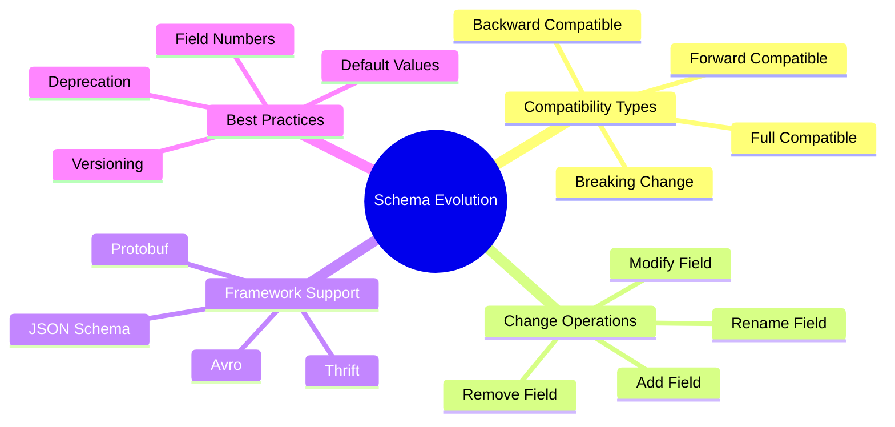
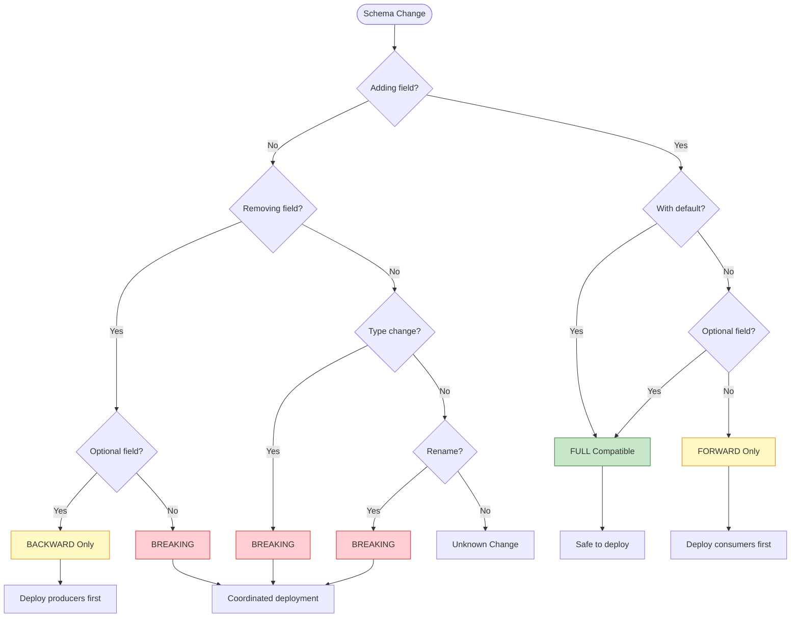
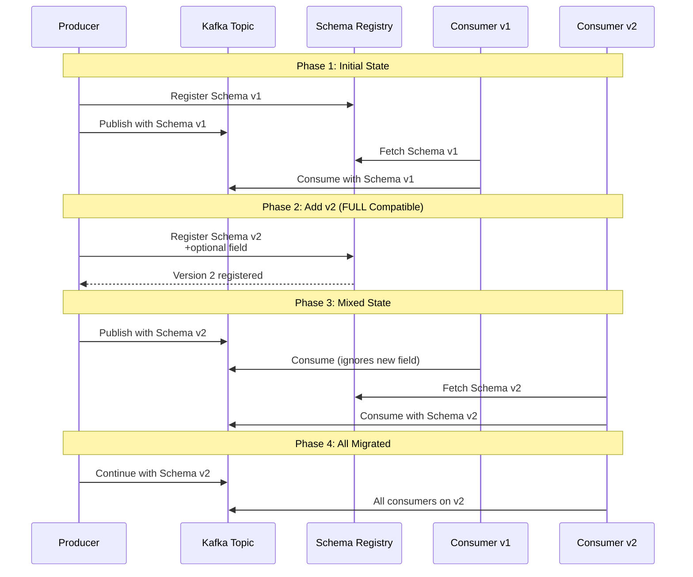

# Schema Evolution

> **Unit**: Knowledge/Advanced | **Prerequisites**: [02-dataflow-model](02-dataflow-model.md) | **Formalization Level**: L4-L5
>
> This document presents comprehensive schema evolution strategies for streaming systems, covering compatibility rules, migration patterns, serialization frameworks, and production best practices for evolving data schemas without breaking downstream consumers.

---

## Table of Contents

- [Schema Evolution](#schema-evolution)
  - [Table of Contents](#table-of-contents)
  - [1. Definitions](#1-definitions)
    - [Def-K-15-01: Schema](#def-k-15-01-schema)
    - [Def-K-15-02: Schema Version](#def-k-15-02-schema-version)
    - [Def-K-15-03: Schema Compatibility](#def-k-15-03-schema-compatibility)
    - [Def-K-15-04: Forward Compatibility](#def-k-15-04-forward-compatibility)
    - [Def-K-15-05: Backward Compatibility](#def-k-15-05-backward-compatibility)
    - [Def-K-15-06: Full Compatibility](#def-k-15-06-full-compatibility)
  - [2. Properties](#2-properties)
    - [Prop-K-15-01: Compatibility Transitivity](#prop-k-15-01-compatibility-transitivity)
    - [Lemma-K-15-01: Default Value Preservation](#lemma-k-15-01-default-value-preservation)
    - [Prop-K-15-02: Union Type Compatibility](#prop-k-15-02-union-type-compatibility)
  - [3. Relations](#3-relations)
    - [3.1 Compatibility Matrix](#31-compatibility-matrix)
    - [3.2 Serialization Framework Comparison](#32-serialization-framework-comparison)
  - [4. Argumentation](#4-argumentation)
    - [4.1 Why Schema Evolution Matters](#41-why-schema-evolution-matters)
    - [4.2 Breaking Change Detection](#42-breaking-change-detection)
  - [5. Proof / Engineering Argument](#5-proof--engineering-argument)
    - [5.1 Compatibility Rules Formalization](#51-compatibility-rules-formalization)
    - [5.2 Schema Registry Contract](#52-schema-registry-contract)
  - [6. Examples](#6-examples)
    - [6.1 Avro Schema Evolution](#61-avro-schema-evolution)
    - [6.2 Protobuf Schema Evolution](#62-protobuf-schema-evolution)
    - [6.3 Kafka Schema Registry](#63-kafka-schema-registry)
    - [6.4 Flink Table API Schema Evolution](#64-flink-table-api-schema-evolution)
  - [7. Visualizations](#7-visualizations)
    - [7.1 Schema Evolution Types](#71-schema-evolution-types)
    - [7.2 Compatibility Decision Tree](#72-compatibility-decision-tree)
    - [7.3 Schema Migration Flow](#73-schema-migration-flow)
  - [8. References](#8-references)

---

## 1. Definitions

### Def-K-15-01: Schema

A **Schema** $S$ is a formal specification of data structure that defines the organization, types, and constraints of data records [^1][^2]:

$$S = (F, T, C, M)$$

Where:

- $F$: Set of fields $\{f_1, f_2, \ldots, f_n\}$
- $T: F \to \text{Types}$: Type assignment function
- $C$: Set of constraints (nullability, defaults, etc.)
- $M$: Metadata (documentation, logical types, etc.)

**Schema as Function**:

$$S: \text{Record} \to \{\text{Valid}, \text{Invalid}\}$$

A record $r$ is valid under schema $S$ if it satisfies all constraints:

$$\text{Valid}_S(r) \iff \forall f \in F: \text{type}(r[f]) = T(f) \land \text{satisfies}(r, C)$$

---

### Def-K-15-02: Schema Version

A **Schema Version** is an immutable snapshot of a schema at a point in time [^1]:

$$V_S = (S, vid, t_{created}, parent)$$

Where:

- $S$: The schema definition
- $vid \in \mathbb{N}$: Version identifier
- $t_{created}$: Creation timestamp
- $parent$: Reference to previous version (or null for initial)

**Version Sequence**:

$$\text{SchemaHistory} = [V_{S_1}, V_{S_2}, \ldots, V_{S_n}]$$

Where each $V_{S_{i+1}}$ is derived from $V_{S_i}$ through a schema change operation.

---

### Def-K-15-03: Schema Compatibility

**Schema Compatibility** defines whether data written with one schema can be read with another [^2][^3]:

$$\text{Compatible}(S_{write}, S_{read}, mode) \in \{\text{true}, \text{false}\}$$

Where $mode \in \{\text{FORWARD}, \text{BACKWARD}, \text{FULL}\}$.

**Compatibility Relation**:

$$S_1 \sim_\alpha S_2 \iff \text{Compatible}(S_1, S_2, \alpha) = \text{true}$$

---

### Def-K-15-04: Forward Compatibility

**Forward Compatibility** means data written with a new schema can be read by consumers using the old schema [^2]:

$$\text{ForwardCompatible}(S_{old}, S_{new}) \iff \forall r: \text{Valid}_{S_{new}}(r) \implies \text{Readable}_{S_{old}}(r)$$

**Reading Rule**: New fields are ignored by old consumers (unknown field handling).

**Achieved by**:

- Adding optional fields with defaults
- Removing required fields (degraded to optional)

---

### Def-K-15-05: Backward Compatibility

**Backward Compatibility** means data written with an old schema can be read by consumers using the new schema [^2]:

$$\text{BackwardCompatible}(S_{old}, S_{new}) \iff \forall r: \text{Valid}_{S_{old}}(r) \implies \text{Readable}_{S_{new}}(r)$$

**Reading Rule**: Missing fields are populated with default values.

**Achieved by**:

- Adding required fields with defaults
- Removing optional fields

---

### Def-K-15-06: Full Compatibility

**Full Compatibility** (Backward + Forward) means schemas are compatible in both directions [^2]:

$$\text{FullyCompatible}(S_{old}, S_{new}) \iff \text{ForwardCompatible}(S_{old}, S_{new}) \land \text{BackwardCompatible}(S_{old}, S_{new})$$

**Requirements**:

- Only add optional fields with defaults
- Never remove fields without deprecation period
- Never change field types (use union types instead)

---

## 2. Properties

### Prop-K-15-01: Compatibility Transitivity

**Statement**: Compatibility relations are transitive under certain conditions:

$$S_1 \sim S_2 \land S_2 \sim S_3 \implies S_1 \sim S_3$$

**Conditions**:

1. Changes are monotonic (only additions or only removals)
2. Default values are consistent across versions
3. No field renaming in intermediate versions

**Proof Sketch**:

If $S_1 \to S_2$ adds optional field $f$ with default $d$, and $S_2 \to S_3$ adds optional field $g$ with default $d'$:

- Records written with $S_3$ contain $f$ and $g$
- $S_1$ readers ignore both $f$ and $g$ → forward compatible
- $S_3$ readers apply defaults for missing $f$ and $g$ → backward compatible ∎

---

### Lemma-K-15-01: Default Value Preservation

**Statement**: When a schema change adds a field with default value $d$, the semantics of existing records is preserved:

$$\forall r: \text{Valid}_{S_{old}}(r) \implies \text{semantics}_{S_{new}}(r \cup \{f: d\}) = \text{semantics}_{S_{old}}(r)$$

**Proof**: The new field $f$ does not affect existing fields, and its default value $d$ represents the "absence" semantic. ∎

---

### Prop-K-15-02: Union Type Compatibility

**Statement**: Union types provide evolution flexibility by allowing multiple types for a field:

$$T_{new} = \text{union}(T_{old}, T_{additional})$$

**Compatibility**: Union expansion is backward compatible (old data fits first type), but not forward compatible (new data may use additional type).

---

## 3. Relations

### 3.1 Compatibility Matrix

```
┌──────────────────────┬──────────┬───────────┬──────────┐
│     Change Type      │ Backward │  Forward  │   Full   │
├──────────────────────┼──────────┼───────────┼──────────┤
│ Add optional field   │    ✅    │    ✅     │   ✅     │
│ Add required field   │    ❌    │    ✅     │   ❌     │
│ Remove optional field│    ✅    │    ❌     │   ❌     │
│ Remove required field│    ❌    │    ❌     │   ❌     │
│ Change field type    │    ❌    │    ❌     │   ❌     │
│ Rename field         │    ❌    │    ❌     │   ❌     │
│ Add default to field │    ✅    │    ✅     │   ✅     │
│ Promote to union     │    ✅    │    ❌     │   ❌     │
└──────────────────────┴──────────┴───────────┴──────────┘
```

### 3.2 Serialization Framework Comparison

| Feature | Avro | Protobuf | JSON Schema | Thrift |
|---------|------|----------|-------------|--------|
| Schema Evolution | ✅ Excellent | ✅ Excellent | ⚠️ Limited | ✅ Good |
| Forward Compatibility | ✅ | ✅ | ⚠️ | ✅ |
| Backward Compatibility | ✅ | ✅ | ⚠️ | ✅ |
| Binary Size | Compact | Very Compact | Verbose | Compact |
| Schema Registry | Required | Optional | Optional | Optional |
| Default Values | ✅ | ✅ | ⚠️ | ✅ |
| Field Aliases | ✅ | ❌ | ❌ | ❌ |
| Union Types | ✅ | ✅ (oneof) | ✅ | ✅ |

---

## 4. Argumentation

### 4.1 Why Schema Evolution Matters

**The Problem**:

In streaming systems, producers and consumers are often decoupled and deployed independently. Schema changes can cause:

1. **Deserialization Failures**: Unknown fields, missing required fields
2. **Semantic Drift**: Same field name, different meaning
3. **Pipeline Breakage**: Downstream jobs fail to process data
4. **Data Loss**: Incompatible changes drop records

**The Cost of Breaking Changes**:

```
Scenario: Breaking schema change without coordination

Producer Team                    Consumer Team
     │                                │
     ▼                                ▼
 Deploy v2                      Still running v1
 (adds required field)          (expects old schema)
     │                                │
     └──► Kafka Topic ◄───────────────┤
              │
              ▼
     ┌─────────────────┐
     │ Deserialization │
     │     ERROR       │
     │ Field "newField"│
     │ not found       │
     └─────────────────┘
              │
              ▼
         Data Loss
    (Records dropped)
```

**Benefits of Schema Evolution**:

| Benefit | Description |
|---------|-------------|
| Independent Deployment | Producers and consumers evolve at different paces |
| Zero Downtime | No coordinated deployment required |
| Backward Investigation | Historical data readable with new code |
| Rollback Safety | Can revert to previous version |

### 4.2 Breaking Change Detection

**Automated Detection Rules** [^3]:

```
Breaking Change Indicators:
├── Type System Violations
│   ├── Required field removed
│   ├── Field type changed
│   └── Enum value removed
├── Semantic Violations
│   ├── Field renamed (without alias)
│   ├── Default value changed
│   └── Logical type changed
└── Structural Violations
    ├── Nested structure flattened
    └── Field order significance (for positional formats)
```

**CI/CD Integration**:

```yaml
# GitHub Actions example
schema-compatibility-check:
  steps:
    - name: Check Backward Compatibility
      run: |
        schema-registry check-compatibility \
          --subject orders-value \
          --schema-file new-schema.avsc \
          --type BACKWARD

    - name: Check Forward Compatibility
      run: |
        schema-registry check-compatibility \
          --subject orders-value \
          --schema-file new-schema.avsc \
          --type FORWARD
```

---

## 5. Proof / Engineering Argument

### 5.1 Compatibility Rules Formalization

**Rule System for Avro-like Schemas**:

```
[Add-Optional-Field]
───────────────────────────────────────────────
S → S ∪ {f: optional(T, default=d)} is FULL

[Add-Required-Field]
───────────────────────────────────────────────
S → S ∪ {f: required(T)} is FORWARD only

[Remove-Optional-Field]
───────────────────────────────────────────────
S → S \\ {f: optional(T)} is BACKWARD only

[Remove-Required-Field]
───────────────────────────────────────────────
S → S \\ {f: required(T)} is BREAKING

[Change-Type]
───────────────────────────────────────────────
S[f: T] → S[f: T'] is BREAKING (unless T' ⊇ T)
```

**Theorem**: The above rules are sound and complete for determining Avro schema compatibility.

**Proof Sketch**:

Soundness: Each rule encodes the semantic requirements for the corresponding change type.

Completeness: Any schema change can be decomposed into a sequence of field additions, removals, and type changes. ∎

### 5.2 Schema Registry Contract

**Schema Registry Guarantees** [^3]:

1. **Uniqueness**: Each schema version has a unique ID
2. **Immutability**: Registered schemas cannot be modified
3. **Compatibility Enforcement**: New schemas must satisfy configured compatibility mode
4. **Lookup**: Efficient retrieval by subject and version

**Formal Contract**:

```
register(subject, schema, mode):
  Pre:  schema is valid
        ∀v ∈ versions(subject): compatible(schema, v, mode)
  Post: schema ∈ versions(subject)
        version(schema) = max(versions(subject)) + 1

lookup(subject, version):
  Pre:  version ∈ versions(subject) ∨ version = "latest"
  Post: returns schema with given version
```

---

## 6. Examples

### 6.1 Avro Schema Evolution

**Initial Schema (v1)**:

```json
{
  "type": "record",
  "name": "Order",
  "fields": [
    {"name": "orderId", "type": "string"},
    {"name": "amount", "type": "double"},
    {"name": "customerId", "type": "string"}
  ]
}
```

**Evolved Schema (v2) - Add Optional Field**:

```json
{
  "type": "record",
  "name": "Order",
  "fields": [
    {"name": "orderId", "type": "string"},
    {"name": "amount", "type": "double"},
    {"name": "customerId", "type": "string"},
    {
      "name": "discountCode",
      "type": ["null", "string"],
      "default": null
    }
  ]
}
```

**Compatibility**: FULL (both backward and forward)

**Evolved Schema (v3) - Add Required Field with Default**:

```json
{
  "type": "record",
  "name": "Order",
  "fields": [
    {"name": "orderId", "type": "string"},
    {"name": "amount", "type": "double"},
    {"name": "customerId", "type": "string"},
    {
      "name": "discountCode",
      "type": ["null", "string"],
      "default": null
    },
    {
      "name": "currency",
      "type": "string",
      "default": "USD"
    }
  ]
}
```

**Compatibility**: BACKWARD (old data readable), NOT FORWARD (new field required in old readers)

### 6.2 Protobuf Schema Evolution

**Initial Schema (v1)**:

```protobuf
syntax = "proto3";

message Order {
  string order_id = 1;
  double amount = 2;
  string customer_id = 3;
}
```

**Evolved Schema (v2)**:

```protobuf
syntax = "proto3";

message Order {
  string order_id = 1;
  double amount = 2;
  string customer_id = 3;
  string discount_code = 4;  // New optional field
  string currency = 5;        // New optional field
}
```

**Best Practices**:

1. Never reuse field numbers
2. Reserve deleted field numbers:

   ```protobuf
   message Order {
     reserved 6;  // Field number reserved for future use
     reserved "old_field_name";  // Name reserved
     // ...
   }
   ```

### 6.3 Kafka Schema Registry

**Register Schema**:

```bash
# Register new schema
curl -X POST http://schema-registry:8081/subjects/orders-value/versions \
  -H "Content-Type: application/vnd.schemaregistry.v1+json" \
  -d '{
    "schema": "{\"type\":\"record\",\"name\":\"Order\",...}"
  }'
```

**Check Compatibility**:

```bash
# Check compatibility before registering
curl -X POST http://schema-registry:8081/compatibility/subjects/orders-value/versions/latest \
  -H "Content-Type: application/vnd.schemaregistry.v1+json" \
  -d '{
    "schema": "{...new schema...}"
  }'
```

**Configure Compatibility Mode**:

```bash
# Set FULL compatibility requirement
curl -X PUT http://schema-registry:8081/config/orders-value \
  -H "Content-Type: application/vnd.schemaregistry.v1+json" \
  -d '{"compatibility": "FULL"}'
```

**Java Producer with Schema Registry**:

```java
Properties props = new Properties();
props.put("bootstrap.servers", "kafka:9092");
props.put("key.serializer", "org.apache.kafka.common.serialization.StringSerializer");
props.put("value.serializer", "io.confluent.kafka.serializers.KafkaAvroSerializer");
props.put("schema.registry.url", "http://schema-registry:8081");

Producer<String, GenericRecord> producer = new KafkaProducer<>(props);

// Schema automatically registered and validated
GenericRecord order = new GenericData.Record(schema);
order.put("orderId", "ORD-123");
order.put("amount", 99.99);
order.put("customerId", "CUST-456");

producer.send(new ProducerRecord<>("orders", order.get("orderId").toString(), order));
```

### 6.4 Flink Table API Schema Evolution

**Schema Definition**:

```java
// Define table with schema evolution support
TableDescriptor sourceDescriptor = TableDescriptor
    .forConnector("kafka")
    .schema(Schema.newBuilder()
        .column("order_id", DataTypes.STRING())
        .column("amount", DataTypes.DOUBLE())
        .column("customer_id", DataTypes.STRING())
        .column("discount_code", DataTypes.STRING().nullable())  // Added field
        .column("currency", DataTypes.STRING().defaultValue("USD"))  // Added with default
        .build())
    .option("topic", "orders")
    .option("format", "avro-confluent")
    .option("avro-confluent.schema-registry.url", "http://schema-registry:8081")
    .build();

tableEnv.createTable("Orders", sourceDescriptor);
```

**Handling Schema Changes**:

```java
// Read with evolved schema
Table orders = tableEnv.from("Orders");

// Missing fields will use defaults
Table result = orders
    .select(
        $("order_id"),
        $("amount"),
        // New field may be null for old records
        coalesce($("discount_code"), lit("NONE")).as("discount_code"),
        // Default value applied for old records
        $("currency")
    );
```

---

## 7. Visualizations

### 7.1 Schema Evolution Types



### 7.2 Compatibility Decision Tree



### 7.3 Schema Migration Flow



---

## 8. References

[^1]: Apache Avro Specification, "Schema Resolution," 2025. <https://avro.apache.org/docs/current/specification/#schema-resolution>

[^2]: Google Protocol Buffers, "Updating A Message Type," 2025. <https://developers.google.com/protocol-buffers/docs/proto3#updating>

[^3]: Confluent Schema Registry, "Schema Evolution and Compatibility," 2025. <https://docs.confluent.io/platform/current/schema-registry/avro.html>


---

*Document Version: v1.0 | Last Updated: 2026-04-10 | Status: Complete*
