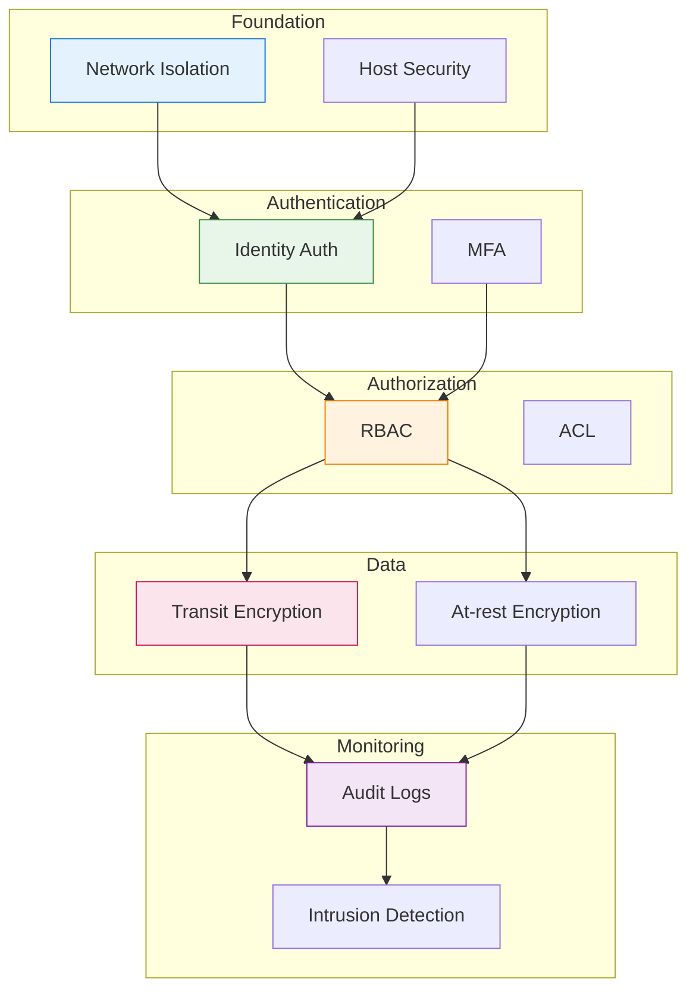
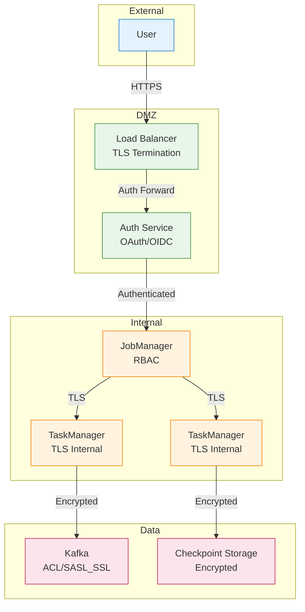
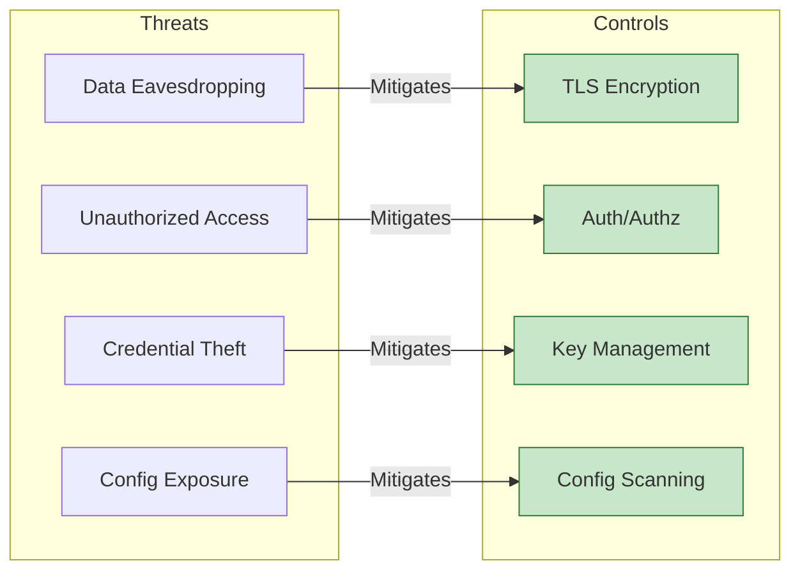
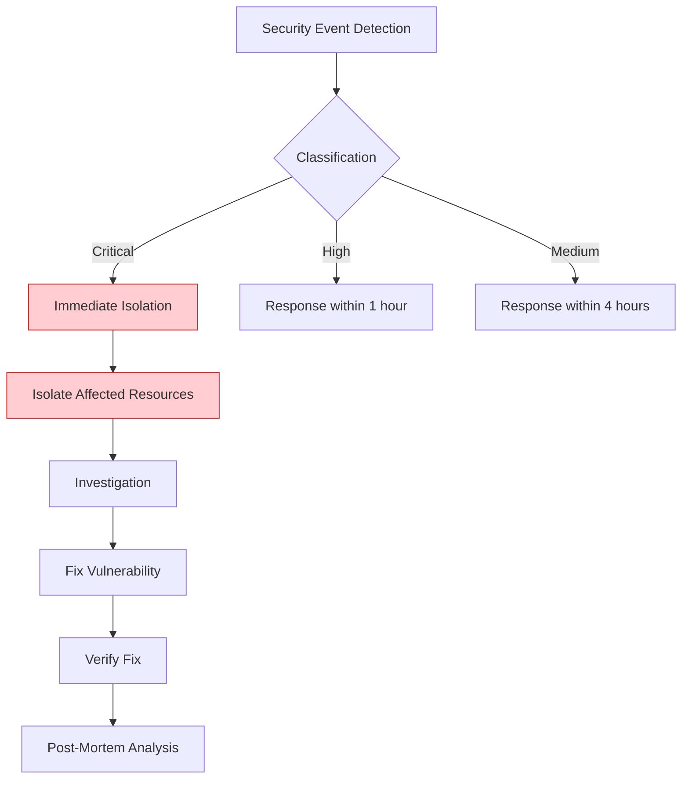

# Security & Privacy

> **Unit**: Knowledge/Advanced | **Prerequisites**: [05-state-management](05-state-management.md) | **Formalization Level**: L3-L4
>
> This document provides comprehensive security hardening guidelines for Flink stream processing systems, covering authentication, authorization, encryption, auditing, and compliance with security best practices.

---

## Table of Contents

- [Security \& Privacy](#security--privacy)
  - [Table of Contents](#table-of-contents)
  - [1. Definitions](#1-definitions)
    - [Def-K-16-01: Stream Processing Security](#def-k-16-01-stream-processing-security)
    - [Def-K-16-02: Authentication](#def-k-16-02-authentication)
    - [Def-K-16-03: Authorization](#def-k-16-03-authorization)
    - [Def-K-16-04: Encryption](#def-k-16-04-encryption)
    - [Def-K-16-05: Zero Trust Architecture](#def-k-16-05-zero-trust-architecture)
  - [2. Properties](#2-properties)
    - [Prop-K-16-01: Defense in Depth](#prop-k-16-01-defense-in-depth)
    - [Lemma-K-16-01: Encryption Overhead](#lemma-k-16-01-encryption-overhead)
  - [3. Relations](#3-relations)
    - [3.1 Security Control Dependencies](#31-security-control-dependencies)
    - [3.2 Compliance Mapping](#32-compliance-mapping)
  - [4. Argumentation](#4-argumentation)
    - [4.1 Why Zero Trust?](#41-why-zero-trust)
    - [4.2 Encryption Necessity](#42-encryption-necessity)
  - [5. Proof / Engineering Argument](#5-proof--engineering-argument)
    - [5.1 Authentication Configuration](#51-authentication-configuration)
    - [5.2 Authorization Patterns](#52-authorization-patterns)
    - [5.3 Data Encryption Implementation](#53-data-encryption-implementation)
  - [6. Examples](#6-examples)
    - [6.1 Kerberos Authentication](#61-kerberos-authentication)
    - [6.2 OAuth 2.0 Integration](#62-oauth-20-integration)
    - [6.3 TLS Configuration](#63-tls-configuration)
    - [6.4 Audit Logging](#64-audit-logging)
  - [7. Visualizations](#7-visualizations)
    - [7.1 Security Architecture](#71-security-architecture)
    - [7.2 Security Control Matrix](#72-security-control-matrix)
    - [7.3 Incident Response Flow](#73-incident-response-flow)
  - [8. References](#8-references)

---

## 1. Definitions

### Def-K-16-01: Stream Processing Security

**Stream Processing Security** is the process of configuring security controls, implementing best practices, and continuous monitoring to protect stream processing systems from unauthorized access, data breaches, and service disruption threats [^1][^2].

**Threat Model**:

```
┌─────────────────────────────────────────────────────────────────────┐
│                  Stream Processing Security Threat Model             │
├─────────────────────────────────────────────────────────────────────┤
│                                                                     │
│  Threat Categories                                                  │
│  ├── Data Security Threats                                          │
│  │    ├── Eavesdropping (Data in Transit)                          │
│  │    ├── Data Breach (Data at Rest)                               │
│  │    └── Tampering                                                │
│  │                                                                  │
│  ├── Access Control Threats                                         │
│  │    ├── Unauthorized Access                                      │
│  │    ├── Privilege Escalation                                     │
│  │    └── Credential Theft                                         │
│  │                                                                  │
│  ├── Infrastructure Threats                                         │
│  │    ├── Denial of Service (DoS)                                  │
│  │    ├── Man-in-the-Middle (MITM)                                 │
│  │    └── Configuration Exposure                                   │
│  │                                                                  │
│  └── Compliance Threats                                             │
│       ├── Data Sovereignty Violation                                │
│       ├── Privacy Regulation Breach (GDPR/CCPA)                    │
│       └── Audit Trail Gaps                                          │
│                                                                     │
└─────────────────────────────────────────────────────────────────────┘
```

**Security Control Framework**:

| Control Domain | Control Measure | Priority |
|----------------|-----------------|----------|
| Authentication | Identity verification mechanism | P0 |
| Authorization | Permission control | P0 |
| Encryption | Transit/At-rest encryption | P0 |
| Auditing | Logging and analysis | P1 |
| Isolation | Network/resource isolation | P1 |
| Monitoring | Security event detection | P1 |

---

### Def-K-16-02: Authentication

**Authentication** is the process of verifying the identity of users, services, or systems [^1]:

$$\text{Authenticate}: \text{Credentials} \times \text{IdentityStore} \to \{\text{Success}(Principal), \text{Failure}(Reason)\}$$

**Authentication Methods**:

| Method | Description | Use Case |
|--------|-------------|----------|
| Kerberos | Network authentication protocol | Enterprise Hadoop/Kafka |
| OAuth 2.0 | Token-based authorization | REST API access |
| mTLS | Mutual TLS authentication | Service-to-service |
| SAML | Federation identity | Enterprise SSO |

---

### Def-K-16-03: Authorization

**Authorization** defines what actions an authenticated principal can perform [^1]:

$$\text{Authorize}: \text{Principal} \times \text{Resource} \times \text{Action} \to \{\text{Allow}, \text{Deny}\}$$

**Authorization Models**:

| Model | Description | Example |
|-------|-------------|---------|
| RBAC | Role-Based Access Control | User has "operator" role |
| ABAC | Attribute-Based Access Control | Access based on time, location |
| ACL | Access Control Lists | Direct resource permissions |

---

### Def-K-16-04: Encryption

**Encryption** transforms data to prevent unauthorized access [^2]:

$$\text{Encrypt}: \text{Plaintext} \times \text{Key} \to \text{Ciphertext}$$
$$\text{Decrypt}: \text{Ciphertext} \times \text{Key} \to \text{Plaintext}$$

**Encryption Layers**:

| Layer | Scope | Protocol |
|-------|-------|----------|
| Transport | Network communication | TLS 1.3 |
| Application | REST API | HTTPS |
| Storage | Checkpoint/Savepoint | AES-256-GCM |
| Field-level | Sensitive columns | Application-level |

---

### Def-K-16-05: Zero Trust Architecture

**Zero Trust** is a security model that assumes breach and verifies every access request [^3]:

**Core Principles**:

1. **Never Trust, Always Verify**: Every access requires authentication
2. **Least Privilege**: Grant only necessary permissions
3. **Assume Breach**: Continuous monitoring and validation

**Implementation**:

```
Traditional Perimeter Model          Zero Trust Model
─────────────────────────          ────────────────

  Trusted          Untrusted        No Trust Zones
  Zone    │        Zone            ─────────────────
    │     │         │
    ▼     ▼         ▼               Every request
 ┌─────────────────────┐            verified
 │   ┌───────────┐     │
 │   │  Firewall │◄────┼────        No implicit trust
 │   └───────────┘     │            based on location
 │         │           │
 │    ┌────┴────┐      │            Micro-segmentation
 │    │ Internal│      │            per service
 │    │ Network │      │
 │    │  (Safe) │      │
 │    └─────────┘      │
 └─────────────────────┘
```

---

## 2. Properties

### Prop-K-16-01: Defense in Depth

**Statement**: Implementing multiple layers of security controls reduces unauthorized access risk by 99%+.

**Security Level Model**:

$$SecurityLevel = 1 - \prod_{i=1}^{n}(1 - p_i)$$

Where $p_i$ is the protection probability of layer $i$.

| Layer | Control | Protection Probability |
|-------|---------|----------------------|
| 1 | Network isolation | 70% |
| 2 | Authentication | 90% |
| 3 | Authorization | 85% |
| 4 | Encryption | 95% |
| 5 | Auditing | 80% |

Combined: $1 - (0.3 \times 0.1 \times 0.15 \times 0.05 \times 0.2) = 99.9955\%$

---

### Lemma-K-16-01: Encryption Overhead

**Statement**: TLS encryption typically impacts stream processing throughput by < 10%, within acceptable range.

**Factors affecting overhead**:

- CPU cost of encryption/decryption
- TLS handshake latency (amortized over long connections)
- Certificate validation

---

## 3. Relations

### 3.1 Security Control Dependencies



### 3.2 Compliance Mapping

| Compliance Requirement | Related Controls | Implementation |
|----------------------|------------------|----------------|
| GDPR Data Protection | Encryption, Access Control | End-to-end encryption, least privilege |
| SOC2 | Auditing, Monitoring | Complete audit logs |
| HIPAA | Isolation, Encryption | Dedicated clusters, TLS |
| PCI-DSS | Network isolation, Encryption | VPC, certificate management |

---

## 4. Argumentation

### 4.1 Why Zero Trust?

**Limitations of Traditional Perimeter Security**:

1. **Internal Threats**: Cannot protect against malicious insiders
2. **Microservice Boundaries**: Unclear boundaries in microservices
3. **Dynamic Environments**: IP-based trust fails in dynamic cloud environments

**Zero Trust Benefits**:

| Benefit | Description |
|---------|-------------|
| Reduced Attack Surface | Every service is independently secured |
| Lateral Movement Prevention | Compromised service cannot freely access others |
| Compliance Alignment | Meets modern regulatory requirements |

### 4.2 Encryption Necessity

**Data Transit Risks**:

- **Same VPC**: Can be monitored by other instances
- **Cross-AZ**: Traverses physical network, interception risk
- **Public Internet**: Fully exposed

**Data at Rest Risks**:

- Checkpoint storage accessible to admins
- Logs may contain sensitive information
- Backup data exposure

---

## 5. Proof / Engineering Argument

### 5.1 Authentication Configuration

**Pattern 1: Kerberos Authentication** [^1]

```yaml
# flink-conf.yaml - Kerberos configuration
security.kerberos.login.keytab: /etc/security/keytabs/flink.keytab
security.kerberos.login.principal: flink@EXAMPLE.COM
security.kerberos.login.use-ticket-cache: false
security.kerberos.login.contexts: Client,KafkaClient

# ZooKeeper authentication
high-availability.zookeeper.client.acl: creator
```

```java
// Java integration
import org.apache.flink.runtime.security.SecurityConfiguration;
import org.apache.flink.runtime.security.SecurityUtils;

public class KerberosFlinkJob {
    public static void main(String[] args) throws Exception {
        Configuration conf = new Configuration();

        conf.setString(SecurityOptions.KERBEROS_LOGIN_KEYTAB,
            "/etc/security/keytabs/flink.keytab");
        conf.setString(SecurityOptions.KERBEROS_LOGIN_PRINCIPAL,
            "flink@EXAMPLE.COM");

        SecurityUtils.install(new SecurityConfiguration(conf));

        StreamExecutionEnvironment env =
            StreamExecutionEnvironment.getExecutionEnvironment(conf);
        // Job logic...
    }
}
```

**Pattern 2: OAuth 2.0 / OIDC Integration**

```java
// Flink REST API OAuth2 integration
@Configuration
public class FlinkSecurityConfig {

    @Bean
    public SecurityWebFilterChain securityWebFilterChain(
        ServerHttpSecurity http
    ) {
        return http
            .authorizeExchange()
            .pathMatchers("/jobs/**", "/checkpoints/**").authenticated()
            .pathMatchers("/overview").permitAll()
            .and()
            .oauth2ResourceServer()
            .jwt()
            .and()
            .and()
            .build();
    }

    @Bean
    public ReactiveJwtDecoder jwtDecoder() {
        return ReactiveJwtDecoders.fromIssuerLocation(
            "https://auth.example.com"
        );
    }
}
```

**Pattern 3: Certificate Management**

```yaml
# cert-manager for automatic rotation
apiVersion: cert-manager.io/v1
kind: Certificate
metadata:
  name: flink-tls
  namespace: flink
spec:
  secretName: flink-tls-secret
  issuerRef:
    name: letsencrypt-prod
    kind: ClusterIssuer
  dnsNames:
    - flink-jobmanager.flink.svc.cluster.local
    - flink-webui.example.com
  duration: 2160h
  renewBefore: 360h
```

### 5.2 Authorization Patterns

**Pattern 1: RBAC Configuration**

```yaml
# Kubernetes RBAC
apiVersion: rbac.authorization.k8s.io/v1
kind: Role
metadata:
  name: flink-operator-role
  namespace: flink
rules:
  - apiGroups: ["flink.apache.org"]
    resources: ["flinkdeployments"]
    verbs: ["get", "list", "watch", "create", "update", "patch"]
  - apiGroups: [""]
    resources: ["pods", "services", "configmaps"]
    verbs: ["get", "list", "watch"]
```

**Pattern 2: Namespace Authorization**

```scala
class NamespaceAuthorizationPlugin extends SecurityPlugin {

    private var namespacePermissions: Map[String, Set[String]] = _

    override def initialize(config: Configuration): Unit = {
        namespacePermissions = loadPermissions()
    }

    override def authorize(
        user: String,
        action: Action,
        resource: Resource
    ): Boolean = {
        val namespace = extractNamespace(resource)
        val allowedActions = namespacePermissions.getOrElse(namespace, Set.empty)

        if (!allowedActions.contains(action.name)) {
            logSecurityEvent(user, action, resource, denied = true)
            throw new UnauthorizedException(
                s"User $user not authorized for $action on $resource"
            )
        }

        logSecurityEvent(user, action, resource, denied = false)
        true
    }
}
```

**Pattern 3: Kafka ACL Integration**

```bash
# Create Flink dedicated user
kafka-configs.sh --bootstrap-server kafka:9092 \
  --entity-type users --entity-name flink-producer \
  --alter --add-config 'SCRAM-SHA-256=[password=secret]'

# Authorize Flink to read topic
kafka-acls.sh --bootstrap-server kafka:9092 \
  --add --allow-principal User:flink-consumer \
  --operation Read --topic input-events \
  --group flink-consumer-group

# Authorize Flink to write topic
kafka-acls.sh --bootstrap-server kafka:9092 \
  --add --allow-principal User:flink-producer \
  --operation Write --topic output-results
```

### 5.3 Data Encryption Implementation

**Pattern 1: TLS/SSL Configuration** [^1]

```yaml
# flink-conf.yaml - TLS configuration
security.ssl.internal.enabled: true
security.ssl.internal.keystore: /opt/flink/certs/internal.keystore
security.ssl.internal.keystore-password: ${INTERNAL_KEYSTORE_PASSWORD}
security.ssl.internal.key-password: ${INTERNAL_KEY_PASSWORD}
security.ssl.internal.truststore: /opt/flink/certs/internal.truststore
security.ssl.internal.protocol: TLSv1.3

security.ssl.rest.enabled: true
security.ssl.rest.keystore: /opt/flink/certs/rest.keystore
security.ssl.algorithms: TLS_AES_256_GCM_SHA384,TLS_CHACHA20_POLY1305_SHA256
```

**Certificate Generation Script**:

```bash
#!/bin/bash
# Generate Flink internal certificates

FLINK_DOMAIN=${1:-"flink.internal"}
CA_KEY="ca-key.pem"
CA_CERT="ca-cert.pem"
KEYSTORE="flink.keystore"
TRUSTSTORE="flink.truststore"
PASSWORD=${FLINK_KEYSTORE_PASSWORD:-"$(openssl rand -base64 32)"}

# Generate CA
openssl req -new -x509 -keyout $CA_KEY -out $CA_CERT -days 365 \
  -subj "/CN=Flink Internal CA/O=Example Corp" \
  -passout pass:$PASSWORD

# Generate keystore
keytool -keystore $KEYSTORE -alias localhost -validity 365 -genkey -keyalg RSA \
  -storepass $PASSWORD -keypass $PASSWORD \
  -dname "CN=$FLINK_DOMAIN, O=Example Corp"

# Generate CSR and sign
certreq...

# Import certificate chain
keytool -keystore $KEYSTORE -alias CARoot -import -file $CA_CERT \
  -storepass $PASSWORD -noprompt

# Generate truststore
keytool -keystore $TRUSTSTORE -alias CARoot -import -file $CA_CERT \
  -storepass $PASSWORD -noprompt
```

**Pattern 2: Field-Level Encryption**

```scala
class FieldEncryptionFunction extends RichMapFunction[Event, Event] {

    @transient private var cipher: Cipher = _
    @transient private var keySpec: SecretKeySpec = _

    override def open(parameters: Configuration): Unit = {
        val keyBytes = loadKeyFromVault("encryption-key")
        keySpec = new SecretKeySpec(keyBytes, "AES")
        cipher = Cipher.getInstance("AES/GCM/NoPadding")
    }

    override def map(event: Event): Event = {
        val encryptedPii = encrypt(event.piiData)
        event.copy(
            piiData = encryptedPii,
            userId = event.userId,
            timestamp = event.timestamp
        )
    }

    private def encrypt(plainText: String): String = {
        cipher.init(Cipher.ENCRYPT_MODE, keySpec, generateIV())
        val encrypted = cipher.doFinal(plainText.getBytes("UTF-8"))
        Base64.getEncoder.encodeToString(encrypted)
    }
}
```

**Pattern 3: Checkpoint Encryption**

```java
Configuration conf = new Configuration();

conf.setBoolean(CheckpointingOptions.ENCRYPTION_ENABLED, true);
conf.setString(CheckpointingOptions.ENCRYPTION_ALGORITHM, "AES-256-GCM");
conf.setString(CheckpointingOptions.ENCRYPTION_KEY_PROVIDER, "kms");
conf.setString(CheckpointingOptions.ENCRYPTION_KEY_ID,
    "arn:aws:kms:us-west-2:123456789:key/abcd-1234");
```

---

## 6. Examples

### 6.1 Kerberos Authentication

Complete Kerberos setup for Flink cluster:

```bash
# 1. Create service principal
kadmin -q "addprinc -randkey flink/flink-jobmanager@EXAMPLE.COM"

# 2. Generate keytab
kadmin -q "ktadd -k flink.keytab flink/flink-jobmanager@EXAMPLE.COM"

# 3. Distribute keytab to all nodes
scp flink.keytab flink@taskmanager-1:/etc/security/keytabs/
scp flink.keytab flink@taskmanager-2:/etc/security/keytabs/

# 4. Configure Flink
# flink-conf.yaml
security.kerberos.login.keytab: /etc/security/keytabs/flink.keytab
security.kerberos.login.principal: flink/flink-jobmanager@EXAMPLE.COM
```

### 6.2 OAuth 2.0 Integration

```java
// Spring Security configuration for Flink REST API
@EnableWebSecurity
public class SecurityConfig {

    @Bean
    public SecurityFilterChain filterChain(HttpSecurity http) throws Exception {
        http
            .csrf().disable()
            .authorizeHttpRequests(auth -> auth
                .requestMatchers("/api/v1/jobs/**").hasRole("OPERATOR")
                .requestMatchers("/api/v1/checkpoints/**").hasRole("ADMIN")
                .requestMatchers("/api/v1/metrics").permitAll()
                .anyRequest().authenticated()
            )
            .oauth2ResourceServer(oauth2 -> oauth2
                .jwt(jwt -> jwt
                    .jwtAuthenticationConverter(jwtAuthConverter())
                )
            );
        return http.build();
    }

    @Bean
    public JwtAuthenticationConverter jwtAuthConverter() {
        JwtGrantedAuthoritiesConverter grantedAuthoritiesConverter =
            new JwtGrantedAuthoritiesConverter();
        grantedAuthoritiesConverter.setAuthoritiesClaimName("roles");
        grantedAuthoritiesConverter.setAuthorityPrefix("ROLE_");

        JwtAuthenticationConverter jwtAuthenticationConverter =
            new JwtAuthenticationConverter();
        jwtAuthenticationConverter.setJwtGrantedAuthoritiesConverter(
            grantedAuthoritiesConverter
        );
        return jwtAuthenticationConverter;
    }
}
```

### 6.3 TLS Configuration

**Complete TLS Setup**:

```yaml
# flink-conf.yaml

# Internal communication encryption
security.ssl.internal.enabled: true
security.ssl.internal.keystore: /opt/flink/certs/internal.keystore
security.ssl.internal.keystore-password: ${INTERNAL_KEYSTORE_PASSWORD}
security.ssl.internal.key-password: ${INTERNAL_KEY_PASSWORD}
security.ssl.internal.truststore: /opt/flink/certs/internal.truststore
security.ssl.internal.truststore-password: ${INTERNAL_TRUSTSTORE_PASSWORD}
security.ssl.internal.protocol: TLSv1.3

# REST API encryption
security.ssl.rest.enabled: true
security.ssl.rest.keystore: /opt/flink/certs/rest.keystore
security.ssl.rest.keystore-password: ${REST_KEYSTORE_PASSWORD}
security.ssl.rest.key-password: ${REST_KEY_PASSWORD}
security.ssl.rest.truststore: /opt/flink/certs/rest.truststore

# Strong cipher suites only
security.ssl.algorithms: TLS_AES_256_GCM_SHA384,TLS_CHACHA20_POLY1305_SHA256

# Enable hostname verification
security.ssl.internal.cert.fingerprint.check.enabled: true
```

### 6.4 Audit Logging

**Structured Audit Logger**:

```scala
case class AuditRecord(
    timestamp: Long,
    operation: String,
    user: String,
    jobId: String,
    taskId: String,
    subtaskIndex: Int,
    details: Map[String, String],
    result: String
)

class StructuredAuditLogger extends AuditLogger {
    private val logger = LoggerFactory.getLogger("AUDIT")

    def log(operation: Operation, ctx: RuntimeContext): Unit = {
        val record = AuditRecord(
            timestamp = System.currentTimeMillis(),
            operation = operation.name,
            user = getCurrentUser(),
            jobId = ctx.getJobID.toString,
            taskId = ctx.getTaskName,
            subtaskIndex = ctx.getIndexOfThisSubtask,
            details = getContextDetails(ctx),
            result = "SUCCESS"
        )
        logger.info("AUDIT_LOG: {}", toJson(record))
    }
}
```

**Falco Security Rules**:

```yaml
# Falco rules for Flink
- rule: Flink Unauthorized Access Attempt
  desc: Detect unauthorized access attempts to Flink Web UI
  condition: >
    spawned_process and
    (proc.name = "curl" or proc.name = "wget") and
    (proc.args contains ":8081" or proc.args contains "flink")
  output: >
    Unauthorized Flink access attempt
    user=%user.name command=%proc.cmdline
  priority: WARNING

- rule: Flink Sensitive Data Access
  desc: Detect access to sensitive checkpoint data
  condition: >
    open_read and
    (fd.name contains "checkpoint" or fd.name contains "savepoint") and
    not (user.name = "flink" or user.name = "root")
  output: >
    Unauthorized access to Flink checkpoint data
    user=%user.name file=%fd.name
  priority: CRITICAL
```

---

## 7. Visualizations

### 7.1 Security Architecture



### 7.2 Security Control Matrix



### 7.3 Incident Response Flow



---

## 8. References

[^1]: Apache Flink Documentation, "Security," 2025. <https://nightlies.apache.org/flink/flink-docs-stable/docs/deployment/security/>

[^2]: NIST, "Zero Trust Architecture," SP 800-207, 2020.

[^3]: OWASP, "Transport Layer Security Cheat Sheet," 2025. <https://cheatsheetseries.owasp.org/cheatsheets/Transport_Layer_Security_Cheat_Sheet.html>


---

*Document Version: v1.0 | Last Updated: 2026-04-10 | Status: Complete*
