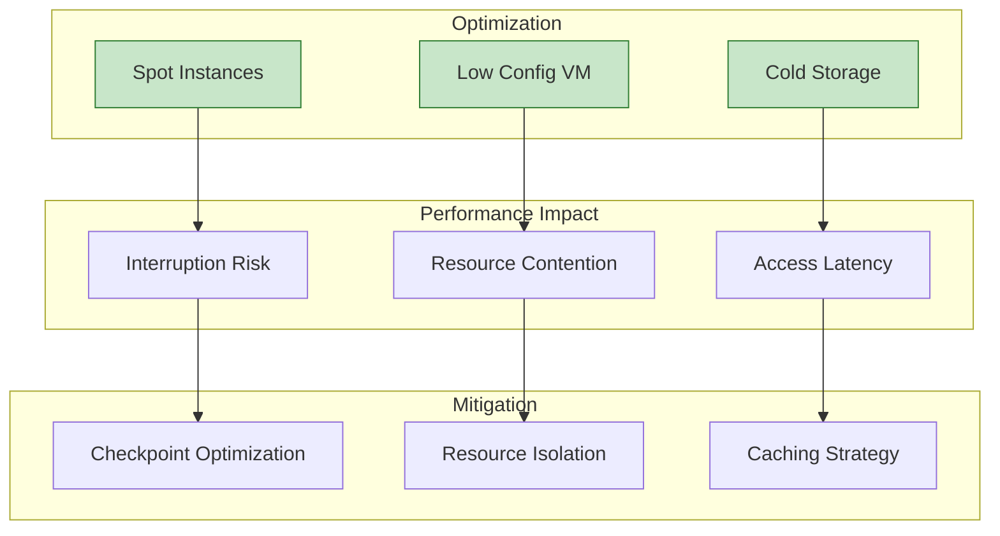
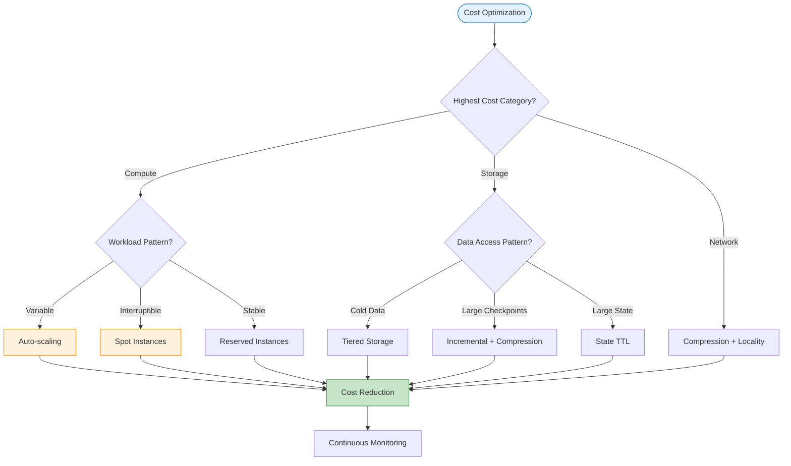
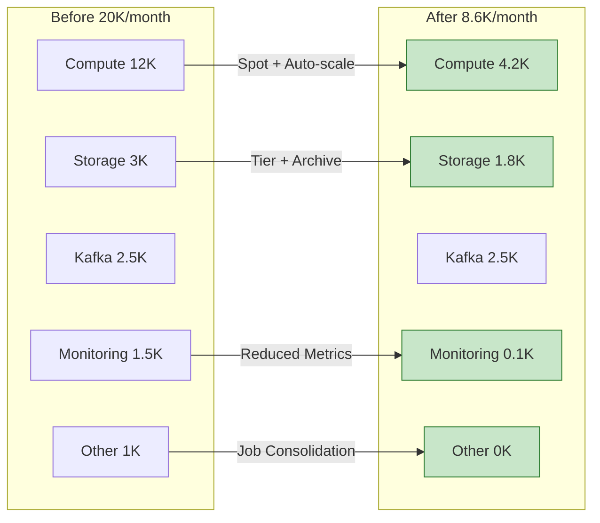

# Cost Optimization

> **Unit**: Knowledge/Advanced | **Prerequisites**: [05-state-management](05-state-management.md) | **Formalization Level**: L3
>
> This document provides comprehensive cost optimization strategies for stream processing systems in cloud environments, covering resource, storage, and compute cost optimization while maintaining service quality.

---

## Table of Contents

- [Cost Optimization](#cost-optimization)
  - [Table of Contents](#table-of-contents)
  - [1. Definitions](#1-definitions)
    - [Def-K-17-01: Cloud Cost Optimization](#def-k-17-01-cloud-cost-optimization)
    - [Def-K-17-02: Cost Components](#def-k-17-02-cost-components)
    - [Def-K-17-03: Resource Utilization](#def-k-17-03-resource-utilization)
    - [Def-K-17-04: Auto-scaling](#def-k-17-04-auto-scaling)
  - [2. Properties](#2-properties)
    - [Prop-K-17-01: Auto-scaling Cost Benefit](#prop-k-17-01-auto-scaling-cost-benefit)
    - [Lemma-K-17-01: Storage Tiering Cost Reduction](#lemma-k-17-01-storage-tiering-cost-reduction)
  - [3. Relations](#3-relations)
    - [3.1 Cost vs Performance Trade-offs](#31-cost-vs-performance-trade-offs)
    - [3.2 Optimization Strategy Matrix](#32-optimization-strategy-matrix)
  - [4. Argumentation](#4-argumentation)
    - [4.1 Resource Utilization Challenges](#41-resource-utilization-challenges)
    - [4.2 Pricing Model Selection](#42-pricing-model-selection)
  - [5. Proof / Engineering Argument](#5-proof-engineering-argument)
    - [5.1 Auto-scaling Implementation](#51-auto-scaling-implementation)
    - [5.2 Storage Optimization](#52-storage-optimization)
    - [5.3 Compute Cost Optimization](#53-compute-cost-optimization)
  - [6. Examples](#6-examples)
    - [6.1 Cost Optimization Case Study](#61-cost-optimization-case-study)
    - [6.2 Kubernetes HPA Configuration](#62-kubernetes-hpa-configuration)
    - [6.3 Spot Instance Deployment](#63-spot-instance-deployment)
    - [6.4 Storage Lifecycle Management](#64-storage-lifecycle-management)
  - [7. Visualizations](#7-visualizations)
    - [7.1 Cost Optimization Decision Tree](#71-cost-optimization-decision-tree)
    - [7.2 Before/After Cost Comparison](#72-beforeafter-cost-comparison)
  - [8. References](#8-references)

---

## 1. Definitions

### Def-K-17-01: Cloud Cost Optimization

**Cloud Cost Optimization** is the systematic approach to minimize cloud resource expenditure while maintaining service quality through proper resource configuration, pricing model selection, and architectural design [^1][^2].

**Cost Optimization Model**:

$$\text{TotalCost} = \text{Compute} + \text{Storage} + \text{Network} + \text{OtherServices}$$

**Cost Structure** [^1]:

```
┌─────────────────────────────────────────────────────────────────────┐
│                     Stream Processing Cost Structure                 │
├─────────────────────────────────────────────────────────────────────┤
│                                                                     │
│  Total Cost = Compute + Storage + Network + Other Services          │
│                                                                     │
│  ├── Compute (40-60%)                                               │
│  │    ├── VM/Container Instance Fees                                │
│  │    ├── Reserved/Spot Instances                                   │
│  │    └── Serverless Function Costs                                 │
│  │                                                                  │
│  ├── Storage (20-40%)                                               │
│  │    ├── Checkpoint Storage                                        │
│  │    ├── State Backend Storage (RocksDB)                          │
│  │    └── Message Queue Storage (Kafka)                            │
│  │                                                                  │
│  ├── Network (10-20%)                                               │
│  │    ├── Cross-AZ Traffic                                          │
│  │    ├── Public Egress                                             │
│  │    └── Storage Network I/O                                       │
│  │                                                                  │
│  └── Other Services (5-15%)                                         │
│       ├── Monitoring and Logging                                    │
│       ├── Load Balancing                                            │
│       └── Security Services                                         │
│                                                                     │
└─────────────────────────────────────────────────────────────────────┘
```

**Optimization Dimensions**:

| Dimension | Optimization Lever | Potential Savings |
|-----------|-------------------|-------------------|
| Resource Utilization | Eliminate idle, auto-scale | 20-40% |
| Pricing Model | Spot/reserved instances | 30-70% |
| Architecture | Tiered storage, compute separation | 20-50% |
| Data Lifecycle | Hot/cold tiering, expiration cleanup | 30-60% |

---

### Def-K-17-02: Cost Components

**Compute Cost**:

$$\text{ComputeCost} = \sum_{i} (N_i \times H_i \times P_i)$$

Where:

- $N_i$: Number of instances of type $i$
- $H_i$: Hours running per billing period
- $P_i$: Price per hour for instance type $i$

**Storage Cost**:

$$\text{StorageCost} = \sum_{j} (V_j \times R_j \times D_j)$$

Where:

- $V_j$: Volume of storage tier $j$
- $R_j$: Retention period in days
- $D_j$: Daily cost per unit volume

---

### Def-K-17-03: Resource Utilization

**Resource Utilization** is the ratio of actual resource usage to provisioned capacity:

$$\text{Utilization} = \frac{\text{ActualUsage}}{\text{ProvisionedCapacity}} \times 100\%$$

**Utilization Targets**:

| Resource Type | Target Utilization | Action if Below |
|--------------|-------------------|-----------------|
| CPU | 60-80% | Scale down or right-size |
| Memory | 70-85% | Adjust allocation |
| Disk I/O | 50-70% | Consider storage tier |
| Network | 40-60% | Optimize data transfer |

---

### Def-K-17-04: Auto-scaling

**Auto-scaling** dynamically adjusts resource capacity based on workload:

$$\text{Capacity}(t) = f(\text{Load}(t), \text{SLA}, \text{CostConstraints})$$

**Scaling Policies**:

| Policy | Description | Trigger |
|--------|-------------|---------|
| Target Tracking | Maintain metric at target | Deviation from target |
| Step Scaling | Add/remove fixed capacity | Threshold breach |
| Scheduled Scaling | Predefined changes | Time-based |
| Predictive Scaling | ML-based forecasting | Predicted load |

---

## 2. Properties

### Prop-K-17-01: Auto-scaling Cost Benefit

**Statement**: Auto-scaling can reduce compute costs by 30-60% in variable workload scenarios while meeting latency SLAs.

**Quantitative Model**:

Let load be $L(t)$, fixed capacity $C_{fixed}$, elastic capacity $C_{elastic}(t)$:

$$Cost_{fixed} = C_{fixed} \times T \times P$$
$$Cost_{elastic} = \int_{0}^{T} C_{elastic}(t) \times P \, dt$$

Where $C_{elastic}(t) = f(L(t))$ is a function of load.

When traffic variability $\sigma(L) > 0.3$:
$$\frac{Cost_{elastic}}{Cost_{fixed}} \approx 0.4 - 0.7$$

---

### Lemma-K-17-01: Storage Tiering Cost Reduction

**Statement**: Migrating cold data to object storage reduces storage costs by 80%+.

**Storage Pricing Comparison**:

| Storage Type | Price ($/GB/month) | Use Case |
|--------------|-------------------|----------|
| SSD Local Disk | $0.15-0.30 | Hot state |
| Cloud SSD | $0.10-0.20 | Hot state |
| Object Storage Standard | $0.02-0.03 | Checkpoint |
| Object Storage Infrequent | $0.01-0.015 | Historical data |
| Archive Storage | $0.001-0.005 | Compliance archive |

---

## 3. Relations

### 3.1 Cost vs Performance Trade-offs



### 3.2 Optimization Strategy Matrix

| Scenario | Compute Optimization | Storage Optimization | Network Optimization |
|----------|---------------------|---------------------|---------------------|
| High traffic variance | Auto-scaling | Hot/cold tiering | - |
| Batch processing | Spot instances | Object storage | - |
| Low latency requirement | Reserved instances | SSD local | Compression |
| Large state | Vertical scaling | Incremental checkpoint | - |
| Multi-region deployment | Region selection | Near storage | CDN |

---

## 4. Argumentation

### 4.1 Resource Utilization Challenges

**Why is resource utilization typically only 20-30%?**

**Root Causes**:

1. **Peak Provisioning**: Capacity provisioned for peak load, mostly idle
2. **Failure Redundancy**: Extra capacity for fault tolerance
3. **Lack of Monitoring**: Unaware of actual usage
4. **Configuration Inertia**: Set once, never adjusted

**Solution Example**:

```
Before Optimization: 10 instances × 24 hours × 30 days = 7200 instance-hours
After Optimization:  Average 4 instances × 24 hours × 30 days = 2880 instance-hours
Savings: (7200 - 2880) / 7200 = 60%
```

### 4.2 Pricing Model Selection

**Spot Instance Suitability** [^1]:

| Characteristic | Suitable For | Not Suitable For |
|---------------|--------------|------------------|
| Price advantage (30-90% discount) | Stateless TaskManager | JobManager |
| Interruptible | Fast-recovering jobs | Non-interruptible critical tasks |
| Capacity uncertainty | Elastic workloads | Fixed capacity requirements |

**Reserved vs On-Demand Break-even**:

```
Reserved Instance Break-even Point:
- 1-year reserved: Usage > 60% of time → savings
- 3-year reserved: Usage > 40% of time → savings

Calculation:
On-demand price = $0.20/hour
1-year reserved price = $0.12/hour (40% discount)
Break-even = 0.12 / 0.20 = 60%
```

---

## 5. Proof / Engineering Argument

### 5.1 Auto-scaling Implementation

**Pattern 1: Kubernetes HPA Configuration** [^2]

```yaml
# FlinkDeployment with HPA
apiVersion: flink.apache.org/v1beta1
kind: FlinkDeployment
metadata:
  name: autoscaling-job
spec:
  jobManager:
    resource:
      memory: "2Gi"
      cpu: 1
  taskManager:
    resource:
      memory: "4Gi"
      cpu: 2
    replicas: 2-10  # Elastic range

---
apiVersion: autoscaling/v2
kind: HorizontalPodAutoscaler
metadata:
  name: flink-tm-hpa
spec:
  scaleTargetRef:
    apiVersion: flink.apache.org/v1beta1
    kind: FlinkDeployment
    name: autoscaling-job
  minReplicas: 2
  maxReplicas: 10
  metrics:
    - type: Pods
      pods:
        metric:
          name: kafka_lag
        target:
          type: AverageValue
          averageValue: "1000"
    - type: Resource
      resource:
        name: cpu
        target:
          type: Utilization
          averageUtilization: 70
```

**Custom Scaling Logic**:

```scala
class ScalingController extends RichFunction {

    override def open(parameters: Configuration): Unit = {
        val kafkaLag = getRuntimeContext.getMetricGroup
            .gauge[Long, Gauge[Long]]("kafka-lag", () => fetchKafkaLag())

        val timer = new Timer()
        timer.scheduleAtFixedRate(new TimerTask {
            override def run(): Unit = evaluateScaling()
        }, 0, 60000)
    }

    def evaluateScaling(): Unit = {
        val lag = fetchKafkaLag()
        val processingRate = getCurrentProcessingRate()
        val currentParallelism = getRuntimeContext.getNumberOfParallelSubtasks

        // Target: process lag within 5 minutes
        val targetParallelism = math.ceil(
            lag / (processingRate * 300)
        ).toInt

        if (targetParallelism > currentParallelism * 1.5) {
            requestScaleUp(targetParallelism)
        } else if (targetParallelism < currentParallelism * 0.5) {
            requestScaleDown(math.max(2, targetParallelism))
        }
    }
}
```

**Pattern 2: Spot Instance Mixed Deployment** [^1]

```yaml
# AWS EKS mixed node groups
apiVersion: eksctl.io/v1alpha5
kind: ClusterConfig
metadata:
  name: flink-cluster
  region: us-west-2

managedNodeGroups:
  # Stable node group - JobManager and critical services
  - name: stable-ng
    instanceTypes: ["m5.large", "m5.xlarge"]
    minSize: 2
    maxSize: 4
    desiredCapacity: 2
    labels:
      node-type: stable
    taints:
      - key: dedicated
        value: jm
        effect: NoSchedule

  # Spot node group - TaskManager
  - name: spot-ng
    instanceTypes: ["m5.large", "m5.xlarge", "m5a.large", "m5a.xlarge"]
    spot: true
    minSize: 2
    maxSize: 20
    desiredCapacity: 5
    labels:
      node-type: spot
```

```java
// [伪代码片段 - 不可直接运行] 仅展示核心逻辑
// Flink configuration for Spot instance tolerance
Configuration conf = new Configuration();

// Faster checkpoint for interruption handling
conf.setLong(CheckpointingOptions.CHECKPOINTING_INTERVAL, 10000);
conf.setLong(CheckpointingOptions.MIN_PAUSE_BETWEEN_CHECKPOINTS, 5000);

// Local recovery for faster restart
conf.setBoolean(CheckpointingOptions.LOCAL_RECOVERY, true);

// Exponential delay restart strategy
conf.setString(RestartStrategyOptions.RESTART_STRATEGY, "exponential-delay");
conf.setString(RestartStrategyOptions.EXPONENTIAL_DELAY_INITIAL_BACKOFF, "10s");
conf.setString(RestartStrategyOptions.EXPONENTIAL_DELAY_MAX_BACKOFF, "60s");
```

**Pattern 3: Resource Specification Optimization**

```python
# Resource cost calculation tool
import json

class ResourceOptimizer:
    def __init__(self, pricing_data):
        self.pricing = pricing_data

    def calculate_optimal_config(self, requirements):
        """
        requirements: {
            'min_memory_gb': 4,
            'min_cpu': 2,
            'target_throughput': 100000,
            'state_size_gb': 10
        }
        """
        candidates = []

        for instance_type, price in self.pricing.items():
            if (instance_type.memory_gb >= requirements['min_memory_gb'] and
                instance_type.cpu >= requirements['min_cpu']):

                parallelism = self.estimate_parallelism(
                    instance_type, requirements
                )
                hourly_cost = price * parallelism

                candidates.append({
                    'instance_type': instance_type,
                    'parallelism': parallelism,
                    'hourly_cost': hourly_cost,
                    'cost_per_record': hourly_cost / requirements['target_throughput']
                })

        return sorted(candidates, key=lambda x: x['cost_per_record'])

    def estimate_parallelism(self, instance, requirements):
        memory_per_subtask = max(
            2, requirements['state_size_gb'] / 10 + 1
        )
        max_parallelism = instance.memory_gb / memory_per_subtask
        throughput_per_subtask = instance.cpu * 20000
        required_parallelism = requirements['target_throughput'] / throughput_per_subtask

        return int(max(2, min(max_parallelism, required_parallelism)))

# Usage
optimizer = ResourceOptimizer(pricing_data={
    'm5.large': 0.096,
    'm5.xlarge': 0.192,
    'm5.2xlarge': 0.384,
    'm6g.large': 0.077,
    'm6g.xlarge': 0.154
})

optimal = optimizer.calculate_optimal_config({
    'min_memory_gb': 4,
    'min_cpu': 2,
    'target_throughput': 100000,
    'state_size_gb': 20
})
```

### 5.2 Storage Optimization

**Pattern 1: Checkpoint Lifecycle Management**

```scala
class CheckpointLifecycleManager extends Trigger<Configuration> {

    override def open(parameters: Configuration): Unit = {
        val cleanupInterval = parameters.getLong(
            "checkpoint.cleanup.interval", 86400000
        )
        registerTimer(System.currentTimeMillis() + cleanupInterval)
    }

    override def onTimer(
        timestamp: Long,
        ctx: TriggerContext,
        out: Collector[Configuration]
    ): Unit = {
        val checkpointPath = ctx.getCheckpointPath
        val retentionDays = 7
        val cutoffTime = timestamp - (retentionDays * 86400000)

        cleanupOldCheckpoints(checkpointPath, cutoffTime)
        archiveImportantCheckpoints(checkpointPath)
        registerTimer(timestamp + cleanupInterval)
    }

    def cleanupOldCheckpoints(path: String, cutoff: Long): Unit = {
        val fs = FileSystem.get(new URI(path))
        val checkpointDir = new Path(path)

        fs.listStatus(checkpointDir).foreach { status =>
            if (status.getModificationTime < cutoff) {
                fs.delete(status.getPath, true)
                println(s"Deleted old checkpoint: ${status.getPath}")
            }
        }
    }
}
```

**Pattern 2: Tiered Storage Configuration**

```yaml
# flink-conf.yaml - Tiered storage optimization

# Checkpoint storage: Use low-cost object storage
state.checkpoint-storage: filesystem
checkpoints.dir: s3://flink-checkpoints-bucket/production/

# Local state: SSD local disk (high performance)
taskmanager.memory.managed.fraction: 0.5
taskmanager.memory.managed.size: 8gb

# Enable incremental checkpoint
state.backend.incremental: true
state.backend.local-recovery: true

# RocksDB compaction optimization
state.backend.rocksdb.compaction.style: LEVEL
state.backend.rocksdb.compaction.level.target-file-size-base: 64mb
```

**S3 Lifecycle Policy**:

```json
{
  "Rules": [
    {
      "ID": "FlinkCheckpointsLifecycle",
      "Status": "Enabled",
      "Filter": {
        "Prefix": "checkpoints/"
      },
      "Transitions": [
        {
          "Days": 1,
          "StorageClass": "STANDARD_IA"
        },
        {
          "Days": 30,
          "StorageClass": "GLACIER"
        }
      ],
      "Expiration": {
        "Days": 90
      }
    },
    {
      "ID": "FlinkSavepointsRetention",
      "Status": "Enabled",
      "Filter": {
        "Prefix": "savepoints/"
      },
      "Expiration": {
        "Days": 365
      }
    }
  ]
}
```

### 5.3 Compute Cost Optimization

**Pattern 1: Job Co-location and Resource Sharing**

```scala
class MultiSourceMergedJob {

    def buildJob(env: StreamExecutionEnvironment): Unit = {
        // Multiple sources share TaskManager resources
        val userEvents = env
            .addSource(new KafkaSource("user-events"))
            .assignTimestampsAndWatermarks(...)

        val orderEvents = env
            .addSource(new KafkaSource("order-events"))
            .assignTimestampsAndWatermarks(...)

        val logEvents = env
            .addSource(new KafkaSource("log-events"))
            .assignTimestampsAndWatermarks(...)

        // Shared user profile state
        val userProfileState = new BroadcastStream[UserProfile](...)

        // Unified processing
        userEvents
            .connect(userProfileState)
            .process(new UserEventProcessor())
            .addSink(new MultiSink("user-results"))

        orderEvents
            .connect(userProfileState)
            .process(new OrderEventProcessor())
            .addSink(new MultiSink("order-results"))

        // Savings: 2× JobManager cost eliminated
    }
}
```

**Pattern 2: Scheduled Elastic Scaling**

```yaml
apiVersion: batch/v1
kind: CronJob
metadata:
  name: flink-batch-scale
spec:
  schedule: "0 2 * * *"
  jobTemplate:
    spec:
      template:
        spec:
          containers:
            - name: scaler
              image: kubectl:latest
              command:
                - /bin/sh
                - -c
                - |
                  # Scale up before batch processing
                  kubectl scale flinkdeployment batch-job --replicas=20

                  # Wait for batch completion
                  kubectl wait --for=condition=Ready flinkdeployment/batch-job --timeout=3600s

                  # Scale down after batch
                  kubectl scale flinkdeployment batch-job --replicas=2
          restartPolicy: OnFailure
```

---

## 6. Examples

### 6.1 Cost Optimization Case Study

**Scenario**: E-commerce real-time analytics platform cost optimization

**Before Optimization Cost Structure**:

| Item | Monthly Cost | Percentage |
|------|-------------|------------|
| EMR Flink Cluster | $12,000 | 60% |
| S3 Checkpoint Storage | $3,000 | 15% |
| Kafka MSK | $2,500 | 12% |
| CloudWatch Monitoring | $1,500 | 8% |
| Other | $1,000 | 5% |
| **Total** | **$20,000** | **100%** |

**Optimization Measures**:

| Optimization | Before | After | Savings |
|-------------|--------|-------|---------|
| Spot instance ratio | 0% | 70% | $4,200 |
| Auto-scaling | Fixed 20 nodes | Elastic 5-20 | $3,600 |
| Checkpoint retention | 90 days | 7 days + archive | $1,200 |
| Job consolidation | 8 jobs | 3 jobs | $2,400 |

**After Optimization**: $8,600/month (57% savings)

### 6.2 Kubernetes HPA Configuration

Complete HPA setup for Flink on Kubernetes:

```yaml
apiVersion: flink.apache.org/v1beta1
kind: FlinkDeployment
metadata:
  name: autoscaled-pipeline
spec:
  image: flink:1.18
  flinkVersion: v1.18
  jobManager:
    resource:
      memory: "4Gi"
      cpu: 2
  taskManager:
    resource:
      memory: "8Gi"
      cpu: 4
    replicas: 3
---
apiVersion: autoscaling/v2
kind: HorizontalPodAutoscaler
metadata:
  name: flink-taskmanager-hpa
spec:
  scaleTargetRef:
    apiVersion: flink.apache.org/v1beta1
    kind: FlinkDeployment
    name: autoscaled-pipeline
  minReplicas: 2
  maxReplicas: 20
  metrics:
    - type: Resource
      resource:
        name: cpu
        target:
          type: Utilization
          averageUtilization: 70
    - type: Pods
      pods:
        metric:
          name: flink_taskmanager_job_task_operator_numRecordsInPerSecond
        target:
          type: AverageValue
          averageValue: "10000"
  behavior:
    scaleDown:
      stabilizationWindowSeconds: 300
      policies:
        - type: Percent
          value: 10
          periodSeconds: 60
    scaleUp:
      stabilizationWindowSeconds: 0
      policies:
        - type: Percent
          value: 100
          periodSeconds: 15
```

### 6.3 Spot Instance Deployment

**Mixed On-Demand and Spot Node Groups**:

```yaml
apiVersion: eksctl.io/v1alpha5
kind: ClusterConfig
metadata:
  name: production-flink
  region: us-west-2

managedNodeGroups:
  # On-demand for JobManager
  - name: jm-stable
    instanceType: m5.xlarge
    minSize: 2
    maxSize: 4
    desiredCapacity: 2
    labels:
      flink-role: jobmanager
    taints:
      - key: flink-role
        value: jobmanager
        effect: NoSchedule

  # Spot for TaskManager
  - name: tm-spot
    instanceTypes:
      - m5.2xlarge
      - m5a.2xlarge
      - m6g.2xlarge
    spot: true
    minSize: 3
    maxSize: 50
    desiredCapacity: 10
    labels:
      flink-role: taskmanager
```

**Flink Configuration for Spot Tolerance**:

```properties
# Faster checkpointing for interruption handling
execution.checkpointing.interval: 30s
execution.checkpointing.min-pause-between-checkpoints: 15s
execution.checkpointing.max-concurrent-checkpoints: 2

# Local recovery
state.backend.local-recovery: true

# Restart strategy
restart-strategy: exponential-delay
restart-strategy.exponential-delay.initial-backoff: 10s
restart-strategy.exponential-delay.max-backoff: 5min
restart-strategy.exponential-delay.backoff-multiplier: 2.0
```

### 6.4 Storage Lifecycle Management

**Automated Checkpoint Cleanup**:

```python
import boto3
from datetime import datetime, timedelta

def cleanup_old_checkpoints(bucket, prefix, retention_days):
    """
    Clean up Flink checkpoints older than retention period
    """
    s3 = boto3.client('s3')
    cutoff_date = datetime.now() - timedelta(days=retention_days)

    paginator = s3.get_paginator('list_objects_v2')

    deleted_count = 0
    deleted_size = 0

    for page in paginator.paginate(Bucket=bucket, Prefix=prefix):
        for obj in page.get('Contents', []):
            if obj['LastModified'].replace(tzinfo=None) < cutoff_date:
                # Delete old checkpoint
                s3.delete_object(Bucket=bucket, Key=obj['Key'])
                deleted_count += 1
                deleted_size += obj['Size']

    print(f"Deleted {deleted_count} objects, freed {deleted_size / 1e9:.2f} GB")
    return deleted_count, deleted_size

# Run cleanup
cleanup_old_checkpoints(
    bucket='flink-production-checkpoints',
    prefix='checkpoints/',
    retention_days=7
)
```

---

## 7. Visualizations

### 7.1 Cost Optimization Decision Tree



### 7.2 Before/After Cost Comparison



---

## 8. References

[^1]: AWS, "Cost Optimization Best Practices," 2025. <https://aws.amazon.com/architecture/cost-optimization/>

[^2]: Google Cloud, "FinOps Best Practices," 2025. <https://cloud.google.com/architecture/framework/cost-optimization>


---

*Document Version: v1.0 | Last Updated: 2026-04-10 | Status: Complete*
